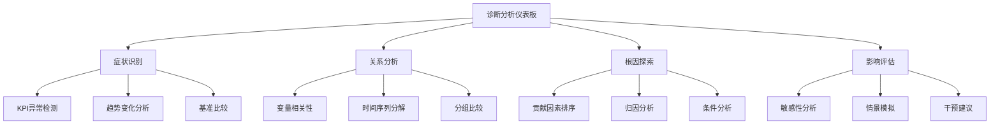

---
{"dg-publish":true,"tags":["商业分析","诊断性分析","根因分析","因果分析","相关性分析"],"创建日期":"2024-05-05","permalink":"/知识共享/002_商业分析/01_学习内容/03_分析方法与工具/3.2 诊断性分析方法/","dgPassFrontmatter":true}
---

# 3.2 诊断性分析方法

> [!quote] 概述
> 本文深入探讨诊断性分析的核心概念、方法论和应用实践。诊断性分析是商业分析的第二层次，旨在回答"为什么发生"的问题，通过深入挖掘数据之间的关系、模式和异常，找出商业问题的根本原因和影响因素。本文系统介绍各类诊断工具和技术，并通过案例展示如何将理论应用于实际业务场景。

## 1. 诊断性分析基础

### 1.1 诊断性分析的定义与价值

诊断性分析是商业分析体系中的第二层级，在描述性分析的基础上，进一步挖掘现象背后的原因和影响因素，回答"为什么发生了这种情况"的问题。

**权威定义对比**：

根据Gartner研究机构：
> "诊断性分析是对数据深入钻取的过程，以了解特定结果背后的原因。它通常用于识别行为模式和发现异常的原因。"

根据国际商业分析师协会(IIBA)：
> "诊断性分析关注数据之间的相互关系，用于确定影响业务结果的因素和潜在的因果关系。"

根据IBM商业分析研究院：
> "诊断性分析将描述性分析的'是什么'提升到'为什么'的层次，通过探究数据模式、依赖关系和交互作用，解释业务现象的根本原因。"

**诊断性分析的核心价值**：

1. **解释业务变化**：理解销售下滑、客户流失、成本上升等现象的根本原因
2. **识别影响因素**：确定哪些变量对关键业务指标有显著影响
3. **支持有针对性的行动**：基于根因分析制定更精准的干预措施
4. **防止问题重复发生**：通过理解根本原因而非仅处理表面症状
5. **优化资源分配**：将资源集中在真正影响业务成果的关键因素上

### 1.2 诊断性分析在分析体系中的位置

诊断性分析是连接描述性分析和预测性分析的关键环节：

**诊断性分析与其他分析类型的关系**：

- **与描述性分析的关系**：描述性分析发现异常和模式，诊断性分析解释这些异常和模式的成因
- **与预测性分析的关系**：诊断性分析识别影响因素，为预测性分析提供变量选择和模型设计依据
- **与规范性分析的关系**：诊断性分析明确因果链条，帮助规范性分析找到最有效的干预点

### 1.3 诊断性分析的应用场景

诊断性分析适用于多种商业环境和决策场景：

**核心应用场景**：

1. **业绩波动分析**：解释销售、利润、市场份额等关键指标的突变或趋势变化
2. **客户行为研究**：理解客户获取、转化、留存和流失背后的驱动因素
3. **产品质量问题**：找出产品缺陷、返修和客户投诉的根本原因
4. **运营效率优化**：识别流程瓶颈和效率低下的关键影响因素
5. **营销活动评估**：分析营销活动结果差异的原因，优化营销组合
6. **风险因素识别**：找出影响安全、合规、财务风险的关键变量

**行业特定应用**：

- **零售业**：销售表现波动分析、库存异常原因、促销效果差异解释
- **金融服务**：信用风险因素分析、交易欺诈模式识别、客户流失原因诊断
- **医疗健康**：患者结果变异分析、医疗成本差异解释、治疗方案效果比较
- **制造业**：质量问题根因分析、生产效率波动解释、供应链中断诊断
- **电信行业**：网络性能异常分析、客户满意度驱动因素、收入流失原因

## 2. 诊断分析核心方法

### 2.1 根因分析(Root Cause Analysis)

根因分析是一种系统性方法，用于识别问题的基础原因，而不仅仅是表面症状：

**主要根因分析技术**：

1. **5Why分析法**
   - **方法描述**：通过连续5次(或更多)提问"为什么"，深入发掘问题的根本原因
   - **适用场景**：简单到中等复杂度的问题，需要快速找到根本原因
   - **步骤流程**：
     1. 明确定义问题或症状
     2. 问第一个"为什么"—为什么会出现这个问题？
     3. 对第一个"为什么"的回答，继续问"为什么"
     4. 重复过程直到识别出真正的根本原因
     5. 确认最终原因是否真正基础且可控制
   - **优点**：简单直观，易于执行，不需要复杂工具
   - **局限性**：对于多因素复杂问题可能过于简化

2. **鱼骨图(石川图)**
   - **方法描述**：将问题作为"鱼头"，将可能的原因分类并作为"鱼骨"
   - **适用场景**：有多个可能原因类别的复杂问题
   - **常用原因类别**：
     - 制造业：人员、方法、机器、材料、测量、环境
     - 服务业：政策、流程、人员、系统、外部因素
   - **步骤流程**：
     1. 明确定义问题并放在"鱼头"位置
     2. 确定主要原因类别作为主"鱼骨"
     3. 通过头脑风暴确定每个类别下的具体原因
     4. 对关键原因进行深入分析
   - **优点**：结构化、可视化，支持团队协作
   - **局限性**：不直接表明因果关系强度和层次

3. **故障树分析(Fault Tree Analysis, FTA)**
   - **方法描述**：使用树状结构和逻辑门分析导致特定问题的各种因素组合
   - **适用场景**：安全关键系统、复杂流程失效分析
   - **核心要素**：
     - 顶级事件：需要分析的问题或故障
     - 逻辑门：AND门(所有子事件同时发生)和OR门(任一子事件发生)
     - 基本事件：不再进一步分解的根本原因
   - **步骤流程**：
     1. 定义顶级事件(问题)
     2. 确定直接导致顶级事件的中间事件
     3. 继续向下分解，直到达到基本事件
     4. 分析事件之间的逻辑关系
   - **优点**：明确表达因果关系的复杂逻辑组合
   - **局限性**：构建复杂，需要专业知识

4. **变更分析(Change Analysis)**
   - **方法描述**：比较问题发生前后的系统、环境或流程变化
   - **适用场景**：突发性问题，特别是之前运行正常的系统
   - **步骤流程**：
     1. 定义"之前"(问题发生前)和"之后"(问题发生后)的时间点
     2. 详细列出各方面可能的变化
     3. 评估每个变化与问题的潜在关联
     4. 确定最可能的因果关系
   - **优点**：高效识别新引入的问题因素
   - **局限性**：仅适用于有明确"之前正常"状态的问题

5. **barrier分析(Barrier Analysis)**
   - **方法描述**：分析为预防问题而设置的屏障/控制措施的失效原因
   - **适用场景**：安全事故、信息安全漏洞、质量控制失效
   - **步骤流程**：
     1. 确定目标和潜在危害
     2. 识别所有应该阻止问题的屏障
     3. 分析每个屏障如何失效或被绕过
     4. 确定屏障系统的根本缺陷
   - **优点**：适合评估控制系统有效性
   - **局限性**：主要适用于有预防措施的领域

**根因分析最佳实践**：

- **跨职能团队**：包含不同专业背景和视角的人员
- **数据驱动**：基于事实和数据，避免主观假设
- **系统思维**：考虑更广泛的系统和环境因素
- **区分症状和原因**：避免将中间结果误认为根本原因
- **验证假设**：通过数据或实验验证假设的因果关系

### 2.2 相关性分析(Correlation Analysis)

相关性分析用于衡量变量之间的关系强度和方向，是诊断分析的基础工具：

**主要相关性分析方法**：

1. **皮尔逊相关系数(Pearson Correlation)**
   - **方法描述**：测量两个连续变量之间的线性关系
   - **公式**：$r = \frac{\sum_{i=1}^{n} (x_i - \bar{x})(y_i - \bar{y})}{\sqrt{\sum_{i=1}^{n} (x_i - \bar{x})^2 \sum_{i=1}^{n} (y_i - \bar{y})^2}}$
   - **取值范围**：-1(完全负相关)到+1(完全正相关)
   - **适用场景**：满足正态分布假设的连续变量
   - **商业应用**：价格与销量关系、广告支出与收入、客户满意度与留存率
   - **解读示例**：
     - 强正相关(0.7-1.0)：培训时间与员工生产力
     - 弱正相关(0.3-0.5)：广告支出与品牌认知度
     - 强负相关(-0.7--1.0)：产品价格与销售量

2. **斯皮尔曼等级相关(Spearman's Rank Correlation)**
   - **方法描述**：测量两个变量的排序一致性
   - **适用场景**：非正态分布数据，有序分类变量
   - **优势**：对异常值不敏感，适用于非线性单调关系
   - **商业应用**：客户评分与复购率、产品特性排序与选择频率

3. **偏相关分析(Partial Correlation)**
   - **方法描述**：控制一个或多个变量后测量的相关性
   - **优势**：识别直接关系，排除中间变量影响
   - **适用场景**：多因素分析，控制混杂变量
   - **商业应用**：控制季节因素后的产品需求关系，控制收入后的消费行为分析

4. **交叉表与卡方分析(Crosstab & Chi-square)**
   - **方法描述**：分析两个分类变量之间的关联
   - **适用场景**：市场细分、客户特征分析、满意度调查
   - **关键指标**：
     - 观察频率与期望频率的对比
     - 卡方统计量和p值
     - Cramer's V系数(关联强度)
   - **商业应用**：客户细分与购买行为、地区与产品偏好

**相关性分析注意事项**：

- **相关不等于因果**：强相关性不一定表示因果关系
- **虚假相关**：可能存在第三变量同时影响两个相关变量
- **非线性关系**：传统相关系数可能无法捕捉非线性关系
- **异常值影响**：极端值可能显著影响相关系数
- **抽样限制**：样本偏差可能导致相关性估计不准确

### 2.3 方差分析(ANOVA)与假设检验

方差分析与假设检验是验证因素影响显著性的关键统计工具：

**主要方法**：

1. **单因素方差分析(One-way ANOVA)**
   - **方法描述**：比较三个或更多组的均值差异
   - **适用场景**：测试单一分类变量对连续变量的影响
   - **关键指标**：F统计量、p值、组间方差与组内方差
   - **商业应用**：
     - 比较不同市场或地区的销售绩效
     - 测试不同价格策略对转化率的影响
     - 评估不同营销渠道的客户获取成本差异

2. **双因素方差分析(Two-way ANOVA)**
   - **方法描述**：同时测试两个分类变量及其交互作用
   - **优势**：能检测因素交互效应
   - **适用场景**：多因素对比分析，识别交互影响
   - **商业应用**：
     - 分析产品类型和促销类型对销售的共同影响
     - 评估渠道和季节对客户获取成本的交互作用

3. **假设检验(t检验、Z检验等)**
   - **方法描述**：评估样本统计量与假设参数值的差异显著性
   - **常用类型**：
     - 单样本检验：与已知或目标值比较
     - 独立样本检验：比较两个独立组
     - 配对样本检验：比较同一主体前后变化
   - **商业应用**：
     - 测试新产品性能是否优于现有产品
     - 评估培训前后员工技能提升是否显著
     - 比较两种营销策略的转化率差异

4. **多重比较(Post-hoc Tests)**
   - **方法描述**：ANOVA后确定具体哪些组间存在显著差异
   - **常用方法**：Tukey HSD、Bonferroni、Scheffé
   - **适用场景**：需要精确定位组间差异的情况
   - **商业应用**：
     - 确定哪些客户细分具有显著不同的生命周期价值
     - 识别哪些产品特性对满意度有显著影响

**应用注意事项**：

- **数据假设**：正态分布、方差齐性等假设的验证
- **样本规模**：确保足够的样本量以获得可靠结论
- **多重比较问题**：当进行多次检验时控制总体错误率
- **统计显著性与实践意义**：区分统计上的显著差异与业务上的重要差异
- **效应量评估**：除p值外，也要关注效应大小 

### 2.4 回归分析(Regression Analysis)

回归分析是量化变量间关系的强大工具，在诊断分析中用于识别关键驱动因素：

**主要回归分析方法**：

1. **简单线性回归(Simple Linear Regression)**
   - **方法描述**：建立一个自变量与因变量之间的线性关系模型
   - **公式**：$Y = \beta_0 + \beta_1X + \varepsilon$
   - **关键指标**：
     - 斜率($\beta_1$)：自变量变化对因变量的影响程度
     - 截距($\beta_0$)：自变量为零时因变量的预期值
     - R²：模型解释的方差比例(拟合优度)
     - p值：系数显著性
   - **商业应用**：
     - 广告支出对销售的影响
     - 价格变化对需求量的影响
     - 客户满意度对留存率的影响

2. **多元线性回归(Multiple Linear Regression)**
   - **方法描述**：建立多个自变量与一个因变量的关系模型
   - **公式**：$Y = \beta_0 + \beta_1X_1 + \beta_2X_2 + ... + \beta_nX_n + \varepsilon$
   - **关键指标**：
     - 各变量系数($\beta_i$)：控制其他因素后的边际效应
     - 调整后R²：考虑变量数量的拟合优度
     - VIF(方差膨胀因子)：多重共线性检测
     - F统计量：整体模型显著性
   - **商业应用**：
     - 识别影响客户生命周期价值的多重因素
     - 分析多种营销投入对品牌认知度的综合影响
     - 评估多个产品特性对整体满意度的贡献

3. **逻辑回归(Logistic Regression)**
   - **方法描述**：建立自变量与二元结果概率的关系模型
   - **公式**：$log(\frac{p}{1-p}) = \beta_0 + \beta_1X_1 + ... + \beta_nX_n$
   - **关键指标**：
     - 回归系数：对数几率的变化
     - 优势比(Odds Ratio)：因素影响的相对风险
     - ROC曲线下面积：模型区分能力
   - **商业应用**：
     - 客户流失预测及驱动因素分析
     - 信用风险因素评估
     - 购买决策影响因素分析

4. **分层回归(Hierarchical Regression)**
   - **方法描述**：按步骤添加变量组，评估每组变量的增量贡献
   - **优势**：识别变量组的相对重要性
   - **商业应用**：
     - 分析人口统计、行为和态度因素对购买意向的层次影响
     - 评估内部因素和外部因素对业绩的相对贡献

**回归分析应用最佳实践**：

- **变量选择**：使用向前、向后或逐步法选择最相关变量
- **变量转换**：处理非线性关系(对数、平方等)
- **交互项分析**：评估因素间的协同或拮抗作用
- **稳健性检验**：使用不同样本或时间段验证结果稳定性
- **解释而非仅预测**：关注系数解释和实际意义
- **假设验证**：检查线性性、独立性、同方差性和正态性假设

### 2.5 分解分析(Decomposition Analysis)

分解分析将复杂现象分解为组成部分，便于诊断各组成部分的贡献：

**主要分解方法**：

1. **时间序列分解(Time Series Decomposition)**
   - **方法描述**：将时间序列数据分解为趋势、季节性和随机成分
   - **组成部分**：
     - 趋势成分：长期变化方向
     - 季节性成分：周期性模式
     - 周期性成分：非固定周期变化
     - 不规则成分：随机波动
   - **商业应用**：
     - 分析销售波动的季节因素与长期趋势
     - 识别业绩下滑是结构性还是暂时性
     - 剔除季节因素后评估新政策的实际影响

2. **差异分析(Variance Analysis)**
   - **方法描述**：分解计划值与实际值之间的差异原因
   - **常见类型**：
     - 价格差异：由价格变动导致的差异
     - 数量差异：由销售/使用量变动导致的差异
     - 组合差异：由产品/客户组合变化导致的差异
     - 效率差异：由单位成本/效率变化导致的差异
   - **商业应用**：
     - 预算与实际支出差异分析
     - 销售目标未达成原因分解
     - 利润率变化的驱动因素分析

3. **杜邦分析(DuPont Analysis)**
   - **方法描述**：将企业ROE(净资产收益率)分解为多个财务比率
   - **分解公式**：ROE = 净利润率 × 资产周转率 × 财务杠杆
   - **进一步分解**：
     - 净利润率 = 净利润/销售收入
     - 资产周转率 = 销售收入/总资产
     - 财务杠杆 = 总资产/股东权益
   - **商业应用**：
     - 诊断企业绩效下滑的具体因素
     - 识别改善ROE的关键杠杆
     - 与竞争对手相比的优势/劣势区域

4. **归因分析(Attribution Analysis)**
   - **方法描述**：确定多个触点或渠道对最终转化的贡献
   - **常见模型**：
     - 首次接触归因：将功劳归于首个接触点
     - 末次接触归因：将功劳归于最后接触点
     - 线性归因：平均分配功劳给所有接触点
     - 时间衰减：根据接近转化时间分配权重
     - 马尔可夫链模型：基于转化路径概率分配
   - **商业应用**：
     - 营销渠道效果评估
     - 客户转化路径分析
     - 广告预算优化决策支持

**分解分析应用建议**：

- **合理粒度**：选择适当的分解层次，既不过于粗略也不过于详细
- **结构化框架**：使用标准框架确保一致性和完整性
- **视觉化展示**：使用瀑布图等可视化工具展示分解结果
- **动态分析**：分析各组成部分随时间的变化趋势
- **行业基准比较**：与行业标准或竞争对手比较各组成部分 

## 3. 高级诊断分析方法

### 3.1 路径分析与结构方程模型

路径分析和结构方程模型(SEM)是研究复杂因果关系网络的高级方法：

**方法概述**：

1. **路径分析(Path Analysis)**
   - **定义**：扩展的多元回归，允许变量既作为自变量又作为因变量
   - **核心特点**：
     - 可视化因果关系链条
     - 分析直接效应与间接效应
     - 量化中介变量的作用
   - **关键指标**：
     - 路径系数：直接效应大小
     - 总效应：直接效应与间接效应之和
     - 模型拟合指数：评估整体模型与数据的匹配程度
   - **商业应用**：
     - 分析员工满意度→客户服务→客户满意度→利润的因果链
     - 评估营销活动→品牌认知→购买意向→销售的路径
     - 研究产品特性→感知价值→满意度→忠诚度的关系

2. **结构方程模型(Structural Equation Modeling)**
   - **定义**：整合因子分析和路径分析的统计技术
   - **核心特点**：
     - 处理潜在变量(不能直接测量的构念)
     - 测量误差的明确处理
     - 复杂理论模型的统计检验
   - **组成部分**：
     - 测量模型：连接观测变量与潜在变量
     - 结构模型：指定潜在变量间的关系
   - **关键指标**：
     - CFI, RMSEA, TLI等拟合指数
     - 标准化路径系数
     - 解释方差百分比
   - **商业应用**：
     - 消费者行为模型验证
     - 服务质量对客户忠诚度的影响路径
     - 组织因素对员工表现的结构性影响

**应用建议**：

- **理论驱动**：模型应基于稳固的理论基础构建
- **样本规模**：通常需要较大样本(200+)以获得稳定结果
- **变量选择**：包含所有相关变量，避免遗漏变量偏误
- **模型修正**：基于修正指数逐步优化模型，但需理论支持
- **替代模型比较**：评估多个理论模型的相对拟合优度

### 3.2 聚类与细分分析

聚类和细分分析帮助识别数据中的自然分组，发现群体间差异的原因：

**主要方法**：

1. **K-均值聚类(K-means Clustering)**
   - **方法描述**：将观测值分配到K个预定义的聚类中
   - **算法步骤**：
     1. 选择K个初始中心点
     2. 将每个观测值分配到最近的中心点
     3. 重新计算每个聚类的中心点
     4. 重复步骤2-3直至收敛
   - **关键决策点**：
     - 最佳K值的确定(肘部法则、轮廓系数等)
     - 距离度量的选择(欧氏距离、曼哈顿距离等)
     - 变量标准化方法
   - **商业应用**：
     - 客户细分及差异化策略制定
     - 产品组合分析
     - 销售区域聚类分析

2. **层次聚类(Hierarchical Clustering)**
   - **方法描述**：通过逐步合并或分割创建嵌套聚类结构
   - **类型**：
     - 凝聚型：自下而上合并
     - 分裂型：自上而下分割
   - **优势**：不需要预先指定聚类数量，提供层次结构
   - **商业应用**：
     - 产品层次化分类
     - 客户价值金字塔构建
     - 市场结构细分

3. **DBSCAN(基于密度的聚类)**
   - **方法描述**：基于密度连接点识别任意形状的聚类
   - **优势**：能识别噪声点，不需预设聚类数量
   - **适用场景**：不规则形状聚类，存在噪声数据
   - **商业应用**：
     - 识别异常交易模式
     - 地理位置相关的客户分析
     - 行为模式识别

**诊断应用策略**：

- **聚类特征分析**：详细分析各聚类的特征差异
- **差异显著性检验**：统计验证聚类间差异的显著性
- **细分驱动因素识别**：确定哪些变量最能区分聚类
- **商业影响评估**：分析不同聚类的业务价值和战略意义
- **动态聚类比较**：分析聚类结构随时间的变化

### 3.3 异常检测与离群分析

异常检测和离群分析用于识别数据中的异常模式，发现潜在问题或机会：

**主要方法**：

1. **统计方法**
   - **标准分数(Z-score)**：基于均值和标准差识别极端值
   - **四分位范围(IQR)**：基于四分位数识别离群值
   - **修正Z-分数(MAD)**：使用中位数和中位绝对偏差
   - **商业应用**：
     - 欺诈交易检测
     - 运营异常识别
     - 质量控制监控

2. **基于密度的方法**
   - **局部离群因子(LOF)**：比较对象密度与邻域密度
   - **DBSCAN离群检测**：将低密度区域点标记为离群
   - **商业应用**：
     - 客户行为异常模式识别
     - 网络安全威胁检测
     - 生产过程异常点识别

3. **基于模型的方法**
   - **回归残差分析**：找出拟合不佳的观测值
   - **隔离森林**：基于随机分区快速隔离异常点
   - **自编码器**：使用重建误差识别异常
   - **商业应用**：
     - 复杂系统性能监控
     - 多维数据异常检测
     - 时间序列异常模式识别

**诊断应用策略**：

- **上下文验证**：通过业务专家确认异常点的意义
- **根因分析衔接**：对关键异常点进行深入的根因分析
- **异常类型分类**：区分有用信号与数据问题
- **及时性考量**：建立实时异常检测系统
- **误报控制**：平衡检测敏感性与误报率

### 3.4 过程挖掘(Process Mining)

过程挖掘是一种数据驱动的流程分析方法，用于诊断流程问题和瓶颈：

**核心概念**：

1. **发现(Discovery)**
   - **方法描述**：从事件日志自动创建流程模型
   - **关键技术**：α算法、启发式挖掘、模糊挖掘
   - **商业应用**：
     - 理解实际执行的业务流程
     - 流程文档与实际执行的差距分析
     - 识别未知的流程变体

2. **一致性检查(Conformance Checking)**
   - **方法描述**：比较预期流程与实际执行的差异
   - **关键指标**：
     - 拟合度：事件日志中可重现的部分
     - 精确度：模型是否允许未观察到的行为
     - 泛化度：模型处理未来行为的能力
   - **商业应用**：
     - 合规性审计
     - 流程标准化评估
     - 识别流程偏差和例外

3. **增强(Enhancement)**
   - **方法描述**：利用事件数据改进或扩展流程模型
   - **类型**：
     - 修复：改进流程模型以更好反映现实
     - 扩展：添加新视角(时间、成本、资源等)
   - **商业应用**：
     - 流程瓶颈诊断
     - 资源分配优化
     - 流程变体的绩效对比 

**过程挖掘工具与技术**：

- **专业工具**：Disco, Celonis, UiPath Process Mining
- **开源选项**：ProM, bupaR, PM4Py
- **关键数据要求**：
  - 案例ID：流程实例标识
  - 活动名称：事件或活动类型
  - 时间戳：事件发生时间
  - 资源：执行活动的人员或系统

**诊断应用策略**：

- **端到端视图**：分析完整流程，而非孤立环节
- **变体分析**：对比不同流程变体的效率和结果
- **瓶颈识别**：定位流程延迟和等待时间集中的环节
- **资源分析**：评估资源利用率和分配效率
- **流程简化**：识别可能的冗余步骤和简化机会

## 4. 诊断分析可视化与呈现

### 4.1 因果分析可视化

有效的可视化工具对于呈现复杂的因果关系和诊断发现至关重要：

**主要可视化方法**：

1. **因果图(Causal Diagram)**
   - **描述**：使用节点和有向箭头表示变量间的因果关系
   - **类型**：
     - 有向无环图(DAG)
     - 贝叶斯网络图
   - **应用场景**：展示多变量因果网络，识别直接和间接影响
   - **设计最佳实践**：
     - 使用箭头粗细表示影响强度
     - 使用颜色编码区分正负影响
     - 添加变量之间的相关系数

2. **相关矩阵热图(Correlation Matrix Heatmap)**
   - **描述**：使用颜色强度表示变量间相关性大小的矩阵
   - **应用场景**：多变量相关性分析，识别变量群组
   - **设计最佳实践**：
     - 使用蓝红色方案表示正负相关
     - 对变量进行聚类排序，显示相关变量组
     - 标出统计显著性标记

3. **决策树可视化(Decision Tree Visualization)**
   - **描述**：树状图形表示决策规则和分支条件
   - **应用场景**：细分分析，条件影响分析
   - **设计最佳实践**：
     - 添加节点规模指示器
     - 使用颜色编码表示目标变量平均值
     - 限制树深度，确保可解释性

4. **影响图(Influence Diagram)**
   - **描述**：表示决策问题中变量、决策点和结果的图形
   - **应用场景**：复杂决策分析，不确定性建模
   - **设计最佳实践**：
     - 使用不同形状区分决策节点、几率节点和价值节点
     - 清晰标示信息流向
     - 添加定量影响估计

**通用可视化原则**：

- **简明性**：专注于关键因果关系，避免信息过载
- **层次结构**：允许从高层概况到详细分析的浏览
- **交互性**：支持筛选、钻取和假设检验
- **上下文**：提供基准和参考点进行比较
- **叙事性**：将视觉元素组织成连贯的分析故事

### 4.2 诊断分析仪表板设计

诊断分析仪表板需要特殊的设计考量，以支持深入探索和根因分析：

**关键设计元素**：

1. **概览与细节结构**
   - **顶层视图**：关键性能指标和异常摘要
   - **中间层**：关键变量间的关系和趋势
   - **详细层**：单一因素深入分析和原始数据

2. **交互式探索功能**
   - **筛选控件**：时间段、地区、产品线等维度选择
   - **钻取路径**：从症状到潜在原因的导航
   - **假设检验工具**：快速验证因果假设

3. **异常标识与警报**
   - **异常突出显示**：视觉标记关键偏差
   - **阈值指示器**：清晰显示正常范围和边界
   - **趋势警示**：标注显著趋势变化

4. **关联视图**
   - **级联更新**：一个视图的选择更新其他相关视图
   - **并列比较**：方便对比不同时期或细分市场
   - **注释功能**：支持协作分析和见解共享

**仪表板内容框架**：

**最佳实践**：

- **定制化设计**：针对特定用户角色和决策需求
- **渐进式披露**：由简单到复杂，循序渐进地展示信息
- **视觉层次**：使用大小、颜色和位置强调重要信息
- **统一的分析语言**：保持指标定义和计算方法的一致性
- **自助探索平衡**：提供足够灵活性，同时避免过度复杂

### 4.3 诊断分析报告结构

诊断分析报告需要清晰的结构来传达发现和推荐：

**标准报告框架**：

1. **执行摘要**
   - 核心问题概述
   - 主要发现摘要
   - 关键建议和下一步行动

2. **背景与目标**
   - 业务背景和相关趋势
   - 分析目标和关键问题
   - 预期成果和应用范围

3. **方法论**
   - 数据来源和质量评估
   - 分析方法选择理由
   - 关键假设和限制

4. **描述性分析**
   - 主要症状和现象描述
   - 关键数据点和统计摘要
   - 初步观察和模式

5. **诊断性分析**
   - 关系分析结果
   - 因果推断和证据链
   - 备选解释的评估

6. **根因确认**
   - 主要贡献因素
   - 证据权重分析
   - 交叉验证结果

7. **影响评估**
   - 量化业务影响
   - 敏感性和情景分析
   - 风险与不确定性评估

8. **建议与行动计划**
   - 干预优先级排序
   - 具体行动建议
   - 实施计划和预期成果

9. **附录**
   - 详细技术分析
   - 补充数据和图表
   - 术语表和参考资料

**有效报告的关键要素**：

- **叙事性结构**：使用商业故事讲述方式，而非技术报告
- **结论先行**：先提供关键结论，再支持数据和分析
- **可视化驱动**：使用图表和视觉元素支持关键点
- **不同层次**：为不同受众(高管、业务管理者、分析师)提供适当细节
- **行动导向**：明确指出分析结果的业务含义和后续步骤

## 5. 行业应用案例

### 5.1 零售业：亚马逊的客户流失诊断系统

**背景与挑战**：亚马逊需要理解Prime会员流失的根本原因，以提高会员保留率和生命周期价值。

**诊断分析方法**：

1. **相关性分析与细分**
   - 分析50多个潜在影响因素与会员流失的相关性
   - 使用K-means聚类识别高风险会员群体
   - 应用决策树分析确定流失预测的关键分支点

2. **生存分析**
   - 使用Cox比例风险模型分析不同因素对会员存续期的影响
   - 构建生存曲线比较不同会员细分和使用模式
   - 识别会员生命周期中的关键"危险点"

3. **路径分析**
   - 分析客户旅程中的关键转折点和体验差距
   - 评估不同服务接触点对整体满意度的贡献
   - 使用归因模型确定流失归因权重

**关键发现**：

- 会员流失与产品丰富度的相关性高于价格因素
   - 三个月内未使用Prime特定权益的会员流失风险增加280%
   - 内容消费种类每增加一种，流失风险降低43%
- 识别出三个高风险期：注册后45天、年度续费前30天、节假日购物高峰后
- 发现地域差异：农村会员对配送延迟的敏感度高于城市会员
- 多设备用户的留存率显著高于单设备用户

**业务影响**：

- 开发了预测性会员流失预警系统
- 根据流失风险因素定制的干预措施
- 对高风险会员实施个性化激活计划
- Prime会员保留率提高12%，生命周期价值增加23%

### 5.2 金融服务：花旗银行的信贷风险诊断

**背景与挑战**：花旗银行需要理解贷款违约率上升的根本原因，并改进风险评估模型。

**诊断分析方法**：

1. **因素分解分析**
   - 将违约率上升分解为客户组合变化和内部风险变化
   - 应用时间序列分解隔离季节性、周期性和趋势性因素
   - 使用方差分析比较不同地区和产品线的风险差异

2. **回归与路径分析**
   - 应用Logistic回归识别违约预测因子的变化
   - 构建结构方程模型分析宏观经济因素→财务压力→违约的路径
   - 比较新旧风险模型的预测因子差异

3. **生存分析**
   - 使用生存分析确定贷款生命周期中的关键风险点
   - 分析不同客户群体的违约时间分布
   - 评估早期预警指标的预测能力

**关键发现**：

- 违约率上升43%归因于客户获取渠道变化，而非内部风险评估模型失效
   - 数字渠道获客的信用表现差异较大，部分高风险细分被错误归类
- 发现传统评分卡未充分权衡的新风险因素：
   - 短期就业稳定性比长期就业历史更具预测力
   - 支出波动性成为比收入水平更重要的预测因子
- 识别出四个高风险客户细分，占总体17%但贡献62%的新增违约
- 确定了关键预警信号：连续两个月最低还款和非必要支出增加

**业务影响**：

- 调整了客户获取渠道策略和风险定价
- 重新设计违约预测模型，加入新识别的风险因子
- 实施细分特定的风险管理策略
- 新发放贷款的违约率下降28%，信贷损失减少4200万美元

### 5.3 医疗保健：克利夫兰诊所的手术成本差异分析

**背景与挑战**：克利夫兰诊所发现同类手术的成本和结果存在显著差异，需要诊断原因并标准化流程。

**诊断分析方法**：

1. **差异分解分析**
   - 将手术成本差异分解为时间、材料、人力和并发症成本
   - 分析不同术式和医生间的处理时间差异
   - 比较可替代耗材的成本效益比

2. **过程挖掘**
   - 从电子医疗记录挖掘实际手术流程变体
   - 比较高成本和低成本手术的流程差异
   - 识别与并发症相关的流程偏差

3. **统计建模**
   - 使用多元回归控制患者风险因素后分析成本差异
   - 应用随机森林算法识别成本预测的关键分支点
   - 构建贝叶斯网络模型理解因果关系网络

**关键发现**：

- 控制患者情况后，相同手术成本差异高达37%
   - 材料选择占差异的42%，流程变异占36%，医生习惯差异占22%
- 发现五种主要的流程变体，其中三种与更高并发症率显著相关
- 手术准备标准化程度与总成本呈负相关(r=-0.74)
- 团队固定程度对手术时间有显著影响：固定团队比变动团队平均快23分钟

**业务影响**：

- 开发基于最佳实践的标准手术流程
- 实施材料使用指南，标准化成本效益最高的选择
- 重新设计手术团队调度，提高团队稳定性
- 手术成本降低21%，并发症率下降17%，患者满意度提高8%

## 6. 实践与自我评估

### 6.1 诊断分析练习场景

**练习1：销售业绩下滑诊断**

假设你是一家零售企业的商业分析师，公司最近三个季度的销售额持续下滑。你需要进行诊断分析，找出潜在原因。

**可用数据**：
- 过去两年的销售交易数据(产品、价格、数量、日期、门店)
- 客户满意度调查结果
- 竞争对手价格和促销活动信息
- 营销支出和活动数据
- 经济指标和市场趋势数据

**任务**：
1. 设计诊断分析框架，列出潜在因素类别
2. 确定合适的分析方法和工具
3. 列出关键假设和需要验证的问题
4. 描述如何将各种因素的影响量化
5. 设计一个诊断分析仪表板结构

**练习2：客户流失原因分析**

假设你是一家SaaS公司的分析师，公司面临客户流失率上升的问题。你需要进行诊断分析，找出流失原因并提出干预建议。

**可用数据**：
- 客户使用行为数据(登录频率、使用功能、使用时长)
- 客户支持记录(问题类型、解决时间、满意度)
- 账户信息(套餐类型、价格、使用年限、公司规模)
- 产品更新历史和客户反馈
- 行业和竞争对手信息

**任务**：
1. 设计流失分析框架，确定可能的原因维度
2. 选择并解释适用的分析方法
3. 说明如何对客户进行细分，以识别高风险群体
4. 描述如何区分相关性和因果性
5. 设计一个流失预警系统的概念框架

### 6.2 自我评估问题

通过回答以下问题，评估你对诊断性分析方法的理解：

1. 诊断性分析与描述性分析的本质区别是什么？为什么这种区别在商业分析中很重要？

2. 5Why分析和鱼骨图分析各有什么优缺点？在什么情况下你会选择一种而非另一种？

3. 如何判断两个变量之间存在的是相关关系还是因果关系？请给出实际例子说明。

4. 在进行回归分析时，如何解释回归系数的实际业务含义？为什么这种解释很重要？

5. 什么情况下你会选择方差分析(ANOVA)而非简单的均值比较？请举例说明。

6. 路径分析和简单多元回归有什么区别？这种区别在诊断复杂业务问题时有何意义？

7. 时间序列分解如何帮助区分暂时性问题和结构性问题？请给出一个业务例子。

8. 在聚类分析后，如何判断聚类结果对业务的实际价值？什么样的聚类结果最有用？

9. 异常检测中如何平衡精确率和召回率？这一权衡在不同业务场景中如何变化？

10. 如何有效地向非技术决策者传达复杂的诊断分析结果？请描述具体策略和方法。

## 7. 延伸阅读与资源

### 7.1 推荐书籍

- Pearl, J., & Mackenzie, D. (2018). *The Book of Why: The New Science of Cause and Effect*. Basic Books.
- Albright, S. C., & Winston, W. L. (2019). *Business Analytics: Data Analysis and Decision Making*. Cengage Learning.
- Provost, F., & Fawcett, T. (2013). *Data Science for Business*. O'Reilly Media.
- Andersen, B., & Fagerhaug, T. (2006). *Root Cause Analysis: Simplified Tools and Techniques*. ASQ Quality Press.
- Roam, D. (2010). *The Back of the Napkin: Solving Problems and Selling Ideas with Pictures*. Portfolio.

### 7.2 在线资源

- Coursera: Root Cause Analysis (by University of Minnesota)
- edX: Statistical Inference and Modeling for Data Analysis (by Georgia Tech)
- DataCamp: Causal Inference with R
- Analytics Vidhya: Diagnostic Analytics Techniques and Case Studies
- KDnuggets: Process Mining Resources and Tutorials

### 7.3 工具与技术资源

- **统计分析工具**
  - R (car、lavaan、survival包)
  - Python (statsmodels、scikit-learn、lifelines)
  - SPSS 和 SAS (商业统计工具)

- **过程挖掘工具**
  - Disco
  - Celonis
  - ProM Framework (开源)

- **可视化工具**
  - Tableau (因果图和影响分析)
  - Power BI (诊断性仪表板)
  - Gephi (网络分析可视化)

- **线上社区**
  - Statistical Analysis Stack Exchange
  - Cross Validated (统计学习社区)
  - GitHub上的相关开源项目

## 8. 相关概念链接

- [[知识共享/002_商业分析/01_学习内容/03_分析方法与工具/3.1 描述性分析方法\|03_分析方法与工具/3.1 描述性分析方法]]
- [[知识共享/002_商业分析/01_学习内容/03_分析方法与工具/3.3 预测性分析方法\|03_分析方法与工具/3.3 预测性分析方法]]
- [[知识共享/002_商业分析/01_学习内容/02_数据收集与处理/2.1 数据收集与处理基础\|02_数据收集与处理/2.1 数据收集与处理基础]]
- [[03_分析方法与工具/3.5 Excel高级分析技巧\|03_分析方法与工具/3.5 Excel高级分析技巧]]
- [[知识共享/002_商业分析/01_学习内容/05_用户与需求分析/5.1 用户研究方法\|05_用户与需求分析/5.1 用户研究方法]] 