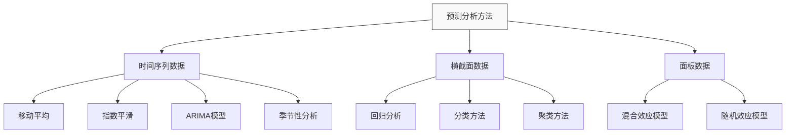
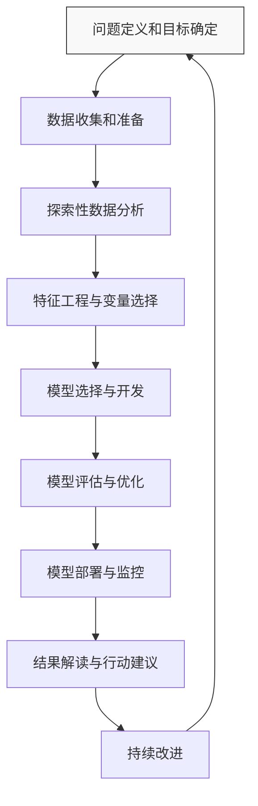

---
{"dg-publish":true,"tags":["商业分析","预测性分析","预测模型","时间序列","机器学习","回归分析"],"创建日期":"2024-05-10","permalink":"/知识共享/002_商业分析/01_学习内容/03_分析方法与工具/3.3 预测性分析方法/","dgPassFrontmatter":true}
---


# 3.3 预测性分析方法

> [!quote] 概述
> 预测性分析是商业分析的高级阶段，它使用历史数据、统计算法和机器学习技术来识别未来事件的可能性。本文详细介绍预测性分析的核心方法、技术路径、应用场景及实操指南，帮助分析师系统掌握预测分析技能，为业务决策提供前瞻性支持。

## 预测性分析基础

### 预测性分析的定义与价值

预测性分析(Predictive Analytics)是一种使用历史和当前数据来预测未来事件、行为和趋势的分析方法。它结合了统计学、数据挖掘、机器学习和人工智能技术，通过分析历史数据中的模式来预测未来可能的结果。

在商业环境中，预测性分析的核心价值体现在：

1. **前瞻性决策支持**：从被动响应转向主动预测和准备
2. **风险预警与管理**：提前识别潜在风险和业务机会
3. **资源优化配置**：基于预测结果合理分配有限资源
4. **个性化服务提升**：通过预测客户需求提供定制化体验
5. **持续改进循环**：建立预测-验证-调整的持续优化流程

### 预测性分析与其他分析类型的关系

```mermaid
graph LR
    A[描述性分析] -->|回答"发生了什么"| B[诊断性分析]
    B -->|回答"为什么发生"| C[预测性分析]
    C -->|回答"将会发生什么"| D[规范性分析]
    D -->|回答"应该做什么"| A
    
    style C fill:#ff9900,stroke:#333,stroke-width:2px
```

预测性分析在分析价值链中处于关键位置：

- **接收诊断性分析**结果，了解变量关系和因果机制
- **为规范性分析**提供未来可能情景，支持决策优化
- **增加分析的时间维度**，从过去和现在延伸到未来

### 预测性分析的前提与局限性

**前提条件**：
- 历史数据具有一定质量和数量
- 历史模式在某种程度上适用于未来
- 关键变量可以被测量和量化
- 预测时间范围应合理（预测范围越远，准确性通常越低）

**内在局限**：
- 无法完全预测人为干预和政策变化的影响
- 难以预测黑天鹅事件和极端情况
- 数据中的偏见会被模型放大并带入预测
- 过度拟合历史数据可能导致预测失真

## 预测性分析方法体系

预测性分析方法可以按照不同维度进行分类：

### 按数据类型分类



### 按技术复杂度分类

1. **基础统计方法**
   - 移动平均法
   - 指数平滑法
   - 简单线性回归

2. **中级统计方法**
   - 多元回归分析
   - 时间序列分析(ARIMA)
   - 逻辑回归

3. **高级机器学习方法**
   - 决策树与随机森林
   - 支持向量机
   - 神经网络与深度学习
   - 集成学习方法

### 按应用场景分类

1. **需求预测**：销售预测、资源需求预测
2. **风险预测**：违约风险、流失风险、欺诈风险
3. **行为预测**：客户行为、消费模式、使用习惯
4. **趋势预测**：市场趋势、技术发展、消费者偏好
5. **异常预测**：系统故障、质量问题、安全风险

## 核心预测方法详解

### 时间序列预测技术

时间序列预测是预测分析中最常用的方法之一，其核心是分析按时间顺序排列的数据点，识别时间模式，并进行外推。

#### 移动平均法

**原理**：使用过去n个时间段的平均值作为未来值的预测

**适用场景**：数据波动较小，无明显趋势和季节性

**计算步骤**：
1. 确定移动平均的时间窗口(n)
2. 计算每个时间窗口的平均值
3. 使用最近窗口的平均值预测下一个时间点

**Excel实现示例**：
- 使用AVERAGE函数：`=AVERAGE(B2:B6)`计算5天移动平均
- 使用更高级的预测函数：`=FORECAST(A8,B2:B7,A2:A7)`

**优缺点**：
- 优点：简单易用，易于理解，计算量小
- 缺点：对异常值敏感，不能捕捉趋势和季节性

#### 指数平滑法

**原理**：给予近期数据更高权重，而过去数据权重随时间指数衰减

**适用场景**：有轻微波动和趋势的数据，无明显季节性

**类型**：
- 简单指数平滑：适用于无趋势、无季节性数据
- 双指数平滑(Holt)：适用于有趋势、无季节性数据
- 三指数平滑(Holt-Winters)：适用于有趋势、有季节性数据

**实现公式**（简单指数平滑）：
$S_t = \alpha \times Y_t + (1-\alpha) \times S_{t-1}$
其中：$S_t$是t时刻的平滑值，$Y_t$是t时刻的实际观测值，$\alpha$是平滑系数(0<$\alpha$<1)

**Excel实现**：
使用DATA ANALYSIS工具包中的"指数平滑"功能，或使用公式手动计算

**最佳实践**：
- 选择合适的平滑常数α：较小的α对异常值更不敏感，较大的α对近期变化反应更敏感
- 通常从0.1到0.3的α值开始尝试，通过比较历史预测误差调整

#### ARIMA模型

**全称**：自回归整合移动平均模型(AutoRegressive Integrated Moving Average)

**组成部分**：
- AR(p)：自回归项，表示当前值与过去p个值的关系
- I(d)：差分项，通过d次差分使时间序列平稳化
- MA(q)：移动平均项，表示当前值与过去q个误差项的关系

**适用场景**：具有复杂时间依赖性的数据，尤其是经济和金融时间序列

**实施步骤**：
1. 检验时间序列的平稳性(使用ADF测试)
2. 如不平稳，进行差分处理
3. 确定ARIMA模型的参数(p,d,q)，可使用自相关图(ACF)和偏自相关图(PACF)
4. 拟合模型，检验残差
5. 使用模型进行预测

**常用变体**：
- SARIMA：加入季节性成分
- ARIMAX：加入外部变量
- GARCH：处理波动率变化

**实现工具**：
- Python：statsmodels、pmdarima(自动ARIMA)
- R：forecast包
- 高级BI工具：如Power BI的预测功能

## 预测性分析实施流程

### 完整的预测分析项目流程



### 预测模型评估与选择

评估预测模型的常用指标：

**回归预测指标**：
- 均方误差(MSE)
- 均方根误差(RMSE)
- 平均绝对误差(MAE)
- 平均绝对百分比误差(MAPE)
- 决定系数(R²) 