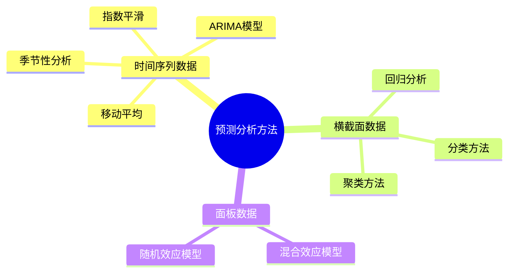
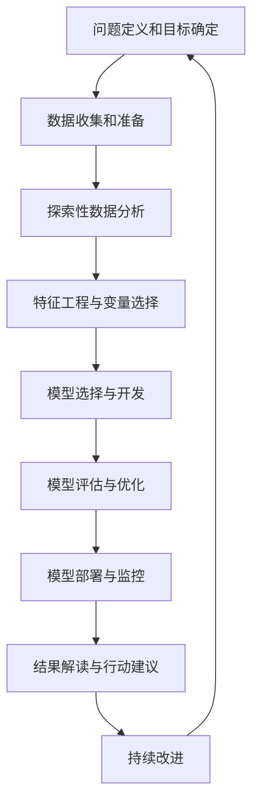

---
{"dg-publish":true,"tags":["商业分析","预测分析","预测模型","时间序列","机器学习"],"创建日期":"2024-04-27","permalink":"/知识共享/002_商业分析/01_学习内容/03_分析方法与工具/3.3 预测性分析方法/","dgPassFrontmatter":true}
---


# 3.3 预测性分析方法

> [!quote] 概述
> 预测性分析是商业分析的高级阶段，它使用历史数据、统计算法和机器学习技术来识别未来事件的可能性。本文详细介绍预测性分析的核心方法、技术路径、应用场景及实操指南，帮助分析师系统掌握预测分析技能，为业务决策提供前瞻性支持。

## 预测性分析基础

### 预测性分析的定义与价值

预测性分析(Predictive Analytics)是一种使用历史和当前数据来预测未来事件、行为和趋势的分析方法。它结合了统计学、数据挖掘、机器学习和人工智能技术，通过分析历史数据中的模式来预测未来可能的结果。

在商业环境中，预测性分析的核心价值体现在：

1. **前瞻性决策支持**：从被动响应转向主动预测和准备
2. **风险预警与管理**：提前识别潜在风险和业务机会
3. **资源优化配置**：基于预测结果合理分配有限资源
4. **个性化服务提升**：通过预测客户需求提供定制化体验
5. **持续改进循环**：建立预测-验证-调整的持续优化流程

### 预测性分析与其他分析类型的关系

```mermaid
graph LR
    A[描述性分析] -->|回答"发生了什么"| B[诊断性分析]
    B -->|回答"为什么发生"| C[预测性分析]
    C -->|回答"将会发生什么"| D[规范性分析]
    D -->|回答"应该做什么"| A
    style C fill:#ff9900,stroke:#333,stroke-width:2px
```

预测性分析在分析价值链中处于关键位置：

- **接收诊断性分析**结果，了解变量关系和因果机制
- **为规范性分析**提供未来可能情景，支持决策优化
- **增加分析的时间维度**，从过去和现在延伸到未来

### 预测性分析的前提与局限性

**前提条件**：
- 历史数据具有一定质量和数量
- 历史模式在某种程度上适用于未来
- 关键变量可以被测量和量化
- 预测时间范围应合理（预测范围越远，准确性通常越低）

**内在局限**：
- 无法完全预测人为干预和政策变化的影响
- 难以预测黑天鹅事件和极端情况
- 数据中的偏见会被模型放大并带入预测
- 过度拟合历史数据可能导致预测失真

## 预测性分析方法体系

预测性分析方法可以按照不同维度进行分类：

### 按数据类型分类



### 按技术复杂度分类

1. **基础统计方法**
   - 移动平均法
   - 指数平滑法
   - 简单线性回归

2. **中级统计方法**
   - 多元回归分析
   - 时间序列分析(ARIMA)
   - 逻辑回归

3. **高级机器学习方法**
   - 决策树与随机森林
   - 支持向量机
   - 神经网络与深度学习
   - 集成学习方法

### 按应用场景分类

1. **需求预测**：销售预测、资源需求预测
2. **风险预测**：违约风险、流失风险、欺诈风险
3. **行为预测**：客户行为、消费模式、使用习惯
4. **趋势预测**：市场趋势、技术发展、消费者偏好
5. **异常预测**：系统故障、质量问题、安全风险

## 核心预测方法详解

### 时间序列预测技术

时间序列预测是预测分析中最常用的方法之一，其核心是分析按时间顺序排列的数据点，识别时间模式，并进行外推。

#### 移动平均法

**原理**：使用过去n个时间段的平均值作为未来值的预测

**适用场景**：数据波动较小，无明显趋势和季节性

**计算步骤**：
1. 确定移动平均的时间窗口(n)
2. 计算每个时间窗口的平均值
3. 使用最近窗口的平均值预测下一个时间点

**Excel实现示例**：
- 使用AVERAGE函数：`=AVERAGE(B2:B6)`计算5天移动平均
- 使用更高级的预测函数：`=FORECAST(A8,B2:B7,A2:A7)`

**优缺点**：
- 优点：简单易用，易于理解，计算量小
- 缺点：对异常值敏感，不能捕捉趋势和季节性

#### 指数平滑法

**原理**：给予近期数据更高权重，而过去数据权重随时间指数衰减

**适用场景**：有轻微波动和趋势的数据，无明显季节性

**类型**：
- 简单指数平滑：适用于无趋势、无季节性数据
- 双指数平滑(Holt)：适用于有趋势、无季节性数据
- 三指数平滑(Holt-Winters)：适用于有趋势、有季节性数据

**实现公式**（简单指数平滑）：
$S_t = \alpha \times Y_t + (1-\alpha) \times S_{t-1}$
其中：$S_t$是t时刻的平滑值，$Y_t$是t时刻的实际观测值，$\alpha$是平滑系数(0<$\alpha$<1)

**Excel实现**：
使用DATA ANALYSIS工具包中的"指数平滑"功能，或使用公式手动计算

**最佳实践**：
- 选择合适的平滑常数α：较小的α对异常值更不敏感，较大的α对近期变化反应更敏感
- 通常从0.1到0.3的α值开始尝试，通过比较历史预测误差调整

#### ARIMA模型

**全称**：自回归整合移动平均模型(AutoRegressive Integrated Moving Average)

**组成部分**：
- AR(p)：自回归项，表示当前值与过去p个值的关系
- I(d)：差分项，通过d次差分使时间序列平稳化
- MA(q)：移动平均项，表示当前值与过去q个误差项的关系

**适用场景**：具有复杂时间依赖性的数据，尤其是经济和金融时间序列

**实施步骤**：
1. 检验时间序列的平稳性(使用ADF测试)
2. 如不平稳，进行差分处理
3. 确定ARIMA模型的参数(p,d,q)，可使用自相关图(ACF)和偏自相关图(PACF)
4. 拟合模型，检验残差
5. 使用模型进行预测

**常用变体**：
- SARIMA：加入季节性成分
- ARIMAX：加入外部变量
- GARCH：处理波动率变化

**实现工具**：
- Python：statsmodels、pmdarima(自动ARIMA)
- R：forecast包
- 高级BI工具：如Power BI的预测功能

### 回归分析预测

回归分析通过建立预测变量(自变量)与目标变量(因变量)之间的关系模型来进行预测。

#### 线性回归

**原理**：假设因变量与自变量之间存在线性关系，通过最小二乘法确定最优拟合线

**适用场景**：
- 自变量与因变量关系近似线性
- 需要解释变量影响程度
- 数据量适中

**实施步骤**：
1. 数据准备与探索
2. 变量选择(可使用向前/向后/逐步选择法)
3. 构建模型
4. 模型评估(R²、调整R²、RMSE等)
5. 模型优化
6. 使用模型预测

**Excel实现**：
- 使用LINEST函数：`=LINEST(Y范围,X范围,TRUE,TRUE)`
- 使用DATA ANALYSIS工具包中的"回归"功能

**Python示例**：
```python
import pandas as pd
from sklearn.linear_model import LinearRegression
from sklearn.model_selection import train_test_split

# 准备数据
X = df[['价格', '营销支出', '竞品价格']]
y = df['销量']

# 分割训练集和测试集
X_train, X_test, y_train, y_test = train_test_split(X, y, test_size=0.2)

# 构建模型
model = LinearRegression()
model.fit(X_train, y_train)

# 预测
y_pred = model.predict(X_test)

# 评估模型
from sklearn.metrics import r2_score, mean_squared_error
print(f"R²: {r2_score(y_test, y_pred)}")
print(f"RMSE: {mean_squared_error(y_test, y_pred, squared=False)}")
```

**注意事项**：
- 检查线性假设、正态性和同方差性
- 处理多重共线性问题
- 警惕极端值和杠杆点的影响

#### 逻辑回归

**原理**：预测因变量为二分类的概率，通过逻辑函数将线性组合映射到[0,1]区间

**适用场景**：
- 预测事件发生概率
- 客户流失预测
- 信用风险评估
- 转化率预测

**实施步骤**：
1. 数据准备与平衡
2. 特征选择和工程
3. 构建模型
4. 选择截断阈值
5. 评估模型(AUC、准确率、精确率、召回率)
6. 使用模型预测概率

**Python实现**：
```python
from sklearn.linear_model import LogisticRegression
from sklearn.metrics import classification_report, roc_auc_score

# 构建模型
model = LogisticRegression(max_iter=1000)
model.fit(X_train, y_train)

# 预测概率
y_prob = model.predict_proba(X_test)[:,1]
# 预测类别
y_pred = model.predict(X_test)

# 评估
print(f"AUC: {roc_auc_score(y_test, y_prob)}")
print(classification_report(y_test, y_pred))
```

**业务应用示例**：
- 客户流失预测：识别有流失风险的客户，并计算流失概率
- 贷款违约风险：评估申请人的贷款违约概率
- 营销响应预测：预测客户对营销活动的响应概率

### 机器学习预测方法

随着数据量增加和计算能力提升，机器学习方法在预测分析中的应用越来越广泛。

#### 决策树与随机森林

**决策树原理**：通过递归分割数据集，构建一个树状模型，每个内部节点代表一个特征测试，每个叶节点代表一个预测结果

**随机森林原理**：集成多棵决策树的预测结果，通过随机选择样本和特征增加多样性

**适用场景**：
- 特征之间存在复杂非线性关系
- 需要处理混合类型特征
- 需要特征重要性解释

**优势**：
- 处理分类和回归问题
- 对异常值不敏感
- 无需假设数据分布
- 可提供特征重要性

**Python实现**：
```python
from sklearn.ensemble import RandomForestRegressor
from sklearn.model_selection import GridSearchCV

# 构建模型
rf = RandomForestRegressor(random_state=42)

# 参数优化
param_grid = {
    'n_estimators': [100, 200, 300],
    'max_depth': [None, 10, 20, 30],
    'min_samples_split': [2, 5, 10]
}

grid_search = GridSearchCV(rf, param_grid, cv=5, scoring='neg_mean_squared_error')
grid_search.fit(X_train, y_train)

# 最佳模型
best_rf = grid_search.best_estimator_

# 特征重要性
importances = best_rf.feature_importances_
```

**商业应用示例**：
- 销售预测：预测不同地区、渠道、产品的销售量
- 客户价值预测：预测客户未来价值和购买频率
- 库存优化：预测不同SKU的需求量

#### 神经网络与深度学习

**原理**：模拟人脑神经元网络，通过多层感知器处理输入，每个神经元对输入进行加权和非线性变换

**适用场景**：
- 复杂非线性关系建模
- 大数据集
- 图像、文本、时间序列预测
- 需要捕捉深层抽象特征

**典型架构**：
- 前馈神经网络：基础架构，适用于表格数据
- 卷积神经网络(CNN)：处理图像和空间数据
- 循环神经网络(RNN)/LSTM：处理序列和时间序列数据
- 自编码器：降维和异常检测

**Python实现**：
```python
import tensorflow as tf
from tensorflow.keras.models import Sequential
from tensorflow.keras.layers import Dense, Dropout

# 构建模型
model = Sequential([
    Dense(64, activation='relu', input_shape=(X_train.shape[1],)),
    Dropout(0.2),
    Dense(32, activation='relu'),
    Dropout(0.2),
    Dense(1)  # 回归问题
])

# 编译模型
model.compile(optimizer='adam', loss='mse', metrics=['mae'])

# 训练模型
history = model.fit(
    X_train, y_train,
    validation_split=0.2,
    epochs=100,
    batch_size=32,
    callbacks=[tf.keras.callbacks.EarlyStopping(patience=10)]
)

# 预测
y_pred = model.predict(X_test)
```

**应用注意事项**：
- 需要较大数据集
- 特征缩放很重要
- 容易过拟合，需要正则化和早停
- 超参数调优复杂
- 解释性较差
- 计算资源要求高

#### 集成学习方法

**原理**：组合多个基础模型的预测结果，通过"群体智慧"提高预测性能

**主要类型**：
- Bagging：如随机森林，通过并行训练多个模型减少方差
- Boosting：如XGBoost、LightGBM，通过序列训练模型减少偏差
- Stacking：将多个不同类型模型的预测结果作为新特征训练元模型

**XGBoost优势**：
- 处理速度快
- 正则化能力强
- 内置处理缺失值
- 支持并行计算
- 预测性能优异

**Python实现**：
```python
import xgboost as xgb
from sklearn.model_selection import RandomizedSearchCV

# XGBoost模型
xgb_model = xgb.XGBRegressor(objective='reg:squarederror', random_state=42)

# 参数优化
param_dist = {
    'n_estimators': [100, 200, 300, 500],
    'learning_rate': [0.01, 0.05, 0.1, 0.2],
    'max_depth': [3, 5, 7, 9],
    'subsample': [0.6, 0.7, 0.8, 0.9, 1.0],
    'colsample_bytree': [0.6, 0.7, 0.8, 0.9, 1.0]
}

random_search = RandomizedSearchCV(
    xgb_model, param_distributions=param_dist, 
    n_iter=20, cv=5, scoring='neg_mean_squared_error'
)

random_search.fit(X_train, y_train)

# 最佳模型
best_xgb = random_search.best_estimator_
```

**商业应用示例**：
- 金融预测：股价、利率、风险评估预测
- 零售需求预测：准确预测不同SKU的销售量
- 精准定价：动态预测最优价格点

## 预测性分析实施流程

### 完整的预测分析项目流程



### 预测模型评估与选择

评估预测模型的常用指标：

**回归预测指标**：
- 均方误差(MSE)
- 均方根误差(RMSE)
- 平均绝对误差(MAE)
- 平均绝对百分比误差(MAPE)
- 决定系数(R²)

**分类预测指标**：
- 准确率(Accuracy)
- 精确率(Precision)
- 召回率(Recall)
- F1分数
- ROC曲线和AUC
- 对数损失(Log Loss)

**模型选择策略**：
1. 设立基准模型(如简单平均或线性回归)
2. 测试多种模型类型
3. 对每种模型进行适当的参数调优
4. 使用交叉验证评估模型表现
5. 考虑模型复杂性与性能的平衡
6. 结合业务理解选择适合的模型

### 预测模型评价案例

**案例**：零售商销售预测

| 模型类型 | RMSE | MAPE | 训练时间 | 解释性 | 复杂度 |
|----------|------|------|----------|--------|--------|
| 移动平均 | 245  | 18%  | 极快     | 高     | 低     |
| 线性回归 | 187  | 15%  | 快       | 高     | 低     |
| ARIMA    | 156  | 12%  | 中       | 中     | 中     |
| 随机森林 | 134  | 10%  | 慢       | 中     | 高     |
| XGBoost  | 126  | 9%   | 慢       | 低     | 高     |
| 深度学习 | 122  | 8.5% | 极慢     | 低     | 极高   |

**选择考量**：
- 如果预测准确性是首要因素：深度学习或XGBoost
- 如果解释性很重要：线性回归
- 如果计算资源有限：ARIMA或线性回归
- 如果需要快速更新预测：移动平均或线性回归
- 平衡考虑：随机森林(准确性和解释性的平衡点)

## 预测分析应用案例

### 销售预测案例

**背景**：某零售企业需要预测未来3个月各门店各产品类别的销售量，用于库存优化和促销规划。

**数据准备**：
- 历史销售数据(3年，日级别)
- 门店特征(位置、大小、开业时间等)
- 产品特征(类别、价格区间等)
- 促销历史记录
- 节假日日历
- 天气数据

**特征工程**：
- 时间特征：月份、星期、是否节假日
- 滞后特征：前1周、前2周、前1个月同期销售
- 移动平均特征：7天、30天移动平均
- 促销特征：当前是否促销、促销力度
- 交叉特征：产品类别×季节

**模型策略**：
1. 按门店和产品类别分组
2. 每组使用集成方法
   - 第一层：线性回归、ARIMA、XGBoost
   - 第二层：加权平均(以验证集表现为权重)

**实施效果**：
- MAPE降低了33%(相比单一模型)
- 库存成本降低12%
- 缺货率降低7%
- 促销ROI提升15%

### 客户流失预测案例

**背景**：某电信公司需预测哪些客户在未来3个月可能流失，以便实施挽留策略。

**方法步骤**：
1. **数据准备**
   - 客户资料(人口统计、套餐类型)
   - 使用行为(通话分钟数、短信数、流量使用等)
   - 账单信息(月费、额外费用)
   - 客户服务互动(投诉次数、解决时间)
   - 合同信息(剩余期限、绑定设备)

2. **特征工程**
   - 使用趋势特征(如近3个月使用量变化)
   - 客户生命周期特征(如入网时长)
   - 社交网络特征(如通话联系人网络)
   - 满意度代理变量(如客服联系频率)

3. **模型开发**
   - 逻辑回归(用于基准和解释性)
   - 随机森林(平衡性能和解释性)
   - XGBoost(最终模型，AUC=0.89)

4. **实施策略**
   - 将客户按流失风险分为高、中、低三组
   - 高风险客户(前10%)：主动联系和个性化优惠
   - 中风险客户(10%-30%)：有针对性的营销信息
   - 低风险客户：常规维护

**成果**：
- 挽回43%的高风险流失客户
- 客户挽留成本降低26%
- 客户终身价值提升18%

## 预测分析的高级应用

### 预测分析与业务流程集成

将预测分析嵌入业务流程中，实现预测驱动的决策自动化：

1. **需求预测与供应链规划**
   - 自动触发库存补充订单
   - 调整生产计划和物流安排
   - 优化供应商订单和交期

2. **动态定价系统**
   - 基于需求预测自动调整价格
   - 考虑竞争、库存、成本等因素
   - 实现收益最大化

3. **预测性维护**
   - 预测设备故障可能性
   - 自动安排维护活动
   - 优化备件库存

4. **个性化推荐引擎**
   - 预测客户偏好和需求
   - 实时推送个性化内容和产品
   - 优化客户体验和转化率

### 预测分析与决策支持系统结合

构建基于预测的决策支持系统：

1. **情景模拟**
   - 设定不同假设和条件
   - 预测多种可能的结果
   - 评估各种决策方案

2. **风险评估系统**
   - 预测不同风险情景的发生概率
   - 量化潜在影响和损失
   - 制定风险防范措施

3. **资源优化系统**
   - 预测不同资源配置的效果
   - 模拟不同预算分配的结果
   - 优化投资组合和回报

4. **战略规划支持**
   - 预测行业和市场趋势
   - 评估不同战略选择的长期影响
   - 支持长期战略决策

## 预测分析能力建设

### 入门级技能路径

**理论基础**：
- 统计学基础知识
- 时间序列分析概念
- 简单预测模型原理

**工具掌握**：
- Excel预测函数和数据分析工具
- Power BI/Tableau预测功能
- 基础SQL查询

**方法应用**：
- 移动平均法
- 简单指数平滑法
- 简单线性回归

**典型任务**：
- 使用Excel预测产品销量
- 创建基本的销售预测仪表板
- 分析简单的趋势和模式

### 进阶级技能路径

**理论升级**：
- 多变量统计分析
- ARIMA模型原理
- 机器学习基础

**工具扩展**：
- Python基础(pandas, scikit-learn)
- R语言基础(forecast包)
- 中级SQL和数据处理

**方法拓展**：
- 多元回归分析
- ARIMA和季节性分析
- 决策树和随机森林

**典型任务**：
- 开发多因素销售预测模型
- 构建客户流失预测系统
- 创建基于Python的预测应用

### 专家级技能路径

**理论精进**：
- 高级机器学习算法
- 深度学习原理
- 大规模预测系统架构

**工具精通**：
- 高级Python/R编程
- 深度学习框架(TensorFlow/PyTorch)
- 大数据技术(Spark)

**方法创新**：
- 集成学习方法(XGBoost, LightGBM)
- 深度学习预测(RNN, LSTM)
- 贝叶斯预测方法

**典型任务**：
- 构建企业级预测分析系统
- 开发实时预测API服务
- 设计复杂业务场景的预测方案

## 自我评估与实践练习

### 评估问题

1. 描述预测性分析与描述性分析、诊断性分析和规范性分析的区别和联系。
2. 针对销售预测场景，哪些预测方法最适合？请说明理由。
3. 如何评估预测模型的准确性？列举并解释3个关键指标。
4. 在客户流失预测中，哪些特征通常最具预测价值？为什么？
5. 预测模型的过拟合和欠拟合分别是什么？如何识别和解决这两个问题？
6. 时间序列分析中，如何处理季节性和趋势成分？
7. 在预测准确性和模型解释性之间如何平衡取舍？
8. 简述集成学习在预测分析中的应用价值。
9. 为什么在某些情况下，简单的预测模型可能优于复杂模型？
10. 预测分析的结果应如何向非技术的业务利益相关者展示？

### 练习项目：零售销售预测

**项目背景**：
你是某零售连锁店的商业分析师，需要预测未来4周各门店的销售额，帮助管理层做出库存和人员排班决策。

**提供数据**：
- 过去2年的每日销售数据(按门店和产品类别)
- 门店信息(位置、面积、开业时间)
- 产品类别信息
- 历史促销活动记录
- 当地节假日信息

**任务步骤**：
1. 数据清洗和探索
   - 检查缺失值和异常值
   - 分析销售的时间模式(周内、月内、季节性)
   - 分析不同门店和产品类别的销售特征

2. 特征工程
   - 创建时间相关特征
   - 提取历史销售统计特征
   - 构建促销和节假日特征

3. 模型开发
   - 实现至少三种不同类型的预测模型
   - 使用适当的交叉验证方法评估模型
   - 调优最佳模型

4. 结果展示
   - 创建预测结果可视化
   - 分析影响销售的关键因素
   - 提供具体的业务建议

**评估标准**：
- 预测准确性(MAPE < 15%)
- 特征工程的创造性和有效性
- 模型选择的合理性
- 业务建议的实用性和洞察力

## 参考资料

### 书籍推荐

1. Hyndman, R.J., & Athanasopoulos, G. (2021). *Forecasting: Principles and Practice*. OTexts.
2. Kuhn, M., & Johnson, K. (2019). *Feature Engineering and Selection: A Practical Approach for Predictive Models*. CRC Press.
3. Géron, A. (2019). *Hands-On Machine Learning with Scikit-Learn, Keras, and TensorFlow*. O'Reilly Media.
4. Shmueli, G., Bruce, P.C., Yahav, I., Patel, N.R., & Lichtendahl Jr, K.C. (2017). *Data Mining for Business Analytics*. Wiley.

### 线上学习资源

1. Coursera: "Practical Time Series Analysis" by State University of New York
2. DataCamp: "Forecasting in R" and "Forecasting Using Python"
3. Kaggle: "Time Series Forecasting" competitions and notebooks
4. Analytics Vidhya: Time Series Forecasting tutorials

### 开源工具和库

1. Python: pandas, scikit-learn, statsmodels, Prophet, pmdarima
2. R: forecast, prophet, tidyverts
3. 预测模板和案例: GitHub上的预测项目代码库

### 商业分析实践社区

1. International Institute of Forecasters (IIF)
2. International Institute of Business Analysis (IIBA)
3. LinkedIn商业分析师和数据科学家群组
4. Kaggle预测竞赛社区 