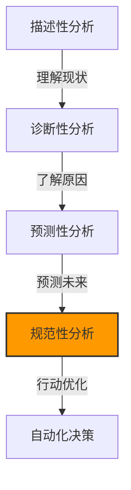
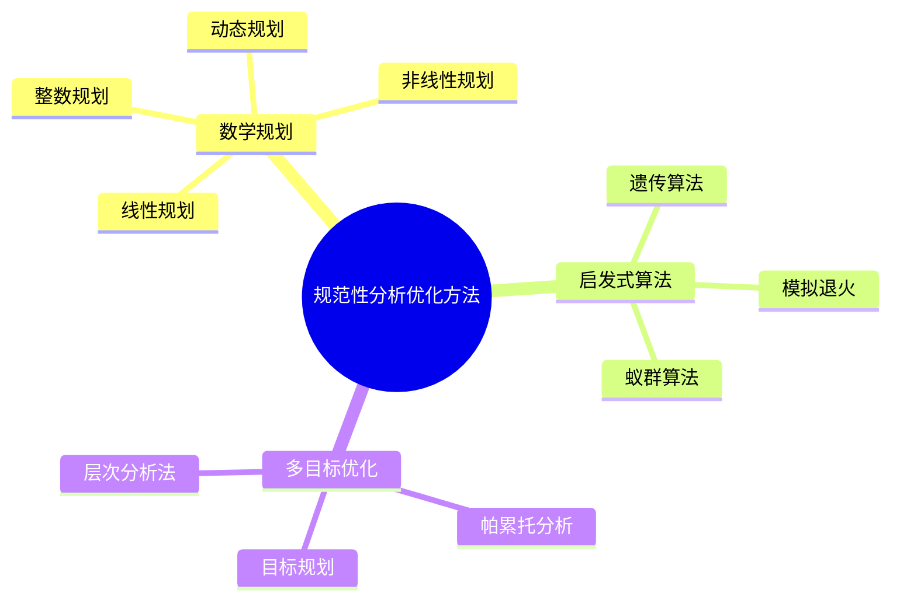
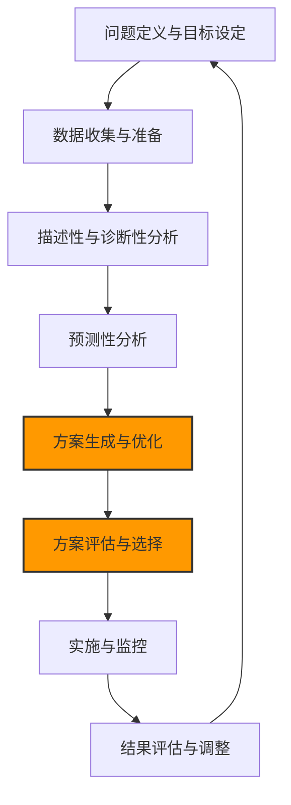

---
{"dg-publish":true,"tags":["商业分析","规范性分析","决策优化","运筹学","优化模型"],"创建日期":"2024-04-27","permalink":"/知识共享/002_商业分析/01_学习内容/03_分析方法与工具/3.4 规范性分析方法/","dgPassFrontmatter":true}
---


# 3.4 规范性分析方法

> [!quote] 概述
> 规范性分析是商业分析中最高级的形式，旨在回答"应该做什么"的问题。它结合了预测分析的结果，通过各种优化技术和决策支持方法，推荐最佳行动方案以实现业务目标。本文系统介绍规范性分析的主要方法、应用场景和实施步骤，帮助分析师从"洞察"迈向"决策"。

## 规范性分析基础

### 规范性分析的定义与价值

规范性分析(Prescriptive Analytics)是使用数学优化、模拟和业务规则等方法，基于对当前状况的理解和对未来事件的预测，推荐最优行动方案的分析方法。它代表了数据分析的最高层次，将描述性分析的"发生了什么"、诊断性分析的"为什么发生"和预测性分析的"可能发生什么"转化为"应该怎么做"的具体行动建议。

在商业环境中，规范性分析的核心价值包括：

1. **决策优化**：从多个可行方案中找出最优解，实现目标最大化或成本最小化
2. **资源配置**：在有限资源约束下，最优分配资源以获得最大回报
3. **风险管理**：评估不同决策方案的风险和回报，提供风险平衡的行动建议
4. **情景规划**：在不确定性条件下，提供适应不同未来情景的稳健决策方案
5. **自动化决策**：为重复性决策提供算法化的解决方案，减少人为干预

### 规范性分析在分析成熟度中的位置



规范性分析建立在其他类型分析的基础之上：
- 利用**描述性分析**提供的数据概况作为决策基础
- 采纳**诊断性分析**揭示的因果关系以理解影响因素
- 整合**预测性分析**的多种可能结果以评估方案效果
- 通过优化算法提供**最佳行动建议**，并可进一步支持**自动化决策**

### 规范性分析的应用领域

规范性分析在各个行业和业务领域都有广泛应用：

1. **供应链管理**
   - 库存优化与补货决策
   - 物流网络设计与路径规划
   - 生产计划与排程优化

2. **营销与销售**
   - 营销预算最优分配
   - 定价策略优化
   - 个性化推荐与优惠设计

3. **财务管理**
   - 投资组合优化
   - 风险管理策略
   - 资本结构决策

4. **人力资源**
   - 人员排班优化
   - 人才招聘与保留策略
   - 绩效管理方案

5. **医疗健康**
   - 治疗方案优化
   - 资源分配与床位管理
   - 疾病预防策略

## 规范性分析的核心方法

规范性分析采用多种数学和计算方法来解决优化问题，主要包括以下几类：

### 优化方法



#### 线性规划

**核心概念**：在线性约束条件下，寻找线性目标函数的最优解

**适用场景**：
- 资源配置问题
- 混合和生产计划
- 运输和网络流问题

**数学表示**：
最大化或最小化 $c_1x_1 + c_2x_2 + ... + c_nx_n$
受约束于：
$a_{11}x_1 + a_{12}x_2 + ... + a_{1n}x_n \leq b_1$
$a_{21}x_1 + a_{22}x_2 + ... + a_{2n}x_n \leq b_2$
$...$
$a_{m1}x_1 + a_{m2}x_2 + ... + a_{mn}x_n \leq b_m$
$x_1, x_2, ..., x_n \geq 0$

**实施工具**：
- Excel求解器
- Python: PuLP, SciPy
- 专业软件: CPLEX, Gurobi

**商业应用案例**：
某制造商需要决定生产产品A和产品B的最佳数量，以最大化利润。
- 产品A利润：$50/单位，产品B利润：$30/单位
- 生产约束：生产时间不超过40小时，原材料不超过70单位
- 产品A需要2小时生产时间和5单位原材料
- 产品B需要1小时生产时间和3单位原材料

**Excel实现**：
目标函数：最大化 `=50*A2+30*B2`
约束条件：
`2*A2+1*B2 <= 40` (时间约束)
`5*A2+3*B2 <= 70` (材料约束)
`A2 >= 0, B2 >= 0` (非负约束)

#### 整数规划与混合整数规划

**核心概念**：线性规划的扩展，其中部分或全部变量必须为整数值

**适用场景**：
- 设施选址问题
- 生产批量决策
- 设备更换时机选择
- 项目选择问题

**变体类型**：
- 纯整数规划：所有变量都必须是整数
- 混合整数规划：部分变量必须是整数
- 0-1整数规划：变量只能取0或1，表示"是否选择"决策

**实现挑战**：
- 计算复杂度高于线性规划
- 求解时间随问题规模增长迅速
- 可能需要近似算法或启发式方法

**商业应用案例**：
零售商需要决定在哪些位置开设新店，考虑到固定成本、潜在收入和覆盖区域。
- 决策变量：每个候选位置是否开店(0或1)
- 目标函数：最大化净收益
- 约束条件：预算限制、最小市场覆盖率、竞争区域限制

#### 非线性规划

**核心概念**：目标函数或约束条件包含非线性关系的优化问题

**适用场景**：
- 投资组合优化
- 风险管理
- 化学过程控制
- 定价优化

**求解方法**：
- 梯度下降法
- 牛顿法
- 拟牛顿法
- 序列二次规划

**实现挑战**：
- 可能存在多个局部最优解
- 求解复杂度高
- 收敛性保证难

**商业应用案例**：
投资组合优化，在给定风险水平下最大化回报，或在给定回报水平下最小化风险。
- 目标函数：最小化投资组合方差(非线性函数)
- 约束条件：预期回报达到目标值，所有权重之和为1

### 模拟方法

当问题过于复杂或包含随机性，无法使用纯优化方法时，模拟方法成为重要工具。

#### 蒙特卡洛模拟

**核心概念**：通过多次随机抽样来模拟系统行为，评估不同决策方案的可能结果

**适用场景**：
- 风险分析
- 项目管理
- 金融决策
- 库存管理

**实施步骤**：
1. 确定关键变量及其概率分布
2. 从这些分布中随机抽样
3. 计算结果度量
4. 重复多次(通常数千或数万次)
5. 分析结果分布，评估不同方案

**Excel实现示例**：
```
1. 定义输入变量及分布(如销售量：正态分布 NORM.INV(RAND(),1000,100))
2. 设置决策变量(如订货量)
3. 计算结果(如利润 =销售量*单价-订货量*成本)
4. 使用数据表功能进行多次模拟
5. 分析结果分布，找出最优决策
```

**Python实现**：
```python
import numpy as np
import matplotlib.pyplot as plt

# 模拟参数
n_simulations = 10000
mean_demand = 1000
std_demand = 100
price = 10
cost = 6
order_quantities = np.arange(800, 1200, 50)

# 存储每个订货量的利润结果
results = {}

for qty in order_quantities:
    # 模拟需求
    demand = np.random.normal(mean_demand, std_demand, n_simulations)
    
    # 计算销售量(不能超过订货量)
    sales = np.minimum(demand, qty)
    
    # 计算利润
    profit = sales * price - qty * cost
    
    # 存储结果
    results[qty] = profit

# 分析结果
for qty, profits in results.items():
    mean_profit = np.mean(profits)
    print(f"订货量 {qty}: 平均利润 {mean_profit:.2f}, 5%分位数: {np.percentile(profits, 5):.2f}")

# 找出最优订货量
mean_profits = {qty: np.mean(profits) for qty, profits in results.items()}
optimal_qty = max(mean_profits, key=mean_profits.get)
print(f"最优订货量: {optimal_qty}, 预期平均利润: {mean_profits[optimal_qty]:.2f}")

# 可视化结果
plt.figure(figsize=(10, 6))
plt.boxplot([results[qty] for qty in order_quantities])
plt.xticks(range(1, len(order_quantities) + 1), order_quantities)
plt.xlabel('订货量')
plt.ylabel('利润')
plt.title('不同订货量的利润分布')
plt.grid(True)
plt.show()
```

#### 离散事件模拟

**核心概念**：模拟系统中的事件序列随时间的演变，每个事件在特定时间点发生并可能触发其他事件

**适用场景**：
- 排队系统优化
- 生产线设计
- 服务流程改进
- 物流系统规划

**关键组件**：
- 实体(如顾客、产品)
- 事件(如到达、离开)
- 资源(如服务员、机器)
- 队列(等待资源的实体)
- 时钟(模拟时间)

**实现工具**：
- Python: SimPy
- 专业软件: Arena, AnyLogic, FlexSim

**商业应用案例**：
银行分行柜台服务优化
- 模拟不同时段客户到达模式
- 测试不同数量柜员的配置
- 评估等待时间、柜员利用率和运营成本
- 确定最佳人员安排方案

### 决策分析方法

决策分析方法帮助决策者在不确定条件下做出最佳选择。

#### 决策树分析

**核心概念**：图形化表示决策问题，包括决策节点、概率事件节点和结果节点

**适用场景**：
- 投资决策
- 产品开发决策
- 市场进入策略
- 风险管理决策

**构建步骤**：
1. 确定决策点和可能选择
2. 确定每个决策后可能出现的事件及概率
3. 确定最终结果和价值
4. 计算期望值并进行回溯分析
5. 确定最优决策路径

**Excel实现**：
可使用TreePlan插件或手动计算每个决策路径的期望值

**商业应用案例**：
某公司正考虑是否开发新产品，可以选择全面市场调研、小规模测试或直接推出。
- 决策节点：选择市场调研方式
- 机会节点：市场反应(积极/中性/消极)及其概率
- 结果：各种组合的净现值
- 分析：计算每个决策路径的期望值，选择期望值最高的决策 

#### 多准则决策分析(MCDA)

**核心概念**：用于评估具有多个(通常是冲突的)标准或目标的决策问题

**适用场景**：
- 供应商选择
- 项目组合管理
- 产品设计决策
- 位置选择问题

**常用方法**：
- 层次分析法(AHP)
- 模糊多准则决策
- 多属性效用理论
- TOPSIS方法(技术顺序优先选择法)

**层次分析法(AHP)实施步骤**：
1. 构建决策层次结构(目标、准则、替代方案)
2. 建立判断矩阵，进行两两比较
3. 计算权重和一致性比率
4. 计算备选方案的综合得分
5. 根据得分排序选择最优方案

**商业应用案例**：
IT系统供应商选择，考虑多种标准：
- 价格(30%)
- 功能匹配度(25%)
- 技术支持(20%)
- 供应商可靠性(15%)
- 实施时间(10%)

使用AHP方法对各供应商在每个标准上进行打分，计算总分并排序，选择最优供应商。

### 规则系统与业务规则引擎

**核心概念**：基于预定义的条件-行动规则集进行决策

**适用场景**：
- 信贷审批
- 风险评估
- 客户分类
- 自动化营销决策

**关键组件**：
- 规则库：条件-行动对的集合
- 推理引擎：应用规则的机制
- 工作内存：存储当前事实和状态
- 用户界面：用于规则管理和监控

**实现方法**：
- 决策表
- 决策树
- 规则语言(如Drools的DRL)
- 商业规则管理系统(BRMS)

**商业应用案例**：
保险公司的自动核保系统：
- 基于申请人的年龄、健康状况、职业等特征
- 根据预定义规则自动分类为标准、次标准或拒保
- 确定保费加载因子
- 对特殊情况进行人工转介

**规则示例**：
```
IF 申请人年龄 < 30 AND 健康状况 = "优秀" AND 无家族病史 THEN 风险等级 = "低"
IF 风险等级 = "低" AND 保额 < 50万 THEN 核保决定 = "自动接受" AND 费率因子 = 1.0
```

### 启发式算法与元启发式方法

**核心概念**：使用近似策略在合理时间内找到接近最优解的方法

**适用场景**：
- NP难问题(如旅行商问题)
- 组合优化问题
- 高维空间搜索问题
- 复杂约束条件下的优化

**常用方法**：
- 遗传算法
- 模拟退火
- 粒子群优化
- 蚁群算法
- 禁忌搜索

**遗传算法实施步骤**：
1. 对问题进行编码，创建初始种群
2. 评估每个解的适应度
3. 选择适应度高的解进行繁殖
4. 应用交叉和突变操作产生新解
5. 替换种群并重复步骤2-5
6. 经过多代进化后选择最佳解

**商业应用案例**：
配送路径优化问题：
- 车辆需要从仓库出发，服务多个客户点，然后返回仓库
- 目标是最小化总行驶距离和车辆数量
- 约束条件包括车辆容量限制和客户时间窗口
- 使用遗传算法搜索最优或近似最优解

**Python实现示例**：
```python
import numpy as np
from deap import base, creator, tools, algorithms
import random
import matplotlib.pyplot as plt

# 问题定义(TSP示例)
# 城市坐标
cities = [(0,0), (1,5), (5,2), (9,3), (5,8), (8,9), (4,1), (2,7)]
n_cities = len(cities)

# 计算城市间距离矩阵
def distance_matrix(cities):
    matrix = []
    for i in range(len(cities)):
        row = []
        for j in range(len(cities)):
            p1 = cities[i]
            p2 = cities[j]
            # 欧几里得距离
            distance = np.sqrt((p1[0] - p2[0])**2 + (p1[1] - p2[1])**2)
            row.append(distance)
        matrix.append(row)
    return matrix

dist_matrix = distance_matrix(cities)

# 路径长度评估函数
def evalTSP(individual):
    distance = 0
    for i in range(len(individual)):
        distance += dist_matrix[individual[i-1]][individual[i]]
    return distance,

# 设置遗传算法
creator.create("FitnessMin", base.Fitness, weights=(-1.0,))
creator.create("Individual", list, fitness=creator.FitnessMin)

toolbox = base.Toolbox()
toolbox.register("indices", random.sample, range(n_cities), n_cities)
toolbox.register("individual", tools.initIterate, creator.Individual, toolbox.indices)
toolbox.register("population", tools.initRepeat, list, toolbox.individual)

toolbox.register("evaluate", evalTSP)
toolbox.register("mate", tools.cxOrdered)
toolbox.register("mutate", tools.mutShuffleIndexes, indpb=0.05)
toolbox.register("select", tools.selTournament, tournsize=3)

# 运行算法
def main():
    pop = toolbox.population(n=100)
    hof = tools.HallOfFame(1)
    stats = tools.Statistics(lambda ind: ind.fitness.values)
    stats.register("avg", np.mean)
    stats.register("min", np.min)
    
    pop, log = algorithms.eaSimple(pop, toolbox, cxpb=0.7, mutpb=0.2, 
                                  ngen=50, stats=stats, halloffame=hof, verbose=True)
    
    # 最佳路径
    best_route = hof[0]
    best_distance = evalTSP(best_route)[0]
    
    print(f"最佳路径: {best_route}")
    print(f"最短距离: {best_distance:.2f}")
    
    # 可视化
    plt.figure(figsize=(8, 6))
    for i, city in enumerate(cities):
        plt.scatter(city[0], city[1], c='red', s=100)
        plt.text(city[0]+0.1, city[1]+0.1, str(i), fontsize=12)
    
    for i in range(len(best_route)):
        start = cities[best_route[i-1]]
        end = cities[best_route[i]]
        plt.plot([start[0], end[0]], [start[1], end[1]], 'k-')
    
    plt.title(f"TSP Optimal Route (Distance: {best_distance:.2f})")
    plt.grid(True)
    plt.show()
    
    return pop, log, hof

if __name__ == "__main__":
    main()
```

## 规范性分析的实施框架

### 规范性分析项目流程



规范性分析是一个系统化过程，其关键步骤包括：

1. **问题定义与目标设定**
   - 明确业务问题和决策空间
   - 确定目标函数和优化方向
   - 识别关键利益相关者和需求

2. **数据收集与准备**
   - 确定所需数据类型和来源
   - 收集历史数据和环境数据
   - 进行数据清洗和转换

3. **描述性与诊断性分析**
   - 理解当前状况和历史表现
   - 分析影响因素和因果关系
   - 建立基准度量

4. **预测性分析**
   - 开发预测模型
   - 生成多种未来情景
   - 评估不确定性和风险

5. **方案生成与优化**
   - 定义决策变量和约束条件
   - 构建优化模型或决策模型
   - 应用适当的优化算法
   - 生成候选方案集

6. **方案评估与选择**
   - 评估各方案在不同情景下的表现
   - 考虑风险和稳健性
   - 进行敏感性分析
   - 选择最佳或平衡方案

7. **实施与监控**
   - 制定实施计划
   - 设置关键绩效指标
   - 持续监控实施效果

8. **结果评估与调整**
   - 比较实际结果与预期
   - 分析差异原因
   - 调整模型和优化方案

### 规范性分析的模型选择框架

选择适当的规范性分析方法需要考虑多个因素：

| 决策特性 | 适用方法 |
|----------|----------|
| **确定性环境** |  |
| 线性关系，连续变量 | 线性规划 |
| 整数约束 | 整数规划 |
| 非线性关系 | 非线性规划 |
| 多阶段决策 | 动态规划 |
| **不确定性环境** |  |
| 已知概率分布 | 随机规划，蒙特卡洛模拟 |
| 未知概率分布 | 稳健优化，情景分析 |
| 复杂系统行为 | 离散事件模拟 |
| **多目标决策** |  |
| 可权衡目标 | AHP，多准则决策分析 |
| 无可比性目标 | 帕累托分析，目标规划 |
| **大规模组合问题** |  |
| 计算复杂度高 | 启发式算法，元启发式 |
| 规则驱动决策 | 业务规则引擎 |

### 规范性分析的实施挑战与对策

实施规范性分析时常见的挑战及应对策略：

1. **模型复杂性与数据要求**
   - **挑战**：复杂模型需要大量高质量数据
   - **对策**：从简单模型开始，随着数据积累逐步提高复杂度

2. **算法选择与计算资源**
   - **挑战**：高级优化算法可能需要大量计算资源
   - **对策**：权衡精确度与计算效率，根据实际需求选择合适算法

3. **不确定性处理**
   - **挑战**：现实世界充满不确定性，单一最优解可能不稳健
   - **对策**：情景规划与稳健优化，考虑多种可能情况下的表现

4. **业务约束与实施可行性**
   - **挑战**：理论最优解可能在现实中难以实施
   - **对策**：将实际约束纳入模型，与业务部门紧密合作

5. **结果解释与业务接受度**
   - **挑战**：复杂模型结果可能难以解释，降低业务接受度
   - **对策**：提供直观可视化和简化解释，关注关键业务指标

## 规范性分析应用案例

### 供应链优化案例

**背景**：某零售企业拥有1个中央仓库和10个区域配送中心，为全国200多家门店提供商品供应。企业面临库存水平过高、配送成本增加和客户满意度下降等问题。

**目标**：优化库存策略和配送网络，同时平衡库存成本、运输成本和服务水平。

**分析步骤**：

1. **问题定义**
   - 确定决策变量：各SKU的安全库存水平、补货频率、补货量、配送路线规划
   - 目标函数：最小化总成本(库存持有成本+订货成本+运输成本+缺货成本)
   - 约束条件：服务水平要求、仓储空间限制、车辆容量、交付时间窗口

2. **数据收集**
   - 历史销售数据和需求模式
   - 产品特性（体积、重量、保质期）
   - 库存成本和运输成本
   - 供应商交货周期和可靠性

3. **预测分析**
   - 开发需求预测模型，考虑季节性和趋势
   - 预测各地区需求波动和不确定性

4. **优化方法选择**
   - 库存优化：随机动态规划
   - 网络设计：混合整数规划
   - 路径规划：启发式算法

5. **实施结果**
   - 总库存成本降低22%
   - 运输成本降低15%
   - 服务水平提高至98%
   - 库存周转率提高40%

**关键成功因素**：
- 集成端到端供应链视角
- 结合预测和优化方法
- 考虑多种不确定性情景
- 与业务团队密切合作实施

### 收益管理案例

**背景**：某航空公司需要优化座位定价和分配策略，以最大化航线收益。

**目标**：确定各航线、各舱位、不同预订时间段的最优价格和座位分配策略。

**分析步骤**：

1. **问题定义**
   - 决策变量：各舱位价格、各预订时间段分配的座位数
   - 目标函数：最大化预期收益
   - 约束条件：总座位容量、最低舱位数量、竞争定价约束

2. **数据分析**
   - 分析历史需求模式和价格弹性
   - 建立旅客预订行为模型
   - 识别季节性和特殊事件影响

3. **预测建模**
   - 预测不同价格点的需求
   - 模拟客户预订行为

4. **优化方法**
   - 动态规划确定座位分配策略
   - 非线性规划优化价格策略

5. **实施结果**
   - 单位收益提高8.5%
   - 座位利用率提高5%
   - 市场份额提升2%

**关键成功因素**：
- 实时调整能力
- 细分市场定价
- 整合竞争对手和市场数据
- 持续测试和调整策略

## 规范性分析的能力建设路径

### 入门级能力

**必备知识**：
- 基础优化理论
- 线性规划基础
- 决策理论
- 基本统计方法

**核心技能**：
- 使用Excel求解器解决简单优化问题
- 构建基本决策树模型
- 进行简单的敏感性分析
- 使用商业智能工具展示分析结果

**工具掌握**：
- Excel求解器
- 基本仿真工具
- 商业智能可视化工具

**推荐任务**：
- 进行产品组合优化
- 建立简单的库存管理模型
- 创建基本的决策支持仪表板

### 进阶级能力

**知识拓展**：
- 高级优化技术(整数规划、非线性规划)
- 启发式算法原理
- 随机模拟方法
- 多准则决策分析

**技能提升**：
- 实施复杂优化模型
- 开发模拟分析方案
- 构建业务规则系统
- 设计集成决策支持系统

**工具扩展**：
- Python/R中的优化库(PuLP, OR-Tools)
- 模拟软件(Arena, SimPy)
- 商业规则引擎
- 中级数据处理能力

**推荐任务**：
- 开发供应链网络优化模型
- 构建产能规划系统
- 设计风险管理决策支持系统

### 专家级能力

**深度知识**：
- 复杂系统优化理论
- 随机优化与稳健优化
- 元启发式算法设计
- 预测和优化的集成方法

**高级技能**：
- 设计和实施企业级优化系统
- 开发定制化算法解决特定领域问题
- 构建集成预测和优化的系统
- 领导跨职能优化项目

**工具精通**：
- 高级优化软件(CPLEX, Gurobi)
- 大规模模拟平台
- 分布式计算技术
- 高级编程和算法开发能力

**领域应用**：
- 投资组合优化
- 实时定价系统
- 全球供应链优化
- 复杂资源调度系统

## 自我评估与实践练习

### 理解检查问题

1. 规范性分析与预测性分析的主要区别是什么？
2. 线性规划的关键组成部分包括哪些？何时适合使用线性规划？
3. 为什么在不确定环境下蒙特卡洛模拟是有效的方法？
4. 解释多准则决策分析的核心理念和应用场景。
5. 什么情况下应选择启发式算法而非精确优化算法？
6. 决策树分析如何帮助在不确定条件下做出决策？
7. 如何评估规范性分析解决方案的质量和稳健性？
8. 解释规则系统在规范性分析中的作用。
9. 描述一个完整的规范性分析项目流程。
10. 如何处理规范性分析结果与业务直觉不一致的情况？

### 实践项目：产品组合优化与定价分析

**项目背景**：
你是某消费品公司的商业分析师，公司计划在下一季度推出5款新产品，但由于预算和产能限制，只能选择2-3款产品推出。你需要开发一个优化模型，确定最优的产品组合和定价策略。

**提供数据**：
- 5款产品的开发成本、生产成本和产能需求
- 各产品的需求预测和价格弹性估计
- 总预算和产能约束
- 市场竞争情况和替代品价格

**任务步骤**：

1. **模型设计**
   - 设计决策变量：产品选择(0-1变量)和定价水平
   - 确定目标函数：最大化总利润贡献
   - 设定约束条件：预算限制、产能限制、市场定位约束

2. **数据准备**
   - 整理成本和需求数据
   - 估计不同价格点的需求函数
   - 设定各约束条件的参数值

3. **模型实现**
   - 使用Excel求解器或Python优化库构建模型
   - 求解最优产品组合和价格
   - 进行敏感性分析，评估关键参数变化的影响

4. **情景分析**
   - 设计3-5个不同市场情景
   - 在各情景下求解模型
   - 评估结果在不同情景下的稳健性

5. **决策建议**
   - 提出最优或稳健的产品组合和定价策略
   - 设计实施路径
   - 提出监控和调整方案

**评估标准**：
- 模型设计的合理性和完整性
- 约束条件的全面性和现实性
- 敏感性分析的深度和洞察
- 情景规划的创造性和全面性
- 决策建议的可行性和具体性

## 参考资料

### 书籍推荐

1. Hillier, F.S., & Lieberman, G.J. (2020). *Introduction to Operations Research*. McGraw-Hill.
2. Winston, W.L. (2019). *Operations Research: Applications and Algorithms*. Cengage Learning.
3. Powell, W.B. (2019). *Optimization Under Uncertainty: A Unified Framework*. Princeton University Press.
4. Ragsdale, C.T. (2018). *Spreadsheet Modeling & Decision Analysis: A Practical Introduction to Business Analytics*. Cengage Learning.

### 线上学习资源

1. Coursera: "Discrete Optimization" by University of Melbourne
2. edX: "Supply Chain Analytics" by MIT
3. DataCamp: "Decision Trees for Business Analysts"
4. Udemy: "Operations Research: From Beginner to Advanced"

### 软件工具

1. **优化工具**：
   - 商业：IBM CPLEX, Gurobi, AMPL
   - 开源：PuLP, OR-Tools, GLPK

2. **模拟工具**：
   - 商业：Arena, AnyLogic, @RISK
   - 开源：SimPy, JaamSim

3. **商业规则引擎**：
   - Drools
   - IBM Operational Decision Manager
   - FICO Blaze Advisor

4. **分析平台**：
   - RapidMiner
   - KNIME
   - SAS 