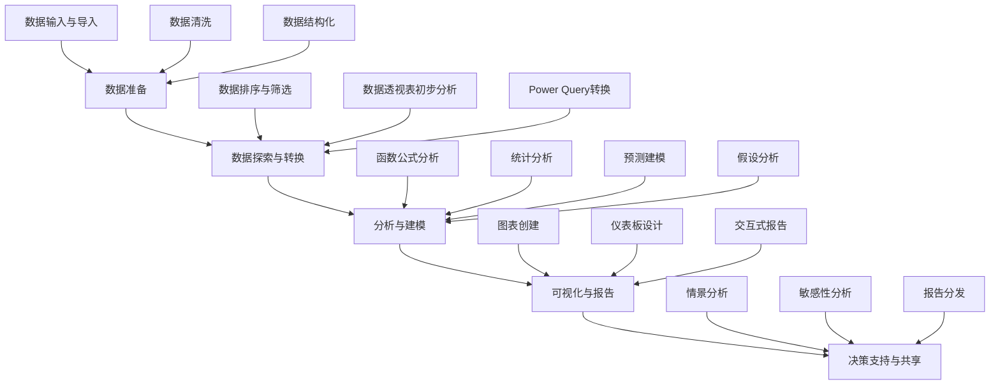

---
{"dg-publish":true,"tags":["商业分析","Excel","数据分析","高级函数","数据处理"],"创建日期":"2024-07-19","permalink":"/知识共享/002_商业分析/01_学习内容/03_分析方法与工具/3.5 Excel高级分析技巧/","dgPassFrontmatter":true}
---


## 基础知识

### Excel作为商业分析工具的定位

Excel是微软公司开发的电子表格软件，作为商业分析领域应用最广泛的工具之一，它集成了数据处理、计算、可视化和建模等功能。在商业分析中，Excel被视为"入门级全能工具"，能够满足从数据收集、清洗、分析到结果呈现的全流程需求。

从历史发展看，Excel从1985年首次发布以来，逐步从简单的电子表格工具演变为功能丰富的数据分析平台。特别是Excel 2007之后的版本引入了PowerPivot、Power Query等高级分析功能，大幅增强了其数据处理能力，使其能够处理百万级别的数据记录。

### 核心分析功能概述

Excel的核心分析功能可以分为以下几个方面：

1. **数据管理与处理**：
   - 数据输入、格式化和验证
   - 数据筛选、排序和条件格式
   - 数据清洗与转换

2. **计算与分析**：
   - 基础函数与高级函数
   - 数学和统计分析
   - 财务分析与建模

3. **数据可视化**：
   - 图表创建与定制
   - 交互式仪表板
   - 数据透视图与图表

4. **高级分析工具**：
   - 数据分析工具包
   - Power Query (Get & Transform)
   - PowerPivot 和数据模型
   - What-If 分析和情景管理

### Excel在商业分析中的优势与局限

**优势**：
- 普及率高，学习曲线平缓
- 无需编程即可完成复杂分析
- 直观的可视界面，易于操作
- 与Office生态系统无缝集成
- 适合快速原型设计和小型项目

**局限性**：
- 处理大规模数据集时性能受限
- 复杂分析和模型构建能力不如专业统计软件
- 数据管理和版本控制功能相对薄弱
- 自动化和可重复性分析能力有限
- 对非结构化数据处理能力较弱

## 理论框架

### Excel数据分析框架



### Excel分析功能层级结构

Excel的分析功能可以按照复杂度和应用场景分为以下层级：

1. **基础层**：
   - 基本运算与公式
   - 条件判断 (IF, AND, OR)
   - 查找引用 (VLOOKUP, INDEX/MATCH)

2. **中级层**：
   - 统计分析函数 (AVERAGE, STDEV, CORREL)
   - 数据透视表与数据透视图
   - 条件格式与数据可视化
   - 日期和时间分析

3. **高级层**：
   - 数组公式与动态数组
   - 财务建模与分析
   - 数据分析工具包
   - 高级查找与文本处理

4. **专业层**：
   - Power Query数据转换
   - PowerPivot与DAX表达式
   - Power View交互式报告
   - VBA宏与自动化

### 分析方法论在Excel中的应用

商业分析的四类方法（描述性、诊断性、预测性和规范性分析）在Excel中均有相应的实现方式：

| 分析类型 | Excel实现方法 | 典型应用场景 |
|---------|--------------|------------|
| 描述性分析 | 数据透视表、统计函数、图表 | 销售报告、业绩仪表板 |
| 诊断性分析 | 条件筛选、相关性分析、分类汇总 | 根因分析、业务问题排查 |
| 预测性分析 | 趋势线、预测工具、回归分析 | 销售预测、趋势分析 |
| 规范性分析 | 规划求解、情景管理器、目标寻求 | 预算优化、资源分配 |

## 应用指南

### 数据管理与处理高级技巧

#### 1. 大数据集处理优化

处理大型数据集时的最佳实践：
- 使用表格(Table)代替普通范围，提高引用效率
- 关闭自动计算，减少处理大型公式时的等待时间
- 尽量使用PowerPivot而非数据透视表处理百万级数据
- 避免使用易消耗资源的函数（如INDIRECT, OFFSET）
- 优化VLOOKUP，使用INDEX/MATCH组合提高查询效率

**示例**：优化VLOOKUP
```
# 传统VLOOKUP（性能较低）
=VLOOKUP(查找值, 表格范围, 列索引, FALSE)

# 优化版INDEX/MATCH（性能更高）
=INDEX(返回值列, MATCH(查找值, 查找列, 0))
```

#### 2. Power Query高级数据转换

使用Power Query(Get & Transform)实现复杂数据处理：
- 合并多个来源的数据（文件、网页、数据库）
- 执行复杂的数据清洗和转换
- 创建可重复使用的数据处理流程
- 处理不规则结构的数据

**关键步骤**：
1. 数据 > 获取数据 > 选择数据源
2. 在Power Query编辑器中进行转换
3. 创建处理步骤并加载结果
4. 刷新数据时自动应用所有转换

#### 3. 动态数组与LAMBDA函数(Excel 365)

现代Excel中的革命性功能：
- 动态数组函数：公式自动扩展到多个单元格
- LAMBDA函数：创建自定义函数无需VBA
- SEQUENCE和UNIQUE等新函数大幅简化复杂操作

**示例**：使用动态数组创建唯一值列表
```
=UNIQUE(数据范围)  # 自动返回不重复的项目列表
```

### 高级分析函数与技术

#### 1. 高级查找与匹配

复杂数据检索技巧：
- 双向查找（搜索行和列）
- 模糊匹配和近似查找
- 多条件查找与高级筛选

**案例**：双条件查找使用INDEX与多个MATCH
```
=INDEX(数据区域, MATCH(行条件, 行标题, 0), MATCH(列条件, 列标题, 0))
```

#### 2. 高级统计分析

使用Excel进行复杂统计分析：
- 描述性统计分析工具包的使用
- 相关性与回归分析
- 方差分析(ANOVA)
- 概率分布与抽样

**操作方法**：
1. 启用"数据分析"工具包（文件 > 选项 > 加载项 > 分析工具库）
2. 数据选项卡 > 数据分析 > 选择分析类型
3. 指定输入范围和输出选项

#### 3. 规划求解与优化

使用Excel求解复杂业务优化问题：
- 线性规划与资源分配
- 目标寻求和最优解分析
- 敏感性分析与情景管理

**步骤**：
1. 数据 > 假设分析 > 规划求解
2. 设置目标单元格、变量单元格和约束条件
3. 选择求解方法并执行计算
4. 分析敏感性报告，了解参数变化对结果的影响

### 高级数据可视化技术

#### 1. 动态图表与仪表板

创建交互式可视化：
- 使用表单控件创建交互式筛选器
- 创建动态命名范围支持数据更新
- 设计整合多图表的商业仪表板
- 使用OFFSET和INDIRECT创建动态图表范围

**技术实现**：
1. 创建下拉列表（开发工具 > 插入 > 组合框）
2. 使用INDIRECT或INDEX将选择链接到数据
3. 创建基于动态范围的图表

#### 2. 高级图表定制

增强Excel标准图表：
- 组合图表类型（如线柱组合图）
- 添加辅助线与标注
- 自定义数据标签和格式
- 使用图表堆叠和次坐标轴

**示例**：创建带有目标线的业绩仪表板
1. 创建柱状图显示实际数据
2. 添加折线图显示目标值
3. 设置次坐标轴显示百分比完成率
4. 使用条件格式突出显示未达标项目

#### 3. 地图图表与高级可视化

Excel 365中的新型可视化：
- 地图图表展示地理分布数据
- 瀑布图分析财务变化
- 漏斗图展示过程各阶段数据
- 树状图和旭日图展示层次结构

## 案例分析

### 案例1：销售数据分析与预测

**背景**：
某零售企业需要分析过去24个月的销售数据，识别季节性模式并预测未来6个月的销售趋势。

**实施步骤**：
1. **数据准备**：
   - 使用Power Query导入并合并多个销售数据文件
   - 创建日期层次结构（年、季度、月）
   - 计算关键绩效指标（增长率、单位销量等）

2. **描述性分析**：
   - 创建数据透视表分析不同维度的销售情况
   - 使用高级条件格式突显表现好/差的区域
   - 设计销售仪表板并添加交互式筛选器

3. **预测分析**：
   - 使用Excel的预测工作表功能进行初步预测
   - 应用时间序列分析分解季节性因素
   - 创建多场景预测模型考虑不同增长假设

**成果与启示**：
- 识别出强烈的季节性模式，第四季度销售额平均高于其他季度38%
- 通过动态预测模型准确预测未来销量，误差控制在±7%内
- 关键学习：将预测与历史数据同时可视化，能直观验证预测合理性

### 案例2：财务建模与敏感性分析

**背景**：
一家初创企业需要构建财务模型，评估不同定价策略和成本结构对盈利能力的影响。

**实施步骤**：
1. **模型构建**：
   - 设计三表联动模型（损益表、资产负债表、现金流量表）
   - 创建假设页面集中管理关键参数
   - 使用INDIRECT函数实现基于不同情景的动态引用

2. **敏感性分析**：
   - 使用情景管理器创建乐观、基准、悲观三种情景
   - 应用数据表进行双变量敏感性分析
   - 创建敏感性分析热图，直观展示参数影响程度

3. **决策支持**：
   - 创建交互式仪表板允许管理层调整参数
   - 计算关键决策指标（投资回报期、净现值、内部收益率）
   - 使用规划求解优化定价策略，最大化长期利润

**成果与启示**：
- 确定了提价5%同时提高市场营销投入10%的策略能实现利润最大化
- 敏感性分析发现盈利能力对原材料成本变化的敏感度最高
- 关键学习：财务模型需先确定核心假设，再构建模型结构，最后添加情景分析功能

### 案例3：客户细分与终身价值分析

**背景**：
一家线上服务提供商需要对其客户群进行细分，并计算不同客户群的终身价值(LTV)。

**实施步骤**：
1. **数据处理**：
   - 使用Power Query整合交易数据、客户资料和行为数据
   - 创建RFM分析指标（近度、频率、金额）
   - 使用条件函数计算客户生命周期阶段

2. **客户细分**：
   - 应用COUNTIFS和SUMIFS进行初步分组
   - 使用Excel数据分析工具包进行聚类分析
   - 创建客户象限图，根据价值和流失风险进行分类

3. **LTV计算与预测**：
   - 设计客户终身价值计算模型
   - 使用折现现金流方法预测未来收入
   - 创建交互式仪表板展示不同细分群体的LTV和增长潜力

**成果与启示**：
- 成功识别出五个客户细分群体，其中"高频低额"用户群增长最快
- 高价值客户组的获客成本回收周期比平均水平短40%
- 关键学习：客户细分不仅需要看当前价值，还需预测潜在价值和流失风险

### 案例4：供应链优化分析

**背景**：
制造企业需要优化其库存水平和补货策略，平衡库存成本与缺货风险。

**实施步骤**：
1. **数据建模**：
   - 创建SKU级别的销售和库存数据模型
   - 使用移动平均和指数平滑计算需求预测
   - 计算安全库存水平和经济订货量

2. **优化分析**：
   - 使用规划求解确定最优库存策略
   - 创建蒙特卡洛模拟分析不确定性影响
   - 应用情景分析评估不同服务水平的成本效益

3. **可视化与监控**：
   - 设计库存健康仪表板监控关键指标
   - 创建ABC分析矩阵优化资源分配
   - 设置基于阈值的条件格式和自动警报

**成果与启示**：
- 通过优化库存策略，总库存成本降低17%，同时维持98%的服务水平
- 识别出20%的"高风险"SKU需要专门的库存管理策略
- 关键学习：库存优化需平衡多个维度（成本、服务水平、供应风险），单一指标优化往往导致次优结果

## 延伸内容

### Excel与其他分析工具的对比与集成

#### Excel vs. 专业BI工具

| 特性 | Excel | Power BI | Tableau | Qlik |
|------|-------|----------|---------|------|
| 处理数据量 | <200万行 | >10亿行（压缩） | >10亿行（提取） | >10亿行（内存) |
| 学习曲线 | 低 | 中 | 中高 | 中高 |
| 数据可视化 | 基础到中级 | 高级 | 专业级 | 高级 |
| 数据建模 | 有限 | 强大 | 有限 | 强大 |
| 自动刷新 | 手动/有限 | 自动化 | 自动化 | 自动化 |
| 协作能力 | 有限 | 强大 | 强大 | 强大 |
| 成本 | 低 | 中 | 高 | 高 |

#### Excel与编程语言的协作

Excel可以与多种分析工具和语言协同工作：

1. **Excel与Python集成**：
   - 使用PyXLL或xlwings在Excel中调用Python代码
   - 通过Python读取和写入Excel文件
   - 将Python分析结果导出到Excel进行可视化

2. **Excel与R集成**：
   - 通过RExcel插件在Excel中使用R函数
   - 使用R的readxl和writexl包处理Excel数据
   - 结合R的统计能力与Excel的界面优势

3. **Excel与SQL数据库的连接**：
   - 使用Power Query连接各类数据库
   - 创建实时连接或数据缓存
   - 维护数据模型与源数据的关系

### 高级Excel自动化与扩展

#### VBA宏基础与应用

Visual Basic for Applications (VBA)是Excel中强大的自动化工具：

```vba
' 示例：一键生成销售报告宏
Sub GenerateSalesReport()
    ' 清理工作表
    Worksheets("报告").Cells.Clear
    
    ' 刷新数据
    ThisWorkbook.RefreshAll
    
    ' 创建透视表
    Dim pvtCache As PivotCache
    Dim pvt As PivotTable
    
    Set pvtCache = ActiveWorkbook.PivotCaches.Create( _
                   SourceType:=xlDatabase, _
                   SourceData:=Sheets("数据").Range("A1").CurrentRegion)
    
    Set pvt = pvtCache.CreatePivotTable( _
              TableDestination:=Sheets("报告").Range("A3"))
    
    ' 配置透视表字段
    With pvt
        .PivotFields("区域").Orientation = xlRowField
        .PivotFields("产品").Orientation = xlRowField
        .PivotFields("日期").Orientation = xlColumnField
        .PivotFields("销售额").Orientation = xlDataField
    End With
    
    ' 创建图表
    Dim cht As Chart
    Set cht = Sheets("报告").Shapes.AddChart2.Chart
    
    With cht
        .SetSourceData Source:=pvt.TableRange1
        .ChartType = xlColumnClustered
        .HasTitle = True
        .ChartTitle.Text = "区域销售分析"
    End With
    
    ' 格式化报告
    Sheets("报告").Range("A1").Value = "销售分析报告"
    Sheets("报告").Range("A1").Font.Size = 16
    Sheets("报告").Range("A1").Font.Bold = True
    
    MsgBox "销售报告已生成！", vbInformation
End Sub
```

关键应用场景：
- 批量数据处理和格式化
- 定制报表和图表生成
- 自动化重复性数据分析流程
- 创建交互式用户界面和表单

#### Excel加载项与API开发

扩展Excel功能的高级方法：
- 使用Office JS API开发现代加载项
- 利用VSTO创建功能丰富的Excel扩展
- 集成第三方服务和数据源
- 创建自定义功能区和任务窗格

#### Excel在云环境中的应用

Excel在云时代的演变：
- Excel Online与Microsoft 365的集成
- OneDrive和SharePoint中的协作编辑
- Power Automate与Excel的工作流自动化
- 使用Office Scripts实现基于Web的自动化

### 前沿技术与趋势

#### Excel中的人工智能与ML

Excel中的AI辅助功能：
- Ideas/Insights智能数据分析建议
- 使用FORECAST.ETS等智能预测函数
- 通过Power Query的AI转换功能
- 与Azure Machine Learning的集成可能性

#### 数据分析领域的发展与Excel的未来

Excel在当前数据分析生态中的位置：
- 从独立分析工具向协作平台转变
- 增强与专业数据科学工具的互操作性
- 移动端和云端分析能力的加强
- 低代码/无代码分析解决方案的兴起

## 学习资源

### 思考问题与自测题

1. 在处理大型数据集时，为什么INDEX/MATCH组合通常优于VLOOKUP？它们在性能和功能上有哪些关键区别？

2. 如何使用Excel的数据透视表实现销售数据的多维分析？请说明如何在同一报表中同时分析产品、区域和时间维度。

3. 在Excel中进行预测分析时，ETS预测方法与传统线性回归有何不同？各自适用于什么类型的数据？

4. 如何使用Excel的规划求解功能解决资源分配优化问题？请描述一个具体的业务场景及其实现步骤。

5. 动态数组公式如何改变Excel中的数据分析方法？给出一个使用动态数组简化复杂分析的具体例子。

6. 如何设计一个有效的Excel仪表板？请说明设计原则和必要的技术元素。

7. 在Excel中如何实现蒙特卡洛模拟？它在商业决策中有什么应用？

8. Excel中的Power Query如何改变数据准备流程？它相比传统方法有哪些优势？

9. 如何使用Excel进行客户细分分析？请描述可能的方法和所需函数。

10. 在进行财务建模时，Excel中的哪些功能可以帮助进行敏感性分析？如何正确解释敏感性分析的结果？

11. 如何在Excel中设计和实现一个平衡计分卡(BSC)系统？需要哪些关键组件？

12. 如何利用Excel的表格功能和结构化引用优化数据分析工作流程？与常规范围相比有何优势？

### 实践练习项目

#### 练习1：销售预测与分析仪表板

**目标**：创建一个综合销售分析与预测工具，包含历史分析和未来预测能力。

**任务**：
1. 设计分层数据模型，包含产品、客户和时间维度
2. 创建交互式销售分析仪表板，支持多维筛选
3. 实现至少两种预测方法，并比较其准确性
4. 添加"假设情景"功能，允许用户调整关键参数查看影响

**技能点**：数据透视表、高级图表、预测函数、控件、条件格式

#### 练习2：投资组合优化模型

**目标**：构建一个投资组合分析和优化工具，帮助用户平衡收益和风险。

**任务**：
1. 创建资产收益和风险数据模型
2. 使用COVARIANCE和CORREL函数分析资产间关系
3. 应用规划求解功能，根据风险偏好优化资产配置
4. 创建有效前沿图表，展示风险-收益权衡
5. 设计交互式控件允许用户设定风险承受度

**技能点**：高级函数、规划求解、情景分析、金融建模、矩阵计算

### 推荐学习资源

#### 书籍

1. 《Excel数据分析：商业智能实战》(Wayne Winston)
2. 《金融建模与估值：使用Excel和VBA的指南》(Paul Pignataro)
3. 《Excel 2019商业智能与数据分析》(Conrad Carlberg)
4. 《Excel高手应知应会的101个技巧》(John Walkenbach)
5. 《商业分析师的Excel数据处理技术》(Michael Alexander)

#### 在线课程

1. LinkedIn Learning: "Excel: 高级数据分析功能"
2. Coursera: "Excel/VBA商业应用与金融建模"
3. Udemy: "Excel商业智能与数据仪表板"
4. edX: "数据分析基础：使用Excel"
5. Microsoft Learn: "Power Query与Excel数据转换"

#### 专业网站和论坛

1. Chandoo.org - Excel和高级分析技巧
2. ExcelJet - 高级Excel函数和公式指南
3. MrExcel.com - Excel问题解决和技巧分享
4. PowerBI社区 - Excel与Power BI集成
5. Excel Campus - Jon Acampora的Excel教程

#### 视频教程

1. YouTube: "ExcelIsFun" 频道
2. YouTube: "Leila Gharani" 的Excel教程
3. Microsoft官方Excel教程系列
4. Excel Campus的Jon Acampora视频教程
5. "MyOnlineTrainingHub" 的高级Excel技巧 