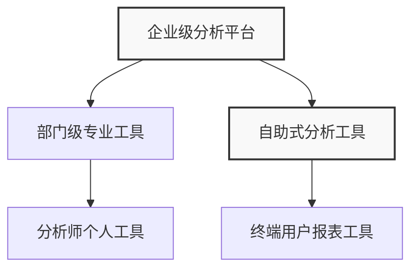
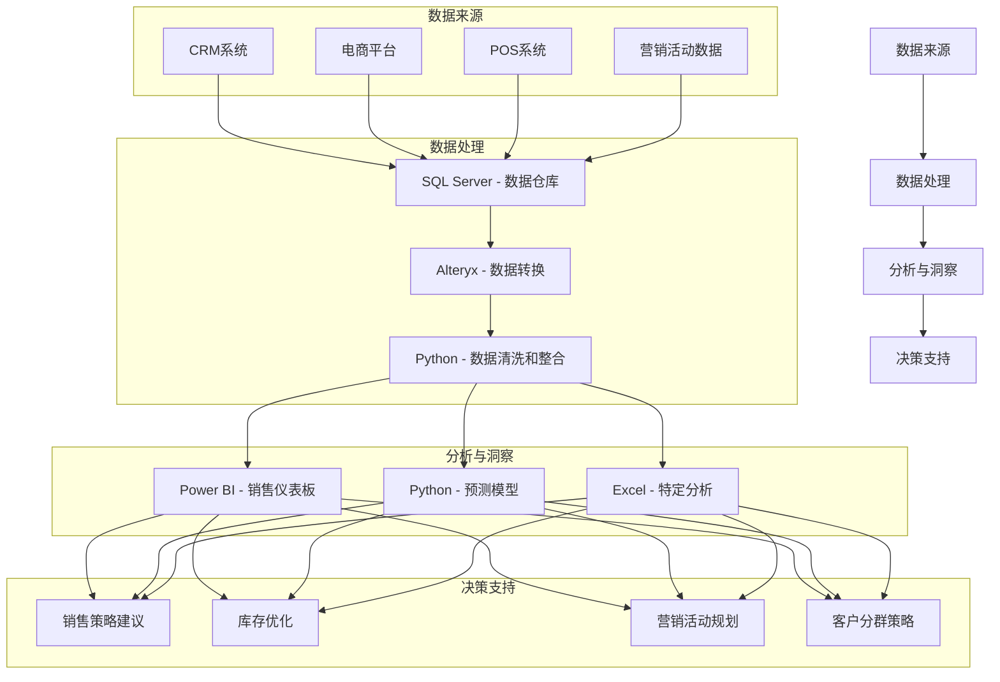
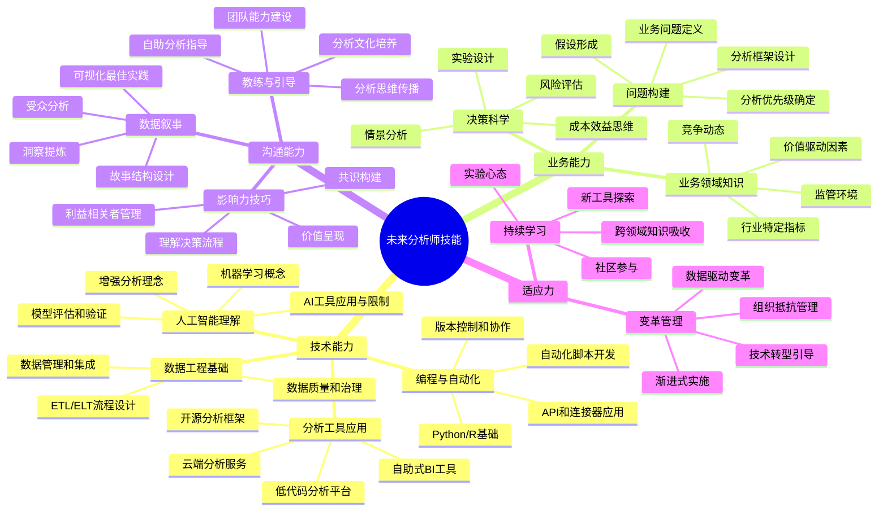

---
{"dg-publish":true,"tags":["商业分析","分析工具","数据可视化","商业智能","分析软件"],"创建日期":"2024-04-27","permalink":"/知识共享/002_商业分析/01_学习内容/03_分析方法与工具/3.5 分析工具与软件/","dgPassFrontmatter":true}
---


# 3.5 分析工具与软件

> [!quote] 概述
> 高效的商业分析离不开专业工具和软件的支持。本文系统介绍商业分析中常用的各类工具与软件，包括数据处理工具、统计分析软件、数据可视化平台、商业智能系统等，并提供选择指南和应用实践，帮助分析师构建适合自身需求的工具栈，提升分析效率和效果。

## 商业分析工具概述

### 工具分类与功能定位

商业分析工具可以根据其功能和用途分为多个类别：

**按功能分类**：
1. **数据采集与处理工具**：用于数据收集、清洗、转换和整合
2. **统计分析工具**：用于数据分析、建模和预测
3. **数据可视化工具**：用于创建图表、仪表板和视觉叙事
4. **商业智能平台**：提供端到端的数据分析和报告解决方案
5. **专业领域工具**：针对特定行业或应用场景的分析工具
6. **协作与展示工具**：用于共享分析结果和团队协作

**按技术门槛分类**：
1. **低代码/无代码工具**：如Excel、Power BI、Tableau
2. **编程语言及其生态**：如Python、R、SQL
3. **企业级平台**：如SAS、IBM Cognos、Oracle Analytics

**按部署方式分类**：
1. **桌面应用**：安装在本地计算机上
2. **云服务**：基于云端的SaaS解决方案
3. **混合部署**：结合本地和云端资源的解决方案

### 工具选择的关键考量因素

选择合适的分析工具需要考虑多方面因素：

1. **业务需求**
   - 分析的复杂度和深度
   - 数据量级和更新频率
   - 结果展示和共享需求
   - 与现有系统的集成需要

2. **用户因素**
   - 用户的技术水平
   - 学习曲线和培训成本
   - 用户数量和类型
   - 协作需求

3. **技术因素**
   - 数据源类型和格式
   - 性能和扩展性需求
   - 安全性和合规性要求
   - IT基础设施和支持

4. **成本因素**
   - 初始投资成本
   - 持续维护和升级成本
   - 用户许可模式
   - 总体拥有成本(TCO)

5. **战略考量**
   - 长期发展方向
   - 厂商生态和社区支持
   - 市场趋势和技术演进
   - 组织数据战略

### 构建分析工具栈的策略

有效的分析工具栈应当满足组织各层次的分析需求：



**关键策略**：

1. **平衡标准化与灵活性**
   - 核心平台标准化，确保数据一致性
   - 允许不同团队使用专业工具满足特定需求
   - 建立工具间数据流转和结果共享的机制

2. **考虑用户旅程和采用路径**
   - 为不同技能水平的用户提供适当工具
   - 设计清晰的工具使用培训路径
   - 提供模板和最佳实践加速采用

3. **关注数据治理与集成**
   - 确保各工具间的数据定义一致
   - 建立元数据管理和数据血缘追踪
   - 实现分析结果的有效整合与共享

4. **前瞻性规划**
   - 考虑未来数据量增长和分析需求变化
   - 关注新兴技术和分析方法
   - 保持工具栈的可扩展性和适应性

## 基础数据处理工具

### 电子表格软件

电子表格是最广泛使用的数据分析工具，适合中小规模数据的处理和分析。

#### Microsoft Excel

**核心功能**：
- 数据输入、整理和基础计算
- 透视表和透视图
- 数据分析工具包
- 图表和可视化
- 数据建模和Power Pivot
- 宏和VBA编程

**适用场景**：
- 日常数据分析和报告
- 简单模型构建和假设分析
- 中小规模数据集处理(百万行以内)
- 快速原型开发和验证

**高级应用技巧**：
- **数据分析自动化**：使用VBA创建自动生成报告和分析的宏
- **数据模型构建**：利用Power Pivot创建关系型数据模型
- **"假如"分析**：使用数据表和情景管理器进行敏感性分析
- **高级图表**：结合基本图表和形状创建自定义可视化效果
- **外部数据连接**：连接到数据库、文本文件和Web数据源

**示例应用**：销售数据分析仪表板
```
1. 创建销售数据表包含日期、产品、区域、销售额等字段
2. 使用SUMIFS、AVERAGEIFS等函数计算各维度汇总指标
3. 创建透视表分析不同维度的销售表现
4. 设计综合仪表板，包含关键指标、趋势图和下钻分析
5. 添加切片器和时间轴实现交互式筛选
```

#### Google Sheets

**主要特点**：
- 基于云的协作性
- 实时多人编辑
- 内置调查表单集成
- 与其他Google服务集成
- 自动版本历史

**优势应用场景**：
- 团队协作分析项目
- 跨设备和位置访问
- 实时数据收集和分析
- 轻量级Web应用集成

**实用功能**：
- QUERY函数使用类SQL语法处理数据
- IMPORTRANGE连接不同表格的数据
- Google Finance函数获取实时金融数据
- Apps Script扩展功能和自动化工作流

### 数据库管理工具

数据库管理工具用于访问、查询和管理结构化数据，是处理大规模数据的基础。

#### SQL工具

**主要SQL客户端**：
- **MySQL Workbench**：MySQL数据库的官方工具
- **pgAdmin**：PostgreSQL数据库管理工具
- **SSMS(SQL Server Management Studio)**：微软SQL Server的管理工具
- **DBeaver**：支持多种数据库的通用客户端
- **Datagrip**：JetBrains出品的数据库IDE

**核心功能**：
- SQL查询编写和执行
- 数据库对象管理
- 数据导入导出
- 查询计划分析和优化
- 数据库监控和管理

**商业分析中的应用**：
- 数据整合和清洗
- 复杂聚合查询
- 定期报告自动化
- 数据质量检查
- ETL过程开发

**SQL分析案例**：客户细分分析
```sql
-- 根据购买行为将客户分为不同价值段
SELECT 
    CASE 
        WHEN total_spent > 10000 THEN 'High Value'
        WHEN total_spent > 5000 THEN 'Medium Value'
        ELSE 'Low Value'
    END AS customer_segment,
    COUNT(customer_id) AS customer_count,
    AVG(total_spent) AS avg_spent,
    AVG(purchase_frequency) AS avg_frequency
FROM (
    SELECT 
        customer_id,
        SUM(order_amount) AS total_spent,
        COUNT(order_id) AS purchase_frequency
    FROM orders
    WHERE order_date BETWEEN '2023-01-01' AND '2023-12-31'
    GROUP BY customer_id
) customer_metrics
GROUP BY 1
ORDER BY AVG(total_spent) DESC;
```

#### ETL工具

ETL(提取、转换、加载)工具用于数据集成和处理流程自动化。

**常见ETL工具**：
- **Talend Open Studio**：开源的数据集成平台
- **Pentaho Data Integration**：开源ETL工具
- **SSIS(SQL Server Integration Services)**：微软的ETL工具
- **Informatica PowerCenter**：企业级数据集成平台
- **Apache NiFi**：数据流管理系统

**主要功能**：
- 连接多种数据源
- 数据转换和清洗
- 工作流设计和调度
- 错误处理和日志记录
- 数据质量检测

**应用场景**：
- 定期数据仓库加载
- 数据迁移和整合
- 报表数据准备
- 主数据管理
- 数据质量管理

## 统计分析与数据科学工具

### 专业统计软件

专业统计软件提供全面的统计分析功能，适用于高级统计建模和研究。

#### SPSS/SAS

**核心功能**：
- 描述性统计分析
- 假设检验
- 高级统计模型
- 预测分析
- 调查和市场研究分析
- 决策树和聚类分析

**适用场景**：
- 市场研究分析
- 学术研究项目
- 医疗和生命科学研究
- 社会科学调查
- 质量管理与流程优化

**优势**：
- 完整的统计功能集
- 图形化界面降低学习门槛
- 强大的数据处理能力
- 专业技术支持和文档
- 行业特定的解决方案包

#### R语言

**核心生态**：
- **RStudio**：最流行的R开发环境
- **tidyverse**：数据科学工具集，包括dplyr、ggplot2等
- **caret**：机器学习模型训练和评估
- **shiny**：交互式应用和仪表板开发
- **rmarkdown**：创建动态文档和报告

**商业分析应用**：
- 高级统计分析和建模
- 自定义可视化和报告
- 预测模型开发
- 文本挖掘和自然语言处理
- 地理空间分析

**代码示例**：销售预测模型
```r
# 加载所需包
library(tidyverse)
library(forecast)

# 读取数据
sales_data <- read_csv("monthly_sales.csv")

# 准备时间序列
sales_ts <- ts(sales_data$sales, frequency=12, start=c(2018,1))

# 探索性分析
autoplot(sales_ts) + 
  ggtitle("Monthly Sales Trend") +
  theme_minimal()

# 季节性分解
sales_decomposed <- stl(sales_ts, s.window="periodic")
autoplot(sales_decomposed)

# 构建预测模型
sales_model <- auto.arima(sales_ts)
summary(sales_model)

# 预测未来12个月
sales_forecast <- forecast(sales_model, h=12)
autoplot(sales_forecast) +
  ggtitle("Sales Forecast for Next 12 Months")

# 导出预测结果
forecast_table <- as.data.frame(sales_forecast)
write_csv(forecast_table, "sales_forecast.csv")
```

### Python数据科学生态

Python已成为数据科学和商业分析最流行的编程语言之一，拥有丰富的库和工具。

#### 核心库与工具

**数据处理和分析**：
- **pandas**：数据结构和分析工具
- **numpy**：科学计算基础库
- **scipy**：科学和技术计算
- **statsmodels**：统计模型估计和推断

**机器学习**：
- **scikit-learn**：通用机器学习库
- **TensorFlow**/**PyTorch**：深度学习框架
- **XGBoost**/**LightGBM**：高性能梯度提升库

**可视化**：
- **matplotlib**：基础绘图库
- **seaborn**：基于matplotlib的统计可视化
- **plotly**：交互式可视化
- **dash**：构建分析应用和仪表板

**开发环境**：
- **Jupyter Notebook/Lab**：交互式开发环境
- **VSCode**：通用代码编辑器，支持Python
- **Anaconda**：Python数据科学平台

#### 商业分析应用实例

**客户流失预测分析**：
```python
import pandas as pd
import numpy as np
import matplotlib.pyplot as plt
import seaborn as sns
from sklearn.model_selection import train_test_split
from sklearn.preprocessing import StandardScaler
from sklearn.ensemble import RandomForestClassifier
from sklearn.metrics import classification_report, confusion_matrix, roc_auc_score
import shap

# 加载数据
df = pd.read_csv('telco_customer_data.csv')

# 数据探索
print(df.shape)
print(df.info())
print(df.describe())

# 处理缺失值
df = df.dropna()

# 特征工程
df['tenure_years'] = df['tenure'] / 12
df['total_charges_per_month'] = df['TotalCharges'] / df['tenure']
df = pd.get_dummies(df, columns=['Contract', 'PaymentMethod', 'InternetService'])

# 相关性分析
correlation = df.corr()
plt.figure(figsize=(12, 10))
sns.heatmap(correlation, annot=True, cmap='coolwarm', linewidths=0.5)
plt.title('Feature Correlation Matrix')
plt.tight_layout()
plt.savefig('correlation_matrix.png')

# 准备模型数据
X = df.drop(['customerID', 'Churn'], axis=1)
y = df['Churn'].map({'Yes': 1, 'No': 0})

X_train, X_test, y_train, y_test = train_test_split(X, y, test_size=0.3, random_state=42)

scaler = StandardScaler()
X_train_scaled = scaler.fit_transform(X_train)
X_test_scaled = scaler.transform(X_test)

# 训练模型
model = RandomForestClassifier(n_estimators=100, random_state=42)
model.fit(X_train_scaled, y_train)

# 评估模型
y_pred = model.predict(X_test_scaled)
y_prob = model.predict_proba(X_test_scaled)[:, 1]

print("Classification Report:")
print(classification_report(y_test, y_pred))

print(f"ROC AUC Score: {roc_auc_score(y_test, y_prob):.4f}")

# 特征重要性
feature_importance = pd.DataFrame({
    'Feature': X.columns,
    'Importance': model.feature_importances_
}).sort_values('Importance', ascending=False)

plt.figure(figsize=(10, 8))
sns.barplot(x='Importance', y='Feature', data=feature_importance.head(15))
plt.title('Top 15 Feature Importance')
plt.tight_layout()
plt.savefig('feature_importance.png')

# SHAP值解释
explainer = shap.TreeExplainer(model)
shap_values = explainer.shap_values(X_test_scaled)

plt.figure(figsize=(12, 8))
shap.summary_plot(shap_values[1], X_test, feature_names=X.columns)
plt.savefig('shap_summary.png')

# 保存模型
import joblib
joblib.dump(model, 'churn_prediction_model.pkl')
joblib.dump(scaler, 'scaler.pkl')

print("Analysis complete. Model and visualizations saved.")
```

## 商业智能与可视化工具

### 自助式BI平台

自助式商业智能(BI)平台允许业务用户创建报告和仪表板，无需大量技术技能。

#### Power BI

**主要组件**：
- **Power BI Desktop**：用于创建报告和数据模型的桌面应用
- **Power BI Service**：云端共享和协作平台
- **Power BI Mobile**：移动设备应用
- **Power BI Report Server**：本地部署版本

**核心功能**：
- 多数据源连接和集成
- 数据转换和建模
- 交互式可视化和仪表板
- 自然语言查询
- 内置AI分析功能
- 数据刷新和报表共享

**商业分析应用**：
- 销售和营销业绩分析
- 财务报表和预算分析
- 运营效率监控
- 客户洞察和细分
- KPI仪表板和战略监控

**应用案例**：构建销售分析仪表板
1. 连接销售数据源(CRM系统、Excel文件或数据库)
2. 使用Power Query清洗和转换数据
3. 创建数据模型，建立产品、客户和时间表的关系
4. 开发包含关键指标、趋势和细分数据的可视化
5. 添加交互筛选器和钻取功能
6. 设置数据刷新计划并发布到Power BI Service

#### Tableau

**主要组件**：
- **Tableau Desktop**：功能完备的数据分析和可视化工具
- **Tableau Server/Online**：企业共享和协作平台
- **Tableau Prep**：数据准备工具
- **Tableau Mobile**：移动应用

**核心功能**：
- 强大的可视化能力
- 直观的拖放界面
- 高级地图可视化
- 数据混合和连接
- 动态仪表板
- 丰富的视觉分析功能

**商业分析应用**：
- 高级数据探索和分析
- 复杂可视化叙事
- 地理空间分析
- 时间序列预测
- 大规模数据分析

**最佳实践**：
- 优先考虑用户体验和设计
- 保持可视化简洁明了
- 适当使用颜色和标注
- 提供上下文信息和指导
- 设计移动友好的仪表板
- 确保性能优化

### 数据可视化专业工具

除了综合BI平台，还有专注于特定可视化需求的工具。

#### 图表和信息图工具

**多用途可视化工具**：
- **Infogram**：创建交互式图表和信息图
- **Canva**：设计导向的图表和展示
- **Visme**：展示和信息图设计
- **Piktochart**：信息图和视觉故事

**适用场景**：
- 市场营销材料
- 客户展示
- 社交媒体内容
- 报告增强

#### 专业可视化库

**高级可视化开发库**：
- **D3.js**：强大的JavaScript可视化库
- **Highcharts**：交互式JavaScript图表
- **Vega**：声明式可视化语法
- **Bokeh**：Python交互式可视化

**适用场景**：
- 定制高度定制的可视化
- 交互式Web应用
- 集成到现有应用
- 创建新型可视化类型

**示例应用**：使用D3.js创建交互式销售漏斗
```javascript
// 基本设置
const width = 800, height = 400;
const margin = {top: 20, right: 20, bottom: 30, left: 40};

// 数据
const data = [
  {stage: "Leads", value: 5000},
  {stage: "Qualified Leads", value: 3500},
  {stage: "Opportunities", value: 2200},
  {stage: "Proposals", value: 1200},
  {stage: "Negotiations", value: 800},
  {stage: "Closed Won", value: 500}
];

// 创建SVG
const svg = d3.select("#funnel")
  .append("svg")
  .attr("width", width)
  .attr("height", height);

// 计算比例
const x = d3.scaleBand()
  .domain(data.map(d => d.stage))
  .range([margin.left, width - margin.right])
  .padding(0.1);

const y = d3.scaleLinear()
  .domain([0, d3.max(data, d => d.value)])
  .range([height - margin.bottom, margin.top]);

// 绘制漏斗
svg.selectAll("rect")
  .data(data)
  .enter()
  .append("rect")
  .attr("x", d => x(d.stage))
  .attr("y", d => y(d.value))
  .attr("width", x.bandwidth())
  .attr("height", d => height - margin.bottom - y(d.value))
  .attr("fill", (d, i) => d3.schemeBlues[6][i+1]);

// 添加坐标轴和标签
svg.append("g")
  .attr("transform", `translate(0,${height - margin.bottom})`)
  .call(d3.axisBottom(x));

svg.append("g")
  .attr("transform", `translate(${margin.left},0)`)
  .call(d3.axisLeft(y));

// 添加数值标签
svg.selectAll(".value")
  .data(data)
  .enter()
  .append("text")
  .attr("class", "value")
  .attr("x", d => x(d.stage) + x.bandwidth()/2)
  .attr("y", d => y(d.value) - 5)
  .attr("text-anchor", "middle")
  .text(d => d.value);
``` 

## 专业领域分析工具

除了通用数据分析工具外，特定业务领域往往需要专门的分析软件来解决特定问题。

### 市场研究与调查工具

市场研究和调查工具帮助企业收集、分析和解读市场和客户信息。

#### 调查设计与数据收集

**主要工具**：
- **Qualtrics**：企业级调查和研究平台
- **SurveyMonkey**：灵活易用的在线调查工具
- **Google Forms**：免费的基础调查工具
- **TypeForm**：交互式用户友好调查
- **LimeSurvey**：开源调查软件

**关键功能**：
- 多种问题类型和逻辑分支
- 样本管理和配额控制
- 多渠道分发(电子邮件、社交媒体、二维码)
- 实时回复跟踪
- 移动兼容设计

**分析能力**：
- 基础统计分析
- 交叉分析和筛选
- 情感分析和文本分析
- 调查结果可视化
- 数据导出和集成

#### 用户体验与测试工具

**主要工具**：
- **UserTesting**：远程用户体验测试
- **Hotjar**：热图和用户行为记录
- **Optimizely**：A/B测试平台
- **Lookback**：用户研究和访谈平台
- **Usabilla**：用户反馈收集工具

**应用场景**：
- 网站或应用可用性测试
- 用户行为分析
- 原型和概念测试
- 竞争产品比较
- 用户满意度评估

### 财务与业务规划工具

财务和业务规划工具帮助企业管理财务、预测业绩并制定战略规划。

#### 财务分析软件

**主要工具**：
- **Microsoft Power BI for Finance**：财务数据可视化
- **Anaplan**：业务规划和预测平台
- **Adaptive Insights**：财务规划和分析
- **Prophix**：企业绩效管理
- **Jedox**：财务规划和分析

**核心功能**：
- 财务报表自动生成
- 预算和预测
- 财务建模和情景分析
- 现金流分析
- 关键财务指标跟踪

**分析能力**：
- 差异分析
- 趋势识别和预测
- 敏感性分析
- 部门和成本中心比较
- 财务健康评估

#### 业务建模工具

**主要工具**：
- **Causal**：财务模型和情景规划
- **Quantrix**：多维业务建模
- **Alteryx**：业务流程和预测建模
- **Solver**：企业资源优化平台
- **Vanguard Forecast Server**：需求预测和规划

**应用场景**：
- 收入和成本预测
- 投资回报分析
- 情景规划和假设分析
- 产品定价策略分析
- 资源优化与分配

### 营销分析工具

营销分析工具帮助企业评估营销活动的效果、优化营销策略并提高投资回报。

#### 网络分析平台

**主要工具**：
- **Google Analytics**：网站分析标准
- **Adobe Analytics**：企业级网站和营销分析
- **Matomo**：注重隐私的开源分析
- **Mixpanel**：产品和用户行为分析
- **Amplitude**：产品分析平台

**核心指标**：
- 流量和来源分析
- 用户行为和转化路径
- 参与度和留存率
- 页面性能和用户体验
- 营销活动效果

**分析能力**：
- 归因模型分析
- 漏斗和转化率优化
- 细分分析
- 自定义事件跟踪
- 预测和趋势分析

#### 社交媒体分析工具

**主要工具**：
- **Sprout Social**：社交媒体管理和分析
- **Hootsuite Analytics**：社交媒体性能跟踪
- **Brandwatch**：社交媒体监听和消费者洞察
- **Buffer**：社交媒体管理与分析
- **Keyhole**：标签和关键词跟踪

**关键功能**：
- 受众分析和洞察
- 内容效果评估
- 参与度和影响力测量
- 竞争对手分析
- 情感分析和提及监控

**应用场景**：
- 社交媒体活动评估
- 品牌健康监控
- 受众细分和定位
- 内容策略优化
- 影响者识别和管理

## 协作与报告工具

有效的分析成果传达和团队协作对于商业分析成功至关重要。

### 协作分析平台

协作分析平台使团队能够共同研究数据并分享见解。

#### 协作工作空间

**主要工具**：
- **Microsoft Teams + Power BI**：集成的协作和分析环境
- **Slack + 数据分析集成**：通信平台与分析工具结合
- **Confluence + 分析插件**：知识管理与分析结合
- **Notion**：笔记、文档和知识库
- **Airtable**：将电子表格、数据库和协作结合

**协作功能**：
- 实时文档协作
- 分析结果共享和讨论
- 版本控制和历史跟踪
- 任务分配和工作流管理
- 权限控制和安全性

**整合策略**：
- 构建分析社区和知识库
- 建立标准化的分析模板
- 实现分析结果的自动更新和发布
- 创建决策过程的透明度
- 促进跨团队学习和共享

### 报告与展示工具

报告和展示工具帮助将分析结果转化为有影响力的故事和决策支持。

#### 动态报告工具

**主要工具**：
- **Google Data Studio**：免费的数据可视化和报告
- **Looker**：企业数据平台
- **Zoho Analytics**：商业智能和分析平台
- **Sisense**：商业智能和大数据分析
- **QlikView/QlikSense**：自助分析和可视化

**报告功能**：
- 交互式仪表板
- 自动数据刷新
- 参数化报告
- 钻取和探索能力
- 计划分发和提醒

**设计最佳实践**：
- 清晰的视觉层次结构
- 一致的配色方案和布局
- 关注主要洞察和行动点
- 提供适当的上下文和注释
- 设计多设备兼容的报告

#### 故事叙述与展示

**主要工具**：
- **PowerPoint + 数据驱动图表**：传统演示工具加强版
- **Prezi**：非线性动态演示
- **Beautiful.ai**：智能演示设计工具
- **Flourish**：数据叙事和互动故事
- **DataWrapper**：简单的图表和地图叙事

**故事叙述技巧**：
- 建立清晰的叙事结构(背景、发现、意义、行动)
- 优先展示最重要的见解
- 使用视觉辅助增强理解
- 适应不同受众的沟通风格
- 提供可操作的建议和后续步骤

**展示实例**：利用数据讲述客户流失故事
1. 开场：流失问题概览和业务影响
2. 背景：客户数据和流失定义说明
3. 发现：关键流失驱动因素分析和模式
4. 细分：高风险客户群特征
5. 预测：流失预警系统和准确度
6. 行动：针对性干预策略和预期影响
7. 实施：行动计划和资源需求
8. 跟进：成功指标和监控方案

## 工具选择与能力建设

### 分析工具选择框架

选择合适的分析工具需要系统化的评估过程。

#### 需求分析与工具匹配

**评估维度**：

| 维度 | 考量因素 | 评估问题 |
|------|---------|---------|
| 数据特性 | 数据量、类型、格式、更新频率 | 工具能否处理我们的数据规模和复杂度？ |
| 分析需求 | 分析类型、复杂度、定制化程度 | 工具能否支持所需的分析方法和技术？ |
| 用户能力 | 技术水平、学习意愿、分析成熟度 | 目标用户能否有效使用该工具？ |
| 集成需求 | 现有系统、数据流、工作流程 | 工具如何与现有环境集成？ |
| 扩展性 | 用户规模、数据增长、功能演进 | 工具能否随组织需求变化而扩展？ |
| 总体成本 | 许可费用、实施成本、维护成本 | 总体拥有成本是否合理？投资回报如何？ |

**选择流程**：
1. 确定关键业务需求和用例
2. 定义功能要求和技术规格
3. 建立评估标准和权重
4. 研究和筛选候选工具
5. 进行概念验证或试点测试
6. 评估结果并做出决策
7. 制定实施和培训计划

#### 工具生态系统规划

**整合战略**：
- **核心与专业工具平衡**：确定企业级核心平台和专业工具的适当组合
- **数据流设计**：规划工具间的数据流动和交互方式
- **扩展与定制**：考虑工具的API、插件和自定义能力
- **渐进式采用**：制定分阶段实施计划，从小规模成功开始

**治理考虑**：
- 数据定义和标准一致性
- 安全性和访问控制
- 工具使用指南和最佳实践
- 培训和能力建设
- 持续评估和优化

### 分析能力建设路径

有效的分析工具采用需要配套的能力建设计划。

#### 技能发展框架

**关键技能领域**：
1. **技术技能**
   - 工具操作能力
   - 数据处理和转换
   - 分析方法应用
   - 可视化设计

2. **分析思维**
   - 问题构建
   - 假设形成和测试
   - 数据解读
   - 批判性思考

3. **业务应用**
   - 将分析转化为洞察
   - 决策支持
   - 业务案例开发
   - 影响力评估

4. **沟通能力**
   - 数据故事讲述
   - 可视化最佳实践
   - 针对不同受众的沟通
   - 有效展示技巧

**技能发展路径**：

| 级别 | 目标 | 培训方法 | 评估方式 |
|------|------|----------|----------|
| 入门级 | 基本工具操作<br>标准报告创建<br>数据理解 | 在线课程<br>指导实践<br>模板使用 | 基础测验<br>简单项目完成<br>同行评审 |
| 中级 | 高级分析技术<br>自定义分析<br>数据探索与发现 | 高级培训<br>实际项目<br>专题研讨会 | 复杂分析案例<br>项目交付<br>技术认证 |
| 高级 | 分析策略制定<br>创新方法应用<br>指导与领导 | 专业研讨会<br>外部培训<br>实践社区领导 | 业务影响评估<br>创新案例<br>知识分享 |

#### 组织能力建设

**成熟度模型**：
1. **基础阶段**：基本工具采用和标准报告
2. **发展阶段**：扩展分析能力和自助分析
3. **成熟阶段**：预测分析和数据驱动决策
4. **领先阶段**：高级分析和创新应用
5. **转型阶段**：全组织分析文化和数据驱动

**实施策略**：
- 建立分析卓越中心或专家团队
- 发展内部培训师和工具冠军
- 创建学习路径和认证体系
- 建立知识共享平台和最佳实践库
- 举办内部分析竞赛和展示

**测量与改进**：
- 跟踪工具采用率和使用深度
- 评估培训效果和技能提升
- 衡量分析项目的业务影响
- 收集用户反馈持续改进
- 定期评估工具组合并更新

## 分析工具趋势与未来发展

### 新兴工具与技术

技术进步不断推动分析工具的发展和创新。

#### 人工智能增强分析

**主要趋势**：
- **自然语言查询**：使用自然语言提问获取数据洞察
- **自动洞察发现**：系统自动识别异常和模式
- **智能数据准备**：AI辅助数据清洗和转换
- **预测分析自动化**：简化预测模型创建和维护
- **智能可视化推荐**：系统建议最佳图表类型和格式

**代表性产品**：
- **IBM Cognos Analytics**：集成AI辅助洞察
- **Microsoft Power BI**：Q&A和AI洞察功能
- **ThoughtSpot**：基于搜索的分析平台
- **Tableau Ask Data**：自然语言分析功能
- **Domo**：AI驱动的商业云平台

#### 低代码/无代码分析平台

**核心特点**：
- 可视化开发界面
- 拖放式分析流程设计
- 预构建分析组件库
- 模板和最佳实践集成
- 简化的部署和共享

**代表性产品**：
- **Alteryx Designer**：数据准备和分析流程
- **KNIME**：开源数据分析平台
- **RapidMiner**：自动化数据科学平台
- **Dataiku**：协作数据科学平台
- **Trifacta**：数据整理和准备平台

### 分析工具生态系统未来

分析工具生态系统将继续发展，适应新的业务需求和技术可能性。

#### 预期发展方向

**集成与互操作性**：
- 工具之间的无缝集成
- 通用数据标准和交换格式
- 跨平台工作流自动化
- 内置连接器和API生态系统
- 统一的分析体验

**智能化与自主化**：
- 自动化整个分析流程
- 持续学习和适应用户行为
- 主动提供洞察和建议
- 预测用户需求和问题
- 自我优化和调整

**民主化与赋能**：
- 将高级分析能力扩展到更多人
- 简化复杂分析技术的使用
- 提供情境化的指导和支持
- 建立协作和知识共享机制
- 关注分析结果的可操作性

#### 采用创新分析工具的策略

**评估新技术的框架**：
1. **业务价值**：新工具如何解决现有痛点或创造新价值？
2. **成熟度评估**：技术成熟度和市场接受度如何？
3. **整合成本**：采用新工具的总体成本和复杂度是什么？
4. **风险管理**：潜在风险和缓解策略是什么？
5. **长期前景**：技术提供商的稳定性和发展路线图如何？

**循序渐进的采用策略**：
- 从小规模概念验证开始
- 识别有明确价值的特定用例
- 将新工具与现有环境并行使用
- 建立明确的评估标准和成功指标
- 渐进式扩展成功的实施

## 实战指南与最佳实践

### 构建综合分析解决方案

在实际商业环境中，单一工具往往无法满足全面的分析需求，需要构建整合多种工具的综合解决方案。

#### 解决方案设计原则

**以业务为中心**：
- 从业务问题和决策需求出发
- 构建支持完整分析流程的工具链
- 优先解决高价值、高频率的分析场景
- 平衡短期效益和长期能力建设

**数据流畅通**：
- 确保数据在不同工具间无缝流转
- 建立统一的数据源和标准
- 减少重复数据输入和手动传递
- 自动化数据提取、转换和加载过程

**用户体验优先**：
- 根据用户技能水平选择合适工具
- 设计直观的工作流程和界面
- 提供足够的培训和支持资源
- 逐步引导用户从简单到复杂工具迁移

#### 案例：销售分析解决方案设计

**业务需求**：
- 监控销售业绩与趋势
- 分析客户购买行为和忠诚度
- 评估营销活动效果
- 预测未来销售并优化库存

**解决方案架构**：



**工具选择理由**：
- SQL Server：集中存储和管理大量销售数据
- Alteryx：简化跨系统数据整合和转换流程
- Power BI：创建交互式销售仪表板，适合业务用户
- Python：开发预测模型和进行高级分析
- Excel：提供灵活的临时分析和报告功能

**实施路径**：
1. 建立数据仓库和基础销售报表
2. 开发自动化数据流程和定期报告
3. 构建交互式分析仪表板
4. 实施预测分析和高级模型
5. 持续优化和扩展分析能力

### 常见分析场景工具选择指南

不同的业务分析场景需要不同的工具组合，以下是常见分析场景的工具选择建议。

#### 销售分析工具组合

**适用场景**：销售趋势分析、客户购买行为、产品组合评估、销售预测

**推荐工具组合**：
- **核心工具**：Power BI 或 Tableau
- **辅助工具**：Excel（临时分析）、SQL（数据提取）
- **高级分析**：Python（预测分析）、SPSS（市场篮子分析）
- **数据源**：CRM系统、销售数据库、电商平台

**典型分析流程**：
1. 使用SQL从数据库提取核心销售数据
2. 通过Excel进行初步整理和快速分析
3. 在Power BI中创建销售仪表板和交互式报告
4. 使用Python构建销售预测模型和客户细分
5. 将分析结果整合为决策支持建议

#### 市场研究工具组合

**适用场景**：市场趋势分析、消费者研究、竞争对手监测、市场机会评估

**推荐工具组合**：
- **核心工具**：Qualtrics（调研）、Tableau（数据可视化）
- **辅助工具**：SPSS（统计分析）、Excel（数据处理）
- **高级分析**：R（高级统计）、NVivo（定性分析）
- **数据源**：问卷调查、行业报告、社交媒体数据

**典型分析流程**：
1. 使用Qualtrics设计和执行市场研究调查
2. 通过SPSS进行统计显著性分析和相关性研究
3. 使用R进行细分分析和模型构建
4. 在Tableau中创建研究结果的可视化报告
5. 将市场洞察与内部数据整合，形成战略建议

#### 产品分析工具组合

**适用场景**：产品使用分析、用户行为分析、功能优化、用户体验评估

**推荐工具组合**：
- **核心工具**：Google Analytics、Mixpanel
- **辅助工具**：Hotjar（热图分析）、Optimizely（A/B测试）
- **高级分析**：Python（用户行为模型）、SQL（数据查询）
- **数据源**：应用/网站埋点数据、用户反馈、使用日志

**典型分析流程**：
1. 使用Google Analytics监控产品使用指标和流量数据
2. 通过Hotjar收集用户行为数据和可视化用户旅程
3. 使用Optimizely进行功能和设计的A/B测试
4. 通过Python分析用户行为模式和预测流失风险
5. 整合数据为产品改进提供依据

### 分析实践中的通用技巧

无论使用何种工具，以下通用技巧可以提高商业分析的效率和质量。

#### 数据准备和质量保证

**数据清理最佳实践**：
- 建立自动化数据验证程序，检查完整性和一致性
- 开发标准化的数据处理流程，确保重复性
- 创建数据处理模板，提高团队效率
- 保留原始数据副本，确保可追溯性
- 记录所有数据转换步骤，确保透明度

**数据整合技巧**：
- 使用唯一标识符连接不同数据源
- 统一日期格式和时区处理
- 建立主数据管理流程（客户、产品等）
- 创建数据字典，确保术语一致
- 应用ETL工具处理复杂数据整合

#### 分析效率提升方法

**工作流优化**：
- 创建分析模板和标准流程
- 使用代码或宏自动化重复性任务
- 建立常用分析的脚本库
- 优化查询和处理大数据的方法
- 定期审查和优化分析流程

**协作分析策略**：
- 使用共享工作空间实现团队协作
- 建立统一的命名规则和文件组织
- 实施版本控制管理分析代码和报告
- 创建分析结果的共享仓库
- 定期举行团队分析回顾会议

#### 分析成果呈现技巧

**可视化设计原则**：
- 选择适合数据类型和关系的图表类型
- 保持设计一致性和品牌视觉标准
- 优化信息密度，避免视觉混乱
- 使用色彩和形状增强信息区分度
- 提供适当的上下文和参考信息

**叙事策略**：
- 围绕明确的问题或决策点构建分析故事
- 从核心发现开始，然后提供支持证据
- 结合数字和见解，不仅展示数据
- 量身定制信息深度匹配受众需求
- 提供明确的后续行动建议

## 行业应用实例

不同行业对分析工具的应用各有特色，同时体现了工具的多样性和适应性。

### 零售行业分析案例

零售业高度依赖数据进行库存管理、客户管理和销售预测。

#### 全渠道零售分析平台

**业务背景**：
某全国连锁零售商面临线上线下数据割裂、库存管理效率低下、客户体验不一致等挑战，需要建立全渠道分析能力。

**解决方案架构**：
- **数据集成层**：使用Informatica整合POS、电商平台、CRM和供应链系统数据
- **存储与计算**：搭建基于Azure的数据湖和仓库混合架构
- **分析应用层**：
  - Power BI：构建门店绩效、库存和供应链仪表板
  - Python：开发需求预测和客户分群模型
  - Tableau：创建营销活动分析和ROI评估工具

**关键分析应用**：

1. **实时库存与销售监控**
   - 工具：Power BI + Azure Stream Analytics
   - 功能：近实时监控各渠道销售和库存水平
   - 价值：减少缺货率30%，提高库存周转率25%

2. **客户全旅程分析**
   - 工具：Alteryx（数据准备）+ Python（行为分析）
   - 功能：整合全渠道客户互动数据，识别购买模式
   - 价值：提高交叉销售率18%，提升客户留存率15%

3. **动态定价优化**
   - 工具：R（模型构建）+ Excel（销售团队界面）
   - 功能：基于需求弹性、竞争价格和库存水平优化定价
   - 价值：改善毛利率3个百分点，提高促销效率22%

**实施经验和教训**：
- 成功因素：跨部门数据团队、阶段性实施、注重用户采纳
- 挑战点：旧系统数据质量问题、组织变革阻力、初期绩效指标不一致
- 关键教训：工具应根据最终用户能力选择，技术采纳需要配套的流程变革

### 金融服务行业应用

金融机构利用分析工具进行风险管理、客户分析和投资决策。

#### 银行客户分析平台

**业务背景**：
一家大型商业银行需要提高客户洞察能力，改善客户体验，优化产品推荐，减少客户流失。

**解决方案架构**：
- **数据基础**：基于Hadoop的数据湖存储交易、渠道互动和外部数据
- **分析工具集**：
  - SAS：客户行为分析和预测模型
  - Tableau：客户细分和产品表现可视化
  - Python：开发机器学习模型预测流失风险
  - Power BI：分支机构和客户经理仪表板

**关键分析应用**：

1. **客户行为分析与细分**
   - 工具：SAS Enterprise Miner + Tableau
   - 功能：基于交易行为、渠道偏好和生命周期阶段细分客户
   - 价值：提高营销活动响应率43%，优化渠道资源分配

2. **个性化推荐引擎**
   - 工具：Python (TensorFlow) + Redis
   - 功能：实时分析客户行为提供下一最佳产品推荐
   - 价值：提高交叉销售转化率35%，增加客户产品持有量

3. **流失预警与干预系统**
   - 工具：R（模型构建）+ Salesforce（前端交付）
   - 功能：识别流失风险客户并触发干预流程
   - 价值：减少高价值客户流失率22%，提高挽留活动ROI

**实施经验和教训**：
- 成功因素：高管支持、专注价值快速交付、持续模型优化
- 挑战点：数据隐私合规、遗留系统整合、员工分析技能差距
- 关键教训：平衡技术复杂度和业务可理解性，建立明确的分析价值指标

### 医疗健康行业应用

医疗机构利用分析工具改善患者护理、优化运营和提高研究效率。

#### 医院运营分析系统

**业务背景**：
一家大型医院网络需要提高运营效率、改善患者体验、优化资源分配和降低成本。

**解决方案架构**：
- **数据集成**：使用Health Catalyst整合电子病历、计费系统、患者反馈等数据
- **分析平台**：
  - Tableau：临床和运营仪表板
  - Python：患者流程和预测分析
  - SPSS：临床结果和患者风险分析
  - QlikView：财务绩效和成本分析

**关键分析应用**：

1. **患者流程优化**
   - 工具：Tableau + Python（模拟建模）
   - 功能：分析患者等待时间、资源利用率和流程瓶颈
   - 价值：减少急诊室等待时间35%，提高手术室利用率20%

2. **临床风险预测**
   - 工具：SPSS + R（模型验证）
   - 功能：识别高风险患者并预测再入院概率
   - 价值：降低30天再入院率18%，改善护理资源分配

3. **成本和绩效分析**
   - 工具：QlikView + Excel（财务团队界面）
   - 功能：分析服务线绩效、成本驱动因素和收入机会
   - 价值：降低运营成本8%，提高服务利润率12%

**实施经验和教训**：
- 成功因素：临床医生参与设计、渐进式实施、数据质量控制
- 挑战点：系统集成复杂性、隐私合规要求、临床与管理视角平衡
- 关键教训：分析工具需适应临床工作流，数据治理至关重要

### 制造业分析应用

制造企业利用分析工具优化生产流程、提高质量和管理供应链。

#### 智能制造分析平台

**业务背景**：
一家大型制造企业需要通过数据分析提高生产效率、优化供应链、预测设备维护需求并改善产品质量。

**解决方案架构**：
- **数据收集**：结合IoT传感器、ERP系统和MES（制造执行系统）数据
- **分析工具集**：
  - Splunk：实时设备监控和异常检测
  - Tableau：生产KPI和质量指标仪表板
  - Python：预测性维护模型和供应链优化
  - Microsoft Power BI：执行层仪表板和报告

**关键分析应用**：

1. **预测性维护系统**
   - 工具：Python + Splunk
   - 功能：基于设备传感器数据预测故障风险
   - 价值：减少计划外停机时间45%，延长设备寿命15%

2. **生产优化分析**
   - 工具：Python（优化算法）+ Tableau（可视化）
   - 功能：分析生产瓶颈，优化生产计划和资源配置
   - 价值：提高生产效率22%，减少生产周期18%

3. **供应链可见性与风险管理**
   - 工具：Power BI + Azure ML（预测模型）
   - 功能：监控供应链KPI，预测交付风险和物料需求
   - 价值：降低库存成本14%，提高交付准时率28%

**实施经验和教训**：
- 成功因素：从单一用例开始，技术与业务并重，注重数据基础
- 挑战点：系统互操作性、数据标准化、工业环境中的连接性
- 关键教训：先解决高价值问题，建立数据驱动的决策文化，技术工具需与现场工作流程结合

## 未来趋势与技能发展

分析工具领域正快速发展，影响分析师未来需要掌握的技能。

### 未来主导趋势

分析工具正朝着更加智能、自动化、民主化和集成化的方向发展。

#### 分析民主化与自助服务

**核心趋势**：
- **低代码/无代码分析平台**的普及
- **AI辅助数据准备和分析**功能增强
- **自助式数据发现工具**更加普遍
- **自然语言**查询和分析界面成为标准

**对分析师的影响**：
- 角色从"数据处理者"转变为"分析教练"
- 需要更多关注分析设计和业务问题定义
- 数据治理和质量控制变得更加重要
- 需要掌握培训和指导业务用户的能力

**工具发展预测**：
- 将出现更多专注于特定行业和业务功能的低代码分析平台
- 自助式BI工具将增加更复杂的预测和规范性分析能力
- 企业级BI平台将增强协作和知识管理功能
- 自然语言处理能力将实现更复杂的数据探索和分析

#### 人工智能增强分析

**核心趋势**：
- **自动化洞察发现**成为标准功能
- **预测分析**深度集成到日常工具中
- **增强分析**辅助分析决策和解释结果
- **AI自动化**数据准备和特征工程

**对分析师的影响**：
- 需要理解AI模型的原理和局限性
- 关注结果的解释性和业务相关性
- 发展"人机协作"分析模式和技能
- 更多时间用于验证和应用洞察

**工具发展预测**：
- 分析平台将内置更多自动化异常检测和根因分析功能
- "推荐分析"将指导用户选择合适的分析方法和可视化
- 交互式AI助手将在分析工作流程中提供实时指导
- 自动化报告生成将包含叙事和解释功能

#### 实时分析与流处理

**核心趋势**：
- **流分析平台**应用扩展到更多业务领域
- **事件驱动架构**与分析工具深度整合
- **边缘分析**减少数据传输和处理延迟
- **实时决策支持系统**日益普及

**对分析师的影响**：
- 需要掌握流处理和实时分析的基本概念
- 理解不同时间粒度分析的适用场景
- 发展实时数据可视化和监控技能
- 学习设计触发式决策规则和自动化响应

**工具发展预测**：
- 企业分析平台将增强流处理和批处理的混合能力
- 边缘分析与云分析的混合架构将更加成熟
- 实时分析工具将提供更丰富的上下文整合能力
- 流分析开发将变得更加简化和可视化

### 分析师的未来技能地图

未来的商业分析师需要平衡技术技能、业务知识和沟通能力。

#### 核心能力演变

**技术技能转变**：
- 从单一工具专精到**多工具整合能力**
- 从静态分析到**动态和实时分析**
- 从预定义报告到**探索性和预测性分析**
- 从手动处理到**自动化和程序化思维**

**业务技能提升**：
- 加强跨职能协作和业务理解
- 提高数据叙事和可视化沟通能力
- 发展支持决策的咨询式分析技能
- 增强数据伦理和责任意识

#### 未来分析师技能图谱



#### 技能发展路径

**入门分析师（0-2年）**：
- 掌握1-2种核心分析工具（Excel、Power BI或Tableau）
- 学习基础数据处理和清洗技术
- 掌握基本的描述性统计和可视化原则
- 理解业务基础和关键指标

**中级分析师（2-5年）**：
- 扩展工具箱，掌握SQL和基础编程
- 学习预测分析基础和简单模型
- 开发数据故事讲述和结果呈现能力
- 深化特定业务领域知识和分析最佳实践

**高级分析师（5年+）**：
- 掌握高级分析方法和工具整合
- 发展分析战略和路线图设计能力
- 指导团队和建立分析标准
- 将分析与战略决策流程紧密结合

### 持续学习资源

保持技能更新的关键资源和社区。

#### 学习平台与社区

**在线学习平台**：
- **DataCamp**：提供互动式数据科学和分析课程
- **Coursera**：提供大学和机构的专业分析课程
- **LinkedIn Learning**：提供商业分析和工具使用课程
- **Udemy**：提供实用工具和技术培训
- **分析工具官方学习中心**：如Power BI学习门户、Tableau学习资源

**专业社区**：
- **Kaggle**：数据科学竞赛和学习社区
- **GitHub**：分享和发现分析代码和项目
- **Stack Overflow**：解决技术问题和学习最佳实践
- **Analytics Vidhya**：分析学习和交流平台
- **各工具用户社区**：如Tableau社区、Power BI社区

**会议与活动**：
- **Tableau Conference**：学习Tableau最新功能和最佳实践
- **Microsoft Ignite**：了解Microsoft分析工具的发展
- **ODSC (Open Data Science Conference)**：数据科学和分析会议
- **Gartner Data & Analytics Summit**：了解市场趋势和创新
- **本地用户组会议**：与当地专业人士交流和学习

#### 持续学习策略

**建立个人学习路线图**：
1. 评估当前技能与目标之间的差距
2. 确定高优先级的学习领域
3. 制定分阶段学习计划
4. 平衡工具学习和业务知识
5. 定期更新学习计划以适应新趋势

**实践导向的学习方法**：
- 参与实际项目应用新学技能
- 创建个人分析组合展示项目
- 参与开源项目或分析竞赛
- 教授他人以巩固自身理解
- 接受挑战任务拓展能力边界

**建立学习习惯**：
- 每周分配固定时间学习新技能
- 订阅行业博客和简报保持更新
- 参与专业社区讨论和知识分享
- 建立同行学习小组交流经验
- 定期回顾和反思学习成果

## 自我评估与练习项目

### 分析工具能力自评

**技术能力评估问题**：
1. 你能不能描述你最熟练的三个分析工具及其特长?
2. 你如何处理超出单一工具处理能力的大型数据集?
3. 你有多熟悉自动化重复性分析任务的方法?
4. 你如何评价自己创建有效数据可视化的能力?
5. 你在多大程度上理解预测分析的基本原理和适用条件?

**工作流程评估问题**：
1. 你如何组织和管理分析项目的数据和文件?
2. 你的分析工作有多大程度实现了可复制性?
3. 你如何验证分析结果的准确性和可靠性?
4. 你如何在团队中协作完成分析项目?
5. 你如何确保你的分析考虑了潜在的数据偏差和限制?

**业务应用评估问题**：
1. 你如何将技术分析转化为业务语言的见解?
2. 你在多大程度上参与分析结果的决策应用?
3. 你如何评估一个分析项目的业务影响和价值?
4. 你如何确定分析项目的优先级和范围?
5. 你如何应对分析结果与业务期望不符的情况?

### 综合案例练习：电子商务分析项目

通过完成这个综合案例练习，你可以应用各种分析工具和技能解决实际业务问题。

#### 项目背景

你是一家中型电子商务公司的商业分析师。公司销售各类消费电子产品，每月约20,000笔交易。公司管理层希望通过数据分析提高营销效率、优化产品组合并改善客户体验。

#### 数据集描述

可用数据包括：
- 过去18个月的交易数据（订单编号、日期、产品、价格、数量等）
- 客户资料（客户ID、注册日期、地理位置、客户来源等）
- 产品目录（SKU、类别、品牌、成本、售价、库存等）
- 网站访问日志（页面浏览、停留时间、跳出率等）
- 营销活动数据（活动名称、开始/结束日期、成本、渠道等）

#### 分析任务

**基础分析（适合入门级）**：
1. 创建销售仪表板，显示关键业务指标的趋势和表现
2. 分析产品类别的销售分布和季节性模式
3. 计算并可视化客户获取成本和生命周期价值
4. 识别表现最佳和最差的产品，提供改进建议

**中级分析**：
1. 进行RFM客户细分分析，识别关键客户群
2. 分析购物篮组合，发现产品关联和捆绑机会
3. 评估不同营销渠道的效果和投资回报率
4. 构建客户流失预测模型，识别高风险客户

**高级分析**：
1. 开发动态定价策略建议，考虑需求弹性和竞争因素
2. 创建预测模型，预测未来3个月的销售趋势
3. 设计个性化推荐算法提高交叉销售
4. 开发自动化分析流程，实现每日销售和库存报告

#### 工具选择建议

根据你的技能水平和可用资源，可以选择以下工具组合：

**基础工具组合**：
- Excel：基础数据处理和分析
- Power BI/Tableau：仪表板和可视化
- Google Analytics：网站分析

**进阶工具组合**：
- SQL：数据查询和集成
- Python/R：高级分析和模型构建
- Power BI/Tableau：可视化和报告
- Alteryx/KNIME：数据准备和工作流

**项目交付成果**：
1. 主要发现和建议的执行摘要
2. 交互式仪表板和分析报告
3. 分析方法和工具选择说明
4. 分析结果的业务含义和建议行动
5. 持续监控和分析的建议框架

完成此项目后，评估你的工具选择是否合适，分析过程中遇到的挑战，以及如何在未来项目中改进你的分析方法。

## 参考资料

### 书籍与学习资源

1. **《数据可视化实战：使用Tableau》**，作者：Ryan Sleeper
2. **《数据可视化之美》**，作者：Nathan Yau
3. **《Excel数据分析：商业智能技术》**，作者：Wayne L. Winston
4. **《商业智能与分析》**，作者：Ramesh Sharda等
5. **《Python数据分析》**，作者：Wes McKinney

### 在线学习平台

1. **Coursera**：数据分析工具专项课程
2. **DataCamp**：交互式数据科学和分析学习
3. **LinkedIn Learning**：商业分析和BI工具课程
4. **Udemy**：各种分析工具实践课程
5. **分析工具官方学习中心**：如Power BI学习门户、Tableau学习资源

### 社区与论坛

1. **Stack Overflow**：编程和分析问题解答
2. **Tableau社区**：Tableau用户交流和资源分享
3. **Power BI社区**：Microsoft官方Power BI社区
4. **Reddit数据科学社区**：r/datascience
5. **GitHub**：开源分析项目和代码示例

### 工具资源

1. **分析工具试用版和社区版**：大多数商业工具提供免费试用
2. **开源替代方案**：如KNIME、Orange、RapidMiner社区版
3. **免费学习数据集**：Kaggle数据集、UCI机器学习库
4. **工具比较网站**：如G2、Capterra、TrustRadius
5. **分析博客和新闻**：如KDnuggets、Analytics Vidhya、Towards Data Science 