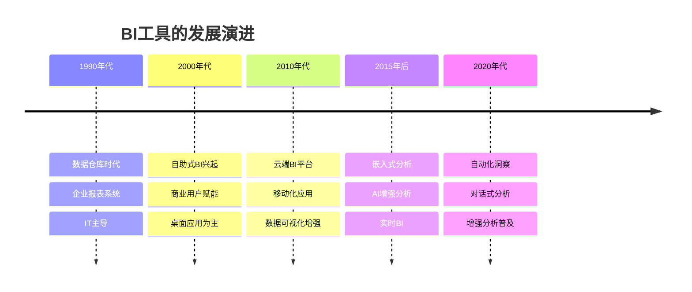
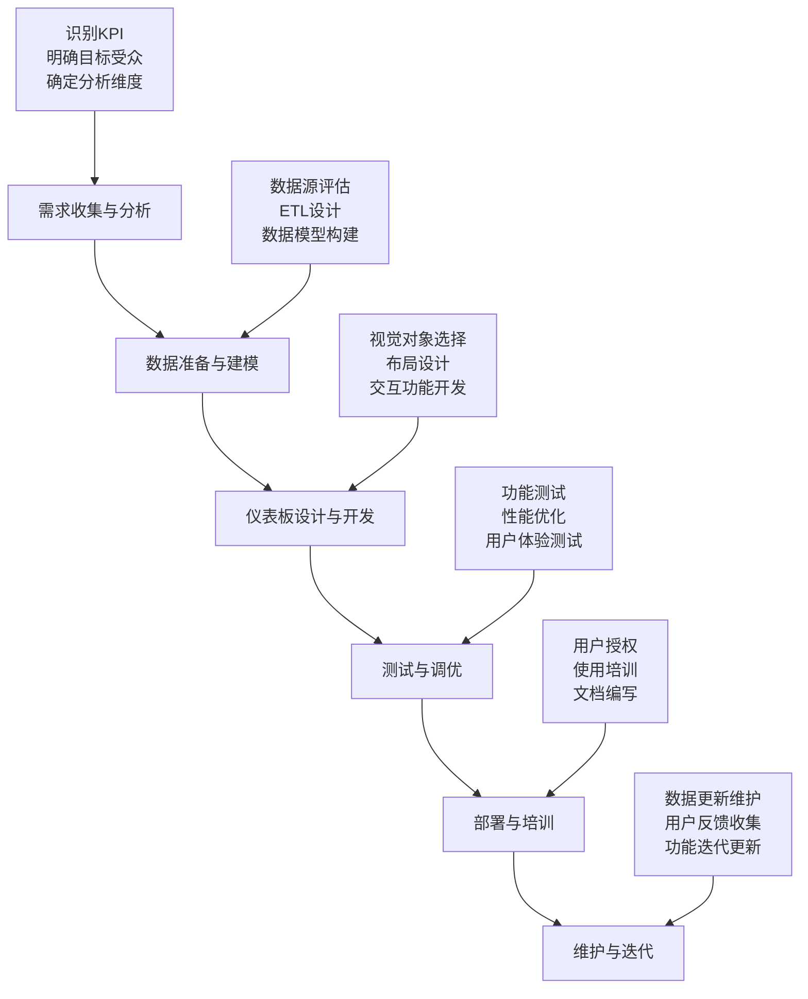

---
{"dg-publish":true,"tags":["商业分析","数据分析","BI工具","Tableau","Power BI","数据可视化"],"创建日期":"2024-05-18","permalink":"/知识共享/002_商业分析/01_学习内容/03_分析方法与工具/3.6 BI工具应用/","dgPassFrontmatter":true}
---

> [!quote] 概述
> 本文深入探讨商业智能(BI)工具在商业分析中的应用，重点介绍主流BI工具的功能特性、适用场景和实操技巧。通过系统化的学习路径，从入门到精通，帮助分析师高效利用BI工具转化数据为业务洞察，支持决策制定。

## 一、BI工具概述

### 1.1 BI工具的定义与价值

BI(商业智能)工具是帮助组织收集、整合、分析数据并将其转化为可视化洞察的软件应用程序。这些工具的核心价值在于：

- **数据整合能力**：连接和整合多种数据源
- **自助式分析**：减少对IT部门的依赖，赋能业务用户
- **交互式可视化**：通过直观的图表展示复杂数据关系
- **实时决策支持**：提供及时的业务洞察
- **数据民主化**：让各级员工都能基于数据做决策

### 1.2 BI工具的发展历程

### 1.3 主流BI工具对比

| 工具名称 | 优势 | 劣势 | 适用场景 | 典型客户 |
|---------|------|------|----------|---------|
| **Tableau** | 强大的可视化能力 直觉式操作界面 庞大的用户社区 | 价格较高 复杂分析需编程 大数据集性能挑战 | 注重数据可视化 市场分析 销售仪表板 | Pfizer Charles Schwab Verizon |
| **Power BI** | 与微软生态集成 成本效益高 频繁的功能更新 | 高级功能需Pro版 自定义视觉对象限制 数据建模相对复杂 | Office环境 预算受限企业 微软技术栈公司 | Adobe Heathrow Airport Nestle |
| **Qlik** | 联想引擎技术 内存处理快速 强大的数据关联 | 学习曲线陡峭 价格较高 较少的开源资源 | 复杂数据关系 多维度分析 数据探索 | Deloitte Cisco Samsung |
| **Looker** | 基于LookML的建模 与云数据库整合 嵌入式分析优势 | 需编程技能 价格高 可视化相对简单 | 数据驱动型企业 SaaS应用 需要统一数据定义 | Spotify Heroku Amazon |
| **Domo** | 全云端架构 移动体验出色 社交协作功能 | 自定义限制 初始成本高 数据导出限制 | 移动决策场景 跨部门协作 业务用户主导 | eBay DHL SAP |

## 二、Tableau详解

### 2.1 Tableau核心功能

Tableau是一款功能强大的数据可视化和分析工具，其核心功能包括：

- **数据连接**：支持连接各种数据源，包括Excel、SQL数据库、云服务等
- **交互式仪表板**：创建可交互、可钻取的分析仪表板
- **拖放式界面**：简单直观的用户界面，减少学习成本
- **高级分析**：内置趋势线、预测、聚类分析等高级功能
- **地理空间分析**：强大的地图可视化和地理分析能力
- **协作与共享**：便捷的成果分享和协作机制

### 2.2 Tableau实用技巧

#### 数据准备技巧

- **使用数据提取**：比直接连接更快，可离线工作
- **合理设置数据关系**：明确维度与度量的关系
- **创建计算字段**：扩展原始数据的分析维度
- **数据混合**：结合不同来源的相关数据
- **数据清洗**：利用数据解释器和分割工具整理数据

#### 可视化技巧

- **选择适当图表类型**：根据目的选择最合适的可视化形式
- **色彩运用**：使用有意义的配色方案传达信息
- **使用参数**：创建允许用户交互的动态视图
- **利用集**：创建动态分组以比较不同细分市场
- **双轴图表**：在同一个视图中展示不同度量

#### 性能优化技巧

- **优化数据源**：只包含必要的字段
- **减少过滤器**：过多的过滤器会降低性能
- **使用索引**：为常用的过滤字段创建索引
- **简化计算**：避免嵌套复杂的计算
- **使用缓存**：适当设置数据刷新频率

### 2.3 Tableau应用案例

#### 案例一：销售绩效仪表板

**业务需求**：帮助销售团队监控销售趋势，识别机会和风险，指导销售策略。

**实现方法**：
1. 连接CRM和销售数据
2. 创建销售KPI图表，包括同比增长率
3. 设计产品和区域销售分布图
4. 添加销售漏斗分析
5. 实现客户分层过滤器

**关键价值**：
- 将数据更新时间从每周缩短到实时
- 提高销售团队响应速度40%
- 改善销售管理决策准确性

#### 案例二：市场细分分析

**业务需求**：定义客户细分市场并分析各细分市场的特征和价值。

**实现方法**：
1. 整合客户属性和行为数据
2. 使用聚类分析识别客户群体
3. 创建细分市场特征比较视图
4. 设计细分市场价值矩阵
5. 添加趋势分析和预测功能

**关键价值**：
- 识别了3个高价值细分市场
- 提升营销ROI超过30%
- 支持开发针对性产品策略

## 三、Power BI详解

### 3.1 Power BI核心功能

Power BI是微软的商业智能工具，其核心功能包括：

- **数据转换**：通过Power Query进行数据清洗和转换
- **数据建模**：使用DAX创建复杂的计算和度量
- **强大的可视化**：丰富的内置视觉对象和自定义可视化
- **与微软生态集成**：与Excel, Azure, Dynamics等无缝协作
- **嵌入式分析**：可嵌入到应用程序和网站中
- **AI增强功能**：内置机器学习和AI分析能力

### 3.2 Power BI实用技巧

#### DAX公式技巧

- **使用CALCULATE**：修改表达式的筛选上下文
- **时间智能函数**：使用SAMEPERIODLASTYEAR等函数进行时间比较
- **FILTER与ALL组合**：创建动态计算范围
- **使用变量**：提高公式可读性和性能
- **iterator函数**：SUMX, AVERAGEX的高级应用

#### 数据建模技巧

- **星型模式**：构建围绕事实表的维度模型
- **创建日期表**：建立标准化的日期维度
- **使用层次结构**：实现直观的钻取体验
- **关系设置**：正确设置表间关系和筛选方向
- **复合模型**：Direct Query与导入模式的混合使用

#### 报表设计技巧

- **使用书签**：创建多视图导航体验
- **条件格式**：基于数据突显关键信息
- **下钻过滤**：设置合理的钻取路径
- **页面交互设置**：控制视觉对象间的筛选关系
- **移动设计**：优化移动设备查看体验

### 3.3 Power BI应用案例

#### 案例一：财务分析平台

**业务需求**：为财务部门提供全面的财务指标监控和分析工具。

**实现方法**：
1. 连接ERP和财务数据源
2. 创建财务KPI和趋势图表
3. 实现预算与实际比较分析
4. 设计现金流预测模型
5. 添加部门和成本中心筛选

**关键价值**：
- 缩短月度财务报告时间75%
- 提高财务预测准确性28%
- 改善资源分配决策

#### 案例二：供应链监控系统

**业务需求**：实时监控供应链绩效，识别瓶颈和优化机会。

**实现方法**：
1. 整合供应商、库存和物流数据
2. 创建供应链KPI仪表板
3. 实现库存周转率和预警分析
4. 设计供应商绩效评估模型
5. 添加地理视图显示物流状态

**关键价值**：
- 减少库存持有成本18%
- 改善供应商交付准时率32%
- 支持更精确的采购决策

## 四、其他主流BI工具

### 4.1 Qlik Sense

**核心优势**：
- 联想引擎技术,实现非线性探索
- 内存处理技术,快速分析大数据集
- 强大的数据关联和模式识别
- 高度可定制的用户界面

**应用场景**：
- 复杂数据集的探索性分析
- 需要发现非预期关系的场景
- 对响应速度要求高的分析场景

**成功案例**：某医疗机构利用Qlik分析患者就诊数据,减少等待时间25%,提升患者满意度40%,同时优化医疗资源分配。

### 4.2 Looker

**核心优势**：
- 基于LookML的独特数据建模
- 强大的数据治理功能
- 嵌入式分析能力
- 与云数据库的深度集成

**应用场景**：
- 需要统一指标定义的企业
- 需要嵌入分析功能的产品
- 大规模云数据分析

**成功案例**：某电子商务平台使用Looker构建统一的客户行为分析平台,实现跨部门统一指标口径,改善决策一致性,提升客户转化率18%。

### 4.3 Domo

**核心优势**：
- 全云端架构,部署简便
- 强大的移动体验
- 丰富的数据连接器
- 社交协作功能

**应用场景**：
- 需要移动分析能力的企业
- 重视部门协作的组织
- 需要快速部署BI解决方案

**成功案例**：某零售连锁使用Domo为门店经理提供移动分析工具,实现实时销售决策,提升店面响应速度,增加销售额12%。

## 五、BI工具应用最佳实践

### 5.1 BI项目实施流程

### 5.2 BI成功的关键因素

1. **明确的业务目标**
   - 将BI项目与具体业务目标关联
   - 定义清晰的成功标准和KPI
   - 确保解决实际业务问题

2. **数据质量与治理**
   - 建立数据质量检查机制
   - 实施数据治理框架
   - 统一指标定义和计算口径

3. **用户中心设计**
   - 深入了解用户实际需求
   - 优先考虑用户体验
   - 设计直观且易于使用的界面

4. **渐进式实施策略**
   - 从小型项目开始,快速展示价值
   - 采用敏捷开发方法
   - 实现持续改进与迭代

5. **持续支持与培训**
   - 提供全面的用户培训
   - 建立支持团队解决问题
   - 鼓励知识分享和最佳实践

### 5.3 常见问题与解决方案

| 问题类型 | 常见症状 | 解决方案 |
|---------|---------|---------|
| **性能问题** | 仪表板加载缓慢 查询超时 刷新时间长 | 优化数据模型 创建聚合表 实现增量刷新 减少计算复杂度 |
| **数据准确性** | 指标不一致 与其他报告不匹配 结果令人质疑 | 明确指标定义 建立数据字典 实施数据验证流程 添加数据来源说明 |
| **用户采纳** | 低使用率 用户反馈消极 依赖旧系统 | 改进用户培训 收集反馈并响应 添加引导功能 展示成功案例 |
| **可伸缩性** | 用户增加后性能下降 无法满足新需求 维护成本高 | 模块化设计 建立企业数据模型 实施自助服务机制 优化资源分配 |
| **安全问题** | 数据访问控制不当 敏感信息暴露 合规性挑战 | 实施行级安全 细化权限管理 建立审计机制 定期安全审查 |

## 六、BI工具选择与决策指南

### 6.1 需求评估框架

在选择BI工具前,建议从以下维度评估组织需求:

- **分析成熟度**:组织当前的分析能力和文化
- **技术环境**:现有IT基础设施和技术栈
- **业务复杂度**:数据分析的复杂性和多样性
- **用户技能水平**:最终用户的技术熟练程度
- **预算约束**:包括软件、实施和长期维护成本
- **扩展需求**:未来可能的用例和用户规模增长
- **集成需求**:与现有系统的集成要求

### 6.2 工具选择决策矩阵

| 决策因素 | 权重 | Tableau | Power BI | Qlik | Looker | Domo |
|---------|------|---------|---------|------|--------|------|
| 可视化能力 | 20% | 5 | 4 | 4 | 3 | 4 |
| 易用性 | 15% | 5 | 4 | 3 | 3 | 4 |
| 数据连接性 | 15% | 4 | 5 | 4 | 4 | 5 |
| 高级分析 | 10% | 4 | 4 | 5 | 3 | 3 |
| 可扩展性 | 10% | 3 | 4 | 4 | 5 | 3 |
| 移动体验 | 5% | 3 | 4 | 4 | 3 | 5 |
| 协作功能 | 5% | 3 | 4 | 3 | 4 | 5 |
| 成本效益 | 15% | 2 | 5 | 3 | 2 | 3 |
| 企业支持 | 5% | 5 | 5 | 4 | 4 | 4 |
| **加权总分** | 100% | **3.9** | **4.3** | **3.8** | **3.35** | **3.9** |

_注:评分1-5,5为最高_

### 6.3 总体拥有成本(TCO)分析

选择BI工具时,需要考虑以下成本因素:

- **直接软件成本**
  - 许可证/订阅费用
  - 额外功能模块费用
  - 服务器/云基础设施费用
  
- **实施成本**
  - 咨询服务费用
  - 内部实施团队成本
  - 数据集成与迁移成本
  - 定制开发成本
  
- **运营成本**
  - 管理与维护成本
  - 培训成本
  - 技术支持成本
  - 升级/更新成本
  
- **间接成本**
  - 用户生产力变化
  - 决策质量影响
  - 数据治理成本
  - 机会成本

## 七、未来趋势与发展方向

### 7.1 BI技术趋势

- **增强分析(Augmented Analytics)**
  - AI辅助的数据准备和清洗
  - 自动洞察生成和异常检测
  - 自然语言查询和解释

- **嵌入式BI**
  - 将分析功能嵌入业务应用
  - 实现决策点分析
  - 上下文化的分析体验

- **数据叙事(Data Storytelling)**
  - 自动化的数据叙事生成
  - 交互式故事板
  - 场景分析和多角度展示

- **云原生BI架构**
  - 基于微服务的BI平台
  - 服务器无关的分析
  - 弹性资源分配

### 7.2 实践创新方向

- **主动式分析**
  - 从被动查询转向主动推送
  - 基于角色的个性化洞察
  - 预测性提醒和建议

- **协作式分析**
  - 整合社交元素的分析平台
  - 团队协作的决策支持
  - 知识共享和注释功能

- **决策智能集成**
  - 将洞察与行动直接关联
  - 闭环决策流程
  - 决策影响追踪

- **负责任的AI分析**
  - 透明的算法和模型
  - 公平性和偏见检测
  - 结果可解释性增强

## 八、学习资源与进阶路径

### 8.1 学习路径建议

**入门级(0-3个月)**
1. 熟悉BI工具基础界面和操作
2. 学习基本数据连接和简单可视化
3. 完成简单仪表板设计
4. 了解基本数据概念和格式

**中级(4-8个月)**
1. 掌握高级可视化技术
2. 学习数据建模和关系设计
3. 开发交互式仪表板
4. 理解计算字段和高级函数

**高级(9-18个月)**
1. 精通复杂分析和高级功能
2. 设计企业级解决方案
3. 优化性能和数据架构
4. 开发自定义视觉对象和扩展

### 8.2 推荐资源

**学习平台**
- Tableau Learn: [https://www.tableau.com/learn](https://www.tableau.com/learn)
- Microsoft Learn for Power BI: [https://docs.microsoft.com/learn/powerbi](https://docs.microsoft.com/learn/powerbi)
- Qlik Continuous Classroom: [https://www.qlik.com/us/services/training](https://www.qlik.com/us/services/training)

**社区资源**
- Tableau Public: [https://public.tableau.com](https://public.tableau.com)
- Power BI Community: [https://community.powerbi.com](https://community.powerbi.com)
- Qlik Community: [https://community.qlik.com](https://community.qlik.com)

**认证路径**
- Tableau认证: Desktop Specialist → Desktop Associate → Desktop Professional
- Power BI认证: Data Analyst Associate → Data Engineer Associate
- Qlik认证: Analyst Certification → Designer Certification → Architect Certification

## 九、实践练习与自我评估

### 9.1 入门练习

**练习1: 销售仪表板**
- 数据集: 零售销售数据
- 任务: 创建包含销售趋势、产品分析和地区比较的仪表板
- 技能点: 基本图表、过滤器、简单计算

**练习2: 客户分析**
- 数据集: 客户属性和购买记录
- 任务: 分析客户细分和购买行为
- 技能点: 分组、聚合、散点图

### 9.2 进阶练习

**练习3: 预算与实际分析**
- 数据集: 财务预算和实际支出数据
- 任务: 创建财务差异分析仪表板
- 技能点: 财务计算、条件格式、方差分析

**练习4: 供应链绩效**
- 数据集: 供应商、库存和物流数据
- 任务: 设计供应链KPI监控仪表板
- 技能点: 复合图表、参数、警报设置

### 9.3 自我评估问题

1. 哪种图表类型最适合展示时间序列中的异常值?
2. 在设计多层次数据分析时,如何实现有效的钻取体验?
3. 如何评估BI实施的投资回报率(ROI)?
4. 数据治理在BI项目中的作用是什么?如何实施?
5. 面对大数据集性能问题,您会采取哪些优化措施?
6. 如何确保不同部门对关键业务指标的一致理解?
7. 移动BI应用与传统桌面应用在设计上有哪些关键差异?
8. AI增强分析如何改变传统BI工作流程?
9. 如何有效地将数据分析转化为可执行的业务决策?
10. BI工具选择中最常被忽视的因素是什么?

## 参考资料

1. Eckerson, W. (2022). *Modern Analytics Platform: A Comprehensive Guide to BI Architecture*.

2. Few, S. (2019). *Information Dashboard Design: Displaying Data for At-a-Glance Monitoring*.

3. Howson, C., & Sallam, R. (2023). *Gartner Magic Quadrant for Analytics and Business Intelligence Platforms*.

4. Meyer, D. (2021). *Tableau Your Data!: Fast and Easy Visual Analysis with Tableau Software*.

5. Ferrari, A., & Russo, M. (2022). *Microsoft Power BI: The Definitive Guide to Business Intelligence*.

6. Krishnan, K. (2020). *Data Governance: The Definitive Guide*. 