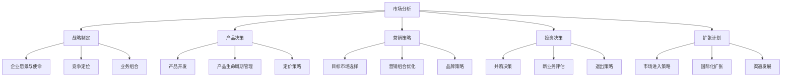
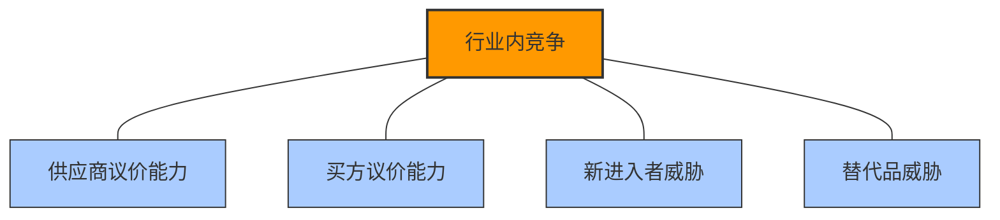
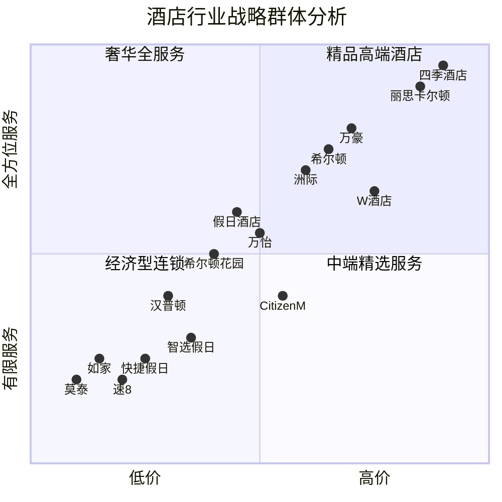
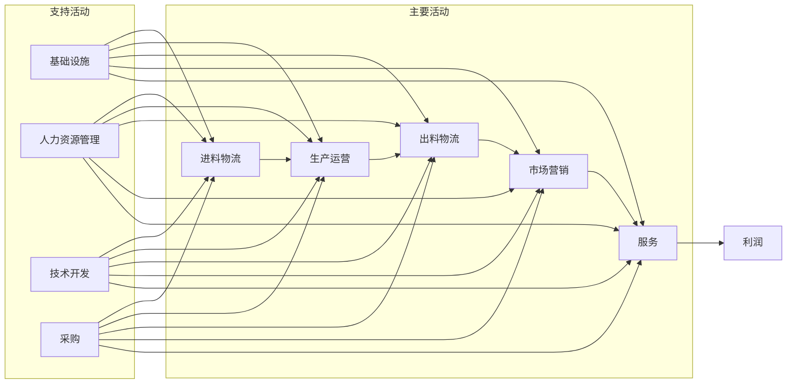
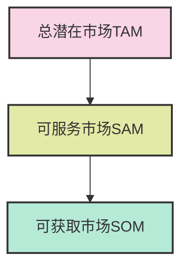
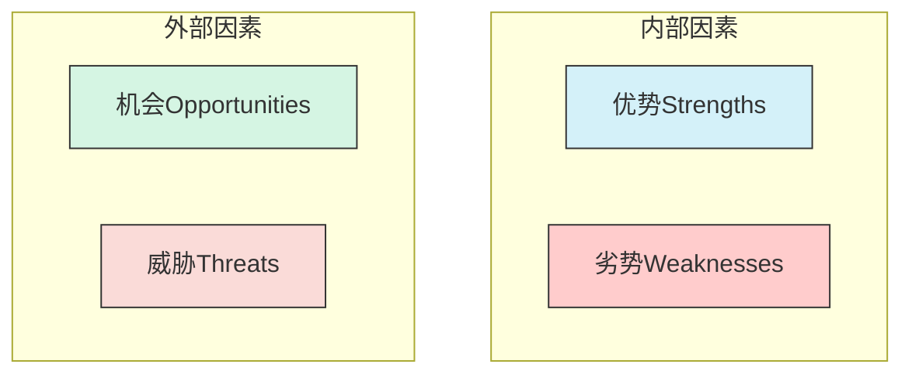

---
{"dg-publish":true,"tags":["商业分析","市场分析","战略框架","PEST分析","波特五力"],"创建日期":"2024-05-05","permalink":"/知识共享/002_商业分析/01_学习内容/04_市场与竞争分析/4.1 市场分析框架/","dgPassFrontmatter":true}
---

# 4.1 市场分析框架

> [!quote] 概述
> 本文系统介绍市场分析的核心框架、方法论和应用技巧。市场分析是商业决策的基础，通过对市场规模、增长率、竞争格局和趋势的深入剖析，帮助企业识别机会、规避风险并制定有效战略。本文详细阐述各类市场分析框架的理论基础、应用步骤和实践案例，为商业分析师提供全面的市场分析工具箱。

## 1. 市场分析基础

### 1.1 市场分析的定义与目的

市场分析是对特定产品或服务的目标市场进行系统性研究的过程，旨在了解市场规模、增长潜力、竞争格局、客户需求和行业趋势等关键信息。

**权威定义对比**：

根据菲利普·科特勒(Philip Kotler)：
> "市场分析是对市场结构、市场行为和市场绩效的系统性研究，目的是为管理者提供制定和实施有效营销战略所需的信息。"

根据美国市场营销协会(AMA)：
> "市场分析是通过收集、记录、分析和解释与市场营销相关的数据，以帮助企业了解市场特征和趋势的过程。"

根据麦肯锡公司：
> "市场分析是识别价值创造机会的系统方法，通过深入了解客户需求、竞争动态和行业演变来指导战略决策。"

**市场分析的核心目的**：

1. **识别机会**：发现未满足的客户需求和市场空白
2. **评估风险**：了解市场威胁和潜在障碍
3. **优化决策**：为产品开发、市场进入和投资提供事实依据
4. **明确定位**：找到产品或服务的最佳市场位置
5. **预测趋势**：识别市场变化方向和演进路径
6. **资源分配**：确定最具吸引力的市场细分和投资优先级

### 1.2 市场分析在战略决策中的作用

市场分析为各类战略决策提供关键输入，在商业决策流程中具有核心地位：

**战略决策中的具体应用**：

- **公司层面战略**：业务范围界定、多元化方向、核心竞争力确定
- **业务单元战略**：竞争策略选择、价值主张定义、资源优先分配
- **功能战略**：营销计划制定、研发方向确定、供应链设计
- **项目层面决策**：产品特性优先级、上市时机、目标客户选择

### 1.3 市场分析的核心维度

全面的市场分析需要从多个维度进行深入研究：

**市场分析的六大核心维度**：

1. **市场规模与结构**
   - 总市场规模(TAM)、可服务市场(SAM)、可获取市场(SOM)
   - 市场集中度和分散度
   - 价值链结构和利润池分布
   - 增长率和成熟度阶段

2. **客户分析**
   - 客户细分及其规模
   - 客户需求、痛点和购买标准
   - 客户行为和决策过程
   - 客户价值及满意度驱动因素

3. **竞争分析**
   - 主要竞争者识别和评估
   - 竞争策略和定位比较
   - 竞争优势和劣势
   - 竞争强度和竞争模式

4. **环境分析**
   - 政治法律因素
   - 经济和宏观趋势
   - 社会文化变化
   - 技术创新和发展

5. **供应分析**
   - 供应商格局和力量
   - 原材料和关键投入趋势
   - 供应链结构和动态
   - 替代品威胁和潜力

6. **趋势与预测**
   - 市场发展驱动力
   - 增长率预测
   - 破坏性变化可能性
   - 技术采用周期和路径

## 2. 宏观环境分析框架

### 2.1 PEST分析

PEST分析是评估宏观市场环境的基础框架，聚焦于四大类外部因素：

**PEST框架概述**：

1. **P-政治因素(Political)**
   - **定义**：与政府政策、法规和政治稳定性相关的因素
   - **关键要素**：
     - 政治稳定性和政权变化
     - 税收政策和激励措施
     - 贸易限制和关税
     - 行业法规和合规要求
     - 环境保护法规
     - 消费者保护政策
   - **分析问题**：
     - 当前或未来的政策变化如何影响市场？
     - 政治环境对行业的支持或限制程度如何？
     - 监管趋势对成本结构和进入壁垒的影响是什么？

2. **E-经济因素(Economic)**
   - **定义**：影响市场购买力和商业环境的宏观经济指标
   - **关键要素**：
     - GDP增长率和经济周期
     - 通货膨胀率和货币稳定性
     - 利率和资本可得性
     - 失业率和劳动力成本
     - 可支配收入和消费模式
     - 汇率波动
   - **分析问题**：
     - 当前经济周期对行业需求的影响如何？
     - 消费者购买力趋势对市场规模有何影响？
     - 经济不确定性如何影响投资决策和消费行为？

3. **S-社会因素(Social)**
   - **定义**：与人口结构、文化态度和社会趋势相关的因素
   - **关键要素**：
     - 人口统计变化(年龄、收入、教育)
     - 生活方式转变
     - 消费习惯和偏好
     - 职业和教育趋势
     - 健康意识和环保态度
     - 文化习俗和价值观
   - **分析问题**：
     - 人口结构变化如何影响产品需求？
     - 新兴生活方式趋势对行业有何影响？
     - 消费者态度的变化如何创造新机会或威胁？

4. **T-技术因素(Technological)**
   - **定义**：与技术创新、研发和数字化相关的因素
   - **关键要素**：
     - 基础技术变革和破坏性创新
     - 研发投资和活动
     - 技术采用率和普及速度
     - 知识产权保护
     - 制造技术和自动化
     - 信息技术和数字转型
   - **分析问题**：
     - 哪些技术发展可能改变行业竞争格局？
     - 技术变革如何改变客户期望和体验？
     - 新技术对成本结构和运营模式的影响是什么？

**PEST分析应用步骤**：

1. **确定分析范围**
   - 明确目标市场或行业
   - 设定分析的地理范围
   - 确定分析的时间维度(短期、中期、长期)

2. **收集相关信息**
   - 政府政策文件和法规
   - 经济数据和预测
   - 人口统计和社会研究报告
   - 技术趋势报告和行业预测

3. **识别关键驱动力**
   - 筛选最相关的PEST因素
   - 评估每个因素的影响范围和程度
   - 确定关键驱动因素的未来趋势

4. **分析因素间关系**
   - 识别因素间的相互作用
   - 分析不同因素的协同效应
   - 确定主导因素和从属因素

5. **评估商业影响**
   - 将外部因素与业务战略联系
   - 确定主要机会和威胁
   - 提出应对策略和建议

**PEST分析案例：电动汽车市场**

| 因素类别 | 关键趋势 | 机会 | 威胁 |
|---------|---------|------|------|
| 政治因素 | - 碳排放法规趋严 - 电动车补贴政策 - 禁售燃油车时间表 | - 政策支持加速市场增长 - 补贴降低购买门槛 - 公共充电设施投资 | - 补贴退坡增加成本压力 - 政策不确定性 - 国家间政策差异 |
| 经济因素 | - 油价波动 - 锂电池成本下降 - 共享出行经济发展 | - 总拥有成本优势 - 规模经济效应 - 新商业模式机会 | - 经济衰退影响高端消费 - 原材料价格波动 - 传统行业就业影响 |
| 社会因素 | - 环保意识提升 - 千禧一代消费习惯 - 城市化和空间限制 | - 品牌差异化定位 - 生活方式产品设计 - 城市微型电动车需求 | - 里程焦虑心理 - 传统汽车文化影响 - 安全担忧 |
| 技术因素 | - 电池能量密度提升 - 充电技术创新 - 自动驾驶融合 | - 续航里程突破 - 快充网络建设 - 智能网联平台价值 | - 技术路线不确定性 - 核心技术专利壁垒 - 网络安全风险 |

### 2.2 PESTEL分析扩展

PESTEL分析是PEST的扩展版本，增加了环境(Environmental)和法律(Legal)两个维度，提供更全面的宏观环境视角：

**额外维度详解**：

1. **E-环境因素(Environmental)**
   - **定义**：与生态系统、气候变化和可持续发展相关的因素
   - **关键要素**：
     - 气候变化影响和应对
     - 资源可用性和限制
     - 环保意识和可持续发展
     - 循环经济和废物管理
     - 生物多样性保护
     - 能源转型和替代能源
   - **分析问题**：
     - 环境法规趋势如何影响业务模式？
     - 可持续发展压力如何改变供应链？
     - 气候变化如何影响资源可用性和成本？

2. **L-法律因素(Legal)**
   - **定义**：与具体法律法规、标准和合规要求相关的因素
   - **关键要素**：
     - 竞争法和反垄断法规
     - 劳动法和雇佣标准
     - 产品责任和安全法规
     - 知识产权和专利法
     - 隐私和数据保护法规
     - 合同执行和纠纷解决机制
   - **分析问题**：
     - 新兴法规如何改变市场规则？
     - 法律风险如何影响业务运营和成本？
     - 不同地区法律差异如何影响全球战略？

**PESTEL与PEST比较**：

- **应用场景**：PESTEL适用于对环境和法律因素影响特别显著的行业（如能源、制药、化工）
- **分析深度**：PESTEL提供更细粒度的分析，但需要更多资源和专业知识
- **战略价值**：在高度监管或环保敏感行业中，PESTEL能发现PEST可能忽略的关键因素

### 2.3 STEEP和STEEPLE框架

在某些行业和应用中，分析师会使用STEEP（增加伦理因素）或STEEPLE（增加伦理和生态因素）等更专业的框架：

**框架比较与选择**：

| 框架 | 维度 | 适用行业 | 优势 |
|------|------|---------|------|
| PEST | 政治、经济、社会、技术 | 一般商业和快速评估 | 简洁、聚焦核心因素 |
| PESTEL | PEST + 环境、法律 | 高度监管和环保敏感行业 | 全面性、法规合规视角 |
| STEEP | 社会、技术、经济、环境、政治 | 长期战略规划和前瞻研究 | 强调社会和环境变化 |
| STEEPLE | STEEP + 法律、伦理 | 医疗、生物技术、AI等伦理敏感行业 | 包含伦理考量,全面性最强 |

**选择框架的考量因素**：

- **行业特性**：行业受监管程度和环境敏感性
- **分析目的**：战术决策vs.长期战略规划
- **资源可用性**：信息获取难度和分析时间限制
- **决策重要性**：风险水平和决策影响范围

**框架整合最佳实践**：

- 根据行业特点自定义框架，选择最相关维度
- 将宏观分析与中观和微观分析框架结合
- 针对关键因素进行情景分析，评估不同发展路径
- 定期更新分析，跟踪环境变化

## 3. 行业与竞争分析框架

### 3.1 波特五力分析(Porter's Five Forces)

波特五力模型是分析行业结构和竞争强度的经典框架，由哈佛商学院迈克尔·波特(Michael Porter)教授于1979年提出：

**五力模型概述**：

1. **行业内现有竞争(Competitive Rivalry)**
   - **定义**：现有企业间竞争的激烈程度
   - **影响因素**：
     - 竞争者数量和相对规模
     - 行业增长率
     - 产品差异化程度
     - 固定成本和退出壁垒
     - 产能过剩情况
     - 战略利害关系
   - **竞争强度指标**：
     - 价格战频率
     - 新产品推出速度
     - 广告和促销支出
     - 市场份额稳定性

2. **供应商议价能力(Supplier Power)**
   - **定义**：供应商提高价格或降低质量的能力
   - **影响因素**：
     - 供应商集中度
     - 供应商产品差异化程度
     - 替代供应来源的可获得性
     - 供应商前向整合的威胁
     - 行业在供应商总销售中的重要性
     - 转换成本
   - **高议价能力表现**：
     - 频繁提价且少有反对
     - 服务水平和质量波动性大
     - 合同条件对供应商有利

3. **买方议价能力(Buyer Power)**
   - **定义**：买方降低价格或要求更高价值的能力
   - **影响因素**：
     - 买方集中度与规模
     - 买方采购量占卖方销售的比例
     - 产品标准化程度
     - 买方转换成本
     - 买方后向整合的威胁
     - 产品对买方的重要性
   - **高议价能力表现**：
     - 价格谈判中频繁获得折扣
     - 要求定制服务但不支付额外费用
     - 多家供应商竞标常态化
     - 买方信息充分

4. **新进入者威胁(Threat of New Entrants)**
   - **定义**：新企业进入行业的可能性及其带来的竞争压力
   - **影响因素(进入壁垒)**：
     - 规模经济效应
     - 产品差异化和品牌忠诚度
     - 资本需求
     - 转换成本
     - 分销渠道准入
     - 专利和专有技术
     - 政府政策和法规限制
   - **低进入壁垒行业特征**：
     - 标准化产品
     - 有限的规模经济
     - 低初始投资
     - 分销渠道开放
     - 有限的法规限制

5. **替代品威胁(Threat of Substitutes)**
   - **定义**：能够以不同方式满足相同需求的产品或服务的威胁
   - **影响因素**：
     - 替代品的价格-性能比
     - 替代品的转换成本
     - 买方对替代品的倾向性
     - 替代品的可得性和可见度
     - 技术变革创造新替代品的速度
   - **高替代威胁表现**：
     - 行业利润率受价格上限限制
     - 需要持续投资提高价值主张
     - 易受颠覆性创新影响
     - 行业增长受到限制

**五力分析应用步骤**：

1. **行业界定**
   - 清晰定义分析的行业范围
   - 确定地理边界(本地、区域、全球)
   - 明确产品/服务边界

2. **收集相关数据**
   - 行业报告和市场研究
   - 财务和业绩数据
   - 竞争者战略和活动
   - 客户和供应商情况

3. **分析各种力量**
   - 评估每种力量的强度(高、中、低)
   - 识别每种力量中的关键影响因素
   - 考虑因素间的相互作用

4. **绘制行业结构图**
   - 视觉化展示五力强度
   - 标注关键影响因素
   - 突出主导力量和次要力量

5. **战略含义分析**
   - 评估行业整体吸引力
   - 预测未来趋势和变化
   - 识别战略机会和威胁
   - 制定应对策略

**波特五力分析案例：全球智能手机行业**

| 力量 | 强度 | 关键影响因素 | 战略含义 |
|------|------|------------|----------|
| 行业内竞争 | 高 | - 多家全球竞争者 - 产品创新周期短 - 高广告和研发支出 - 差异化难度增加 | - 需要持续创新 - 成本控制关键 - 生态系统战略重要 |
| 供应商议价能力 | 中-高 | - 芯片供应商集中(高通、苹果、三星) - 关键组件专利保护 - 制造商整合趋势 | - 垂直整合机会 - 多源供应策略 - 长期供应协议 |
| 买方议价能力 | 中 | - 最终消费者分散 - 运营商集中(B2B) - 品牌忠诚度降低 - 信息透明度高 | - 差异化体验重要 - 运营商关系管理 - 直销渠道发展 |
| 新进入者威胁 | 低 | - 高研发和营销投入 - 强大的规模经济 - 品牌认知壁垒 - 专利保护 | - 新兴市场细分机会 - 关注特定细分市场新进入者 |
| 替代品威胁 | 中-低 | - 可穿戴设备兴起 - 虚拟现实/增强现实设备 - 功能转移到其他设备 | - 扩展生态系统 - 开发互补产品 - 关注新兴技术平台 |

### 3.2 战略群体分析(Strategic Group Analysis)

战略群体分析是对行业内采用相似战略或商业模式的企业群体进行识别和分析的方法：

**核心概念**：

- **战略群体定义**：在同一行业中采用相似战略的企业集合
- **战略维度**：区分不同战略群体的关键战略变量(如价格、质量、渠道、产品范围)
- **移动障碍**：阻止企业从一个战略群体移动到另一个群体的因素
- **战略空间**：行业中未被现有战略群体覆盖的潜在机会区域

**分析步骤**：

1. **选择关键战略维度**
   - 确定能有效区分企业战略的2-3个关键变量
   - 常见维度包括：价格定位、产品线宽度、地理覆盖、垂直整合度、服务水平、技术领先度、分销渠道选择

2. **绘制战略群体图**
   - 创建二维图表，每个轴代表一个战略维度
   - 将企业放置在图表适当位置
   - 用圆圈表示群体，圆圈大小反映市场份额或销售额

3. **分析群体间竞争**
   - 评估不同群体间的竞争强度
   - 识别群体间移动障碍
   - 分析各群体的盈利能力差异

4. **识别战略机会**
   - 寻找未被充分覆盖的市场空间
   - 评估进入不同群体的可行性
   - 预测群体结构随行业演变的变化

**战略群体分析案例：全球酒店行业**

**战略群体分析的洞察应用**：

- **竞争对手分析**：识别直接竞争群体和潜在威胁群体
- **定位决策**：评估当前群体位置和重新定位机会
- **差异化战略**：发现群体间未被充分利用的差异化维度
- **并购目标**：寻找具有战略协同效应的并购目标
- **进入策略**：为新进入者识别最佳定位和最小阻力路径

### 3.3 价值链分析(Value Chain Analysis)

价值链分析是由迈克尔·波特提出的评估企业或行业如何创造价值的框架，通过分解业务活动来识别竞争优势来源：

**价值链模型概述**：

**价值链组成分析**：

1. **主要活动**：
   - **进料物流**：接收、储存和分配投入
   - **生产运营**：将投入转化为最终产品
   - **出料物流**：收集、储存和分销产品
   - **市场营销与销售**：引导客户购买产品
   - **服务**：提升或维持产品价值

2. **支持活动**：
   - **基础设施**：管理、计划、财务、法律、质量管理
   - **人力资源管理**：招聘、培训、薪酬、发展
   - **技术开发**：研发、产品设计、流程改进
   - **采购**：原材料、服务和设备的获取

**价值链分析步骤**：

1. **确定活动分解**
   - 按照主要活动和支持活动分解企业运营
   - 进一步细分每个活动为更具体的流程

2. **分析价值贡献**
   - 评估每个活动对客户价值的贡献
   - 分析每个活动的成本结构
   - 识别价值创造与成本比例失衡的环节

3. **确定连接点**
   - 分析活动间的联系和依赖性
   - 识别改进一个活动对其他活动的影响
   - 查找价值链优化的协同机会

4. **竞争对手比较**
   - 与竞争对手的价值链进行对比
   - 识别相对优势和劣势
   - 发现差异化或成本领先的机会

5. **制定价值优化策略**
   - 确定改进优先顺序
   - 开发能力建设计划
   - 调整资源分配以最大化价值创造

**价值链分析应用案例：耐克(Nike)**

| 价值链活动 | 关键特征 | 竞争优势来源 |
|-----------|---------|------------|
| 进料物流 | - 全球供应商网络 - 数字化供应链管理 - 先进的库存管理 | - 规模经济 - 低成本高品质材料获取 - 高效响应需求变化 |
| 生产运营 | - 制造外包给专业供应商 - 严格质量控制标准 - 生产流程创新 | - 资本效率 - 生产灵活性 - 快速响应市场趋势 |
| 出料物流 | - 区域分销中心 - 快速补货系统 - 全渠道配送整合 | - 高效库存管理 - 缩短上市时间 - 配送成本优化 |
| 市场营销 | - 明星代言策略 - 情感诉求广告 - 数字化营销创新 | - 强大品牌价值 - 卓越消费者洞察 - 品牌文化共鸣 |
| 服务 | - 定制化产品服务 - 零售体验设计 - 消费者社区建设 | - 高客户忠诚度 - 用户数据获取 - 产品改进反馈 |
| 基础设施 | - 扁平化管理结构 - 先进IT系统 - 全球运营协调 | - 决策敏捷性 - 组织效率 - 跨区域一致性 |
| 人力资源 | - 创新文化培养 - 多样性与包容性 - 绩效导向薪酬 | - 人才吸引力 - 创造力激发 - 员工敬业度 |
| 技术开发 | - 产品设计创新 - 材料科学研发 - 数字化技术整合 | - 产品差异化 - 专利组合 - 技术领先地位 |
| 采购 | - 供应商战略伙伴关系 - 可持续采购实践 - 集中采购规模效应 | - 成本控制 - 供应可靠性 - 环境社会责任 |

## 4. 市场规模与增长分析

### 4.1 市场规模测量方法

准确评估市场规模是市场分析的基础，提供产品或服务潜在机会的量化视角：

**市场规模概念层级**：

1. **总潜在市场(Total Addressable Market, TAM)**
   - **定义**：特定产品或服务的最大可能市场规模，假设100%市场渗透
   - **计算方法**：
     - 自上而下：总体市场数据与行业报告
     - 自下而上：单价 × 潜在客户总数
   - **应用目的**：评估市场机会上限，吸引投资者兴趣

2. **可服务市场(Serviceable Available Market, SAM)**
   - **定义**：在企业产品范围、地域覆盖和技术能力内可服务的市场部分
   - **计算方法**：
     - TAM × 特定地域/细分/价格区间占比
     - 潜在客户筛选后的目标市场规模
   - **应用目的**：评估现实可行的市场机会，指导资源分配

3. **可获取市场(Serviceable Obtainable Market, SOM)**
   - **定义**：企业实际可获得的市场份额，考虑竞争和进入障碍
   - **计算方法**：
     - SAM × 预期市场份额%
     - 基于竞争格局和企业能力的现实评估
   - **应用目的**：设定销售目标，制定短期业务计划

**市场规模测量方法**：

1. **自上而下(Top-Down)方法**
   - **步骤**：
     - 从权威来源获取整体市场数据
     - 应用过滤条件(地域、人口、产品类别)
     - 计算相关百分比得出目标细分规模
   - **数据来源**：
     - 行业分析报告(Gartner, IDC, Forrester)
     - 政府统计数据
     - 投资银行研究
   - **优势**：易于获取，有公信力
   - **劣势**：可能不够精确，无法捕捉新兴细分

2. **自下而上(Bottom-Up)方法**
   - **步骤**：
     - 确定目标客户群体和单位消费
     - 估计潜在客户数量和采用率
     - 计算渗透率和购买频率
   - **数据来源**：
     - 原始市场调研
     - 试点市场测试结果
     - 客户使用数据和模式
   - **优势**：更准确，基于实际客户行为
   - **劣势**：耗时、成本高，需要初始数据

3. **价值池(Value Pool)分析**
   - **步骤**：
     - 识别价值池组成部分(产品/服务元素)
     - 为每个组成部分量化价值
     - 评估企业价值获取能力
   - **应用场景**：复杂业务模式，多元收入来源
   - **优势**：聚焦价值创造，而非仅关注交易量
   - **劣势**：需要深入行业知识，价值评估主观性强

**市场规模分析案例：全球电动汽车市场**

| 市场层级 | 估算方法 | 2023年规模 | 2028年预测 |
|---------|----------|------------|-----------|
| 总潜在市场(TAM) | 全球汽车销量 × 平均售价 | 3.1万亿美元 | 3.4万亿美元 |
| 可服务市场(SAM) | 电动汽车渗透率 × TAM | 3,700亿美元 | 1.2万亿美元 |
| 可获取市场(SOM) | 特斯拉市场份额目标 × SAM | 630亿美元 | 1,800亿美元 |

### 4.2 市场增长分析方法

市场增长分析帮助企业了解市场发展轨迹，为长期战略规划提供依据：

**增长分析技术**：

1. **历史增长率分析**
   - **方法**：分析过去3-5年的市场规模数据，计算年复合增长率(CAGR)
   - **公式**：CAGR = (终值/初值)^(1/年数) - 1
   - **应用场景**：市场成熟度评估，基准比较
   - **局限性**：历史表现不一定预示未来，无法捕捉拐点

2. **增长驱动因素分析**
   - **方法**：识别并量化影响市场增长的关键因素
   - **常见驱动因素**：
     - 人口变化(数量、年龄结构、收入水平)
     - 采用周期(技术扩散、替代率)
     - 规模扩展(使用频率、支出增加)
     - 新用例开发(用途扩展、应用创新)
   - **应用场景**：了解增长动力，预测转折点

3. **产品生命周期分析**
   - **方法**：确定产品在生命周期中的位置(导入、成长、成熟、衰退)
   - **应用场景**：产品策略和投资决策
   - **关键指标**：
     - 增长率变化
     - 市场渗透率
     - 竞争者数量
     - 利润率趋势

4. **Bass扩散模型**
   - **方法**：模拟创新扩散过程，考虑创新者和模仿者采用行为
   - **公式**：N(t) = m × [(1-e^(-(p+q)t))/(1+(q/p)e^(-(p+q)t))]
     - m: 最大市场潜力
     - p: 创新系数
     - q: 模仿系数
   - **应用场景**：新产品/技术市场扩散预测
   - **优势**：捕捉"S曲线"扩散模式，预测拐点

**增长预测方法**：

1. **趋势外推法**
   - **方法**：基于历史趋势预测未来发展
   - **技术**：
     - 线性回归
     - 移动平均
     - 指数平滑
   - **优势**：简单、直观
   - **局限性**：假设现有条件持续，不适用于变化剧烈的市场

2. **情景规划法**
   - **方法**：构建多个未来情景，评估不同条件下的市场发展
   - **步骤**：
     - 识别关键不确定性因素
     - 构建2-4个合理情景
     - 分析每个情景下的市场表现
   - **优势**：应对高不确定性，提供决策弹性
   - **局限性**：结果范围宽泛，需要多方案准备

3. **专家意见法**
   - **方法**：结合行业专家判断的结构化预测
   - **技术**：
     - 德尔菲法(Delphi Method)
     - 专家小组讨论
     - 结构化访谈
   - **优势**：结合隐性知识和经验
   - **局限性**：可能受专家偏见影响

**增长分析案例：全球云计算市场**

| 增长维度 | 数据分析 | 战略启示 |
|---------|----------|----------|
| 历史增长 | - 2018-2023 CAGR: 22.3% - IaaS增长高于SaaS - 区域增长差异(亚太>北美>欧洲) | - 持续高增长行业 - 基础设施投资优先 - 区域策略差异化 |
| 驱动因素 | - 数字化转型加速(贡献45%增长) - 远程工作模式普及(贡献30%) - 成本优化需求(贡献15%) - 安全需求提升(贡献10%) | - 行业解决方案开发 - 混合工作支持功能 - 强调TCO优势 - 增强安全功能投资 |
| 生命周期 | - IaaS处于成长中期 - SaaS进入成熟早期 - PaaS处于成长快速期 | - IaaS规模扩展 - SaaS差异化策略 - PaaS创新投资 |
| 未来预测 | - 基准情景: 18% CAGR - 乐观情景: 24% CAGR - 保守情景: 12% CAGR - 2028年市场规模预计达到1.2万亿美元 | - 容量规划弹性 - 区域扩张优先级 - 投资回报周期设定 |

## 5. 市场分析整合与应用

### 5.1 SWOT分析框架

SWOT分析是整合内部能力(优势和劣势)与外部环境(机会和威胁)的战略工具：

**SWOT结构**：

**SWOT整合分析**：

1. **SO战略(优势-机会)**：利用内部优势把握外部机会
2. **WO战略(劣势-机会)**：克服内部劣势以把握外部机会
3. **ST战略(优势-威胁)**：利用内部优势应对外部威胁
4. **WT战略(劣势-威胁)**：减轻内部劣势并避免外部威胁

**SWOT分析步骤**：

1. **情境界定**：明确分析对象和目的
2. **内部分析**：盘点优势和劣势
3. **外部分析**：识别机会和威胁
4. **整合评估**：寻找内外部因素连接点
5. **战略生成**：制定利用优势、克服劣势的行动计划

**SWOT分析应用案例：特斯拉进入印度市场**

| | 优势 | 劣势 |
|-|------|------|
| **内部因素** | - 全球领先的电动车技术 - 强大品牌认知度 - 垂直整合生产能力 - 软件和自动驾驶技术领先 - 超级充电网络经验 | - 高成本结构 - 有限的本地化经验 - 服务网络建设成本高 - 产品价格对新兴市场较高 - 生产能力限制 |
| **外部因素** | **机会** | **威胁** |
| | - 印度政府电动车激励政策 - 快速增长的中产阶级 - 城市污染问题推动清洁能源 - 智能交通基础设施发展 - 本地制造成本优势 | - 高进口关税壁垒 - 当地竞争对手价格优势 - 充电基础设施不足 - 复杂的监管环境 - 消费者对电动车续航的担忧 |

**基于SWOT的战略建议**：

- **SO战略**：建立本地生产基地，结合特斯拉技术与印度低成本制造优势
- **WO战略**：开发专为印度市场设计的更经济型号，利用政府激励政策
- **ST战略**：建设超级充电网络，解决基础设施不足问题，发挥技术优势
- **WT战略**：与当地合作伙伴建立联盟，降低进入壁垒和监管风险

### 5.2 市场分析报告结构与最佳实践

有效的市场分析报告需要结构清晰、内容全面且具有行动导向：

**市场分析报告标准结构**：

1. **执行摘要(Executive Summary)**
   - 分析目的和范围
   - 关键发现和结论
   - 主要建议和行动步骤

2. **市场概述(Market Overview)**
   - 市场定义和细分
   - 历史发展和当前状态
   - 主要参与者和市场结构

3. **宏观环境分析(Macro Environment)**
   - PEST/PESTEL分析结果
   - 关键宏观趋势和影响
   - 市场监管环境

4. **市场规模与增长(Market Size & Growth)**
   - 当前市场规模数据
   - 历史增长率分析
   - 未来增长预测和情景

5. **竞争格局分析(Competitive Landscape)**
   - 竞争者概述和比较
   - 五力分析结果
   - 战略群体分图

6. **客户分析(Customer Analysis)**
   - 客户细分和特征
   - 需求驱动因素和购买标准
   - 客户行为趋势

7. **SWOT分析(SWOT Analysis)**
   - 内外部因素整合
   - 战略选择和评估
   - 核心机会和风险

8. **战略建议(Strategic Recommendations)**
   - 市场进入/扩展策略
   - 产品和服务建议
   - 营销和销售方法
   - 资源配置优先级

9. **附录(Appendices)**
   - 详细数据表格
   - 研究方法说明
   - 数据来源和参考资料

**市场分析报告最佳实践**：

1. **数据可视化**
   - 使用图表展示关键数据
   - 确保图表易于理解并有明确标题
   - 使用一致的设计风格和颜色编码

2. **市场洞察与数据平衡**
   - 提供数据支持的深刻洞察
   - 避免纯数据堆砌或无据洞察
   - 突出"数据说明什么"和"为什么重要"

3. **清晰的行动建议**
   - 提供具体、可行的建议
   - 将建议与分析发现直接连接
   - 说明预期的结果和资源需求

4. **受众定制化**
   - 针对不同受众调整详细程度
   - 为高管提供简明的决策支持信息
   - 为实施团队提供具体的操作指导

**常见陷阱与规避方法**：

| 常见陷阱 | 表现形式 | 避免方法 |
|---------|---------|---------|
| 确认偏误 | 只关注支持预设观点的数据 | 主动寻找反面证据，考虑替代解释 |
| 过度泛化 | 从有限样本得出广泛结论 | 明确说明数据局限性，使用多来源验证 |
| 数据过载 | 提供过多原始数据而非洞察 | 筛选关键数据点，聚焦于决策相关信息 |
| 静态分析 | 忽视市场动态变化和趋势 | 包含历史趋势和未来预测，强调变化驱动因素 |
| 内部视角 | 过于关注企业内部而非市场 | 从客户和市场视角出发，注重外部环境 |

## 6. 实践与自我评估

### 6.1 市场分析练习案例

**练习1：新兴市场分析**

假设你是一家全球智能家居设备制造商的商业分析师，需要评估进入印度市场的机会和风险。

**任务**：
1. 设计PEST分析框架，确定最关键的宏观因素
2. 使用波特五力模型分析行业竞争格局
3. 估算市场规模(TAM、SAM、SOM)
4. 预测未来5年市场增长，考虑不同情景
5. 完成SWOT分析，提出市场进入策略建议

**可参考数据点**：
- 印度中产阶级规模：4.7亿人
- 智能家居渗透率：目前2.3%，增长30%/年
- 主要竞争者：小米、亚马逊、三星、本土品牌
- 印度互联网用户：8亿人，智能手机普及率52%
- 平均智能家居设备支出：每户每年45美元

**练习2：竞争对手分析**

假设你是一家在线教育平台的产品经理，需要分析主要竞争对手并提出差异化策略。

**任务**：
1. 设计竞争对手分析框架，确定关键评估维度
2. 创建战略群体分析图，明确市场定位差异
3. 进行价值链分析，找出竞争优势来源
4. 比较不同商业模式的优劣势
5. 提出差异化策略建议

**可参考评估维度**：
- 课程数量和质量
- 定价模式(订阅制、单课付费、免费增值)
- 目标学员群体(K12、高等教育、职业培训)
- 技术平台能力(个性化、互动性、移动友好性)
- 讲师资源和内容生产模式
- 社区互动和用户粘性
- 认证价值和就业支持

### 6.2 自我评估问题

通过回答以下问题，评估你对市场分析框架的理解：

1. PEST分析和波特五力模型各自关注的焦点是什么？它们如何互补？

2. 为什么市场分析需要同时考虑宏观环境和行业竞争格局？这两个层面如何相互影响？

3. 在评估市场规模时，TAM、SAM和SOM的区别是什么？为什么这种区分对业务决策很重要？

4. 价值链分析如何帮助企业找到竞争优势来源？请举例说明。

5. 战略群体分析相比简单的竞争对手列表有什么优势？它如何帮助识别市场机会？

6. 在什么情况下应该使用自上而下的市场规模估算，什么情况下应该使用自下而上的方法？

7. 市场增长分析中，单纯使用历史趋势外推法的局限性是什么？如何克服这些局限？

8. SWOT分析如何有效整合内部能力分析和外部环境分析？为什么这种整合视角很重要？

9. 在进行市场分析时，如何平衡定量数据和定性洞察？各自的价值是什么？

10. 如何确保市场分析报告既有深度洞察又有明确的行动导向？请分享具体策略。

## 7. 延伸阅读与资源

### 7.1 推荐书籍

- Porter, M. E. (1998). *Competitive Strategy: Techniques for Analyzing Industries and Competitors*. Free Press.
- Kotler, P., & Keller, K. L. (2021). *Marketing Management*. Pearson.
- Aaker, D. A. (2013). *Strategic Market Management*. Wiley.
- Osterwalder, A., & Pigneur, Y. (2010). *Business Model Generation*. Wiley.
- Kim, W. C., & Mauborgne, R. (2015). *Blue Ocean Strategy*. Harvard Business Review Press.

### 7.2 在线资源

- Harvard Business Review: Market Analysis Collection
- McKinsey Insights: Marketing & Sales
- Nielsen Global Consumer Insights
- Statista Market Outlook
- eMarketer Market Data & Trends

### 7.3 专业工具

- **市场研究工具**
  - IBIS World
  - Euromonitor Passport
  - Mintel
  - Forrester Research
  - Gartner Market Research

- **数据可视化工具**
  - Tableau Market Analysis Templates
  - Power BI Market Analytics Dashboard
  - Google Data Studio
  - Infogram

- **市场分析框架模板**
  - PESTL分析模板
  - 波特五力分析工作表
  - 市场规模计算器
  - 战略群体映射工具
  - SWOT分析矩阵生成器

## 8. 相关概念链接

- [[知识共享/002_商业分析/01_学习内容/03_分析方法与工具/3.1 描述性分析方法\|03_分析方法与工具/3.1 描述性分析方法]]
- [[知识共享/002_商业分析/01_学习内容/03_分析方法与工具/3.2 诊断性分析方法\|03_分析方法与工具/3.2 诊断性分析方法]]
- [[知识共享/002_商业分析/01_学习内容/04_市场与竞争分析/4.2 竞争对手分析\|04_市场与竞争分析/4.2 竞争对手分析]]
- [[04_市场与竞争分析/4.3 行业分析\|04_市场与竞争分析/4.3 行业分析]]
- [[04_市场与竞争分析/4.4 宏观环境分析\|04_市场与竞争分析/4.4 宏观环境分析]] 