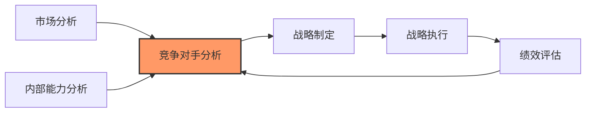
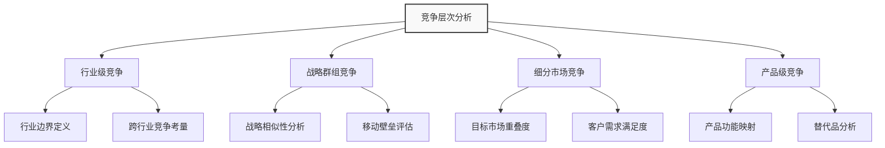
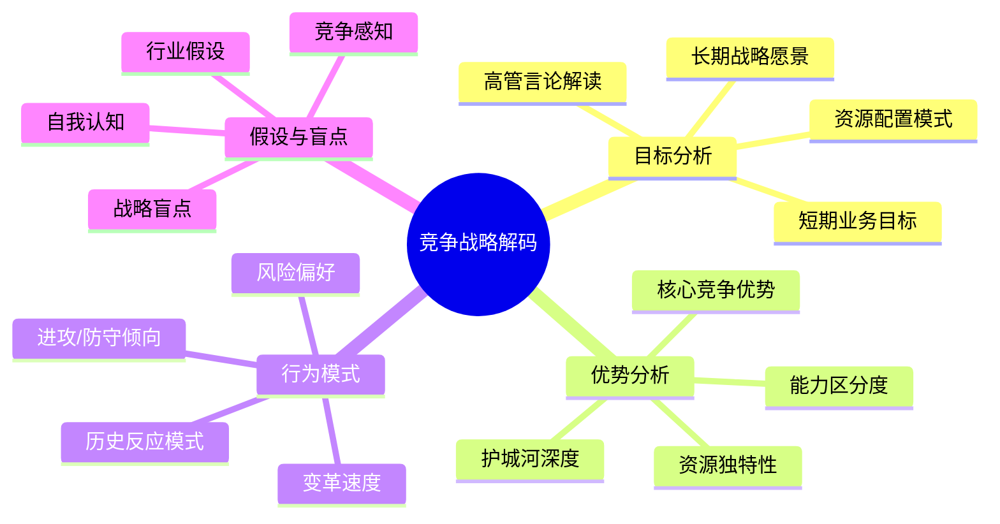
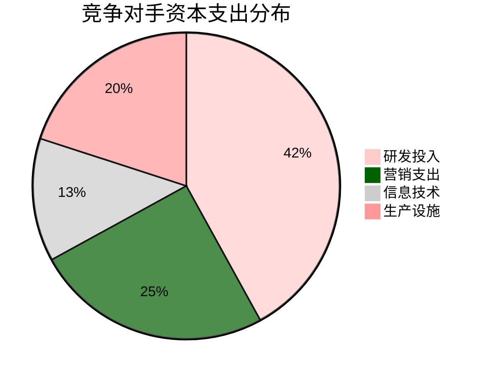
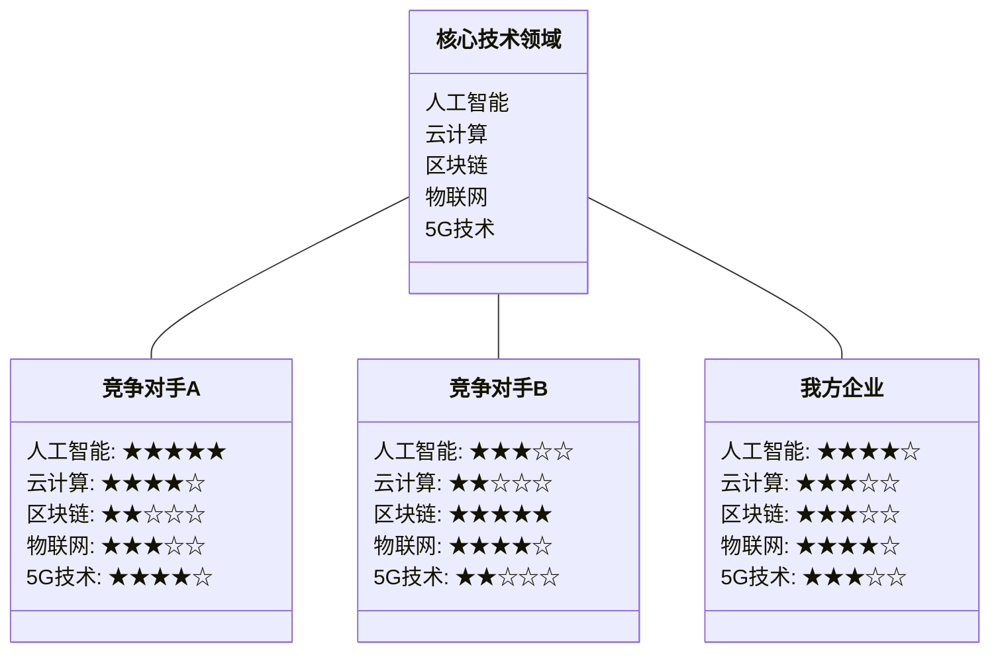
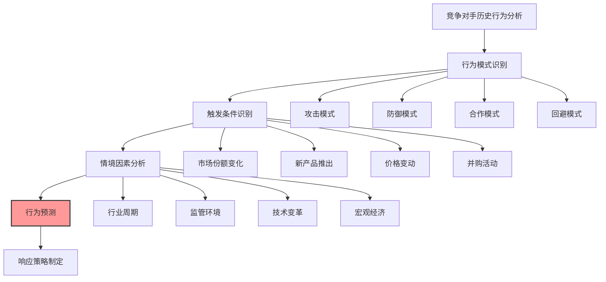
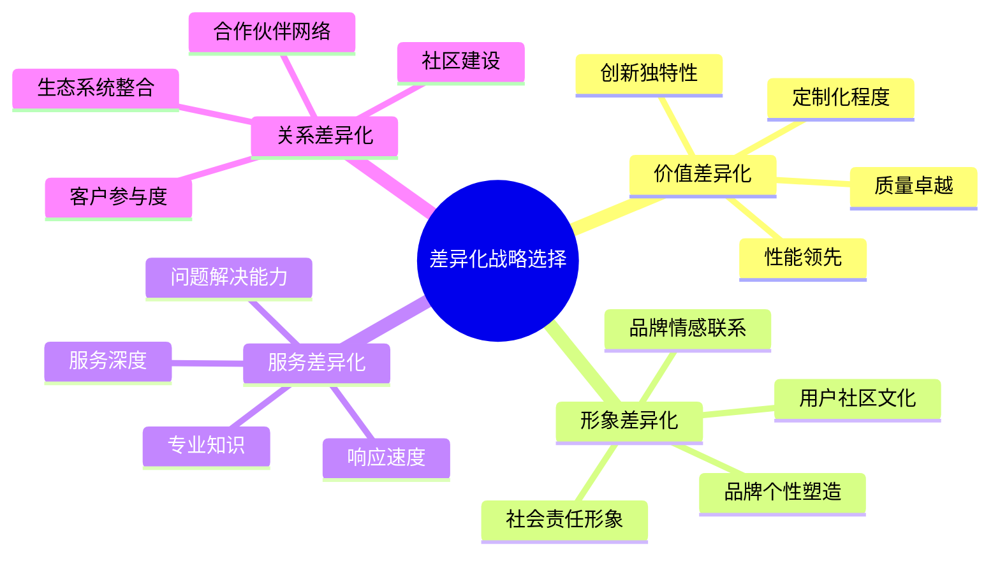
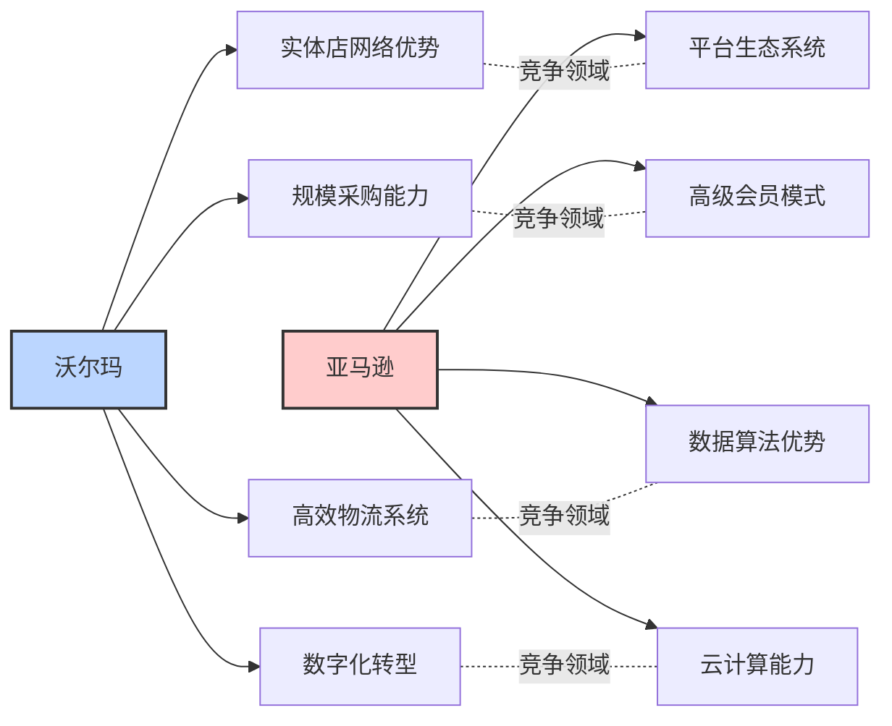

---
{"dg-publish":true,"tags":["商业分析","竞争分析","竞争对手","市场战略"],"创建日期":"2024-05-15","permalink":"/知识共享/002_商业分析/01_学习内容/04_市场与竞争分析/4.2 竞争对手分析/","dgPassFrontmatter":true}
---

> [!quote] 概述
> 本文详细介绍竞争对手分析的核心框架、方法和工具，包括竞争对手识别与分类、竞争情报收集、多维度对比分析、竞争策略解析等内容。通过系统学习，商业分析师能够准确把握竞争态势，为战略决策提供关键支持，帮助企业建立可持续竞争优势。

## 1. 竞争对手分析基础

### 1.1 竞争对手分析的定义与目的

竞争对手分析是商业分析的关键组成部分，为企业战略决策提供必要洞察：

**定义**：竞争对手分析是系统性地收集、分析和解读竞争对手信息的过程，旨在理解竞争者的能力、策略、目标和行为模式，从而预测其未来行动并指导企业自身的战略选择。

**核心目的**：
- 识别市场机会与威胁
- 预测竞争对手行动
- 发现自身竞争优势与劣势
- 制定有效的差异化策略
- 规避竞争风险，优化资源配置

**战略框架中的位置**：

### 1.2 竞争对手分析的演变历程

竞争对手分析作为一门实践领域，经历了多个发展阶段：

| 时期 | 主要特征 | 代表方法 | 局限性 |
|------|----------|---------|--------|
| 1970年代前 | 非系统性竞争情报 | 基础市场调研 销售人员反馈 | 碎片化信息 缺乏系统框架 |
| 1970-1980年代 | 战略性竞争分析兴起 | 波特五力模型 战略群组分析 | 静态分析 过度关注财务数据 |
| 1990-2000年代 | 竞争情报职业化 | 竞争情报系统 标杆管理 | 信息收集困难 反应周期长 |
| 2000-2010年代 | 数字化竞争分析 | 网络数据挖掘 社交媒体监测 | 数据过载 分析深度不足 |
| 2010年代至今 | AI驱动的竞争智能 | 实时竞争监测 预测性竞争分析 | 隐私与伦理问题 机器分析局限性 |

**从传统到现代的主要转变**：
1. 从静态报告到实时监测
2. 从人工收集到自动化数据采集
3. 从描述性分析到预测性分析
4. 从孤立信息到集成情报系统
5. 从普遍洞察到个性化战略指导

### 1.3 竞争对手分析在商业决策中的价值

有效的竞争对手分析为企业各层面决策提供支持：

**战略层面价值**：
- 确定企业定位和差异化方向
- 识别潜在的战略机会（如蓝海市场）
- 评估行业进入与退出决策
- 指导资源配置和长期投资

**战术层面价值**：
- 制定有效的产品定价策略
- 优化营销信息和渠道选择
- 调整产品功能和服务组合
- 预测并应对竞争对手的促销活动

**运营层面价值**：
- 识别效率改进机会
- 基准化关键业务流程
- 采用最佳实践方法
- 优化供应链和分销策略

## 2. 竞争对手识别与分类

### 2.1 全方位竞争对手识别

全面识别竞争对手需要突破传统界限，从多个维度考虑：

**传统维度的竞争对手**：
- 直接竞争者：提供相同产品/服务的企业
- 产品形式竞争者：提供不同形式但满足相同需求的产品
- 通用竞争者：争夺相同消费预算的不同品类

**扩展维度的竞争对手**：
- 潜在进入者：有能力进入市场的企业
- 新兴颠覆者：采用创新商业模式的企业
- 价值链竞争者：在价值链其他环节的企业
- 能力竞争者：争夺相同资源或能力的企业

**竞争对手识别的多层次分析框架**：

### 2.2 竞争对手分类框架

有效的竞争对手分类有助于优化分析资源分配：

**基于威胁程度的分类**：
1. **核心竞争对手**：目标市场高度重叠，产品/服务相似度高
2. **主要竞争对手**：部分市场重叠，替代产品/服务提供者
3. **次要竞争对手**：目标客户有限重叠，差异化明显
4. **潜在竞争对手**：当前非直接竞争但有能力快速进入

**基于战略定位的分类**：
1. **成本领先者**：专注于效率和规模优势
2. **差异化领导者**：凭借创新和品质获得溢价
3. **专注细分者**：在特定细分市场占据优势
4. **全方位竞争者**：在成本和差异化方面同时发力

**基于竞争行为的分类**：
1. **领导者**：市场份额最大，定义行业标准
2. **挑战者**：积极争夺领导地位，创新导向
3. **跟随者**：模仿领导者策略，避免直接冲突
4. **利基者**：专注特定细分，避开主流竞争

**竞争对手分类矩阵**：

| 市场重叠度 | 高能力/资源 | 中等能力/资源 | 低能力/资源 |
|-----------|------------|--------------|------------|
| **高重叠** | 主要威胁 需密切监控 | 近期挑战者 定期评估 | 市场噪音 基本监控 |
| **中等重叠** | 潜在威胁 情境监控 | 选择性竞争 关注特定领域 | 低优先级 最小监控 |
| **低重叠** | 潜在进入者 早期预警 | 间接学习对象 选择性分析 | 忽略 资源节约 |

### 2.3 竞争集群与战略群组分析

战略群组分析帮助识别具有相似战略特征的企业集群：

**战略群组的定义**：战略群组是行业内采用相似战略、拥有相似资源和能力的企业集合，它们之间的竞争通常更为激烈。

**战略群组分析步骤**：
1. 确定关键战略维度（如市场覆盖范围、产品多样性、价格定位等）
2. 绘制战略空间地图，通常选择两个最具区分度的维度
3. 将企业放置在地图上适当位置
4. 识别战略群组及其边界
5. 分析群组内部竞争和群组间竞争特点

**战略群组地图示例**：专业化程度与价格定位维度的奢侈品行业

| 品牌 | 价格定位(低→高) | 专业化程度(多品类→专业化) | 战略群组 |
|------|--------------|------------------|--------|
| 爱马仕 | 0.95 | 0.85 | 高度专业化高端品牌 |
| 卡地亚 | 0.90 | 0.80 | 高度专业化高端品牌 |
| 蒂凡尼 | 0.85 | 0.90 | 高度专业化高端品牌 |
| 香奈儿 | 0.85 | 0.65 | 专业奢侈品牌 |
| 迪奥 | 0.80 | 0.50 | 专业奢侈品牌 |
| 路易威登 | 0.75 | 0.45 | 多元化奢侈集团 |
| 普拉达 | 0.70 | 0.60 | 专业奢侈品牌 |
| 古驰 | 0.65 | 0.55 | 专业奢侈品牌 |
| 巴宝莉 | 0.60 | 0.40 | 多元化奢侈集团 |
| 阿玛尼 | 0.55 | 0.35 | 大众奢侈品牌 |
| 迈克高仕 | 0.45 | 0.25 | 大众奢侈品牌 |
| 雨果博斯 | 0.40 | 0.30 | 大众奢侈品牌 |
| 寇驰 | 0.35 | 0.20 | 大众奢侈品牌 |

**战略群组说明**：
- **高度专业化高端品牌**：高价格、高专业化，专注于特定品类的顶级奢侈品牌
- **专业奢侈品牌**：中高价格、中高专业化，在特定领域有较强专业定位
- **多元化奢侈集团**：中高价格、中等专业化，产品线较为广泛的综合品牌
- **大众奢侈品牌**：相对低价、低专业化，面向更广泛市场的入门级奢侈品牌

**移动障碍分析**：
- 战略群组间存在的移动障碍决定了企业难以轻易改变战略定位
- 常见移动障碍：品牌资产、技术专利、分销渠道、规模经济、经验曲线等
- 移动障碍高度影响竞争动态和战略选择

## 3. 竞争情报收集与分析

### 3.1 竞争情报收集方法

系统化收集竞争情报需要整合多种方法和来源：

**公开数据收集**：
- **财务报告分析**：年报、季报、投资者演示材料
- **行业报告研究**：分析师报告、行业协会数据
- **新闻媒体监测**：企业新闻、高管访谈、行业新闻
- **知识产权追踪**：专利申请、商标注册、版权登记

**市场数据收集**：
- **营销材料分析**：广告、宣传册、网站内容
- **产品分析**：产品规格、定价策略、上市时间
- **分销渠道研究**：渠道策略、覆盖范围、合作伙伴
- **客户反馈汇总**：评论、评价、满意度调查

**数字足迹分析**：
- **网站流量分析**：访问量、用户行为、流量来源
- **社交媒体监测**：提及度、情感分析、互动情况
- **移动应用数据**：下载量、用户评分、更新频率
- **搜索引擎表现**：关键词排名、搜索量变化

**第三方信息来源**：
- **行业咨询机构**：Gartner、IDC、Forrester等
- **市场研究公司**：Nielsen、Kantar、IRI等
- **数据聚合平台**：Bloomberg、Thomson Reuters等
- **专业竞争情报服务**：Crayon、Kompyte、Klue等

**竞争情报收集渠道的评估矩阵**：

| 信息渠道 | 可靠性 | 时效性 | 成本 | 获取难度 | 最适用场景 |
|---------|-------|-------|------|----------|-----------|
| 公开财务数据 | 高 | 中/低 | 低 | 低 | 财务状况分析 |
| 行业分析报告 | 中/高 | 中 | 中/高 | 中 | 市场趋势分析 |
| 产品评论/评级 | 中 | 高 | 低 | 低 | 产品性能评估 |
| 社交媒体 | 低/中 | 非常高 | 低 | 低 | 品牌声誉监测 |
| 前员工访谈 | 中 | 低/中 | 中/高 | 高 | 内部运营洞察 |
| 神秘顾客 | 中/高 | 高 | 中 | 中 | 客户体验分析 |
| 招聘信息 | 中 | 中/高 | 低 | 低 | 战略方向预测 |
| 专利申请 | 高 | 中 | 低/中 | 中 | 技术路线图分析 |

### 3.2 竞争情报分析框架

将原始情报转化为可行洞察需要系统化的分析框架：

**4C竞争分析框架**：
1. **公司(Company)**：竞争对手的基本情况与能力
   - 组织结构与企业文化
   - 财务状况与资源配置
   - 核心能力与竞争优势
   - 历史发展与组织变革

2. **客户(Customer)**：竞争对手的目标客户与价值主张
   - 目标细分市场特征
   - 客户价值主张与定位
   - 客户获取与留存策略
   - 客户满意度与忠诚度

3. **成本(Cost)**：竞争对手的成本结构与定价策略
   - 成本结构与成本驱动因素
   - 规模经济与范围经济
   - 定价策略与价格弹性
   - 盈利模式与盈利能力

4. **能力(Capability)**：竞争对手的核心能力与战略意图
   - 研发创新能力
   - 营销与销售能力
   - 供应链与运营能力
   - 领导力与战略规划能力

**竞争战略解码框架**：

### 3.3 竞争智能系统构建

建立系统化的竞争智能流程，确保持续获取洞察：

**竞争智能系统的核心组件**：
1. **情报需求规划**：确定关键情报需求和优先级
2. **数据收集网络**：建立多渠道数据收集机制
3. **分析框架与方法**：标准化分析流程和工具
4. **洞察传递机制**：将洞察传达给决策者
5. **行动反馈循环**：评估洞察应用效果并改进

**自动化竞争监测工具应用**：
- **网站监测工具**：监控竞争对手网站变化
- **社交媒体监测平台**：追踪品牌提及和情感
- **价格监测工具**：跟踪竞争产品价格变动
- **营销活动跟踪**：分析竞争对手营销策略
- **SEO/SEM分析工具**：评估搜索引擎表现

**竞争智能成熟度模型**：

| 成熟度阶段 | 主要特点 | 组织结构 | 技术应用 | 成果应用 |
|-----------|---------|---------|---------|--------|
| 第1级：临时响应 | 被动收集 项目驱动 碎片化信息 | 无专职人员 临时任务分配 | 基础搜索工具 手动数据收集 | 针对特定问题 有限战术应用 |
| 第2级：基础建设 | 定期收集 基本流程 重点竞争者 | 指定负责人 兼职团队 | 专业情报工具 部分自动化 | 定期竞争报告 一般性建议 |
| 第3级：系统运作 | 系统化收集 标准流程 广泛覆盖 | 专职团队 明确职责 | 集成分析平台 高度自动化 | 战略决策输入 具体行动建议 |
| 第4级：战略整合 | 前瞻性分析 预测模型 全面覆盖 | 跨职能整合 高层参与 | AI辅助分析 实时监测系统 | 战略规划核心 创新机会识别 |

## 4. 多维度竞争对手分析

### 4.1 财务实力与资源分析

分析竞争对手的财务状况和资源配置提供关键洞察：

**财务表现分析指标**：
- **增长指标**：收入增长率、市场份额变化、新客户获取
- **盈利能力**：毛利率、营业利润率、净利润率、EBITDA
- **运营效率**：资产周转率、库存周转率、员工产出
- **财务健康度**：负债比率、流动比率、现金流状况

**资源配置分析**：
- **资本投资**：研发投入、营销支出、资本支出趋势
- **人力资源**：员工规模、结构、核心团队稳定性
- **无形资产**：品牌价值、专利组合、客户关系
- **战略联盟**：合作伙伴网络、外部资源获取能力

**财务实力雷达图示例**：

**资源优势评估矩阵**：

| 资源类别 | 竞争对手A (行业领导者) | 竞争对手B (创新挑战者) | 我方企业 | 战略启示 |
|---------|-------------------------|------------------------|---------|---------|
| 财务资源 | ★★★★★ 现金储备丰富 | ★★★☆☆ 风投支持有限 | ★★★☆☆ | 避免价格战 稳健扩张 |
| 技术资源 | ★★★★☆ 大型研发团队 | ★★★★★ 专利领先 | ★★☆☆☆ | 寻求技术合作 差异化创新 |
| 品牌资源 | ★★★★★ 高品牌认知度 | ★★☆☆☆ 新兴品牌 | ★★★☆☆ | 利用细分声誉 精准定位 |
| 人才资源 | ★★★★☆ 稳定管理团队 | ★★★★☆ 顶尖技术人才 | ★★★☆☆ | 关注人才培养 创新文化建设 |
| 渠道资源 | ★★★★★ 全球分销网络 | ★★☆☆☆ 在线直销为主 | ★★★★☆ | 深化现有渠道 线上线下融合 |

### 4.2 产品与市场策略分析

全面评估竞争对手的产品组合和市场策略：

**产品组合分析**：
- **产品线宽度与深度**：产品类别范围和各类别产品数量
- **产品生命周期分布**：产品在不同生命周期阶段的分布
- **核心产品与明星产品**：主要收入和利润贡献产品
- **创新与产品迭代**：新产品推出频率和改进模式

**产品对比分析框架**：
1. **功能映射**：关键功能与特性的对比分析
2. **价值定位**：价格-性能比较和价值主张分析
3. **用户体验评估**：用户界面、易用性和客户体验对比
4. **质量与可靠性**：质量标准、故障率和耐用性比较

**市场策略分析维度**：
- **目标市场选择**：地理覆盖、客户细分和聚焦策略
- **定位策略**：品牌形象、差异化要素和核心信息
- **渠道策略**：分销模式、渠道结构和渠道管理
- **促销策略**：营销预算分配、媒体选择和促销活动

**产品-市场策略图**：

| 企业 | 市场扩张程度(低→高) | 产品创新程度(低→高) | 战略类型 |
|------|-----------------|-----------------|--------|
| 竞争对手C | 0.9 | 0.3 | 市场渗透者 |
| 竞争对手A | 0.8 | 0.7 | 全方位领导者 |
| 竞争对手E | 0.6 | 0.6 | 全方位领导者 |
| 我方企业 | 0.5 | 0.5 | 平衡发展 |
| 竞争对手D | 0.4 | 0.4 | 防御者 |
| 竞争对手B | 0.3 | 0.9 | 产品领导者 |

**战略类型说明**：
- **产品领导者**：高产品创新、低市场扩张，专注于技术和产品突破
- **全方位领导者**：高产品创新、高市场扩张，同时推动创新和市场开拓
- **防御者**：低产品创新、低市场扩张，专注于保持现有市场和优化效率
- **市场渗透者**：低产品创新、高市场扩张，专注于现有产品的市场拓展

### 4.3 技术与创新能力分析

评估竞争对手的技术实力和创新体系：

**技术能力评估维度**：
- **技术资产**：专利组合、技术许可和知识产权保护
- **研发投资**：研发支出占比、研发人员比例和项目分布
- **技术基础设施**：实验室、设备和技术平台
- **技术生态系统**：技术合作伙伴、开源参与和产学研合作

**创新体系分析**：
- **创新流程**：从想法生成到商业化的完整流程
- **创新组织**：创新团队结构、激励机制和跨部门协作
- **创新文化**：风险承受度、失败容忍度和创新气氛
- **外部创新整合**：收购、合作和风险投资活动

**技术竞争力分析图**：

**专利分析指标**：
- **专利数量**：整体专利组合规模和增长趋势
- **专利质量**：引用率、授权率和维持率
- **专利分布**：技术领域分布和地理覆盖范围
- **专利战略**：防御性专利vs创新性专利比例

### 4.4 组织与文化分析

深入理解竞争对手的组织架构和企业文化：

**组织结构分析**：
- **组织模式**：集中式vs分散式、矩阵式vs职能式
- **决策流程**：决策速度、授权程度和责任分配
- **控制系统**：绩效指标、监控机制和激励体系
- **协调机制**：跨部门协作和信息流通机制

**企业文化解码**：
- **价值观与使命**：公开陈述与实际表现的一致性
- **领导风格**：高管背景、沟通方式和决策风格
- **行为规范**：工作方式、沟通模式和冲突处理
- **象征系统**：仪式、符号和故事所传递的信息

**高管团队分析**：
- **团队构成**：职业背景、教育背景和多样性
- **团队稳定性**：团队成员变动频率和连续性
- **经验互补性**：专业背景和能力的互补程度
- **战略倾向**：从过往决策中推断的战略偏好

**企业文化比较**：

| 文化维度 | 竞争对手A | 竞争对手B | 我方企业 | 战略意义 |
|---------|----------|----------|---------|---------|
| 创新态度 | 突破式创新 高风险承受度 | 渐进式创新 系统性流程 | 平衡式创新 实验与稳定并重 | 识别潜在破坏性威胁 预测创新周期 |
| 决策速度 | 快速决策 接受错误试错 | 严谨决策 数据驱动 | 双速模式 视情况调整 | 预测市场反应速度 竞争动态应对 |
| 客户关系 | 产品导向 技术价值 | 客户导向 解决方案提供 | 价值导向 平衡技术与需求 | 差异化定位机会 客户细分策略 |
| 协作模式 | 个人成就 内部竞争 | 团队合作 共识文化 | 混合模式 情境领导 | 预测合作机会 识别组织弱点 |
| 变革能力 | 拥抱变革 持续重组 | 稳定发展 渐进调整 | 选择性变革 核心领域稳定 | 预测适应市场变化能力 变革时机判断 |

## 5. 竞争策略解析与预测

### 5.1 竞争对手战略意图分析

识别竞争对手的战略意图和长期目标：

**战略意图来源解析**：
- **公开声明**：年报、投资者沟通和高管访谈
- **资源配置**：投资模式、并购活动和产能扩张
- **人才流动**：关键人才招聘方向和组织变动
- **市场行为**：定价策略、促销活动和市场进入

**战略路径追踪**：
- **历史战略演变**：战略路径的连续性和变化点
- **战略一致性**：言行一致程度和战略执行力
- **适应性模式**：对市场变化和竞争压力的反应模式
- **战略周期**：战略调整频率和转型规律

**战略意图识别矩阵**：

| 战略意图类型 | 关键特征 | 资源配置模式 | 行为指标 | 案例 |
|------------|---------|------------|---------|------|
| 市场支配 | 规模扩张 市场份额优先 | 产能投资 营销高投入 | 积极定价 广泛覆盖 | 亚马逊 沃尔玛 |
| 差异化领先 | 创新优先 品牌投资 | 研发高投入 品牌建设 | 溢价策略 品质强调 | 苹果 特斯拉 |
| 成本领先 | 效率优先 规模经济 | 自动化投资 流程优化 | 低价策略 标准化产品 | 小米 西南航空 |
| 聚焦专精 | 细分市场深耕 专业化 | 专业能力建设 精准营销 | 高端定位 深度服务 | 奥迪 彭博社 |
| 多元化扩张 | 业务组合扩展 风险分散 | 并购投资 新业务孵化 | 跨界尝试 协同寻求 | 谷歌 腾讯 |
| 生态系统建设 | 平台思维 网络效应 | 技术平台投资 合作伙伴发展 | 开放战略 补贴政策 | 微软 阿里巴巴 |

### 5.2 竞争对手行为模式预测

基于历史行为模式预测竞争对手的未来行动：

**行为预测的关键维度**：
- **攻击模式**：进攻性行动的偏好类型和触发条件
- **防御模式**：应对威胁的典型反应和防御能力
- **反应速度**：从威胁感知到行动执行的时间周期
- **战略耐心**：短期利益与长期目标的平衡取舍

**竞争行为预测模型**：

**竞争对手反应概率评估**：

| 我方行动 | 竞争对手可能反应 | 反应概率 | 反应时间 | 反应强度 | 应对策略 |
|---------|----------------|---------|---------|---------|---------|
| 价格下调10% | 匹配降价 | 80% | 1-2周 | 中等 | 准备持久战 强调非价格优势 |
|  | 增加产品功能 | 40% | 1-3月 | 低 | 突出性价比 价值教育 |
|  | 提升营销强度 | 60% | 2-4周 | 中高 | 提前准备差异化信息 抢占传播渠道 |
| 新产品发布 | 加速自有产品上市 | 70% | 3-6月 | 高 | 保密开发 快速占领市场 |
|  | 强调现有产品优势 | 90% | 1-4周 | 中 | 预先解决竞品优势 直接比较策略 |
|  | 降价促销现有产品 | 60% | 2-6周 | 中高 | 预留价格空间 强调创新价值 |
| 进入新市场 | 增加在当前市场投入 | 50% | 1-3月 | 中 | 维持现有市场资源 双市场策略 |
|  | 跟随进入新市场 | 60% | 6-12月 | 中高 | 快速建立进入壁垒 抢占关键渠道 |
|  | 寻求战略合作伙伴 | 40% | 3-9月 | 高 | 提前锁定合作伙伴 独家协议 |

### 5.3 战略选择与竞争优势构建

基于竞争分析结果制定差异化战略：

**战略选择矩阵**：

| 我方优势 | 竞争对手弱点 | 战略选择 | 预期效果 | 风险因素 |
|---------|------------|---------|---------|---------|
| 技术创新能力 | 产品迭代缓慢 | 快速创新策略 缩短产品周期 | 技术领先优势 高端客户吸引 | 研发投入高 创新风险 |
| 客户关系深度 | 标准化服务模式 | 深度定制策略 解决方案营销 | 客户粘性增强 交叉销售机会 | 规模化困难 成本控制 |
| 敏捷组织文化 | 决策流程缓慢 | 快速响应策略 市场敏感度提升 | 把握市场机会 应对变化优势 | 资源分散 方向不稳 |
| 成本结构优势 | 高固定成本模式 | 价格竞争策略 规模扩张 | 市场份额提升 进入障碍建立 | 价格战风险 利润压力 |
| 渠道控制能力 | 渠道覆盖有限 | 全渠道策略 渠道深度发展 | 市场触达提升 客户体验整合 | 渠道冲突 管理复杂 |

**差异化战略选择框架**：

**竞争优势构建路径**：
1. **识别核心优势**：分析内部资源与能力中的独特之处
2. **评估持续性**：分析优势的可持续性和模仿难度
3. **市场匹配**：评估优势与市场需求的匹配程度
4. **差距填补**：识别关键能力差距并制定发展计划
5. **保护策略**：开发优势保护机制和增强策略

## 6. 竞争对手分析工具与方法

### 6.1 竞争分析常用工具

提升竞争分析效率与质量的专业工具：

**数据收集工具**：
- **SEMrush/Ahrefs**：竞争对手网站流量与关键词分析
- **SimilarWeb**：竞争对手网站流量和用户行为分析
- **Crunchbase**：公司信息、融资和并购数据
- **Owler**：竞争情报和公司信息聚合
- **Google Alerts**：竞争对手新闻和提及监控

**分析工具**：
- **Crayon**：竞争情报平台，监测网站和数字营销变化
- **Klue**：竞争情报管理和分享平台
- **Kompyte**：实时竞争监测和分析
- **Patsnap**：专利分析和技术情报
- **Brandwatch**：社交媒体监测和竞争分析

**可视化工具**：
- **Tableau/Power BI**：数据可视化和竞争分析仪表板
- **MindManager**：战略图谱和竞争分析思维导图
- **Lucidchart**：战略示意图和流程图工具
- **Gliffy**：在线图表和矩阵创建工具
- **Canva**：创建专业竞争分析报告和演示

### 6.2 竞争对手分析报告结构

构建有效的竞争对手分析报告：

**标准竞争分析报告结构**：
1. **执行摘要**
   - 关键发现和战略意义
   - 主要建议和行动要点
   - 竞争态势概览

2. **竞争格局概述**
   - 主要竞争对手识别与分类
   - 市场份额与竞争格局演变
   - 竞争强度和关键驱动因素

3. **竞争对手详细分析**（每个主要竞争对手）
   - 公司概况与背景
   - 财务表现与资源能力
   - 产品组合与市场策略
   - 技术与创新能力
   - 组织结构与企业文化
   - 战略意图与行为模式

4. **比较分析**
   - 多维度竞争对手对比
   - 相对优势与劣势分析
   - 竞争态势演变趋势

5. **战略影响与建议**
   - 关键竞争威胁和机会
   - 战略选择建议
   - 短期与长期行动计划
   - 竞争监测重点

6. **附录**
   - 详细数据表格和分析
   - 研究方法和数据来源
   - 关键定义和分析框架

**竞争分析报告最佳实践**：
- 保持客观专业，避免主观臆断
- 使用数据支持关键观点和结论
- 平衡长处与短处的分析
- 关注战略意义而非事实堆砌
- 提供可行的建议而非一般性观察
- 定期更新以反映竞争动态变化

### 6.3 竞争对手分析的局限与伦理考量

认识竞争分析的局限性和伦理边界：

**常见局限与挑战**：
- **信息不完整**：公开信息有限，内部数据难以获取
- **信息质量**：数据可能过时、不准确或有偏差
- **分析偏见**：确认偏见和群体思维影响判断
- **静态分析**：难以捕捉动态变化和突发事件
- **战略假设**：基于过往经验的假设可能不再适用
- **资源约束**：深入分析需要大量时间和专业资源

**克服局限的策略**：
- 建立多元信息来源并交叉验证
- 关注行为模式和事实而非猜测
- 定期更新分析并挑战现有假设
- 结合定量和定性方法提高全面性
- 构建场景分析应对不确定性
- 培养批判性思维和系统思考能力

**竞争情报伦理框架**：

| 伦理维度 | 可接受做法 | 边界行为 | 不可接受做法 |
|---------|-----------|---------|------------|
| 信息收集 | 分析公开资料 行业展会调研 客户反馈收集 | 招聘竞争对手员工 聘请第三方调研 逆向工程产品 | 虚假身份获取信息 贿赂或胁迫 非法侵入系统 |
| 信息使用 | 制定竞争策略 改进产品服务 行业基准比较 | 价格匹配策略 模仿产品特性 类似营销策略 | 诋毁竞争对手 违反反垄断法 侵犯知识产权 |
| 信息分享 | 内部战略讨论 客户适当沟通 公开合法信息 | 与合作伙伴共享 投资者沟通 媒体关系管理 | 散布虚假信息 泄露保密信息 操纵市场信息 |

**合法合规保障措施**：
- 建立明确的竞争情报伦理准则
- 对分析团队进行伦理和法律培训
- 设立信息审查和合规检查机制
- 记录信息来源和收集方法
- 与法务部门紧密合作审查敏感分析
- 定期评估和更新合规流程

## 7. 案例研究：竞争对手分析的应用

### 7.1 科技行业竞争分析案例

苹果与三星的智能手机市场竞争分析：

**竞争格局概述**：
- 苹果和三星长期主导全球高端智能手机市场
- 两家公司采用截然不同的战略路径和商业模式
- 既有直接产品竞争，也有复杂的供应链合作关系

**多维度对比分析**：

| 分析维度 | 苹果 | 三星 | 战略意义 |
|---------|------|------|---------|
| 商业模式 | 垂直整合 高端定位 生态系统锁定 | 多元化集团 全价位覆盖 部件与整机并重 | 战略焦点差异 不同价值捕获点 风险分散程度 |
| 产品策略 | 有限产品线 年度更新节奏 长期OS支持 | 广泛产品组合 频繁产品更新 多风格设计 | 资源集中vs多线作战 规模与聚焦权衡 覆盖广度与深度 |
| 创新模式 | 完善成熟技术 用户体验创新 生态系统协同 | 硬件规格领先 快速技术迭代 多方向创新尝试 | 创新时机选择 技术vs体验权衡 风险承受度 |
| 营销策略 | 品牌情感连接 统一全球信息 严格控制渠道 | 技术规格强调 区域化执行 多渠道覆盖 | 价值主张差异 目标客户心智 渠道控制程度 |
| 财务表现 | 高利润率 服务收入增长 现金储备丰富 | 中等利润率 收入多元化 重资产结构 | 财务韧性 投资回报周期 市场波动承受力 |

**竞争动态分析**：
- **苹果策略**：通过深度生态系统整合提高转换成本，保持高端市场主导地位
- **三星策略**：利用垂直整合优势和广泛产品线应对多层次竞争，同时发展部件业务
- **关键战场**：高端旗舰机市场、可穿戴设备、服务生态系统
- **竞争态势演变**：从功能竞争转向生态系统竞争，专利战转向服务创新

**战略启示**：
- 不同战略路径可同时成功，关键是内部一致性
- 垂直整合程度影响创新控制与风险分散平衡
- 生态系统战略逐渐成为高端市场关键差异化因素
- 供应链战略日益成为竞争优势的重要来源

### 7.2 零售行业竞争分析案例

沃尔玛和亚马逊的零售行业竞争分析：

**竞争格局演变**：
- 从实体零售与电子商务的分离走向全渠道融合
- 沃尔玛从实体扩展到线上，亚马逊从线上扩展到实体
- 数据和技术能力成为新的竞争核心

**商业模式比较**：

**战略意图分析**：
- **沃尔玛**：保卫实体零售领导地位，转型为全渠道领导者，建立数字能力
- **亚马逊**：扩展到更多品类和服务，建立实体触点，利用数据优势创造无缝体验

**竞争战场与策略比较**：

| 竞争维度 | 沃尔玛策略 | 亚马逊策略 | 竞争动态 |
|---------|-----------|-----------|---------|
| 全渠道整合 | 店铺即配送中心 线上线下协同 统一会员体系 | 收购全食超市 Amazon Go 线下体验店 | 实体与线上界限模糊 配送速度竞赛 体验融合创新 |
| 会员与忠诚度 | 沃尔玛+会员 购物返利 便利服务整合 | Amazon Prime 多重会员价值 服务生态系统 | 会员价值扩展 粘性与频次竞争 增值服务创新 |
| 数据与技术 | 收购技术创企 建立数据科学团队 自动化仓储 | AWS技术优势 算法推荐系统 预测性履单 | 技术能力竞赛 数据价值挖掘 自动化与效率 |
| 物流与配送 | 店铺配送网络 最后一公里优势 供应链优化 | 履单中心网络 自建物流体系 无人机创新 | 配送时效战 成本效率竞争 创新交付方式 |

**战略启示**：
- 零售未来胜出者需要实体和数字能力的深度融合
- 会员体系和生态系统成为客户忠诚度的核心驱动
- 数据和技术能力转化为客户体验和运营效率的差异化
- 物流网络设计和履单能力决定成本结构和客户体验

## 8. 实践与自我评估

### 8.1 竞争对手分析练习

通过实践案例提升竞争分析能力：

**练习1：快消品竞争对手分析**

假设你是某快消品企业的商业分析师，需要分析两大竞争对手的市场策略：

**任务**：
1. 设计一个竞争情报收集框架，确定关键信息来源
2. 分析两家竞争对手的产品组合和定价策略差异
3. 比较竞争对手的渠道策略和区域覆盖重点
4. 评估其品牌定位和目标消费群体差异
5. 提出基于竞争分析的差异化建议

**练习2：SaaS企业竞争战略分析**

假设你是一家企业SaaS解决方案提供商的商业分析师：

**任务**：
1. 识别直接竞争对手和潜在威胁者
2. 创建功能对比矩阵，分析产品差异化要素
3. 评估竞争对手的定价模式和客户获取策略
4. 分析领导竞争对手的财务状况和增长轨迹
5. 构建竞争应对策略，明确短期和长期行动计划

### 8.2 竞争分析能力自评问题

评估你对竞争对手分析的理解：

1. 为什么全面的竞争对手分析需要超越直接竞争者的范畴？如何识别潜在威胁？

2. 战略群组分析如何帮助我们更有效地界定竞争格局？请举例说明。

3. 在竞争情报收集过程中，如何平衡公开数据分析和原始情报收集？

4. 为什么理解竞争对手的组织文化和决策流程对于预测其行为很重要？

5. 如何评估竞争对手宣称的战略与其实际资源配置之间的一致性？

6. 在多大程度上可以从竞争对手的人才招聘活动中推断其战略方向？

7. 如何评估竞争优势的可持续性？哪些因素会影响竞争优势的耐久度？

8. 在什么情况下企业应该选择直接对抗竞争，什么情况下应该避开竞争？

9. 数字化时代如何改变了竞争情报的收集和分析方法？

10. 如何确保竞争对手分析符合法律和伦理标准？在哪些情况下分析可能越界？

## 9. 延伸阅读与资源

### 9.1 推荐书籍

- Porter, M. E. (1998). *Competitive Strategy: Techniques for Analyzing Industries and Competitors*. Free Press.
- Fleisher, C. S., & Bensoussan, B. E. (2015). *Business and Competitive Analysis: Effective Application of New and Classic Methods*. FT Press.
- Hussey, D., & Jenster, P. (1999). *Competitor Intelligence: Turning Analysis into Success*. Wiley.
- Weiss, A. (2002). *On the Front Lines: The Practice of Competitive Intelligence*. SCIP.
- Day, G. S., & Reibstein, D. J. (2004). *Wharton on Dynamic Competitive Strategy*. Wiley.

### 9.2 在线资源

- Strategic and Competitive Intelligence Professionals (SCIP)
- Society for Competitive Intelligence (SCI)
- Competitive Intelligence Magazine
- Journal of Competitive Intelligence and Management
- Aurora WDC Knowledge Hub

### 9.3 专业工具与模板

- **竞争对手追踪模板**
  - 竞争对手资料卡模板
  - 多维度对比矩阵模板
  - 战略群组分析图表

- **竞争信息收集工具**
  - 竞争对手网站监测工具
  - 社交媒体分析平台
  - 专利数据库访问

- **竞争分析框架**
  - 波特五力模型工作表
  - SWOT对比分析模板
  - 四角竞争分析框架

## 10. 相关概念链接

- [[知识共享/002_商业分析/01_学习内容/04_市场与竞争分析/4.1 市场分析框架\|04_市场与竞争分析/4.1 市场分析框架]]
- [[知识共享/002_商业分析/01_学习内容/04_市场与竞争分析/4.3 行业分析\|04_市场与竞争分析/4.3 行业分析]]
- [[知识共享/002_商业分析/01_学习内容/04_市场与竞争分析/4.5 市场细分与定位\|04_市场与竞争分析/4.5 市场细分与定位]]
- [[04_市场与竞争分析/4.7 市场份额分析\|04_市场与竞争分析/4.7 市场份额分析]]
- [[知识共享/002_商业分析/01_学习内容/03_分析方法与工具/3.3 预测性分析方法\|03_分析方法与工具/3.3 预测性分析方法]] 