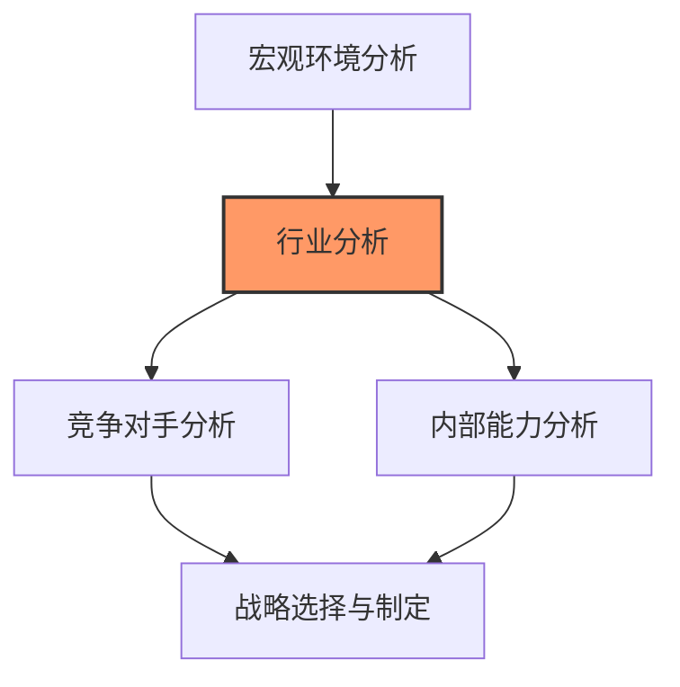
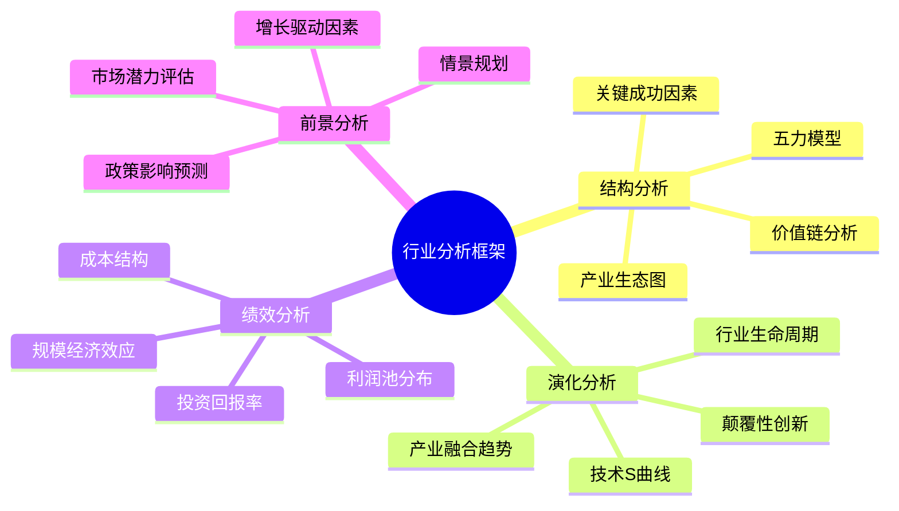
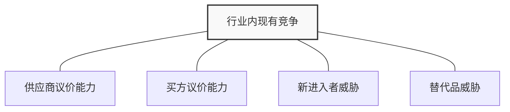
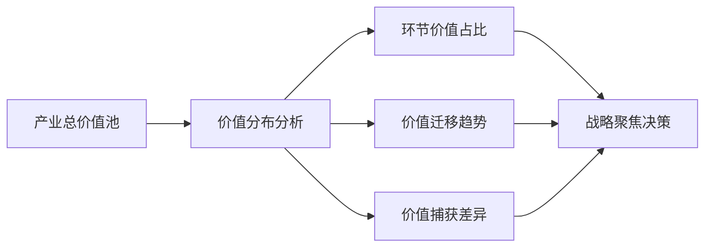
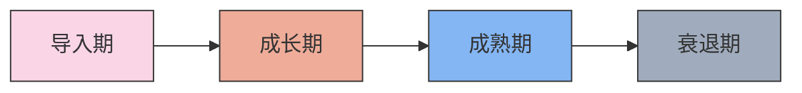
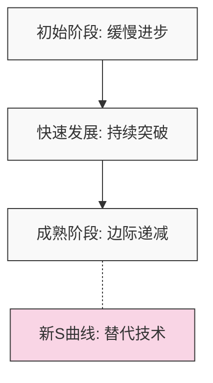

---
{"dg-publish":true,"tags":["商业分析","行业分析","产业结构","竞争格局"],"创建日期":"2024-05-16","permalink":"/知识共享/002_商业分析/01_学习内容/04_市场与竞争分析/4.3 行业分析/","dgPassFrontmatter":true}
---

> [!quote] 概述
> 本文详细介绍行业分析的核心框架、方法和应用，包括行业结构分析、行业生命周期评估、价值链分析和行业演变趋势预测等内容。通过系统学习，商业分析师能够深入把握产业发展规律，识别行业关键成功因素，为企业战略决策提供坚实基础。

## 1. 行业分析基础

### 1.1 行业分析的定义与目的

行业分析是商业分析的重要基石，为企业战略决策提供关键洞察：

**定义**：行业分析是对特定产业经济活动领域的系统考察和评估，目的是理解产业特征、结构、竞争格局、盈利模式和演变趋势，从而为企业在该行业的战略定位和资源配置提供依据。

**核心目的**：
- 理解行业的基本结构和竞争格局
- 识别行业内的关键成功要素和盈利驱动因素
- 评估行业对企业的吸引力和发展潜力
- 揭示行业未来的演变趋势和转型机会
- 指导企业的进入、退出和定位决策

**战略框架中的地位**：



### 1.2 行业分析的演变与发展

行业分析方法论随着商业环境的变化而持续发展：

| 时期 | 主要理论/框架 | 关注重点 | 局限性 |
|------|------------|----------|--------|
| 1960-1970年代 | 经验曲线<br>BCG矩阵<br>规模经济 | 成本结构<br>市场份额<br>规模影响 | 静态视角<br>过于简化<br>内部聚焦 |
| 1980年代 | 波特五力模型<br>价值链分析<br>通用战略 | 行业结构<br>竞争动态<br>战略定位 | 忽视合作<br>低估变革<br>过度理性 |
| 1990年代 | 核心能力理论<br>战略群组<br>游戏理论 | 能力与资源<br>群组竞争<br>互动决策 | 过于关注内部<br>忽视外部变化<br>计算复杂 |
| 2000年代初 | 蓝海战略<br>业务生态系统<br>平台经济 | 价值创新<br>生态关系<br>网络效应 | 实施难度大<br>适用性有限<br>量化困难 |
| 2010年代至今 | 颠覆性创新<br>商业模式画布<br>敏捷战略 | 技术变革<br>商业模式<br>快速适应 | 预测难度大<br>持续调整压力<br>风险增加 |

**行业分析视角的主要转变**：
1. 从静态结构分析到动态演变预测
2. 从行业边界清晰到跨界融合与生态系统
3. 从单纯竞争关系到既竞争又合作的复杂关系
4. 从物理资产和规模到数据、平台和网络效应
5. 从传统价值链到分散式创新网络

### 1.3 行业分析的层次与框架

全面的行业分析需要多层次、多维度的框架：

**分析层次**：
1. **宏观层次**：行业整体规模、增长、集中度和经济贡献
2. **结构层次**：行业内部结构、价值分配和竞争动态
3. **公司层次**：企业在行业中的竞争地位和相对优势
4. **细分层次**：特定产品或服务细分市场的特征和趋势

**整合分析框架**：



**行业分析主要应用场景**：
- 企业战略制定和调整
- 投资决策与投资组合管理
- 并购目标评估与整合规划
- 新产品开发与市场进入决策
- 风险评估与危机管理

## 2. 行业结构分析

### 2.1 波特五力模型

波特五力模型是分析行业结构和吸引力的经典框架：

**五力模型概述**：



**1. 行业内现有竞争**

行业内企业之间的竞争强度直接影响行业的盈利能力：

**影响因素**：
- **竞争者数量与规模**：竞争者越多、规模越接近，竞争越激烈
- **行业增长率**：增长缓慢的行业通常竞争更为激烈
- **产品差异化程度**：同质化产品导致价格竞争加剧
- **转换成本**：低转换成本增加竞争压力
- **退出壁垒**：高退出壁垒使企业即使在亏损情况下也难以退出
- **产能过剩**：产能过剩加剧价格战风险
- **战略利害关系**：部分企业可能有不同于利润的战略目标

**竞争强度评估矩阵**：

| 维度 | 低竞争强度 | 高竞争强度 |
|------|-----------|-----------|
| 市场集中度 | 少数企业主导<br>CR4>60% | 企业数量众多<br>CR4<30% |
| 增长速度 | 双位数增长<br>产能不足 | 低增长或萎缩<br>产能过剩 |
| 差异化程度 | 强品牌力<br>多维度差异 | 商品化程度高<br>标准化产品 |
| 成本结构 | 变动成本为主<br>低沉没成本 | 高固定成本<br>高存储成本 |
| 退出壁垒 | 资产易变现<br>低专用性 | 专用性资产<br>高结构性成本 |

**2. 供应商议价能力**

供应商可以通过提高价格或降低质量来获取行业价值：

**供应商强势条件**：
- 供应商行业集中度高于被供应行业
- 供应商不过度依赖该行业获取收入
- 企业转换供应商的成本高
- 供应商产品具有高度差异化或独特性
- 供应商提供的产品或服务没有替代品
- 供应商有前向整合的可信威胁

**3. 买方议价能力**

强势买家可以通过压低价格或要求更高质量来获取价值：

**买方强势条件**：
- 买家集中或采购量占供应商销售额比例大
- 所购产品标准化程度高，差异化小
- 买家转换供应商的成本低
- 买家拥有完整的市场信息
- 买家对价格敏感（如因利润低或所购产品占成本比重大）
- 买家有后向整合的可信威胁

**4. 新进入者威胁**

潜在进入者带来新的产能和获取市场份额的意愿：

**进入壁垒形式**：
- **规模经济**：大规模生产带来的单位成本优势
- **产品差异化**：已有品牌忠诚度和客户认知
- **资本需求**：进入所需的大额投资
- **转换成本**：客户转换供应商的成本
- **渠道准入**：控制分销渠道的难度
- **政策法规**：政府政策对新进入者的限制
- **成本劣势**：独立于规模的成本劣势（专利技术、资源获取等）

**5. 替代品威胁**

替代品限制了行业的价格上限和利润潜力：

**替代威胁强度取决于**：
- 替代品的价格-性能比率相对于行业产品的优势
- 买家转向替代品的转换成本
- 买家尝试替代品的倾向性
- 替代品的可获得性和可见度

**五力分析应用案例：全球智能手机行业**

| 竞争力量 | 强度 | 关键因素 | 未来趋势 |
|---------|------|---------|---------|
| 现有竞争 | ★★★★★<br>(非常强) | - 寡头垄断格局<br>- 产品更新快速<br>- 高研发投入<br>- 价格战频发 | 持续激烈<br>中高端市场竞争加剧 |
| 供应商议价力 | ★★★☆☆<br>(中等) | - 关键组件供应商集中<br>- 芯片厂商话语权强<br>- 整合趋势增强 | 由于技术演进和自研增加<br>两极分化加剧 |
| 买方议价力 | ★★☆☆☆<br>(较弱) | - 终端消费者分散<br>- 运营商集中采购<br>- 比较便利性提高 | 随着市场成熟<br>消费者权力增加 |
| 新进入威胁 | ★☆☆☆☆<br>(很弱) | - 巨大规模经济<br>- 品牌壁垒高筑<br>- 专利保护复杂<br>- 渠道建设成本高 | 保持较低<br>细分创新可能出现 |
| 替代品威胁 | ★★★☆☆<br>(中等) | - 可穿戴设备兴起<br>- AR/VR潜力<br>- 功能部分替代 | 逐渐增强<br>智能融合设备出现 |

### 2.2 高级五力应用与整合

标准五力模型需要根据数字化时代的特点进行调整和扩展：

**五力模型的时代局限性**：
- 假设行业边界清晰，而数字化时代边界日益模糊
- 过于强调竞争，低估了协作的价值
- 缺乏对平台模式和网络效应的考量
- 未充分考虑数据作为战略资源的价值
- 对颠覆性创新的影响预测不足

**数字时代的五力调整框架**：

| 传统视角 | 数字时代调整 | 实例 |
|---------|------------|------|
| 供应商和买家是分离的实体 | 多边平台模型下角色可互换 | 电商平台上的商家同时也是平台服务的买家 |
| 竞争基于产品和价格 | 竞争基于生态系统和用户体验 | 苹果与谷歌不仅在手机上竞争，更在整个生态系统上竞争 |
| 规模经济主要来自生产效率 | 规模经济主要来自网络效应和数据 | Facebook的价值随用户数量呈指数增长 |
| 渠道控制是实体分销网络 | 渠道是算法、搜索引擎和应用商店 | 谷歌搜索结果排名可决定企业可见度 |
| 替代品是功能相似的产品 | 替代发生在解决方案层面，跨越传统品类 | WhatsApp替代了短信，而非其他通讯应用 |
| 进入壁垒主要是资本和规模 | 进入壁垒包括数据、网络效应和算法优化 | 新社交网络难以挑战Facebook，因后者拥有庞大用户网络 |

**协作动态整合**：

五力模型需要补充第六个维度——协作动态，特别是在以下情境：
- 行业内企业需合作制定标准（如5G技术）
- 共享资源优化成本结构（如航空联盟）
- 联合应对外部威胁（如行业协会游说）
- 平台生态系统中的合作共赢（如App开发商与平台关系）

**分析五力与协作动态的整合矩阵**：

```mermaid
quadrant-chart
    title 行业竞争与协作矩阵
    x-axis 协作潜力 低 --> 高
    y-axis 竞争强度 低 --> 高
    quadrant-1 "共同发展"
    quadrant-2 "生态协同"
    quadrant-3 "零和竞争"
    quadrant-4 "结构性稳定"
    "智能手机": [0.3, 0.9]
    "云计算服务": [0.7, 0.8]
    "航空": [0.8, 0.6]
    "电动汽车": [0.6, 0.5]
    "传统银行": [0.4, 0.4]
    "共享经济": [0.9, 0.7]
    "开源软件": [0.9, 0.3]
```

### 2.3 关键成功因素分析

关键成功因素(KSFs)是企业在特定行业中取得成功必须具备的能力或资源：

**识别关键成功因素的方法**：

1. **客户分析法**：了解客户决策过程和优先考虑的因素
   - 谁是客户？（决策单位分析）
   - 他们如何选择？（决策标准）
   - 为什么这些因素重要？（价值驱动）

2. **竞争分析法**：分析成功竞争者与失败者的差异
   - 最成功企业的共同特征
   - 失败企业的典型缺陷
   - 生存与繁荣的分水岭

3. **价值链分析法**：识别价值创造的关键环节
   - 哪些环节创造最大价值？
   - 哪些环节构成成本或差异化优势？
   - 控制哪些环节可获得更多价值？

4. **结构演化法**：分析行业结构变化的影响
   - 结构变化如何重塑成功要素？
   - 新技术如何改变价值创造方式？
   - 商业模式创新如何重构竞争规则？

**行业特征与关键成功因素对照表**：

| 行业特征 | 可能的关键成功因素 | 行业实例 |
|---------|-----------------|---------|
| 技术密集型 | R&D能力<br>创新速度<br>专利保护<br>人才吸引 | 生物技术<br>人工智能<br>半导体 |
| 规模驱动型 | 成本效率<br>产能利用<br>供应链整合<br>资本效率 | 制造业<br>大宗商品<br>快消品 |
| 品牌驱动型 | 品牌管理<br>营销效率<br>情感连接<br>一致性 | 奢侈品<br>饮料<br>时尚 |
| 服务主导型 | 客户体验<br>个性化<br>员工培训<br>响应速度 | 酒店<br>金融服务<br>医疗 |
| 网络效应型 | 用户增长<br>粘性<br>内容丰富度<br>平台稳定性 | 社交媒体<br>电商平台<br>支付系统 |
| 知识密集型 | 专业知识<br>学习文化<br>知识管理<br>跨领域整合 | 咨询<br>法律服务<br>教育科技 |

**关键成功因素变迁案例：汽车行业**

| 时期 | 主要KSFs | 竞争格局变化 |
|------|---------|------------|
| 1900-1950 | 规模生产<br>垂直整合<br>装配效率 | 大量小厂商被整合<br>福特、通用崛起 |
| 1950-1980 | 产品差异化<br>模型更新<br>营销网络 | 欧洲、日本品牌崛起<br>市场细分加剧 |
| 1980-2000 | 质量管理<br>精益生产<br>全球供应链 | 日本制造商扩张<br>精益模式普及 |
| 2000-2015 | 平台战略<br>模块化<br>全球市场覆盖 | 全球大型汽车集团形成<br>新兴市场重要性增加 |
| 2015至今 | 电气化能力<br>软件集成<br>自动驾驶<br>用户体验 | 特斯拉等新进入者崛起<br>科技企业参与竞争 |

### 2.4 产业结构与价值分布

行业结构决定了价值在不同参与者之间的分配模式：

**价值池概念与分析**：

价值池分析识别行业中哪些环节创造和捕获了最多价值：



**价值分布分析步骤**：
1. 定义产业价值链的主要环节
2. 收集各环节的收入、利润和资本回报数据
3. 计算各环节的利润率和经济利润
4. 比较不同环节的价值捕获效率
5. 分析价值分布的历史演变趋势

**价值迁移案例：智能手机产业价值分布**

| 价值链环节 | 2010年价值占比 | 2023年价值占比 | 价值变化 | 主导企业变化 |
|----------|--------------|--------------|---------|------------|
| 芯片设计 | 15% | 25% | ↑10% | 高通→高通+苹果+华为 |
| 基础软件 | 8% | 20% | ↑12% | 谷歌+苹果→谷歌+苹果 |
| 核心组件 | 25% | 15% | ↓10% | 三星+LG→三星+京东方 |
| 整机组装 | 30% | 18% | ↓12% | 苹果+三星→中国代工厂 |
| 应用生态 | 12% | 18% | ↑6% | 谷歌→谷歌+苹果 |
| 销售渠道 | 10% | 4% | ↓6% | 运营商→线上+直营 |

**利润池分析**：

利润池分析关注行业内利润的分布和集中度：

**分析维度**：
- **行业集中度**：CR4（前四企业集中度）、HHI指数
- **利润分布偏斜度**：20%企业获取80%利润？
- **利润与销售相关性**：市场份额领先是否等于利润领先
- **利润变异系数**：行业内企业利润的波动程度

**利润池分布模式**：

| 分布类型 | 特征 | 战略影响 | 行业实例 |
|---------|------|---------|---------|
| 高度集中型 | 少数企业获取绝大部分利润<br>头部企业利润率远高于行业平均 | 规模和市场份额至关重要<br>强者恒强效应明显 | 操作系统<br>搜索引擎<br>航空发动机 |
| 金字塔型 | 利润随市场地位线性下降<br>清晰的利润层级 | 向上攀升策略明确<br>各层级有不同竞争逻辑 | 汽车制造<br>快消品<br>家电 |
| 双极分化型 | 高端与低端企业盈利<br>中端企业被挤压 | 避免卡在中间地带<br>明确高端或低成本定位 | 酒店<br>航空<br>餐饮 |
| 小生态位型 | 多个细分市场各有盈利空间<br>专注战略可创造高利润 | 深耕细分市场<br>避免跨界扩张风险 | 专业软件<br>特种设备<br>奢侈品 |
| 平等分散型 | 利润较为平均分布<br>无明显优势企业 | 差异化价值重要<br>局部优势创造空间 | 餐厅<br>服装零售<br>家具 |

**行业结构重构的驱动因素**：

| 驱动因素 | 结构性影响 | 实例 |
|---------|----------|------|
| 技术变革 | 打破现有价值链<br>重新分配行业价值<br>降低进入壁垒 | 流媒体对传统媒体产业的重构<br>电动化对汽车产业的影响 |
| 商业模式创新 | 改变收入来源<br>重构客户关系<br>创造新价值主张 | 订阅模式在软件行业的普及<br>共享经济模式的兴起 |
| 法规变化 | 改变行业进入条件<br>影响竞争规则<br>调整价值分配 | 金融监管对银行业务模式的影响<br>碳排放政策对能源行业的重塑 |
| 全球化变化 | 扩大市场边界<br>增加全球竞争者<br>重构供应链 | 中国制造业崛起对全球产业格局的影响<br>贸易保护主义对供应链本地化的推动 |
| 消费者偏好转变 | 改变价值主张<br>重新定义产品属性<br>创造新市场 | 健康意识对食品饮料行业的影响<br>可持续消费对时尚产业的重构 |

## 3. 行业生命周期分析

### 3.1 行业生命周期模型

行业生命周期模型帮助理解行业在不同发展阶段的特征和演变规律：

**行业生命周期的基本阶段**：



**各阶段特征对比**：

| 维度 | 导入期 | 成长期 | 成熟期 | 衰退期 |
|------|-------|-------|-------|--------|
| 增长率 | 低到中等 | 高速增长 | 与GDP同步或略高 | 负增长 |
| 市场规模 | 小，先行者主导 | 快速扩大 | 大，趋于稳定 | 萎缩 |
| 技术变化 | 快速创新，设计多变 | 主导设计出现，标准化开始 | 渐进式改进，标准稳定 | 几乎无创新，技术老化 |
| 进入门槛 | 技术和市场知识 | 规模和资本 | 高壁垒，品牌和效率 | 几乎无新进入者 |
| 竞争特点 | 低度竞争，教育市场为主 | 大量进入，市场份额争夺 | 价格竞争加剧，整合开始 | 产能过剩，竞争或下降 |
| 企业数量 | 少量先行者 | 快速增加 | 整合减少 | 大幅下降 |
| 产品线 | 有限，基础功能 | 快速扩展，差异化 | 完整产品线，细分市场 | 精简，低成本 |
| 盈利模式 | 高毛利但负利润 | 高增长，改善的利润 | 稳定利润，成本控制 | 下降的利润，现金回收 |
| 营销焦点 | 产品知识，早期采用者 | 品牌建设，扩大渠道 | 品牌忠诚，价格促销 | 针对忠实用户，低成本维持 |

**行业生命周期长短的影响因素**：
- 技术变革速度（如智能手机行业VS水泥行业）
- 消费行为变化（如时尚VS基础食品）
- 资本投入规模（如重工业VS服务业）
- 产品替代性（如胶片相机VS餐饮服务）
- 法规稳定性（如制药VS软件应用）

### 3.2 生命周期战略适配

不同生命周期阶段需要匹配不同的战略重点：

**导入期战略要点**：
- 市场教育与建立产品认知
- 树立品类标准与产品定义
- 培育用户习惯与使用场景
- 构建生态系统伙伴关系
- 平衡创新与可用性

**成长期战略要点**：
- 快速扩张产能满足需求
- 建立规模经济优势
- 确保资本充足支持增长
- 扩展产品线覆盖细分市场
- 建立品牌差异化优势
- 发展强大的分销网络

**成熟期战略要点**：
- 优化成本结构提高效率
- 细化市场细分策略
- 产品创新寻找增长点
- 稳固客户关系提高忠诚度
- 整合并购扩大市场份额
- 国际化拓展寻找新市场

**衰退期战略要点**：
- 精简产品线聚焦盈利产品
- 控制成本提高现金流
- 低成本维持核心客户
- 选择性退出或维持利基
- 寻找商业模式转型机会
- 整合产能，成为最后的赢家

**跨周期战略选择矩阵**：

| 企业能力 \ 行业阶段 | 导入期 | 成长期 | 成熟期 | 衰退期 |
|-------------------|-------|-------|-------|--------|
| 技术创新领先 | 定义标准<br>生态构建 | 技术壁垒<br>快速迭代 | 渐进创新<br>专利保护 | 寻找突破<br>业务转型 |
| 营销品牌优势 | 早期采用者<br>产品教育 | 品牌扩张<br>份额争夺 | 品牌忠诚<br>细分领导 | 品牌延伸<br>价值维持 |
| 运营效率卓越 | 有限介入<br>学习曲线 | 规模扩张<br>标准化 | 成本领先<br>效率优化 | 整合领导<br>现金回收 |
| 资本优势充足 | 多点布局<br>风险投资 | 垂直整合<br>并购扩张 | 股权回购<br>高分红 | 资产重组<br>跨界并购 |

**生命周期转换的关键指标**：

了解行业所处的生命周期阶段对战略制定至关重要：

| 转换节点 | 关键指标 | 预警信号 |
|---------|---------|---------|
| 导入→成长 | - 年增长率持续超20%<br>- 主导设计出现<br>- 大规模资本进入 | - 大型企业进入市场<br>- 媒体关注度大幅提升<br>- 早期企业估值快速提升 |
| 成长→成熟 | - 增长率下降至GDP+5%以下<br>- 市场渗透率>50%<br>- 企业数量开始减少 | - 营销费用效果递减<br>- 价格竞争加剧<br>- 大型并购开始出现 |
| 成熟→衰退 | - 连续3年负增长<br>- 利润率持续下降<br>- 领先企业多元化转型 | - 创新投入大幅减少<br>- 工厂关闭和裁员增加<br>- 替代技术/产品普及加速 |

### 3.3 S曲线与技术周期

S曲线模型是理解技术演进和产业转型的重要工具：

**技术S曲线概念**：



**S曲线分析框架**：

1. **技术发展阶段识别**：
   - 投入产出比：研发投入与性能提升比率
   - 专利活动：申请数量、引用率和领域扩散
   - 采用速度：市场渗透率增长曲线

2. **转换点预判**：
   - 技术瓶颈：现有技术接近理论极限
   - 新兴技术：潜力技术的早期应用案例
   - 创新者注意力：顶尖研发人才流向

3. **战略转型时机**：
   - 过早转型：资源浪费，市场不成熟
   - 过晚转型：错失先发优势，落后竞争对手
   - 最佳窗口：现有技术仍有盈利能力，同时布局下一代技术

**S曲线战略应用案例**：

| 产业 | 过去S曲线 | 当前S曲线 | 新兴S曲线 | 战略启示 |
|------|----------|----------|----------|---------|
| 汽车动力 | 内燃机优化<br>(1970-2010) | 混合动力与电气化<br>(2010-2030) | 氢能与自动驾驶<br>(2030+) | 传统车企需加速电动化转型<br>同时关注第三代技术布局 |
| 计算平台 | 个人电脑<br>(1980-2010) | 移动设备<br>(2010-2025) | AR/VR与环境计算<br>(2025+) | 软件公司需跨平台战略<br>硬件厂商需转型服务 |
| 零售业 | 大型商场<br>(1960-2000) | 电子商务<br>(2000-2025) | 元宇宙商务/无人化<br>(2025+) | 线上线下融合成必然<br>数据赋能决定未来竞争力 |

**跨S曲线转型的典型陷阱**：

1. **过度优化陷阱**：过分专注于现有技术的边际改进，错失颠覆性创新
2. **能力依赖陷阱**：现有核心能力阻碍对新技术路径的采纳
3. **客户束缚陷阱**：过分关注现有客户需求，忽视新兴市场机会
4. **财务压力陷阱**：短期利润压力阻碍长期技术转型投入
5. **认知偏见陷阱**：低估新技术的颠覆潜力和发展速度

**跨越S曲线的组织策略**：

| 策略 | 优势 | 风险 | 适用情境 |
|------|------|------|---------|
| 内部创新实验室 | 保持知识产权<br>与现有业务协同 | 组织惯性干扰<br>资源竞争 | 技术延续性强<br>市场相关性高 |
| 独立创新部门 | 运营自主性<br>文化隔离 | 成本高<br>整合难度大 | 技术差异显著<br>时间窗口充足 |
| 收购创新企业 | 快速获取能力<br>减少发展时间 | 文化冲突<br>高溢价风险 | 内部发展能力不足<br>市场竞争紧迫 |
| 战略投资合作 | 风险分散<br>多点布局 | 控制力较弱<br>知识流失风险 | 技术路径不确定<br>生态系统重要 |
| 混合策略 | 全面覆盖<br>灵活调整 | 管理复杂<br>资源分散 | 资源充足<br>市场领导者 | 