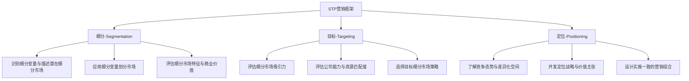
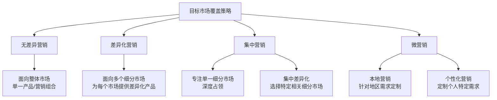

---
{"dg-publish":true,"tags":["商业分析","市场细分","市场定位","营销策略","STP"],"创建日期":"2024-05-01","permalink":"/知识共享/002_商业分析/01_学习内容/04_市场与竞争分析/4.5 市场细分与定位/","dgPassFrontmatter":true}
---

> [!quote] 概述
> 市场细分与定位是企业识别并选择目标市场的战略过程，它通过将整体市场划分为具有相似需求和特征的细分市场，然后针对特定细分市场开发差异化的价值主张和定位策略，实现资源的有效配置和竞争优势的建立。

## 1. 市场细分与定位的理论基础

### 1.1 核心概念定义

**市场细分(Market Segmentation)**:
市场细分是将整体市场划分为不同的消费者群体的过程，每个群体或细分市场具有相似的需求、特征或行为，可以通过特定的产品、服务或营销组合来满足。

**目标市场选择(Market Targeting)**:
在识别市场细分后，评估每个细分市场的吸引力，并选择一个或多个进入的细分市场。

**市场定位(Market Positioning)**:
为产品或服务在目标消费者心智中创建独特、相关且有价值的形象，使其与竞争对手的产品明显区分开来。

### 1.2 STP营销框架

STP(Segmentation-Targeting-Positioning)框架是市场细分与定位的经典模型：



### 1.3 历史发展与理论演进

- **大众营销阶段(1950年代前)**: 以亨利·福特的"任何颜色，只要是黑色"为代表，强调标准化产品和大众市场
- **市场细分理论兴起(1956)**: 温德尔·史密斯首次提出市场细分概念
- **多变量细分时代(1970年代)**: 发展出基于多种变量的复杂细分方法
- **定位理论发展(1980年代)**: 阿尔·里斯和杰克·特劳特提出"定位"概念，出版《定位》一书
- **微细分时代(1990年代至今)**: 数据技术发展使超精细细分和一对一营销成为可能
- **基于价值的细分(当代)**: 从传统的人口统计转向基于价值观和生活方式的细分

## 2. 市场细分的方法与变量

### 2.1 主要细分变量

#### 2.1.1 消费者市场细分变量

| 细分类型 | 主要变量 | 示例 |
|---------|---------|------|
| 地理变量 | 区域、城市规模、人口密度、气候 | 华北市场、一线城市、寒冷地区 |
| 人口统计变量 | 年龄、性别、收入、职业、教育、家庭生命周期 | 18-25岁年轻人、高收入专业人士 |
| 心理变量 | 社会阶层、生活方式、个性特征 | 追求健康的专业人士、冒险型消费者 |
| 行为变量 | 使用场合、追求利益、使用状态、使用频率、忠诚度 | 节日购物者、重度用户、价格敏感型 |

#### 2.1.2 企业市场细分变量

| 细分类型 | 主要变量 | 示例 |
|---------|---------|------|
| 人口统计变量 | 行业、公司规模、地理位置 | 制造业、中小企业、国际市场 |
| 运营变量 | 技术、用户状态、客户能力 | 先进技术用户、首次购买者 |
| 采购方法 | 采购组织、权力结构、购买政策、采购标准 | 中央采购、技术导向型 |
| 情境因素 | 紧急程度、特定应用、订单规模 | 日常维护、大额订单客户 |
| 个人特征 | 买卖双方相似性、风险态度、忠诚度 | 风险规避型客户、长期合作伙伴 |

### 2.2 细分方法学

#### 2.2.1 先验细分法(A Priori Segmentation)
基于预先确定的特征(如年龄、性别、地区)进行细分，简单直接但可能忽略潜在模式。

#### 2.2.2 聚类细分法(Cluster-Based Segmentation)
通过统计分析方法识别消费者的自然分组：
- **K-means聚类**: 基于数值特征将消费者分组
- **层次聚类**: 构建消费者群体的层级结构
- **潜在类别分析**: 识别隐藏的消费者分组模式

#### 2.2.3 需求基础细分法(Needs-Based Segmentation)
基于消费者核心需求和期望的异同进行分组，通常通过定性研究和量化调查结合实现。

#### 2.2.4 价值基础细分法(Value-Based Segmentation)
基于客户对企业贡献的经济价值进行分组，例如RFM(Recency-Frequency-Monetary)模型。

### 2.3 评估细分市场的标准

有效的市场细分应满足以下标准：

- **可衡量性(Measurable)**: 细分市场的规模和购买力可测量
- **可及性(Accessible)**: 能够有效接触和服务细分市场
- **实质性(Substantial)**: 细分市场足够大或有足够利润
- **差异性(Differentiable)**: 细分市场对不同营销组合有不同反应
- **可行动性(Actionable)**: 能够为细分市场设计有效的营销方案

## 3. 目标市场选择策略

### 3.1 目标市场覆盖策略



#### 3.1.1 无差异营销(Undifferentiated Marketing)
- **策略描述**: 以单一产品和营销组合服务整个市场
- **适用情况**: 产品同质化高、消费者需求差异小的市场
- **优势**: 规模经济、成本效益
- **劣势**: 难以满足细分市场特殊需求、面临精准营销的竞争

#### 3.1.2 差异化营销(Differentiated Marketing)
- **策略描述**: 同时针对多个细分市场，为每个市场提供差异化的产品和营销方案
- **适用情况**: 企业资源丰富、市场高度分化
- **优势**: 提高整体市场份额、分散市场风险
- **劣势**: 成本增加、资源分散、管理复杂

#### 3.1.3 集中营销(Concentrated Marketing)
- **策略描述**: 专注于一个或少数几个细分市场
- **适用情况**: 资源有限、特定细分市场具有高吸引力
- **优势**: 资源集中、建立专业形象、深入了解客户
- **劣势**: 市场风险集中、增长受限

#### 3.1.4 微营销(Micromarketing)
- **策略描述**: 根据本地需求或个人特征定制产品和营销
- **适用情况**: 消费者高度个性化需求、技术支持一对一营销
- **优势**: 满足精确需求、建立强客户关系
- **劣势**: 成本高、可扩展性受限

### 3.2 目标市场选择标准

选择目标市场时需考虑以下因素：

- **细分市场规模与增长潜力**: 当前规模和预期增长率
- **结构吸引力**: 竞争强度、替代品威胁、买方议价能力
- **公司目标与资源匹配**: 与长期战略、核心能力的一致性
- **进入壁垒**: 进入和退出的难度
- **可持续竞争优势**: 在该细分市场建立和维持优势的能力

## 4. 市场定位策略与实施

### 4.1 定位基础与类型

定位是在目标消费者心智中建立产品或品牌的独特形象的过程。常见的定位基础包括：

- **基于属性定位**: 强调产品的特定特征或属性
- **基于利益定位**: 强调产品为消费者带来的具体利益
- **基于应用/使用场景定位**: 强调产品的特定用途或使用场景
- **基于用户定位**: 将产品与特定类型的用户联系起来
- **基于竞争对手定位**: 相对于竞争对手建立差异
- **基于品类定位**: 在特定产品类别中建立领导地位
- **基于质量/价格定位**: 强调价值主张的特定方面

### 4.2 定位地图开发

定位地图是可视化展示产品相对于关键购买维度的竞争位置的工具：

1. **确定关键属性**: 识别目标消费者决策的关键维度
2. **评估竞争品牌**: 了解竞争品牌在这些维度上的表现
3. **识别空白**: 寻找未被充分满足的市场机会
4. **选择位置**: 基于公司实力和市场机会确定定位

```mermaid
quadrant-chart
    title 奢侈手表市场定位地图
    x-axis 实用性 --> 奢华性
    y-axis 传统 --> 现代
    quadrant-1 传统奢华
    quadrant-2 现代奢华
    quadrant-3 传统实用
    quadrant-4 现代实用
    "劳力士": [0.7, 0.3]
    "百达翡丽": [0.9, 0.2]
    "欧米茄": [0.5, 0.4]
    "卡地亚": [0.8, 0.6]
    "浪琴": [0.4, 0.3]
    "天梭": [0.3, 0.4]
    "Apple Watch": [0.2, 0.9]
    "机会空间": [0.6, 0.8]
```

### 4.3 价值主张开发

价值主张是定位战略的具体表达，应符合以下特点：

- **相关性**: 针对目标客户的核心需求和痛点
- **独特性**: 与竞争对手明显区分
- **可信性**: 企业有能力兑现承诺
- **可持续性**: 难以被竞争对手轻易模仿
- **简洁明了**: 容易沟通和理解

### 4.4 定位策略实施

将定位战略转化为具体行动需要协调以下营销组合要素：

- **产品策略**: 设计与定位一致的产品功能、质量和外观
- **价格策略**: 定价水平应支持价值主张和定位
- **渠道策略**: 分销渠道的选择应强化定位
- **促销策略**: 沟通内容和风格应与定位一致
- **人员策略**: 确保员工行为反映品牌定位
- **物理环境**: 实体空间设计与品牌定位协调
- **流程设计**: 提供与定位相符的客户体验

### 4.5 定位效果评估

定位效果可通过以下指标评估：

- **品牌认知度**: 目标消费者对品牌的认知程度
- **品牌联想**: 消费者与品牌相关的关键属性和联想
- **品牌差异化**: 与竞争品牌的感知区别程度
- **品牌相关性**: 品牌定位与目标消费者需求的匹配度
- **购买意向**: 定位对消费者购买决策的影响
- **市场份额**: 在目标细分市场的占有率变化
- **品牌溢价**: 消费者愿意为品牌支付的额外价格

## 5. 案例分析

### 5.1 案例一：宝洁公司的细分与定位策略

**背景**：宝洁在洗发水市场采用多品牌策略，针对不同细分市场推出不同品牌。

**细分方法**：
- 基于消费者需求和发质特征进行细分
- 综合考虑人口统计变量和心理变量

**目标市场策略**：差异化营销，覆盖多个细分市场

**定位策略**：
- 海飞丝：定位于去屑功效，强调专业解决方案
- 潘婷：定位于营养修复，针对追求发质健康的女性
- 沙宣：定位于专业发型设计，针对时尚人群
- 飘柔：定位于柔顺效果，针对追求简单护发的大众市场

**成功因素**：
- 精准识别细分市场的核心需求
- 清晰一致的品牌定位与沟通
- 产品特性与定位的高度一致
- 避免内部品牌间的过度竞争

### 5.2 案例二：特斯拉的颠覆性定位策略

**背景**：特斯拉进入汽车市场时面临传统汽车厂商的强大竞争。

**细分策略**：
- 初期聚焦高端电动跑车市场(Roadster)
- 逐步拓展至高端轿车(Model S)
- 最终进入大众市场(Model 3)

**定位转变**：
- 从"高性能电动跑车"到"高端电动汽车"
- 再到"未来出行方式"的引领者

**创新定位要素**：
- 不仅是"环保汽车"，更是"性能超越传统汽车的科技产品"
- 将自己定位为科技公司而非传统汽车制造商
- 重新定义汽车的核心价值：从机械性能到软件和用户体验

**成功因素**：
- 找到环保、性能和科技的独特交叉点
- 通过直销模式和OTA升级强化科技定位
- 创始人个人品牌与公司定位的协同效应

### 5.3 案例三：小米的细分市场进入与重新定位

**背景**：小米从智能手机市场起步，后拓展至多个消费电子品类。

**初期定位**：
- 目标市场：对价格敏感但追求高性能的年轻科技爱好者
- 价值主张："高配低价"的性价比定位

**定位转变**：
- 从单一"性价比"定位向多元化品牌矩阵转变
- 小米品牌上移至中高端市场
- 红米品牌专注性价比市场

**细分策略演变**：
- 从集中营销(专注单一细分市场)
- 到差异化营销(多品牌覆盖不同价格段)

**成功因素与挑战**：
- 成功识别了价格敏感度这一关键细分变量
- 通过互联网模式降低成本支持价值主张
- 细分策略随业务扩展灵活调整
- 挑战：品牌上移过程中定位一致性的维护

## 6. 数字时代的细分与定位创新

### 6.1 数据驱动的微细分

数字技术使超精细市场细分成为可能：

- **实时行为分析**: 根据消费者实时行为调整细分
- **预测分析**: 运用机器学习预测细分市场变化
- **动态细分**: 根据环境和消费者状态动态调整细分

### 6.2 个性化营销与定位

- **一对一定位**: 根据个人特征和行为实现极度个性化
- **动态定位**: 根据消费者环境和状态实时调整定位
- **情景营销**: 根据消费者所处情景精准投放定位信息

### 6.3 全渠道细分与定位整合

- **跨渠道行为分析**: 整合线上线下消费者数据
- **统一客户视图**: 建立跨渠道的完整客户画像
- **一致性定位体验**: 确保所有接触点传递一致的定位信息

### 6.4 社区与价值观驱动的细分

- **从人口统计到价值观**: 基于共同价值观和信念的细分
- **品牌社区**: 围绕共同兴趣和身份建立的用户群体
- **意见领袖影响**: 通过关键意见领袖触达特定细分市场

## 7. 实践工具与方法

### 7.1 市场细分工作表

| 步骤 | 活动 | 输出 |
|------|------|------|
| 1 | 选择细分市场标准和变量 | 细分变量列表 |
| 2 | 收集消费者数据 | 原始数据集 |
| 3 | 应用聚类或其他分析方法 | 初步细分结果 |
| 4 | 描述各细分市场特征 | 细分市场概况 |
| 5 | 评估细分市场吸引力 | 细分市场评分卡 |
| 6 | 选择目标细分市场 | 目标市场决策 |

### 7.2 定位策略开发工具

**定位画布模板**:
1. 目标细分市场: [描述目标客户]
2. 核心需求与痛点: [列出关键需求]
3. 竞争分析: [主要竞争对手及其定位]
4. 差异化优势: [我们的独特优势]
5. 价值主张: [简洁的价值主张陈述]
6. 支持证据: [支持价值主张的证据]
7. 定位声明: [25字以内的定位声明]
8. 执行要点: [如何通过营销组合传达定位]

### 7.3 定位声明公式

一个有效的定位声明通常遵循以下结构：

"对于[目标细分市场]，[品牌名称]是[品类参考]中的[差异化概念]，因为[支持理由]。"

示例：
"对于注重时尚的年轻专业人士，iPhone是智能手机中的创新领导者，因为它提供了无缝的用户体验和前沿的设计。"

## 8. 常见挑战与解决方案

### 8.1 过度细分与资源分散

**挑战**：创建太多细分市场导致资源分散，无法有效服务任何一个市场。

**解决方案**：
- 使用二级细分方法，先识别主要细分，再进行子细分
- 根据资源现实评估可服务的细分市场数量
- 优先考虑战略重要性高的细分市场

### 8.2 定位模糊与一致性缺失

**挑战**：定位信息不清晰或在不同接触点传递不一致的定位信息。

**解决方案**：
- 制定明确的定位声明和品牌指南
- 建立跨部门协调机制确保一致性
- 定期审计所有客户接触点的定位信息

### 8.3 价值主张未兑现

**挑战**：实际产品或服务体验未能实现定位承诺。

**解决方案**：
- 确保定位基于真实能力，避免过度承诺
- 建立客户体验监控机制
- 将定位承诺转化为内部绩效指标

### 8.4 动态市场中的定位调整

**挑战**：市场和消费者快速变化导致定位过时。

**解决方案**：
- 建立定期的市场细分和定位评估机制
- 保持定位的核心稳定，同时允许战术层面的适应性调整
- 进行前瞻性研究预测细分市场变化趋势

## 9. 思考问题与练习

1. 您认为在当今数字化和碎片化的消费环境中，传统的STP营销框架是否仍然适用？为什么？

2. 选择一个您熟悉的行业，分析其主要细分市场的变化趋势，并探讨这些变化对行业内企业定位策略的影响。

3. 比较基于人口统计变量和基于行为/心理变量的细分方法的优缺点。哪种方法更适合预测消费者行为？

4. 分析一个成功将定位从一个细分市场迁移到另一个细分市场的品牌案例。该品牌如何管理这一转变过程？

5. 在快速变化的市场中，企业应如何平衡定位的一致性和灵活性？提供具体的策略和实施方法。

6. 为一家计划进入智能家居市场的创业公司设计细分与定位策略，考虑不同的目标市场覆盖选项和相应的定位方向。

7. 评估社交媒体和数字技术对市场细分与定位实践的影响。这些技术如何改变了企业识别和接触目标市场的方式？

8. 对比分析两个竞争品牌(如可口可乐vs百事可乐或Nike vs Adidas)的定位策略，探讨它们如何在相似市场中建立差异化。

9. 讨论文化因素对全球品牌细分与定位策略的影响。全球品牌应如何在保持品牌一致性的同时适应本地市场需求？

10. 分析一个定位失败的案例，探讨失败的原因以及企业采取的补救措施。

## 10. 延伸阅读与资源

### 10.1 学术著作与经典文献

- Wendell Smith (1956). "Product Differentiation and Market Segmentation as Alternative Marketing Strategies"
- Al Ries & Jack Trout (2001). "Positioning: The Battle for Your Mind"
- Clayton Christensen et al. (2016). "Competing Against Luck: The Story of Innovation and Customer Choice"
- Philip Kotler & Kevin Lane Keller. "Marketing Management"

### 10.2 实践工具与模板

- 市场细分工作表与分析模板：[[04_模板/02_数据收集/市场细分工作表模板\|04_模板/02_数据收集/市场细分工作表模板]]
- 定位战略开发框架：[[04_模板/01_分析框架/定位战略分析模板\|04_模板/01_分析框架/定位战略分析模板]]
- 价值主张画布：[[04_模板/01_分析框架/价值主张画布模板\|04_模板/01_分析框架/价值主张画布模板]]

### 10.3 相关课程与在线资源

- Northwestern University: "Market Segmentation and Targeting" (Coursera)
- Harvard Business School Online: "Disruptive Strategy with Clayton Christensen"
- 尼尔森市场细分研究报告：[Nielsen Global Segmentation](https://www.nielsen.com)

### 10.4 相关主题与知识关联

- [[知识共享/002_商业分析/01_学习内容/01_商业分析基础/1.3 商业分析的思维方式\|01_商业分析基础/1.3 商业分析的思维方式]] - 利用分析思维进行细分分析
- [[知识共享/002_商业分析/01_学习内容/03_分析方法与工具/3.2 诊断性分析方法\|03_分析方法与工具/3.2 诊断性分析方法]] - 应用于细分市场评估
- [[知识共享/002_商业分析/01_学习内容/04_市场与竞争分析/4.1 市场分析框架\|04_市场与竞争分析/4.1 市场分析框架]] - 与市场细分相关的分析框架
- [[知识共享/002_商业分析/01_学习内容/06_商业模式分析/6.2 价值主张设计\|06_商业模式分析/6.2 价值主张设计]] - 针对特定细分市场的价值创造

## 11. 总结

市场细分与定位是战略营销的核心流程，通过系统性地识别和选择目标市场，并为产品在目标消费者心智中创建有意义的位置，企业能够更有效地分配资源、满足客户需求并建立竞争优势。

有效的市场细分与定位策略应该：
- 基于深入的市场研究和消费者洞察
- 选择具有足够吸引力和可行性的细分市场
- 创建清晰、相关、可信和差异化的定位
- 通过一致的营销组合实施定位战略
- 随市场变化和竞争态势调整策略

在数字化时代，市场细分与定位面临新的机遇和挑战，包括微细分、个性化营销、全渠道整合等。掌握这一战略工具的核心原则和创新应用，是商业分析专业人士的关键能力。 