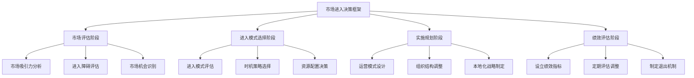

---
{"dg-publish":true,"tags":["商业分析","市场进入","战略分析","商业扩张","市场开发"],"创建日期":"2024-05-01","permalink":"/知识共享/002_商业分析/01_学习内容/04_市场与竞争分析/4.6 市场进入策略分析/","dgPassFrontmatter":true}
---

> [!quote] 概述
> 市场进入策略分析是企业在开拓新市场时的战略决策过程，涉及对进入时机、进入模式和资源配置的系统性评估与规划。通过全面分析市场机会、竞争格局和自身能力，企业可以选择最优的进入路径，降低风险并提高成功概率。

## 1. 市场进入策略基础

### 1.1 核心概念界定

**市场进入策略(Market Entry Strategy)**:
指企业进入新市场（地理区域或产品类别）时采用的系统性方法，包括进入模式、时机选择、资源分配和竞争定位等一系列决策。

**新市场类型**:
- **地理新市场**: 在新的地理区域推广现有产品/服务
- **产品新市场**: 向现有客户提供新产品类别
- **多元化新市场**: 同时进入新地理区域和新产品类别

### 1.2 市场进入策略的战略意义

市场进入策略对企业具有以下战略意义：
- 拓展收入和利润增长空间
- 分散单一市场风险
- 获得规模经济和范围经济
- 把握新兴市场机会
- 应对本土市场饱和或竞争加剧
- 跟随关键客户进入新市场
- 获取新资源、技术或能力

### 1.3 市场进入决策框架



## 2. 市场评估与选择

### 2.1 市场吸引力评估框架

#### 2.1.1 市场规模与增长

评估目标市场的：
- 当前市场规模
- 历史增长率
- 预期增长潜力
- 市场发展阶段（导入期、成长期、成熟期、衰退期）

#### 2.1.2 市场结构与竞争分析

- 市场集中度
- 现有竞争对手数量与实力
- 价格竞争强度
- 差异化空间
- 潜在进入者威胁

#### 2.1.3 经济与商业环境

- 经济发展水平与稳定性
- 消费能力与消费习惯
- 基础设施发展状况
- 商业生态系统成熟度
- 供应链可获得性

#### 2.1.4 政治与法律环境

- 政治稳定性
- 外商投资政策
- 贸易壁垒与关税
- 监管框架与合规要求
- 知识产权保护

### 2.2 进入障碍分析

#### 2.2.1 结构性进入障碍

- 规模经济要求
- 产品差异化程度
- 资本需求
- 转换成本
- 渠道准入限制

#### 2.2.2 战略性进入障碍

- 现有企业的反击策略
- 预期报复程度
- 战略资源控制
- 关键合作伙伴接入
- 本地网络效应

#### 2.2.3 制度性进入障碍

- 政府限制与许可要求
- 本地内容要求
- 所有权限制
- 技术标准与认证
- 劳动法规与雇佣限制

### 2.3 市场机会评估矩阵

| 市场吸引力 | 高进入障碍 | 中等进入障碍 | 低进入障碍 |
|-----------|-----------|------------|-----------|
| **高吸引力** | 长期战略投资<br>联盟进入 | 优先战略投资<br>直接进入 | 快速进入<br>抢占份额 |
| **中等吸引力** | 选择性进入<br>合资模式 | 适度投资<br>渐进式进入 | 轻资产进入<br>测试市场 |
| **低吸引力** | 避免进入 | 观望或特许经营 | 低成本尝试<br>出口模式 |

## 3. 市场进入模式分析

### 3.1 进入模式类型与特点

#### 3.1.1 出口模式

**间接出口**:
- **描述**: 通过中间商销售产品到国际市场
- **控制度**: 低
- **资源承诺**: 低
- **风险**: 低
- **适用场景**: 资源有限、国际经验少、市场了解有限

**直接出口**:
- **描述**: 企业直接向国外分销商或客户销售
- **控制度**: 中
- **资源承诺**: 中
- **风险**: 中
- **适用场景**: 具有一定国际经验、需要更多市场控制

#### 3.1.2 契约模式

**许可证与特许经营**:
- **描述**: 授权本地企业使用品牌、技术或业务模式
- **控制度**: 中
- **资源承诺**: 低
- **风险**: 低至中
- **适用场景**: 标准化业务模式、强品牌、法律保护良好

**战略联盟**:
- **描述**: 与本地合作伙伴形成非股权合作
- **控制度**: 中
- **资源承诺**: 中
- **风险**: 中
- **适用场景**: 互补资源、能力与网络

#### 3.1.3 投资模式

**合资企业**:
- **描述**: 与本地伙伴共同设立新企业
- **控制度**: 中至高
- **资源承诺**: 高
- **风险**: 中至高
- **适用场景**: 需要本地知识、政治敏感行业、资源互补

**全资子公司**:
- **描述**: 在目标市场设立完全控制的子公司
- **控制度**: 高
- **资源承诺**: 高
- **风险**: 高
- **适用场景**: 核心技术保护、高度控制需求、长期战略市场

### 3.2 进入模式选择因素

#### 3.2.1 外部因素

- **市场规模与增长**: 大型快速增长市场通常支持更高投入模式
- **政策限制**: 所有权限制可能强制选择合资或非股权模式
- **制度距离**: 文化、政治差异大时通常选择低控制度模式
- **竞争强度**: 高度竞争市场可能需要强承诺模式以获竞争力

#### 3.2.2 内部因素

- **企业目标**: 战略性目标通常需要高控制度模式
- **资源可用性**: 有限资源倾向于出口或契约模式
- **国际经验**: 经验丰富企业更愿意采用高承诺模式
- **核心能力**: 需要保护的核心能力通常要求高控制模式

### 3.3 进入模式评估框架

```mermaid
quadrant-chart
    title 市场进入模式评估
    x-axis 资源承诺需求 --> 高
    y-axis 控制需求 --> 高
    quadrant-1 战略控制型
    quadrant-2 全面投入型
    quadrant-3 资源保守型
    quadrant-4 灵活扩展型
    "全资子公司": [0.9, 0.9]
    "合资企业": [0.7, 0.5]
    "战略联盟": [0.5, 0.4]
    "特许经营": [0.3, 0.6]
    "直接出口": [0.4, 0.3]
    "间接出口": [0.2, 0.1]
    "许可协议": [0.3, 0.2]
```

## 4. 市场进入时机策略

### 4.1 先行者与后进入者策略

#### 4.1.1 先行者策略(First-Mover Strategy)

**优势**:
- 建立品牌认知与客户忠诚度
- 占据最佳资源与渠道位置
- 设立行业标准
- 获取规模与学习曲线效应
- 建立转换成本

**劣势**:
- 承担市场教育成本
- 面临不确定性与风险
- 缺乏成熟解决方案
- 可能做出过早投资

#### 4.1.2 后进入者策略(Late-Mover Strategy)

**优势**:
- 从先行者错误中学习
- 利用已发展的市场需求
- 采用更成熟技术
- 避免市场教育成本
- 针对性解决先行者弱点

**劣势**:
- 面对已建立的品牌忠诚
- 可能面临高客户获取成本
- 优质资源可能已被占据
- 需要创新突破现有格局

### 4.2 时机策略选择框架

| 因素 | 支持先行者策略 | 支持后进入者策略 |
|-----|--------------|----------------|
| **市场特征** | 高增长、未开发<br>标准尚未确立 | 市场成熟度低<br>标准变化快 |
| **竞争环境** | 竞争者少<br>进入壁垒可建立 | 竞争已充分<br>差异化空间大 |
| **企业能力** | 创新能力强<br>风险承受力高 | 快速模仿能力<br>运营优化能力 |
| **产品特性** | 网络效应强<br>学习曲线陡峭 | 技术更迭快<br>模块化程度高 |

### 4.3 渐进式进入策略

许多企业采用渐进式进入策略，通过以下步骤降低风险：

1. **市场测试阶段**: 使用低承诺模式(如出口)进行初步测试
2. **资源投入阶段**: 成功后增加承诺(如设立销售办事处)
3. **本地生产阶段**: 建立本地运营能力(如合资生产)
4. **全面整合阶段**: 实现全面控制(如全资子公司)

## 5. 市场进入实施策略

### 5.1 市场定位与本地化策略

#### 5.1.1 全球标准化与本地适应

在标准化与本地适应间需要做出平衡：

- **全球标准化**: 保持产品、品牌、运营一致性
- **本地适应**: 根据本地需求、偏好、条件调整
- **区域整合**: 在相似市场群内实现部分标准化

#### 5.1.2 本地化维度

主要本地化考量维度包括：

- **产品适应**: 根据本地需求、使用条件、法规调整
- **品牌策略**: 全球品牌、本地品牌或混合策略
- **营销传播**: 信息、渠道、媒体的文化适应
- **定价策略**: 考虑本地购买力、竞争环境和感知价值
- **分销体系**: 适应本地渠道结构和购买习惯

### 5.2 组织结构与控制机制

#### 5.2.1 组织模式选择

不同市场进入阶段可能需要不同组织模式：

- **出口部门**: 管理初期国际销售活动
- **国际部门**: 协调多个国际市场活动
- **地区总部**: 管理特定地区的所有业务
- **全球矩阵**: 产品、功能与地区维度交叉管理
- **跨国网络**: 分布式决策的整合全球网络

#### 5.2.2 控制与协调机制

建立有效的控制与协调机制至关重要：

- **正式控制**: 预算、绩效目标、报告流程
- **文化控制**: 共享价值观和企业文化
- **人员控制**: 关键人员选择与轮岗
- **知识共享**: 全球最佳实践与学习系统

### 5.3 风险管理策略

#### 5.3.1 主要风险类型

市场进入面临的主要风险：

- **商业风险**: 市场接受度、竞争反应
- **政治风险**: 政策变化、征收、限制
- **经济风险**: 汇率波动、经济不稳定
- **运营风险**:
- **法律合规风险**: 监管合规、知识产权
- **文化风险**: 文化误解、沟通障碍

#### 5.3.2 风险缓解策略

有效的风险管理策略包括：

- **分阶段投资**: 基于里程碑的资源投入
- **合作伙伴关系**: 与本地伙伴分担风险
- **灵活商业模式**: 保持调整能力
- **情景规划**: 准备多种应对方案
- **政治风险保险**: 针对特定风险的保障

## 6. 市场进入案例分析

### 6.1 案例一：星巴克的亚洲市场进入策略

**背景**: 星巴克在20世纪90年代开始进入亚洲市场，面临茶文化主导、消费习惯差异和价格敏感度高等挑战。

**进入评估**:
- 市场吸引力: 新兴中产阶级增长、西方生活方式兴起
- 进入障碍: 文化差异、饮食习惯、高物业成本

**进入策略**:
- **进入模式**: 采用合资模式与本地强势伙伴合作
- **时机策略**: 先行者策略，率先建立高端咖啡品类
- **本地化**: 保持核心体验，同时引入本地口味产品
- **扩张路径**: 先从大都市中心区开始，逐步向二线城市扩展

**成功因素**:
- 选择具有本地市场洞察的强大合作伙伴
- 保持品牌核心体验的一致性
- 适度的本地化，不失品牌特色
- 将咖啡定位为生活方式而非饮品
- 长期投资视角，愿意等待市场培育

### 6.2 案例二：沃尔玛在中国的市场进入挑战

**背景**: 沃尔玛1996年进入中国，采用全资子公司模式，最初取得有限成功，但后期面临本土零售商强劲竞争。

**进入策略**:
- **进入模式**: 初期采用全资子公司，坚持"每日低价"定位
- **本地化策略**: 有限适应本地需求
- **扩张节奏**: 谨慎扩张，避免过快扩张造成风险

**挑战与调整**:
- 本地消费习惯与美国模式不匹配
- 供应链本地化程度不足
- 未能适应中国电子商务快速发展
- 战略调整: 收购一号店，与京东合作，最终与腾讯建立战略合作

**教训**:
- 全球标准化模式需要深度本地化调整
- 合适的本地战略合作伙伴至关重要
- 需要根据市场反馈快速调整进入策略
- 对新兴市场消费者行为预测不足

### 6.3 案例三：小米的国际市场进入策略

**背景**: 小米从2014年开始国际化扩张，从印度等新兴市场起步，逐步向发达市场扩展。

**进入策略**:
- **市场选择**: 从文化相近、监管宽松的东南亚和印度开始
- **进入模式**: 轻资产模式，线上销售为主，结合本地合作伙伴
- **产品策略**: 先以手机切入，后拓展生态链产品
- **渠道策略**: 线上与线下相结合，重视社交媒体营销

**差异化策略**:
- **新兴市场**: 突出高性价比、本地化社交营销
- **发达市场**: 强调设计与创新，提升品牌定位

**成功因素**:
- 灵活调整进入策略适应不同市场
- 充分利用互联网营销降低进入成本
- 强大的供应链能力支持快速调整
- 产品线扩展创造协同效应
- 建立本地团队与社区

## 7. 实践工具与方法

### 7.1 市场进入评估工具

#### 7.1.1 市场吸引力评分卡

| 评估因素 | 权重 | 评分(1-5) | 加权分数 |
|---------|------|---------|----------|
| 市场规模 | 20% | | |
| 增长潜力 | 20% | | |
| 竞争强度 | 15% | | |
| 利润水平 | 15% | | |
| 政治风险 | 10% | | |
| 文化距离 | 10% | | |
| 准入壁垒 | 10% | | |
| **总分** | 100% | | |

#### 7.1.2 进入模式决策矩阵

| 进入模式 | 资源需求 | 风险水平 | 控制程度 | 灵活性 | 利润潜力 | 总评分 |
|---------|---------|---------|----------|-------|----------|-------|
| 出口 | | | | | | |
| 特许经营 | | | | | | |
| 战略联盟 | | | | | | |
| 合资企业 | | | | | | |
| 全资子公司 | | | | | | |

### 7.2 市场进入实施计划模板

1. **市场进入目标**
   - 短期目标(1-2年)
   - 中期目标(3-5年)
   - 长期目标(5年以上)

2. **资源配置计划**
   - 财务资源
   - 人力资源
   - 技术资源
   - 管理资源

3. **里程碑与时间表**
   - 准备阶段(市场研究、合作伙伴选择)
   - 初始进入阶段(试点运营)
   - 扩展阶段(规模扩大)
   - 巩固阶段(深度本地化)

4. **本地化行动计划**
   - 产品调整
   - 品牌策略
   - 渠道建设
   - 定价策略
   - 营销传播

5. **风险管理计划**
   - 主要风险识别
   - 风险监控指标
   - 应对方案
   - 退出策略

## 8. 数字时代的市场进入创新

### 8.1 数字渠道进入策略

数字技术为市场进入提供新路径：

- **电子商务平台**: 利用亚马逊、阿里巴巴等平台快速触达新市场
- **社交媒体营销**: 通过社交媒体建立品牌认知和用户群体
- **数字内容本地化**: 网站、应用程序的多语言、多文化适应
- **云服务模式(SaaS)**: 降低物理存在需求的服务提供模式

### 8.2 平台与生态系统进入模式

新兴的平台商业模式改变了传统进入逻辑：

- **平台扩展**: 将现有平台模式扩展到新市场
- **生态系统渗透**: 通过合作伙伴网络实现市场渗透
- **应用程序国际化**: 移动应用作为低成本市场进入渠道
- **数字合资**: 与本地数字平台合作共同开发市场

### 8.3 敏捷市场进入方法

数字时代的敏捷进入方法包括：

- **最小可行产品(MVP)**: 快速测试市场接受度
- **A/B测试**: 同时测试多种进入策略
- **增长黑客技术**: 利用数据驱动的增长方法
- **众筹与预售**: 在正式进入前测试需求
- **虚拟团队与远程运营**: 降低初期物理存在需求

## 9. 思考问题与练习

1. 分析一家您熟悉的企业近期的市场进入案例，评估其市场选择、进入模式和实施策略的有效性。企业可能如何改进其进入策略？

2. 比较先行者策略和后进入者策略在数字行业和传统行业的适用性差异。什么条件下先行者优势更显著？

3. 对于一家计划进入东南亚市场的中国科技企业，设计一套市场筛选和优先级排序的方法，并说明关键评估指标。

4. 评估合资企业与全资子公司这两种进入模式在知识密集型行业的优劣势。企业应基于哪些因素做出选择？

5. 探讨文化距离如何影响市场进入策略的选择和实施。提供具体的应对文化挑战的方法。

6. 设计一个针对新兴市场的渐进式市场进入路径，包括每个阶段的目标、风险和评估指标。

7. 分析一个市场进入失败的案例，探讨失败原因及企业可能采取的替代策略。

8. 讨论数字技术如何改变传统的市场进入壁垒和机会。数字企业应如何利用这些变化？

9. 评估新冠疫情对全球市场进入策略的长期影响。哪些变化可能是永久性的？

10. 为一家计划国际化的初创企业设计资源有限条件下的创新市场进入策略。

## 10. 延伸阅读与资源

### 10.1 学术著作与经典文献

- Johnson, G., & Tellis, G. J. (2008). "Drivers of Success for Market Entry into China and India"
- Ghemawat, P. (2007). "Redefining Global Strategy: Crossing Borders in a World Where Differences Still Matter"
- Luo, Y. (2007). "From foreign investors to strategic insiders: Shifting parameters, prescriptions and paradigms for MNCs in China"
- Johanson, J., & Vahlne, J. E. (2009). "The Uppsala internationalization process model revisited: From liability of foreignness to liability of outsidership"

### 10.2 实践工具与模板

- 市场进入规划模板：[[04_模板/03_报告/市场进入策略报告模板\|04_模板/03_报告/市场进入策略报告模板]]
- 国际扩张风险评估工具：[[04_模板/04_决策支持/国际市场风险评估模板\|04_模板/04_决策支持/国际市场风险评估模板]]
- 进入模式比较框架：[[04_模板/01_分析框架/市场进入模式分析模板\|04_模板/01_分析框架/市场进入模式分析模板]]

### 10.3 相关课程与在线资源

- Harvard Business School Online: "Global Business"
- INSEAD: "International Business Strategy"
- McKinsey Global Institute: https://www.mckinsey.com/mgi/overview
- World Bank Doing Business: https://www.doingbusiness.org/

### 10.4 相关主题与知识关联

- [[知识共享/002_商业分析/01_学习内容/04_市场与竞争分析/4.1 市场分析框架\|04_市场与竞争分析/4.1 市场分析框架]] - 市场评估的基础框架
- [[知识共享/002_商业分析/01_学习内容/04_市场与竞争分析/4.2 竞争对手分析\|04_市场与竞争分析/4.2 竞争对手分析]] - 进入市场的竞争态势分析
- [[知识共享/002_商业分析/01_学习内容/05_用户与需求分析/5.1 用户研究方法\|05_用户与需求分析/5.1 用户研究方法]] - 新市场用户需求研究
- [[知识共享/002_商业分析/01_学习内容/06_商业模式分析/6.5 商业模式创新\|06_商业模式分析/6.5 商业模式创新]] - 针对新市场的商业模式调整

## 11. 总结

市场进入策略分析是企业扩张过程中的关键决策领域，涉及复杂的市场评估、进入模式选择、时机把握和实施规划。成功的市场进入需要系统性的分析框架、全面的风险评估和灵活的实施策略。

在全球化与数字化的时代，市场进入策略正在经历重要变革：
- 数字渠道降低了传统的地理进入壁垒
- 平台模式改变了价值创造和传递方式
- 敏捷方法使渐进式市场测试更加高效
- 全球不确定性增加了灵活性和风险管理的重要性

无论采用何种进入策略，企业都需要平衡全球一致性与本地适应性，系统评估市场机会与风险，并建立有效的学习与调整机制。市场进入不应被视为一次性事件，而应作为持续学习与适应的过程。 