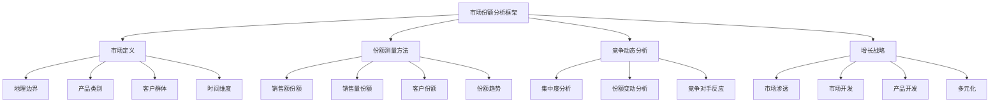
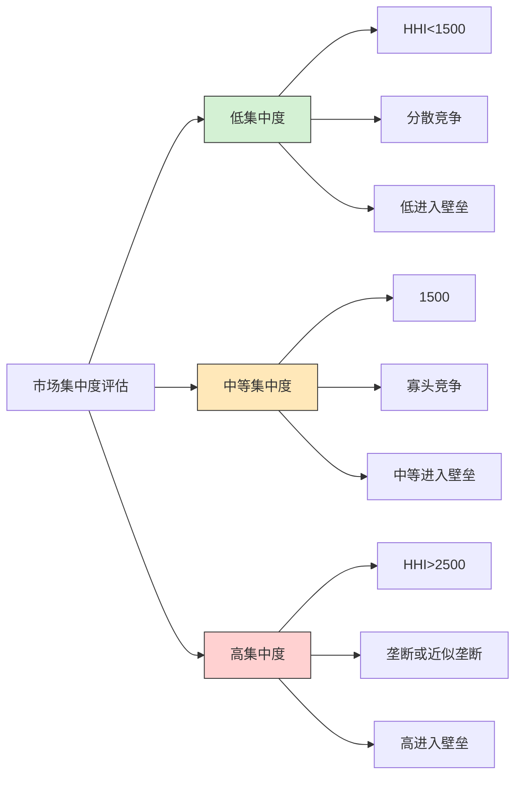
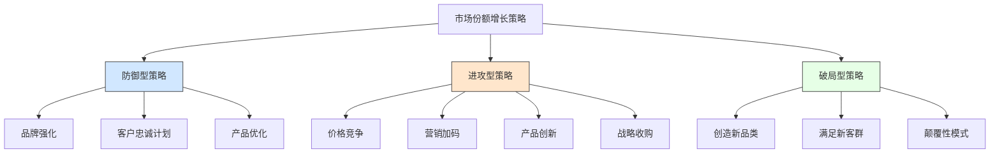

---
{"dg-publish":true,"tags":["商业分析","市场份额","竞争分析","增长策略","市场测量"],"创建日期":"2024-05-15","permalink":"/知识共享/002_商业分析/01_学习内容/04_市场与竞争分析/4.7 市场份额分析/","dgPassFrontmatter":true}
---

## 基础知识

### 市场份额的定义

市场份额是指特定企业或产品在其所在市场中所占的销售比例，通常以百分比表示。它是评估企业竞争地位和市场表现的关键指标。

市场份额可以从不同维度进行定义和测量：
- **销售收入份额**：企业销售收入占市场总销售收入的比例
- **销售量份额**：企业销售量（单位数）占市场总销售量的比例
- **客户份额**：企业客户数量占市场总客户数的比例
- **心智份额**：消费者心目中品牌的认知度和偏好程度

不同权威机构对市场份额的定义存在一些细微差别：
- **波士顿咨询集团(BCG)**：将相对市场份额作为衡量业务竞争地位的关键指标
- **市场研究机构Gartner**：强调市场份额应结合市场增长率一起考量
- **波特(Porter)**：认为市场份额是竞争优势的直接表现，但并非全部

### 市场份额的重要性

市场份额分析在商业战略中具有以下重要意义：

1. **竞争地位评估**：反映企业相对于竞争对手的市场地位
2. **规模经济**：更高的市场份额通常带来成本优势和规模经济
3. **盈利能力**：研究表明市场份额与盈利能力通常呈正相关
4. **战略决策依据**：为产品线拓展、市场投入等战略决策提供依据
5. **品牌影响力**：较高的市场份额往往对应更强的品牌知名度和影响力
6. **谈判能力**：对供应商和分销渠道的议价能力增强

### 市场份额的历史演变

市场份额作为分析指标的历史演变：

- **1950-1960年代**：市场份额概念开始在商业分析中普及，被视为衡量企业成功的关键指标
- **1970年代**：PIMS(Profit Impact of Market Strategy)研究确立了市场份额与盈利能力之间的关联
- **1980年代**：BCG矩阵等战略工具将市场份额作为核心维度之一
- **1990-2000年代**：随着客户关系管理兴起，"客户份额"概念补充了传统市场份额
- **2000年代至今**：数字化时代，市场份额测量维度扩展到线上渠道、社交媒体影响力等

## 理论框架

### 市场份额分析的理论基础

#### 市场份额的测量方法

1. **绝对市场份额**：企业销售额/总市场销售额 × 100%
   - 优点：直观反映企业在整体市场中的地位
   - 局限：对市场规模定义敏感

2. **相对市场份额**：企业销售额/最大竞争对手销售额
   - 优点：反映相对竞争优势
   - 局限：忽略了市场的整体结构

3. **服务市场份额**：企业销售额/企业实际覆盖的目标市场销售额 × 100%
   - 优点：考虑企业实际能触及的市场
   - 局限：目标市场界定存在主观性

4. **份额变动分析**：(本期市场份额 - 上期市场份额)/上期市场份额 × 100%
   - 优点：动态反映市场地位变化
   - 局限：需要连续数据支持

### 市场集中度分析

市场集中度是评估市场竞争程度的重要工具，常用指标包括：

1. **CR指数(Concentration Ratio)**：
   - CR4：前四大企业市场份额总和
   - CR8：前八大企业市场份额总和
   - 通常CR4>80%被视为高度集中市场

2. **赫芬达尔-赫希曼指数(HHI)**：
   - 计算方法：所有企业市场份额平方和
   - 指标范围：0-10000（垄断市场）
   - 美国司法部标准：
     * HHI < 1500：竞争市场
     * 1500 < HHI < 2500：适度集中
     * HHI > 2500：高度集中

## 应用指南

### 市场份额分析流程

1. **明确市场边界**
   - 确定产品/服务类别范围
   - 界定地理边界
   - 确定时间维度
   - 考虑市场细分因素

2. **收集市场数据**
   - 行业报告与研究数据
   - 零售/分销渠道数据
   - 消费者调研数据
   - 公司财务报告
   - 第三方市场研究机构数据

3. **计算市场份额**
   - 选择适当的测量指标（销售额/销售量/客户数）
   - 计算绝对市场份额
   - 计算相对市场份额
   - 分析时间序列变化

4. **解读结果并形成洞察**
   - 识别市场地位变动趋势
   - 分析竞争对手表现
   - 评估市场集中度
   - 识别增长机会和威胁

### 市场份额数据收集方法

1. **内部数据来源**
   - 销售记录和财务数据
   - CRM系统客户数据
   - 渠道销售报告
   - 销售团队市场情报

2. **外部数据来源**
   - 行业协会报告
   - 市场调研公司（如Nielsen, IRI, Gartner, IDC）
   - 政府统计数据
   - 公司年报和投资者简报
   - 商业数据库（如Bloomberg, S&P Global）

3. **数据收集注意事项**
   - 确保数据定义一致性
   - 核对不同来源数据
   - 考虑季节性因素
   - 关注数据收集周期和时效性
   - 评估数据可靠性和代表性

### 市场份额增长策略

1. **防御型策略**（保持现有市场份额）
   - 提高客户满意度和忠诚度
   - 强化核心产品/服务优势
   - 设置竞争壁垒
   - 优化成本结构，提供更具竞争力的价格
   - 提高品牌忠诚度

2. **进攻型策略**（提高市场份额）
   - 市场渗透：增加现有客户购买频率和使用量
   - 竞争性定价策略
   - 提高营销投入和品牌曝光
   - 产品创新和差异化
   - 收购竞争对手或互补业务
   - 建立战略联盟和合作关系

3. **破局型策略**（创造新市场空间）
   - 开发蓝海市场（未被满足的客户需求）
   - 颠覆性创新
   - 新商业模式开发
   - 重新定义市场边界

## 案例分析

### 案例1：智能手机市场份额战争

**背景**:
2007-2022年间，全球智能手机市场经历了多次市场份额变动

**关键战略与转折点**:
- **苹果(iPhone)**：通过创新产品定义新品类，从零市场份额迅速增长
  - 战略：产品创新、生态系统构建、高端定位
  - 结果：稳定维持15-20%全球市场份额，但占据大部分行业利润

- **三星**：从追随者到全球第一
  - 战略：全线产品覆盖、大规模营销投入、供应链整合
  - 结果：市场份额从2009年的3%增长至峰值28%

- **华为**：快速崛起与挑战
  - 战略：技术投入、产品差异化、全球化扩张
  - 结果：市场份额从2015年的7%增长至2019年的20%，后因外部因素下滑

- **小米**：互联网模式颠覆传统
  - 战略：高性价比、轻资产模式、互联网营销
  - 结果：在新兴市场快速获取份额，全球份额从2015年的5%增长至2022年的14%

**关键教训**:
- 高端市场份额与利润份额并不完全对应
- 市场份额可通过多种战略路径获取（产品创新vs价格优势）
- 外部因素（如地缘政治）可能对市场份额产生显著影响
- 差异化定位对维持市场份额至关重要

### 案例2：可口可乐与百事可乐的市场份额之争

**背景**:
长达数十年的两大碳酸饮料巨头市场份额竞争

**市场份额策略对比**:
- **可口可乐**：
  - 战略：全球一致品牌形象、品牌投资、广泛分销网络
  - 市场份额防御：积极应对竞争挑战，品牌扩张（Diet Coke/Zero等）
  - 结果：维持全球约45%市场份额领先地位

- **百事可乐**：
  - 战略："挑战者"品牌定位、年轻人群体聚焦、多元化产品组合
  - 市场份额挑战："百事挑战"营销活动、体育营销、创新产品线
  - 结果：全球约30%市场份额，在某些区域市场实现领先

**竞争动态与启示**:
- 市场份额之争推动了整个行业创新
- 不同细分市场采取差异化战略的重要性
- 市场份额战略需随消费者偏好变化而调整
- 多品牌战略对防御市场份额的有效性

### 案例3：电动汽车市场中特斯拉的市场份额策略

**背景**:
特斯拉如何在传统汽车制造商主导的行业创造并占据电动汽车市场份额

**市场份额获取策略**:
- 重新定义市场边界（从"电动汽车"到"高性能、科技汽车"）
- 从高端市场切入，逐步向下延伸（Roadster→Model S/X→Model 3/Y）
- 垂直整合供应链，控制关键技术（电池、自动驾驶）
- 建立独特销售模式（直销）和充电基础设施

**成效与挑战**:
- 成功：从零开始创建新品类并获得主导地位（全球电动车市场20%份额）
- 挑战：传统车企大规模进入造成市场份额压力
- 应对：持续技术创新、扩大规模经济、品牌忠诚度建设

**市场份额洞察**:
- 在新兴市场中，先发优势对建立市场份额至关重要
- 技术领先可转化为持久的市场份额优势
- 市场教育对创造新品类市场份额的关键作用
- 规模经济对维持市场份额的重要性

### 案例4：视频流媒体服务的市场份额竞争

**背景**:
Netflix、Disney+、Amazon Prime、Hulu等平台的订阅用户市场份额竞争

**市场份额策略分析**:
- **Netflix**：
  - 先发优势战略：率先转型流媒体，建立用户基础
  - 内容投资战略：大规模原创内容生产
  - 结果：市场份额从2016年的80%下降至2022年的45%，但保持领先

- **Disney+**：
  - 内容库策略：利用强大IP库快速获取市场份额
  - 捆绑策略：与其他Disney服务捆绑提供
  - 结果：两年内获得15%市场份额，成为最快增长的竞争者

- **Amazon Prime Video**：
  - 生态系统策略：将视频服务作为Prime会员福利的一部分
  - 结果：稳定获取约15%市场份额，同时强化电商核心业务

**市场份额分配变化趋势**:
- 从单一主导向多极化市场结构转变
- 用户重叠订阅现象增加（多平台并用）
- 区域市场份额分布与全球分布存在显著差异

**启示**:
- 内容是流媒体服务市场份额的关键驱动因素
- 市场份额分散化是数字内容服务的普遍趋势
- 生态系统整合可支持市场份额增长
- 用户体验对维持市场份额的重要性

### 案例5：快时尚零售商的市场份额竞争

**背景**:
Zara、H&M、优衣库等快时尚品牌的全球市场份额竞争

**市场份额战略比较**:
- **Zara (Inditex)**：
  - 速度策略：极短的产品上市周期（设计到店面2-3周）
  - 稀缺性策略：小批量、频繁上新，创造"现在买或错过"心理
  - 结果：获得约12%全球市场份额，高于平均行业利润率

- **H&M**：
  - 规模策略：大批量生产降低成本
  - 设计师合作策略：限量设计师合作系列创造话题
  - 结果：约8-10%全球市场份额，但利润率受压

- **优衣库(Uniqlo)**：
  - 功能性基本款策略：专注高质量基础服装
  - 材料创新策略：HeatTech、AIRism等功能性材料
  - 结果：在亚洲市场份额领先，全球约6-7%市场份额但增长迅速

**关键发现**:
- 供应链效率是快时尚市场份额竞争的关键因素
- 不同地区市场份额分布差异显著
- 线上渠道对市场份额增长的重要性日益提高
- 可持续发展趋势对传统市场份额策略构成挑战

## 延伸内容

### 市场份额与其他商业指标的关系

1. **市场份额与盈利能力**
   - PIMS研究：市场份额每增加10个百分点，ROI平均增加5个百分点
   - 高市场份额通常带来规模经济、经验曲线效应和市场影响力
   - 例外情况：追求市场份额导致的过度价格竞争可能损害盈利

2. **市场份额与客户满意度**
   - 客户满意度与市场份额正相关但存在滞后效应
   - 高满意度可能预示未来市场份额增长
   - 负面口碑会加速市场份额流失

3. **市场份额与品牌价值**
   - 品牌强度对市场份额的支撑作用
   - 市场份额在特定条件下可转化为品牌溢价能力
   - 高市场份额不一定等同于高品牌价值（尤其在低差异化产品中）

### 数字时代的市场份额测量变革

1. **跨渠道市场份额整合**
   - 线上与线下渠道数据整合方法
   - 全渠道市场份额衡量技术
   - 数据源整合与匹配挑战

2. **新兴市场份额概念**
   - 注意力份额(Share of Attention)：媒体与内容消费中的品牌曝光比例
   - 钱包份额(Share of Wallet)：获取客户总支出中的比例
   - 声量份额(Share of Voice)：在行业讨论中的提及比例
   - 参与度份额(Share of Engagement)：社交媒体互动中的比例

3. **实时市场份额监测**
   - 数字工具与API数据采集
   - 市场份额仪表盘设计
   - 预警系统与响应机制设计

### 不同行业市场份额特性比较

| 行业 | 市场集中度 | 份额变动频率 | 关键驱动因素 | 测量挑战 |
|------|------------|--------------|--------------|----------|
| 快消品 | 中-高 | 中等 | 分销渠道、广告、价格 | 渠道数据不完整 |
| 科技硬件 | 高 | 高 | 创新、生态系统、规模 | 产品定义边界 |
| 金融服务 | 高 | 低 | 监管、信任、便利性 | 产品复杂性 |
| 零售业 | 中 | 中等 | 位置、价格、体验 | 多业态比较 |
| 制药业 | 特定治疗领域高 | 专利周期相关 | 研发、专利、营销 | 药品分类问题 |
| 航空业 | 区域高、全球中 | 低 | 航线、价格、服务 | 路线定义问题 |

### 市场份额战略的区域差异

1. **成熟市场(欧美日)市场份额策略**
   - 以维持市场份额为主
   - 强调差异化与创新
   - 重视客户保留与忠诚度
   - 对价格竞争较为谨慎

2. **新兴市场市场份额策略**
   - 积极扩张市场份额
   - 价格敏感性高，强调性价比
   - 强调渠道覆盖与可及性
   - 区域本土化适应策略重要

3. **全球化企业的市场份额管理**
   - 全球与本地市场份额目标平衡
   - 资源在不同区域市场的战略分配
   - 区域差异化产品与统一品牌策略
   - 跨区域协同效应与竞争优势转移

## 学习资源

### 思考与自测问题

1. 为什么市场份额的定义对其测量结果有如此重要的影响？请举例说明。

2. 在什么情况下，企业应优先考虑市场份额增长而非利润增长？又在什么情况下应采取相反策略？

3. 分析相对市场份额和绝对市场份额在战略决策中的不同应用场景。

4. 在寡头垄断市场中，市场份额战略与完全竞争市场有何不同？为什么？

5. 高市场份额是否总是能带来更高的盈利能力？请结合实例分析其中的关系。

6. 评估数字化转型如何改变了企业获取和维护市场份额的战略。

7. 比较产品创新和营销投入在市场份额增长中的相对重要性。

8. 如何判断一个企业是否过度关注市场份额而忽视了其他重要指标？

9. 分析市场领导者、挑战者、追随者和利基玩家的市场份额战略差异。

10. 评估新进入者在高度集中的市场中获取市场份额的可行策略。

11. 当市场定义发生变化（如技术迭代导致的品类重定义）时，企业应如何调整市场份额策略？

12. 为什么有些行业的市场份额分布相对稳定，而有些则波动较大？这反映了哪些行业特性？

13. 分析网络效应对数字平台市场份额竞争的影响。

14. 在市场萎缩的情况下，市场份额增长是否仍具有战略意义？为什么？

15. 评估并购作为市场份额增长策略的优势和潜在风险。

### 实践练习

**练习1：市场份额分析报告**

任务：选择一个您熟悉的行业，完成一份市场份额分析报告

步骤：
1. 收集该行业主要竞争者的市场份额数据（近3-5年）
2. 分析市场份额变动趋势及可能原因
3. 评估市场集中度及其变化
4. 识别市场份额领导者采取的关键策略
5. 预测未来2-3年的市场份额变动趋势
6. 提出一家中型竞争者的市场份额增长建议

交付物：
- 市场份额数据表
- 市场份额变动趋势图
- 竞争者策略分析
- 市场份额预测
- 战略建议

**练习2：市场份额增长策略规划**

任务：为一家市场份额10%（行业第四位）的企业设计市场份额增长计划

步骤：
1. 设定合理的市场份额目标（短期1年、中期3年）
2. 评估目前市场份额限制因素
3. 设计针对性的市场份额增长策略
4. 制定具体行动计划（包括营销、产品、渠道等方面）
5. 提出市场份额监测与调整机制
6. 分析潜在风险与应对措施

交付物：
- 市场份额SWOT分析
- 市场份额目标设定文档
- 市场份额增长战略地图
- 具体执行计划时间表
- 投资回报预测

### 延伸学习资源

**书籍推荐**：
1. 《竞争战略》(Competitive Strategy) - 迈克尔·波特
2. 《市场营销管理》(Marketing Management) - 菲利普·科特勒
3. 《商业模式新生代》(Business Model Generation) - 亚历山大·奥斯特瓦德
4. 《增长黑客》(Growth Hacker Marketing) - 瑞安·霍利迪
5. 《蓝海战略》(Blue Ocean Strategy) - W. 钱·金、勒妮·莫博涅

**研究报告与学术论文**：
1. PIMS项目研究报告：市场份额与盈利能力关系研究
2. McKinsey Quarterly: "The Power of Market Share"
3. Harvard Business Review: "Marketing Myopia" - Theodore Levitt
4. Journal of Marketing: "Market Share and ROI: Observing the Effect of Unobserved Variables"
5. Strategic Management Journal: "First-Mover Advantages and Market Share Dynamics"

**在线资源**：
1. Gartner市场份额分析报告 (https://www.gartner.com/en/research/methodologies/market-share-analysis)
2. Statista行业市场份额数据库 (https://www.statista.com)
3. BCG战略研究报告 (https://www.bcg.com/publications/collections/strategy)
4. Nielsen零售测量服务 (https://www.nielsen.com/solutions/measurement/)
5. IDC科技行业市场份额追踪 (https://www.idc.com/promo/trackers)

**工具与模板**：
1. 市场份额分析Excel模板
2. 竞争对手市场份额跟踪仪表盘
3. 市场集中度计算工具
4. 市场份额变动分析图表模板
5. 市场份额预测建模工具 