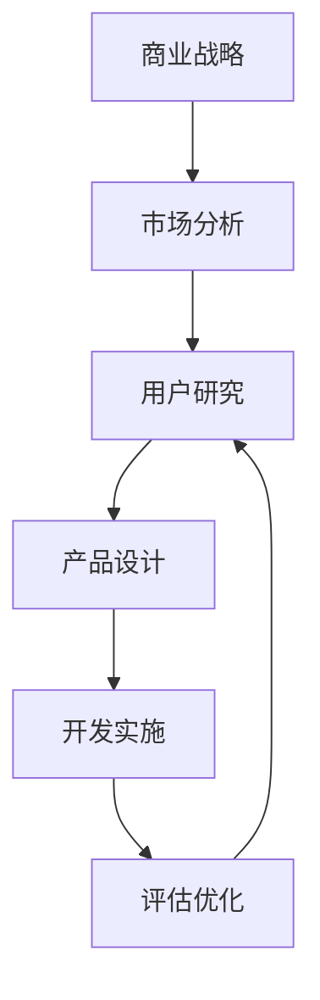
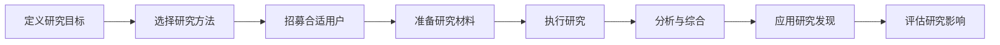

---
{"dg-publish":true,"tags":["商业分析","用户研究","调研方法","用户洞察"],"创建日期":"2024-07-15","permalink":"/知识共享/002_商业分析/01_学习内容/05_用户与需求分析/5.1 用户研究方法/","dgPassFrontmatter":true}
---

# 用户研究方法

## 用户研究概述

### 用户研究的定义与价值

用户研究是系统地收集和分析用户相关数据，以了解用户行为、需求、动机和痛点的过程。它是产品开发、服务设计和商业决策的基础。

**核心价值**：
- **降低风险**：减少基于假设决策的风险，避免开发用户不需要的产品
- **提高针对性**：确保产品和服务真正满足用户需求
- **优化体验**：发现并解决用户痛点，提升用户满意度
- **创新机会**：识别未被满足的需求和市场机会
- **提高效率**：减少返工和修改，节省开发成本和时间

### 用户研究在商业分析中的位置

用户研究是连接市场洞察和产品开发的桥梁，在商业分析中处于核心位置。

**与其他分析领域的关系**：
- **与市场分析的区别**：市场分析关注宏观趋势和总体需求，用户研究聚焦具体用户群体的深入理解
- **与竞争分析的互补**：用户研究帮助理解为什么用户选择特定产品或服务
- **与产品分析的衔接**：用户研究的结果直接指导产品功能和设计决策

### 用户研究的适用范围

用户研究可应用于产品生命周期的各个阶段，适用范围广泛：

**新产品开发**：
- 发现市场机会和用户未满足需求
- 验证产品概念和价值主张
- 测试原型和交互设计

**现有产品优化**：
- 发现用户痛点和体验问题
- 评估功能使用情况和满意度
- 识别改进方向和优先级

**营销和销售策略**：
- 了解用户决策过程和影响因素
- 测试消息传达和价值主张
- 优化用户获取和转化漏斗

**品牌发展**：
- 深入理解用户对品牌的感知
- 评估品牌体验和忠诚度
- 识别品牌差异化机会

## 用户研究方法分类

### 定性研究方法

定性研究方法侧重于深入理解用户的内在动机、态度和行为背后的原因，通常基于小样本的深度研究。

#### 一对一访谈

**定义**：通过与单个用户的深度对话，获取对其观点、经历和行为的详细了解。

**适用场景**：
- 需要深入理解用户思维模式和决策过程
- 探索敏感话题或复杂问题
- 获取针对具体产品或服务的详细反馈

**关键步骤**：
1. 确定研究目标和关键问题
2. 筛选合适的受访者
3. 设计访谈指南和问题
4. 执行访谈并记录
5. 分析和总结发现

**优势与局限**：
- **优势**：深度洞察、灵活性高、可探索意想不到的方向
- **局限**：耗时、样本量小、可能存在访谈者偏见

#### 焦点小组

**定义**：组织6-10名用户参与有主持人引导的小组讨论，探讨特定主题或问题。

**适用场景**：
- 收集对产品概念或营销信息的集体反应
- 了解不同用户群体的共识和分歧
- 激发创意和解决方案

**实施方法**：
1. 确定研究目标和讨论议题
2. 招募代表目标用户群体的参与者
3. 设计讨论指南和活动
4. 专业主持人引导讨论
5. 分析讨论内容和互动动态

**优势与局限**：
- **优势**：可观察用户互动、获取多元视角、效率较高
- **局限**：群体思维风险、强势个体可能主导讨论、深度不如一对一访谈

#### 实地观察/民族志研究

**定义**：在用户自然环境中观察他们的行为和互动，不干扰其正常活动。

**适用场景**：
- 了解用户在实际环境中如何使用产品
- 发现用户未明确表达的需求和行为模式
- 验证自我报告行为与实际行为的差异

**实施方法**：
1. 确定观察环境和重点
2. 获取必要的许可和访问权限
3. 设计观察框架和记录方式
4. 执行观察并记录细节
5. 分析观察发现和环境因素

**优势与局限**：
- **优势**：获取真实行为数据、发现未预期的洞察、环境背景丰富
- **局限**：耗时、获取许可困难、数据解读主观性

### 定量研究方法

定量研究方法关注可测量的数据和统计分析，通常基于大样本进行，提供可量化和可比较的结果。

#### 问卷调查

**定义**：通过结构化问题集向大量用户收集数据，可包括封闭式和开放式问题。

**适用场景**：
- 验证从定性研究中获得的假设
- 测量特定行为、态度或偏好的普遍性
- 比较不同用户群体的差异

**设计原则**：
1. 明确调查目标和所需信息
2. 设计简洁、明确的问题
3. 使用适当的问题类型(单选、多选、量表等)
4. 合理安排问题顺序和调查长度
5. 进行预测试和调整

**分析方法**：
- 描述性统计(频率、平均值、标准差)
- 交叉分析(不同人口统计学特征的比较)
- 相关性和回归分析(变量间关系)

**优势与局限**：
- **优势**：大样本量、统计可靠性、易于量化和比较
- **局限**：缺乏深度、无法探索原因、回答可能不真实

#### 用户测试

**定义**：观察用户完成特定任务的过程，评估产品使用体验和可用性。

**测试类型**：
- **可用性测试**：评估产品易用性和功能有效性
- **A/B测试**：比较两个或多个设计方案的效果
- **多变量测试**：同时测试多个变量组合的效果

**实施步骤**：
1. 确定测试目标和任务
2. 招募代表目标用户的测试者
3. 创建测试环境和场景
4. 执行测试并收集数据
5. 分析结果并提出改进建议

**关键指标**：
- 任务完成率和时间
- 错误率和类型
- 用户满意度评分
- 问题严重程度评估

**优势与局限**：
- **优势**：直接观察用户与产品互动、发现具体问题、提供明确改进方向
- **局限**：测试环境人工性、用户行为可能不自然、需要专业设备和环境

#### 网站/应用分析

**定义**：收集和分析用户在数字产品上的行为数据，了解用户如何实际使用产品。

**常见指标**：
- **流量指标**：访问量、页面浏览量、停留时间
- **行为指标**：点击路径、特性使用频率、搜索查询
- **转化指标**：注册率、购买率、放弃率
- **参与指标**：回访频率、活跃度、内容互动

**分析工具**：
- Google Analytics/Firebase
- Mixpanel
- Hotjar
- Amplitude
- Pendo

**应用方式**：
1. 设置关键指标和目标
2. 实施适当的跟踪代码
3. 建立报告和仪表板
4. 定期分析数据趋势和异常
5. 结合定性研究解释数据背后的原因

**优势与局限**：
- **优势**：大规模真实数据、实时监控、可发现行为模式
- **局限**：只显示"做了什么"而非"为什么"、隐私考量、需要专业解读

### 混合研究方法

结合定性和定量方法的混合研究策略，平衡深度洞察和统计可靠性。

#### 日记研究

**定义**：请用户在一段时间内记录特定活动、感受或经历，提供纵向数据。

**适用场景**：
- 了解随时间变化的用户行为和态度
- 捕捉特定情境下的用户体验
- 追踪长期使用模式和习惯

**实施方法**：
1. 明确记录内容和格式(文字、照片、视频)
2. 设计简单的记录工具或平台
3. 提供明确的指导和提醒
4. 定期检查和鼓励完成
5. 结合定量分析和定性解读

**优势与局限**：
- **优势**：捕捉实时体验、减少回忆偏差、提供情境数据
- **局限**：参与者负担大、数据完整性依赖用户投入、分析复杂

#### 卡片分类

**定义**：让用户将内容或功能项分类组织，了解用户的心智模型和信息架构偏好。

**适用场景**：
- 设计网站或应用的导航结构
- 理解用户如何组织和分类信息
- 测试现有信息架构的有效性

**实施方法**：
1. 准备代表内容或功能的卡片
2. 招募目标用户参与
3. 指导用户按自己的理解对卡片进行分组
4. 记录分组结果和用户解释
5. 分析模式和共同点

**分析技术**：
- 层次聚类分析
- 相似性矩阵
- 树状图分析

**优势与局限**：
- **优势**：直观展示用户心智模型、结合定量和定性数据、参与门槛低
- **局限**：离开实际使用情境、对抽象概念效果有限

## 用户研究流程与计划

### 用户研究框架

成功的用户研究需要系统性的计划和执行，通常遵循以下框架：

### 研究目标设定

有效的研究目标应具备以下特征：

**SMART原则**：
- **具体(Specific)**：明确想要了解的具体问题
- **可测量(Measurable)**：能够评估是否达成目标
- **可达成(Achievable)**：在资源和时间限制下可实现
- **相关性(Relevant)**：与业务目标和决策相关
- **时限性(Time-bound)**：有明确的时间框架

**典型研究问题类型**：
- **探索性问题**：用户在特定情境下面临哪些挑战？
- **描述性问题**：用户如何完成特定任务？
- **因果性问题**：什么因素影响用户的购买决策？
- **评价性问题**：用户如何评价当前解决方案？

### 用户招募策略

招募合适的研究参与者是获得有价值洞察的关键：

**招募标准制定**：
- 明确目标用户群体特征
- 确定筛选标准(人口统计、行为、态度等)
- 决定样本规模和多样性要求

**招募渠道**：
- 现有客户数据库
- 社交媒体和在线社区
- 专业招募机构
- 员工网络和推荐
- 公共场所拦截

**招募最佳实践**：
- 提供清晰的参与说明和期望
- 设置合理的激励机制
- 考虑多样性和代表性
- 提前确认并发送提醒
- 准备替补参与者

### 研究伦理考量

用户研究必须遵循伦理准则，保护参与者权益：

**核心伦理原则**：
- **知情同意**：参与者充分了解研究目的和数据使用
- **隐私保护**：确保个人数据安全和匿名处理
- **最小伤害**：避免研究对参与者造成不适或风险
- **诚实透明**：不欺骗或误导参与者
- **平等尊重**：尊重所有参与者的意见和贡献

**实践措施**：
- 使用正式的知情同意书
- 明确说明数据保护措施
- 提供退出研究的选项
- 研究后进行适当解释
- 遵循相关法规要求(如GDPR)

## 常见挑战与解决方案

### 研究偏见管理

研究偏见可能影响结果的有效性，需要积极管理：

**常见偏见类型**：
- **确认偏见**：倾向寻找支持已有假设的信息
- **选择偏见**：样本不代表目标人群
- **社会期望偏见**：参与者给出他们认为"正确"的回答
- **主持人偏见**：研究者的提问方式影响回答
- **回忆偏见**：参与者不准确地回忆过去经历

**减少偏见的策略**：
- 使用开放性问题和中性语言
- 多元化研究团队和参与者
- 结合多种研究方法交叉验证
- 使用标准化流程和脚本
- 记录和反思可能的偏见来源

### 资源有限下的研究策略

在时间和预算有限的情况下，仍然可以进行有效的用户研究：

**精简研究方法**：
- **游击式用户测试**：在公共场所进行快速、非正式测试
- **远程研究**：使用视频会议和线上工具减少物理限制
- **自助式研究**：使用自动化工具如无人主持的用户测试
- **现有数据分析**：挖掘已有的客户支持、销售和使用数据
- **启发式评估**：专家基于用户体验原则进行评估

**优先级策略**：
- 优先研究风险最高的假设
- 关注即将做决策的领域
- 在产品开发早期投入更多研究资源
- 建立可重用的研究资产和流程

### 研究结果沟通与应用

研究发现需要有效沟通，才能影响决策和行动：

**有效沟通策略**：
- 根据受众调整呈现方式和深度
- 使用视觉辅助(图表、视频、引用)增强理解
- 将发现与业务目标和KPI关联
- 提供具体、可操作的建议
- 创建引人入胜的叙事和案例

**促进应用的方法**：
- 举办研究发现工作坊
- 创建用户洞察资料库
- 建立定期更新和分享机制
- 展示研究影响的成功案例
- 邀请决策者参与研究过程

## 自我评估与实践

### 知识检查

1. 什么是用户研究，它与市场研究有何区别？
2. 列举三种定性用户研究方法及其适用场景。
3. 解释焦点小组和一对一访谈各自的优势和局限性。
4. 什么情况下应该选择定量研究方法而非定性方法？
5. 描述用户研究过程的主要步骤。
6. 如何确保用户研究的参与者具有代表性？
7. 列举可能影响用户研究有效性的三种偏见。
8. 如何在有限资源条件下进行有效的用户研究？
9. 为什么研究伦理在用户研究中很重要？
10. 如何有效地向利益相关者传达研究发现？

### 实践项目：电子商务网站用户研究

**项目背景**：
你是一家中型电子商务网站的商业分析师，网站销售家居产品。数据显示网站的购物车放弃率高于行业平均水平，管理层希望了解原因并改进结账流程。

**任务**：
1. 设计一个综合用户研究计划，包括:
   - 研究目标和关键问题
   - 选择合适的研究方法组合
   - 参与者招募标准和策略
   - 研究材料和工具准备
   - 时间和资源规划

2. 创建以下研究材料:
   - 用户访谈指南(10-12个问题)
   - 在线调查问卷(15-20个问题)
   - 用户任务测试场景和评估标准

3. 概述研究数据分析计划:
   - 关键指标和分析方法
   - 不同数据源的整合策略
   - 预期的研究输出和格式

**评估标准**:
- 研究计划的全面性和针对性
- 研究方法选择的合理性
- 研究材料的质量和有效性
- 分析计划的系统性和可行性
- 对商业目标的关注度

## 参考资源

### 推荐书籍
- 《用户体验要素》，Jesse James Garrett著
- 《用户调查实战指南》，Erika Hall著
- 《不要让我思考》，Steve Krug著
- 《定性研究：设计与实施》，Catherine Marshall著
- 《用户故事地图》，Jeff Patton著

### 在线资源
- Nielsen Norman Group (www.nngroup.com)
- User Research Weekly (newsletter)
- Interaction Design Foundation (www.interaction-design.org)
- UX Collective (uxdesign.cc)
- UXR Collective (medium.com/uxr-collective)

### 工具资源
- 调查工具: SurveyMonkey, Typeform, Google Forms
- 用户测试平台: UserTesting, Lookback, Maze
- 招募工具: UserInterviews, Respondent
- 分析工具: Dovetail, NVivo, ATLAS.ti
- 远程研究工具: Zoom, Miro, Optimal Workshop 