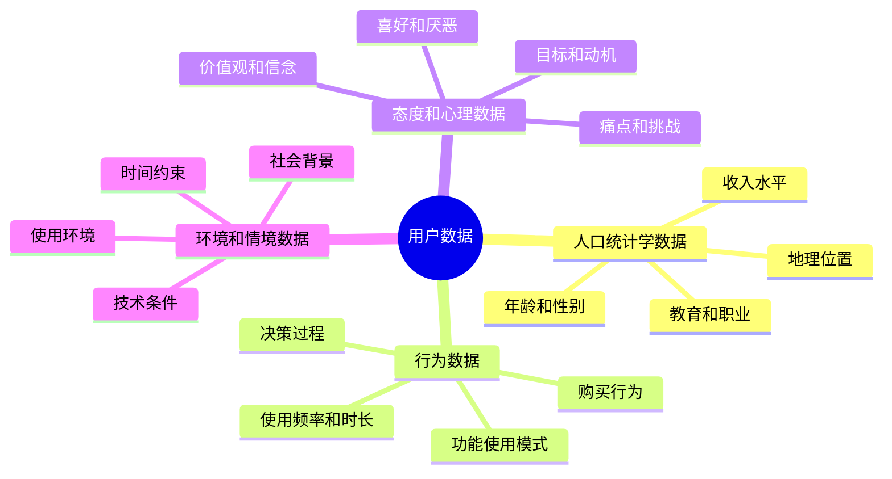

---
{"dg-publish":true,"tags":["商业分析","用户画像","人物角色","需求分析"],"创建日期":"2024-07-15","permalink":"/知识共享/002_商业分析/01_学习内容/05_用户与需求分析/5.2 用户画像构建/","dgPassFrontmatter":true}
---


# 用户画像构建

## 用户画像概述

### 用户画像的定义与价值

用户画像(User Persona)是对目标用户群体的半虚构性代表，它基于真实数据和研究，以生动、具体的人物形象呈现用户的特征、行为模式、动机和需求。

**核心价值**：
- **创造共识**：为团队提供统一的用户认知，确保以用户为中心
- **引导决策**：帮助做出基于用户需求的设计和业务决策
- **简化沟通**：将抽象的用户数据转化为具体、可理解的形象
- **增强同理心**：帮助团队从用户视角思考问题
- **优先级判断**：评估功能和改进对不同用户群体的价值

### 用户画像的类型

根据用途和范围，用户画像可分为多种类型：

**按深度划分**：
- **简略画像(Lightweight Personas)**：包含基本人口统计学和行为特征，适合快速项目
- **完整画像(Comprehensive Personas)**：包含详细背景、目标、行为和态度，适合长期产品开发
- **情境画像(Contextual Personas)**：聚焦特定使用场景或任务的用户特征

**按功能划分**：
- **目标导向画像(Goal-directed Personas)**：强调用户目标和动机
- **角色导向画像(Role-based Personas)**：基于用户在组织或环境中的角色
- **参与度画像(Engagement Personas)**：关注用户与产品互动的频率和方式
- **购买者画像(Buyer Personas)**：专注购买决策过程和影响因素

**按来源划分**：
- **数据驱动画像**：基于大量定量和定性研究数据
- **假设性画像**：基于团队经验和市场假设，后续通过数据验证
- **融合画像**：结合现有数据和合理假设，随研究深入逐步完善

### 优秀用户画像的特征

有效的用户画像应具备以下关键特征：

**基于研究**：
- 建立在真实用户数据和研究基础上，而非纯粹假设
- 整合定量数据(确保代表性)和定性洞察(提供深度)
- 随着新研究和数据不断更新和完善

**具体且生动**：
- 使用特定而非泛泛的描述("每周在手机上看5小时视频"而非"经常看视频")
- 包含足够细节使人物形象栩栩如生
- 避免过度详细的无关信息导致分心

**真实且可信**：
- 反映真实世界的用户特征和行为
- 包含用户的优势和劣势、偏好和厌恶
- 避免理想化或过度简化真实用户

**有用且可操作**：
- 直接关联产品决策和设计选择
- 提供具体情境下的用户反应预测
- 能够指导产品功能优先级和设计决策

## 用户画像构建流程

### 用户研究与数据收集

构建有效用户画像的第一步是收集充分、多元的用户数据：

**关键数据类型**：



**数据收集方法**：
- **定性方法**：用户访谈、观察研究、焦点小组、日记研究
- **定量方法**：调查问卷、网站分析、使用数据、市场研究
- **内部数据**：客服记录、销售数据、CRM数据、支持请求
- **外部数据**：行业报告、社交媒体分析、竞争对手用户研究

**数据收集最佳实践**：
- 针对不同用户群体使用多种研究方法
- 关注用户言行不一致的地方(说什么vs做什么)
- 收集足够样本以确保代表性
- 关注极端用户和边缘案例，而非仅看平均值
- 记录直接引用和具体案例，增加生动性

### 数据分析与用户分群

收集数据后，需要进行系统分析，识别模式和分群：

**分析技术**：
- **亲和图分析(Affinity Mapping)**：对定性数据进行主题分类和模式识别
- **聚类分析(Cluster Analysis)**：基于相似特征将用户分组
- **因子分析(Factor Analysis)**：识别影响用户行为的关键因素
- **分段分析(Segmentation Analysis)**：基于关键变量划分用户群体
- **行为模式分析(Behavioral Pattern Analysis)**：识别重复出现的行为序列

**用户分群原则**：
- 基于与产品目标相关的区分性特征
- 确保群体内部同质性和群体间差异性
- 避免过多分群导致复杂性(通常3-5个主要画像为宜)
- 关注现在和未来的高价值用户群体
- 考虑商业目标和战略优先级

**分群变量选择**：
- **主要变量**：直接影响产品使用的关键特征(如使用目标、技能水平)
- **次要变量**：提供背景但影响较小的特征(如年龄、职业)
- **排除变量**：与产品使用无关的特征(通常避免使用收入、种族等敏感变量，除非直接相关)

### 用户画像构建步骤

确定用户分群后，开始构建具体的用户画像：

**步骤1：确定画像框架**
- 决定画像类型和详细程度
- 确定需要包含的关键元素
- 设计画像模板和格式

**步骤2：创建核心人物角色**
- 为每个用户群体指定代表性名字
- 选择或创建代表性照片
- 撰写简短的概述语句

**步骤3：填充基本信息**
- 添加人口统计学特征(年龄、职业等)
- 描述用户背景和日常生活
- 概述技术使用水平和习惯

**步骤4：添加深度内容**
- 详述用户目标、动机和痛点
- 描述与产品相关的行为模式
- 列出关键需求和期望

**步骤5：完善和验证**
- 添加生动的引用和叙述
- 确保内部一致性和可信度
- 与团队和利益相关者验证

### 用户画像模板与要素

有效的用户画像应包含以下关键要素：

**基础要素**：
- **姓名和照片**：创造真实感和记忆点
- **标语/概述**：一句话总结用户特征
- **人口统计信息**：年龄、性别、职业、教育等
- **技术使用偏好**：设备、平台、技术熟练度

**核心要素**：
- **目标和动机**：用户希望实现什么
- **痛点和挑战**：用户面临的困难
- **需求和期望**：用户希望产品提供什么
- **行为模式**：使用习惯和决策过程

**增强要素**：
- **引用语(Quotes)**：代表用户思维的直接引述
- **使用场景**：典型的使用情境描述
- **个性特征**：影响产品使用的性格特点
- **影响因素**：影响决策的关键考量

**实用要素**：
- **品牌态度**：对品牌/产品的感受和看法
- **信息来源**：获取信息的渠道和偏好
- **机会点**：如何更好服务这类用户
- **风险点**：可能导致用户流失的因素

**用户画像模板示例**：

```
# [姓名] 用户画像

![用户照片]

## 一句话描述
[简洁有力的用户特征概述]

## 基本信息
- 年龄: 
- 职业: 
- 教育程度: 
- 家庭状况: 
- 居住地: 

## 技术背景
- 设备使用: 
- 技术熟练度: 
- 常用应用/平台: 

## 目标与动机
- 主要目标: 
- 次要目标: 
- 动机: 

## 痛点与挑战
- 主要痛点: 
- 日常挑战: 
- 担忧: 

## 行为特征
- 使用场景: 
- 使用频率: 
- 决策过程: 
- 影响因素: 

## 个人引述
"[能体现用户特点的原始引述]"

## 机会与风险
- 如何帮助: 
- 可能的阻碍: 
```

## 用户画像应用实践

### 用户画像在产品设计中的应用

用户画像可以指导产品设计的各个阶段：

**需求分析阶段**：
- 从用户视角评估产品需求的价值
- 发现未被满足的用户需求
- 确认设计假设是否符合用户特征

**概念设计阶段**：
- 激发以用户为中心的创意
- 评估不同设计方案对目标用户的适用性
- 围绕用户场景构建用例和故事

**功能开发阶段**：
- 确定功能优先级和开发顺序
- 评估功能复杂度与用户技能的匹配度
- 指导功能细节设计和交互流程

**测试与优化阶段**：
- 设计贴合用户特点的测试场景
- 招募符合用户画像的测试参与者
- 基于画像解读用户反馈和测试结果

**产品迭代阶段**：
- 评估新功能对不同用户群体的价值
- 发现用户需求变化和新兴使用模式
- 引导产品路线图决策

### 用户画像在营销策略中的应用

用户画像可以显著增强营销策略的针对性：

**目标市场定位**：
- 确定最具价值的目标用户群体
- 量化不同细分市场的规模和价值
- 发现潜在的新市场机会

**信息与内容策略**：
- 创建针对特定用户群体的信息
- 选择合适的内容类型和格式
- 调整语言、设计和表现风格

**渠道策略**：
- 确定目标用户的偏好渠道
- 优化各渠道的营销资源分配
- 设计多渠道整合营销策略

**营销活动设计**：
- 创建引发共鸣的营销活动
- 选择适合目标用户的激励措施
- 预测用户对不同营销策略的反应

**客户旅程设计**：
- 规划从认知到购买的用户旅程
- 识别并移除旅程中的摩擦点
- 在关键触点提供个性化体验

### 用户画像在商业决策中的应用

用户画像不仅用于产品和营销，还可指导更广泛的商业决策：

**战略规划**：
- 评估业务方向与用户需求的一致性
- 识别未来市场趋势和用户行为变化
- 支持投资决策和资源分配

**客户服务设计**：
- 为不同用户群体设计差异化服务流程
- 培训客服人员理解不同用户类型
- 预测常见问题和解决方案

**定价与包装决策**：
- 评估不同用户群体的价格敏感度
- 设计符合用户价值认知的定价策略
- 创建针对不同用户需求的产品套餐

**合作与拓展决策**：
- 评估潜在合作伙伴的用户匹配度
- 识别新市场进入机会
- 指导产品线扩展和多元化决策

**组织能力建设**：
- 识别服务目标用户所需的关键能力
- 指导团队组建和技能发展方向
- 建立以用户为中心的组织文化

## 用户画像的高级应用

### 动态用户画像

传统用户画像往往是静态的，而动态用户画像则能适应用户行为和需求的变化：

**动态用户画像的特点**：
- 基于实时数据持续更新
- 反映用户生命周期不同阶段的变化
- 包含情境适应能力和行为预测
- 整合多源数据形成动态视图

**实现方法**：
- 建立用户数据平台整合多渠道数据
- 设计用户生命周期阶段转换触发机制
- 开发自动化分析和画像更新流程
- 建立反映用户变化的预警系统

**应用价值**：
- 提供实时用户洞察支持决策
- 识别用户需求和行为变化趋势
- 支持更精准的个性化策略
- 预测用户未来行为和需求变化

### 定量用户画像

将传统定性画像与定量数据结合，创建更精确的用户模型：

**定量用户画像特点**：
- 基于大规模用户数据构建
- 包含精确的统计指标和行为数据
- 支持数据模拟和预测分析
- 可与业务指标直接关联

**构建方法**：
- 整合用户行为数据、交易数据和调研数据
- 应用统计分析识别关键行为模式
- 建立用户细分模型和转化预测
- 创建可视化仪表板展示关键指标

**应用场景**：
- 精准营销和个性化推荐
- 用户增长模型和生命周期管理
- 产品功能使用分析和优先级确定
- 客户价值评估和忠诚度预测

### 跨文化用户画像

全球化产品需要考虑不同文化背景用户的特殊需求：

**跨文化用户画像考量**：
- 文化价值观和社会规范差异
- 语言和沟通偏好
- 技术使用行为的文化差异
- 决策过程和影响因素的差异

**构建方法**：
- 在多个地区进行本地化用户研究
- 识别文化通用特征和区域特定特征
- 咨询本地专家验证文化洞察
- 测试画像在不同文化环境的适用性

**应用价值**：
- 指导产品本地化和国际化策略
- 避免文化偏见和误解
- 发现特定市场的独特机会
- 提高全球用户体验一致性

## 用户画像的挑战与解决方案

### 常见挑战

构建和应用用户画像时可能面临多种挑战：

**数据挑战**：
- 数据不足或质量问题
- 不同数据源间的冲突
- 用户行为快速变化
- 隐私法规限制数据收集

**方法挑战**：
- 过度简化复杂用户群体
- 团队偏见影响画像客观性
- 画像过度依赖人口统计学特征
- 难以量化画像准确性和有效性

**应用挑战**：
- 画像未被团队广泛采纳使用
- 画像与业务目标脱节
- 过时画像导致错误决策
- 画像过多导致决策复杂化

### 解决策略

针对上述挑战，可采取以下解决策略：

**数据策略**：
- 结合多种数据源互相验证
- 建立持续的数据收集机制
- 明确标记推测性和验证性信息
- 设计符合隐私法规的数据收集方法

**方法策略**：
- 关注行为和需求而非仅看人口统计
- 多元化研究团队减少偏见
- 定期验证画像与真实用户的一致性
- 持续迭代完善画像内容

**应用策略**：
- 创建直观、易理解的画像格式
- 将画像与具体业务指标关联
- 建立定期画像审查和更新机制
- 专注于少量高质量画像而非追求数量

### 评估用户画像有效性

评估用户画像的准确性和价值是持续改进的关键：

**有效性指标**：
- **代表性**：画像是否真实代表目标用户群体
- **可操作性**：画像是否能够指导具体决策
- **共识度**：团队对画像的认同和使用程度
- **预测能力**：画像是否能准确预测用户行为
- **业务影响**：画像驱动决策的商业成果

**评估方法**：
- 将画像预测与实际用户数据对比
- 跟踪基于画像决策的业务成果
- 收集团队对画像实用性的反馈
- 与真实用户验证画像准确性
- 监测画像使用频率和情境

## 案例研究：电子商务平台的用户画像

### 背景与挑战

某电子商务平台面临用户留存率低和转化率下降的问题，决定通过构建详细用户画像来优化产品和营销策略。

**业务目标**：
- 提高活跃用户留存率
- 增加平均订单价值
- 改善用户购物体验
- 优化营销资源分配

**挑战**：
- 用户群体多样，需求差异大
- 缺乏系统性用户研究数据
- 团队对目标用户认知不一致
- 需要快速实施并见到成效

### 研究方法与过程

**数据收集**：
- 分析平台使用数据(3个月，50万用户)
- 进行用户调查(2000名用户)
- 开展深度访谈(20名典型用户)
- 分析客服记录和用户反馈

**数据分析**：
- 使用K-means聚类分析识别用户群体
- 进行RFM(近度、频率、货币价值)分析
- 通过因子分析确定关键影响变量
- 结合定性数据解读行为模式

**用户分群**：
基于分析结果，确定了4个主要用户群体：
1. 高频精打细算型购物者
2. 高端品质追求型购物者
3. 特定需求导向型购物者
4. 休闲探索型购物者

### 用户画像示例

**高频精打细算型用户画像**：

```
# 李梅 (省钱达人)

![30岁女性办公室职员照片]

## 一句话描述
"精明的常客，总在寻找最大性价比，频繁购物但单次金额较小"

## 基本信息
- 年龄: 30岁
- 职业: 行政助理
- 教育程度: 本科
- 家庭状况: 已婚，有1个学龄前儿童
- 居住地: 二线城市市区公寓

## 技术背景
- 设备使用: 主要使用智能手机，有时使用家庭笔记本电脑
- 技术熟练度: 中等，熟悉主流应用和购物平台
- 常用应用: 微信、淘宝、京东、社区团购平台

## 目标与动机
- 主要目标: 在有限预算内购买所需商品，获得最大性价比
- 次要目标: 发现新品和特价商品，积累会员积分和优惠
- 动机: 家庭经济支出控制，享受"淘到好物"的成就感

## 痛点与挑战
- 主要痛点: 价格比较耗时，优惠规则复杂
- 日常挑战: 商品品质参差不齐，难以判断实际价值
- 担忧: 促销陷阱，虚假折扣，售后服务质量

## 行为特征
- 使用场景: 通勤途中，午休时间，晚上孩子睡后
- 使用频率: 每周访问4-5次，平均每月下单3-4次
- 决策过程: 货比三家，查看评论，计算性价比，利用优惠券
- 影响因素: 价格敏感度高，重视用户评价，关注促销活动

## 个人引述
"我总是会检查所有可能的优惠，有时候为了凑单还会计算哪种组合最划算。"
"如果同样的东西能便宜10块钱，我愿意多花5分钟去比较。"

## 机会与风险
- 如何帮助: 提供清晰的价格比较工具，简化优惠规则，推送个性化特价信息
- 可能的阻碍: 复杂的会员体系，不透明的定价，频繁的推送信息
```

**高端品质追求型用户画像**：

```
# 张伟 (品质生活家)

![35岁男性专业人士照片]

## 一句话描述
"注重品质和体验的专业人士，愿意为优质产品支付溢价，购买频率适中但单次价值高"

## 基本信息
- 年龄: 35岁
- 职业: 企业中层管理者
- 教育程度: 硕士
- 家庭状况: 已婚，无子女
- 居住地: 一线城市市中心高档公寓

## 技术背景
- 设备使用: iPhone、iPad、MacBook
- 技术熟练度: 较高，积极尝试新科技产品
- 常用应用: 微信、小红书、知乎、精品电商平台

## 目标与动机
- 主要目标: 购买能提升生活品质的产品和服务
- 次要目标: 发现独特和创新的产品，展示个人品味
- 动机: 追求生活品质，表达个人身份认同

## 痛点与挑战
- 主要痛点: 难以快速找到符合品质标准的产品
- 日常挑战: 产品真伪和品质参差不齐
- 担忧: 时间浪费，伪高端产品，服务不匹配价格

## 行为特征
- 使用场景: 工作间隙，周末休闲时间，旅行前准备
- 使用频率: 每周访问2-3次，平均每月下单1-2次
- 决策过程: 研究品牌背景，查看专业评测，参考同好推荐
- 影响因素: 品牌声誉，产品工艺和材质，售后服务体验

## 个人引述
"我宁可多花些钱买真正有品质的产品，也不想买了之后不到半年就出问题。"
"我需要的不只是产品本身，还有完整的服务体验。"

## 机会与风险
- 如何帮助: 提供详细产品品质信息，优化高端商品发现机制，打造卓越客户服务
- 可能的阻碍: 商品展示不突出品质差异，服务体验不一致，缺乏专业内容
```

### 应用与成效

**产品优化**：
- 根据不同用户画像重新设计首页和分类页
- 为"李梅"类用户开发价格比较工具和优惠提醒
- 为"张伟"类用户创建精品馆和详细品质说明
- 优化购物车和结账流程，减少各类用户的摩擦点

**营销策略调整**：
- 针对不同用户群体设计差异化推送内容
- 为价格敏感型用户优化促销活动结构
- 为品质型用户创建高端品牌故事内容
- 调整广告投放渠道匹配用户画像媒体偏好

**成效**：
- 整体用户留存率提升12%
- 高端用户群体平均订单价值增加23%
- 促销活动转化率提高18%
- 用户满意度评分从3.6提升至4.2(满分5分)

**关键经验**：
- 用户画像需定期更新(本案例每季度更新)
- 画像应与具体业务KPI直接关联
- 全员参与画像讨论提高应用效果
- 数据与直接用户接触相结合最有效

## 自我评估与实践

### 知识检查

1. 用户画像的主要目的和价值是什么？
2. 描述用户画像与市场细分的区别和联系。
3. 一个好的用户画像应包含哪些关键要素？
4. 为什么用户画像需要基于研究而非假设？
5. 如何决定需要构建多少个用户画像？
6. 用户画像如何帮助产品设计决策？
7. 描述用户画像在营销策略中的三种应用。
8. 如何评估用户画像的有效性？
9. 为什么需要定期更新用户画像？
10. 如何避免用户画像中的刻板印象和偏见？

### 实践项目：健康应用用户画像

**项目背景**：
你是一家健康生活方式应用的商业分析师，应用提供健康饮食建议、运动计划和习惯追踪功能。公司计划进行产品升级，需要深入了解用户需求和使用模式。

**任务**：
1. 设计用户研究计划，收集构建用户画像所需的数据
2. 提出2-3个主要用户群体的画像构建方案
3. 为一个主要用户群体创建完整的用户画像，包含所有核心要素
4. 说明如何应用该用户画像指导产品升级和营销决策
5. 设计评估用户画像有效性的方法

**评估标准**：
- 研究计划的全面性和针对性
- 用户群体划分的合理性和差异性
- 用户画像的完整性、具体性和真实性
- 应用方案的实用性和可操作性
- 评估方法的系统性和可行性

## 参考资源

### 推荐书籍
- 《用户画像：以用户为中心的设计》，Alan Cooper著
- 《瞬间之美：Web界面设计如何让用户心动》，Robert Hoekman著
- 《设计沟通》，Erika Hall著
- 《用户原型设计》，Shlomo Goltz著
- 《精益用户体验》，Jeff Gothelf著

### 在线资源
- Nielsen Norman Group: Personas (www.nngroup.com/articles/personas)
- UX Booth: Complete Guide to User Personas
- Interaction Design Foundation: Personas
- Smashing Magazine: User Persona Templates
- UXPressia: Persona Creation Tools

### 工具资源
- UXPressia: 用户画像和客户旅程创建工具
- Xtensio: 用户画像模板
- Smaply: 用户画像和体验地图工具
- Userforge: 简易用户画像创建工具
- Marvel: 原型设计工具中的人物角色功能 