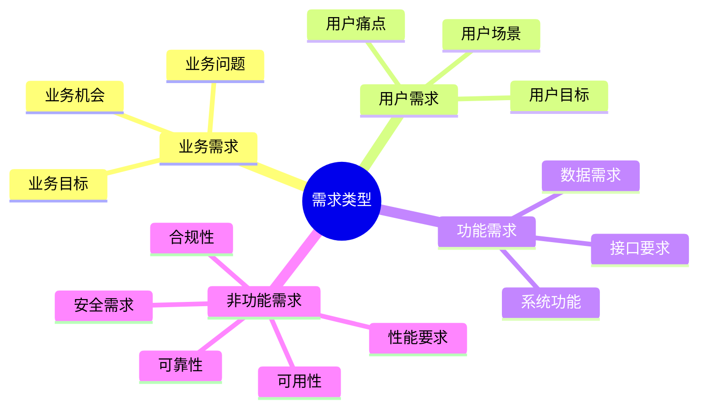

---
{"dg-publish":true,"tags":["商业分析","需求分析","需求捕获","需求管理"],"创建日期":"2024-07-15","permalink":"/知识共享/002_商业分析/01_学习内容/05_用户与需求分析/5.3 需求捕获与分析/","dgPassFrontmatter":true}
---


# 需求捕获与分析

## 需求管理基础

### 需求的定义与分类

需求是指系统、产品或服务应具备的特性或功能，是用户、客户或其他利益相关者的明确或隐含需要。

**需求的基本分类**：



**按层次分类**：
- **战略需求**：与组织战略目标相关的高层次需求
- **战术需求**：实现战略目标所需的中层次需求
- **操作需求**：具体实施层面的详细需求

**按表达方式分类**：
- **明确需求**：清晰表达的需要和期望
- **隐含需求**：未被明确表达但实际存在的需要
- **未知需求**：用户自身也未意识到的潜在需要

### 需求管理生命周期

需求管理是贯穿产品或项目整个生命周期的持续过程：

**需求生命周期阶段**：
1. **需求捕获**：识别并收集各类需求
2. **需求分析**：理解、细化和结构化需求
3. **需求规格化**：记录和正式化需求
4. **需求确认**：与利益相关者验证需求
5. **需求管理**：组织、优先级排序和跟踪需求变更
6. **需求实现**：将需求转化为解决方案
7. **需求验证**：确认解决方案满足需求

**需求文档演进**：
- **初始需求**：概念阶段的高层次需求
- **需求草案**：分析阶段的详细但未确认需求
- **基线需求**：正式确认的需求版本
- **需求变更**：实施过程中的需求调整

### 需求管理的挑战与最佳实践

需求管理面临多种挑战，必须采用系统方法应对：

**常见挑战**：
- 需求不明确或矛盾
- 隐含需求难以捕获
- 需求频繁变更
- 利益相关者观点不一致
- 范围蔓延和需求膨胀

**最佳实践**：
- 建立标准化需求管理流程
- 积极主动的利益相关者参与
- 使用多种需求捕获技术相互补充
- 采用需求跟踪和变更控制机制
- 持续需求优先级管理
- 建立需求与测试用例的对应关系

## 需求捕获技术

### 访谈与研讨会

访谈和研讨会是最常用的需求捕获方法：

**一对一访谈**：
- **适用场景**：深入了解特定利益相关者需求
- **准备工作**：研究背景、准备问题清单、安排合适环境
- **技巧**：
  - 使用开放式问题引导深入讨论
  - 主动倾听并善于追问
  - 控制访谈节奏和范围
  - 记录关键点并确认理解

**需求研讨会**：
- **适用场景**：需要多方协作定义需求
- **组织方法**：
  - 确定明确目标和议程
  - 邀请关键利益相关者参与
  - 准备适当的协作工具
  - 指派专人记录和引导
- **技巧**：
  - 使用结构化活动引导讨论
  - 平衡各方发言机会
  - 及时解决冲突和分歧
  - 形成行动项目和后续步骤

### 观察与用户研究

通过直接观察用户行为获取真实需求：

**实地观察**：
- **方法**：在用户自然工作环境中观察其行为
- **优势**：捕获真实工作流程和痛点
- **技巧**：
  - 减少干扰，尽量保持环境自然
  - 关注异常情况和变通措施
  - 记录环境因素和上下文
  - 结合观察后的用户解释

**任务分析**：
- **定义**：系统地分析用户完成特定任务的步骤和方法
- **步骤**：
  1. 确定关键任务
  2. 分解为具体步骤
  3. 识别每步所需信息和工具
  4. 发现低效或困难环节
- **工具**：任务流程图、步骤分析表

**情境探究**：
- **定义**：通过模拟真实场景，了解用户如何在特定情境中使用产品
- **方法**：
  - 创建典型使用场景
  - 请用户演示或描述解决方案
  - 探讨多种可能的情况和变化

### 问卷与调查

大规模收集需求信息：

**问卷设计技巧**：
- 明确目标并限制长度
- 问题简洁明确，避免引导性表述
- 组合使用开放式和封闭式问题
- 设计合理的问题顺序和逻辑跳转
- 进行小规模测试后再大范围发放

**调查类型**：
- **需求重要性调查**：评估不同需求的相对重要性
- **满意度调查**：评估现有解决方案的满意程度
- **缺口分析调查**：识别期望与现状之间的差距
- **偏好调查**：了解用户对不同解决方案的偏好

**分析方法**：
- 定量分析(频率统计、交叉分析)
- 定性分析(主题编码、模式识别)
- 优先级矩阵(重要性vs满意度)

### 文档分析与竞争对手分析

通过现有资料和竞争对手产品获取需求：

**内部文档分析**：
- **目标文档**：战略计划、流程文档、问题报告、客户反馈
- **方法**：
  - 识别关键主题和频繁提及的问题
  - 提取明确的需求和隐含的期望
  - 分析趋势和模式

**竞争对手分析**：
- **目的**：了解市场标准和差异化机会
- **方法**：
  - 功能比较分析
  - 用户评价和反馈分析
  - 体验测试和对标分析
- **避免陷阱**：不要简单复制功能，而应理解背后的用户需求

### 原型和用户测试

通过可视化和交互获取反馈：

**原型类型**：
- **低保真原型**：简单草图或线框图
- **中保真原型**：包含基本交互但视觉细节有限
- **高保真原型**：接近最终产品的视觉和交互体验

**原型驱动需求捕获流程**：
1. 基于初步需求创建原型
2. 用户测试并收集反馈
3. 细化需求并更新原型
4. 循环迭代直至需求清晰

**用户测试技巧**：
- 设计特定任务检验关键需求
- 鼓励用户"思考出声"
- 观察用户行为而非仅听取意见
- 关注困难点和意外使用方式

## 需求分析方法

### 需求分解与细化

将高层次需求分解为详细的可实现需求：

**分解技术**：
- **功能分解**：按系统功能或能力分解
- **用户旅程分解**：按用户体验流程分解
- **场景分解**：按使用场景或故事分解
- **目标分解**：按目标层次结构分解

**需求细化原则**：
- 每个需求应关注单一功能或属性
- 使用一致的格式和术语
- 避免技术实现细节(除非必要)
- 保持可追溯性至上层需求

**SMART原则检查**：
- **具体(Specific)**：需求表述明确、不含糊
- **可测量(Measurable)**：可以验证是否完成
- **可达成(Achievable)**：技术上可实现
- **相关(Relevant)**：与业务目标相关
- **有时限(Time-bound)**：有明确的时间约束

### 需求优先级排序

在有限资源下决定需求实现顺序：

**常用优先级模型**：
- **MoSCoW模型**：
  - Must have (必须有)
  - Should have (应该有)
  - Could have (可以有)
  - Won't have (此次不做)

- **价值风险模型**：
  - 高价值/低风险：优先实现
  - 高价值/高风险：需深入评估
  - 低价值/低风险：有余力再做
  - 低价值/高风险：通常避免

**优先级评估因素**：
- 业务价值和战略一致性
- 用户需求紧迫性
- 技术依赖和实现复杂度
- 法规合规要求
- 成本和资源限制
- 风险和不确定性

**优先级方法**：
- **相对优先级**：需求间两两比较
- **加权评分**：多因素加权打分
- **返回投资分析**：基于ROI估算排序
- **Kano模型**：基于满意度曲线分类

### 需求分析模型

使用可视化模型辅助理解复杂需求：

**流程模型**：
- **业务流程图**：显示活动、决策点和流程
- **数据流图**：展示数据如何在系统中流动
- **状态图**：描述系统或对象可能的状态和转换

**结构模型**：
- **实体关系图**：展示业务实体及其关系
- **数据字典**：定义数据元素和结构
- **系统架构图**：显示系统组件及关系

**行为模型**：
- **用例图**：描述用户与系统交互
- **活动图**：详细展示流程或算法步骤
- **序列图**：展示对象间的交互和消息流

### 需求冲突分析与解决

识别和解决需求间的矛盾和冲突：

**常见冲突类型**：
- **直接冲突**：两个需求直接相互矛盾
- **间接冲突**：两个需求的实现方式冲突
- **资源冲突**：有限资源无法同时满足所有需求
- **优先级冲突**：不同利益相关者对优先级看法不同

**冲突解决技术**：
- **需求协商**：促进利益相关者讨论找到折衷方案
- **权衡分析**：明确不同选择的优缺点和影响
- **根本原因分析**：探究冲突背后的基本需求
- **备选方案评估**：开发能同时满足多方需求的创新方案
- **决策矩阵**：使用结构化方法评估不同选项

## 需求规格化与管理

### 需求文档类型与结构

不同类型的需求文档服务于不同目的：

**业务需求文档(BRD)**：
- **目的**：描述业务目标、问题和机会
- **内容**：市场分析、业务目标、成功标准、约束条件
- **受众**：高层管理者、业务利益相关者

**用户需求文档(URD)**：
- **目的**：描述用户需求和期望
- **内容**：用户画像、用例、用户旅程、场景描述
- **受众**：产品团队、设计团队、业务分析师

**系统需求规格说明书(SRS)**：
- **目的**：详细描述系统功能和非功能需求
- **内容**：详细功能描述、数据规格、接口规范、性能要求
- **受众**：开发团队、测试团队、项目管理者

**标准需求文档结构**：
1. 引言(目的、范围、定义、参考文献)
2. 总体描述(产品视角、功能概述、用户特征)
3. 具体需求(功能需求、非功能需求、接口需求)
4. 附录(数据模型、用例、原型、术语表)

### 需求表达与规格化技术

有效表达需求的技术和模板：

**用户故事**：
- **格式**：作为[角色]，我想要[功能]，以便[价值]
- **优势**：简洁、以用户为中心、强调价值
- **完善方式**：添加验收标准和场景

**需求陈述模板**：
- **格式**：系统应该[功能描述]，以便[理由或价值]
- **属性**：唯一标识符、优先级、来源、状态
- **质量指标**：清晰、完整、一致、可验证、必要、可行

**用例描述**：
- **组成部分**：
  - 用例名称和标识符
  - 参与者和前置条件
  - 主成功场景
  - 备选流程和异常处理
  - 后置条件
- **详细程度**：可根据需要调整简洁版或详细版

### 需求跟踪与变更管理

确保需求的完整性和变更的可控性：

**需求跟踪矩阵**：
- **目的**：建立需求与其他项目工件的联系
- **跟踪关系**：
  - 需求与业务目标的关系
  - 需求与需求之间的关系(派生、依赖)
  - 需求与设计/代码的关系
  - 需求与测试用例的关系
- **格式**：可使用矩阵、表格或专业工具

**变更管理流程**：
1. 变更请求提交
2. 变更影响分析
3. 变更评审和决策
4. 变更实施和通知
5. 变更验证和关闭

**变更控制实践**：
- 建立变更控制委员会
- 使用正式的变更请求表格
- 维护需求版本历史
- 评估变更对范围、时间、成本的影响
- 更新需求跟踪信息

### 需求管理工具

支持需求全生命周期的专业工具：

**需求管理工具功能**：
- 需求捕获和组织
- 需求属性和分类管理
- 需求间关系建立和可视化
- 版本控制和变更历史
- 权限控制和协作功能
- 与其他开发工具集成

**常见工具示例**：
- Jira + Confluence
- IBM Rational DOORS
- ReqView
- Modern Requirements
- Azure DevOps

**工具选择考量**：
- 项目规模和复杂度
- 团队规模和分布
- 方法论(敏捷、传统或混合)
- 集成需求
- 预算限制

## 需求验证与确认

### 需求质量检查技术

评估需求质量的方法和标准：

**需求质量特性**：
- **正确性**：准确反映利益相关者的需要
- **完整性**：包含所有必要信息，无遗漏
- **一致性**：内部无矛盾和冲突
- **明确性**：表述清晰，无歧义
- **可验证性**：可以确定需求是否实现
- **可行性**：在技术和资源约束下可实现
- **必要性**：满足实际需要，非冗余
- **可追溯性**：可追溯到源头和相关工件

**检查技术**：
- **同行评审**：由团队成员进行结构化检查
- **走查**：详细逐项检查需求内容
- **检查表评估**：使用标准检查表衡量质量
- **原型验证**：使用原型验证需求的可行性
- **测试用例衍生**：尝试从需求衍生测试用例

### 需求确认技术

与利益相关者验证需求的准确性和完整性：

**确认方法**：
- **正式评审会议**：组织结构化会议审核需求
- **原型演示**：通过原型展示需求的实现效果
- **模拟演练**：模拟系统使用场景验证流程
- **测试用例回顾**：检查测试用例是否覆盖所有需求
- **正式签字确认**：获取关键利益相关者的正式批准

**确认最佳实践**：
- 使用非技术语言解释需求
- 提供直观的可视化和示例
- 确保代表性利益相关者参与
- 分阶段确认，避免一次性大量审核
- 明确记录确认结果和未解决问题

### 需求与测试的关系

确保需求与测试的一致性和覆盖性：

**需求驱动测试**：
- 每个需求应有对应的测试用例
- 测试设计应基于需求规格
- 测试结果应验证需求满足情况

**构建需求-测试矩阵**：
- 映射需求与测试用例的关系
- 确保每个需求有足够测试覆盖
- 识别未测试的需求

**可测试性原则**：
- 需求应具体明确，避免模糊表述
- 需包含可测量的标准或条件
- 需提供足够的上下文和前置条件

## 实例与最佳实践

### 需求捕获实例

**电子商务网站购物车功能需求捕获**：

1. **利益相关者识别**：
   - 网站用户(主要购物者)
   - 市场团队
   - 销售运营团队
   - IT和开发团队

2. **多方法组合**：
   - 用户访谈(10位不同类型用户)
   - 竞争对手购物车功能分析
   - 现有系统使用数据分析
   - 客服记录中相关问题分析

3. **发现的需求示例**：
   - 能够保存购物车内容供日后继续购物
   - 自动计算运费和税费
   - 显示预计送达时间
   - 支持优惠券和折扣码应用
   - 提供相关商品推荐
   - 移动设备上易于操作的界面

4. **需求捕获工具**：
   - 访谈问题清单
   - 购物车流程图
   - 低保真原型
   - 竞争对手功能对比表

### 需求文档示例

**功能需求描述示例**：

```
功能需求ID: FR-CART-005
名称: 购物车保存功能
描述: 系统应允许已登录用户保存其购物车内容，以便在稍后或不同设备上继续购物。
优先级: 高(Must Have)
来源: 用户访谈UT-23, 客服记录CS-119
验收标准:
1. 用户可通过明显的"保存购物车"按钮保存当前购物车
2. 保存后的购物车在用户重新登录后自动加载
3. 保存的购物车内容在至少30天内可访问
4. 系统应同时支持多个已保存的购物车(最多5个)
相关需求: FR-CART-001(添加商品), FR-USER-008(用户登录)
```

**非功能需求描述示例**：

```
非功能需求ID: NFR-PERF-002
名称: 购物车响应时间
描述: 购物车页面的所有操作(添加、更新、删除商品)应在正常网络条件下提供快速响应。
优先级: 高(Must Have)
来源: 用户体验研究UX-15
验收标准:
1. 购物车页面初始加载时间不超过2秒(95%用户)
2. 添加/删除/更新购物车的操作响应时间不超过1秒
3. 购物车能够处理至少50件不同商品而不影响性能
4. 在高峰期(如促销活动)页面加载时间增加不超过50%
测量方法: 自动化性能测试工具监测服务器响应时间和前端渲染时间
```

### 敏捷环境中的需求管理

敏捷方法中的需求管理与传统方法有所不同：

**敏捷需求特点**：
- 渐进式细化而非一次性详细规格
- 用户故事替代正式需求文档
- 直接与客户合作而非通过文档交流
- 欢迎变更而非严格的变更控制

**敏捷需求实践**：
- **产品待办列表(Product Backlog)**：
  - 所有需求的优先级列表
  - 由产品负责人维护
  - 持续细化和优先级调整

- **用户故事映射(User Story Mapping)**：
  - 将用户故事与用户目标和活动关联
  - 提供产品功能的全景视图
  - 帮助规划发布和迭代

- **迭代计划(Sprint Planning)**：
  - 选择高优先级故事进入迭代
  - 团队估算工作量和承诺
  - 细化故事为任务

- **验收标准与测试**：
  - 每个故事都有明确验收标准
  - 可能采用行为驱动开发(BDD)格式
  - 自动化测试确保需求满足

## 自我评估与实践

### 知识检查

1. 什么是需求？如何区分不同类型的需求？
2. 描述需求管理生命周期的主要阶段。
3. 列举三种常用的需求捕获技术及其适用场景。
4. 什么是SMART需求，每个字母代表什么含义？
5. 描述MoSCoW优先级模型的四个级别。
6. 如何识别和解决需求冲突？
7. 什么是需求跟踪矩阵，它有什么用途？
8. 列举评估需求质量的五个关键标准。
9. 用户故事的标准格式是什么？它有什么优势？
10. 敏捷环境中如何管理需求与传统方法有何不同？

### 实践项目：移动应用需求分析

**项目背景**：
你是一家健康科技公司的商业分析师，公司计划开发一款健康饮食追踪应用。该应用将帮助用户记录餐食、分析营养摄入和制定健康饮食计划。

**任务**：
1. 设计需求捕获计划，确定合适的技术和利益相关者
2. 创建10个关键功能需求和5个非功能需求
3. 使用适当方法对需求进行优先级排序
4. 创建一个需求冲突示例并提出解决方案
5. 设计需求验证和确认的方法

**评估标准**：
- 需求捕获计划的全面性和适当性
- 需求描述的准确性、清晰度和完整性
- 优先级方法的合理性和适用性
- 冲突分析的深度和解决方案的创造性
- 验证方法的实用性和有效性

## 参考资源

### 推荐书籍
- 《软件需求》，Karl Wiegers, Joy Beatty著
- 《用户故事与敏捷方法》，Mike Cohn著
- 《需求工程：从系统目标到UML模型》，Axel van Lamsweerde著
- 《商业分析实践指南》，IIBA出版
- 《精益需求实践》，Dean Leffingwell著

### 在线资源
- International Institute of Business Analysis (IIBA): www.iiba.org
- Modern Analyst: www.modernanalyst.com
- BA Times: www.batimes.com
- ReQtest Blog: reqtest.com/blog
- Agile Alliance: www.agilealliance.org/resources

### 工具资源
- 需求管理: JIRA, Azure DevOps, ReqView
- 协作与文档: Confluence, Google Docs
- 原型设计: Figma, Sketch, InVision
- 流程建模: Lucidchart, Draw.io, Microsoft Visio
- 用户故事映射: Miro, StoriesOnBoard 