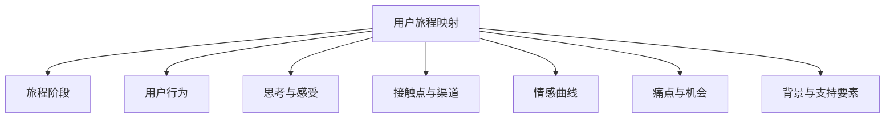

---
{"dg-publish":true,"tags":["商业分析","用户旅程","体验地图","服务设计"],"创建日期":"2024-07-15","permalink":"/知识共享/002_商业分析/01_学习内容/05_用户与需求分析/5.4 用户旅程映射/","dgPassFrontmatter":true}
---

# 用户旅程映射

## 用户旅程基础

### 用户旅程的定义与价值

用户旅程是指用户在与产品、服务或品牌互动过程中的完整体验，从最初意识到最终使用及后续互动的整个历程。用户旅程映射则是将这一体验可视化的工具和方法。

**核心价值**：
- **全局视角**：提供端到端的用户体验全景图，超越单点接触
- **情感洞察**：揭示用户在不同阶段的情感变化和体验
- **协作工具**：帮助跨职能团队建立共同理解
- **发现机会**：识别体验中的摩擦点和改进机会
- **优先级指导**：基于用户实际体验指导改进优先级
- **策略对齐**：确保各部门和接触点共同传递一致的体验

### 用户旅程与其他工具的关系

用户旅程映射与其他用户体验和业务分析工具相互补充：

**与用户画像的关系**：
- 用户画像定义"谁"(目标用户)
- 用户旅程描述"如何"(体验过程)
- 结合使用能创建更完整的用户理解

**与服务蓝图的关系**：
- 用户旅程关注用户视角的外部体验
- 服务蓝图增加组织内部流程和支持系统层面
- 服务蓝图通常在用户旅程基础上向内深入

**与业务流程图的区别**：
- 业务流程图关注操作步骤和决策点
- 用户旅程关注体验、情感和感知
- 业务流程强调效率，用户旅程强调体验

**与网站/应用流程图的区别**：
- 流程图通常限于单一渠道或平台
- 用户旅程可跨越多个渠道和时间点
- 用户旅程更强调体验维度(情感、思考、行为)

### 用户旅程的类型

根据不同目的和范围，用户旅程可分为多种类型：

**按范围划分**：
- **高层次旅程**：覆盖整个用户体验周期，通常时间跨度较长
- **特定场景旅程**：聚焦特定任务或场景，如"预订酒店"
- **渠道特定旅程**：关注单一渠道体验，如"移动应用体验"

**按目的划分**：
- **现状旅程图**：描述用户当前实际体验
- **未来旅程图**：设计理想的未来体验
- **对比旅程图**：并列展示不同用户群体或渠道的体验差异

**按详细程度划分**：
- **简化旅程图**：重点突出核心阶段和关键接触点
- **详细旅程图**：包含丰富细节，深入每个微观体验
- **分层旅程图**：允许从概览层逐步深入到细节层

**按创建方法划分**：
- **基于研究的旅程图**：基于实际用户研究数据
- **假设性旅程图**：基于团队专业知识和合理假设
- **混合旅程图**：结合研究数据和假设，随研究深入迭代

## 用户旅程映射方法

### 用户旅程映射的核心要素

有效的用户旅程图应包含多个关键维度：

**旅程阶段**：
- 将用户体验划分为有意义的阶段
- 反映自然体验流程和时间线
- 典型阶段可包括:认知、考虑、决策、使用、忠诚
- 根据具体产品/服务调整阶段定义

**用户行为**：
- 描述用户在各阶段的实际行动
- 尽量具体而非泛泛而谈
- 基于观察和研究而非假设
- 可包括多种可能的行为路径

**思考与感受**：
- 记录用户在各阶段的想法和疑问
- 包括期望、疑虑、决策考量
- 通常以用户语言直接引述表达
- 揭示动机和决策背后的心理过程

**接触点与渠道**：
- 识别用户与品牌/产品的所有互动点
- 包括物理接触点和数字接触点
- 注明接触点所属渠道(网站、应用、实体店等)
- 评估接触点的重要性和影响力

**情感曲线**：
- 可视化用户在旅程中的情感变化
- 常用简单的高/中/低满意度曲线
- 或使用更详细的情感描述
- 突出情感高峰和低谷

**痛点与机会**：
- 标识用户体验中的困难和挑战
- 关联痛点与特定阶段或接触点
- 提出对应的改进机会
- 通常用红色(痛点)和绿色(机会)标记

**背景与支持要素**：
- 可能包括用户目标和动机
- 相关的场景和环境因素
- 影响体验的外部条件
- 关键业务指标或度量标准

### 用户旅程映射的步骤

创建有效用户旅程图的系统流程：

**步骤1：设定目标和范围**
- 明确旅程图的目的(诊断问题、重新设计体验等)
- 确定旅程的起点和终点
- 决定关注的用户群体或画像
- 选择旅程映射的详细程度

**步骤2：收集用户研究数据**
- 通过访谈和观察了解用户体验
- 收集各接触点的用户反馈
- 分析现有的用户数据和分析
- 获取利益相关者和一线员工的输入

**步骤3：定义旅程阶段**
- 根据用户体验确定主要阶段
- 注意不要简单采用营销漏斗
- 确保阶段反映用户视角而非组织视角
- 为每个阶段创建简明描述

**步骤4：映射用户行为和体验**
- 记录各阶段的用户行动
- 添加用户思考和感受
- 确定每个阶段的关键接触点
- 绘制情感曲线反映体验质量

**步骤5：识别痛点和机会**
- 标记体验中的困难和摩擦
- 分析痛点的根本原因
- 从痛点中提炼改进机会
- 考虑情感低谷和转折点

**步骤6：完善和提炼**
- 添加支持信息和背景
- 确保视觉清晰易于理解
- 调整格式和布局以提高可读性
- 验证旅程图与研究数据一致

**步骤7：分享和应用**
- 与团队和利益相关者分享
- 制定基于旅程的改进计划
- 确定优先行动项
- 使用旅程图指导设计决策

### 研究方法与数据收集

高质量用户旅程图需要基于可靠数据：

**定性研究方法**：
- **用户访谈**：深入了解用户体验、期望和挫折
- **跟随观察**：直接观察用户完成真实任务
- **日记研究**：用户记录其体验的点滴
- **焦点小组**：探讨特定体验阶段的集体观点
- **情境问卷**：在特定场景下收集实时反馈

**定量研究方法**：
- **使用分析**：网站/应用使用数据和路径分析
- **满意度调查**：不同阶段的用户满意度评分
- **客户服务数据**：抱怨、问题和支持请求分析
- **转化率分析**：各阶段的转化率和流失点
- **Net Promoter Score(NPS)**：推荐意愿评分

**补充数据来源**：
- 一线员工和客服人员的反馈
- 社交媒体和评论分析
- 第三方研究报告
- 竞争对手体验分析
- 行业标准和最佳实践

**数据整合方法**：
- 三角验证：使用多个数据源验证发现
- 研讨会：团队协作解读和综合数据
- 模式识别：寻找反复出现的主题和问题
- 极端案例分析：研究特别好或特别差的体验

### 视觉化和设计技巧

有效的旅程图需要清晰直观的视觉表达：

**布局设计**：
- 通常采用从左到右的时间线布局
- 或使用环形布局表示循环旅程
- 垂直排列不同维度(行为、情感等)
- 确保足够空间容纳各类信息

**视觉层次**：
- 使用字体大小区分主次信息
- 运用颜色编码区分不同类型信息
- 关键发现和痛点使用视觉强调
- 考虑可折叠或分层显示复杂信息

**图标和符号**：
- 使用简单图标代表不同渠道
- 情感状态可用表情符号直观展示
- 为痛点和机会点设计明确标识
- 保持图标风格一致

**色彩应用**：
- 情感曲线使用红(负面)到绿(正面)的渐变
- 不同阶段可使用不同基色区分
- 确保足够的对比度便于阅读
- 考虑色盲友好的配色方案

**格式和模板**：
- 物理形式：大幅海报、墙面展示、可移动便签
- 数字形式：交互式文档、可点击详情的在线版
- 通用工具：Miro, Mural, Figma, Microsoft Visio
- 专业工具：Smaply, UXPressia, Custellence

## 用户旅程的应用与实践

### 用户旅程在产品开发中的应用

用户旅程映射可以指导产品开发的多个阶段：

**发现与定义阶段**：
- 理解当前用户体验的完整图景
- 识别未被满足的需求和机会
- 为创新提供基于用户的视角
- 协助确定产品开发优先级

**设计阶段**：
- 设计整体用户体验而非孤立功能
- 确保产品设计基于真实用户行为
- 创建具有情感共鸣的体验
- 避免常见用户摩擦点

**开发与测试阶段**：
- 指导功能开发的优先顺序
- 为测试场景提供真实用户情境
- 帮助开发团队理解功能在整体体验中的作用
- 作为测试计划的基础框架

**上市与优化阶段**：
- 指导营销信息和渠道策略
- 设计与用户旅程一致的引导和培训
- 评估实际用户体验与设计意图的差距
- 识别持续优化的重点领域

### 用户旅程在服务设计中的应用

服务设计特别依赖用户旅程来协调多渠道体验：

**全渠道体验设计**：
- 确保各渠道体验的一致性
- 设计渠道间平滑的转换体验
- 避免信息孤岛和重复步骤
- 考虑不同渠道的独特优势和限制

**服务接触点优化**：
- 识别每个接触点的作用和价值
- 设计关键时刻(Moments of Truth)的特殊体验
- 简化低价值接触点
- 增强高情感影响的接触点

**员工体验与培训**：
- 帮助员工理解其在整体用户旅程中的角色
- 指导员工培训内容和重点
- 设计支持工具提高一线员工效能
- 创建与用户旅程阶段匹配的绩效指标

**服务恢复设计**：
- 预见可能的服务失败点
- 设计各阶段的恢复策略和补救方案
- 将投诉转化为重建关系的机会
- 在关键摩擦点设置预防措施

### 用户旅程在营销和沟通中的应用

用户旅程可以显著提升营销效果和沟通策略：

**内容策略**：
- 根据旅程阶段设计针对性内容
- 解决用户在各阶段的具体问题和疑虑
- 确保内容类型与用户心态匹配
- 在决策点提供支持性信息

**接触点策略**：
- 识别最具影响力的接触点
- 优化资源分配，聚焦关键渠道
- 设计多渠道协同营销策略
- 利用接触点数据评估营销效果

**个性化通信**：
- 根据用户在旅程中的位置提供相关信息
- 设计触发式沟通响应用户行为
- 避免过度沟通造成的干扰
- 在情感低谷提供支持和解决方案

**品牌体验一致性**：
- 确保各接触点传递一致的品牌信息
- 协调不同部门的沟通内容和风格
- 建立与品牌价值一致的情感连接
- 在整个旅程中强化品牌差异化优势

### 用户旅程在组织变革中的应用

用户旅程可以成为组织变革的强大工具：

**打破部门壁垒**：
- 创建跨越传统部门界限的共同视图
- 促进各职能部门从用户视角思考
- 明确各部门在用户体验中的角色
- 促进协作解决跨部门问题

**文化转变**：
- 强化以用户为中心的思维方式
- 使抽象的客户关注变得具体和可操作
- 提供分享用户故事的共同语言
- 将用户需求变为组织优先事项

**绩效指标和激励机制**：
- 建立基于用户旅程的绩效指标
- 平衡传统业绩指标和体验指标
- 激励解决用户痛点的行为
- 创建跨部门共享目标

**组织结构调整**：
- 评估现有结构对用户体验的影响
- 考虑围绕关键旅程阶段重组团队
- 建立旅程负责人角色整合体验
- 设计支持无缝体验的协作机制

## 高级旅程映射技术

### 多维度旅程映射

基础旅程图可以扩展,增加多种维度:

**生命周期旅程图**：
- 超越单次交互，映射长期客户关系
- 考量用户与品牌关系的演变
- 包括首次购买前后的扩展体验
- 捕捉复购、升级和推荐行为

**多人旅程图**：
- 映射涉及多个用户的共同体验
- 例如家庭决策或B2B采购团队
- 展示不同角色间的互动和影响
- 识别决策中的关键人物和时刻

**后台旅程图**：
- 将用户体验与内部流程并行映射
- 关联前台体验和后台支持系统
- 识别内部流程对用户体验的影响
- 揭示组织能力差距和系统需求

**竞争对比旅程图**：
- 并列展示自身与竞争对手的用户体验
- 识别差距、优势和劣势
- 发现差异化机会
- 学习竞争对手的最佳实践

### 定量化用户旅程

将定量数据整合到旅程映射中提升决策价值：

**关键指标整合**：
- 在各阶段添加关键绩效指标(KPI)
- 包括转化率、满意度、完成时间等
- 量化关键接触点的使用情况
- 标记主要流失点和效率低下环节

**业务影响评估**：
- 估算各痛点造成的业务损失
- 计算改进机会的潜在价值
- 量化用户情感与商业结果的关联
- 支持基于数据的投资决策

**旅程分析平台**：
- 利用分析工具整合多源数据
- 创建可实时更新的动态旅程图
- 监测旅程改进举措的效果
- 识别趋势和模式变化

**预测模型**：
- 基于旅程数据建立预测模型
- 预测用户行为和流失风险
- 模拟不同改进方案的影响
- 支持主动干预和个性化体验

### 敏捷旅程映射方法

适应快速变化环境的旅程映射方法：

**精益旅程映射**：
- 从简化版本快速开始
- 专注于最关键阶段和接触点
- 基于实际用户反馈迭代完善
- 将大型旅程分解为可管理的部分

**共创旅程工作坊**：
- 组织跨职能团队参与工作坊
- 利用集体智慧创建初始旅程图
- 结合用户代表提供真实视角
- 在工作坊中直接确定行动项

**持续更新机制**：
- 建立定期回顾和更新流程
- 设计便于更新的模块化旅程图
- 创建数字化工具支持协作更新
- 开发旅程变化监测指标

**旅程测试与实验**：
- 将改进构想作为假设测试
- 设计针对特定旅程阶段的A/B测试
- 通过小规模试点验证旅程改进
- 快速迭代和调整基于真实数据

## 案例研究：电商平台用户旅程

### 背景与目标

某电子商务平台面临购物车放弃率高和客户满意度下降的问题，决定通过用户旅程映射深入了解用户体验并确定改进机会。

**业务挑战**：
- 购物车放弃率达到78%，高于行业平均水平
- 移动端转化率低于桌面端30%
- 客户满意度评分下降15%
- 客户支持请求增加，主要关于结账和退货问题

**项目目标**：
- 全面理解用户购物体验的痛点
- 识别放弃购物车的主要原因
- 发现提升移动体验的机会
- 制定优先改进计划提升转化率和满意度

### 研究方法

**数据收集**：
- 分析平台使用数据(点击流、转化漏斗、放弃点)
- 进行15次深度用户访谈
- 发布500份在线调查问卷
- 进行5次用户测试观察实际购物过程
- 分析客服记录和用户评价

**用户细分**：
专注于两个主要用户画像：
1. "效率导向型购物者" - 30-45岁专业人士，时间有限，注重便捷
2. "研究型购物者" - 对产品比较和评价花费大量时间的精打细算用户

### 用户旅程地图概览

基于研究创建的电商购物旅程图包含以下关键阶段：

**阶段1：发现与浏览**
- **用户行为**：搜索产品、浏览类别、查看推荐
- **接触点**：搜索引擎、社交媒体广告、首页、类别页
- **情感状态**：好奇、探索、偶尔困惑
- **主要痛点**：
  - 搜索结果不够相关
  - 类别导航复杂
  - 移动端筛选选项难以使用
- **量化数据**：
  - 首页跳出率35%
  - 平均浏览3.5个类别页面

**阶段2：产品评估**
- **用户行为**：阅读产品描述、查看图片、阅读评价、比较选项
- **接触点**：产品详情页、评价部分、产品对比工具
- **情感状态**：分析、犹豫、谨慎评估
- **主要痛点**：
  - 产品图片不足/质量不高
  - 产品描述不完整
  - 评价系统难以筛选相关评价
  - 移动端产品对比困难
- **量化数据**：
  - 评价部分访问率85%
  - 平均在产品页停留2.3分钟

**阶段3：决策与添加购物车**
- **用户行为**：选择产品变体、查看库存、添加购物车
- **接触点**：产品选项选择器、购物车按钮、库存指示器
- **情感状态**：决定、期待、偶尔的不确定
- **主要痛点**：
  - 产品变体选择器不直观
  - 无法保存购物车或愿望清单
  - 添加购物车后缺乏明确确认
- **量化数据**：
  - 产品详情页到购物车转化率42%
  - 平均每个购物车2.3件商品

**阶段4：结账流程**
- **用户行为**：查看购物车、输入地址、选择支付方式、完成订单
- **接触点**：购物车页面、结账表单、支付网关
- **情感状态**：从专注到挫折再到解脱(完成)
- **主要痛点**：
  - 结账流程步骤过多
  - 意外的额外费用(运费、税费)
  - 表单验证错误难以理解
  - 移动端表单填写困难
- **量化数据**：
  - 购物车到完成订单转化率22%
  - 平均结账完成时间4.5分钟

**阶段5：订单确认与跟踪**
- **用户行为**：查看确认邮件、跟踪订单、联系客服咨询
- **接触点**：确认邮件、订单跟踪页面、客服聊天
- **情感状态**：满足、期待、可能的焦虑(未收到更新)
- **主要痛点**：
  - 订单确认邮件延迟
  - 跟踪信息更新不及时
  - 无法修改或取消订单
- **量化数据**：
  - 订单跟踪页面访问频率3.2次/订单
  - 5%的订单导致客服联系

### 关键发现与机会

**主要痛点模式**：
1. **移动体验不佳**：在整个旅程中，移动端一致表现不如桌面端
2. **结账流程复杂**：多步骤和不必要的复杂性导致高放弃率
3. **信息透明度问题**：关于费用、库存和送达时间的信息不够清晰
4. **缺乏个性化**：未能根据用户历史和偏好调整体验

**优先机会**：
1. **简化移动结账**：
   - 减少表单字段和步骤
   - 优化移动表单设计
   - 添加进度指示器
   - 实现自动保存功能

2. **提高信息透明度**：
   - 在产品页面明确显示总成本(含税费、运费)
   - 改进库存和配送时间显示
   - 提供更清晰的订单状态更新

3. **增强产品评估体验**：
   - 改进产品图片质量和数量
   - 优化评价系统，突出最相关评价
   - 改进移动端产品对比功能

4. **实施个性化功能**：
   - 基于浏览历史推荐相关产品
   - 记住用户偏好和购物车内容
   - 提供个性化促销和优惠

### 实施结果

**短期改进**：
- 优化移动结账流程，将步骤从5步减少到3步
- 在产品页面添加明确的总成本计算器
- 实现购物车保存功能
- 改进订单跟踪通信频率

**成果**：
- 购物车放弃率从78%降至65%
- 移动转化率提高25%
- 结账时间减少40%
- 客户满意度评分提高18%
- 与结账相关的客服请求减少30%

**长期举措**：
- 开发新的产品详情页设计
- 实施AI驱动的个性化推荐系统
- 创建跨渠道一致的购物体验
- 建立持续的用户体验监测系统

**关键经验**：
- 用户旅程映射揭示了单点解决方案无法发现的系统性问题
- 移动体验需要独立设计而非简单缩小桌面版
- 情感维度的洞察对提升满意度至关重要
- 定期更新用户旅程图以反映不断变化的用户期望

## 自我评估与实践

### 知识检查

1. 什么是用户旅程，它与业务流程图有何区别？
2. 用户旅程映射的核心要素有哪些？
3. 如何确定用户旅程的适当阶段？
4. 描述创建用户旅程图的主要步骤。
5. 什么类型的研究方法最适合收集用户旅程数据？
6. 情感曲线在用户旅程中有什么作用？
7. 如何确定用户旅程中的痛点和机会？
8. 用户旅程映射在产品开发过程中如何应用？
9. 如何将定量数据整合到用户旅程图中？
10. 用户旅程映射如何帮助打破组织内部的壁垒？

### 实践项目：银行移动应用用户旅程

**项目背景**：
你是一家银行的商业分析师，银行最近推出了移动应用，但用户采用率低于预期，应用商店评价较差。管理层希望了解问题所在并提升用户体验。

**任务**：
1. 设计研究计划，确定适合收集移动银行应用用户旅程数据的方法
2. 定义移动银行应用的关键用户旅程阶段
3. 创建一个现状用户旅程图，包含所有核心元素
4. 识别主要痛点和改进机会
5. 制定基于旅程发现的优先改进建议

**评估标准**：
- 研究计划的合理性和全面性
- 旅程阶段定义的用户中心性和完整性
- 旅程图的细节丰富度和视觉清晰度
- 痛点和机会识别的洞察深度
- 改进建议的可行性和预期影响

## 参考资源

### 推荐书籍
- 《客户旅程地图》，Jim Kalbach著
- 《服务设计:从洞察到实施》，Andy Polaine, Lavrans Løvlie, Ben Reason著
- 《体验地图设计》，Megan Grocki著
- 《走向卓越体验》，Kerry Bodine, Harley Manning著
- 《用户故事地图》，Jeff Patton著

### 在线资源
- Nielsen Norman Group: Customer Journey Mapping 101
- Adaptive Path's Guide to Experience Mapping
- Service Design Tools: Customer Journey Map
- UX Mastery: How to Create a Customer Journey Map
- McKinsey: The CEO guide to customer experience

### 工具资源
- Smaply: 专业用户旅程映射工具
- UXPressia: 用户旅程和人物角色平台
- Miro/Mural: 通用协作和旅程映射工具
- Custellence: 客户旅程管理平台
- Microsoft Visio: 通用图表工具，提供旅程模板 