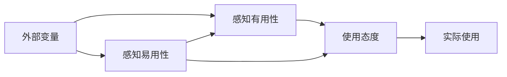

---
{"dg-publish":true,"tags":["商业分析","用户行为","行为分析","数据分析"],"创建日期":"2024-07-15","permalink":"/知识共享/002_商业分析/01_学习内容/05_用户与需求分析/5.5 用户行为分析/","dgPassFrontmatter":true}
---

# 用户行为分析

## 用户行为分析基础

### 用户行为分析的定义与价值

用户行为分析是对用户与产品、服务或系统交互过程中的行为模式进行系统性研究的过程。它通过收集、整理和分析用户行为数据，揭示用户的使用习惯、偏好和决策过程，为产品优化和商业决策提供数据支持。

**核心价值**：
- **基于事实决策**：用行为数据而非假设驱动产品和业务决策
- **用户体验优化**：发现并解决用户流程中的摩擦点和障碍
- **个性化基础**：支持根据用户行为创建个性化体验和推荐
- **转化率提升**：识别并改进转化漏斗中的关键环节
- **业务增长洞察**：发现用户留存、流失和增长的模式和驱动因素

### 用户行为分析的应用场景

用户行为分析在多种商业场景中具有广泛应用：

**产品开发与优化**：
- 评估新功能的使用情况和接受度
- 识别产品中最受欢迎和最少使用的功能
- 分析用户在产品中的导航和探索路径
- 发现用户遇到的错误和困难

**营销与销售**：
- 分析用户购买决策过程和影响因素
- 评估营销活动和渠道的有效性
- 识别高价值用户群体的行为特征
- 优化销售漏斗和提高转化率

**用户体验设计**：
- 确定界面设计的可用性问题
- 评估不同设计方案的用户接受度
- 分析内容消费和交互模式
- 优化信息架构和导航结构

**运营与客户服务**：
- 预测并减少用户流失
- 提高用户参与度和活跃度
- 识别需要主动支持的用户
- 优化自助服务流程和资源

### 用户行为模型与框架

多种理论模型有助于理解和预测用户行为：

**技术接受模型(TAM)**：
- 关注用户对新技术的接受因素
- 核心要素：感知有用性和感知易用性
- 应用：预测新产品或功能的采用情况

**行为改变轮(Behavior Change Wheel)**：
- 全面分析行为的能力、机会和动机
- 识别行为干预策略和政策
- 应用：设计提高用户参与的策略

**用户行为漏斗**：
- 追踪用户从初次接触到转化的路径
- 识别每个阶段的流失点和机会
- 应用：优化转化率和用户旅程

**AIDA模型**：
- 关注用户决策的四个阶段：注意(Attention)、兴趣(Interest)、欲望(Desire)、行动(Action)
- 应用：设计营销策略和用户引导流程

**钩子模型(Hook Model)**：
- 分析用户形成习惯的因素：触发(Trigger)、行动(Action)、奖励(Reward)、投入(Investment)
- 应用：设计提高用户粘性和留存的产品特性

## 用户行为数据收集方法

### 数字分析工具

数字分析工具是收集用户在数字产品中行为数据的主要手段：

**网站分析工具**：
- **Google Analytics**：全面的网站用户行为跟踪
- **Adobe Analytics**：企业级分析解决方案
- **Matomo**：注重隐私的开源分析平台

**移动应用分析**：
- **Firebase Analytics**：移动应用行为和性能分析
- **Mixpanel**：用户行为事件跟踪和分析
- **Amplitude**：用户旅程和行为序列分析

**产品分析平台**：
- **Pendo**：产品使用分析和用户引导
- **Heap**：自动捕获所有用户行为事件
- **FullStory**：用户会话回放和互动分析

**热图与会话录制**：
- **Hotjar**：点击、滚动和移动热图
- **Crazy Egg**：可视化用户行为模式
- **SessionCam**：用户会话回放和分析

### 关键跟踪指标

有效的用户行为分析需要跟踪多种关键指标：

**基础流量指标**：
- **访问量**：特定时期内的总访问次数
- **独立访问者**：不同用户的访问数量
- **会话时长**：用户停留在产品上的平均时间
- **跳出率**：未与页面交互就离开的访问者比例
- **访问深度**：每次会话查看的页面或屏幕数量

**参与度指标**：
- **活跃用户**：每日/每月活跃用户数(DAU/MAU)
- **活跃度比率**：DAU/MAU比率反映用户粘性
- **互动率**：与特定内容或功能互动的用户比例
- **回访频率**：用户返回产品的频率
- **使用时间**：用户在产品上花费的总时间

**转化指标**：
- **转化率**：完成目标行动的用户比例
- **漏斗完成率**：各漏斗阶段的转化情况
- **平均订单价值**：每次转化的平均价值
- **转化时间**：从首次访问到转化的平均时间
- **放弃率**：开始但未完成目标流程的比例

**留存与流失指标**：
- **留存率**：特定时期后仍继续使用的用户比例
- **流失率**：停止使用产品的用户比例
- **存活时间**：用户从获取到流失的平均时间
- **重新激活率**：不活跃用户重新开始使用的比例

### 用户行为跟踪实施

实施用户行为跟踪需要系统性的方法：

**事件跟踪架构**：
- **事件命名规范**：确保所有事件使用一致的命名约定
- **事件分类**：将事件分为页面浏览、互动、转化等类别
- **属性设计**：为事件添加有意义的上下文属性
- **用户属性**：定义和收集关键用户特征信息

**跟踪代码实施**：
- **标签管理系统**：如Google Tag Manager简化代码部署
- **自动跟踪**：配置基础页面浏览和交互的自动跟踪
- **自定义事件**：针对关键业务行为设置自定义事件跟踪
- **跨设备跟踪**：实现用户在不同设备间的行为关联

**数据质量保证**：
- **验证测试**：确保正确捕获所有计划事件
- **数据审计**：定期检查数据完整性和准确性
- **异常监控**：设置数据异常自动警报
- **文档维护**：保持跟踪实施的最新文档

**隐私合规考量**：
- **隐私政策更新**：明确说明数据收集和使用方式
- **用户同意机制**：实施合规的用户同意收集
- **数据匿名化**：在适当情况下匿名化用户数据
- **数据保留策略**：确定数据保留的时长和条件

## 线下行为研究方法

### 实体环境观察

在实体环境中观察用户行为提供了数字分析无法捕捉的洞察：

**结构化观察**：
- **行为计数**：记录特定行为出现的频率
- **时间采样**：在预定时间点记录用户行为
- **行为跟踪**：记录用户在环境中的移动路径
- **互动地图**：记录用户与环境中物体的互动

**非结构化观察**：
- **参与式观察**：研究者作为参与者观察行为
- **非参与式观察**：研究者不干扰自然行为
- **隐蔽观察**：用户不知道被观察的情况
- **公开观察**：用户知道被观察的情况

**实施工具与技术**：
- **行为编码表**：预定义的行为分类和记录工具
- **视频记录**：捕捉完整行为序列的视频记录
- **空间布局分析**：研究物理空间设计对行为的影响
- **热区图**：可视化用户在实体环境中的活动集中区域

### 生物测量与神经营销

生物测量提供了对用户无意识反应的深入洞察：

**眼动追踪**：
- **关注点分析**：用户视线停留的区域和时长
- **扫视路径**：视线在界面或环境中的移动路径
- **盲点识别**：用户未注意到的区域
- **注意力分散点**：导致注意力分散的元素

**面部表情分析**：
- **情绪识别**：通过面部表情识别7种基本情绪
- **微表情分析**：捕捉短暂的、无意识的情绪反应
- **参与度评估**：根据面部反应评估内容参与度
- **情感波动图**：随时间记录情绪变化

**生理反应测量**：
- **皮电反应(GSR)**：测量情绪激活程度
- **心率变异性**：评估压力和参与水平
- **脑电图(EEG)**：测量大脑对刺激的反应
- **功能性磁共振成像(fMRI)**：高精度大脑活动成像

**应用与局限**：
- **应用场景**：广告测试、产品包装设计、用户界面评估
- **技术局限**：设备复杂性、成本高、数据解读专业性
- **伦理考量**：需要严格的知情同意和隐私保护
- **结果验证**：通常需要与其他研究方法交叉验证 

## 用户行为数据分析方法

### 描述性分析

描述性分析回答"发生了什么"的问题，是行为分析的基础：

**趋势分析**：
- **时间序列分析**：观察指标随时间的变化模式
- **周期性分析**：识别每日、每周或季节性行为模式
- **增长率分析**：计算关键指标的增长或下降速率
- **比较分析**：与历史数据或基准进行对比

**分布分析**：
- **频率分布**：用户行为出现频率的分布情况
- **百分位分析**：识别数据中的异常值和分布特征
- **热门路径**：最常见的用户行为序列和路径
- **聚类分布**：行为在不同用户群体间的分布差异

**可视化技术**：
- **折线图**：展示指标随时间变化的趋势
- **热图**：可视化多维数据中的模式和集中区
- **漏斗图**：展示用户在转化流程中的流失情况
- **路径图**：可视化用户在产品中的导航路径

### 分段与比较分析

将用户按特征或行为分组进行比较，发现关键差异：

**用户分段方法**：
- **人口统计分段**：年龄、性别、地区等基本特征
- **行为分段**：基于用户行为模式的分组
- **价值分段**：基于用户对业务贡献的分组
- **生命周期分段**：基于用户阶段的分组(新用户、活跃用户、流失风险用户)

**对比分析技术**：
- **A/B测试结果分析**：比较不同版本的用户行为差异
- **同期群比较**：比较不同时期获取的用户行为
- **跨平台比较**：分析用户在不同设备或渠道的行为差异
- **细分市场比较**：不同市场或地区用户的行为对比

**实用分析框架**：
- **AARRR框架**：获取(Acquisition)、激活(Activation)、留存(Retention)、推荐(Referral)、收入(Revenue)
- **用户金字塔**：按参与度将用户分为浏览者、参与者、投稿者、拥护者等级别
- **RFM分析**：基于最近购买(Recency)、购买频率(Frequency)和消费金额(Monetary)的用户价值分段

### 行为序列分析

分析用户行为的时间顺序和模式，揭示用户旅程：

**路径分析**：
- **转化路径**：导致目标完成的常见行为序列
- **放弃路径**：用户放弃或流失前的行为模式
- **探索路径**：用户如何探索和导航产品
- **环路分析**：用户反复访问或循环的行为模式

**序列挖掘技术**：
- **马尔可夫链分析**：预测用户下一步行为的概率
- **序列模式挖掘**：发现频繁出现的行为序列
- **会话分段**：将用户会话划分为有意义的片段
- **间隔分析**：分析用户行为间的时间间隔模式

**实施工具**：
- **Google Analytics 路径分析**：网站用户流分析
- **Mixpanel Flows**：用户行为流程可视化
- **Amplitude Pathfinder**：识别转化和流失路径
- **自定义SQL分析**：复杂序列查询和分析

### 预测性行为分析

利用历史数据预测未来用户行为和结果：

**常用预测模型**：
- **回归模型**：预测连续值(如消费金额、使用时长)
- **分类模型**：预测离散结果(如转化、流失风险)
- **时间序列预测**：预测未来趋势和季节性模式
- **推荐系统**：预测用户偏好和个性化推荐

**机器学习应用**：
- **监督学习**：基于标记数据预测用户行为
- **无监督学习**：发现数据中的隐藏模式和分组
- **深度学习**：处理复杂的用户行为序列和模式
- **强化学习**：优化用户体验和参与策略

**实施考量**：
- **特征工程**：创建预测性强的用户行为特征
- **模型评估**：使用适当指标评估预测准确性
- **过拟合防范**：确保模型能泛化到新数据
- **模型更新策略**：定期重新训练适应行为变化

## 用户行为模式识别

### 用户参与模式

识别不同的参与方式和水平，指导参与度策略：

**参与类型分类**：
- **被动消费**：浏览内容但很少互动
- **轻度参与**：点赞、简单评论等低成本互动
- **积极参与**：创建内容、详细反馈、社区参与
- **倡导行为**：推荐、分享、邀请他人

**参与频率模式**：
- **定期访问**：固定时间或间隔的使用模式
- **突发参与**：短期内高强度使用后长时间不活跃
- **渐进参与**：随时间逐渐增加的参与度
- **逐渐减少**：随时间降低的参与频率(可能流失信号)

**参与深度评估**：
- **互动多样性**：用户进行的不同类型交互
- **参与持续时间**：单次会话的平均长度
- **功能探索范围**：用户探索的产品功能比例
- **参与强度指数**：综合多种参与指标的复合分数

### 转化与决策模式

分析导致转化或流失的用户决策路径和因素：

**购买决策模式**：
- **计划性购买**：详细研究后的有准备决策
- **冲动购买**：最小研究的快速决策
- **重复购买**：基于之前经验的习惯性决策
- **对比购买**：通过大量比较后的选择

**决策影响因素**：
- **价格敏感度**：价格变化对决策的影响程度
- **社会证明依赖**：评价和推荐对决策的影响
- **品牌忠诚度**：品牌在决策中的重要性
- **时间压力反应**：限时优惠对决策的影响

**放弃原因模式**：
- **摩擦点放弃**：在特定困难点放弃流程
- **信息不足放弃**：缺乏决策所需信息
- **替代选择放弃**：发现更好选择后放弃
- **成本障碍放弃**：价格或其他成本因素导致放弃

### 个体与集体行为动态

分析用户行为的社会维度和群体动态：

**社交影响模式**：
- **从众效应**：追随大多数人的行为选择
- **社会学习**：观察他人行为后采用
- **社会证明**：受信任来源推荐的影响
- **网络效应**：随用户数量增加的价值感知

**用户群体动态**：
- **意见领袖影响**：关键用户对行为传播的影响
- **群体形成**：自发兴趣社区的发展模式
- **信息级联**：信息或行为在用户群体中的传播
- **极化现象**：用户分化为不同行为阵营

**行为传播分析**：
- **创新扩散**：新行为在用户群体中的采用曲线
- **病毒式传播**：用户行为的指数级传播模式
- **传播节点识别**：行为传播中的关键枢纽用户
- **抵抗模式**：阻碍新行为采用的因素

## 用户行为洞察应用

### 产品优化与个性化

将行为洞察转化为产品改进和个性化策略：

**基于行为的产品优化**：
- **功能优先级调整**：根据使用频率重新安排功能优先级
- **用户界面优化**：通过热图和点击流数据改进界面
- **流程简化**：删除或简化低转化环节
- **内容策略调整**：根据消费模式优化内容类型和格式

**个性化实施策略**：
- **行为触发的个性化**：基于用户最近行为的即时适应
- **基于模式的个性化**：根据长期行为模式的定制
- **情境个性化**：考虑时间、位置等环境因素
- **A/B测试个性化**：测试不同个性化策略的有效性

**推荐系统设计**：
- **协同过滤**：基于相似用户的行为推荐
- **内容过滤**：基于内容特征和用户偏好匹配
- **混合推荐**：结合多种推荐技术的方法
- **冷启动策略**：解决新用户和新内容推荐挑战

### 营销策略与用户获取

利用行为洞察优化营销和用户获取：

**行为定向广告**：
- **再营销策略**：针对特定行为用户的再次触达
- **相似受众扩展**：基于现有用户行为模式寻找相似用户
- **意图信号定向**：根据购买意向强度的差异化营销
- **多渠道归因**：分析不同渠道对转化的贡献

**内容策略优化**：
- **内容性能分析**：识别最能吸引和转化用户的内容
- **内容旅程映射**：设计引导用户决策的内容序列
- **行为触发的内容**：根据用户行为自动发送相关内容
- **用户生成内容策略**：促进和利用用户创建的内容

**获客渠道优化**：
- **渠道效能分析**：比较不同渠道获取用户的质量
- **用户匹配度评估**：评估渠道用户与目标受众的匹配程度
- **获客成本优化**：根据用户生命周期价值调整获客投资
- **渠道多样化**：基于行为分析开发新的获客渠道

### 用户留存与流失预防

应用行为洞察提高用户留存并预防流失：

**留存策略开发**：
- **关键参与点识别**：发现与长期留存高度相关的行为
- **行为激活计划**：鼓励新用户完成关键留存行为
- **习惯培养循环**：设计促进重复使用的产品特性
- **回归用户策略**：针对不同流失阶段的用户再激活策略

**流失预警系统**：
- **流失风险评分**：实时计算用户流失可能性
- **行为变化检测**：识别可能预示流失的行为变化
- **参与下降监控**：追踪用户活跃度的渐进下降
- **早期干预触发**：在完全流失前自动启动挽留措施

**价值传达策略**：
- **个性化价值展示**：突出对特定用户最重要的价值
- **成就感设计**：通过进度和成就增强用户投入感
- **沉没成本强化**：提醒用户已投入的时间和努力
- **网络效应强化**：加强用户与其社交网络的连接

### 商业模式与收入优化

将行为洞察转化为商业模式改进和收入增长：

**定价和货币化优化**：
- **价格敏感度分析**：测量不同用户群体的价格弹性
- **功能分层策略**：根据使用模式设计付费层级
- **使用量定价模型**：基于行为数据设计使用量计费
- **交叉销售机会**：识别适合交叉销售的用户行为模式

**客户生命周期价值最大化**：
- **高价值行为培养**：鼓励与长期价值相关的行为
- **价值分段策略**：为不同价值段用户定制差异化策略
- **升级路径设计**：创建从免费到高级用户的平滑过渡
- **忠诚度计划优化**：基于行为数据设计有效的忠诚计划

**新商业机会识别**：
- **未满足需求挖掘**：发现行为数据中的服务空白
- **新产品线机会**：通过行为聚类发现新产品机会
- **合作伙伴关系识别**：基于用户行为模式寻找战略合作
- **数据货币化机会**：在保护隐私前提下的匿名洞察共享

## 实施与治理

### 用户行为分析最佳实践

确保行为分析项目的有效性和可持续性：

**项目规划与管理**：
- **明确业务目标**：将分析项目与具体业务成果联系
- **指标设计框架**：构建将业务目标转化为可测量指标的框架
- **敏捷分析流程**：采用迭代方法快速验证假设
- **跨职能协作**：确保分析、产品和营销团队的合作

**数据治理与质量**：
- **数据收集标准**：建立统一的数据收集和命名约定
- **数据质量监控**：实施持续的数据准确性检查
- **数据字典维护**：创建并更新所有跟踪指标的文档
- **历史数据管理**：确保数据的可比性和历史趋势分析

**分析团队组织**：
- **集中vs分散模式**：权衡集中式与嵌入式分析团队结构
- **技能矩阵**：确保团队具备技术和业务解读能力
- **知识共享机制**：建立分析方法和发现的共享系统
- **持续学习文化**：跟踪行为分析领域的新方法和工具

### 道德与隐私考量

在行为分析中平衡洞察价值与用户隐私：

**隐私设计原则**：
- **数据最小化**：只收集必要的行为数据
- **透明度**：清晰告知用户数据的收集和使用方式
- **用户控制**：提供管理和删除个人数据的选项
- **安全存储**：实施强大的数据安全措施

**法规合规框架**：
- **GDPR合规**：满足欧盟通用数据保护条例要求
- **CCPA/CPRA合规**：满足加州消费者隐私法案要求
- **全球隐私法规**：适应不同地区的数据保护法规
- **未成年人数据保护**：特别保护儿童和青少年数据

**伦理行为分析**：
- **非歧视原则**：确保分析和决策不强化偏见
- **操纵风险评估**：评估行为影响策略的伦理边界
- **透明算法**：可解释的分析和决策系统
- **社会责任平衡**：考虑商业目标与社会影响的平衡

### 未来趋势与发展方向

行为分析领域的新兴趋势和技术：

**人工智能与高级分析**：
- **深度学习预测**：使用深度神经网络预测复杂行为
- **自然语言处理**：分析用户文本输入和反馈
- **计算机视觉分析**：分析用户与实体环境的视觉交互
- **强化学习优化**：自动优化用户体验和界面

**跨渠道整合分析**：
- **全渠道用户视图**：整合线上和线下行为数据
- **身份解析技术**：跨设备和平台连接用户身份
- **统一测量框架**：标准化不同渠道和接触点的分析
- **归因进化**：更复杂的多渠道归因模型

**隐私增强分析**：
- **联邦学习**：不集中个人数据的分布式分析
- **差分隐私**：在保护隐私的同时提取统计洞察
- **零知识证明**：验证身份和行为而不泄露详细信息
- **去中心化数据模型**：用户控制的数据共享机制

## 案例研究：电子商务行为分析

### 背景与挑战

某电子商务平台面临购物车放弃率高和客户获取成本上升的挑战。管理层决定通过深入的用户行为分析寻找解决方案。

**业务问题**：
- 购物车放弃率达到73%，高于行业平均水平
- 新用户转化率低于竞争对手25%
- 回购频率下降，客户终身价值减少
- 营销效率下降，获客成本上升40%

**分析目标**：
- 识别购物车放弃的关键原因和模式
- 发现阻碍新用户转化的摩擦点
- 理解影响客户忠诚度的因素
- 评估不同营销渠道的质量和效率

### 实施方法

**数据收集策略**：
- 实施增强的事件跟踪，关注完整购物旅程
- 设置购物车放弃调查，捕捉放弃原因
- 建立用户会话录制，深入了解用户行为
- 实施A/B测试框架，测试改进假设

**分析框架**：
- 用户分段：新访客、首次购买者、重复客户、高价值客户
- 行为序列分析：识别常见购买和放弃路径
- 摩擦点分析：定位导致用户流失的关键环节
- 参与度评分：创建预测转化和留存的复合指标

**关键发现**：
1. **购物车放弃主要原因**：
   - 移动端结账流程复杂，需要8个步骤完成
   - 意外的配送费显示时机问题(最后步骤才显示)
   - 缺乏社会证明元素，无法建立信任
   - 支付选项有限，缺少流行的移动支付方式

2. **新用户转化障碍**：
   - 产品详情不足，特别是尺寸和规格信息
   - 新用户注册过程复杂，要求不必要的信息
   - 缺乏针对新用户的引导和激励
   - 评价系统难以查找和筛选相关评价

3. **回购和忠诚度影响因素**：
   - 缺乏个性化推荐，建议不相关产品
   - 售后体验不连贯，跟踪订单困难
   - 忠诚度计划不明显，好处不直观
   - 电子邮件营销缺乏个性化和相关性

### 解决方案与结果

**实施的改进**：
1. **简化购物流程**：
   - 重新设计移动结账流程，减少50%步骤
   - 提前显示所有费用，避免意外惊喜
   - 增加信任标志和评价摘要
   - 整合多种支付选项，包括移动钱包

2. **优化新用户体验**：
   - 强化产品详情页，增加视频和360°视图
   - 简化注册，允许游客结账
   - 创建针对新用户的欢迎流程和首单优惠
   - 改进评价系统，突出最有用的评价

3. **提升客户忠诚度**：
   - 实施个性化推荐引擎
   - 创建无缝的订单跟踪和售后系统
   - 简化并提升忠诚度计划可见性
   - 实施行为触发的个性化电子邮件

**业务成果**：
- 购物车完成率提高35%
- 新用户转化率提高28%
- 90天回购率提高40%
- 平均订单价值增加15%
- 营销获客成本降低25%
- 客户满意度评分提高30%

**关键经验**：
- 行为数据比用户反馈更准确地揭示真实问题
- 移动端优化对现代电子商务至关重要
- 减少摩擦点比增加功能更有效提升业绩
- 个性化是提高忠诚度和重复购买的关键因素
- 持续的行为测试和优化比一次性大改动更有效

## 自我评估与实践

### 知识检查

1. 用户行为分析与传统市场研究有何区别和联系？
2. 描述三种常用的用户行为数据收集方法及其优缺点。
3. 解释AARRR框架如何应用于用户行为分析。
4. 在行为分析中，定性和定量方法如何互补？
5. 描述三种识别用户行为模式的分析技术。
6. 什么是用户分段？为什么它在行为分析中很重要？
7. 如何利用行为数据预测用户流失？
8. 解释个性化与用户行为分析的关系。
9. 在实施用户行为跟踪时应考虑哪些隐私和伦理因素？
10. 描述将行为分析转化为产品改进的过程。

### 实践项目：移动应用行为分析计划

**项目背景**：
假设你是一家健身应用的商业分析师。该应用提供锻炼计划、饮食跟踪和社区功能。应用的30天留存率低于预期，管理层希望了解原因并提高用户留存。

**任务**：
1. 设计一个全面的用户行为分析计划：
   - 定义关键分析问题和假设
   - 确定需要收集的行为数据和指标
   - 选择合适的分析方法和工具
   - 规划数据收集和分析时间表

2. 创建用户行为分段框架：
   - 定义3-5个关键用户分段
   - 确定每个分段的行为特征
   - 设计比较和分析策略

3. 制定行为洞察应用计划：
   - 假设性的研究发现场景
   - 基于这些发现的产品改进建议
   - 评估改进效果的指标和方法

**评估标准**：
- 分析计划的全面性和针对性
- 指标和数据收集策略的合理性
- 分段框架的有效性和可操作性
- 洞察应用计划的可行性和创新性
- 提案与业务目标的一致性

## 参考资源

### 推荐书籍
- 《精益分析》，Alistair Croll, Benjamin Yoskovitz著
- 《Hooked: 如何构建习惯养成型产品》，Nir Eyal著
- 《增长黑客》，Sean Ellis, Morgan Brown著
- 《数据科学实战》，Rachel Schutt, Cathy O'Neil著
- 《行为设计》，Stephen Wendel著

### 在线资源
- Google Analytics Academy (analytics.google.com/analytics/academy/)
- Mixpanel博客 (mixpanel.com/blog)
- Nielsen Norman Group用户行为研究 (www.nngroup.com)
- Growth Hackers社区 (growthhackers.com)
- Amplitude产品智能博客 (amplitude.com/blog)

### 工具资源
- 分析平台: Google Analytics, Mixpanel, Amplitude, Heap
- 热图和会话录制: Hotjar, FullStory, Crazy Egg
- A/B测试: Optimizely, VWO, Google Optimize
- 用户反馈: UserVoice, Intercom, Typeform
- 数据可视化: Tableau, Looker, Power BI 