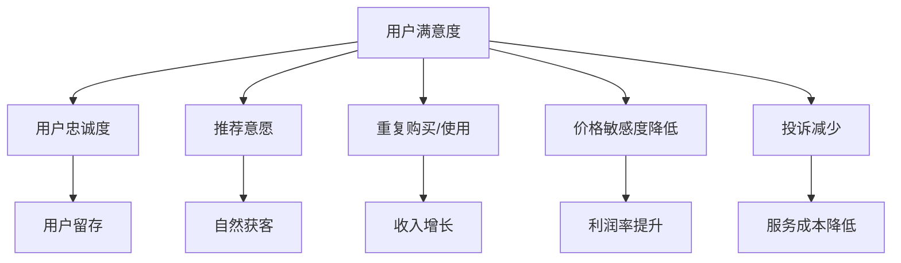
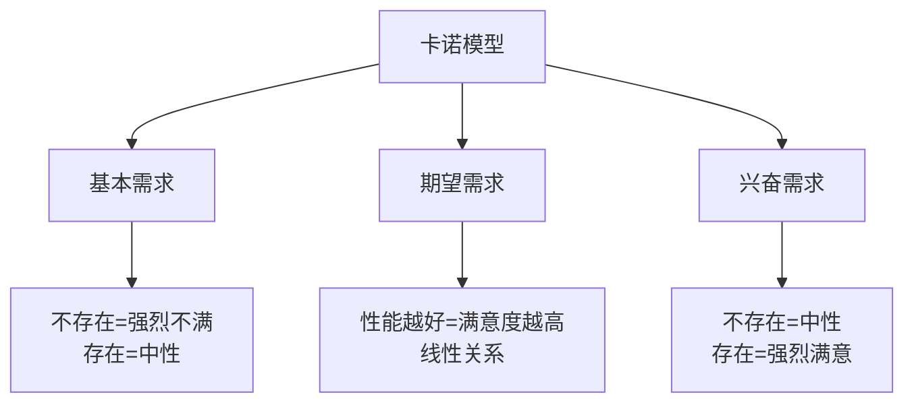

---
{"dg-publish":true,"tags":["商业分析","用户满意度","体验评估","满意度指标"],"创建日期":"2024-07-15","permalink":"/知识共享/002_商业分析/01_学习内容/05_用户与需求分析/5.6 用户满意度评估/","dgPassFrontmatter":true}
---

# 用户满意度评估

## 用户满意度基础

### 用户满意度的定义与重要性

用户满意度是指用户对产品或服务体验的整体评价，反映了实际体验与预期之间的差距。它是用户体验的核心评估指标，直接关系到用户忠诚度、留存率和业务增长。

**战略重要性**：
- **业务增长驱动**：满意用户更可能重复购买、推荐他人
- **竞争优势来源**：在同质化市场中，满意度成为差异化因素
- **产品改进指南**：指明优化方向和优先级
- **早期预警系统**：满意度下降通常预示业务问题
- **品牌价值建设**：高满意度有助于品牌口碑和声誉

**满意度与相关指标的关系**：

### 影响用户满意度的关键因素

用户满意度受多种因素影响，理解这些因素有助于系统提升满意度：

**产品/服务层面**：
- **功能表现**：核心功能的有效性和可靠性
- **易用性**：产品使用的便捷程度和学习曲线
- **性能**：速度、响应时间和稳定性
- **可访问性**：不同能力用户的使用便利性
- **价值感知**：价格与价值的匹配度

**情感与期望层面**：
- **期望管理**：事前期望与实际体验的差距
- **情感共鸣**：产品/服务触发的情感反应
- **问题解决**：解决用户痛点的有效性
- **个性化程度**：对用户个体需求的适应性
- **品牌一致性**：体验与品牌承诺的一致程度

**服务与支持层面**：
- **服务质量**：客户服务的及时性和有效性
- **问题解决**：处理投诉和问题的能力
- **沟通质量**：信息清晰度和沟通频率
- **服务态度**：员工表现出的关怀和专业度
- **全渠道一致性**：不同接触点体验的一致性

### 满意度理论模型

多种理论模型有助于理解用户满意度的形成和影响机制：

**期望确认理论(ECT)**：
- 满意度由预期与实际体验对比而生
- 实际体验超过预期导致正面确认和满意
- 实际体验低于预期导致负面确认和不满
- 预期管理与体验提升同等重要

**卡诺模型(Kano Model)**：
将产品/服务特性分为三类
- **基本需求(Must-be)**：缺失会导致不满，但存在不会明显增加满意度
- **期望需求(Performance)**：线性影响满意度，做得越好满意度越高
- **兴奋需求(Delighters)**：出乎意料的特性，显著提高满意度

**服务质量差距模型(SERVQUAL)**：
识别五种可能导致不满意的服务差距
- **差距1**：公司对用户期望的错误理解
- **差距2**：将用户期望转化为服务标准的失误
- **差距3**：服务执行与服务标准的偏差
- **差距4**：服务传达与实际提供的不一致
- **差距5**：用户期望与感知服务之间的总体差距

**客户满意指数模型(CSI)**：
- 基于期望、感知质量和感知价值评估满意度
- 考虑满意度对投诉和忠诚度的影响
- 提供标准化的满意度衡量框架
- 便于行业和竞争对手比较

## 满意度评估方法

### 定量评估方法

定量方法提供可测量和可比较的满意度数据：

**满意度调查问卷**：
- **李克特量表(Likert Scale)**：通常采用5点或7点量表
- **语义差异量表**：使用对立形容词评价特定维度
- **数字量表**：如0-10打分，直观且易于理解
- **满意度矩阵**：评估多个维度的重要性和表现

**关键满意度指标**：
- **客户满意度指数(CSI)**：综合多个维度的总体满意度分数
- **净推荐值(NPS)**：愿意推荐的可能性评分
  - 计算：推荐者%(9-10分)减去批评者%(0-6分)
  - 解释：高于0为良好，高于50为优秀
- **客户努力值(CES)**：完成任务所需努力程度评分
  - 评估用户体验的轻松度和便捷性
  - 较低分数表示更好的体验
- **满意度-重要性分析(SIA)**：比较各因素的满意度和重要性

**问卷设计最佳实践**：
- **简洁明了**：保持问卷简短，聚焦关键问题
- **中立提问**：避免引导性或偏见性的问题
- **平衡选项**：提供平等数量的正面和负面选项
- **关注具体**：询问特定体验而非泛泛评价
- **追问原因**：包含开放式问题了解评分背后原因
- **分段评估**：按产品/服务的不同方面分别评价
- **考虑时机**：在合适的用户旅程节点收集反馈

### 定性评估方法

定性方法提供深入的背景和解释性洞察：

**用户访谈**：
- **深度一对一访谈**：探索满意度背后的原因和感受
- **满意度回顾访谈**：详细回顾整个用户体验
- **情感旅程映射**：绘制用户旅程中的情感变化
- **关键事件技术**：关注特别满意或不满意的事件

**焦点小组**：
- **满意度主题小组**：讨论满意和不满意因素
- **改进建议小组**：集思广益改进方向
- **竞品比较小组**：对比竞争产品的满意因素
- **概念测试小组**：评估潜在改进方案的满意度影响

**文本分析**：
- **评论和反馈分析**：系统分析用户评价和反馈
- **社交媒体监测**：追踪公共平台上的满意度讨论
- **支持记录分析**：分析客服互动和投诉记录
- **情感分析**：评估文本反馈中的情感倾向

**观察研究**：
- **用户测试观察**：观察用户使用产品时的反应
- **表情和生物测量**：记录使用过程中的情绪反应
- **服务体验跟踪**：追踪服务交付过程中的用户反应
- **民族志研究**：在自然环境中观察产品使用情况

### 满意度测量的时机与频率

选择合适的测量时机和频率对获取准确数据至关重要：

**关键接触点测量**：
- **购买/注册后**：初始体验满意度
- **使用重要功能后**：核心体验满意度
- **问题解决后**：服务满意度
- **续订/重复购买前**：长期满意度
- **终止使用后**：流失原因和不满因素

**测量频率考量**：
- **连续性监测**：实时跟踪满意度变化趋势
- **周期性评估**：定期进行全面满意度调查
- **事件触发评估**：重大变更或市场事件后评估
- **季节性因素**：考虑业务季节性波动的影响
- **避免过度调查**：平衡数据需求和用户负担

**总体与分段调查平衡**：
- **年度全面评估**：深入分析所有维度
- **季度关键指标追踪**：监控核心满意度指标
- **持续微调查**：简短的单一问题持续反馈
- **定向深入调查**：针对特定问题或用户群体

### 满意度数据分析框架

系统化分析满意度数据以提炼有价值的洞察：

**趋势分析**：
- **纵向比较**：跟踪满意度随时间的变化
- **目标对比**：与预设目标的差距分析
- **行业基准**：与行业平均水平比较
- **竞争对标**：与主要竞争对手的比较

**分层分析**：
- **人口统计分层**：不同年龄、性别、地区等群体的差异
- **用户类型分层**：新用户vs老用户、高价值vs低价值
- **产品/服务分层**：不同产品线或服务类型比较
- **渠道分层**：不同获取或服务渠道的满意度差异

**关联分析**：
- **驱动因素分析**：识别最影响总体满意度的因素
- **业务影响分析**：满意度与留存率、购买频率等关系
- **投诉相关性**：满意度与投诉率的关系
- **干预效果分析**：改进措施对满意度的影响 

## 满意度管理与提升

### 满意度改进流程

系统化的满意度改进需要结构化流程：

**痛点识别与分类**：
- **紧急问题**：导致严重不满的高影响问题
- **系统性问题**：影响大量用户的普遍性问题
- **长期累积问题**：逐渐导致流失的隐性问题
- **机会区域**：可显著提升满意度的改进点

**改进优先级设定**：
- **满意度影响**：对总体满意度的潜在提升
- **业务影响**：对留存和收入的预期影响
- **实施复杂度**：所需资源和难度评估
- **战略一致性**：与整体业务目标的契合度

**改进方案设计**：
- **快速解决方案**：立即实施的小规模改进
- **中期改进计划**：3-6个月内可完成的项目
- **长期转型项目**：需要结构性变革的大型项目
- **实验性方案**：需要测试验证的创新解决方案

**效果评估方法**：
- **前后满意度比较**：改进前后的对比分析
- **A/B测试**：实验组与对照组比较
- **ROI分析**：改进投资的回报评估
- **长期影响追踪**：持续监控改进效果的稳定性

### 行业满意度标准与基准

了解行业标准有助于设定合理目标并评估相对表现：

**行业满意度基准**：
- **科技/软件行业**：NPS平均30-40，满意度75-80%
- **零售行业**：NPS平均40-50，满意度80-85%
- **金融服务**：NPS平均20-30，满意度70-75%
- **电信/网络服务**：NPS平均10-20，满意度65-70%
- **医疗健康**：NPS平均50-60，满意度80-85%

**满意度评级标准**：
- **优秀级**：超过行业前10%的表现
- **良好级**：超过行业平均的表现
- **达标级**：达到但不超过行业平均
- **待改进级**：低于行业平均但在可接受范围
- **危险级**：显著低于行业平均，需要紧急干预

**满意度成熟度模型**：
- **第1级：反应式**：仅在问题出现时关注满意度
- **第2级：流程化**：建立定期满意度评估机制
- **第3级：系统化**：全面满意度管理系统和流程
- **第4级：优化式**：持续改进和满意度预测
- **第5级：创新式**：将满意度作为创新和差异化驱动力

### 满意度提升策略

提升用户满意度的核心策略和方法：

**期望管理策略**：
- **明确价值承诺**：清晰传达产品/服务能提供什么
- **避免过度承诺**：确保营销与实际体验一致
- **透明沟通**：开放分享产品局限和已知问题
- **提前预警**：提前告知可能的困难或延迟
- **惊喜因素**：在关键节点提供超出期望的体验

**产品体验优化**：
- **核心功能卓越**：确保最常用功能的完美表现
- **简化复杂流程**：减少完成任务所需的步骤和时间
- **错误预防**：设计防止用户犯错的机制
- **个性化体验**：根据用户偏好和历史调整体验
- **渐进式披露**：适时展示功能，避免界面过载

**服务体验提升**：
- **全渠道一致性**：确保所有接触点的一致体验
- **授权前线员工**：给予解决问题的权限和工具
- **主动服务**：预测并主动解决潜在问题
- **响应速度**：缩短响应和解决时间
- **故障恢复策略**：将服务失败转化为忠诚机会

**关系建设策略**：
- **定期沟通**：保持适度的沟通频率
- **感谢和认可**：表达对用户支持的感谢
- **共同创造**：邀请用户参与产品开发过程
- **社区建设**：培养用户之间的连接和交流
- **个性化关系**：建立个性化而非交易式的关系

### 跨职能满意度管理

用户满意度是组织各部门的共同责任：

**满意度治理结构**：
- **满意度指导委员会**：跨部门协调满意度举措
- **满意度负责人**：专门负责满意度项目的领导
- **部门协调机制**：确保各部门一致努力提升满意度
- **激励机制**：将满意度目标与绩效评估和奖励挂钩

**部门角色与责任**：
- **产品团队**：改进产品功能和用户体验
- **营销团队**：管理期望和品牌承诺
- **销售团队**：确保恰当的产品匹配和正确引导
- **客服团队**：提供卓越支持和问题解决
- **IT/技术团队**：确保系统性能和可靠性
- **人力资源**：培训员工提升服务意识和能力

**跨部门协作机制**：
- **满意度数据共享**：确保所有部门访问最新满意度数据
- **联合问题解决**：跨部门解决复杂满意度问题
- **最佳实践分享**：促进部门间经验交流
- **统一客户视图**：建立所有部门共享的用户信息视图
- **协调改进计划**：确保各部门改进举措相互支持

## 满意度评估高级主题

### 满意度细分与个性化评估

不同用户群体可能有不同的期望和满意度标准：

**用户细分评估框架**：
- **价值分层**：高价值vs中价值vs低价值用户的满意度
- **使用阶段**：新用户vs成熟用户vs长期用户
- **使用模式**：重度vs中度vs轻度用户
- **采用类型**：早期采用者vs主流用户vs保守用户
- **痛点分层**：不同主要痛点用户群体的满意度

**个性化满意度关键绩效指标(KPI)**：
- **针对性指标**：为不同用户群体设计专属指标
- **情境满意度**：特定场景下的满意度测量
- **阶段满意度**：用户旅程不同阶段的满意度
- **功能满意度**：核心功能的专项满意度
- **关系满意度**：与品牌关系的满意度评估

**动态满意度分析**：
- **满意度演变**：同一用户群体随时间的满意度变化
- **期望变化**：用户期望随市场和体验的演变
- **触发事件影响**：重大事件对满意度的短期和长期影响
- **竞争格局变化**：市场竞争变化对满意度期望的影响

### 满意度与忠诚度的关系

满意度与忠诚度密切相关但并非完全等同：

**满意度-忠诚度模型**：
- **不满意不忠诚**：对品牌无情感连接，随时可能流失
- **满意但不忠诚**：满意但缺乏情感连接，容易被竞争吸引
- **不满意但忠诚**：因切换成本或缺乏选择而留存
- **满意且忠诚**：情感和理性层面都与品牌连接

**忠诚度驱动因素分析**：
- **满意度阈值**：转化为忠诚的满意度临界点
- **情感连接因素**：建立情感忠诚的关键驱动
- **差异化因素**：与竞争相比创造忠诚的独特优势
- **行为强化因素**：培养重复行为形成习惯的机制

**满意度指标与业务成果的关联**：
- **满意度与留存率**：不同满意度水平对应的留存概率
- **满意度与终身价值**：满意度与用户生命周期价值的关系
- **满意度与推荐行为**：满意度转化为实际推荐的比例
- **满意度与付费意愿**：满意度对价格敏感性的影响

### 文化差异与全球满意度管理

全球业务需要考虑文化因素对满意度的影响：

**文化维度影响**：
- **权力距离**：对服务人员权威和专业性的期望差异
- **个人vs集体主义**：个人化服务vs集体体验的重要性
- **不确定性规避**：对风险、变化和创新的容忍度
- **长期vs短期取向**：即时满足vs长期关系的价值观
- **节制vs放纵**：对享乐和体验质量的态度差异

**跨文化满意度评估调整**：
- **量表适应**：不同文化背景下的评分偏好调整
- **语言表达**：确保翻译准确传达满意度问题
- **问题框架**：调整提问方式适应文化沟通风格
- **基准调整**：考虑不同市场的满意度基准差异
- **反馈风格**：适应不同文化的反馈提供方式

**全球统一与本地化平衡**：
- **核心指标统一**：保持全球可比较的核心满意度指标
- **本地化补充指标**：添加反映地区特殊性的指标
- **全球基准**：建立跨区域的满意度基准
- **文化调整系数**：开发调整不同文化表达偏好的系数
- **最佳实践共享**：促进全球市场间满意度管理经验交流

### 新兴技术与满意度评估创新

新技术为满意度评估带来创新方法：

**人工智能应用**：
- **情感分析AI**：自动分析文本和语音中的情感倾向
- **预测性满意度**：预测可能的满意度变化和风险
- **实时满意度监测**：通过行为信号实时评估满意度
- **自动化满意度报告**：生成智能化满意度洞察报告
- **个性化调查**：基于用户特征定制满意度问题

**物联网与实时评估**：
- **智能设备满意度**：通过物联网设备收集使用满意度
- **环境反馈**：测量实体环境中的满意度指标
- **被动满意度信号**：无需主动反馈的满意度测量
- **实时服务调整**：基于即时满意度反馈调整服务

**增强现实和虚拟现实应用**：
- **沉浸式满意度调查**：创造互动性更强的满意度评估体验
- **可视化满意度数据**：通过AR/VR直观展示满意度结果
- **情境模拟评估**：在虚拟环境中测试满意度影响因素
- **元宇宙满意度**：新型数字环境中的满意度评估方法

## 案例研究：酒店服务满意度提升

### 背景与挑战

某中高端连锁酒店面临满意度下降和竞争压力增加的挑战，管理层决定实施系统化的满意度提升计划。

**初始情况**：
- 整体满意度评分从4.3/5下降到3.8/5
- Net Promoter Score从45下降到28
- 重复预订率下降15%
- 负面在线评价增加30%
- 竞争对手满意度评分平均为4.2/5

**关键挑战**：
- 满意度问题原因不明，缺乏系统性数据
- 各酒店表现不一致，管理标准执行不统一
- 客户期望提高，但服务模式未与时俱进
- 员工对满意度重要性认识不足，缺乏动力
- 投诉处理流程效率低下，解决率不高

### 评估方法设计

**全面满意度评估体系**：
- **触点满意度**：预订、入住、住宿、退房各环节评估
- **设施满意度**：客房、餐饮、健身、公共区域评估
- **服务满意度**：前台、客房服务、餐饮服务、礼宾评估
- **问题解决满意度**：投诉处理和服务恢复评估

**多渠道数据收集**：
- 退房后电子邮件满意度调查
- 酒店内触摸屏即时反馈
- 在线评价和社交媒体监测
- 神秘顾客评估计划
- 员工反馈和观察
- 深度客户访谈

**数据分析框架**：
- 按酒店位置、客户类型和时间的分析
- 关键驱动因素影响权重分析
- 服务失误类型和频率分析
- 与竞争对手对标比较
- 满意度与财务表现相关性分析

### 关键发现

全面评估揭示了多方面的满意度问题：

**设施相关问题**：
- 部分酒店房间设施老化，不符合品牌标准
- 无线网络速度和稳定性成为主要投诉点
- 客房噪音控制不佳，影响睡眠质量
- 数字设施(如充电口、智能控制)不足

**服务流程问题**：
- 入住和退房流程效率低，等待时间长
- 员工对常见问题解决缺乏授权和培训
- 个性化服务不足，无法识别回头客偏好
- 餐饮服务质量和速度不一致

**沟通与期望问题**：
- 预订信息与实际体验存在差距
- 价格与感知价值不匹配，尤其是高峰期
- 特殊要求未被有效记录和执行
- 服务失误后的沟通和补救不及时

**员工相关问题**：
- 员工满意度与客户满意度高度相关
- 高流动率导致服务经验和质量不稳定
- 缺乏以客户为中心的培训和文化
- 服务表现与绩效激励未有效挂钩

### 改进策略与实施

基于评估结果制定了系统性改进计划：

**短期行动（0-3个月）**：
- 建立全面实时满意度监测仪表板
- 实施"服务恢复"授权计划，允许员工立即解决问题
- 优化入住和退房流程，减少50%等待时间
- 改进无线网络基础设施和覆盖
- 建立满意度预警系统，及时干预潜在问题

**中期计划（4-12个月）**：
- 实施客户数据平台，识别并记录客户偏好
- 开展全员"卓越服务"培训项目
- 分阶段升级客房设施和数字化体验
- 改革绩效评估系统，加大满意度权重
- 建立跨部门满意度改进委员会

**长期转型（1-3年）**：
- 重新设计服务模式，增加个性化和数字化元素
- 实施员工授权和文化转型计划
- 建立预测性满意度管理系统
- 开发差异化服务体验，提升竞争优势
- 建立满意度卓越中心，持续创新和改进

### 成果与经验

系统性满意度改进计划带来显著成效：

**主要成果**：
- 整体满意度提升至4.5/5，超过行业平均
- NPS提升至58，达到行业领先水平
- 重复客户比例增加35%
- 服务问题解决率提高至95%
- 负面评价减少60%
- 员工满意度提升25%

**投资回报**：
- 平均房价提高12%，无需降价促销
- 入住率提高15%
- 年度收入增加23%
- 客户获取成本降低20%
- 每客户终身价值增加30%

**关键经验**：
- 满意度管理需要系统性和全面性方法
- 员工体验是客户体验的基础
- 数据收集要及时、全面但不打扰客人
- 关注"服务恢复"质量与初始服务同等重要
- 满意度提升是持续过程，非一次性项目
- 实施小改进的累积效果可能超过大变革
- 满意度与财务表现紧密相连，可量化ROI

## 自我评估与实践

### 知识检查

1. 什么是用户满意度以及它为什么对业务成功至关重要？
2. 描述期望确认理论如何解释满意度的形成。
3. 比较Net Promoter Score、客户满意度指数和客户努力值的异同。
4. 在设计满意度调查时应考虑哪些关键因素？
5. 什么是卡诺模型，它如何帮助理解不同产品/服务特性对满意度的影响？
6. 描述三种定性满意度评估方法及其优势。
7. 什么时候进行满意度评估最合适？为什么？
8. 如何有效分析满意度数据以获取可行洞察？
9. 为什么满意的客户不一定是忠诚的客户？
10. 文化因素如何影响满意度评估和管理？

### 实践项目：电子商务网站满意度评估

**项目背景**：
你是一家中型电子商务网站的商业分析师，该网站销售电子产品。网站最近进行了重新设计，但管理层担心新设计可能影响用户满意度。你被要求设计并实施一个满意度评估计划。

**任务**：
1. 设计一个全面的满意度评估框架：
   - 确定关键评估维度和指标
   - 选择合适的评估方法组合
   - 设计数据收集流程和时机
   - 建立分析和报告框架

2. 创建满意度评估工具：
   - 设计一份简洁有效的满意度调查问卷
   - 创建关键指标跟踪仪表板模板
   - 开发定性研究指南(访谈或焦点小组)
   - 设计满意度细分分析框架

3. 制定满意度改进计划：
   - 设计满意度数据分析流程
   - 创建满意度问题优先级评估矩阵
   - 开发满意度改进提案模板
   - 设计满意度改进效果评估方法

**评估标准**：
- 评估框架的全面性和针对性
- 评估工具的设计质量和用户友好性
- 指标选择的合理性和可操作性
- 改进计划的系统性和可实施性
- 对电子商务环境特点的考虑度

## 参考资源

### 推荐书籍
- 《满意度管理：从测量到改进》，Terry G. Vavra著
- 《卓越服务：满意度和忠诚度策略》，Ron Zemke, Chip Bell著
- 《NPS管理》，Fred Reichheld, Rob Markey著
- 《为什么客户会选择你？》，Don Peppers, Martha Rogers著
- 《服务设计与交付》，Glenn Llopis著

### 在线资源
- ACSI(美国客户满意度指数)网站
- Gartner客户体验研究报告
- Forrester客户满意度最佳实践
- Harvard Business Review满意度管理文章集
- Qualtrics XM资源中心

### 工具资源
- 满意度调查平台：Qualtrics, SurveyMonkey, Medallia
- 客户反馈管理：Clarabridge, UserVoice, GetFeedback
- 文本分析工具：Lexalytics, Keatext, MonkeyLearn
- 仪表板工具：Tableau, Power BI, Looker
- 闭环反馈系统：Zendesk, Salesforce Service Cloud 