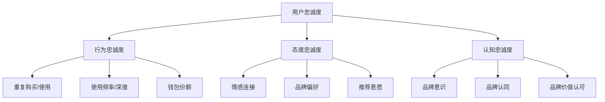
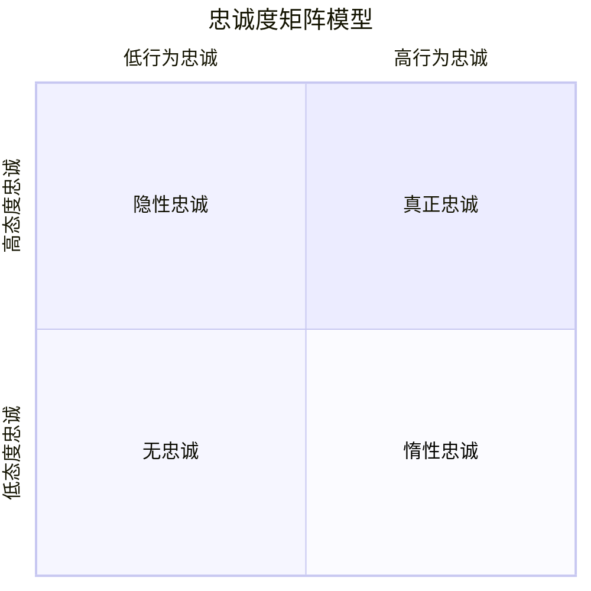

---
{"dg-publish":true,"tags":["商业分析","用户忠诚度","留存分析","用户价值"],"创建日期":"2024-07-15","permalink":"/知识共享/002_商业分析/01_学习内容/05_用户与需求分析/5.7 用户忠诚度分析/","dgPassFrontmatter":true}
---

# 用户忠诚度分析

## 用户忠诚度基础

### 用户忠诚度的定义与价值

用户忠诚度是指用户对产品、服务或品牌的持续承诺和偏好，表现为重复购买、持续使用、抵抗竞争诱惑和积极推荐的意愿。它是业务可持续增长的关键驱动因素，超越了单纯的满意度。

**商业价值**：
- **收入稳定性**：忠诚用户提供可预测的收入流
- **成本效益**：留存现有用户比获取新用户成本低5-25倍
- **增长潜力**：忠诚用户更易接受追加销售和交叉销售
- **市场洞察**：忠诚用户提供持续的产品反馈和创新灵感
- **竞争优势**：高忠诚度是难以复制的差异化优势
- **品牌资产**：用户忠诚度是品牌价值的核心组成部分

**忠诚度的多维度特性**：

### 忠诚度与相关概念的关系

理解用户忠诚度在商业分析体系中的位置需要厘清相关概念关系：

**忠诚度与满意度**：
- 满意是忠诚的必要但非充分条件
- 满意聚焦单次体验评价，忠诚涉及长期关系
- 高满意度不一定转化为高忠诚度(满意但不忠诚的陷阱)
- 忠诚度更能预测用户未来行为和业务成果

**忠诚度与参与度**：
- 参与度关注用户与产品/品牌的互动深度和频率
- 高参与度通常是忠诚度的先导指标
- 参与度衡量当前行为，忠诚度预测未来行为
- 数字环境中，参与度可作为忠诚度的实时代理指标

**忠诚度与留存率**：
- 留存率是忠诚度的定量表现之一
- 留存可能出于惯性或切换成本，而非真正忠诚
- 忠诚用户必然有高留存，但高留存用户不一定忠诚
- 留存是结果指标，忠诚度探究背后的驱动因素

**忠诚度与用户生命周期价值(LTV)**：
- LTV是忠诚度的财务表现
- 忠诚度提升是增加LTV的主要策略
- LTV提供忠诚度项目的ROI衡量标准
- 忠诚度分析有助于识别高LTV潜力用户

### 忠诚度的类型与层次

用户忠诚度有不同类型和发展阶段，需要差异化分析和管理策略：

**忠诚度类型分类**：
- **交易型忠诚**：基于价格、便利或激励的理性计算
- **关系型忠诚**：基于个人连接和服务体验的情感依恋
- **认同型忠诚**：基于价值观和身份认同的深层连接
- **习惯型忠诚**：基于无意识习惯和使用惯性的行为模式
- **社交型忠诚**：基于社区归属感和群体认同的连接

**忠诚度层次模型**：
1. **认知层次**：基于产品属性和功能表现的理性评估
2. **情感层次**：基于使用体验产生的情感满足和品牌偏好 
3. **意向层次**：表达继续使用和推荐的明确意愿
4. **行动层次**：表现为实际的重复购买和使用行为
5. **倡导层次**：主动推荐并为品牌辩护的最高忠诚形式

**忠诚度发展阶段**：
- **认知阶段**：认识品牌价值和好处
- **试验阶段**：初次使用和评估
- **熟悉阶段**：形成使用习惯和偏好
- **依赖阶段**：依赖产品满足特定需求
- **承诺阶段**：形成长期关系和情感连接
- **倡导阶段**：成为品牌大使和积极推荐者

## 忠诚度测量框架

### 关键忠诚度指标

有效的忠诚度衡量需要多元指标体系，平衡行为与态度维度：

**行为忠诚度指标**：
- **留存率**：不同时间段(7/30/90/365天)的活跃用户保持率
- **复购率**：特定时期内重复购买的用户比例
- **使用频率**：平均使用间隔或特定时期的使用次数
- **使用深度**：特性使用广度、会话时长、操作复杂性
- **钱包份额**：用户在特定类别支出中分配给品牌的比例
- **客户生命周期**：用户从首次到流失的平均时间长度

**态度忠诚度指标**：
- **净推荐值(NPS)**：推荐意愿评分(0-10)及推荐者净比例
- **品牌偏好度**：相对于竞争品牌的选择倾向强度
- **品牌满意度**：对品牌整体体验的满意程度
- **情感连接指数**：与品牌的情感连接强度评估
- **认同程度**：品牌与个人价值观和身份的一致性认知
- **切换意向**：考虑转向竞争产品/服务的可能性

**复合忠诚度指标**：
- **忠诚度指数**：整合行为和态度指标的综合评分
- **忠诚驱动力指数**：影响忠诚度的关键因素加权评分
- **品牌健康指数**：忠诚度与其他品牌指标的综合评估
- **忠诚细分分布**：不同忠诚度层级用户的分布情况
- **用户价值矩阵**：结合当前价值和忠诚潜力的用户分类

### 忠诚度数据收集方法

多方位数据收集策略能提供更全面的忠诚度洞察：

**行为数据收集**：
- **用户行为追踪**：记录产品使用模式和互动
- **交易数据分析**：购买历史、频率、金额和类型
- **留存分析**：回访率、活跃度和使用持续性
- **流失预警触发**：监测预示潜在流失的行为模式
- **参与度监测**：特性使用广度、内容消费和互动

**态度数据收集**：
- **忠诚度调查**：定期评估忠诚度相关态度
- **NPS/满意度追踪**：持续监测推荐意愿和满意度
- **品牌追踪研究**：评估品牌观感和竞争比较
- **退出调查**：了解流失用户的离开原因
- **社交媒体情感分析**：监测品牌提及和情感倾向

**整合数据方法**：
- **用户行为与调查配对**：连接态度和实际行为数据
- **纵向跟踪**：同一用户群的忠诚度演变追踪
- **多渠道整合**：统一线上线下的忠诚度数据视图
- **客户旅程映射**：在用户旅程各点收集忠诚度信号
- **预测性指标识别**：找出预示未来忠诚行为的早期指标

### 忠诚度细分模型

识别不同忠诚类型的用户群体，实现差异化管理：

**RFM模型**：
基于三个关键行为维度进行细分
- **最近性(Recency)**：最后一次购买或使用的时间
- **频率(Frequency)**：购买或使用的频率
- **金额(Monetary)**：消费金额或价值贡献
- 组合后可将用户分为核心忠诚用户、有发展潜力用户、衰退风险用户等

**忠诚度矩阵模型**：
交叉行为忠诚度和态度忠诚度形成四象限
- **真正忠诚**：高行为忠诚 + 高态度忠诚
- **隐性忠诚**：低行为忠诚 + 高态度忠诚
- **惰性忠诚**：高行为忠诚 + 低态度忠诚
- **无忠诚**：低行为忠诚 + 低态度忠诚

**价值-忠诚度矩阵**：
结合当前价值和忠诚度潜力进行用户分类
- **高价值高忠诚**：核心用户，需重点维护
- **高价值低忠诚**：风险用户，需强化关系
- **低价值高忠诚**：成长用户，需价值提升
- **低价值低忠诚**：边缘用户，需改善体验或适度投入

**忠诚度发展阶段细分**：
按照忠诚度发展阶段对用户进行分类
- **新晋用户**：初次使用或刚开始建立关系
- **成长用户**：使用频率和范围逐渐增加
- **成熟用户**：稳定使用并形成明确偏好
- **倡导用户**：积极推荐并深度参与
- **风险用户**：显示可能流失的预警信号
- **流失用户**：已减少或停止使用

### 忠诚度分析技术

深入分析忠诚度数据，揭示潜在模式和机会：

**描述性分析**：
- **忠诚度趋势**：随时间变化的忠诚度指标趋势
- **用户分布**：不同忠诚度层级的用户分布情况
- **细分对比**：不同用户群体的忠诚度表现比较
- **忠诚度漏斗**：从基础留存到深度忠诚的转化漏斗
- **行为模式**：忠诚用户的典型使用和互动模式

**诊断性分析**：
- **驱动因素分析**：识别影响忠诚度的关键因素
- **流失原因分析**：理解用户离开的主要原因
- **满意度-忠诚度相关**：满意度与实际忠诚行为的关系
- **触点影响分析**：不同接触点对忠诚度的影响
- **生命周期阶段分析**：不同阶段忠诚度变化的模式

**预测性分析**：
- **忠诚度预测模型**：基于早期指标预测长期忠诚度
- **流失预警系统**：识别可能流失的高风险用户
- **生命周期价值预测**：预测用户未来的价值贡献
- **倡导者识别**：预测可能成为品牌倡导者的用户
- **交叉销售机会**：识别忠诚用户的额外购买机会

**高级分析技术**：
- **生存分析**：评估用户继续保持活跃的可能性
- **马尔可夫链模型**：模拟用户在不同忠诚度状态间的转换
- **聚类分析**：基于忠诚度特征自动分组用户
- **机器学习分类**：预测用户的忠诚度类别
- **时间序列分析**：预测忠诚度指标的未来走势 