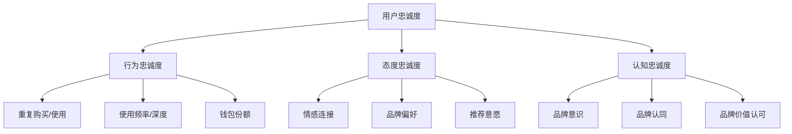
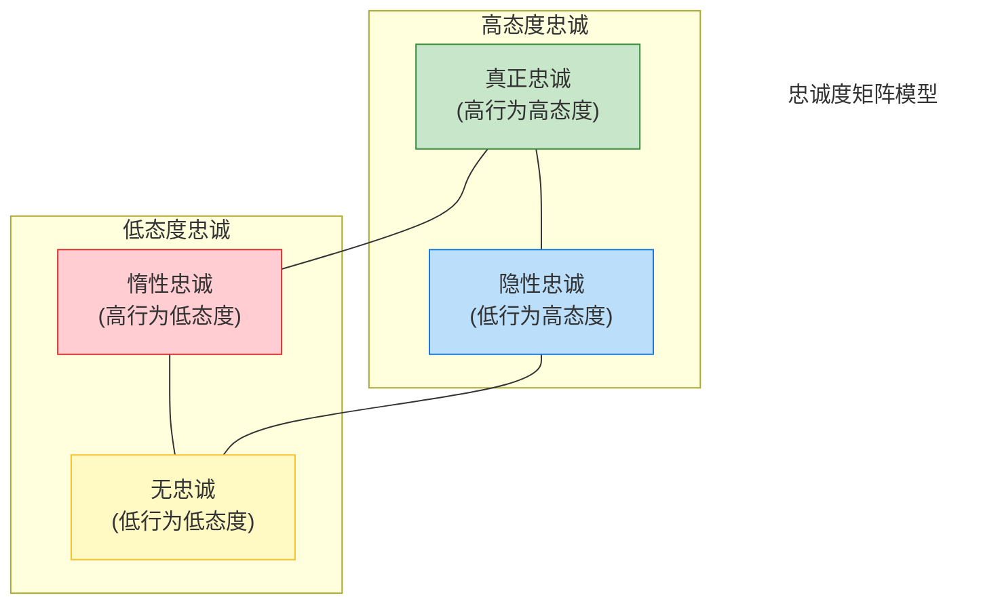
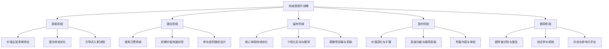

---
{"dg-publish":true,"tags":["商业分析","用户忠诚度","留存分析","用户价值"],"创建日期":"2024-07-15","permalink":"/知识共享/002_商业分析/01_学习内容/05_用户与需求分析/5.7 用户忠诚度分析/","dgPassFrontmatter":true}
---

# 用户忠诚度分析

## 用户忠诚度基础

### 用户忠诚度的定义与价值

用户忠诚度是指用户对产品、服务或品牌的持续承诺和偏好，表现为重复购买、持续使用、抵抗竞争诱惑和积极推荐的意愿。它是业务可持续增长的关键驱动因素，超越了单纯的满意度。

**商业价值**：
- **收入稳定性**：忠诚用户提供可预测的收入流
- **成本效益**：留存现有用户比获取新用户成本低5-25倍
- **增长潜力**：忠诚用户更易接受追加销售和交叉销售
- **市场洞察**：忠诚用户提供持续的产品反馈和创新灵感
- **竞争优势**：高忠诚度是难以复制的差异化优势
- **品牌资产**：用户忠诚度是品牌价值的核心组成部分

**忠诚度的多维度特性**：

### 忠诚度与相关概念的关系

理解用户忠诚度在商业分析体系中的位置需要厘清相关概念关系：

**忠诚度与满意度**：
- 满意是忠诚的必要但非充分条件
- 满意聚焦单次体验评价，忠诚涉及长期关系
- 高满意度不一定转化为高忠诚度(满意但不忠诚的陷阱)
- 忠诚度更能预测用户未来行为和业务成果

**忠诚度与参与度**：
- 参与度关注用户与产品/品牌的互动深度和频率
- 高参与度通常是忠诚度的先导指标
- 参与度衡量当前行为，忠诚度预测未来行为
- 数字环境中，参与度可作为忠诚度的实时代理指标

**忠诚度与留存率**：
- 留存率是忠诚度的定量表现之一
- 留存可能出于惯性或切换成本，而非真正忠诚
- 忠诚用户必然有高留存，但高留存用户不一定忠诚
- 留存是结果指标，忠诚度探究背后的驱动因素

**忠诚度与用户生命周期价值(LTV)**：
- LTV是忠诚度的财务表现
- 忠诚度提升是增加LTV的主要策略
- LTV提供忠诚度项目的ROI衡量标准
- 忠诚度分析有助于识别高LTV潜力用户

### 忠诚度的类型与层次

用户忠诚度有不同类型和发展阶段，需要差异化分析和管理策略：

**忠诚度类型分类**：
- **交易型忠诚**：基于价格、便利或激励的理性计算
- **关系型忠诚**：基于个人连接和服务体验的情感依恋
- **认同型忠诚**：基于价值观和身份认同的深层连接
- **习惯型忠诚**：基于无意识习惯和使用惯性的行为模式
- **社交型忠诚**：基于社区归属感和群体认同的连接

**忠诚度层次模型**：
1. **认知层次**：基于产品属性和功能表现的理性评估
2. **情感层次**：基于使用体验产生的情感满足和品牌偏好 
3. **意向层次**：表达继续使用和推荐的明确意愿
4. **行动层次**：表现为实际的重复购买和使用行为
5. **倡导层次**：主动推荐并为品牌辩护的最高忠诚形式

**忠诚度发展阶段**：
- **认知阶段**：认识品牌价值和好处
- **试验阶段**：初次使用和评估
- **熟悉阶段**：形成使用习惯和偏好
- **依赖阶段**：依赖产品满足特定需求
- **承诺阶段**：形成长期关系和情感连接
- **倡导阶段**：成为品牌大使和积极推荐者

## 忠诚度测量框架

### 关键忠诚度指标

有效的忠诚度衡量需要多元指标体系，平衡行为与态度维度：

**行为忠诚度指标**：
- **留存率**：不同时间段(7/30/90/365天)的活跃用户保持率
- **复购率**：特定时期内重复购买的用户比例
- **使用频率**：平均使用间隔或特定时期的使用次数
- **使用深度**：特性使用广度、会话时长、操作复杂性
- **钱包份额**：用户在特定类别支出中分配给品牌的比例
- **客户生命周期**：用户从首次到流失的平均时间长度

**态度忠诚度指标**：
- **净推荐值(NPS)**：推荐意愿评分(0-10)及推荐者净比例
- **品牌偏好度**：相对于竞争品牌的选择倾向强度
- **品牌满意度**：对品牌整体体验的满意程度
- **情感连接指数**：与品牌的情感连接强度评估
- **认同程度**：品牌与个人价值观和身份的一致性认知
- **切换意向**：考虑转向竞争产品/服务的可能性

**复合忠诚度指标**：
- **忠诚度指数**：整合行为和态度指标的综合评分
- **忠诚驱动力指数**：影响忠诚度的关键因素加权评分
- **品牌健康指数**：忠诚度与其他品牌指标的综合评估
- **忠诚细分分布**：不同忠诚度层级用户的分布情况
- **用户价值矩阵**：结合当前价值和忠诚潜力的用户分类

### 忠诚度数据收集方法

多方位数据收集策略能提供更全面的忠诚度洞察：

**行为数据收集**：
- **用户行为追踪**：记录产品使用模式和互动
- **交易数据分析**：购买历史、频率、金额和类型
- **留存分析**：回访率、活跃度和使用持续性
- **流失预警触发**：监测预示潜在流失的行为模式
- **参与度监测**：特性使用广度、内容消费和互动

**态度数据收集**：
- **忠诚度调查**：定期评估忠诚度相关态度
- **NPS/满意度追踪**：持续监测推荐意愿和满意度
- **品牌追踪研究**：评估品牌观感和竞争比较
- **退出调查**：了解流失用户的离开原因
- **社交媒体情感分析**：监测品牌提及和情感倾向

**整合数据方法**：
- **用户行为与调查配对**：连接态度和实际行为数据
- **纵向跟踪**：同一用户群的忠诚度演变追踪
- **多渠道整合**：统一线上线下的忠诚度数据视图
- **客户旅程映射**：在用户旅程各点收集忠诚度信号
- **预测性指标识别**：找出预示未来忠诚行为的早期指标

### 忠诚度细分模型

识别不同忠诚类型的用户群体，实现差异化管理：

**RFM模型**：
基于三个关键行为维度进行细分
- **最近性(Recency)**：最后一次购买或使用的时间
- **频率(Frequency)**：购买或使用的频率
- **金额(Monetary)**：消费金额或价值贡献
- 组合后可将用户分为核心忠诚用户、有发展潜力用户、衰退风险用户等

**忠诚度矩阵模型**：
交叉行为忠诚度和态度忠诚度形成四象限
- **真正忠诚**：高行为忠诚 + 高态度忠诚
- **隐性忠诚**：低行为忠诚 + 高态度忠诚
- **惰性忠诚**：高行为忠诚 + 低态度忠诚
- **无忠诚**：低行为忠诚 + 低态度忠诚

**价值-忠诚度矩阵**：
结合当前价值和忠诚度潜力进行用户分类
- **高价值高忠诚**：核心用户，需重点维护
- **高价值低忠诚**：风险用户，需强化关系
- **低价值高忠诚**：成长用户，需价值提升
- **低价值低忠诚**：边缘用户，需改善体验或适度投入

**忠诚度发展阶段细分**：
按照忠诚度发展阶段对用户进行分类
- **新晋用户**：初次使用或刚开始建立关系
- **成长用户**：使用频率和范围逐渐增加
- **成熟用户**：稳定使用并形成明确偏好
- **倡导用户**：积极推荐并深度参与
- **风险用户**：显示可能流失的预警信号
- **流失用户**：已减少或停止使用

### 忠诚度分析技术

深入分析忠诚度数据，揭示潜在模式和机会：

**描述性分析**：
- **忠诚度趋势**：随时间变化的忠诚度指标趋势
- **用户分布**：不同忠诚度层级的用户分布情况
- **细分对比**：不同用户群体的忠诚度表现比较
- **忠诚度漏斗**：从基础留存到深度忠诚的转化漏斗
- **行为模式**：忠诚用户的典型使用和互动模式

**诊断性分析**：
- **驱动因素分析**：识别影响忠诚度的关键因素
- **流失原因分析**：理解用户离开的主要原因
- **满意度-忠诚度相关**：满意度与实际忠诚行为的关系
- **触点影响分析**：不同接触点对忠诚度的影响
- **生命周期阶段分析**：不同阶段忠诚度变化的模式

**预测性分析**：
- **忠诚度预测模型**：基于早期指标预测长期忠诚度
- **流失预警系统**：识别可能流失的高风险用户
- **生命周期价值预测**：预测用户未来的价值贡献
- **倡导者识别**：预测可能成为品牌倡导者的用户
- **交叉销售机会**：识别忠诚用户的额外购买机会

**高级分析技术**：
- **生存分析**：评估用户继续保持活跃的可能性
- **马尔可夫链模型**：模拟用户在不同忠诚度状态间的转换
- **聚类分析**：基于忠诚度特征自动分组用户
- **机器学习分类**：预测用户的忠诚度类别
- **时间序列分析**：预测忠诚度指标的未来走势 

## 忠诚度策略与项目管理

### 忠诚度提升策略框架

基于忠诚度分析结果，组织需要系统化的策略来提升和维护用户忠诚度：

**核心策略维度**：
- **产品驱动忠诚**：通过持续改进产品体验和价值创造忠诚
- **情感驱动忠诚**：构建情感连接和品牌共鸣
- **激励驱动忠诚**：通过奖励和福利促进特定行为
- **结构驱动忠诚**：创建转换壁垒和使用习惯
- **社区驱动忠诚**：培养用户间的社区感和归属感

**忠诚度提升策略矩阵**：

**差异化忠诚度策略**：
- **新用户策略**：建立初始产品价值认知和使用习惯
- **成长用户策略**：拓展使用深度和增加互动频率
- **核心用户策略**：深化情感联系和提供个性化体验
- **风险用户策略**：主动干预和问题解决
- **倡导者策略**：提供分享平台和倡导者激励

### 忠诚度项目设计与实施

将忠诚度策略转化为可执行的项目和计划：

**忠诚度项目类型**：
- **会员制项目**：分级会员权益和专属服务
- **积分奖励系统**：基于行为的积分累积和兑换
- **社区建设项目**：用户社区和参与平台
- **个性化体验项目**：基于用户数据的体验定制
- **专属内容项目**：针对忠诚用户的独家内容
- **共创与反馈项目**：用户参与产品改进和创新

**忠诚度项目设计流程**：
1. **目标设定**：明确项目预期影响的忠诚度指标
2. **用户研究**：了解目标用户群的忠诚度驱动因素
3. **机制设计**：设计核心互动和奖励机制
4. **经济建模**：评估成本结构和投资回报
5. **测试验证**：小规模测试并优化
6. **全面实施**：大规模推广和运营
7. **监测与调整**：持续监测效果并迭代优化

**项目实施关键因素**：
- **跨部门协作**：整合产品、营销、客服等部门能力
- **数据基础建设**：确保用户数据可访问和可用
- **执行一致性**：保持忠诚度体验的一致性
- **灵活响应**：能根据反馈快速调整策略
- **长期承诺**：管理层对忠诚度建设的持续支持

### 忠诚度项目效果评估

系统评估忠诚度项目的投资回报和业务影响：

**评估框架**：
- **直接指标**：项目对忠诚度KPI的即时影响
- **中间指标**：对用户行为和态度的中期影响
- **业务结果**：对留存率、LTV和收入的最终影响
- **投资回报**：项目投入与产出的经济效益比较

**评估方法**：
- **对照组实验**：比较参与和未参与用户的忠诚度变化
- **前后对比**：项目实施前后的忠诚度指标变化
- **细分分析**：项目对不同用户群体的差异化影响
- **归因分析**：识别忠诚度改变的具体归因因素
- **敏感性分析**：测试不同项目参数对效果的影响

**常见评估陷阱**：
- **短期偏见**：过度关注短期指标忽视长期影响
- **选择偏差**：自选参与用户可能本身就更忠诚
- **归因错误**：未考虑其他因素对忠诚度的影响
- **度量局限**：仅关注易量化指标忽视质性变化
- **机械对比**：忽略市场和竞争环境的动态变化

## 行业案例分析

### 消费零售行业

**亚马逊Prime会员计划**：
- **策略核心**：通过订阅制会员服务建立结构性忠诚
- **关键机制**：免费快递、Prime视频等多元权益捆绑
- **成功因素**：持续增加会员价值并简化续订流程
- **效果指标**：会员流失率低于5%，购买频率是非会员的2倍以上
- **启示**：超值权益组合可创造强大的使用习惯和心理锁定

**星巴克星礼程**：
- **策略核心**：结合积分奖励与情感体验的多层次忠诚
- **关键机制**：个性化奖励、专属体验和移动支付整合
- **成功因素**：无缝数字体验与门店实体体验的融合
- **效果指标**：会员贡献超过50%收入，显著提高复购率
- **启示**：忠诚度项目需与核心产品体验深度整合

### 科技与订阅服务

**网飞(Netflix)内容生态**：
- **策略核心**：通过内容策略和个性化推荐建立使用习惯
- **关键机制**：先进的推荐算法和持续内容投资
- **成功因素**：深度了解用户偏好并提供惊喜内容发现
- **效果指标**：月活跃度超过85%，年流失率控制在9%左右
- **启示**：算法驱动的个性化可大规模创造忠诚度

**微软Microsoft 365转型**：
- **策略核心**：从一次性购买向订阅服务转型的忠诚建设
- **关键机制**：持续更新、跨设备同步和云存储整合
- **成功因素**：创造明确的订阅价值并确保服务不断创新
- **效果指标**：商业用户续订率超过90%，用户活跃度提升
- **启示**：传统产品转型为订阅需展示持续价值创造

### 金融服务行业

**招商银行"朝朝盈"模式**：
- **策略核心**：通过普惠金融服务和便捷体验创造行为忠诚
- **关键机制**：余额理财、账户整合和服务便捷化
- **成功因素**：将日常金融行为与忠诚度机制自然结合
- **效果指标**：用户活跃度和资产保有量显著高于行业平均
- **启示**：无感知的忠诚机制往往比显性激励更有效

**美国运通会员体验**：
- **策略核心**：高端定位与专属服务创造身份认同忠诚
- **关键机制**：会员专属活动、礼宾服务和品质体验
- **成功因素**：营造稀缺性和独特性感受
- **效果指标**：高端卡用户年均消费是行业平均的3倍以上
- **启示**：情感和身份认同可创造高价值忠诚关系

### 跨行业启示与最佳实践

**共同成功要素**：
- **无缝体验**：忠诚度机制与核心产品体验的无缝整合
- **价值透明**：清晰传达忠诚度项目的用户价值
- **个性化**：基于用户数据提供差异化的忠诚体验
- **多元互动**：提供多种途径和维度参与忠诚互动
- **长期承诺**：将忠诚度视为长期战略而非短期促销

**常见失败模式**：
- **复杂化陷阱**：规则过于复杂导致用户理解和参与困难
- **缺乏差异化**：忠诚机制与竞争对手过于相似
- **价值稀释**：权益和奖励价值逐渐降低
- **操作脱节**：忠诚度目标与运营执行脱节
- **投资不足**：期望短期投资获得长期忠诚回报

## 忠诚度趋势与创新

### 数字化转型与忠诚度

技术变革重塑忠诚度建设的方法和机会：

**数据驱动忠诚**：
- **实时个性化**：基于即时行为的动态忠诚体验
- **预测性干预**：在流失前识别风险并主动干预
- **微分段忠诚**：超精细用户分群的定制忠诚策略
- **全渠道忠诚整合**：跨设备和场景的一致忠诚体验
- **行为经济学应用**：利用心理学原理优化忠诚机制

**新兴技术应用**：
- **AI赋能忠诚**：智能助手和自动化个性化服务
- **区块链忠诚**：透明可信的忠诚度记录和跨平台积分
- **AR/VR体验**：沉浸式忠诚互动和虚拟会员权益
- **物联网整合**：连接智能设备的无缝忠诚体验
- **声音界面**：语音助手整合的忠诚互动

### 社会与价值观变化的影响

忠诚度策略需适应用户价值观和社会趋势变化：

**新世代忠诚价值观**：
- **Z世代忠诚特征**：注重真实性、社会责任和自我表达
- **千禧一代期望**：个性化体验、便捷性和品牌使命
- **忠诚动机转变**：从功能和价格导向转向价值观和使命导向
- **数字原生期望**：无缝体验和即时满足的忠诚互动
- **意义驱动忠诚**：与个人身份和价值观一致的品牌连接

**可持续忠诚度趋势**：
- **目标导向忠诚**：基于共同价值观和社会责任的连接
- **社区驱动忠诚**：用户社群和集体身份的忠诚力量
- **透明度忠诚**：基于企业诚信和透明度的信任建设
- **社会影响力忠诚**：将社会责任整合入忠诚度项目
- **包容性忠诚战略**：服务更广泛多样的用户群体

### 忠诚度创新前沿

开创性的忠诚度概念和模式正在重塑行业：

**创新忠诚度模式**：
- **订阅+忠诚度融合**：将订阅模式与传统忠诚度机制结合
- **元宇宙忠诚体验**：虚拟世界中的沉浸式忠诚互动
- **去中心化忠诚度**：用户控制的跨平台忠诚度资产
- **众包忠诚项目**：用户参与设计和运营的忠诚度计划
- **全生态系统忠诚**：跨品牌和合作伙伴的忠诚网络

**未来发展展望**：
- **超个性化忠诚**：基于深度学习的极致个性化体验
- **情境感知忠诚**：根据用户情境动态调整的忠诚互动
- **情感智能忠诚**：能识别和响应用户情绪的忠诚系统
- **隐私友好忠诚**：在保护隐私前提下的个性化忠诚体验
- **认知辅助忠诚**：AI辅助用户决策的新型忠诚关系

## 练习与思考问题

### 忠诚度分析练习

1. **忠诚度细分分析**
   - 选择一个您熟悉的产品或服务
   - 应用RFM模型或忠诚度矩阵对其用户进行细分
   - 为每个细分提出针对性的忠诚度策略建议

2. **忠诚度指标设计**
   - 为某个行业(如金融科技、电商、内容订阅等)
   - 设计完整的忠诚度衡量指标体系
   - 说明如何整合行为和态度指标
   - 讨论数据收集方法和分析流程

3. **流失预警模型构思**
   - 列出可能预示用户流失的早期信号
   - 设计流失风险评分模型的变量和权重
   - 提出干预策略和测试方法

### 案例分析任务

1. **忠诚度项目评估**
   - 选择一个知名的忠诚度项目(如亚马逊Prime、星巴克星礼程等)
   - 分析其核心机制、价值主张和差异化因素
   - 评估其优势和可能的改进空间
   - 讨论其成功要素是否可复制到其他行业

2. **忠诚度转型案例**
   - 研究一个成功从传统忠诚度模式转型到创新模式的品牌
   - 分析转型的驱动因素和实施策略
   - 评估转型的结果和影响
   - 总结关键经验教训

### 忠诚度战略思考

1. **深度思考问题**：
   - 在产品体验持续改善的环境中，传统忠诚度项目还有必要吗？
   - 如何平衡个性化忠诚体验与隐私保护的冲突？
   - 在用户注意力碎片化的环境中，如何建立深度忠诚？
   - 真正的忠诚是可以通过项目和机制创造的，还是只能自然产生？
   - 未来十年，忠诚度建设的核心挑战和机遇是什么？

2. **创新忠诚度设计**：
   - 为未来3-5年设计一个创新型忠诚度概念
   - 考虑新兴技术、社会趋势和用户行为变化
   - 提出核心机制、价值主张和实施路径
   - 讨论可能面临的挑战和解决方案

### 实战应用项目

1. **忠诚度诊断与改进**
   - 选择一个现有产品或服务
   - 进行忠诚度现状评估和问题诊断
   - 设计忠诚度提升策略和具体行动计划
   - 提出实施路径和效果评估方法

2. **忠诚度数据分析**
   - 使用公开数据集或模拟数据
   - 应用本章所学分析技术进行忠诚度分析
   - 发现关键洞察并提出业务建议
   - 讨论数据限制和进一步研究方向 