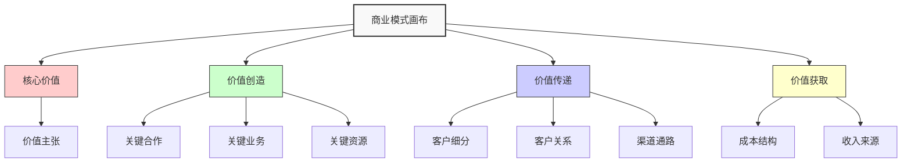

---
{"dg-publish":true,"tags":["商业分析","商业模式","画布","价值主张"],"创建日期":"2024-05-20","permalink":"/知识共享/002_商业分析/01_学习内容/06_商业模式分析/6.1 商业模式画布/","dgPassFrontmatter":true}
---


# 6.1 商业模式画布

> [!quote] 概述
> 本文详细介绍商业模式画布的概念、组成要素、应用方法与案例分析。商业模式画布作为一种强大的战略管理工具，能够帮助企业系统性地理解、设计和评估商业模式，提供直观的框架来展示企业如何创造、传递和获取价值。

## 1. 商业模式画布基础

### 1.1 商业模式画布的定义与价值

商业模式画布(Business Model Canvas, BMC)由瑞士企业家和创新学者亚历山大·奥斯特瓦德(Alexander Osterwalder)与伊夫·皮尼厄(Yves Pigneur)于2008年提出，并在2010年出版的《商业模式新生代》一书中系统化。

**商业模式画布的定义**：商业模式画布是一种战略管理和精益创业模板，用于描述、可视化、评估和改进商业模式。它通过九个核心构建模块，概括了企业如何创造、传递和获取价值的方式。

**与传统商业计划对比**：

| 维度 | 商业模式画布 | 传统商业计划 |
|------|------------|------------|
| 格式 | 视觉化、单页 | 文本型、多页文档 |
| 完成时间 | 小时级 | 周/月级 |
| 迭代性 | 高度迭代 | 相对静态 |
| 沟通效率 | 高效直观 | 详尽但繁琐 |
| 关注点 | 整体价值创造逻辑 | 详细执行计划 |
| 灵活性 | 适应快速变化 | 较难快速调整 |

**商业模式画布的核心价值**：

1. **统一语言**：提供讨论商业模式的共同词汇和框架
2. **全局视角**：促进对商业模式各要素的整体理解
3. **可视化思考**：将复杂的商业概念简化为视觉元素
4. **协作工具**：便于团队共同创造和讨论
5. **敏捷测试**：支持快速验证和迭代商业假设
6. **战略对话**：促进关于战略选择的结构化对话

### 1.2 商业模式画布的九大构建模块

商业模式画布由九个相互关联的构建模块组成，形成完整的商业逻辑：



**九大构建模块详解**：

1. **客户细分(Customer Segments)**
   - 企业服务的不同群体或组织
   - 回答：我们为谁创造价值？谁是我们最重要的客户？

2. **价值主张(Value Propositions)**
   - 解决客户问题和满足客户需求的产品和服务
   - 回答：我们提供什么价值？我们解决什么问题？

3. **渠道通路(Channels)**
   - 企业如何与客户沟通并传递价值主张
   - 回答：通过什么渠道触达客户？哪些渠道最有效？

4. **客户关系(Customer Relationships)**
   - 企业与特定客户群建立和维持的关系类型
   - 回答：我们与客户建立什么类型的关系？这些关系如何整合？

5. **收入来源(Revenue Streams)**
   - 企业从客户群体获取的现金流
   - 回答：客户愿意为什么价值付费？他们如何付费？

6. **关键资源(Key Resources)**
   - 使商业模式运转所需的最重要资产
   - 回答：我们需要哪些核心资源来实现价值主张？

7. **关键业务(Key Activities)**
   - 企业必须执行的最重要活动
   - 回答：我们需要做哪些关键活动来实现价值主张？

8. **关键合作(Key Partnerships)**
   - 使商业模式运转的供应商和合作伙伴网络
   - 回答：谁是我们的关键合作伙伴？我们从他们那里获得什么？

9. **成本结构(Cost Structure)**
   - 运营商业模式所产生的所有成本
   - 回答：最重要的成本是什么？哪些关键资源/活动最昂贵？

### 1.3 商业模式画布的演变与扩展

随着实践的深入，商业模式画布也衍生出多种扩展版本：

**精益画布(Lean Canvas)**：
- 由Ash Maurya开发，更关注创业公司和新产品
- 替换了部分元素：独特价值主张、问题、解决方案、关键指标、不公平优势

**价值主张画布(Value Proposition Canvas)**：
- 奥斯特瓦德的补充工具，深入探讨价值主张与客户需求的匹配
- 两部分：客户侧(工作、痛点、收益)和价值侧(产品服务、痛点解决、收益创造)

**环境画布(Environment Map)**：
- 关注影响商业模式的外部因素
- 包括：市场力量、行业力量、关键趋势和宏观经济因素

**欧盟创新雷达(Innovation Radar)**：
- 欧盟委员会开发，专注于创新项目评估
- 扩展了对技术就绪度和市场潜力的评估

## 2. 商业模式画布的应用方法

### 2.1 商业模式画布的使用流程

有效应用商业模式画布的系统化流程：

**准备阶段**：
1. **确定目标**：明确使用画布的具体目的(新业务设计、现有业务分析等)
2. **组建团队**：邀请跨职能成员参与，确保多元视角
3. **收集材料**：准备便利贴、大幅画布(实体或数字)、现有业务数据

**构建阶段**：
1. **客户细分**：首先确定目标客户群体，这是一切的起点
2. **价值主张**：针对每个客户细分，定义相应的价值主张
3. **收入与渠道**：思考如何将价值传递给客户并获取收入
4. **客户关系**：确定与客户建立和维持什么类型的关系
5. **资源与活动**：确定实现价值主张所需的关键资源和活动
6. **合作伙伴**：思考需要哪些外部合作关系
7. **成本结构**：分析所有相关成本

**分析阶段**：
1. **一致性检查**：确保九个模块之间的逻辑一致性
2. **差距分析**：识别当前模式中的弱点和缺失
3. **竞争对比**：与竞争对手的商业模式进行对比
4. **情景分析**：探讨不同市场条件下模式的表现

**迭代阶段**：
1. **提出假设**：明确商业模式中的关键假设
2. **设计实验**：为验证关键假设设计最小可行测试
3. **收集反馈**：执行测试并收集数据
4. **调整优化**：基于反馈调整商业模式画布

### 2.2 商业模式画布的实用技巧

最大化商业模式画布价值的实用建议：

**填写技巧**：
- 使用便利贴而非直接写在画布上，便于调整
- 每个便利贴写一个元素，保持简洁明了
- 使用不同颜色区分不同类型的内容或不同的客户细分
- 添加关键数据点和验证状态(已验证/假设)

**思考引导**：
- 从客户需求出发，而非从产品出发
- 考虑"工作要完成"(Jobs-to-be-done)框架，理解客户真正需要解决的问题
- 思考商业模式中的独特性和防御壁垒
- 关注各模块间的相互影响和一致性

**团队协作**：
- 设定明确的时间框架(通常2-4小时)
- 指定中立的引导者，保持讨论聚焦
- 鼓励所有参与者发言，避免职级影响
- 先独立思考，再集体讨论，避免从众思维

**常见陷阱避免**：
- 避免列出过多元素，聚焦最重要的方面
- 不要忽略渠道和客户关系，这常是实施障碍
- 不要混淆收入流与价值主张
- 避免过于乐观的假设，特别是在成本和收入方面

### 2.3 不同场景下的应用方法

商业模式画布在不同应用场景中的调整：

**初创企业应用**：
- 强调假设验证和快速迭代
- 专注于解决问题-市场匹配和最小可行产品
- 从最有风险的假设开始测试
- 关注客户获取成本和生命周期价值

**大型企业转型**：
- 对比"当前状态"与"目标状态"的商业模式
- 关注组织能力和变革管理
- 评估内部资源充分性和整合挑战
- 考虑过渡期商业模式的可行性

**产品创新应用**：
- 聚焦特定产品线或业务单元
- 强调与现有业务的协同效应
- 评估新旧产品的渠道和资源共享
- 分析创新对企业整体商业模式的影响

**非营利组织应用**：
- 将"收入来源"调整为"资金来源"(包括捐赠、补助)
- "客户细分"可能包括受益人和资助者两类截然不同的群体
- 强调社会价值主张和影响力衡量
- 关注可持续性和使命实现的平衡

## 3. 商业模式画布案例分析

### 3.1 创新商业模式案例：Airbnb

**背景**：Airbnb成立于2008年，从一个简单的住宿共享创意发展为全球最大的住宿平台之一。

**商业模式画布分析**：

1. **客户细分**
   - 主要客户：需要临时住宿的旅行者
   - 次要客户：希望出租闲置空间的房主

2. **价值主张**
   - 对旅行者：更具特色、更经济的住宿选择，当地文化体验
   - 对房主：闲置空间获利，灵活控制出租时间和价格

3. **渠道通路**
   - 在线平台(网站和移动应用)
   - 搜索引擎营销
   - 社交媒体和口碑传播
   - 旅游合作伙伴联合推广

4. **客户关系**
   - 自助服务平台
   - 评价系统建立信任
   - 社区认同感
   - 有限的人工支持服务

5. **收入来源**
   - 服务费(向房客和房东双向收取)
   - 增值服务(如摄影服务)
   - 体验活动平台抽成

6. **关键资源**
   - 技术平台
   - 用户数据与算法
   - 品牌与社区
   - 房源网络

7. **关键业务**
   - 平台开发与维护
   - 市场营销与用户获取
   - 信任与安全机制建设
   - 客户服务

8. **关键合作**
   - 支付处理商
   - 房屋保险提供商
   - 专业摄影师网络
   - 本地体验提供者

9. **成本结构**
   - 技术开发和维护
   - 营销和用户获取
   - 支付处理费用
   - 客户服务团队
   - 保险费用

**创新要点**：
- 构建双边平台连接两个互补客户群体
- 将信任机制(评价、验证)作为核心竞争力
- 从单纯住宿向"体验"拓展，增加平台黏性
- 最小资产模式，不拥有任何房产

**演进与挑战**：
- 从单纯住宿共享扩展到奢华房源和体验活动
- 持续面临监管压力和合法性挑战
- 新冠疫情迫使公司调整战略，强调长期住宿和远程工作场所
- 与传统酒店业的边界日益模糊

### 3.2 商业模式转型案例：Netflix

**背景**：Netflix从1997年创立的DVD邮寄租赁服务，转型为全球最大的流媒体平台之一。

**商业模式画布对比**：DVD邮寄模式 vs. 流媒体模式

| 构建模块 | DVD邮寄模式 | 流媒体模式 |
|---------|-----------|----------|
| **客户细分** | 美国电影爱好者，不愿受租赁到期限制 | 全球数字内容消费者，多设备用户 |
| **价值主张** | 无逾期费，海量DVD选择，便捷邮寄 | 随时随地观看，个性化推荐，原创内容 |
| **渠道通路** | 邮政系统，网站订阅 | 互联网平台，移动应用，智能电视 |
| **客户关系** | 长期订阅，有限互动 | 高度个性化，算法驱动的内容推荐 |
| **收入来源** | 固定月费订阅 | 分级订阅制，不同市场差异化定价 |
| **关键资源** | DVD库存，物流中心，推荐算法 | 内容版权，原创内容，技术平台，数据 |
| **关键业务** | DVD采购与分发，物流优化 | 内容创作与采购，技术开发，数据分析 |
| **关键合作** | 电影制片商，邮政服务 | 内容制作商，ISP提供商，设备厂商 |
| **成本结构** | DVD采购，仓储物流，邮费 | 内容制作与版权，技术基础设施，营销 |

**转型关键决策**：
1. 保持订阅模式但转向数字传输
2. 从内容分发商转向内容创作者
3. 从美国市场扩展到全球市场
4. 从人工推荐转向算法个性化
5. 从第三方内容依赖转向原创内容战略

**转型成功因素**：
- 提前预见到流媒体趋势，尽管当时核心业务仍然盈利
- 敢于自我颠覆，接受短期收入下滑
- 保留核心价值(订阅制、无广告)的同时改变传递方式
- 利用数据分析指导内容投资和产品决策
- 构建难以复制的技术和内容双重壁垒

**关键经验**：
- 商业模式转型需要远见和勇气，可能面临华尔街压力
- 保持商业模式的核心价值，改变价值传递方式
- 利用数据优势建立新的竞争壁垒
- 垂直整合(内容创作)可能是平台型商业模式的自然演进

## 4. 商业模式设计与创新

### 4.1 商业模式创新模式

商业模式创新的系统化方法和模式：

**创新焦点四象限**：

```mermaid
quadrantChart
    title 商业模式创新焦点
    x-axis 效率驱动 -> 价值驱动
    y-axis 内部焦点 -> 外部焦点
    quadrant-1 客户体验创新
    quadrant-2 价值网络创新
    quadrant-3 资源优化创新
    quadrant-4 收入模式创新
    "产品即服务": [0.8, 0.7]
    "平台模式": [0.9, 0.9]
    "订阅经济": [0.8, 0.3]
    "长尾模式": [0.7, 0.5]
    "开放创新": [0.6, 0.8]
    "按使用付费": [0.7, 0.4]
    "自助服务": [0.5, 0.6]
    "众包模式": [0.5, 0.9]
    "资源共享": [0.3, 0.4]
    "低成本自动化": [0.2, 0.3]
```

**常见商业模式创新模式**：

1. **平台模式**
   - 连接多个用户群体创造价值网络
   - 示例：Uber、Airbnb、亚马逊市场

2. **长尾模式**
   - 销售大量小众产品而非少量畅销品
   - 示例：亚马逊、Spotify、Netflix

3. **免费模式**
   - 免费提供基本产品，从增值服务获利
   - 示例：Dropbox、Spotify、移动游戏

4. **订阅模式**
   - 定期收费提供持续服务
   - 示例：Adobe Creative Cloud、健身房会员

5. **产品即服务**
   - 将产品转变为服务出售
   - 示例：Rolls-Royce发动机按飞行小时收费

6. **众包模式**
   - 利用外部群体贡献内容或解决问题
   - 示例：Wikipedia、Waze、99designs

7. **资源共享模式**
   - 优化闲置资源使用
   - 示例：共享单车、共享办公空间

8. **循环经济模式**
   - 通过再利用和再循环减少浪费
   - 示例：Patagonia Worn Wear、Loop返还包装

### 4.2 商业模式评估

评估商业模式的系统化方法：

**商业模式评估维度**：

1. **客户相关性**
   - 是否解决重要客户问题？
   - 客户获取和保留成本是否合理？
   - 切换成本如何？

2. **竞争差异性**
   - 是否具有明确差异化？
   - 差异化是否难以模仿？
   - 是否能构建进入壁垒？

3. **财务可行性**
   - 收入模式是否可持续？
   - 成本结构与收入来源是否匹配？
   - 规模扩大是否能提高盈利能力？

4. **可扩展性**
   - 是否存在规模限制？
   - 扩张是否需要等比例增加资源？
   - 能否进入新市场或服务新客户？

5. **风险抵抗力**
   - 对单一客户/供应商的依赖程度？
   - 对外部环境变化的敏感度？
   - 收入来源多样化程度？

**商业模式评分卡**：

| 评估维度 | 评分(1-10) | 权重 | 加权分数 | 主要优势 | 主要劣势 |
|---------|-----------|------|---------|---------|---------|
| 客户相关性 |  |  |  |  |  |
| 竞争差异性 |  |  |  |  |  |
| 财务可行性 |  |  |  |  |  |
| 可扩展性 |  |  |  |  |  |
| 风险抵抗力 |  |  |  |  |  |
| **总分** |  | 100% |  |  |  |

### 4.3 商业模式实验与验证

通过实验验证商业模式假设的方法：

**商业模式假设分类**：
1. **价值假设**：客户是否愿意使用和支付
2. **增长假设**：如何获取和保留客户
3. **盈利假设**：收入是否超过成本
4. **可行性假设**：是否有能力执行

**假设验证优先级矩阵**：

```mermaid
quadrantChart
    title 商业模式假设优先级
    x-axis 容易验证 -> 难以验证
    y-axis 低影响 -> 高影响
    quadrant-1 创新挑战
    quadrant-2 首要验证
    quadrant-3 稍后验证
    quadrant-4 快速验证
```

**实验方法**：
- **问卷调查**：了解客户偏好和支付意愿
- **MVP(最小可行产品)**：测试核心价值主张
- **假冒测试**：在构建前模拟产品体验
- **众筹活动**：测试市场兴趣和支付意愿
- **A/B测试**：比较不同商业模式元素的效果
- **填页式销售**：测试购买意向而无需完整产品

## 5. 思考与练习

1. 选择一个你熟悉的企业，尝试填写其商业模式画布。哪些构建模块最难填写？为什么？

2. 比较同一行业中两家成功企业的商业模式画布。它们的关键差异是什么？这些差异如何影响它们的市场定位？

3. 思考一个传统行业(如出租车、酒店、银行等)，设计一个可能颠覆该行业的创新商业模式。使用商业模式画布呈现你的想法。

4. 从价值主张画布的角度，分析某产品或服务如何解决客户的痛点并创造收益。这种价值如何通过商业模式实现？

5. 考虑数字化转型如何改变企业的商业模式。选择一个案例，使用"之前/之后"的商业模式画布对比说明变化。

## 6. 延伸资源

### 6.1 推荐书籍

- Osterwalder, A., & Pigneur, Y. (2010). *Business Model Generation: A Handbook for Visionaries, Game Changers, and Challengers*
- Osterwalder, A., et al. (2014). *Value Proposition Design: How to Create Products and Services Customers Want*
- Maurya, A. (2012). *Running Lean: Iterate from Plan A to a Plan That Works*
- Johnson, M. W. (2010). *Seizing the White Space: Business Model Innovation for Growth and Renewal*
- Gassmann, O., Frankenberger, K., & Csik, M. (2014). *The Business Model Navigator: 55 Models That Will Revolutionise Your Business*

### 6.2 在线工具与资源

- **Strategyzer**：商业模式画布创始人的官方工具和资源
- **Canvanizer**：免费在线商业模式画布工具
- **Miro Templates**：协作式商业模式画布模板
- **Business Model Toolbox**：用于商业模式设计的应用
- **IDEO Design Kit**：设计思维与商业模式创新工具

### 6.3 相关课程与社区

- Coursera: "商业模式创新"课程(由ESSEC商学院提供)
- Udacity: "精益创业"课程
- Strategyzer课程与认证
- Business Model Canvas Meetup群组
- 商业模式创新学会(Business Model Community)

## 7. 相关概念链接

- [[知识共享/002_商业分析/01_学习内容/06_商业模式分析/6.2 价值主张设计\|06_商业模式分析/6.2 价值主张设计]]
- [[知识共享/002_商业分析/01_学习内容/06_商业模式分析/6.3 收入模式分析\|06_商业模式分析/6.3 收入模式分析]]
- [[知识共享/002_商业分析/01_学习内容/06_商业模式分析/6.5 商业模式创新\|06_商业模式分析/6.5 商业模式创新]]
- [[知识共享/002_商业分析/01_学习内容/03_分析方法与工具/3.1 描述性分析方法\|03_分析方法与工具/3.1 描述性分析方法]]
- [[知识共享/002_商业分析/01_学习内容/04_市场与竞争分析/4.1 市场分析框架\|04_市场与竞争分析/4.1 市场分析框架]] 