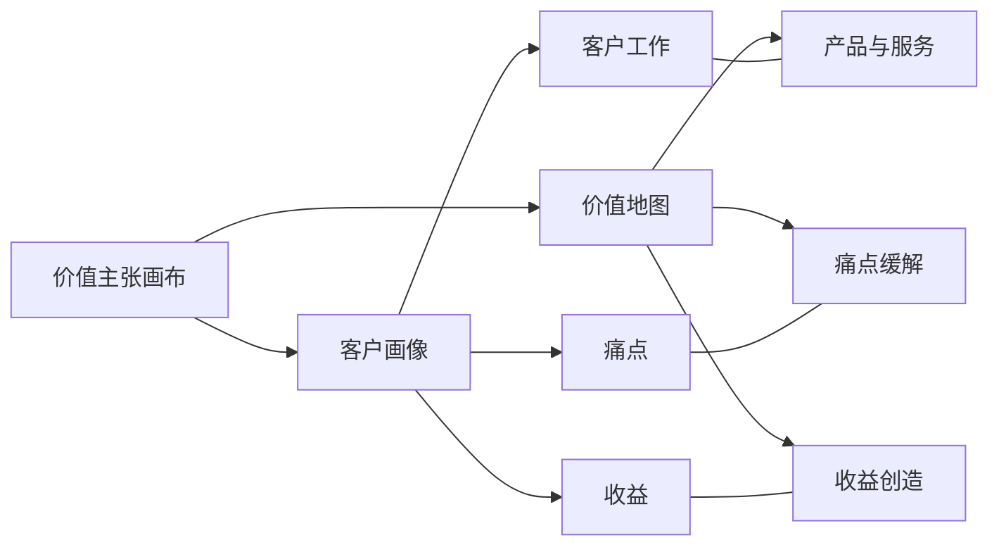
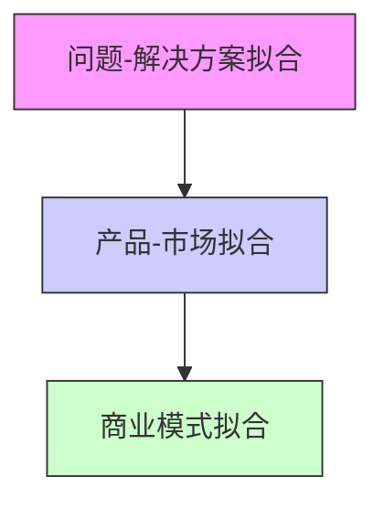
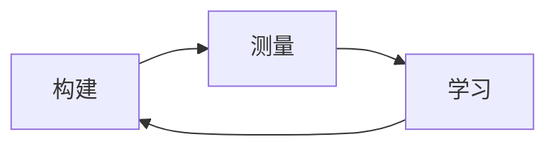

---
{"dg-publish":true,"tags":["商业分析","商业模式","价值主张","客户洞察"],"创建日期":"2024-04-26","permalink":"/知识共享/002_商业分析/01_学习内容/06_商业模式分析/6.2 价值主张设计/","dgPassFrontmatter":true}
---

# 6.2 价值主张设计

> [!quote] 核心要点
> 价值主张设计是商业模式开发中的关键环节，它明确定义了产品或服务为特定客户群体创造的独特价值。本文详细阐述价值主张的概念、设计方法、验证流程，并通过多个案例展示如何创建引人共鸣的价值主张。

## 价值主张的定义与重要性

### 价值主张的概念

价值主张(Value Proposition)是对产品或服务能够为特定客户群体解决的问题或满足的需求的清晰描述，它阐明了为什么客户应该选择你而非竞争对手。

从不同视角看，价值主张有多种定义：

1. **亚历山大·奥斯特瓦德定义**：价值主张描述了特定产品或服务为特定客户群体创造的价值，它解决了客户问题或满足了客户需求。

2. **克莱顿·克里斯坦森定义**：价值主张指明了客户雇佣你的产品或服务来完成的具体工作。

3. **迈克尔·洛夫洛克定义**：价值主张是一个服务承诺，明确表达了服务提供商将为客户提供什么利益，以什么价格和条件提供。

### 价值主张的重要性

强有力的价值主张对企业至关重要，因为它：

1. **指导产品开发**：明确产品应具备哪些功能和特性
2. **聚焦营销策略**：确定如何有效沟通产品的核心价值
3. **差异化竞争**：清晰表达为何客户应选择你而非竞争对手
4. **提高转化率**：让潜在客户更容易理解产品的价值和适用性
5. **促进内部一致**：统一组织内部对产品价值的认知

## 价值主张画布

### 价值主张画布的结构

价值主张画布是由亚历山大·奥斯特瓦德(Alexander Osterwalder)开发的战略管理工具，帮助团队系统化开发价值主张。它包含两大部分：

#### 1. 客户画像(Customer Profile)

- **客户工作(Customer Jobs)**：客户试图完成的任务或满足的需求
  - 功能性工作：完成特定任务
  - 社交性工作：获得社会认可或地位
  - 情感性工作：获得特定的情感体验
  
- **痛点(Pains)**：客户在完成工作中遇到的麻烦、障碍和风险
  - 不良结果、问题和特征
  - 障碍和挑战
  - 风险和负面后果

- **收益(Gains)**：客户期望、渴望或会惊喜的结果和好处
  - 必要收益：没有它解决方案就不起作用
  - 预期收益：我们期望的基本收益
  - 渴望收益：超出期望但非常想要的
  - 意外收益：超出期望和渴望的惊喜

#### 2. 价值地图(Value Map)

- **产品与服务(Products & Services)**：提供给客户的具体产品和服务列表
  
- **痛点缓解(Pain Relievers)**：产品如何缓解客户的特定痛点
  
- **收益创造(Gain Creators)**：产品如何创造客户期望的收益

### 价值主张拟合

价值主张拟合(Value Proposition Fit)是指价值地图与客户画像之间的匹配程度。当你的产品和服务能够有效缓解客户关键痛点并创造客户渴望的收益时，就实现了价值主张拟合。

- **问题-解决方案拟合**：验证客户真正关心的工作、痛点和收益，以及你的产品是否能满足这些需求
- **产品-市场拟合**：验证你的价值主张能否在市场上获得足够多的客户
- **商业模式拟合**：验证你的价值主张能否以可持续和可盈利的方式被交付

## 价值主张设计流程

### 1. 客户洞察收集

**目标**：深入理解目标客户的需求、挑战和期望

**方法**：
- 客户访谈和深度对话
- 民族志研究（观察客户日常行为）
- 调查问卷
- 用户测试和反馈分析
- 社交媒体和评论分析

**要点**：
- 关注客户真实言行，而非假设
- 挖掘隐性需求和未表达的期望
- 收集真实故事和场景，而非抽象概念

### 2. 客户画像构建

**目标**：系统化整理客户洞察，创建全面客户画像

**步骤**：
1. 确定所针对的客户群体
2. 列出客户试图完成的主要工作
3. 识别完成这些工作时遇到的痛点
4. 确定客户期望获得的收益
5. 按重要性排序，找出最关键的元素

**工具**：
- 客户画像模板
- 亲和图分析
- 重要性评分矩阵

### 3. 价值地图开发

**目标**：设计能够匹配客户需求的产品和服务

**步骤**：
1. 列出产品和服务组合
2. 确定产品如何缓解关键客户痛点
3. 描述产品如何创造客户期望的收益
4. 检查痛点缓解和收益创造的覆盖度

**方法**：
- 头脑风暴
- 功能优先级排序
- 价值-复杂度矩阵评估

### 4. 价值主张拟合检查

**目标**：评估价值地图和客户画像的匹配程度

**检查清单**：
- 产品是否解决了最重要的客户工作？
- 是否缓解了客户最严重的痛点？
- 是否创造了客户最看重的收益？
- 价值主张是否有明显差异化？
- 团队是否有能力实现这一价值主张？

### 5. 价值主张优化与表达

**目标**：打磨价值主张并以清晰、有说服力的方式表达

**元素**：
- 简洁标题：概括核心价值
- 副标题：说明目标客户、提供的产品和独特差异
- 3-5个要点：具体说明关键优势和特性
- 视觉元素：强化主要信息

**公式**：
我们帮助【目标客户】
实现/解决【主要工作/问题】
通过【区别于竞争对手的方式】，
从而带来【关键收益】。

## 价值主张验证方法

### 1. 最小可行产品(MVP)测试

**概念**：开发产品最小版本，验证核心价值主张

**方法**：
- 功能原型
- 着陆页测试
- 纸面或视频演示
- "魔法师背后"服务

**指标**：
- 转化率
- 用户反馈与评分
- 保留率
- 推荐意愿

### 2. A/B测试

**概念**：同时测试不同版本的价值主张，比较效果

**适用场景**：
- 标题和信息表达优化
- 功能优先级确定
- 定价策略评估

**实施要点**：
- 只改变一个变量
- 确保样本量足够
- 设定明确成功指标

### 3. 客户反馈循环

**概念**：建立持续的客户反馈机制，不断优化价值主张

**方法**：
- 用户测试与访谈
- 使用数据分析
- 客户支持反馈分析
- 满意度和NPS调查

**流程**：

## 价值主张设计案例分析

### 案例一：Airbnb的价值主张设计

**背景**：Airbnb创立之初需要明确其对房东和旅行者的价值主张

**客户画像分析**：

**房东：**
- **工作**：增加收入、利用闲置空间
- **痛点**：担心陌生人、定价困难、管理麻烦
- **收益**：额外收入、与旅行者交流、房产更有价值

**旅行者：**
- **工作**：寻找住宿、体验当地文化
- **痛点**：酒店价格高、标准化体验、缺乏本地互动
- **收益**：独特体验、价格合理、融入当地

**价值主张设计**：

对房东："轻松地将你的闲置空间变成收入，同时结交来自世界各地的有趣人士。"

对旅行者："住在当地人家里，无论去哪都能找到归属感。以比酒店更实惠的价格获得独特的旅行体验。"

**验证与优化**：
1. 最初在创始人家中测试概念
2. 针对早期用户进行访谈
3. 不断优化平台功能和安全保障
4. 利用用户故事和照片强化价值主张

**结果**：成功构建双边平台，为两类客户提供相互加强的价值主张

### 案例二：Slack的价值主张演变

**背景**：Slack从游戏公司内部工具转变为主流团队协作平台

**初期客户画像**：
- **工作**：团队沟通、信息共享、协作
- **痛点**：邮件沟通低效、信息碎片化、工具切换频繁
- **收益**：信息透明、快速响应、工作流畅

**初期价值主张**：
"团队沟通变得更简单、更愉快且更高效。"

**价值主张演变过程**：
1. 初期强调沟通效率和信息透明
2. 随着功能增加，转向"减少会议和邮件"
3. 进一步发展为"团队协作的中央枢纽"
4. 最终演变为"业务流程的操作系统"

**当前价值主张**：
"Slack让工作更简单、更愉快、更高效。它是团队共同工作的工作流平台，将人员、数据和应用程序整合在一起，帮助团队更有效地工作，无论他们身在何处。"

**成功因素**：
- 不断根据用户反馈调整价值主张
- 通过产品体验强化价值主张
- 创造具有情感连接的品牌个性

### 案例三：特斯拉的价值主张设计

**背景**：特斯拉需要改变电动汽车的传统认知，从环保但性能差转变为高性能科技产品

**客户画像**：
- **工作**：展示个人品味、获得高品质驾驶体验、减少环境影响
- **痛点**：传统电动车续航短、充电麻烦、性能差、设计古板
- **收益**：炫酷设计、卓越性能、科技感、环保形象

**价值主张设计**：
"无需妥协的电动车：惊人的性能、前沿科技、令人惊叹的设计，同时还对环境友好。"

**价值主张表达方式**：
1. 先推出高端跑车Roadster，颠覆电动车形象
2. 强调加速性能（"比保时捷911还快"）
3. 将软件更新和自动驾驶等科技特性放在中心位置
4. 环保因素作为附加而非主要卖点

**差异化策略**：
- 不与其他电动车比较，而是与高端燃油车对标
- 突出全栈创新：车辆、能源、软件生态系统
- 塑造未来感和科技先锋形象

**结果**：成功改变了消费者对电动车的认知，创造了强大的品牌溢价和忠诚度

## 价值主张设计常见问题与解决方案

### 1. 价值主张过于宽泛

**问题**：试图满足所有人，结果无法真正打动任何人

**解决方案**：
- 严格定义目标客户群体
- 聚焦解决2-3个最关键的痛点
- 使用"我们不是..."来明确定位

### 2. 缺乏差异化

**问题**：价值主张与竞争对手过于相似

**解决方案**：
- 进行竞争分析，找出竞争空白
- 寻找独特组合而非单一差异
- 考虑非传统竞争维度（如情感连接）

### 3. 无法兑现承诺

**问题**：价值主张过度承诺，产品无法实现

**解决方案**：
- 诚实评估产品能力
- 优先开发核心价值功能
- 设定明确的产品路线图

### 4. 传达方式不清晰

**问题**：价值表达复杂，客户难以理解

**解决方案**：
- 使用简单、具体的语言
- 采用比喻和类比解释复杂概念
- 添加视觉元素强化关键信息

### 5. 缺乏持续验证

**问题**：价值主张基于假设而非验证

**解决方案**：
- 建立持续测试框架
- 定期收集客户反馈
- 根据市场变化调整价值主张

## 价值主张在不同行业的应用

| 行业 | 重点关注 | 常见差异化点 | 案例 |
|------|----------|--------------|------|
| SaaS | 节省时间/成本、提高效率 | 易用性、集成能力、数据安全 | Salesforce："销售云端化" |
| 零售业 | 购物体验、产品选择 | 价格、便利性、个性化 | 亚马逊："一站式购物体验" |
| 医疗健康 | 健康成果、安全可靠 | 专业性、个性化护理、可及性 | Mayo Clinic："需要完整解决方案的复杂健康问题" |
| 教育 | 学习成果、职业发展 | 教学方法、灵活性、认证价值 | Coursera："世界一流大学的课程，随时随地学习" |
| 金融服务 | 安全性、收益率、便利性 | 费率、服务、技术创新 | Robinhood："免佣金投资，让每个人都能投资" |

## 价值主张设计练习

### 练习一：客户画像构建

尝试为以下场景构建客户画像：
1. 为忙碌的职场父母设计的膳食配送服务
2. 为小型企业设计的财务管理软件
3. 为环保意识强的千禧一代设计的时尚产品

对每个场景，回答：
- 客户试图完成哪些工作？按功能性、社交性和情感性分类
- 客户面临哪些最主要的痛点？
- 客户期望获得哪些收益？

### 练习二：价值主张表达

为下列产品重写价值主张：
1. 健身追踪应用
2. 在线语言学习平台
3. 共享办公空间

使用以下公式：
我们帮助【目标客户】
实现/解决【主要工作/问题】
通过【区别于竞争对手的方式】，
从而带来【关键收益】。

### 练习三：价值主张拟合检查

检查以下价值主张与客户需求的拟合度：

**产品**：高端智能家居系统
**价值主张**："让您的家变得更智能、更安全、更节能"
**目标客户**：30-45岁高收入科技爱好者

评估：
- 这一价值主张是否解决了目标客户的真正需求？
- 它是否具有足够的差异化？
- 如何改进这一价值主张？

## 进阶学习资源

### 书籍推荐
1. 《价值主张设计》- 亚历山大·奥斯特瓦德
2. 《对用户有价值》- 梅丽莎·佩里
3. 《被雇佣的产品》- 克莱顿·克里斯坦森
4. 《定位》- 艾尔·里斯和杰克·特劳特
5. 《商业模式新生代》- 亚历山大·奥斯特瓦德

### 在线资源
1. Strategyzer价值主张画布工具
2. IDEO Design Kit方法库
3. Nielsen Norman Group用户研究指南
4. Harvard Business Review价值主张系列文章

## 相关概念关联

- [[知识共享/002_商业分析/01_学习内容/06_商业模式分析/6.1 商业模式画布\|6.1 商业模式画布]] - 了解价值主张在整体商业模式中的位置
- [[知识共享/002_商业分析/01_学习内容/06_商业模式分析/6.3 收入模式分析\|6.3 收入模式分析]] - 探索如何将价值主张转化为收入
- [[知识共享/002_商业分析/01_学习内容/05_用户与需求分析/5.2 用户画像构建\|5.2 用户画像构建]] - 深入学习客户画像构建方法
- [[知识共享/002_商业分析/01_学习内容/05_用户与需求分析/5.3 需求捕获与分析\|5.3 需求捕获与分析]] - 掌握需求分析技术，支持价值主张设计
- [[知识共享/002_商业分析/01_学习内容/04_市场与竞争分析/4.2 竞争对手分析\|4.2 竞争对手分析]] - 了解如何创建差异化的价值主张 