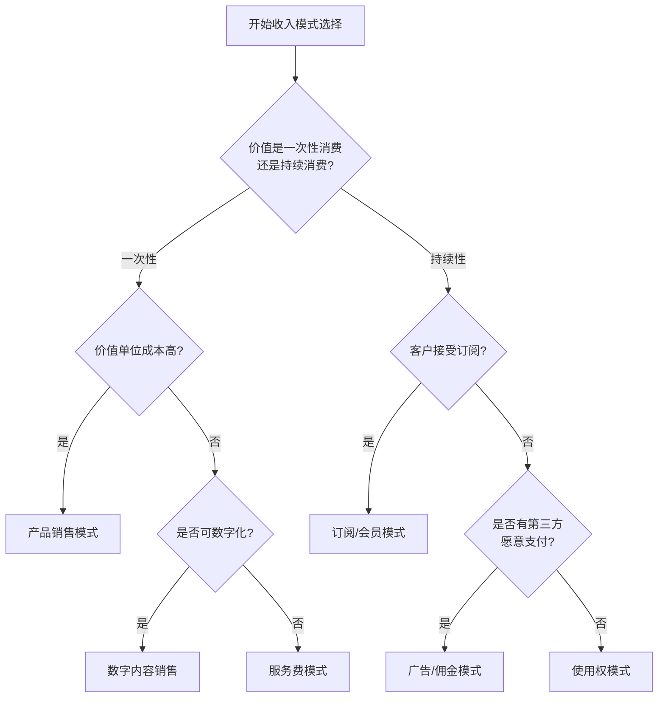

---
{"dg-publish":true,"tags":["商业分析","收入模式","定价策略","收入流"],"创建日期":"2024-05-20","permalink":"/知识共享/002_商业分析/01_学习内容/06_商业模式分析/6.3 收入模式分析/","dgPassFrontmatter":true}
---

# 6.3 收入模式分析

> [!quote] 概述
> 本文详细介绍收入模式分析的核心概念、类型分类、设计方法和评估框架。收入模式是商业模式的关键组成部分，定义了企业如何从价值创造中获取经济回报。通过系统化分析不同收入模式的特点、适用场景和演化趋势，帮助商业分析师更有效地设计和评估企业的收入战略。

## 1. 收入模式基础

### 1.1 收入模式的定义与重要性

收入模式(Revenue Model)是商业模式中描述企业如何从其客户或合作伙伴那里获取经济价值的组成部分，它定义了价值交换的机制和结构。

**收入模式的核心定义**：

根据商业模式理论，收入模式是"企业将价值主张转化为经济回报的机制体系，包括定价机制、付费方式和收入来源的组合"。

**收入模式与商业模式的关系**：

收入模式是商业模式的关键组成部分，但不等同于商业模式。商业模式描述的是整体的价值创造、传递和获取系统，而收入模式专注于价值获取的经济机制。

**收入模式的战略意义**：

1. **价值捕获**：将创造的价值转化为可持续的财务回报
2. **竞争差异化**：创新的收入模式可成为竞争优势来源
3. **客户关系塑造**：影响与客户的互动频率和深度
4. **投资吸引力**：直接影响现金流预测和企业估值
5. **业务扩展路径**：影响企业规模扩张和多元化的方向

### 1.2 收入模式的基本类型

收入模式可以按照多种维度进行分类，了解不同类型有助于全面思考收入可能性：

**按价值交换时机分类**：

1. **一次性交易模式**
   - 特点：单次完成的价值交换
   - 示例：产品销售、单次服务费
   - 优势：现金流前置、客户决策简单
   - 挑战：客户获取成本高、收入波动性大

2. **持续性交易模式**
   - 特点：建立长期价值交换关系
   - 示例：订阅费、会员费、租赁费
   - 优势：收入可预测、客户关系深化
   - 挑战：前期投资大、现金流延迟

**按定价机制分类**：

1. **固定定价模式**
   - 特点：价格预先确定且相对固定
   - 示例：标准零售价、目录价格
   - 优势：简单透明、管理成本低
   - 挑战：缺乏灵活性、定价效率低

2. **动态定价模式**
   - 特点：价格根据市场条件或客户特征调整
   - 示例：拍卖、收益管理、算法定价
   - 优势：价格优化、利润最大化
   - 挑战：实施复杂、客户感知公平性

**按收入来源分类**：

1. **直接收入模式**
   - 特点：直接从最终用户获取收入
   - 示例：产品销售、服务费
   - 优势：价值链简洁、控制力强
   - 挑战：单一依赖客户支付意愿

2. **间接收入模式**
   - 特点：从第三方获取收入
   - 示例：广告模式、佣金模式
   - 优势：降低用户付费门槛
   - 挑战：价值捕获效率可能较低

**按价值衡量基础分类**：

1. **资产转让模式**
   - 特点：转让资产所有权
   - 示例：产品销售、知识产权转让
   - 优势：交易明确、责任边界清晰
   - 挑战：一次性收入、持续关系有限

2. **使用权模式**
   - 特点：提供资产使用权而非所有权
   - 示例：租赁、订阅、许可
   - 优势：重复收入、资产控制
   - 挑战：前期收益较低、资产管理负担

3. **使用结果模式**
   - 特点：根据使用结果或价值收费
   - 示例：绩效付费、分成模式
   - 优势：与客户利益一致
   - 挑战：收入预测难度高、验证结果复杂

## 2. 主要收入模式详解

### 2.1 传统收入模式

**产品销售模式**：
- **核心机制**：一次性转让产品所有权
- **应用行业**：零售、制造、消费品
- **关键指标**：销售量、平均售价、毛利率
- **成功因素**：产品差异化、渠道效率、库存管理
- **典型案例**：宜家、苹果、耐克

**服务费模式**：
- **核心机制**：按服务内容和时间收费
- **应用行业**：咨询、法律、医疗、教育
- **关键指标**：小时费率、利用率、客户留存
- **成功因素**：专业声誉、服务质量、客户关系
- **典型案例**：麦肯锡、普华永道、律师事务所

**租赁/许可模式**：
- **核心机制**：提供资产使用权，保留所有权
- **应用行业**：房地产、设备、软件、内容
- **关键指标**：资产利用率、合同期限、续约率
- **成功因素**：资产质量、维护服务、客户体验
- **典型案例**：赫兹租车、甲骨文许可软件

**特许经营模式**：
- **核心机制**：授权使用商业系统与品牌
- **应用行业**：餐饮、零售、服务业
- **关键指标**：特许权费、加盟数量、合规率
- **成功因素**：标准化体系、品牌价值、加盟支持
- **典型案例**：麦当劳、希尔顿、7-11

### 2.2 数字经济收入模式

**订阅模式**：
- **核心机制**：定期固定付费获取持续产品/服务
- **应用行业**：软件、内容、服务、实物产品
- **关键指标**：月活用户、续订率、客户生命周期价值
- **成功因素**：持续价值提供、便捷体验、有效计费
- **典型案例**：Netflix、Spotify、Adobe Creative Cloud

**免费增值模式(Freemium)**：
- **核心机制**：基础功能免费，高级功能付费
- **应用行业**：软件、游戏、内容平台
- **关键指标**：转化率、ARPU、免费用户价值
- **成功因素**：基础版价值、升级诱因、定价层次
- **典型案例**：Dropbox、Slack、Spotify

**市场平台/佣金模式**：
- **核心机制**：促成第三方交易并收取佣金
- **应用行业**：电商、共享经济、金融服务
- **关键指标**：交易总额、佣金率、活跃卖家数
- **成功因素**：网络效应、信任机制、流量获取
- **典型案例**：亚马逊市场、Airbnb、eBay

**广告模式**：
- **核心机制**：通过用户注意力货币化
- **应用行业**：媒体、搜索引擎、社交网络
- **关键指标**：用户规模、停留时间、广告效果
- **成功因素**：精准定向、用户体验平衡、数据洞察
- **典型案例**：Google、Facebook、传统媒体

**按使用付费模式**：
- **核心机制**：根据实际使用量付费
- **应用行业**：云服务、通信、能源
- **关键指标**：用量增长率、单位成本、客户扩展率
- **成功因素**：计量准确、价格透明、规模效应
- **典型案例**：AWS、Azure、公用事业

### 2.3 新兴创新收入模式

**数据变现模式**：
- **核心机制**：收集数据并通过分析或销售获利
- **应用行业**：数据服务、市场研究、技术平台
- **关键指标**：数据质量、客户覆盖、更新频率
- **成功因素**：数据独特性、分析能力、隐私合规
- **典型案例**：彭博、Factset、数据经纪商

**API经济模式**：
- **核心机制**：通过API访问收费
- **应用行业**：金融科技、地图服务、AI服务
- **关键指标**：API调用量、开发者数量、整合深度
- **成功因素**：API可靠性、开发者支持、价值证明
- **典型案例**：Stripe、Twilio、Google Maps API

**众筹/社区支持模式**：
- **核心机制**：从支持者获取资金支持
- **应用行业**：创意项目、开源软件、内容创作
- **关键指标**：支持者数量、平均贡献额、完成率
- **成功因素**：社区连接、透明度、价值承诺
- **典型案例**：Kickstarter、Patreon、开源捐赠

**代币化/NFT模式**：
- **核心机制**：通过数字资产所有权获利
- **应用行业**：艺术、游戏、数字内容
- **关键指标**：交易量、社区规模、价值稳定性
- **成功因素**：稀缺性机制、实用性、生态系统
- **典型案例**：NBA Top Shot、艺术NFT平台

## 3. 收入模式设计与分析

### 3.1 收入模式选择框架

系统化的收入模式选择需要考虑多个关键因素：

**收入模式适配性评估矩阵**：

| 考量因素 | 评估问题 | 高度适合特征 | 不适合特征 |
|---------|---------|------------|-----------|
| **价值特性** | 价值如何被消费？ | 使用型价值→订阅 一次性价值→销售 | 一次性价值→订阅 持续价值→单次销售 |
| **客户特征** | 客户支付能力和意愿？ | 高支付能力→直接收费 低支付能力→间接收入 | 低支付能力→高价模式 价格敏感度高→单一定价 |
| **行业惯例** | 行业内通行做法？ | 符合行业惯例→摩擦小 创新模式→差异化 | 过度偏离惯例→采用障碍 完全跟随→缺乏差异 |
| **竞争态势** | 竞争对手如何收费？ | 差异化机会→创新模式 激烈价格竞争→替代模式 | 模仿竞争对手→无差异 激进定价→价格战 |
| **成本结构** | 固定成本与边际成本比例？ | 高固定成本→订阅/会员 高边际成本→按量付费 | 高边际成本→免费模式 资源密集→轻资产模式 |
| **增长目标** | 增长优先还是利润优先？ | 增长优先→低门槛/免费增值 利润优先→高价值定位 | 增长目标→高定价壁垒 利润目标→低价争夺份额 |
| **现金流需求** | 前期资金需求？ | 资金需求大→预付费模式 现金充足→延期收费 | 资金紧张→延期收费 前期投入大→单次支付 |

**收入模式选择决策树**：

### 3.2 多元化收入模式设计

单一收入模式往往无法最大化价值捕获，多元化收入组合日益重要：

**收入多元化策略**：

1. **垂直多元化**：在同一客户旅程中创建多个收入点
   - 例：基础产品+增值服务+维护合同
   - 案例：汽车(销售+融资+保险+维修)

2. **水平多元化**：针对不同客户群创建差异化收入模式
   - 例：免费用户(广告)+专业用户(订阅)
   - 案例：Spotify(广告支持版+高级订阅版)

3. **混合定价机制**：结合多种定价方法优化价值捕获
   - 例：基础订阅+按使用付费超额
   - 案例：AWS(预留实例+按需实例+节点组)

4. **生态系统收入**：构建互补产品/服务的收入网络
   - 例：核心平台+配件+内容+服务
   - 案例：苹果(硬件+App Store+服务订阅)

**多元化收入组合示例**：

| 企业 | 主要收入模式 | 辅助收入模式 | 新兴收入模式 |
|------|------------|------------|------------|
| **亚马逊** | 产品销售 | AWS云服务 Prime会员 | 广告 内容制作 |
| **微软** | 软件销售/订阅 | 云服务 设备销售 | 游戏内购 教育服务 |
| **苹果** | 设备销售 | 服务订阅 应用分成 | 金融服务 健康服务 |
| **谷歌** | 搜索广告 | 云服务 YouTube广告 | 硬件销售 订阅服务 |

### 3.3 收入模式演化管理

收入模式不是静态的，需要随业务环境变化而演进：

**收入模式演化驱动因素**：

1. **客户期望变化**：客户支付偏好和价值认知的改变
2. **技术进步**：新的交易、计量和支付技术
3. **竞争压力**：竞争对手创新收入模式的响应
4. **规模变化**：业务规模扩大带来的经济效应
5. **监管环境**：税收、消费者保护等法规变化

**收入模式转型路径**：

1. **渐进式转型**：保留旧模式同时引入新模式
   - 例：软件行业从永久许可向订阅过渡
   - 案例：Adobe Creative Suite → Creative Cloud

2. **分段转型**：对不同客户群分别采用不同转型策略
   - 例：新客户新模式，老客户可选择
   - 案例：微软Office向365转型策略

3. **平行测试**：在小范围市场测试新收入模式
   - 例：特定地区或客户段先行试点
   - 案例：Netflix在不同国家的定价模式实验

4. **激进转型**：完全替换旧模式，快速切换到新模式
   - 例：一次性切换到新的收入模式
   - 案例：《堡垒之夜》从付费到免费+内购模式

**转型风险管理**：
- **收入断崖风险**：大多数订阅转型会经历"收入低谷"
- **客户抵抗**：沟通策略和价值证明至关重要
- **内部阻力**：销售激励和绩效衡量需要调整
- **系统改造**：计费、会计和报告系统需要适应

## 4. 行业案例分析

### 4.1 软件行业：从许可到订阅的转变

**背景**：软件行业在2010年代经历了从永久许可向订阅模式的根本性转变。

**收入模式对比**：

| 特征 | 永久许可模式 | 订阅模式(SaaS) |
|------|------------|--------------|
| **前期收入** | 高(全额许可费) | 低(首月/首年费用) |
| **长期收入** | 升级收入不确定 | 稳定可预测的续订收入 |
| **开发节奏** | 大型发布周期(1-3年) | 持续更新(周/月级) |
| **客户关系** | 交易导向，间歇性接触 | 持续关系，经常互动 |
| **价值体现** | 软件所有权 | 持续访问与改进 |
| **现金流特点** | 波动性大，季度末集中 | 平滑，可预测，递延确认 |

**转型案例：Adobe**

**转型背景**：
- 2012年，Adobe宣布转向Creative Cloud订阅模式
- 传统Creative Suite采用永久许可+周期性升级模式
- 面临盗版挑战和开发周期压力

**转型策略**：
- 同时提供CS6(最终永久版)和CC订阅选项
- 为现有客户提供特别过渡定价
- 不断增加CC专属功能，提高订阅价值
- 创建专业版和完整版不同层级选项

**转型结果**：
- 初期股价下跌，投资者担忧收入断崖
- 2013-2015年经历"收入低谷"
- 2016年后收入和利润开始大幅增长
- 2021年，订阅收入占总收入90%以上
- 客户终身价值显著提升

**关键经验**：
- 从产品思维转向服务思维是核心转变
- 转型沟通和客户教育至关重要
- 持续价值交付是订阅成功的关键
- 企业必须有足够财务缓冲度过转型期

### 4.2 游戏行业：多元收入模式创新

**背景**：游戏行业经历了从单一产品销售到多种创新收入模式的进化。

**收入模式演变**：

| 时期 | 主导收入模式 | 代表游戏 | 特点 |
|------|------------|---------|------|
| 1970-90年代 | 街机投币模式 | 街机游戏 | 按次付费，低单价高频率 |
| 1980-2000年代 | 一次性销售 | 主机/PC游戏 | 前期开发成本高，一次性回收 |
| 2000-2010年代 | 订阅模式 | MMO游戏 (魔兽世界) | 持续内容更新，稳定收入流 |
| 2010年代至今 | 免费+内购 | 手游，部分PC/主机游戏 | 低门槛，基于参与度的变现 |
| 2010年代至今 | 季票/战令 | 《堡垒之夜》 《英雄联盟》 | 定期内容更新，推动参与 |
| 近年来 | 跨媒体生态系统 | 《英雄联盟》 《精灵宝可梦》 | 游戏+电竞+周边+媒体内容 |

**案例分析：堡垒之夜(Fortnite)**

**收入模式策略**：
- 基础游戏完全免费，无游戏内优势付费
- 收入来源于纯装饰性物品和战令系统
- 季节性战令提供有限时间内容获取路径
- 品牌合作和IP联动创造独特内容
- 跨平台生态系统最大化参与度

**关键数据**：
- 2018-2021年间年收入超过50亿美元
- 活跃玩家超过3.5亿，月活跃用户8000万+
- 平均每活跃用户花费约58美元(远高于行业平均)
- 战令+直接购买约各占一半收入

**成功因素**：
- 免费入口极大扩展了用户基础
- 社交元素和文化相关性增强用户黏性
- 常规更新和事件创造持续参与理由
- 没有"付费墙"或"赢家通吃"机制
- 强调自我表达和社交地位而非游戏优势

## 5. 收入模式趋势与未来展望

### 5.1 收入模式新兴趋势

当前塑造未来收入模式的关键趋势：

1. **超个性化定价**
   - 基于AI和数据分析的个性化价格
   - 价值感知驱动的动态定价
   - 用户特定的产品和价格组合

2. **成果导向模式增长**
   - 从产品/服务销售转向成果交付
   - 风险共担和成功共享模式
   - 价值实现证明要求增加

3. **跨界生态系统收入**
   - 捆绑互补产品和服务
   - 生态系统货币化(Apple vs Google)
   - 会员模式覆盖多种不同服务

4. **订阅疲劳与细分应对**
   - 用户对订阅过载的反感
   - 微订阅和按需选项增加
   - 层级和模块化定价结构

5. **隐私与数据变现平衡**
   - 第三方cookie消失的影响
   - 第一方数据战略更加重要
   - 透明度和用户控制需求增加

### 5.2 Web3和元宇宙收入模式

新兴技术环境中的收入模式创新：

**Web3收入模式创新**：
- **代币化所有权**：将数字和物理资产转化为可交易令牌
- **分数所有权**：高价值资产的部分所有权变现
- **DAO经济**：去中心化自治组织的收入协议
- **使用者即赚取者**：Play-to-Earn和Learn-to-Earn模式
- **创作者直接收益**：中间商减少的创作者经济

**元宇宙潜在收入模式**：
- **虚拟土地和空间**：数字房地产租赁和销售
- **数字身份和形象**：化身和虚拟服装收费
- **虚实跨界商务**：物理产品与数字体验融合
- **体验收费**：独特虚拟体验和活动门票
- **注意力和存在变现**：基于虚拟存在和互动的新型广告

### 5.3 可持续收入模式设计

设计长期可持续收入模式的原则：

**可持续收入模式的关键原则**：

1. **价值互惠**：确保企业和客户都从交易中受益
2. **透明诚实**：清晰传达价值与成本关系
3. **长期视角**：避免短期收入最大化损害长期关系
4. **韧性设计**：能够适应市场和技术变化
5. **简单性**：易于理解和管理的收入结构
6. **公平分配**：在生态系统中合理分配价值
7. **资源效率**：最小化收入获取的资源消耗

**收入模式伦理考量**：
- **暗模式与操纵**：避免欺骗性收入策略
- **上瘾设计**：平衡参与和负责任使用
- **包容性**：考虑不同社会经济群体的可访问性
- **环境影响**：考虑收入模式对资源使用的影响
- **数据责任**：尊重用户数据权利和隐私

## 6. 思考与练习

1. 分析一个你熟悉的企业，绘制其收入来源构成图，并评估各收入流的增长潜力和风险。

2. 为一个传统产品设计一个订阅模式转型计划，包括定价策略、过渡计划和风险管理措施。

3. 选择一个行业，比较该行业中领先企业的收入模式差异。这些差异如何反映它们的战略定位？

4. 思考你经常使用的一项订阅服务。为什么你愿意持续付费？服务提供商如何提高你的终身价值？

5. 为一个假设的元宇宙创业公司设计创新收入模式，并讨论其可行性和潜在挑战。

## 7. 延伸资源

### 7.1 推荐书籍

- Tzuo, T., & Weisert, G. (2018). *Subscribed: Why the Subscription Model Will Be Your Company's Future - and What to Do About It*
- Osterwalder, A., & Pigneur, Y. (2010). *Business Model Generation*
- Kumar, V. (2014). *Profitable Customer Engagement: Concept, Metrics and Strategies*
- Warrillow, J. (2015). *The Automatic Customer: Creating a Subscription Business in Any Industry*
- Simon, H. (2015). *Confessions of the Pricing Man: How Price Affects Everything*

### 7.2 相关工具和资源

- **收入模式设计工具**：Strategyzer Business Model Canvas
- **订阅指标追踪**：ChartMogul, ProfitWell, Baremetrics
- **定价优化工具**：Price Intelligently, Pricefx
- **收入分析平台**：Zuora, Chargebee, Recurly
- **趋势研究资源**：Subscription Economy Index, Gartner商业模式研究

## 8. 相关概念链接

- [[知识共享/002_商业分析/01_学习内容/06_商业模式分析/6.1 商业模式画布\|06_商业模式分析/6.1 商业模式画布]]
- [[知识共享/002_商业分析/01_学习内容/06_商业模式分析/6.2 价值主张设计\|06_商业模式分析/6.2 价值主张设计]]
- [[知识共享/002_商业分析/01_学习内容/06_商业模式分析/6.4 成本结构分析\|06_商业模式分析/6.4 成本结构分析]]
- [[知识共享/002_商业分析/01_学习内容/06_商业模式分析/6.5 商业模式创新\|06_商业模式分析/6.5 商业模式创新]]
- [[知识共享/002_商业分析/01_学习内容/04_市场与竞争分析/4.1 市场分析框架\|04_市场与竞争分析/4.1 市场分析框架]] 