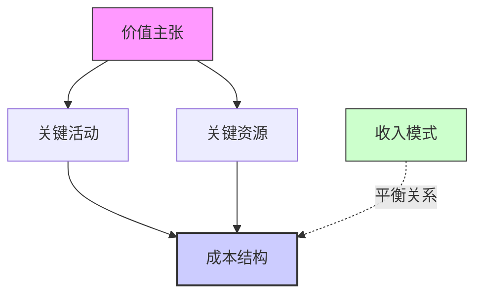
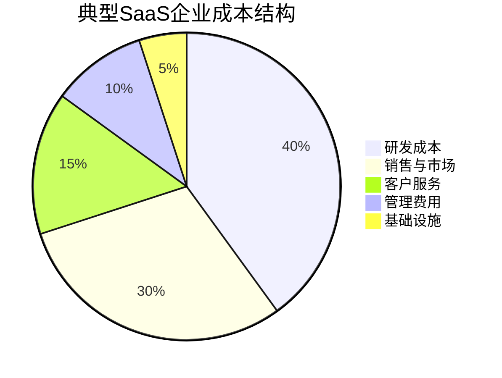
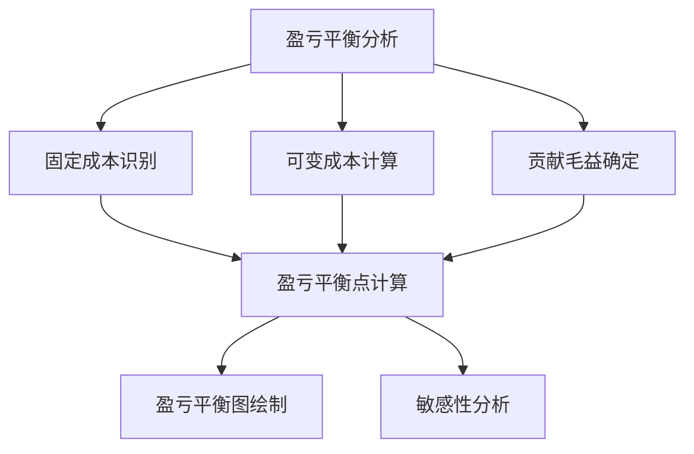
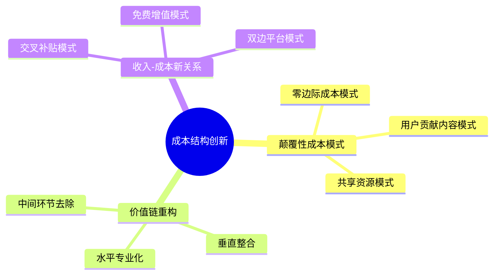

---
{"dg-publish":true,"tags":["商业分析","商业模式","成本结构","财务分析"],"创建日期":"2024-04-26","permalink":"/知识共享/002_商业分析/01_学习内容/06_商业模式分析/6.4 成本结构分析/","dgPassFrontmatter":true}
---

# 6.4 成本结构分析

> [!quote] 核心要点
> 成本结构分析是商业模式设计的关键组成部分，它关注企业运营所产生的各类成本及其相互关系。本文系统阐述成本结构的类型、分析方法和优化策略，帮助您理解如何构建与企业价值主张和收入模式匹配的成本结构。

## 成本结构的基本概念

### 成本结构定义

成本结构(Cost Structure)是指企业在执行商业模式过程中发生的所有费用的组合与分布。它回答了"企业为创造和交付价值而产生哪些成本"的问题，是商业模式画布的九大要素之一。

从不同角度理解成本结构：

1. **商业模式视角**：成本结构反映了企业如何分配资源以实现其价值主张和运营活动
2. **财务管理视角**：成本结构展示了企业费用的分类、比例和行为特征
3. **战略决策视角**：成本结构体现了企业在成本效率与价值创造之间的战略选择

### 成本结构与商业模式的关系

成本结构与商业模式其他要素的关系：
- **与价值主张的关系**：价值主张决定了企业需要投入哪些资源和活动，进而影响成本结构
- **与关键活动的关系**：关键活动直接产生相应成本，是成本结构的主要来源
- **与关键资源的关系**：获取和维护关键资源需要成本投入
- **与收入模式的关系**：收入与成本的平衡决定了商业模式的盈利能力
- **与客户细分的关系**：服务不同客户群体可能需要不同的成本投入

## 成本结构的分类与特征

### 成本驱动型 vs 价值驱动型

#### 成本驱动型商业模式(Cost-driven)
- **定义**：以尽可能降低成本为核心目标的商业模式
- **特点**：精简价值主张、高度自动化、广泛外包
- **代表企业**：低成本航空公司、折扣零售商、共享单车
- **案例**：西南航空通过单一机型、点对点航线和快速周转，实现成本领先

#### 价值驱动型商业模式(Value-driven)
- **定义**：专注于创造高价值、高质量产品或服务的商业模式
- **特点**：高度个性化、优质服务、高端品牌
- **代表企业**：豪华酒店、高级时装品牌、定制服务提供商
- **案例**：四季酒店通过个性化服务和奢华设施创造卓越客户体验，溢价能力强

### 固定成本 vs 可变成本

#### 固定成本(Fixed Costs)
- **定义**：不随产出或销售量变化的成本
- **特点**：短期内保持不变，长期可能调整
- **例子**：租金、保险费、设备折旧、基本工资

#### 可变成本(Variable Costs)
- **定义**：随产出或销售量变化而变化的成本
- **特点**：与活动水平成正比
- **例子**：原材料、销售佣金、按件计酬的劳动力

### 规模经济 vs 范围经济

#### 规模经济(Economies of Scale)
- **定义**：随着产出增加，单位成本下降的特性
- **产生原因**：固定成本分摊、批量采购折扣、专业化分工
- **案例**：亚马逊通过大规模运营降低物流和IT基础设施单位成本

#### 范围经济(Economies of Scope)
- **定义**：通过多元化产品或服务，共享资源降低总体成本
- **产生原因**：资源共享、交叉销售、协同效应
- **案例**：迪士尼通过IP跨多个业务线(电影、主题公园、玩具)创造范围经济

## 成本结构分析方法

### 成本构成分析

#### 成本细分与占比分析
1. **识别所有成本项**：列出企业运营所有直接和间接成本
2. **分类整理**：按性质、功能或业务线对成本进行分类
3. **计算占比**：分析各类成本在总成本中的比例
4. **横向对比**：与行业标准或竞争对手进行比较

#### 成本结构可视化
使用饼图、瀑布图等可视化工具展示成本构成：

### 成本动因分析

成本动因(Cost Driver)是影响成本水平和变化的因素，分析成本动因可以帮助理解成本变化规律。

#### 主要成本动因类型：

1. **结构性动因**：与企业规模、范围、技术相关
   - 规模大小
   - 经验曲线
   - 技术复杂度
   - 资本密集度

2. **执行性动因**：与企业运营效率相关
   - 员工参与度
   - 质量管理
   - 产能利用率
   - 供应链效率

3. **活动动因**：与特定业务活动相关
   - 交易次数
   - 客户数量
   - 产品复杂度
   - 服务频率

#### 成本动因分析流程：

1. **识别关键成本项**：确定最重要的成本类别
2. **确定每项成本的动因**：分析什么因素影响这些成本
3. **量化动因影响**：测量动因变化对成本的影响程度
4. **建立成本预测模型**：基于动因预测未来成本变化

### 边际成本分析

边际成本(Marginal Cost)是指增加一个单位产品或服务所增加的成本。

#### 边际成本计算与应用：

1. **计算方法**：边际成本 = 总成本变化量 ÷ 产出变化量
2. **定价决策**：边际成本是最低定价边界的参考
3. **扩张决策**：评估增加产量的经济性
4. **数字产品特点**：许多数字产品具有极低的边际成本，可能接近零

### 盈亏平衡分析

盈亏平衡分析(Break-even Analysis)用于确定企业实现收支平衡所需的销售量或收入。

#### 盈亏平衡分析步骤：

1. **确定固定成本总额**
2. **计算单位贡献毛益**：单价 - 单位可变成本
3. **计算盈亏平衡点**：固定成本总额 ÷ 单位贡献毛益
4. **绘制盈亏平衡图**：展示不同销售量下的成本、收入和利润关系

### 生命周期成本分析

生命周期成本分析(Life Cycle Cost Analysis)考虑产品或服务从开发到退出市场的全部成本。

#### 生命周期阶段成本：

1. **研发阶段**：研究、设计、原型开发、测试成本
2. **导入阶段**：生产准备、市场导入、初始营销成本
3. **成长阶段**：产能扩张、渠道建设、品牌建设成本
4. **成熟阶段**：维护、优化、品质改进成本
5. **衰退阶段**：库存清理、产品退市、替代产品切换成本

#### 分析价值：
- 全面评估产品盈利能力
- 识别不同阶段的成本优化机会
- 指导定价和产品淘汰决策

## 不同商业模式的典型成本结构

### 制造业成本结构

**典型成本项**：
- 原材料成本(30-60%)
- 直接人工成本(10-30%)
- 制造间接费用(10-20%)
- 研发成本(5-15%)
- 销售与市场费用(5-15%)
- 管理费用(5-10%)

**特点**：
- 直接材料成本占比高
- 规模经济效应显著
- 固定资产投入大
- 库存管理成本重要

### 零售业成本结构

**典型成本项**：
- 商品成本(60-80%)
- 店面租金(5-20%)
- 人工成本(10-15%)
- 物流费用(3-8%)
- 营销费用(2-10%)
- 管理费用(3-7%)

**特点**：
- 商品成本占主导
- 位置成本(租金)关键
- 季节性库存管理成本
- 线上与线下成本结构差异大

### SaaS模式成本结构

**典型成本项**：
- 研发成本(30-50%)
- 销售与市场费用(25-40%)
- 客户成功/支持(10-20%)
- 云基础设施(5-15%)
- 管理费用(5-10%)

**特点**：
- 高固定成本、低可变成本
- 研发投入占比大
- 获客成本(CAC)关键
- 边际成本接近零

### 平台模式成本结构

**典型成本项**：
- 技术基础设施(25-40%)
- 产品开发(20-35%)
- 营销与获客(15-30%)
- 支持运营(10-15%)
- 管理费用(5-10%)

**特点**：
- 早期获客成本高
- 规模经济效应极强
- 网络效应降低边际成本
- 质量监控与平台治理成本

## 成本结构优化策略

### 基于价值链的成本优化

**方法**：分析企业价值链各环节的成本，识别优化机会

**价值链成本优化路径**：

1. **采购优化**
   - 供应商整合与战略合作
   - 批量采购与长期协议
   - 供应商竞争性招标

2. **运营优化**
   - 精益生产与消除浪费
   - 流程标准化与自动化
   - 质量提升降低返工

3. **物流优化**
   - 仓储网络优化
   - 配送路线规划
   - 库存水平管理

4. **销售优化**
   - 渠道效率提升
   - 数字化营销
   - 客户获取成本降低

### 固定成本与可变成本重构

**策略**：根据业务特点调整固定与可变成本比例

**固变结构优化方向**：

1. **固定转可变**
   - 外包非核心功能
   - 租赁替代购买
   - 按需付费模式
   - 成果导向合作

2. **可变转固定**
   - 关键资源内部化
   - 技术自动化替代人工
   - 长期采购协议锁定价格
   - 规模扩张摊薄固定成本

**案例**：
- Adobe从一次性购买软件转为订阅模式，实现收入可预测性
- 亚马逊AWS提供按需计算资源，帮助客户将IT固定成本转为可变成本

### 数字化与自动化策略

**核心**：利用技术降低人工干预和手动操作成本

**数字化优化方向**：

1. **流程自动化**
   - 机器人流程自动化(RPA)
   - 工作流程自动化
   - 智能文档处理

2. **人工智能应用**
   - 客服聊天机器人
   - 预测性维护
   - 智能调度系统

3. **数据驱动决策**
   - 实时成本监控
   - 预测分析优化资源分配
   - 精准营销减少浪费

**案例**：
- 星巴克通过AI预测需求，优化库存管理，减少浪费成本
- Netflix利用算法推荐，降低内容制作决策成本与风险

### 共享经济与资源优化

**理念**：通过资源共享降低闲置和重复投入

**资源共享策略**：

1. **共享办公空间**：降低租金和设施成本
2. **资源池共享**：设备、人才和技术资源共享
3. **平台化服务**：将内部服务平台化，实现规模效应
4. **协同效应挖掘**：不同业务线资源共享

**案例**：
- WeWork通过集中租赁和资源共享，为小企业降低办公成本
- 车企共享平台和零部件，摊薄研发成本

### 全球化与本地化平衡

**思路**：在全球范围内优化成本结构与价值创造的平衡

**全球化成本优化**：

1. **生产全球布局**
   - 低成本地区生产基地
   - 靠近市场的本地生产
   - 模块化生产与组装分离

2. **研发全球分布**
   - 人才成本与能力平衡
   - 24小时开发周期
   - 本地创新中心

3. **供应链全球整合**
   - 全球采购优化
   - 区域供应链弹性
   - 关税与运输成本平衡

**案例**：
- 苹果产品设计在美国，生产在亚洲，形成全球价值链
- 宜家针对不同区域调整产品设计与供应链，平衡成本和本地适应性

## 成本结构分析工具与方法

### 活动基础成本法(ABC)

**概念**：基于"活动消耗资源，产品消耗活动"的原理，更精确地分配间接成本

**实施步骤**：
1. 识别主要活动
2. 确定每项活动的成本
3. 选择合适的成本动因
4. 计算活动成本率
5. 分配成本到产品/服务

**优势**：
- 更准确反映间接成本
- 识别无增值活动
- 支持流程优化决策

### 目标成本法

**概念**：从市场价格出发，反推允许的成本水平

**计算公式**：目标成本 = 目标价格 - 目标利润

**实施流程**：
1. 市场研究确定目标价格
2. 设定目标利润率
3. 计算允许的目标成本
4. 分解目标成本到各组件
5. 跨部门协作实现目标

**案例**：
- 丰田通过目标成本法开发经济实惠且可盈利的车型
- 戴尔计算机通过目标成本法确定组件成本上限

### 敏感性分析与情景规划

**目的**：评估成本结构对内外部因素变化的敏感程度

**敏感性分析方法**：
1. 确定关键变量(如销量、材料价格等)
2. 设定变量变化范围
3. 计算各变量对成本和利润的影响
4. 识别最敏感因素

**情景规划应用**：
1. 构建多个可能的未来情景
2. 分析每种情景下的成本表现
3. 制定应对不同情景的成本策略
4. 建立预警指标监控系统

### 标杆管理

**概念**：通过与最佳实践对比，识别成本改进机会

**标杆管理流程**：
1. 确定标杆对象(竞争对手或最佳实践企业)
2. 收集可比较数据
3. 分析差距原因
4. 制定改进计划
5. 实施并监控进展

**标杆类型**：
- 行业内标杆(直接竞争对手)
- 行业外标杆(类似流程的其他行业)
- 内部标杆(组织内部最佳实践)

## 案例研究：不同行业的成本结构优化

### 案例一：亚马逊的电子商务成本优化

**背景**：亚马逊需要在激烈的零售竞争中维持低价策略，同时实现盈利

**成本结构分析**：
- 主要成本：商品成本、仓储物流、技术基础设施、人工成本
- 成本特点：规模经济效应强、固定成本占比高

**优化策略**：
1. **规模经济最大化**
   - 扩大销售品类和客户群
   - 增加配送中心网络密度
   - 技术平台共享跨多业务线

2. **库存周转率提升**
   - 先进的需求预测算法
   - 供应商管理库存(VMI)
   - 长尾商品第三方销售

3. **自动化推进**
   - 仓库机器人系统
   - 算法定价
   - 客服自动化

**成果**：
- 配送成本占销售额比率持续下降
- 库存周转率领先行业平均水平
- 技术基础设施成本高效率利用(AWS)

### 案例二：Netflix的内容成本管理

**背景**：Netflix需要平衡高昂的内容投资与订阅收入

**成本结构分析**：
- 主要成本：内容制作/购买、技术基础设施、营销获客
- 成本特点：内容成本占比高(60-70%)、高固定成本模式

**优化策略**：
1. **数据驱动内容投资**
   - 基于观看数据的内容决策
   - 创作团队与类型组合优化
   - 取消观看率低的节目

2. **全球内容策略**
   - 本地内容全球分享
   - 区域特定内容与全球内容平衡
   - 全球发行权利一次性购买

3. **技术优化内容交付**
   - 内容分发网络(CDN)优化
   - 自适应流媒体编码
   - 预测性缓存减少带宽成本

**成果**：
- 原创内容投资回报率提高
- 订阅者获取成本下降
- 内容成本占比逐渐稳定

### 案例三：Spotify的范围经济实践

**背景**：Spotify需要在音乐流媒体高成本结构中寻找盈利模式

**成本结构分析**：
- 主要成本：音乐版权(约70%)、技术开发、营销
- 成本特点：边际成本低、内容成本高、规模经济强

**优化策略**：
1. **构建范围经济**
   - 扩展至播客领域(自制内容)
   - 广告与订阅双收入流
   - 艺人服务平台

2. **技术成本优化**
   - 云基础设施优化
   - 推荐算法提高用户粘性
   - 数据分析降低流失率

3. **内容成本管理**
   - 优化版权谈判策略
   - 发掘新兴艺人
   - 开发独家内容

**成果**：
- 播客业务降低对音乐版权依赖
- 提高用户留存率，摊薄获客成本
- 营业利润率逐步改善

## 商业模式创新中的成本结构设计

### 成本创新的三大方向

#### 颠覆性成本模式
- **零边际成本模式**：数字产品复制成本接近零
- **用户贡献内容模式**：用户创造内容降低生产成本
- **共享资源模式**：提高闲置资源利用率

#### 价值链重构
- **中间环节去除**：直接面向客户减少分销成本
- **垂直整合**：控制上下游降低交易成本
- **水平专业化**：专注核心活动，外包其他环节

#### 收入-成本新关系
- **交叉补贴模式**：一项业务补贴另一项业务
- **免费增值模式**：基础版免费，高级功能收费
- **双边平台模式**：一侧补贴另一侧，扩大网络效应

### 创新案例分析

#### 亚马逊AWS的成本创新
- **原始创新**：将内部IT基础设施对外开放为服务
- **成本结构转变**：固定成本变为收入来源
- **规模经济最大化**：通过服务众多客户分摊基础设施成本
- **启示**：核心能力可以转化为独立业务线

#### 微信的成本结构演变
- **初始成本模式**：高技术投入，无明显收入
- **平台扩展后**：用户达到临界规模，引入支付、小程序等
- **当前结构**：技术基础设施成本分摊到多元业务
- **启示**：先建立用户基础，再构建多元收入来源

#### Peloton的硬件+订阅模式
- **创新点**：健身设备+内容订阅的双重收入
- **成本结构特点**：硬件边际成本高，内容边际成本低
- **协同效应**：硬件销售驱动订阅增长，内容提升硬件价值
- **启示**：结合不同成本结构特性的产品线可创造协同效应

## 成本结构分析在商业决策中的应用

### 产品线优化决策

**应用情境**：评估现有产品线盈利能力，决定保留、优化或淘汰

**分析步骤**：
1. 计算每条产品线的完全成本
2. 分析边际贡献和贡献率
3. 评估产品间协同效应
4. 模拟不同产品组合方案
5. 考虑市场发展趋势因素

**决策框架**：
- 高贡献低成本：增加资源投入
- 高贡献高成本：优化成本结构
- 低贡献低成本：维持或适度增长
- 低贡献高成本：考虑淘汰或彻底改革

### 定价策略制定

**应用情境**：基于成本结构设计合理定价策略

**成本导向定价考量**：
1. 完全成本加成定价
2. 边际成本定价
3. 目标回报率定价
4. 不同客户群体的成本差异

**成本结构影响**：
- 高固定成本行业倾向于边际成本定价
- 高可变成本行业倾向于成本加成定价
- 定制化服务需考虑客户特定成本

### 扩张与合并决策

**应用情境**：评估业务扩张或合并的成本协同效应

**协同效应分析**：
1. 识别可能的成本协同领域
2. 量化潜在成本节约
3. 评估整合所需成本和时间
4. 计算净协同效应现值

**决策要点**：
- 规模经济产生的单位成本下降
- 重叠职能整合的成本节约
- 范围经济带来的资源共享效益
- 市场力量提升的采购成本优势

### 外包与自制决策

**应用情境**：决定业务功能是内部执行还是外部采购

**分析框架**：
1. 计算内部完成的完全成本
2. 评估外包供应商总成本
3. 考虑质量、控制和战略影响
4. 分析长期成本趋势

**决策标准**：
- 核心竞争力相关功能倾向于自制
- 规模不经济的功能倾向于外包
- 波动性大的需求倾向于外包
- 特殊专业知识需求倾向于外包

## 未来趋势与挑战

### 数字化对成本结构的影响

**主要变化**：
1. **固定与可变成本边界模糊化**
   - 云计算使基础设施成本更灵活
   - 订阅模式使软件成本可预测化

2. **边际成本趋近零的业务增多**
   - 数字产品复制成本几乎为零
   - 自动化减少人工干预需求

3. **网络效应对成本结构的影响**
   - 用户增长带来获客成本下降
   - 数据规模增长提升自动化效率

### 环境、社会和治理(ESG)因素

**新兴成本考量**：
1. **碳排放成本**
   - 碳税和排放交易影响
   - 减排技术投资需求

2. **社会责任成本**
   - 供应链道德标准合规
   - 员工福利和社区投资

3. **可持续发展投资**
   - 循环经济模式转型
   - 环保材料和工艺采用

**趋势影响**：
- 短期可能增加成本
- 长期可能创造竞争优势
- 消费者愿意为可持续产品支付溢价

### 不确定性与成本结构弹性

**弹性设计策略**：
1. **模块化成本结构**
   - 将成本分解为可调整单元
   - 保持核心能力，灵活调整外围

2. **多元供应链**
   - 避免单一供应商依赖
   - 地域多样化降低集中风险

3. **情景规划能力**
   - 预先设计不同情景对应策略
   - 建立早期预警指标系统

## 自我评估问题

1. 分析您所在行业或感兴趣企业的成本结构特点，它属于成本驱动型还是价值驱动型？
2. 思考数字化转型如何改变企业的成本结构，并列举三个具体示例。
3. 设计一个产品的成本结构，并分析不同销售规模下的盈亏平衡点。
4. 比较传统零售与电子商务的成本结构差异，各有什么优势？
5. 选择一个知名平台企业，分析其成本结构如何支持双边市场策略。
6. 探讨环境可持续发展要求会如何影响未来企业成本结构。
7. 设计一套成本监控指标体系，包括应监控的关键指标和预警阈值。
8. 分析新冠疫情如何改变了不同行业的成本结构，哪些变化是临时的，哪些可能是永久的？

## 进阶学习资源

### 书籍推荐
1. 《成本与效益分析》- Anthony Boardman
2. 《竞争优势》- Michael Porter (成本领先战略章节)
3. 《精益创业》- Eric Ries (MVP与成本管理)
4. 《平台革命》- Geoffrey Parker等 (平台成本结构)
5. 《商业模式新生代》- Alexander Osterwalder (成本结构部分)

### 在线资源
1. Harvard Business Review成本管理专题
2. 麦肯锡季刊成本优化研究报告
3. Coursera《成本与管理会计》课程
4. Strategyzer商业模式工具包

## 相关概念关联

- [[知识共享/002_商业分析/01_学习内容/06_商业模式分析/6.1 商业模式画布\|6.1 商业模式画布]] - 了解成本结构在整体商业模式中的位置
- [[知识共享/002_商业分析/01_学习内容/06_商业模式分析/6.2 价值主张设计\|6.2 价值主张设计]] - 探索价值创造与成本之间的平衡
- [[知识共享/002_商业分析/01_学习内容/06_商业模式分析/6.3 收入模式分析\|6.3 收入模式分析]] - 分析收入与成本的匹配关系
- [[知识共享/002_商业分析/01_学习内容/04_市场与竞争分析/4.3 行业分析\|4.3 行业分析]] - 研究行业特性对成本结构的影响
- [[知识共享/002_商业分析/01_学习内容/07_决策支持系统/7.4 敏感性分析\|7.4 敏感性分析]] - 学习评估成本变动对业务影响的方法 