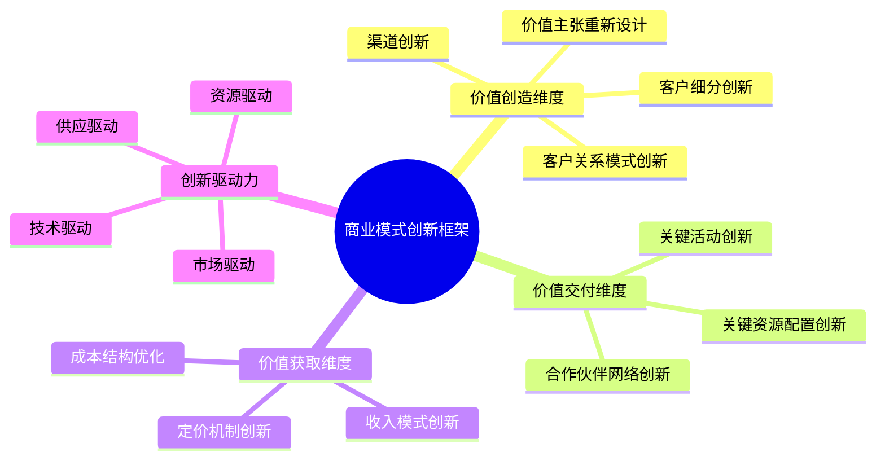
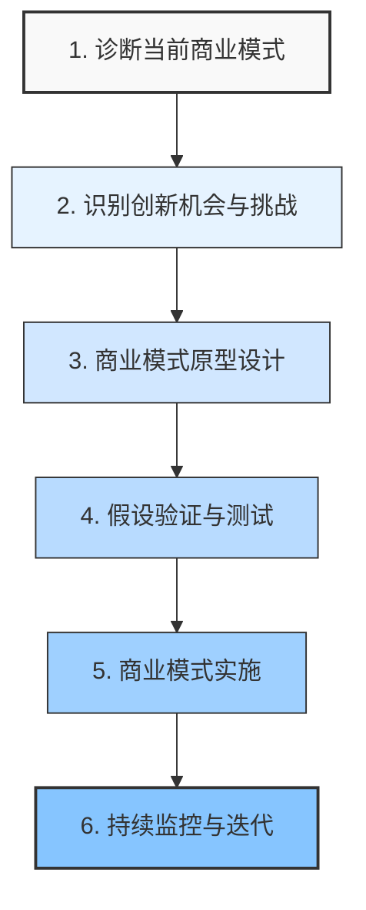

---
{"dg-publish":true,"tags":["商业分析","商业模式","创新","价值创造","颠覆式创新"],"创建日期":"2024-04-29","permalink":"/知识共享/002_商业分析/01_学习内容/06_商业模式分析/6.5 商业模式创新/","dgPassFrontmatter":true}
---

# 6.5 商业模式创新

> [!quote] 核心要点
> 商业模式创新是通过重新设计组织创造、交付和获取价值的方式，实现差异化竞争和价值增长的系统性方法。本文从多维度剖析商业模式创新的定义、方法论、实践路径和案例，帮助您掌握商业模式创新的理论与实践。

## 商业模式创新的定义与价值

### 多视角下的商业模式创新定义

1. **Clayton Christensen (哈佛商学院)**：商业模式创新是一种颠覆性创新形式，通过改变价值主张和盈利逻辑，创造新市场和价值网络。

2. **Alexander Osterwalder**：商业模式创新是创造全新的价值交付机制，或对现有商业模式进行根本性重构，以满足未被满足的市场需求。

3. **麻省理工学院斯隆管理学院**：商业模式创新是系统性地重新思考企业如何创造、交付价值并获取回报的结构化过程。

4. **BCG (波士顿咨询集团)**：商业模式创新是改变公司两个或更多商业模式组件的方式，以崭新的方式满足现有或新市场的需求。

这些定义的共同点在于：
- 强调系统性变革而非单点改进
- 关注价值创造与价值获取的重新设计
- 超越产品创新，关注整个商业系统
- 以市场需求和客户价值为导向

### 商业模式创新的战略价值

商业模式创新相比其他形式的创新具有独特价值：

1. **更难被模仿**：商业模式创新涉及多维度组织能力和资源配置，模仿难度远高于单纯的产品创新

2. **创造持久竞争优势**：根据BCG研究，成功的商业模式创新者的利润增长率比纯产品或流程创新者高出5倍

3. **抵御市场波动**：灵活的商业模式能更好地适应市场变化和经济周期

4. **推动行业变革**：成功的商业模式创新往往重塑行业规则，如亚马逊、优步、Airbnb等

5. **扩大价值创造范围**：能够挖掘传统模式下无法触及的市场空间和客户群体

## 商业模式创新的理论框架

### 商业模式创新的四种基本类型

根据麻省理工学院的研究，商业模式创新可分为四种基本类型：

1. **价值主张创新**：改变"提供什么"
   - 重新定义产品和服务组合
   - 创造全新的客户价值
   - 例如：亚马逊Kindle从卖书到卖内容访问权

2. **价值链创新**：改变"如何提供"
   - 重构生产和交付系统
   - 整合或分离价值链环节
   - 例如：戴尔的直销模式、小米的互联网销售模式

3. **客户创新**：改变"提供给谁"
   - 发现未被服务的客户群体
   - 创造新的市场细分
   - 例如：西南航空服务中短途经济型旅客

4. **收入创新**：改变"如何盈利"
   - 开发新的收入来源
   - 创造新的定价和计费机制
   - 例如：Salesforce的订阅制SaaS模式、共享经济平台的佣金模式

### 颠覆式vs渐进式商业模式创新

| 特征 | 颠覆式创新 | 渐进式创新 |
|------|------------|------------|
| 变革幅度 | 彻底重构商业模式 | 优化现有商业模式的要素 |
| 风险水平 | 高风险、高回报 | 相对可控的风险 |
| 组织影响 | 需要新的组织结构和流程 | 可在现有组织框架内进行 |
| 市场影响 | 可能创造新市场或重构行业 | 提升在现有市场的竞争力 |
| 资源要求 | 通常需要大量新资源 | 可以利用现有资源和能力 |
| 典型例子 | Airbnb颠覆酒店业、Netflix颠覆视频租赁 | 亚马逊逐步扩展Prime会员服务 |

## 商业模式创新的方法论

### 系统性商业模式创新的步骤

#### 1. 诊断当前商业模式
- 绘制商业模式画布，分析九大要素
- 评估当前模式的优势和劣势
- 识别增长瓶颈和潜在威胁
- 分析客户未被满足的需求

#### 2. 识别创新机会与挑战
- 分析市场趋势和客户需求变化
- 评估新技术带来的可能性
- 分析竞争对手的商业模式
- 识别价值链中的低效环节
- 寻找行业痛点和盲点

#### 3. 商业模式原型设计
- 设计多个商业模式创新方案
- 明确每个方案的核心价值主张
- 设计关键要素和它们之间的关系
- 构建初步的财务模型和预测

#### 4. 假设验证与测试
- 识别每个模式中的关键假设
- 设计最小可行产品(MVP)进行测试
- 收集市场反馈并进行定量分析
- 进行商业模式环境模拟和压力测试

#### 5. 商业模式实施
- 制定详细的转型或推出计划
- 确保组织结构与新模式匹配
- 开发支持性系统和流程
- 培养所需的新能力和文化

#### 6. 持续监控与迭代
- 设置关键绩效指标(KPIs)
- 建立反馈机制和学习循环
- 持续优化和调整商业模式
- 预测和适应市场变化

### 商业模式创新的关键工具

1. **商业模式画布**：系统化描述和设计商业模式的九大要素
2. **价值主张画布**：深入分析客户需求与价值主张匹配
3. **精益创业方法**：通过构建-测量-学习循环验证商业假设
4. **蓝海战略工具**：寻找和创造无竞争的市场空间
5. **设计思维方法**：以用户为中心探索创新机会
6. **情景规划**：预测不同未来情境下商业模式的表现
7. **生态系统地图**：分析与合作伙伴和竞争对手的价值交换

## 商业模式创新的驱动因素与模式

### 主要创新驱动因素

1. **技术驱动创新**
   - 新技术使新商业模式成为可能
   - 例如：区块链技术驱动的去中心化商业模式
   - 例如：IoT和5G驱动的服务化商业模式

2. **客户驱动创新**
   - 客户需求变化创造新的市场机会
   - 例如：消费者环保意识提升驱动的循环经济模式
   - 例如：千禧一代偏好体验而非拥有驱动的共享经济

3. **效率驱动创新**
   - 降低成本或提高效率
   - 例如：数字化自助服务模式
   - 例如：直接面向消费者(D2C)模式

4. **平台驱动创新**
   - 连接不同用户群体创造网络效应
   - 例如：多边平台商业模式
   - 例如：内容创作者生态系统

### 典型的创新模式

1. **长尾模式**：聚合大量小众市场创造规模经济
   - 例如：亚马逊的长尾图书销售
   - 例如：Spotify的音乐流媒体服务

2. **免费增值模式**：基础服务免费，高级功能收费
   - 例如：Dropbox、Zoom的免费+付费模式
   - 例如：移动游戏的免费下载+应用内购买

3. **众包模式**：利用用户群体创造价值
   - 例如：维基百科的用户贡献内容
   - 例如：Waze的用户贡献交通数据

4. **订阅模式**：定期付费获取产品或服务
   - 例如：Netflix的内容订阅
   - 例如：Dollar Shave Club的剃须刀订阅

5. **服务化模式**：将传统产品转变为服务提供
   - 例如：Rolls-Royce的"动力按小时付费"
   - 例如：Adobe从软件销售转为Creative Cloud订阅

6. **平台模式**：连接多个用户群体创造价值
   - 例如：Uber连接乘客和司机
   - 例如：Airbnb连接房主和旅客

## 商业模式创新的案例分析

### 案例一：亚马逊的持续商业模式创新

**背景**：从在线书店到全球科技巨头的转型之路

**创新历程**：
1. **1994年**：以在线书店模式起步
2. **2002年**：推出AWS云服务，将内部IT能力商业化
3. **2005年**：推出Prime会员计划，创建忠诚度和复购机制
4. **2007年**：推出Kindle，从卖书到卖数字内容访问权
5. **2014年**：推出Echo智能音箱，进入智能家居生态
6. **2017年**：收购全食超市，融合线上线下零售体验

**关键创新点**：
- **多元收入流**：零售、第三方平台、云服务、订阅服务等
- **数据驱动**：利用客户数据优化体验和运营
- **生态系统战略**：构建相互强化的业务组合
- **长期主义**：愿意牺牲短期利润实现长期价值

**结果**：从单一业务模式发展为多元化科技巨头，市值从1997年的4.38亿美元增长到超过1.5万亿美元

### 案例二：小米的"铁人三项"商业模式

**背景**：2010年成立，在高度竞争的智能手机市场寻求差异化

**创新模式**：
1. **硬件+互联网服务+新零售"铁人三项"**
   - 以接近成本价销售高品质硬件
   - 通过MIUI和应用生态获取软件服务收入
   - 创建线上+线下融合的高效零售模式

2. **社区共创**
   - 米粉参与产品改进和品牌传播
   - 快速迭代基于用户反馈的产品开发

3. **生态链投资**
   - 投资并孵化周边生态企业
   - 构建IoT生态系统，扩大客户触点

**关键创新点**：
- **薄利多销**：硬件业务控制毛利率不超过5%
- **长尾变现**：通过服务和内容实现长期价值
- **社区驱动**：转粉丝为产品共创者和品牌传播者
- **多品类战略**：从单一产品扩展至全场景IoT

**结果**：成功打破传统消费电子商业模式，从2011年销售额不足20亿元人民币，到2021年超过3200亿元

### 案例三：Netflix的商业模式转型

**背景**：从DVD邮寄租赁服务到全球流媒体巨头

**转型历程**：
1. **1997-2007**：DVD邮寄租赁订阅模式
2. **2007-2012**：引入流媒体服务，同时保留DVD业务
3. **2013-2016**：转向原创内容制作，如《纸牌屋》
4. **2016-至今**：全球扩张和多元内容战略

**关键创新点**：
- **从交易到关系**：从单次租赁到持续订阅关系
- **从分销到创作**：从内容分销商转型为内容创作者
- **从标准化到个性化**：利用数据算法提供个性化推荐
- **从本地到全球**：建立全球内容平台和本地化策略

**结果**：
- 从2007年不到800万用户增长到2023年超过2.3亿全球付费用户
- 成功应对多次市场变化和竞争威胁
- 重新定义了娱乐内容的创作、分发和消费模式

### 案例四：微信的从通讯工具到超级平台的演变

**背景**：2011年作为即时通讯工具推出，逐步演变为生活服务平台

**演变历程**：
1. **2011年**：推出基础通讯功能
2. **2012年**：引入公众号，创建内容平台
3. **2013年**：推出红包和支付功能
4. **2014年**：发布微信支付和小程序
5. **2017年**：微信生态全面成熟，覆盖社交、支付、服务

**商业模式创新点**：
- **多层级生态系统**：构建用户、开发者、商家、广告主多方参与的生态
- **价值让渡**：通过支付、小程序等向第三方让渡流量价值
- **间接变现**：主要通过广告、金融服务和生态分成获取收益
- **全场景融入**：从单一社交工具扩展至生活服务全场景

**结果**：
- 月活跃用户超过12亿
- 创造了独特的"超级应用"模式
- 推动了中国移动支付和数字服务市场发展

## 商业模式创新的实施挑战与应对

### 主要挑战

1. **组织惯性**：现有组织结构和流程可能阻碍创新
2. **资源配置冲突**：现有业务与创新业务争夺资源
3. **能力差距**：缺乏新模式所需的关键能力
4. **风险管理**：在不确定性高的环境下做出决策
5. **文化适应**：企业文化与新商业模式不匹配
6. **利益相关者阻力**：内部和外部利益相关者的抵制

### 有效应对策略

1. **分离式创新**：
   - 建立独立的创新单位或子公司
   - 例如：IBM的新兴业务部门、亚马逊的实验室

2. **双模式运营**：
   - 同时管理现有模式和创新模式
   - 例如：奈飞同时运营DVD和流媒体业务的过渡期

3. **渐进实施**：
   - 通过试点项目验证和学习
   - 例如：星巴克的移动订单在有限市场测试后推广

4. **开放式创新**：
   - 与外部伙伴协作开发新模式
   - 例如：宝马与戴姆勒合作发展出行服务

5. **战略收购**：
   - 收购具有创新模式的企业
   - 例如：沃尔玛收购Jet.com加速电商转型

6. **共享资源模式**：
   - 新旧业务共享关键资源，降低总成本
   - 例如：迪士尼内容在传统渠道和Disney+同时利用

## 商业模式创新的未来趋势

1. **可持续商业模式**：
   - 循环经济和再生模式
   - 社会影响与商业价值结合
   - 例如：Patagonia的环保商业模式、Interface的循环地毯租赁

2. **个性化与定制化模式**：
   - 大规模定制服务
   - AI驱动的超个性化体验
   - 例如：Stitch Fix的AI时尚搭配服务

3. **分布式与去中心化模式**：
   - 区块链驱动的点对点商业
   - DAO (去中心化自治组织)
   - 例如：Uniswap的去中心化交易所

4. **服务化与结果导向**：
   - 从产品销售到结果保证
   - 基于使用或价值的定价
   - 例如：米其林的轮胎即服务模式

5. **无边界企业**：
   - 弹性组织结构和工作方式
   - 生态系统协作代替垂直整合
   - 例如：Haier的小微企业组织模式

6. **超本地化与超全球化并存**：
   - 极度本地化服务与全球化平台结合
   - 例如：Shopify支持本地商家全球销售

## 自我评估问题

1. 比较商业模式创新与产品创新的区别，并说明为什么商业模式创新可能创造更持久的竞争优势？

2. 分析麻省理工学院提出的四种商业模式创新类型，并举例说明每种类型的代表企业。

3. 小米的"铁人三项"商业模式包含哪些核心要素？这种模式如何创造竞争优势？

4. 设计一个步骤清晰的商业模式创新流程，包括关键阶段、活动和工具。

5. 分析Netflix的商业模式转型历程，提炼出可应用于其他企业的关键经验。

6. 在实施商业模式创新过程中，组织可能面临哪些主要挑战？如何有效应对这些挑战？

7. 说明技术驱动的商业模式创新与客户驱动的商业模式创新有何不同？分别举例说明。

8. 评估"免费增值"模式的优缺点，并分析其适用条件。

9. 如何衡量商业模式创新的成功？提出3-5个关键指标及其评估标准。

10. 预测未来5-10年可能出现的新型商业模式，并分析其背后的驱动力。

## 进阶学习资源

### 书籍推荐

1. 《商业模式新生代》- Alexander Osterwalder & Yves Pigneur
2. 《颠覆性商业模式》- Clayton Christensen
3. 《重新定义公司》- 拉里·佩奇
4. 《精益创业》- Eric Ries
5. 《蓝海战略》- W. Chan Kim & Renée Mauborgne

### 在线资源

1. [Strategyzer](https://www.strategyzer.com/) - 商业模式画布创建者的在线资源
2. [Business Model Innovation Hub](https://businessmodelinnovationhub.com/)
3. Harvard Business Review关于商业模式创新的专题
4. MIT Sloan Management Review的商业模式研究

### 工具与框架

1. 商业模式画布工具 (Strategyzer, Miro)
2. 精益画布 (Lean Canvas)
3. 价值主张画布 (Value Proposition Canvas)
4. 商业模式环境分析工具
5. 商业模式测试卡与学习卡

## 相关概念关联

- [[知识共享/002_商业分析/01_学习内容/06_商业模式分析/6.1 商业模式画布\|6.1 商业模式画布]] - 商业模式设计的核心工具
- [[知识共享/002_商业分析/01_学习内容/06_商业模式分析/6.2 价值主张设计\|6.2 价值主张设计]] - 深入理解如何创造客户价值
- [[知识共享/002_商业分析/01_学习内容/06_商业模式分析/6.3 收入模式分析\|6.3 收入模式分析]] - 探索价值获取的不同方式
- [[知识共享/002_商业分析/01_学习内容/06_商业模式分析/6.4 成本结构分析\|6.4 成本结构分析]] - 优化商业模式的成本架构
- [[知识共享/002_商业分析/01_学习内容/06_商业模式分析/6.6 平台商业模式\|6.6 平台商业模式]] - 了解多边平台的特殊价值创造逻辑
- [[知识共享/002_商业分析/01_学习内容/06_商业模式分析/6.7 商业模式可持续性评估\|6.7 商业模式可持续性评估]] - 评估商业模式长期价值
- [[知识共享/002_商业分析/01_学习内容/04_市场与竞争分析/4.4 宏观环境分析\|4.4 宏观环境分析]] - 分析影响商业模式的外部因素 