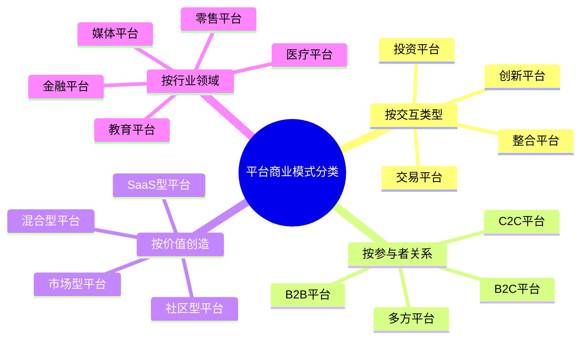
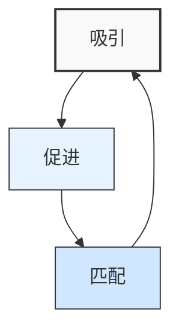
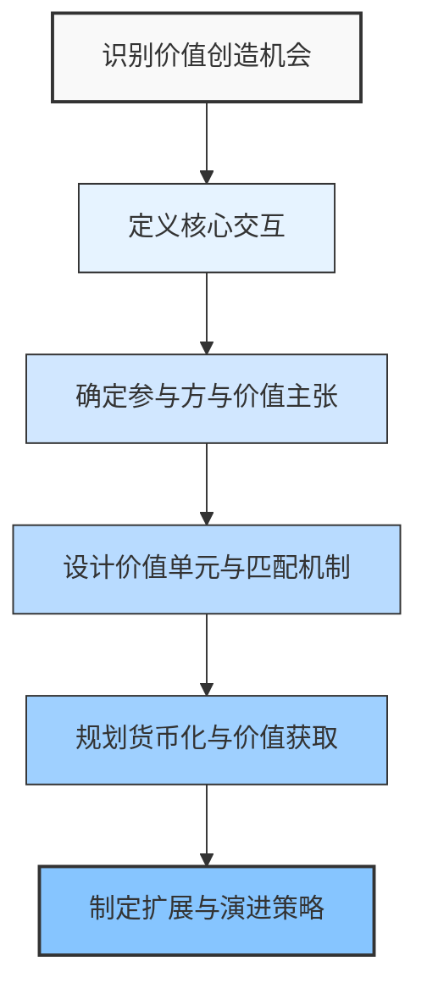

---
{"dg-publish":true,"tags":["商业分析","商业模式","平台经济","网络效应","双边市场"],"创建日期":"2024-04-29","permalink":"/知识共享/002_商业分析/01_学习内容/06_商业模式分析/6.6 平台商业模式/","dgPassFrontmatter":true}
---

# 6.6 平台商业模式

> [!quote] 核心要点
> 平台商业模式是连接多群体用户、促进他们之间交互和价值交换的商业模式。本文深入剖析平台模式的定义、类型、运作机制和价值创造逻辑，帮助您理解平台经济的核心原理，并掌握平台战略的设计与实施方法。

## 平台商业模式的定义与特征

### 多视角下的平台商业模式定义

1. **Geoffrey Parker等(平台革命)**：平台是一种基于技术的商业模式，通过促进供需双方相互价值的交换，创造价值网络。

2. **Jean-Charles Rochet与Jean Tirole(经济学视角)**：平台是在多边市场中运营的中介机构，通过连接不同用户群体并帮助他们克服交易障碍来创造价值。

3. **麻省理工学院数字商业中心**：平台是一种商业模式和架构，允许多个参与者（生产者和消费者）连接、交互并创造和交换价值。

4. **哈佛商学院Andrei Hagiu**：多边平台是一种组织形式，通过直接交互联系两个或多个不同类型的用户群体。

这些定义的共同点在于：
- 连接多群体用户
- 促进用户间交互和交易
- 创造超越传统线性价值链的价值
- 依赖于技术基础设施

### 平台商业模式的核心特征

平台商业模式区别于传统业务模式的五个关键特征：

1. **网络效应**：平台价值随用户数量增加而呈非线性增长
   - **直接网络效应**：同一用户群体的用户数量增加带来的价值增长（如社交网络）
   - **间接网络效应**：不同用户群体间相互增强的价值（如卖家增加带来买家增加）

2. **多边市场**：连接两个或多个独立但相互依赖的用户群体
   - 不同用户群体有不同价值主张和定价策略
   - 解决不同群体间的"鸡与蛋"问题

3. **低边际成本扩展**：服务更多用户的边际成本接近于零
   - 规模扩大不需要等比例增加资源投入
   - 软件和数字服务的复制成本几乎为零

4. **非线性价值创造**：价值来自连接与互动，而非仅仅生产
   - 从价值链转向价值网络
   - 价值创造不再局限于公司内部

5. **数据驱动**：通过数据分析持续优化平台运作
   - 用户行为数据成为核心资产
   - 算法匹配提升平台效率

## 平台商业模式的类型与分类

### 按交互类型分类

1. **交易平台**：促进买卖双方的交易
   - **特点**：连接供需双方，降低交易成本，提供匹配和支付服务
   - **例子**：淘宝、Airbnb、Uber、美团

2. **创新平台**：促进第三方开发者创造补充性产品和服务
   - **特点**：提供核心技术和基础架构，允许第三方创新
   - **例子**：苹果App Store、安卓、Windows、Salesforce平台

3. **整合平台**：结合交易和创新功能
   - **特点**：既允许交易也支持创新，创造多层次生态系统
   - **例子**：亚马逊（零售+AWS+开发者平台）、微信（社交+小程序+支付）

4. **投资平台**：作为控股公司持有并管理其他平台
   - **特点**：战略投资和管理多个平台业务
   - **例子**：Alphabet（谷歌母公司）、腾讯控股、软银愿景基金

### 按参与者关系分类

1. **B2B平台**：连接企业与企业
   - **例子**：阿里巴巴1688、SAP业务网络、LinkedIn招聘平台

2. **B2C平台**：连接企业与消费者
   - **例子**：亚马逊零售、Netflix、Spotify

3. **C2C平台**：连接消费者与消费者
   - **例子**：闲鱼、eBay、BlaBlaCar拼车

4. **多方平台**：连接多类参与者
   - **例子**：京东（消费者、商家、物流、金融）、美团（消费者、商家、配送员）

## 平台商业模式的价值创造机制

### 平台价值创造的三大支柱

1. **吸引(Attraction)**：吸引足够多的参与者加入平台
   - 解决冷启动问题
   - 创造临界用户数量
   - 建立差异化价值主张

2. **促进(Facilitation)**：降低互动障碍并提供支持性服务
   - 简化交互流程
   - 建立信任和安全机制
   - 提供辅助工具和服务

3. **匹配(Matching)**：高效连接最合适的参与者
   - 数据驱动的匹配算法
   - 个性化推荐系统
   - 搜索和发现机制优化

### 网络效应与价值倍增

网络效应是平台模式价值创造的核心机制，它形成正向反馈循环：

1. **直接网络效应(同边网络效应)**
   - **定义**：同一用户群体规模增长带来的价值增加
   - **数学表达**：梅特卡夫定律 - 网络价值与用户数量平方成正比
   - **例子**：Facebook用户越多，对所有用户的价值越大

2. **间接网络效应(跨边网络效应)**
   - **定义**：不同用户群体间相互强化的价值
   - **机制**：一方用户增加→另一方体验改善→吸引更多另一方用户→反过来吸引更多一方用户
   - **例子**：Uber司机越多→乘客等待时间越短→吸引更多乘客→吸引更多司机

3. **数据网络效应**
   - **定义**：用户数据增加带来服务质量提升的效应
   - **机制**：更多用户→更多数据→改进算法→更好的用户体验→更多用户
   - **例子**：谷歌搜索算法通过更多搜索数据不断提升准确性

### 平台经济学：价格结构与平台补贴

平台的经济学与传统企业有本质区别：

1. **价格结构比总价更重要**
   - 平台需要战略性地向不同用户群体收取不同费用
   - 通常会对价格敏感或创造更多间接网络效应的一方进行补贴
   - 例如：信用卡公司向商家收取较高费用，而给消费者提供奖励

2. **补贴策略**
   - **渗透定价**：初期免费或低价吸引用户建立网络效应
   - **跨边补贴**：对一方用户群体补贴，通过另一方盈利
   - **交叉补贴**：使用一种服务的利润补贴另一种服务

3. **多边市场定价考量因素**
   - 价格弹性：对价格更敏感的一方通常获得补贴
   - 网络贡献：为平台带来更多间接价值的一方获得优惠
   - 替代选择：拥有更多替代平台的一方议价能力更强
   - 质量控制：平台可能对某一方收费作为筛选机制

## 平台商业模式的治理与演化

### 平台治理的核心框架

平台治理是确保平台健康发展的关键机制，包括四个核心维度：

1. **访问控制**：决定谁可以参与平台
   - 准入标准和验证机制
   - 排除机制（封禁、降级）
   - 分级会员制度

2. **互动管理**：规范平台上的活动和交互
   - 行为规则和社区准则
   - 内容审核和质量控制
   - 交易流程和标准

3. **价值分配**：如何分配平台创造的价值
   - 佣金和费用结构
   - 激励机制和奖励系统
   - 数据权益分配

4. **纠纷解决**：处理平台参与者间的冲突
   - 投诉处理机制
   - 评价和反馈系统
   - 仲裁与赔偿流程

### 开放与封闭策略的权衡

平台面临的核心战略抉择是确定开放程度：

| 维度 | 开放策略 | 封闭策略 |
|------|----------|----------|
| 参与度 | 更多参与者、更大规模 | 更高质量、更强控制 |
| 创新性 | 分布式创新、多样化 | 集中式创新、一致性 |
| 盈利模式 | 小额分成、规模经济 | 高毛利、品牌溢价 |
| 风险 | 质量参差不齐、难以管控 | 创新局限、增长瓶颈 |
| 例子 | Android、WordPress | iOS、Netflix |

最佳实践：大多数成功平台采用"有原则的开放"策略，即在核心功能上保持控制，在周边功能上开放创新。

### 平台的演化路径

成功平台的典型演化路径遵循五个阶段：

1. **启动阶段**
   - 关注单一价值主张和用户群体
   - 解决"鸡与蛋"问题，创造核心价值
   - 战略：补贴、烧钱拉新、创造最小可行平台

2. **临界阶段**
   - 达到网络效应临界点
   - 用户自传播开始发挥作用
   - 战略：优化匹配算法，提升用户粘性

3. **扩张阶段**
   - 快速增长用户和交易量
   - 扩大功能和服务范围
   - 战略：扩大地理覆盖，增加新用户群体

4. **成熟阶段**
   - 市场占有率稳定
   - 盈利能力增强
   - 战略：优化运营效率，提升获客质量

5. **防御/转型阶段**
   - 应对新平台竞争
   - 开拓新业务领域
   - 战略：超级平台化，或向其他模式转型

## 平台商业模式案例分析

### 案例一：亚马逊的平台转型之路

**背景**：从自营电商向第三方卖家平台转型

**演变历程**：
1. **1995-2000**：纯自营电商，库存模式
2. **2000年**：推出"Marketplace"，允许第三方卖家在亚马逊平台销售
3. **2006年**：推出"Fulfillment by Amazon"，提供仓储物流服务
4. **2015年**：第三方卖家销售额首次超过自营销售
5. **2020年**：第三方销售占总销售额的60%以上

**关键平台战略**：
- **质量控制**：严格的卖家审核和产品质量监控
- **买家保护**：A-to-Z担保计划，降低消费者风险
- **服务整合**：物流、支付、客服等完整基础设施
- **数据驱动**：基于搜索和购买数据的推荐系统
- **多层次参与**：从基础卖家到品牌店铺的不同层级

**结果**：构建了零售、商家服务和技术平台三位一体的生态系统，2023年第三方服务收入超过1000亿美元

### 案例二：美团的多边平台演进

**背景**：从团购网站到综合生活服务平台的演进

**平台扩展历程**：
1. **2010年**：团购模式连接消费者和商家
2. **2013年**：进入外卖行业，增加配送员作为第三方参与者
3. **2015-2017**：拓展到酒店、电影票、旅游等多个生活服务领域
4. **2018年**：上线"美团打车"，进入出行服务
5. **2019-2023**：发展即时零售、金融服务，构建全场景服务生态

**多边平台策略**：
- **渐进式扩展**：从核心场景逐步扩展到相关服务
- **本地化网络效应**：在每个城市构建密集服务网络
- **智能调度系统**：优化配送员与订单匹配效率
- **数据共享价值**：商家通过获取消费数据优化运营
- **交叉销售**：利用一个服务的用户群体导流至其他服务

**结果**：构建连接消费者、商家、配送员及其他服务提供者的综合平台，2023年活跃用户超过5亿，合作商家超过850万

### 案例三：微信小程序生态

**背景**：从社交工具到"超级应用"平台的转变

**平台发展历程**：
1. **2011年**：作为即时通讯工具推出
2. **2012年**：引入公众号，成为内容平台
3. **2014年**：推出支付功能，支持商业交易
4. **2017年**：推出小程序，创建应用生态系统
5. **2018-2023**：小程序生态快速扩张，覆盖各类服务场景

**平台生态战略**：
- **底层基础设施**：提供支付、用户身份、社交关系等基础能力
- **低门槛开发**：简化开发流程，降低创建小程序的技术门槛
- **社交分发**：利用社交网络效应传播小程序
- **场景融合**：将小程序无缝融入聊天、支付等核心场景
- **开放能力分级**：根据应用类型和信用等级开放不同API

**结果**：创建了全球最大的"超级应用"生态，2023年小程序数量超过450万，覆盖零售、政务、医疗、教育等几乎所有行业

### 案例四：Shopify的反向平台模式

**背景**：帮助商家建立自己独立网店的"赋能平台"

**商业模式演变**：
1. **2006年**：作为SaaS电商建站工具推出
2. **2009年**：推出应用商店，允许第三方开发者创建插件和工具
3. **2013年**：推出Shopify Payments，整合支付服务
4. **2018年**：推出Shopify Fulfillment Network，提供物流服务
5. **2020-2023**：拓展企业版服务，支持大型品牌电商转型

**独特平台战略**：
- **赋能而非控制**：帮助商家建立自主品牌和渠道
- **模块化服务**：从基础建站到支付、物流等全方位服务
- **开发者经济**：通过应用商店分成激励第三方开发
- **数据洞察共享**：提供市场趋势和消费者行为分析
- **社区建设**：打造商家学习和交流的社区平台

**结果**：创建了"反亚马逊"的电商生态，2023年平台支持超过200万商家，年交易总额超过2000亿美元

## 平台商业模式的挑战与风险

### 主要挑战与风险

1. **多边均衡问题**
   - 平衡多方利益诉求的复杂性
   - 某一方不满可能导致连锁反应
   - 例如：外卖平台平衡商家、骑手和消费者三方利益

2. **冷启动与临界规模**
   - 没有用户的平台没有价值
   - 达到临界规模前的高投入期
   - 例如：新社交平台初期用户稀少导致的低活跃度

3. **平台抗议与出走**
   - 参与者对规则变更的集体抵制
   - 关键参与者退出导致的负面网络效应
   - 例如：美国2023年YouTube创作者抗议收入分成政策

4. **多归宿竞争**
   - 用户可同时使用多个平台的情况
   - 降低了平台锁定效应
   - 例如：司机同时使用滴滴和高德打车平台

5. **监管与合规风险**
   - 反垄断审查日益加强
   - 数据隐私与安全责任增加
   - 平台责任边界扩大
   - 例如：2023年欧盟《数字市场法案》对大型平台的限制

6. **商业模式可持续性**
   - 补贴战消耗大量资金
   - 价值获取困难
   - 部分平台难以实现盈利
   - 例如：多个共享经济平台在补贴后难以维持增长

### 应对策略

1. **分阶段成长策略**
   - 从单一垂直市场起步
   - 建立核心价值后再扩展用户群体
   - 例如：Facebook先在哈佛校园建立基础再扩展

2. **核心互动设计**
   - 设计低成本、高价值的核心交互
   - 确保每次互动都增强网络效应
   - 例如：LinkedIn的"一键推荐"功能

3. **平台参与者共治**
   - 引入参与者参与平台规则制定
   - 建立透明的规则更新机制
   - 例如：Airbnb的房东顾问委员会

4. **差异化竞争策略**
   - 专注特定细分市场或功能
   - 提供独特体验或服务
   - 例如：Discord专注游戏社区聊天

5. **合规前置原则**
   - 将监管合规纳入产品设计流程
   - 主动与监管机构沟通合作
   - 例如：微信支付的全流程风控系统

6. **多元化价值获取**
   - 开发多种收入来源
   - 从交易佣金扩展到增值服务
   - 例如：阿里巴巴从交易到广告、金融服务

## 构建平台商业模式的框架与方法

### 平台商业模式设计框架

#### 1. 识别价值创造机会
- 寻找现有价值链中的摩擦和低效
- 发现未被满足的连接需求
- 评估适合平台模式的市场条件

#### 2. 定义核心交互
- 确定平台上最基本的价值交换
- 设计交互流程与用户体验
- 评估交互的可扩展性与重复性

#### 3. 确定参与方与价值主张
- 明确所有平台参与者类型
- 为每类参与者定义独特价值主张
- 设计激励机制，确保各方积极参与

#### 4. 设计价值单元与匹配机制
- 定义平台交换的"价值单元"
- 设计高效的搜索和匹配算法
- 建立质量控制和信任机制

#### 5. 规划货币化与价值获取
- 决定向哪些参与方收费
- 设计价格结构和收费模式
- 评估不同货币化策略的长期影响

#### 6. 制定扩展与演进策略
- 规划地理和市场扩张路径
- 设计功能和服务扩展计划
- 建立数据反馈和持续优化机制

### 平台启动策略：解决"鸡与蛋"问题

平台面临的核心挑战是同时吸引多方用户的"鸡与蛋"问题，有效策略包括：

1. **单边功能启动**
   - 先构建对单一用户群体有价值的产品
   - 当达到一定规模后引入第二用户群体
   - 例如：OpenTable先为餐厅提供预订软件，后转为消费者预订平台

2. **补贴一方策略**
   - 向价格敏感方提供免费或补贴
   - 吸引足够数量后再吸引另一方
   - 例如：抖音先免费吸引用户，后向广告主收费

3. **引入者策略**
   - 招募有影响力的初始参与者
   - 通过他们吸引更多参与者
   - 例如：Airbnb初期聚焦大型活动城市吸引房东和旅客

4. **模拟策略**
   - 平台自己参与一方角色
   - 等另一方参与者足够多时逐渐退出
   - 例如：京东自营先构建商城，后引入第三方卖家

5. **边缘市场策略**
   - 从竞争少的小众市场切入
   - 积累经验和用户后扩展到主流市场
   - 例如：Facebook从哈佛大学起步，逐步扩展到其他大学再到公众

### 平台扩展策略：超越核心业务

成功的平台通常通过以下路径进行战略扩展：

1. **水平扩展**：扩展到相似的产品或服务类别
   - 例如：亚马逊从书籍扩展到几乎所有零售品类
   - 策略：利用现有用户基础，复用核心能力

2. **垂直整合**：进入价值链上下游
   - 例如：Netflix从内容分发进入内容制作
   - 策略：控制关键环节，提高服务质量和利润率

3. **地理扩张**：拓展到新的地理区域
   - 例如：滴滴从中国一线城市扩展到全国再到国际市场
   - 策略：调整本地化策略，分阶段复制成功模式

4. **用户群体扩展**：吸引新类型的用户
   - 例如：LinkedIn从职场人士扩展到招聘方和广告主
   - 策略：为新用户群体设计专属价值主张和功能

5. **超级平台战略**：整合多个相关平台
   - 例如：腾讯整合QQ、微信、游戏等多个平台
   - 策略：建立统一账户体系，实现数据和流量共享

## 平台商业模式的未来趋势

1. **去中心化平台**
   - 基于区块链的分布式平台模式
   - 参与者共同拥有和治理平台
   - 例如：Uniswap去中心化交易所、Arweave存储网络

2. **元宇宙平台生态**
   - 虚拟世界中的多元平台经济
   - 数字资产和虚拟体验交易
   - 例如：Roblox游戏创作平台、The Sandbox虚拟地产平台

3. **人工智能赋能平台**
   - AI驱动的个性化匹配和服务
   - 自动化内容审核和治理
   - 例如：TikTok的AI推荐算法、OpenAI的GPT生态系统

4. **超本地化平台**
   - 专注特定地理区域的即时服务
   - 15分钟生活圈内的平台服务
   - 例如：同城零售平台、社区服务平台

5. **产业互联网平台**
   - B2B场景的专业平台模式
   - 行业特定的价值创造和交换
   - 例如：工业互联网平台、医疗健康数据平台

6. **平台监管新框架**
   - 平台责任和权力的重新定义
   - 数据权利和算法透明度提升
   - 用户对平台治理的参与增强
   - 例如：欧盟《数字服务法》、《数字市场法》的影响

## 自我评估问题

1. 比较交易平台和创新平台的区别，并举例说明各自的特点和价值创造方式。

2. 分析网络效应对平台商业模式的重要性，并解释直接网络效应和间接网络效应的区别。

3. 平台解决"鸡与蛋"问题的常用策略有哪些？请结合实际案例分析其有效性。

4. 如何设计平台的价格结构？为什么平台经济中价格结构比总价更重要？

5. 分析亚马逊从自营电商向第三方平台转型的战略演变，总结其成功经验。

6. 平台开放度的设计涉及哪些权衡考量？完全开放和完全封闭各有什么优缺点？

7. 微信小程序生态如何创造多边价值？它与传统应用商店模式有何不同？

8. 设计一个新平台的商业模式，包括目标用户群体、核心交互、价值主张和货币化策略。

9. 分析平台业务面临的主要监管挑战，并提出合规建设的关键策略。

10. 预测未来5年平台商业模式可能出现的三个重要创新方向，并分析其潜在影响。

## 进阶学习资源

### 书籍推荐

1. 《平台革命》- Geoffrey Parker, Marshall Van Alstyne, Sangeet Paul Choudary
2. 《平台战略》- 陈威如、余卓轩
3. 《平台经济学》- Jean-Charles Rochet, Jean Tirole
4. 《平台规模化》- Sangeet Paul Choudary
5. 《平台思维》- 雷·沃德尔、迈克尔·雅各比

### 在线资源

1. [Platform Innovation Kit](https://platforminnovationkit.com/)
2. [Applico平台创新资源](https://www.applicoinc.com/resources/)
3. MIT平台战略研究所发布的白皮书
4. [Platform Design Toolkit](https://platformdesigntoolkit.com/)

### 工具与框架

1. 平台商业模式画布工具
2. 网络效应分析框架
3. 平台价值流图
4. 平台治理设计工具
5. 多边市场定价模拟器

## 相关概念关联

- [[知识共享/002_商业分析/01_学习内容/06_商业模式分析/6.1 商业模式画布\|6.1 商业模式画布]] - 了解平台商业模式的基础框架
- [[知识共享/002_商业分析/01_学习内容/06_商业模式分析/6.2 价值主张设计\|6.2 价值主张设计]] - 学习如何设计平台各方的价值主张
- [[知识共享/002_商业分析/01_学习内容/06_商业模式分析/6.3 收入模式分析\|6.3 收入模式分析]] - 深入理解平台的收入来源和定价策略
- [[知识共享/002_商业分析/01_学习内容/06_商业模式分析/6.5 商业模式创新\|6.5 商业模式创新]] - 平台模式作为商业模式创新的重要形式
- [[知识共享/002_商业分析/01_学习内容/04_市场与竞争分析/4.3 行业分析\|4.3 行业分析]] - 分析平台对传统行业结构的影响
- [[3.7 Python与R在商业分析中的应用\|3.7 Python与R在商业分析中的应用]] - 学习平台数据分析的技术工具 