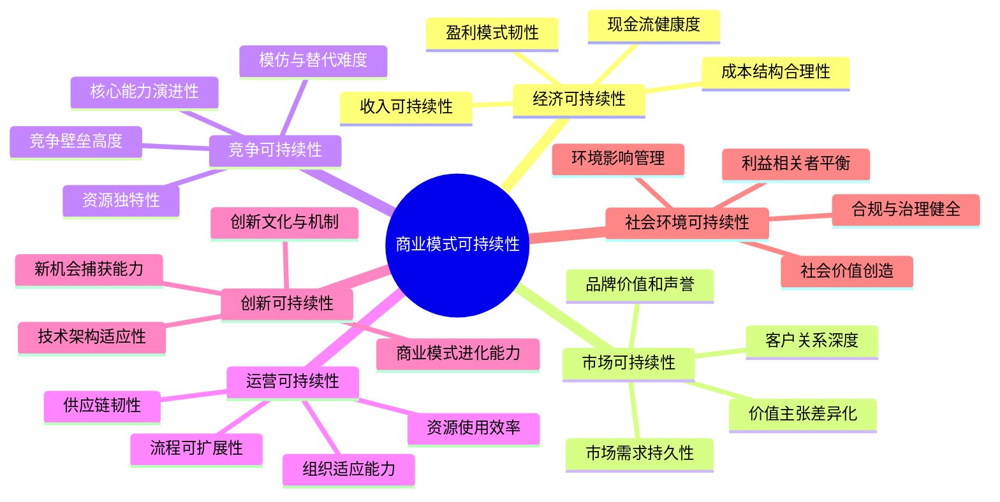
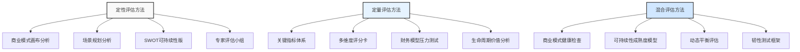
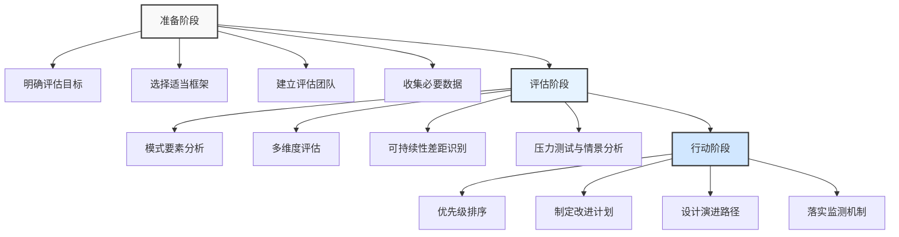

---
{"dg-publish":true,"tags":["商业分析","商业模式","可持续性","评估框架","长期价值"],"创建日期":"2024-04-29","permalink":"/知识共享/002_商业分析/01_学习内容/06_商业模式分析/6.7 商业模式可持续性评估/","dgPassFrontmatter":true}
---

# 6.7 商业模式可持续性评估

> [!quote] 核心要点
> 商业模式可持续性评估是对商业模式长期价值创造能力和生存韧性的系统性分析。本文深入探讨可持续性评估的框架、方法和实践，帮助您全面评估商业模式的长期价值和发展潜力。

## 商业模式可持续性的定义与意义

### 多视角下的商业模式可持续性定义

1. **经济学视角**：商业模式能够持续创造经济价值、维持正向现金流，并为利益相关者带来合理回报的能力。

2. **战略管理视角**：商业模式抵御市场变化、竞争压力和内部变革的适应性和韧性，保持竞争优势的长期能力。

3. **创新理论视角**：商业模式持续进化和自我更新的能力，通过不断创新保持市场相关性和价值创造。

4. **系统理论视角**：商业模式作为一个系统，其各组成部分之间的协同性、平衡性和适应性，以维持整体健康运转。

5. **可持续发展视角**：商业模式平衡经济、社会和环境三重底线，既满足当前需求又不损害未来发展能力。

这些定义的共同点在于：
- 关注长期价值而非短期收益
- 强调适应性和演进能力
- 考虑多维度的平衡和协同
- 重视系统整体性而非单点优化

### 商业模式可持续性评估的战略意义

对企业和投资者而言，商业模式可持续性评估具有以下关键价值：

1. **投资决策依据**：
   - 帮助投资者评估商业模式的长期收益潜力
   - 识别价值创造的持久性和稳定性
   - 预判未来风险和增长机会

2. **战略规划指导**：
   - 指引企业长期战略方向
   - 识别需要增强或重建的商业模式要素
   - 明确可持续竞争优势的来源和边界

3. **变革与创新驱动**：
   - 及早发现商业模式老化迹象
   - 确定需要变革的优先领域
   - 驱动持续的创新和进化

4. **风险管理优化**：
   - 识别潜在的系统性风险
   - 评估外部冲击的抵御能力
   - 预警商业模式可能的失效点

5. **价值沟通工具**：
   - 向投资者和利益相关者清晰传达长期价值主张
   - 建立对企业发展韧性的信心
   - 支持长期愿景的阐述和验证

## 商业模式可持续性的核心维度

商业模式可持续性是一个多维度的概念，需要从以下几个关键维度进行全面评估：

### 1. 经济可持续性

经济可持续性是商业模式最基础的可持续性维度，关注模式产生持续经济回报的能力：

1. **收入可持续性**
   - 收入来源的多元化程度
   - 收入流的周期性和可预测性
   - 收入增长的可扩展性
   - 客户集中度和依赖风险

2. **成本结构合理性**
   - 固定成本与可变成本的比例
   - 规模经济和范围经济效应
   - 成本优势的可持续性
   - 成本结构的灵活性和适应性

3. **盈利模式韧性**
   - 毛利率和净利率的稳定性
   - 盈利门槛和盈亏平衡点
   - 对市场波动的敏感度
   - 盈利能力的长期趋势

4. **现金流健康度**
   - 经营现金流的稳定性
   - 资本支出需求与周期
   - 营运资金管理效率
   - 现金转换周期的优化

### 2. 市场可持续性

市场可持续性评估商业模式满足市场需求并保持客户忠诚度的长期能力：

1. **市场需求持久性**
   - 市场规模和增长趋势
   - 需求的周期性和波动风险
   - 市场成熟度和饱和程度
   - 需求驱动因素的稳定性

2. **客户关系深度**
   - 客户留存率和生命周期价值
   - 客户获取成本与留存成本比
   - 交叉销售和追加销售能力
   - 客户满意度和忠诚度指标

3. **价值主张差异化**
   - 价值主张的独特性和相关性
   - 对客户痛点的解决深度
   - 价值感知与定价匹配度
   - 价值主张的演进能力

4. **品牌价值和声誉**
   - 品牌认知度和情感连接
   - 市场口碑和信任度
   - 品牌资产的积累机制
   - 品牌从危机恢复的能力

### 3. 竞争可持续性

竞争可持续性评估商业模式在竞争环境中保持和强化竞争优势的能力：

1. **竞争壁垒高度**
   - 网络效应与规模经济壁垒
   - 专利与知识产权保护
   - 用户切换成本和锁定效应
   - 数据与算法壁垒

2. **模仿与替代难度**
   - 商业模式复杂度和系统性
   - 模仿所需资源和能力门槛
   - 替代解决方案的威胁程度
   - 对颠覆性创新的脆弱性

3. **资源独特性**
   - 拥有稀缺且难以复制的资源
   - 资源的战略价值和差异化贡献
   - 资源的持续更新和升级机制
   - 资源组合的协同效应

4. **核心能力演进性**
   - 组织学习和知识积累体系
   - 能力的动态发展和更新机制
   - 能力在新业务领域的可转移性
   - 应对变化的组织敏捷性

### 4. 运营可持续性

运营可持续性关注商业模式背后的运营体系在长期保持高效的能力：

1. **供应链韧性**
   - 供应链的多源化和备份机制
   - 对上游波动的缓冲能力
   - 供应链透明度和可视化水平
   - 供应链中断恢复速度

2. **组织适应能力**
   - 组织结构的灵活性和响应速度
   - 跨部门协作与信息流通效率
   - 决策机制的敏捷性与高效性
   - 人才吸引与保留的长期能力

3. **流程可扩展性**
   - 关键流程的标准化和文档化
   - 流程对规模扩张的适应能力
   - 流程持续优化的内置机制
   - 自动化和数字化转型程度

4. **资源使用效率**
   - 资产利用率和周转效率
   - 资源配置的优化机制
   - 对关键资源的依赖程度
   - 资源使用的环境可持续性

### 5. 创新可持续性

创新可持续性评估商业模式持续更新和演进的能力：

1. **创新文化与机制**
   - 创新鼓励与激励机制
   - 容错与试验的组织文化
   - 创新资源投入的稳定性
   - 创意转化为业务的系统性流程

2. **商业模式进化能力**
   - 商业模式元素的模块化程度
   - 快速试验和迭代的能力
   - 商业模式演进的战略思维
   - 过往成功转型的历史记录

3. **技术架构适应性**
   - 技术债务管理和系统更新机制
   - 技术平台的开放性和可扩展性
   - 对新技术整合的能力
   - 技术长期投资的战略视野

4. **新机会捕获能力**
   - 市场洞察和趋势识别能力
   - 资源快速动员与再配置能力
   - 在不确定性下决策的质量
   - 跨边界发展和生态扩张能力

### 6. 社会环境可持续性

社会环境可持续性评估商业模式在更广泛的社会和环境背景下的长期可行性：

1. **社会价值创造**
   - 商业活动的积极社会影响
   - 解决社会问题的商业解决方案
   - 包容性增长和共享价值创造
   - 对社区和利益相关者的贡献

2. **环境影响管理**
   - 资源使用效率和循环经济实践
   - 减少环境足迹的系统性措施
   - 适应气候变化的业务弹性
   - 环境风险管理的前瞻性

3. **合规与治理健全**
   - 合规管理体系的完善程度
   - 风险管理框架的前瞻性
   - 公司治理结构的健全程度
   - 透明度和问责制的实施水平

4. **利益相关者平衡**
   - 利益相关者优先级的平衡性
   - 与核心利益相关者关系的稳定性
   - 利益冲突管理的有效机制
   - 价值分配的公平性和透明度

## 商业模式可持续性评估的方法与工具

有效评估商业模式可持续性需要系统性的方法和工具，以下是几种常用的评估方法：

### 1. 定性评估方法

#### 商业模式画布可持续性分析

基于传统商业模式画布，针对每个构建模块评估其可持续性特征：

1. **关键步骤**：
   - 绘制当前商业模式画布
   - 对每个模块进行可持续性评估
   - 识别薄弱环节和优势模块
   - 分析模块间的支持或制约关系

2. **评估问题示例**：
   - 价值主张：价值主张的差异化程度和演进潜力？
   - 客户关系：客户关系的深度和黏性如何？
   - 收入流：收入来源的多样性和稳定性如何？
   - 成本结构：成本结构随时间的弹性和优化空间？

#### 场景规划分析

通过构建多种未来场景，测试商业模式在不同情境下的适应性：

1. **关键步骤**：
   - 识别关键不确定性变量
   - 构建3-5个合理但差异化的场景
   - 评估商业模式在各场景中的表现
   - 识别跨场景的脆弱点和韧性因素

2. **典型场景类别**：
   - 技术变革场景（如颠覆性技术普及）
   - 市场环境场景（如消费者偏好转变）
   - 竞争格局场景（如行业整合或分散）
   - 政策监管场景（如重大政策调整）

#### SWOT可持续性版

对传统SWOT分析进行扩展，专注于长期可持续性因素：

1. **关键变化**：
   - 优势：聚焦可持续竞争优势而非短期优势
   - 劣势：识别长期结构性弱点而非临时问题
   - 机会：关注长期价值空间而非短期机会
   - 威胁：评估系统性风险而非表面威胁

2. **评估维度**：
   - 时间维度：优势和劣势的持久性
   - 适应性维度：应对变化的能力
   - 系统性维度：各要素的协同效应
   - 进化维度：随时间自我更新的能力

#### 专家评估小组

组织内外部专家对商业模式可持续性进行系统评估：

1. **专家组成**：
   - 行业资深从业者
   - 商业模式创新专家
   - 技术趋势分析师
   - 组织变革专家
   - 可持续发展顾问

2. **评估流程**：
   - 德尔菲法多轮匿名评估
   - 共识研讨与分歧分析
   - 情景质询与假设测试
   - 建议形成与优先级排序

### 2. 定量评估方法

#### 商业模式可持续性关键指标体系(KSIs)

设计一套专门衡量商业模式可持续性的关键指标：

| 维度 | 指标类别 | 示例指标 |
|------|----------|----------|
| 经济可持续性 | 收入稳定性 | 经常性收入占比、收入来源集中度 |
|  | 成本结构 | 固定/可变成本比率、规模经济系数 |
|  | 盈利韧性 | 盈亏平衡点变化、利润波动性 |
|  | 现金流 | 现金转换周期、自由现金流/收入比 |
| 市场可持续性 | 客户关系 | 客户生命周期价值、净推荐值趋势 |
|  | 市场需求 | 市场增长率、需求弹性系数 |
|  | 品牌资产 | 品牌溢价能力、品牌忠诚度指数 |
| 竞争可持续性 | 市场地位 | 市场份额稳定性、相对竞争地位 |
|  | 壁垒高度 | 专利数量与质量、用户切换成本指数 |
| 创新可持续性 | 创新投入 | 研发投入占比、创新人员占比 |
|  | 创新产出 | 新产品收入贡献、创新成功率 |
| 社会环境可持续性 | 环境影响 | 碳足迹、资源利用效率 |
|  | 社会价值 | 社会影响力指数、利益相关者满意度 |

#### 多维度评分卡

构建结构化评分系统对商业模式各维度进行量化评估：

1. **评分维度**：
   - 包含所有可持续性核心维度
   - 每个维度下设3-5个关键评估标准
   - 标准权重根据行业和商业模式特点调整

2. **评分方法**：
   - 1-5分或1-10分量表评分
   - 设置明确的评分标准和案例锚点
   - 使用雷达图直观呈现多维度评分
   - 设置行业基准或理想状态比较

3. **示例评分标准**：
   - 5分：领先水平，构成长期竞争优势
   - 4分：优于行业平均，具有差异化特点
   - 3分：行业平均水平，可持续但不突出
   - 2分：低于行业平均，存在风险因素
   - 1分：显著弱点，可能威胁模式生存

#### 财务模型压力测试

通过财务模型模拟不同压力情境对商业模式的影响：

1. **测试情境设计**：
   - 收入下降情境（如销量下降20%）
   - 成本上升情境（如关键成本上升30%）
   - 运营中断情境（如供应链断裂）
   - 市场变化情境（如新进入者打价格战）
   - 多重压力叠加情境

2. **关键评估指标**：
   - 生存期（现金耗尽时间）
   - 盈利恢复时间
   - 最低现金水平
   - 债务契约违约风险
   - 恢复原有增长所需投资

#### 生命周期价值分析

评估商业模式在不同生命周期阶段的价值创造能力：

1. **生命周期阶段划分**：
   - 导入期：市场培育和基础建设阶段
   - 成长期：快速扩张和市场份额争夺阶段
   - 成熟期：增长放缓和优化效率阶段
   - 衰退或转型期：寻求新增长或重新定义阶段

2. **各阶段关键评估维度**：
   - 价值创造模式的适应性
   - 资源需求与获取能力的匹配度
   - 风险特征与管理能力的匹配度
   - 向下一阶段转型的准备度

### 3. 混合评估方法

#### 商业模式健康检查

全面评估商业模式各方面健康状况的诊断工具：

1. **评估领域**：
   - 战略健康：定位清晰度、竞争优势持久性
   - 运营健康：流程效率、资源优化程度
   - 财务健康：盈利能力、财务结构合理性
   - 组织健康：文化活力、适应变化能力
   - 市场健康：客户关系深度、市场需求稳定性
   - 创新健康：创新机制活跃度、创新成果转化率

2. **健康状态分类**：
   - 蓬勃发展：充满活力，不断进化
   - 健康成长：运行良好，有改进空间
   - 稳定维持：基本健康，缺乏活力
   - 早期警示：出现问题迹象，需要干预
   - 严重衰退：多系统失调，需要重建

#### 可持续性成熟度模型

评估商业模式可持续性管理的系统化和成熟程度：

1. **成熟度级别**：
   - 级别1：初始型（被动、无系统）
   - 级别2：发展型（初步认知、局部措施）
   - 级别3：规范型（系统方法、全面实施）
   - 级别4：管理型（量化管理、持续优化）
   - 级别5：优化型（前瞻创新、行业领先）

2. **评估维度**：
   - 战略整合：可持续性融入战略程度
   - 流程内嵌：嵌入日常决策和运营程度
   - 资源配置：支持可持续发展的资源投入
   - 能力建设：促进可持续创新的能力培养
   - 绩效管理：可持续性衡量与激励机制

#### 动态平衡评估

评估商业模式各组成部分之间的相互支持与平衡关系：

1. **核心原理**：
   - 商业模式是相互关联的系统
   - 各元素之间存在支持或制约关系
   - 短期性能与长期可持续需要平衡
   - 系统的整体韧性依赖于动态平衡

2. **评估方法**：
   - 关键元素关系影响矩阵
   - 系统动力学模型
   - 因果环路图分析
   - 平衡记分卡长短期指标

#### 韧性测试框架

评估商业模式在不确定性和冲击面前的适应和恢复能力：

1. **韧性维度**：
   - 鲁棒性：承受冲击时保持功能的能力
   - 冗余性：关键资源和功能的备份程度
   - 资源丰富性：可调动资源的多样性和深度
   - 快速响应：迅速感知和应对变化的能力
   - 适应性学习：从冲击中学习和强化的能力

2. **测试方法**：
   - 故障模式和影响分析
   - 韧性场景模拟
   - 历史冲击事件反思
   - 适应性周期评估

## 商业模式可持续性评估的案例研究

以下案例研究展示了不同行业如何应用商业模式可持续性评估，以及评估结果如何指导战略决策：

### 案例一：订阅制SaaS平台的可持续性评估

**背景**：一家成立5年的SaaS公司，主要提供项目管理和协作工具，采用订阅模式，面临增长放缓和竞争加剧的挑战。

**评估框架**：采用多维度评分卡结合财务压力测试

**关键发现**：

1. **经济可持续性**（得分：3.8/5）
   - 优势：高毛利率（85%）、稳定的经常性收入（ARR）
   - 风险：客户获取成本上升、续约率下降趋势

2. **市场可持续性**（得分：2.9/5）
   - 优势：产品满意度高、核心用户群黏性强
   - 风险：市场趋于饱和、功能同质化严重

3. **竞争可持续性**（得分：2.5/5）
   - 优势：特定垂直领域的专业功能、良好的API生态
   - 风险：大型科技公司进入市场、缺乏独特技术壁垒

4. **创新可持续性**（得分：3.2/5）
   - 优势：灵活的开发架构、活跃的产品迭代
   - 风险：研发投入低于行业领先者、技术债务累积

**压力测试结果**：在"竞争加剧+经济衰退"情境下，公司现金流将在18个月内转为负值。

**战略建议**：

1. 转向垂直行业特化，深化特定领域专业功能
2. 开发专有技术和数据分析能力，提高切换成本
3. 重新设计定价结构，增加基于价值的组件
4. 构建更强大的生态系统和第三方集成
5. 优化客户留存计划，减少流失率

**一年后结果**：通过专注特定垂直行业，公司在医疗和金融细分市场实现差异化，客户获取成本下降23%，续约率提高8%。

### 案例二：电商平台的商业模式演进评估

**背景**：成熟电商平台面临增长放缓和盈利压力，需要评估当前模式的可持续性并指导业务演进。

**评估框架**：商业模式健康检查和场景规划分析

**关键发现**：

1. **经济可持续性**（状态：早期警示）
   - 佣金收入增长放缓，物流成本持续上升
   - 核心品类利润率压缩，新品类扩张ROI降低

2. **市场可持续性**（状态：稳定维持）
   - 活跃用户增长停滞，但留存率保持稳定
   - 下沉市场潜力大，但获客成本高且ARPU低

3. **竞争可持续性**（状态：早期警示）
   - 新兴平台侵蚀年轻用户群体
   - 内容电商和社交电商崛起形成新竞争态势

4. **创新可持续性**（状态：严重衰退）
   - 技术架构老化，创新速度落后于竞争对手
   - 平台规则和激励机制缺乏创新活力

**场景分析结果**：在三年内，传统电商模式增长空间有限，社区内容驱动模式和供应链服务模式展现更高可持续性。

**战略转型**：

1. 从纯交易平台向"交易+内容+服务"综合平台演进
2. 打造供应链即服务(SCaaS)能力，为品牌和卖家提供端到端解决方案
3. 构建数据智能基础设施，实现精准营销和个性化服务
4. 开放平台能力，建设更广泛的商业生态系统

**两年后结果**：服务收入占比从8%提升至26%，供应链服务成为新增长点，平台生态活力提升，整体毛利率提高3个百分点。

### 案例三：共享出行平台的可持续性评估

**背景**：快速扩张的共享出行平台，经历高增长后面临盈利挑战和监管压力，需评估模式可持续性。

**评估框架**：可持续性成熟度模型结合韧性测试框架

**关键发现**：

1. **经济可持续性**（成熟度：级别2）
   - 单位经济性逐步改善但尚未实现正值
   - 对补贴和融资依赖度高，现金消耗率高

2. **市场可持续性**（成熟度：级别4）
   - 用户规模优势明显，网络效应强
   - 品牌认知度高，但差异化不足

3. **运营可持续性**（成熟度：级别2）
   - 供应管理和质量控制难度大
   - 车辆维护和能源成本控制不足

4. **社会环境可持续性**（成熟度：级别1）
   - 监管关系紧张，政策风险高
   - 劳工关系和社会争议较多

**韧性测试结果**：对监管变化和劳动力成本上升的韧性最弱，在融资环境变化情境下生存期不足12个月。

**转型措施**：

1. 优化运营模式，聚焦正单位经济性路径
2. 多元化收入结构，开发高毛利增值服务
3. 前置监管合规，主动参与政策共创
4. 建立司机权益保障机制，改善劳工关系
5. 投资绿色能源基础设施，提升环境可持续性

**结果**：转型后监管环境改善，单位经济性转正，实现首次季度盈利，估值更加稳健。

### 案例四：传统制造企业的商业模式转型评估

**背景**：拥有40年历史的工业设备制造商，面临数字化挑战，考虑从产品销售转向服务型制造模式。

**评估框架**：商业模式生命周期分析和动态平衡评估

**关键发现**：

1. **传统模式生命周期位置**：成熟后期，接近衰退阶段
   - 设备销售增长持续下降，利润率压缩
   - 新兴市场竞争激烈，价格战常态化
   - 技术优势逐渐减弱，差异化困难

2. **服务型制造模式评估**：导入期，具有较高成长潜力
   - 基于成果的定价模式显示较高客户接受度
   - 设备即服务(EaaS)试点项目ROI提升40%
   - 预测性维护服务创造持续收入流
   - 初期转型需要大量投资和能力建设

3. **动态平衡分析**：
   - 收入流从一次性转向经常性过程中的现金流缺口
   - 销售团队激励与长期服务关系的冲突
   - 工程师思维与服务思维的文化适应挑战
   - 传统制造能力与数字化能力的协同难点

**转型路径建议**：

1. 采用"逐步过渡"模式，建立双轨并行业务
2. 先通过增值服务包提升现有产品价值
3. 在新产品线试行基于成果的商业模式
4. 建立专注于服务创新的内部创业团队
5. 通过收购和合作获取数据分析能力

**三年实施结果**：服务收入占比从12%提升至35%，整体毛利率提高5个百分点，客户生命周期价值增长60%，实现了平稳转型。

## 商业模式可持续性评估的实践应用

将商业模式可持续性评估从理论转化为实践，需要遵循系统性的流程和方法：

### 实施流程

#### 1. 准备阶段

**明确评估目标**：
- 投资决策？战略规划？转型设计？危机应对？
- 评估时间跨度：短期（1-2年）、中期（3-5年）或长期（5年以上）
- 结果预期：全面诊断、聚焦特定维度、对标评估或演进规划

**选择适当框架**：
- 基于企业规模和成熟度选择评估深度
- 基于行业特点选择重点评估维度
- 基于可用资源选择评估方法组合

**建立评估团队**：
- 跨职能团队：战略、财务、运营、技术、市场
- 考虑引入外部专家提供客观视角
- 确保高层参与，保证评估严肃性和后续行动

**收集必要数据**：
- 内部数据：财务数据、运营指标、客户数据、员工反馈
- 外部数据：市场研究、竞争分析、行业报告、专家观点
- 质性数据：访谈、焦点小组、用户反馈

#### 2. 评估阶段

**商业模式要素分析**：
- 绘制当前商业模式画布，确保全面理解
- 分析各要素之间的逻辑关系和相互依赖
- 识别模式的核心差异化特点和关键假设

**多维度评估**：
- 应用选定的评估框架进行全维度分析
- 对每个维度给出客观评分或成熟度判断
- 识别各维度的优势要素和风险因素

**可持续性差距识别**：
- 与理想状态或行业标杆比较确定差距
- 分析各维度之间的不平衡性及其影响
- 评估目前模式的预期生命周期阶段

**压力测试与情景分析**：
- 设计多种未来场景，测试模式韧性
- 识别可能的失效点和临界值
- 评估适应性和自我更新能力

#### 3. 行动阶段

**优先级排序**：
- 基于紧迫性和影响力对可持续性问题排序
- 区分需要渐进改进和根本性变革的领域
- 考虑资源约束和组织变革能力

**制定改进计划**：
- 针对每个优先领域设计具体行动计划
- 确定关键成功指标和阶段性目标
- 分配责任和资源，确保执行力

**设计演进路径**：
- 规划商业模式长期演进方向
- 识别触发转型的关键信号和时机
- 建立业务试验机制，支持持续创新

**落实监测机制**：
- 建立商业模式可持续性监测指标体系
- 设置预警机制，及早发现可持续性风险
- 定期回顾和更新评估，保持动态视角

### 常见陷阱与规避策略

在实施商业模式可持续性评估时，企业常见的陷阱及其规避策略包括：

| 常见陷阱 | 表现症状 | 规避策略 |
|---------|---------|---------|
| 短期导向 | 过分关注短期指标，忽略长期可持续性 | 设立长期价值指标，平衡短期与长期目标 |
| 数据迷思 | 过分依赖量化数据，忽略质性洞察 | 混合使用定量和定性方法，重视专家判断 |
| 静态思维 | 将评估视为一次性活动，缺乏动态视角 | 建立定期评估机制，关注趋势而非静态结果 |
| 孤立分析 | 割裂评估商业模式各组成部分 | 强调系统思维，关注元素间相互作用 |
| 确认偏误 | 寻找支持现有模式的证据，忽视风险信号 | 引入外部视角，鼓励批判性思维 |
| 过度乐观 | 低估外部威胁和内部挑战 | 构建更严苛的压力测试场景，考虑最坏情况 |
| 分析瘫痪 | 过度复杂的评估导致行动延迟 | 保持框架简洁，快速迭代，强调可行动性 |
| 创新排斥 | 过分关注当前模式优化，忽视颠覆性创新 | 设置创新沙盒，鼓励模式实验和探索 |

### 不同发展阶段的应用侧重

商业模式可持续性评估应根据企业发展阶段进行调整，侧重点各有不同：

**创业初期企业**：
- 重点评估：市场可持续性、价值主张差异化、团队能力
- 方法选择：轻量级画布分析、快速场景测试、单位经济性分析
- 应用侧重：验证商业模式假设、指导产品市场匹配、支持融资决策

**快速成长期企业**：
- 重点评估：运营可持续性、规模化能力、竞争壁垒高度
- 方法选择：多维度评分卡、资源需求分析、竞争态势预测
- 应用侧重：指导规模化战略、优化资源配置、强化竞争优势

**成熟稳定期企业**：
- 重点评估：盈利韧性、创新可持续性、业务组合平衡
- 方法选择：财务压力测试、创新能力评估、生命周期分析
- 应用侧重：指导效率优化、激发创新动力、规划转型路径

**转型变革期企业**：
- 重点评估：动态适应能力、组织变革韧性、新旧模式平衡
- 方法选择：韧性测试框架、动态平衡评估、转型风险分析
- 应用侧重：设计平滑转型路径、管理转型风险、重构核心能力

## 商业模式可持续性的未来发展趋势

随着商业环境的持续变化，商业模式可持续性评估领域也在不断演进，主要趋势包括：

### 整合数字技术的评估方法

新技术正在改变商业模式可持续性的评估方式：

1. **数据驱动的预测分析**
   - 利用机器学习预测商业模式寿命周期
   - 基于大数据分析识别新兴风险和机会
   - 实时监测关键可持续性指标的变化

2. **数字孪生模拟**
   - 创建商业模式的数字孪生进行模拟测试
   - 评估不同变量组合对可持续性的影响
   - 虚拟测试创新和变革的潜在结果

3. **自动化评估工具**
   - 开发自助式商业模式可持续性评估平台
   - 智能仪表盘实时展示可持续性状态
   - AI辅助分析生成改进建议

### 跨界整合的评估框架

评估框架正在打破传统边界，整合多学科视角：

1. **生态系统视角**
   - 从单一企业扩展到价值网络评估
   - 考量生态系统健康度对模式可持续性的影响
   - 评估生态位策略与共生关系的可持续性

2. **整合ESG维度**
   - 将环境、社会和治理要素纳入核心评估
   - 量化ESG风险对商业模式寿命的影响
   - 评估可持续发展目标与商业模型的协同性

3. **韧性与适应性重视**
   - 从静态可持续性转向动态适应能力评估
   - 关注在不确定性条件下的学习与进化能力
   - 将复杂适应系统理论应用于商业模式评估

### 新兴商业模式的评估创新

针对新兴商业模式类型的专门评估方法正在形成：

1. **平台与生态系统模式**
   - 评估网络效应可持续性和临界规模
   - 分析多边市场平衡与价值分配机制
   - 预测平台治理模式的长期稳定性

2. **循环经济模式**
   - 评估资源循环利用的经济可行性
   - 分析价值链重构的系统性影响
   - 测量闭环系统的长期运营效率

3. **即服务模式(XaaS)**
   - 评估长期客户关系管理的成本效益
   - 分析订阅型收入流的长期稳定性
   - 测量服务交付能力的可扩展性与韧性

## 结论与展望

商业模式可持续性评估是企业在快速变化环境中保持长期竞争力的关键工具。通过系统性评估商业模式的多维度可持续性，企业可以：

- 超越短期财务表现，关注长期价值创造能力
- 识别潜在风险和机会，提前进行战略调整
- 指导商业模式的持续优化和创新演进
- 在不确定性中建立组织韧性和适应能力

未来，随着评估方法的不断创新和数字工具的广泛应用，商业模式可持续性评估将变得更加精准、动态和前瞻。企业领导者需要将可持续性思维融入战略决策过程，定期评估和更新商业模式，以确保在变化的商业环境中保持长期生命力和竞争优势。

> [!tip] 实践建议
> 1. 将商业模式可持续性评估纳入年度战略规划流程
> 2. 建立跨职能评估团队，确保多视角输入
> 3. 从简单框架开始，逐步扩展评估深度和广度
> 4. 关注趋势和变化模式，而非单一时点的静态结果
> 5. 将评估结果与具体行动计划和资源分配相联系