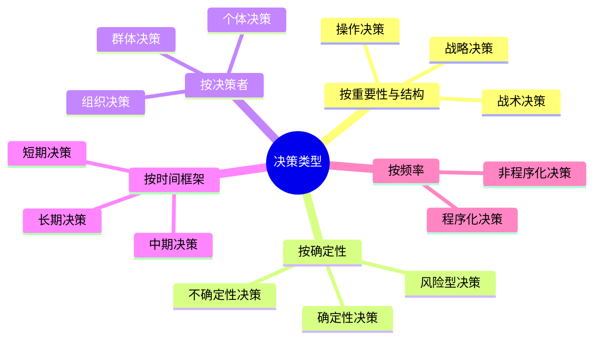
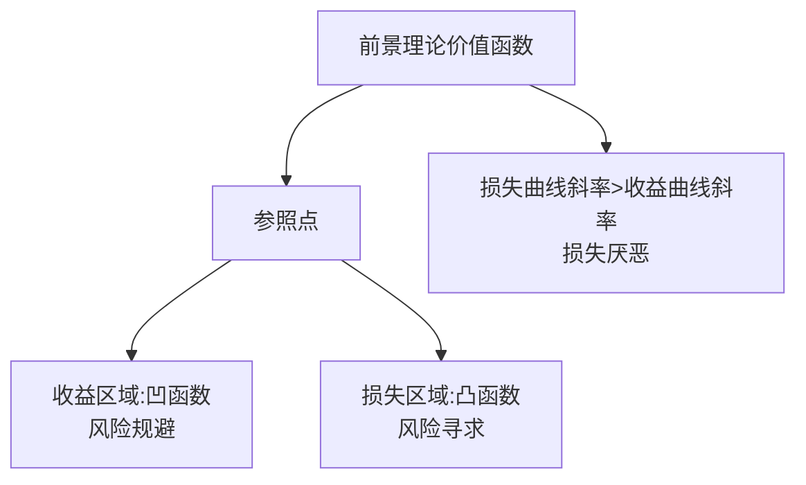
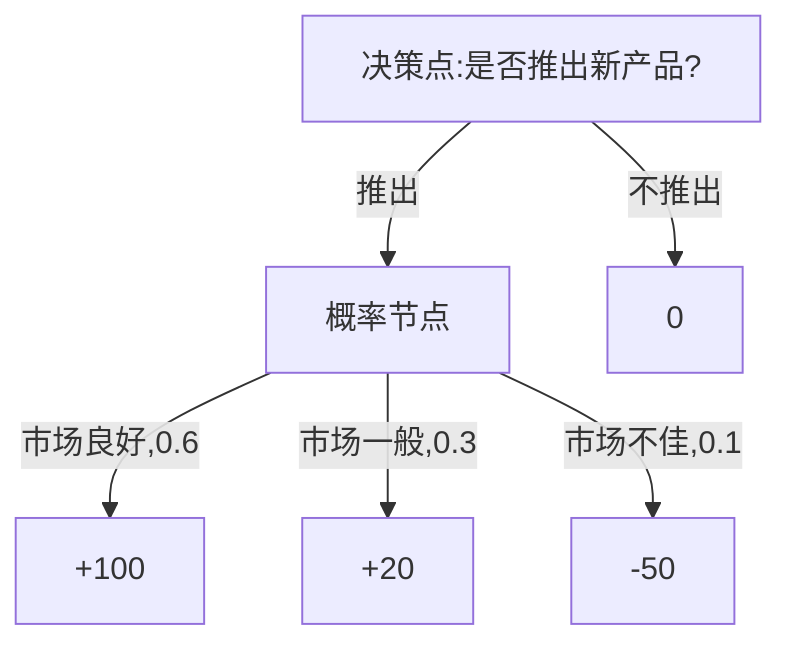
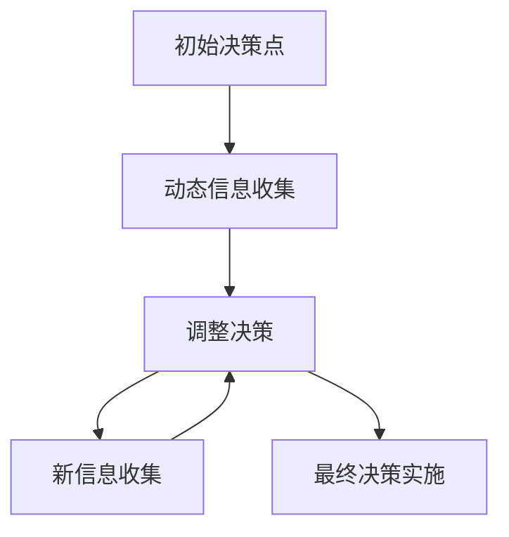

---
{"dg-publish":true,"tags":["商业分析","决策理论","决策偏误","决策过程"],"创建日期":"2024-04-26","permalink":"/知识共享/002_商业分析/01_学习内容/07_决策支持系统/7.1 决策理论基础/","dgPassFrontmatter":true}
---

> [!quote] 核心要点
> 决策理论是研究如何做出最优决策的学科，它融合了经济学、心理学、管理学和数学等多个领域的知识。本文系统介绍决策理论的基本概念、主要流派、决策过程模型以及常见的决策偏误，帮助您理解和改进商业决策的质量。

## 决策理论的基本概念

### 决策的定义

决策(Decision Making)是从多个可能的行动方案中选择一个方案的过程。在商业环境中，决策是管理者核心职责之一，直接影响组织的绩效和未来发展。

从不同角度看，决策有多种含义：

1. **管理学视角**：决策是解决问题的过程，通过选择合适的行动方案达成目标。

2. **经济学视角**：决策是在有限资源约束下追求效用最大化的理性选择。

3. **心理学视角**：决策是个体或群体受认知、情感和社会因素影响下做出的判断和选择。

4. **系统论视角**：决策是信息处理过程，将输入(信息、目标、约束)转化为输出(行动方案)。

### 决策的类型

#### 按重要性与结构划分
- **战略决策**：影响组织长期发展和整体方向的重大决策，如进入新市场、并购等
- **战术决策**：实现战略目标的中层决策，如市场推广策略、产品线规划等
- **操作决策**：日常运营中的具体决策，如生产排期、库存管理等

#### 按确定性程度划分
- **确定性决策**：决策结果可以精确预测的情况
- **风险型决策**：可以估计不同结果的概率
- **不确定性决策**：无法估计概率或可能的结果不完全已知

#### 按决策者划分
- **个体决策**：由单个决策者独立做出
- **群体决策**：通过团队合作或委员会形式做出
- **组织决策**：涉及组织多个层级和部门的复杂决策

#### 按频率划分
- **程序化决策**：重复性、常规性的决策，通常有标准操作流程
- **非程序化决策**：非重复性、独特性的决策，需要创造性思考

### 决策的要素

有效决策需要考虑以下核心要素：

1. **决策目标**：希望通过决策达成的结果或状态
2. **决策方案**：可选择的行动方案集合
3. **决策环境**：决策发生的外部条件和约束
4. **决策标准**：评价和选择方案的准则
5. **决策结果**：每个方案可能带来的后果
6. **决策者偏好**：决策者对不同结果的价值判断
7. **信息与资源**：决策过程中可获取的信息和可用资源

## 决策理论的主要流派

### 规范决策理论 vs 描述决策理论

决策理论有两大主要分支：规范理论和描述理论。

#### 规范决策理论(Normative Decision Theory)
- **核心思想**：研究理想情况下应该如何做决策
- **基本假设**：决策者是完全理性的，追求效用最大化
- **代表理论**：期望效用理论、博弈论、线性规划
- **应用价值**：提供最优决策的数学模型和方法论

#### 描述决策理论(Descriptive Decision Theory)
- **核心思想**：研究人们实际如何做决策
- **基本假设**：决策者受认知限制和心理因素影响
- **代表理论**：前景理论、有限理性、启发式决策
- **应用价值**：解释决策行为，识别决策偏误

### 理性决策理论

#### 期望效用理论(Expected Utility Theory)
- **创始人**：John von Neumann和Oskar Morgenstern(1944)
- **核心思想**：决策者在不确定条件下，选择能带来最大期望效用的方案
- **基本公式**：期望效用 = Σ(结果概率 × 结果效用)
- **主要假设**：
  - 完备性：决策者能对所有选项进行排序
  - 传递性：如果A优于B，B优于C，则A优于C
  - 连续性：存在一个概率p，使决策者在最好结果概率为p与最差结果概率为(1-p)的混合选项与中间结果无差异
  - 独立性：如果A优于B，则包含A的概率混合选项优于包含B的相同概率混合选项

#### 多属性效用理论(Multi-Attribute Utility Theory)
- **核心思想**：决策通常涉及多个目标或属性，需要综合评估
- **应用方法**：
  - 确定所有相关属性
  - 为每个属性建立单属性效用函数
  - 确定各属性权重
  - 计算综合效用
- **主要应用**：产品评估、投资组合、政策分析

### 行为决策理论

#### 前景理论(Prospect Theory)
- **创始人**：Daniel Kahneman和Amos Tversky(1979)
- **核心思想**：人们对获益和损失的心理感受不对称，损失带来的负面感受强于同等价值获益带来的正面感受
- **主要发现**：
  - 参照点依赖：人们相对于参照点评估得失
  - 损失厌恶：人们更敏感于损失
  - 非线性概率权重：过高估计小概率事件，低估中高概率事件
  - S形价值函数：在收益区域凹，在损失区域凸

#### 有限理性理论(Bounded Rationality)
- **创始人**：Herbert Simon(1950s)
- **核心思想**：人类认知能力有限，决策时通常追求"满意解"而非"最优解"
- **主要概念**：
  - 满意化(Satisficing)：寻找满足最低标准的解决方案
  - 启发式决策(Heuristic Decision Making)：使用简化规则做出决策
  - 渐进决策(Incremental Decision Making)：通过小步迭代改进决策

#### 行为经济学的其他理论
- **心理账户理论**：人们将资金在心理上分配到不同"账户"，并对不同账户应用不同决策规则
- **双系统理论**：人类思维分为快速、直觉的系统1和缓慢、分析的系统2
- **社会偏好理论**：人们在决策中考虑公平、互惠和合作等社会因素

## 决策过程模型

### 理性决策过程

理性决策模型提供了一个系统化的决策框架，包含以下步骤：

#### 1. 问题定义
- 明确识别需要解决的问题
- 分析问题的根本原因与影响范围
- 确定问题的边界和约束条件

#### 2. 确定目标与标准
- 设定决策希望达成的具体目标
- 建立评估方案的标准与权重
- 确定必要条件和充分条件

#### 3. 收集相关信息
- 收集内部与外部信息
- 评估信息的可靠性和相关性
- 识别信息缺口并做出合理假设

#### 4. 生成可选方案
- 运用创造性思维生成多种可能方案
- 确保方案多样性和完整性
- 初步筛选明显不可行的方案

#### 5. 评估各方案
- 使用设定的标准评估每个方案
- 分析各方案的利弊、风险和不确定性
- 必要时进行敏感性分析

#### 6. 选择最佳方案
- 根据综合评估结果选择方案
- 验证方案的可行性和有效性
- 获取必要的支持与资源

#### 7. 实施决策
- 制定实施计划与时间表
- 分配责任与资源
- 考虑过渡期管理和变更管理

#### 8. 评估结果与调整
- 设定评估指标与时间点
- 比较实际结果与预期目标
- 根据反馈进行必要调整

### 决策树模型

决策树是可视化决策过程的有效工具，特别适合分析涉及多个决策点和不确定事件的复杂决策。

#### 决策树构建步骤
1. **识别初始决策点**：决策者需要做的第一个选择
2. **添加可选方案**：从决策点延伸出各个选项
3. **加入概率节点**：表示不确定事件及其发生概率
4. **标注结果**：每个路径的最终结果或价值
5. **计算期望值**：从右到左计算每个节点的期望值
6. **确定最优路径**：选择期望值最高的决策路径

#### 决策树应用场景
- 产品开发决策
- 投资组合选择
- 风险管理决策
- 市场进入策略
- 资源分配问题

### 动态决策过程

许多现实决策是动态的，需要随时间推移和信息更新不断调整：

#### 贝叶斯决策分析
- **核心思想**：随新信息到来更新先验概率
- **基本公式**：P(H|E) = P(E|H) × P(H) / P(E)
  - P(H|E)：后验概率 - 证据E出现后假设H的概率
  - P(H)：先验概率 - 证据出现前假设H的概率
  - P(E|H)：似然度 - 假设H为真时证据E出现的概率
  - P(E)：边际概率 - 证据E出现的总体概率

#### 真实期权分析
- **概念**：将金融期权思想应用于实体投资决策
- **核心价值**：
  - 延期期权：推迟投资决策的价值
  - 放弃期权：终止项目的价值
  - 扩展期权：扩大投资规模的价值
  - 收缩期权：缩小投资规模的价值
  - 转换期权：改变投资用途的价值

## 常见决策偏误及其克服

### 认知偏误

认知偏误是人类思维中系统性的偏差，会影响决策的质量：

#### 1. 确认偏误(Confirmation Bias)
- **定义**：倾向于寻找、解释和记忆那些与已有信念一致的信息
- **影响**：导致忽略反面证据，强化现有观点
- **例子**：投资者只关注支持其投资决策的分析报告
- **克服方法**：
  - 主动寻找反面证据和不同观点
  - 采用假设检验思维，尝试否定自己的假设
  - 邀请持不同意见的人参与决策讨论

#### 2. 锚定效应(Anchoring Effect)
- **定义**：决策时过度依赖最初获得的信息(锚)
- **影响**：即使锚点与决策无关，也会影响最终判断
- **例子**：谈判起始价格影响最终成交价
- **克服方法**：
  - 考虑多个参考点而非单一锚点
  - 在看到可能的锚点前先形成独立判断
  - 分析锚点的相关性和可靠性

#### 3. 框架效应(Framing Effect)
- **定义**：同一问题以不同方式呈现会导致不同决策
- **影响**：影响风险偏好和选择倾向
- **例子**：
  - 积极框架："手术有90%成功率"
  - 消极框架："手术有10%失败率"
- **克服方法**：
  - 尝试从多个框架角度考虑问题
  - 关注客观数据而非表述方式
  - 使用标准化的决策流程

#### 4. 可得性偏误(Availability Bias)
- **定义**：基于容易想到的事例做出判断
- **影响**：过高估计生动、近期或常被提及事件的概率
- **例子**：飞机失事后对飞行安全的担忧增加
- **克服方法**：
  - 寻找客观统计数据而非依赖记忆
  - 考虑样本的代表性和相关性
  - 使用结构化风险评估工具

### 情感偏误

情感状态对决策的影响不容忽视：

#### 1. 损失厌恶(Loss Aversion)
- **定义**：损失带来的负面感受强于同等价值获益带来的正面感受
- **影响**：过度规避风险，错失机会
- **例子**：投资者不愿卖出亏损股票，希望"回本"
- **克服方法**：
  - 关注总体投资组合而非单个决策
  - 使用沉没成本分析识别非理性坚持
  - 制定止损策略并严格执行

#### 2. 近期偏好(Present Bias)
- **定义**：过度重视当前利益而低估未来价值
- **影响**：短视决策，忽视长期后果
- **例子**：推迟有长期价值但短期痛苦的决策
- **克服方法**：
  - 利用承诺机制锁定未来行为
  - 将长期目标拆分为短期里程碑
  - 使用折现现金流等工具量化未来价值

#### 3. 过度自信(Overconfidence)
- **定义**：对自己的能力、知识或判断准确性估计过高
- **影响**：风险评估不足，准备不充分
- **例子**：企业家低估创业失败概率
- **克服方法**：
  - 记录和回顾过去预测的准确性
  - 考虑"预期外"情景和最坏情况
  - 寻求外部专家评估和建议

### 社会影响偏误

群体决策中的特殊偏误：

#### 1. 从众效应(Conformity Bias)
- **定义**：为融入群体而改变自己的判断或行为
- **影响**：抑制不同意见，降低决策质量
- **例子**：会议中大家附和领导意见
- **克服方法**：
  - 匿名收集意见和投票
  - 先让每个人独立形成判断再讨论
  - 指定"魔鬼代言人"角色挑战共识

#### 2. 群体思维(Groupthink)
- **定义**：群体成员为了和谐一致而抑制批判性思考
- **影响**：忽视风险和替代方案，做出次优决策
- **例子**：高层管理团队形成"同意的回声室"
- **克服方法**：
  - 鼓励开放讨论和不同观点
  - 引入外部专家或第三方评估
  - 领导者后发表意见，避免影响讨论

#### 3. 责任分散(Diffusion of Responsibility)
- **定义**：个人责任感随着群体规模增加而减弱
- **影响**：决策执行不力，问题无人处理
- **例子**：多人负责但无人真正负责的项目失败
- **克服方法**：
  - 明确分配个人责任和权限
  - 建立决策责任跟踪机制
  - 优化小组规模，避免过大团队

## 提升决策质量的方法

### 结构化决策工具

#### 1. 决策矩阵
- **用途**：评估多个方案在多个标准下的表现
- **步骤**：
  1. 列出所有方案和评估标准
  2. 为每个标准分配权重
  3. 对每个方案在各标准下评分
  4. 计算加权总分
  5. 基于总分排序方案

**决策矩阵示例**：新产品选择

| 方案/标准 | 市场潜力(0.4) | 技术可行性(0.3) | 成本(0.2) | 时间要求(0.1) | 加权总分 |
|----------|-------------|--------------|---------|-----------|--------|
| 产品A | 9 (3.6) | 7 (2.1) | 6 (1.2) | 8 (0.8) | 7.7 |
| 产品B | 7 (2.8) | 9 (2.7) | 8 (1.6) | 7 (0.7) | 7.8 |
| 产品C | 8 (3.2) | 6 (1.8) | 9 (1.8) | 9 (0.9) | 7.7 |

#### 2. SWOT分析
- **用途**：全面评估内部优势(S)、劣势(W)和外部机会(O)、威胁(T)
- **步骤**：
  1. 识别内部优势和劣势
  2. 分析外部机会和威胁
  3. 评估各因素的重要性和相互关系
  4. 制定利用优势、克服劣势的策略

#### 3. 德尔菲法(Delphi Method)
- **用途**：获取专家共识，特别适用于高度不确定或复杂问题
- **步骤**：
  1. 组建专家小组
  2. 提出初始问题
  3. 专家独立匿名回答
  4. 汇总和分析回答
  5. 提供反馈并修改问题
  6. 重复流程直至达成共识

### 认知提升技术

#### 1. 预先验尸(Premortem)
- **概念**：假设决策失败，分析可能原因
- **步骤**：
  1. 想象决策已实施并彻底失败
  2. 团队成员列举可能导致失败的原因
  3. 加强计划以防范这些风险
  4. 建立风险监控机制

#### 2. 心智模型多样化
- **概念**：运用多种思维模型分析同一问题
- **常用模型**：
  - 第一性原理思维：回到基本事实和定律
  - 逆向思维：从目标反推必要条件
  - 系统思维：关注整体和相互作用
  - 概率思维：考虑多种可能性的概率

#### 3. 红队-蓝队分析(Red Team-Blue Team)
- **概念**：组建对立团队分别支持和挑战决策
- **步骤**：
  1. 蓝队提出和支持初始计划
  2. 红队负责挑战和批评计划
  3. 中立方评估双方论点
  4. 基于分析修改和改进计划

### 组织决策优化

#### 1. 决策权分配原则
- **核心思想**：将决策权分配给信息最丰富、能力最强和责任最大的人
- **实施策略**：
  - 明确不同级别的决策权限
  - 区分需集中决策和可分散决策的领域
  - 建立例外和升级机制

#### 2. 多样化团队构建
- **核心思想**：多元背景团队能提供更广泛视角，减少集体盲点
- **实施策略**：
  - 组建不同背景、经验和思维方式的团队
  - 创造心理安全环境，鼓励不同声音
  - 使用结构化流程整合多元视角

#### 3. 决策后审查(Post-Decision Review)
- **核心思想**：系统性学习过去决策经验，持续改进决策流程
- **实施策略**：
  - 定期回顾重要决策结果
  - 分析决策准确性和流程有效性
  - 总结经验教训并调整决策方法

## 现代决策支持技术

### 数据驱动决策

#### 1. 大数据分析
- **核心价值**：从海量数据中提取洞察，减少主观判断
- **主要技术**：
  - 预测分析：预测未来趋势和行为
  - 描述性分析：理解历史表现和模式
  - 规范性分析：推荐最优行动方案

#### 2. 商业智能系统
- **核心价值**：整合、可视化和分析业务数据，支持及时决策
- **功能要素**：
  - 数据仓库和整合
  - 可视化仪表盘
  - 报表生成和分享
  - 实时监控和提醒

### 人工智能辅助决策

#### 1. 机器学习模型
- **核心价值**：从大量历史数据中学习模式，做出预测和分类
- **应用场景**：
  - 消费者行为预测
  - 风险评估和欺诈检测
  - 需求预测和库存优化
  - 价格优化和推荐系统

#### 2. 专家系统
- **核心价值**：编码专家知识和规则，提供专业建议
- **应用场景**：
  - 医疗诊断辅助
  - 金融投资建议
  - 技术支持和问题诊断
  - 合规审查和风险管理

#### 3. 人机协作决策
- **核心理念**：结合人类直觉和机器计算能力
- **最佳实践**：
  - 人类设定目标和约束条件
  - AI提供数据分析和推荐方案
  - 人类做最终判断和伦理考量
  - 系统从人类反馈中学习改进

## 决策理论在商业分析中的应用

### 产品决策应用

- **新产品开发决策**：
  - 使用多属性效用理论评估产品特性组合
  - 应用决策树分析不同开发路径
  - 运用真实期权分析评估分阶段开发价值

- **产品定价决策**：
  - 利用价格弹性数据优化定价
  - 应用前景理论理解消费者价格感知
  - 使用A/B测试验证定价策略

### 营销决策应用

- **市场细分与目标市场选择**：
  - 使用聚类分析识别客户细分
  - 应用决策矩阵评估不同细分市场
  - 结合贝叶斯分析更新细分市场价值估计

- **营销渠道优化**：
  - 应用决策树分析渠道组合策略
  - 使用归因模型评估各渠道贡献
  - 运用马尔科夫链分析客户渠道转换

### 战略决策应用

- **市场进入决策**：
  - 使用博弈论分析竞争对手可能反应
  - 应用情景规划评估不同市场情景
  - 结合真实期权分析分阶段进入价值

- **并购决策**：
  - 使用多标准决策分析评估并购目标
  - 应用敏感性分析测试价值假设
  - 运用预先验尸技术识别潜在风险

## 自我评估问题

1. 分析一个您近期面临的决策，它属于什么类型的决策？您使用了哪些决策流程？
2. 思考您的决策历史，能否识别出您最常犯的认知偏误？如何改进？
3. 选择一个组织决策失败的案例，分析其中的决策缺陷和可能的改进措施。
4. 在您的工作环境中，如何应用决策矩阵分析一个典型问题？
5. 比较规范决策理论和描述决策理论的差异，它们各自在商业环境中有什么应用价值？
6. 探讨人工智能如何改变商业决策过程，存在哪些机遇和挑战？
7. 设计一个改进您团队决策质量的方案，包括流程、工具和培训元素。
8. 分析在高度不确定环境中，传统决策理论有何局限性？如何调整？

## 进阶学习资源

### 书籍推荐
1. 《思考,快与慢》- Daniel Kahneman
2. 《超越直觉:决策与判断中的偏见》- Max Bazerman
3. 《决策与判断》- Scott Plous
4. 《聪明的决策》- John Hammond等
5. 《系统思考》- Donella Meadows

### 在线资源
1. Harvard Business Review决策专题
2. Coursera《决策制定与批判性思维》课程
3. Farnam Street博客决策思维模型系列
4. McKinsey决策科学研究报告

## 相关概念关联

- [[知识共享/002_商业分析/01_学习内容/07_决策支持系统/7.2 决策树分析\|7.2 决策树分析]] - 深入学习决策树构建和应用方法
- [[知识共享/002_商业分析/01_学习内容/07_决策支持系统/7.3 情景规划\|7.3 情景规划]] - 了解如何使用情景分析辅助决策
- [[知识共享/002_商业分析/01_学习内容/07_决策支持系统/7.4 敏感性分析\|7.4 敏感性分析]] - 掌握评估决策对关键变量敏感度的技术
- [[知识共享/002_商业分析/01_学习内容/03_分析方法与工具/3.4 规范性分析方法\|3.4 规范性分析方法]] - 学习支持决策的规范性分析方法
- [[知识共享/002_商业分析/01_学习内容/05_用户与需求分析/5.1 用户研究方法\|5.1 用户研究方法]] - 探索如何获取用户洞察支持决策 