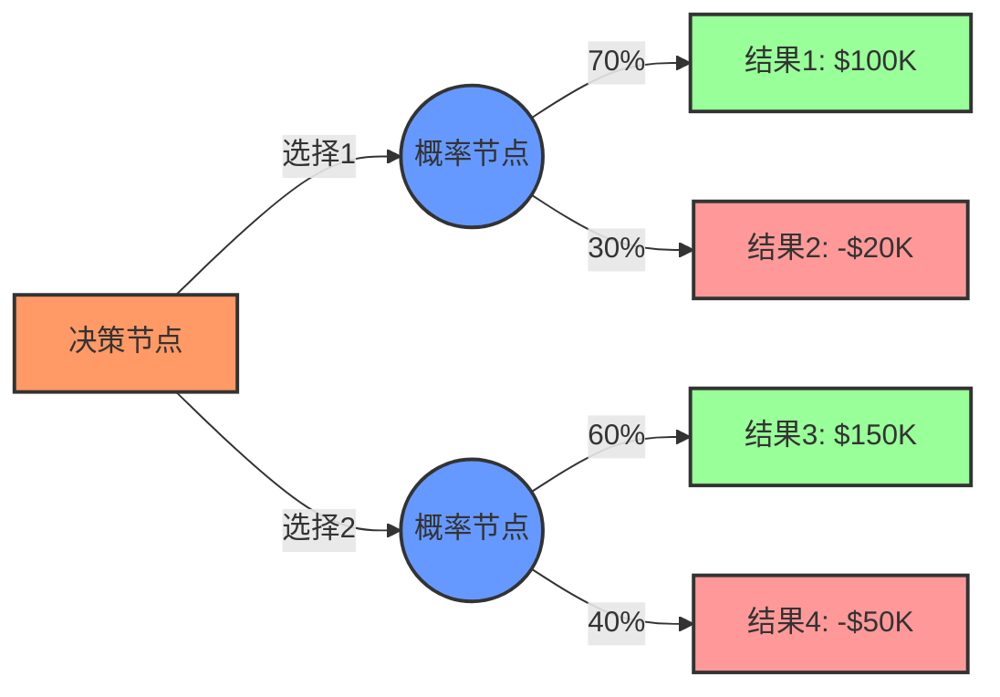
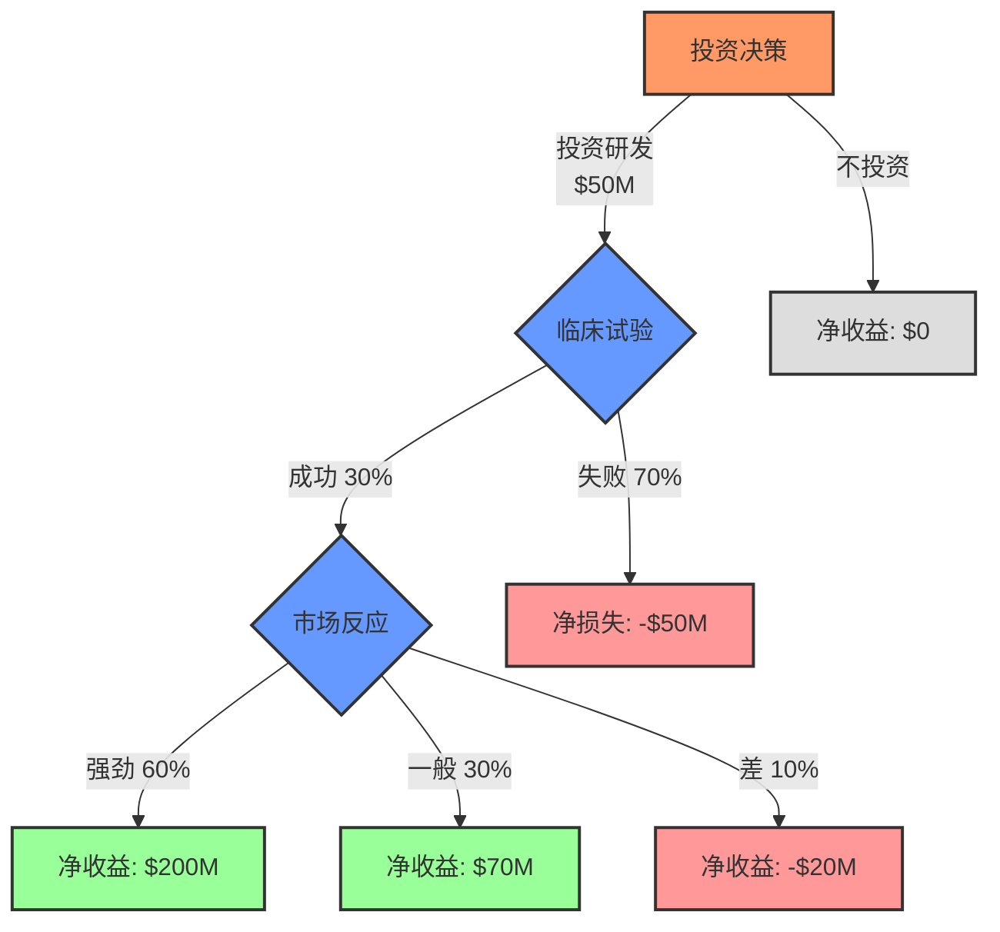

---
{"dg-publish":true,"tags":["商业分析","决策树","概率分析","风险评估","决策支持"],"创建日期":"2024-04-30","permalink":"/知识共享/002_商业分析/01_学习内容/07_决策支持系统/7.2 决策树分析/","dgPassFrontmatter":true}
---

# 7.2 决策树分析

> [!quote] 概述
> 本文深入介绍决策树分析方法，包括基本原理、构建步骤和应用技巧。决策树是一种强大的决策支持工具，能够可视化展示决策过程、预期结果和各种可能性，帮助决策者在不确定环境中做出更为科学的选择。

## 决策树的基本概念

### 定义与价值

决策树是一种通过树状图形结构来可视化决策过程的分析工具，它展示了决策选项、可能的结果、不确定事件及其概率和结果价值。

主要价值：
- **结构化思考**：将复杂决策分解为更小、更可管理的部分
- **风险可视化**：直观展示不同路径的风险和回报
- **概率整合**：综合考虑多种可能性及其概率
- **敏感性分析**：评估关键变量变化对决策的影响
- **透明决策过程**：提供可审核和可解释的决策依据

### 决策树的基本要素

决策树包含四种基本要素：

1. **决策节点**：通常用方形表示，代表决策者可以选择的不同方案
2. **概率节点**：通常用圆形表示，代表不确定事件及其可能结果
3. **结果节点**：通常用三角形表示，代表决策路径的最终结果
4. **分支**：连接节点的线条，代表决策流程和事件发展路径

## 决策树构建方法

### 详细构建步骤

1. **明确决策问题**：
   - 确定核心决策问题和目标
   - 设定决策标准和评估指标

2. **识别备选方案**：
   - 列出所有可能的决策选项
   - 确保选项互斥且完整

3. **识别不确定因素**：
   - 确定影响结果的关键不确定因素
   - 定义每个因素的可能状态

4. **确定概率**：
   - 为每个不确定事件的可能结果分配概率
   - 确保每组概率之和为100%

5. **估计结果值**：
   - 为每个最终结果分配价值（通常为财务价值）
   - 确保使用一致的评估标准

6. **计算期望值**：
   - 从右到左计算每个节点的期望值
   - 在概率节点，计算加权平均值
   - 在决策节点，选择最优选项

7. **敏感性分析**：
   - 测试关键参数变化对结果的影响
   - 确定关键风险点和临界值

### 决策树的数学基础

决策树分析使用期望值计算，即结果的概率加权平均：

$$E(X) = \sum_{i=1}^{n} p_i \times v_i$$

其中：
- $E(X)$ 是期望值
- $p_i$ 是事件 $i$ 的概率
- $v_i$ 是事件 $i$ 的结果值
- $n$ 是所有可能结果的数量

### 概率估计方法

决策树分析的质量很大程度上依赖于概率估计的准确性。常用的概率估计方法包括：

1. **历史数据分析**：基于历史事件频率
2. **专家判断**：利用德尔菲法等收集专家意见
3. **主观概率**：基于贝叶斯方法的个人判断
4. **模拟方法**：使用蒙特卡洛模拟等技术
5. **市场数据**：利用市场预测或期货价格

## 决策树分析的高级技术

### 贝叶斯更新

贝叶斯更新允许在获得新信息后调整概率估计：

1. **初始概率**：设定先验概率
2. **信息价值**：计算额外信息的价值
3. **概率更新**：获得新信息后使用贝叶斯公式更新概率
4. **决策修正**：基于更新后的概率调整决策

### 实用决策准则

根据决策者的风险偏好，可以采用不同的决策准则：

| 决策准则 | 描述 | 适用情境 | 优缺点 |
|---------|------|---------|-------|
| 期望货币价值 (EMV) | 选择期望值最高的选项 | 可重复决策，风险中性 | 简单直观，忽略风险偏好 |
| 期望效用 (EU) | 考虑风险偏好的价值评估 | 风险规避/偏好明显的决策 | 反映个人风险态度，难以量化 |
| 最大最小准则 | 选择最坏情况下结果最好的方案 | 高风险、不可重复决策 | 避免灾难性损失，可能错过机会 |
| 最大最大准则 | 选择最好情况下结果最好的方案 | 风险偏好型决策 | 把握最大机会，风险高 |
| 风险调整后价值 | 期望值减去风险溢价 | 金融和投资决策 | 平衡回报与风险，需要量化风险溢价 |

### 多阶段决策树

对于复杂的决策问题，可以构建多阶段决策树：

1. **序贯决策**：决策按时间顺序排列
2. **条件决策**：后续决策依赖于先前事件结果
3. **选择点**：关键时间点可以调整或终止策略
4. **反馈循环**：结果信息影响后续决策

## 实际案例分析

### 案例1：制药公司研发投资决策

**背景**：某制药公司需要决定是否投资开发一种新药

**决策树结构**：

**计算分析**：
- 市场反应节点期望值 = 0.6×$200M + 0.3×$70M + 0.1×(-$20M) = $138M
- 临床试验节点期望值 = 0.3×$138M + 0.7×(-$50M) = $6.4M
- 最优决策：投资研发（期望值$6.4M > $0M）

**额外考量**：
- 风险分析：虽然期望值为正，但有70%概率损失$50M
- 投资组合视角：考虑与其他研发项目的协同效应
- 信息价值：进行小规模预试验的价值评估

### 案例2：零售商扩张策略

**背景**：零售商考虑在新市场开设大型或小型门店

**决策树分析**：
- 考虑不同市场规模情境（大、中、小）
- 评估不同竞争反应（强烈、温和、无反应）
- 分析前期市场调研的信息价值

**关键发现**：
- 市场规模预测的准确性对决策至关重要
- 小型门店策略风险较低，但机会成本高
- 市场调研的预期信息价值为$1.2M，值得投资

### 案例3：能源公司项目评估

**背景**：能源公司评估可再生能源项目投资

**决策树应用**：
- 模拟不同政策情境（补贴增加、维持、减少）
- 分析技术进步路径（快速、中等、缓慢）
- 评估分阶段投资策略的价值

**结果**：采用分阶段投资策略，基于初期结果调整后续投资，提高了19%的风险调整回报率。

## 决策树的局限性与应对

### 主要局限性

1. **过度简化**：复杂决策可能被过度简化
2. **概率估计挑战**：主观概率可能不准确
3. **结构依赖**：结果高度依赖树的结构
4. **规模复杂性**：大型决策树难以管理
5. **依赖假设**：基于特定假设可能限制适用性

### 克服局限性的策略

1. **敏感性分析**：测试关键参数变化对结果的影响
2. **情景规划**：结合多种可能的未来情景
3. **蒙特卡洛模拟**：处理多变量不确定性
4. **专家校准**：提高概率估计准确性
5. **分层决策树**：将复杂决策分解为多层级

## 决策树软件工具

### 专业工具对比

| 软件工具 | 主要特点 | 适用场景 | 优缺点 |
|---------|---------|---------|--------|
| Precision Tree | 与Excel集成，强大的敏感性分析 | 财务决策分析 | 专业功能完善，学习曲线陡峭 |
| TreePlan | Excel插件，简单易用 | 中小型决策问题 | 简单直观，功能相对有限 |
| Decision Tree | 在线工具，可协作 | 团队决策，教学 | 易于分享，基础功能免费 |
| R/Python库 | 高度可定制，自动化 | 数据驱动决策，研究 | 灵活强大，需编程技能 |

### Excel中构建决策树

使用Excel构建基本决策树的步骤：
1. 设计树形结构和节点
2. 设置公式计算各节点期望值
3. 使用Data Table进行敏感性分析
4. 利用条件格式增强可视化效果

## 实践练习

### 练习1：产品发布决策

**情境**：你是一家科技公司的产品经理，需要决定是否发布一款新产品。

**已知信息**：
- 开发成本：$500,000
- 成功概率：60%
- 成功情况下，市场反应可能是：优秀(40%)、良好(40%)、一般(20%)
- 对应收益：$2M、$800K、$300K

**练习任务**：
1. 构建完整的决策树
2. 计算期望值并给出建议
3. 确定哪个不确定因素对决策影响最大

### 练习2：信息价值分析

**情境**：在投资前，你可以进行市场测试，成本为$50,000。

**测试准确性**：
- 如果市场实际良好，测试预测良好的概率为80%
- 如果市场实际一般，测试预测一般的概率为70%

**练习任务**：
1. 计算完美信息的期望值
2. 分析市场测试的信息价值
3. 决定是否值得进行市场测试

## 思考问题

1. 决策树分析与直觉决策相比有哪些优势和局限性？
2. 在构建决策树时，如何平衡模型复杂性和实用性？
3. 对于非财务目标的决策问题，如何在决策树中量化结果？
4. 如何在团队环境中使用决策树促进共识和有效沟通？
5. 决策树分析如何与其他决策方法（如多标准决策分析）结合使用？
6. 在高度不确定的环境中，如何提高决策树分析的可靠性？
7. 试分析一个历史上的失败商业决策，如何使用决策树可能避免这一失败？
8. 人工智能如何改变决策树分析的应用方式？

## 延伸阅读

1. Raiffa, H. (1997). *Decision Analysis: Introductory Lectures on Choices Under Uncertainty*. McGraw-Hill.
2. Clemen, R. T., & Reilly, T. (2013). *Making Hard Decisions with DecisionTools*. Cengage Learning.
3. Hubbard, D. W. (2014). *How to Measure Anything: Finding the Value of Intangibles in Business*. Wiley.
4. Spetzler, C., Winter, H., & Meyer, J. (2016). *Decision Quality: Value Creation from Better Business Decisions*. Wiley.

## 相关概念链接

- [[知识共享/002_商业分析/01_学习内容/07_决策支持系统/7.1 决策理论基础\|7.1 决策理论基础]] - 决策树的理论基础
- [[知识共享/002_商业分析/01_学习内容/07_决策支持系统/7.3 情景规划\|7.3 情景规划]] - 与决策树分析互补的不确定性处理方法
- [[知识共享/002_商业分析/01_学习内容/07_决策支持系统/7.4 敏感性分析\|7.4 敏感性分析]] - 增强决策树分析的关键技术
- [[知识共享/002_商业分析/01_学习内容/07_决策支持系统/7.6 风险分析与管理\|7.6 风险分析与管理]] - 决策树在风险分析中的应用 