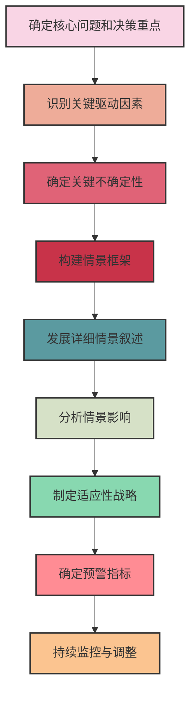
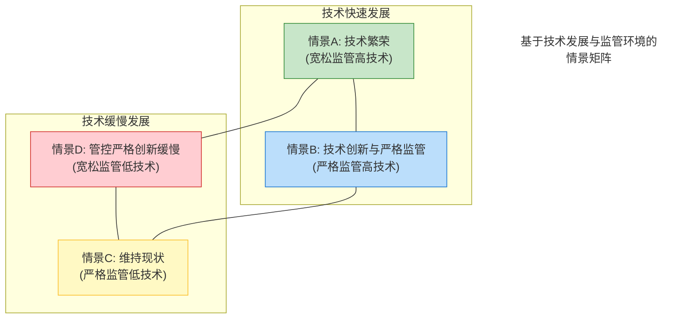

---
{"dg-publish":true,"tags":["商业分析","情景规划","战略管理","不确定性","决策支持"],"创建日期":"2024-04-30","permalink":"/知识共享/002_商业分析/01_学习内容/07_决策支持系统/7.3 情景规划/","dgPassFrontmatter":true}
---

> [!quote] 概述
> 本文深入探讨情景规划这一强大的战略思考工具，包括其核心理念、系统性方法和实践应用。情景规划通过构建多种可能的未来情境，帮助组织应对不确定性，提升战略韧性，为复杂环境中的决策提供更有力的支持框架。

## 情景规划的基本理念

### 定义与核心价值

情景规划是一种系统化的方法，用于构想和分析多种可能的未来状态（情景），帮助组织做好准备并制定适应性战略。不同于预测试图确定单一最可能的未来，情景规划强调理解和准备多种合理可能的未来。

核心价值包括：
- **应对不确定性**：超越单一预测，准备应对多种可能性
- **挑战思维定式**：打破惯性思维，扩展战略思考空间
- **识别机会与风险**：在不同情景下发现潜在机会和风险
- **提高组织适应性**：培养组织灵活应对变化的能力
- **促进战略对话**：提供结构化框架讨论未来战略选择

### 情景规划的历史发展

情景规划的发展经历了几个关键阶段：

1. **军事起源(1950年代)**：最初由美国军方开发用于战略规划
2. **公司应用先驱(1960-70年代)**：由壳牌石油公司Herman Kahn和Pierre Wack开拓商业应用
3. **石油危机验证(1973)**：壳牌凭借情景规划成功预见并应对石油危机
4. **方法成熟(1980-90年代)**：Peter Schwartz和GBN发展了更系统化的方法论
5. **全球应用扩展(2000年至今)**：广泛应用于政府、企业和非营利组织的战略规划

## 情景规划的系统方法

### 情景规划的完整流程

### 详细步骤说明

1. **确定核心问题和决策重点**
   - 明确情景规划的战略目标和时间范围
   - 确定需要回答的关键战略问题
   - 设定情景规划的边界条件

2. **识别关键驱动因素**
   - 系统分析内部和外部环境因素
   - 使用PEST/STEEP分析识别宏观驱动力
   - 评估行业特定趋势和变量

3. **确定关键不确定性**
   - 评估各驱动因素的不确定性和影响程度
   - 构建不确定性/影响矩阵
   - 选择2-3个最具关键性的不确定因素

4. **构建情景框架**
   - 基于关键不确定性创建情景矩阵
   - 通常形成2×2或3×3矩阵，产生4-9个基本情景
   - 筛选3-4个最有意义的情景进行深入发展

5. **发展详细情景叙述**
   - 为每个情景创建生动、连贯的叙述
   - 描述情景中的因果关系和事件链
   - 确保情景内在逻辑一致性和可信度

6. **分析情景影响**
   - 评估每个情景对组织的战略影响
   - 识别每个情景中的机会和威胁
   - 测试现有战略在各情景下的表现

7. **制定适应性战略**
   - 开发在多个情景下都有效的稳健战略
   - 制定针对特定情景的应急计划
   - 识别战略选择中的共性要素

8. **确定预警指标**
   - 识别情景转变的早期信号
   - 建立监控关键指标的系统
   - 设置触发战略调整的阈值

9. **持续监控与调整**
   - 定期审查情景相关性
   - 根据新趋势更新情景
   - 相应调整战略和应急计划

## 情景构建的高级技术

### 情景矩阵法

情景矩阵是构建情景框架的核心工具，步骤包括：

1. **选择两个关键不确定性**：例如"技术发展速度"和"监管环境"
2. **为每个不确定性定义极端状态**：如"技术快速发展"vs"技术缓慢发展"
3. **创建2×2矩阵**：生成四个基本情景
4. **检验情景区分度和相关性**：确保情景之间有足够差异且与决策相关

示例矩阵：

### 分层不确定性分析

分层处理不确定性的方法：

1. **预定要素**：几乎确定会发生的趋势和事件
2. **关键不确定性**：高影响但难以预测的因素
3. **次要不确定性**：影响较小或受关键不确定性影响的因素

### 叙事性情景开发

创建有说服力情景叙述的技巧：

1. **起点到终点的因果链**：描述从现在到情景状态的发展路径
2. **关键人物与组织**：通过具体角色视角使情景更生动
3. **关键事件与转折点**：描述塑造情景的决定性事件
4. **内部一致性**：确保情景内各要素逻辑自洽
5. **挑战性与可信度平衡**：情景应有足够挑战性但又不失可信

## 实际案例分析

### 案例1：壳牌石油的情景规划应用

**背景**：1970年代初，壳牌石油公司使用情景规划为可能的市场变化做准备

**情景开发**：
- 团队识别了石油价格可能因地缘政治变化而大幅波动的风险
- 构建了包括石油急剧涨价的情景
- 分析了这一情景对业务各方面的影响

**成果**：
- 当1973年石油危机爆发时，壳牌已做好准备
- 比竞争对手更快调整战略，获得显著竞争优势
- 使情景规划成为公司核心战略工具

**经验教训**：
- 真正价值在于改变思维模式，而非预测精确性
- 高管团队的参与对实施成功至关重要
- 持续的情景更新比一次性练习更有价值

### 案例2：全球物流公司情景规划

**背景**：一家全球物流公司面临数字化转型和地缘政治不确定性

**关键不确定性**：
- 全球贸易政策（全球化vs区域化）
- 技术采用速度（快速vs缓慢）
- 消费者行为转变（渐进vs颠覆性）

**构建的四个核心情景**：
1. **无缝全球**：全球化持续，技术快速发展，消费需求转向即时配送
2. **区域堡垒**：贸易区域化，技术采用不均衡，市场分化
3. **数字重组**：全球协作与数字化破坏并存，行业界限模糊
4. **缓慢进化**：渐进变化，现有玩家主导，传统模式适应性调整

**战略影响**：
- 确定了在所有情景下都需要的核心能力投资
- 开发了特定情景的备选战略
- 建立早期预警系统监测关键指标

### 案例3：医疗健康行业情景规划

**背景**：医疗服务提供商需要为后疫情时代做准备

**情景框架**：基于"支付模式变革"和"技术接受度"构建

**策略应用**：
- 投资具有跨情景价值的数字健康基础设施
- 开发针对价值医疗的风险分担模式
- 创建模块化服务组合应对不同市场细分

## 情景规划的高级应用

### 与其他战略工具的整合

| 工具/方法 | 与情景规划的结合点 | 整合效益 |
|----------|-----------------|---------|
| SWOT分析 | 在不同情景下评估SWOT | 更动态的优势与劣势理解 |
| 实物期权 | 将战略选择视为不同情景下的期权 | 增加战略灵活性价值评估 |
| 战略地图 | 为每个情景开发战略地图 | 可视化不同情景下的因果关系 |
| 平衡计分卡 | 开发情景适应的绩效指标 | 优化绩效管理系统韧性 |
| 商业模式画布 | 测试商业模式在不同情景的表现 | 增强商业模式创新与适应性 |

### 情景规划在不同行业的应用差异

**金融服务**：
- 特点：高度监管与技术驱动变革并存
- 关键不确定性：监管变化、客户行为、技术采用
- 情景重点：支付系统变革、金融科技竞争、客户需求转变

**零售业**：
- 特点：消费者偏好快速变化与全渠道挑战
- 关键不确定性：线上vs线下平衡、供应链弹性、消费模式
- 情景重点：购物体验转变、品牌关系演变、新零售模式

**制造业**：
- 特点：自动化与全球化重组
- 关键不确定性：贸易政策、劳动力成本、材料创新
- 情景重点：供应链重构、生产自动化、可持续制造

## 情景规划的挑战与局限性

### 主要挑战

1. **认知局限**：克服组织内的思维定式与确认偏误
2. **时间投入**：完整的情景规划需要显著时间和资源投入
3. **参与度问题**：确保真正的高层参与而非象征性支持
4. **数据整合**：将定性洞见与定量分析有效结合
5. **从洞见到行动**：将情景分析转化为具体战略决策

### 克服局限性的策略

1. **精简方法**：为特定决策调整情景规划流程范围
2. **多样团队**：纳入不同背景和思维方式的参与者
3. **混合方法**：结合定性与定量分析技术
4. **明确决策连接**：将情景直接链接到具体决策点
5. **循环迭代**：将情景规划作为持续过程而非一次性活动

## 数字时代的情景规划创新

### 数据驱动情景开发

现代情景规划越来越多地整合高级数据分析：

1. **大数据分析**：识别隐藏趋势和模式
2. **机器学习**：辅助识别关键变量和关系
3. **情景模拟**：使用计算机模型测试情景内部一致性
4. **众包洞见**：汇集更广泛的专家和利益相关者意见
5. **实时情景监测**：持续评估情景相关性和发展路径

### 动态情景规划

传统情景规划向更动态、持续的方法演变：

1. **情景即平台**：建立持续更新的情景库
2. **敏捷情景开发**：迭代、快速更新情景
3. **分布式情景分析**：跨组织层级的参与式过程
4. **情景仪表板**：实时监控情景指标和早期信号
5. **数字孪生集成**：将情景规划与组织和市场的数字模型结合

## 实践练习与应用指南

### 练习1：关键不确定性识别

**目标**：学习识别和评估情景规划中的关键不确定性

**步骤**：
1. 选择一个战略决策领域（如产品开发、市场扩张）
2. 列出至少20个可能影响这一领域的因素
3. 对每个因素评分（1-10）：
   - 影响程度：对结果的潜在影响大小
   - 不确定性：预测难度和变化可能性
4. 绘制不确定性/影响矩阵，确定右上象限（高影响+高不确定性）的因素
5. 从中选择2-3个关键不确定性作为情景构建基础

### 练习2：情景叙述发展

**目标**：练习创建引人入胜的情景叙述

**步骤**：
1. 基于2个关键不确定性构建2×2情景矩阵
2. 为每个象限创建引人入胜的标题和简短描述
3. 选择一个情景深入发展：
   - 描述从现在到情景时间点的主要事件和转折点
   - 创建情景中典型组织或角色的"日常生活"描述
   - 分析关键利益相关者在此情景中的行为和动机
4. 与同伴讨论情景的可信度和挑战性
5. 修改完善情景叙述，增强内部一致性和叙事力量

## 思考问题

1. 情景规划与传统预测方法相比有哪些根本性差异和优势？
2. 在您所在行业，哪些关键不确定性可能是情景规划的核心驱动因素？
3. 如何平衡情景的挑战性（打破常规思维）和可信度（足够可能发生）？
4. 什么样的组织文化特征有助于情景规划的有效实施？
5. 数据分析和人工智能如何增强情景规划的价值？
6. 在快速变化的环境中，情景规划的时间范围应如何设定？
7. 如何评估情景规划对实际决策的影响和价值？
8. 小型组织如何在资源有限的情况下有效实施情景规划？

## 延伸阅读

1. Schwartz, P. (1996). *The Art of the Long View: Planning for the Future in an Uncertain World*. Currency Doubleday.
2. Van der Heijden, K. (2011). *Scenarios: The Art of Strategic Conversation*. John Wiley & Sons.
3. Ramirez, R., & Wilkinson, A. (2016). *Strategic Reframing: The Oxford Scenario Planning Approach*. Oxford University Press.
4. Wade, W. (2012). *Scenario Planning: A Field Guide to the Future*. Wiley.
5. Kahane, A. (2012). *Transformative Scenario Planning: Working Together to Change the Future*. Berrett-Koehler Publishers.

## 相关概念链接

- [[知识共享/002_商业分析/01_学习内容/07_决策支持系统/7.1 决策理论基础\|7.1 决策理论基础]] - 情景规划的理论基础
- [[知识共享/002_商业分析/01_学习内容/07_决策支持系统/7.2 决策树分析\|7.2 决策树分析]] - 与情景规划互补的决策工具
- [[知识共享/002_商业分析/01_学习内容/07_决策支持系统/7.4 敏感性分析\|7.4 敏感性分析]] - 评估情景中关键变量的影响
- [[知识共享/002_商业分析/01_学习内容/07_决策支持系统/7.6 风险分析与管理\|7.6 风险分析与管理]] - 情景规划在风险管理中的应用
- [[知识共享/002_商业分析/01_学习内容/04_市场与竞争分析/4.4 宏观环境分析\|4.4 宏观环境分析]] - 识别情景关键驱动因素的分析方法 