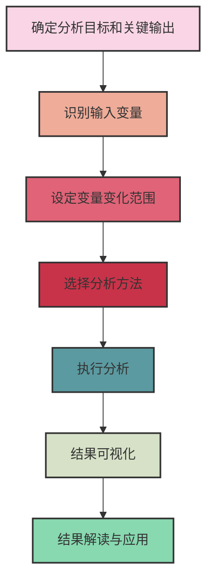

---
{"dg-publish":true,"tags":["商业分析","敏感性分析","决策支持","风险评估","不确定性分析"],"创建日期":"2024-04-30","permalink":"/知识共享/002_商业分析/01_学习内容/07_决策支持系统/7.4 敏感性分析/","dgPassFrontmatter":true}
---


# 7.4 敏感性分析

> [!quote] 概述
> 本文深入介绍敏感性分析这一关键的决策支持工具，涵盖其基本概念、系统方法和应用技巧。敏感性分析通过评估输入变量变化对结果的影响程度，帮助决策者识别关键变量、理解模型稳健性、评估风险并优化决策，是处理不确定性的核心分析方法。

## 敏感性分析的基本概念

### 定义与目的

敏感性分析是一种系统评估输入参数变化如何影响模型输出结果的分析方法。它回答的核心问题是："如果我的假设或输入变量发生变化，我的决策或结论会如何变化？"

主要目的包括：
- **识别关键变量**：确定哪些变量对结果影响最大
- **理解模型稳健性**：评估结果对输入变化的敏感程度
- **测试决策边界**：确定输入变量需要变化多少才会改变决策
- **优化资源分配**：确定哪些变量值得投入更多资源精确测量
- **风险评估**：评估不确定输入可能导致的结果波动范围

### 敏感性分析的类型

敏感性分析可分为几种主要类型：

1. **局部敏感性分析**：
   - 一次改变一个变量，保持其他变量不变
   - 评估单一变量变化对结果的影响
   - 适合理解个别变量的重要性

2. **全局敏感性分析**：
   - 同时考虑多个变量的变化及其相互作用
   - 分析整个参数空间内的模型行为
   - 适合复杂系统和非线性关系

3. **确定性敏感性分析**：
   - 使用特定数值(如±10%)测试变量变化
   - 计算明确的结果变化范围
   - 适合初步分析和直观理解

4. **概率敏感性分析**：
   - 使用概率分布表示输入变量的不确定性
   - 分析结果的概率分布
   - 提供更完整的风险评估

## 敏感性分析的系统方法

### 基本步骤流程



### 详细步骤说明

1. **确定分析目标和关键输出**
   - 明确需要分析的决策或模型
   - 确定关键绩效指标(KPI)或输出变量
   - 设定敏感性评估标准

2. **识别输入变量**
   - 列出所有可能影响结果的变量
   - 筛选最相关的变量纳入分析
   - 考虑变量间的依赖关系

3. **设定变量变化范围**
   - 基于历史数据确定合理变化范围
   - 考虑最佳/最差情况分析
   - 设定变化步长或增量

4. **选择分析方法**
   - 单因素分析(One-way)
   - 双因素分析(Two-way)
   - 情景分析
   - 蒙特卡洛模拟
   - 方差分析(ANOVA)

5. **执行分析**
   - 系统性改变输入变量
   - 记录每次变化对输出的影响
   - 注意非线性关系和临界点

6. **结果可视化**
   - 绘制敏感性图表
   - 创建龙卷风图表
   - 生成热图或等值线图

7. **结果解读与应用**
   - 识别最敏感变量
   - 确定临界阈值
   - 优化决策和风险管理策略

## 敏感性分析的核心技术

### 单因素敏感性分析

单因素(一维)敏感性分析是最基本、应用最广泛的方法：

1. **基本步骤**：
   - 设定基准情景和所有输入的基准值
   - 一次只改变一个变量，保持其他变量不变
   - 记录输出变化，计算敏感性指标

2. **敏感性衡量**：
   - 绝对变化：输出变化的绝对值
   - 相对变化：输出变化百分比
   - 弹性系数：输出相对变化/输入相对变化

3. **优缺点**：
   - 优点：直观简单，易于实施和理解
   - 缺点：忽略变量间相互作用，可能低估复杂系统的敏感性

### 多因素敏感性分析

多因素分析同时考虑多个变量的变化：

1. **二维分析**：
   - 同时改变两个变量
   - 创建二维数据表或等值线图
   - 分析变量间的交互影响

2. **情景分析**：
   - 定义多个变量组合的情景(如乐观、中性、悲观)
   - 评估每个情景下的模型表现
   - 分析情景间的结果差异

3. **极值分析**：
   - 组合不同变量的极端值
   - 评估"最好"和"最坏"情况
   - 识别最大风险和潜在机会

### 概率敏感性分析

使用概率方法处理不确定性：

1. **蒙特卡洛模拟**：
   - 为关键输入变量分配概率分布
   - 随机抽样生成大量模拟
   - 分析结果的概率分布
   - 计算统计指标(如均值、方差、分位数)

2. **重要性抽样**：
   - 有针对性地从关键区域抽样
   - 提高罕见但重要事件的抽样效率
   - 减少所需模拟次数

3. **方差分解方法**：
   - 将结果方差分解到各输入变量
   - 量化每个变量对总不确定性的贡献
   - 计算Sobol指数等全局敏感性指标

## 敏感性分析的可视化技术

### 常用图表类型

1. **龙卷风图(Tornado Diagram)**：
   - 显示每个变量对结果的相对影响
   - 按影响程度从大到小排序
   - 直观展示最敏感变量

```
           变量影响大小
           │
   变量A   ├──────────────────────┤
   变量B   ├───────────────┤
   变量C   ├─────────┤
   变量D   ├──────┤
           │
          基准值
```

2. **蜘蛛图(Spider Plot)**：
   - 展示多个变量对结果的非线性影响
   - 显示敏感性随变量值变化的趋势
   - 帮助识别非线性关系和临界点

3. **热图(Heat Map)**：
   - 用于双因素分析
   - 色彩强度表示不同变量组合的结果
   - 直观显示交互效应

4. **敏感性散点图**：
   - 从蒙特卡洛模拟结果绘制
   - X轴为输入变量，Y轴为输出结果
   - 帮助识别非线性和阈值关系

### 高级可视化技术

1. **平行坐标图**：
   - 展示多维数据中的关系
   - 显示多个变量同时变化的影响

2. **敏感性曲面**：
   - 3D展示两个变量的交互效应
   - 帮助识别复杂非线性关系

3. **概率密度图**：
   - 展示输出结果的概率分布
   - 直观表达风险和不确定性

## 行业案例分析

### 案例1：投资项目评估

**背景**：一家制造企业评估一个5年期新产品线投资项目

**敏感性分析应用**：
- 识别关键变量：初始投资、市场增长率、单位售价、边际成本、折现率
- 单因素分析：每个变量在±20%范围内变化
- 蒙特卡洛模拟：市场需求和原材料成本使用概率分布

**发现**：
- 单位售价对NPV最敏感，弹性系数为2.3
- 市场增长率是第二敏感变量
- 在蒙特卡洛模拟中，项目有78%概率实现正NPV
- 临界售价下降阈值为12%（售价下降超过12%时NPV转为负值）

**决策影响**：
- 优先投资提高产品价值以支持价格策略
- 制定详细的定价防御策略
- 设计灵活产能计划应对需求不确定性

### 案例2：药物研发决策

**背景**：制药公司评估新药研发项目进入III期临床试验的决策

**敏感性分析应用**：
- 关键不确定性：成功概率、市场规模、研发成本、上市时间
- 情景分析：根据竞争对手行动和监管环境定义多种情景
- 决策树结合敏感性分析

**发现**：
- 研发成本超支对项目价值影响有限
- 市场进入时间每延迟6个月，项目价值下降约15%
- 成功概率需超过35%才能获得正期望价值

**决策影响**：
- 采用平行开发策略缩短上市时间
- 开发分阶段决策机制，设置明确检查点
- 通过合作研发分散风险

### 案例3：供应链优化

**背景**：零售商评估全渠道配送网络优化方案

**敏感性分析应用**：
- 变量：燃料成本、订单量、仓库位置、配送时间
- 多因素交互分析
- 极值分析评估极端情况

**发现**：
- 运输成本与订单密度的非线性关系
- 仓库布局对燃料成本波动的敏感性
- 识别出关键服务水平临界点

**决策影响**：
- 优化混合配送模型，增强对燃料价格波动的韧性
- 实施区域化库存策略
- 建立动态调整机制应对需求变化

## 敏感性分析的高级应用

### 敏感性分析与情景规划的结合

敏感性分析可以有效支持情景规划过程：

1. **变量筛选**：
   - 使用敏感性分析识别关键不确定性
   - 确定情景规划中最重要的关键驱动因素

2. **情景稳健性测试**：
   - 评估战略选择在不同情景下的表现
   - 识别跨情景的稳健战略选项

3. **触发点识别**：
   - 确定情景转换的关键阈值和信号
   - 建立早期预警指标系统

### 敏感性分析与实物期权结合

实物期权思维与敏感性分析结合提供更灵活的决策框架：

1. **灵活性价值量化**：
   - 使用敏感性分析评估不同时点决策灵活性的价值
   - 量化"等待与观察"、"分阶段投资"等选项价值

2. **关键触发点确定**：
   - 识别最优执行时点的决定性因素
   - 设计基于敏感性的决策规则

3. **战略选择组合**：
   - 构建对不同关键变量有弹性的战略组合
   - 平衡确定性承诺与保持灵活性

### 敏感性分析与风险管理

敏感性分析是风险管理的核心工具：

1. **风险识别**：
   - 识别可能导致重大影响的关键风险因素
   - 理解风险因素之间的相互作用

2. **风险评估**：
   - 量化不同风险因素的潜在影响
   - 建立风险优先级排序

3. **风险缓解策略设计**：
   - 针对高敏感性变量制定风险缓解措施
   - 设计条件触发的应急计划

## 实施敏感性分析的工具与方法

### 软件工具比较

| 工具类型 | 代表产品 | 优势 | 局限性 | 适用场景 |
|---------|---------|------|--------|---------|
| 电子表格 | Excel, Google Sheets | 易用性高，广泛使用 | 计算能力有限，大型模拟效率低 | 中小型模型，初步分析 |
| 专业统计软件 | R, Python, SAS | 强大的统计能力，可自动化 | 学习曲线陡峭 | 复杂分析，大数据量 |
| 决策分析软件 | @RISK, Crystal Ball | 集成蒙特卡洛功能，直观界面 | 成本高，可能需要专业培训 | 高价值决策，需要高级分析 |
| 建模平台 | Analytica, Vensim | 处理复杂系统关系，直观可视化 | 特定领域应用，可能缺乏灵活性 | 复杂系统建模 |

### Excel中的敏感性分析技术

Excel是进行基本敏感性分析的常用工具：

1. **数据表(Data Table)**：
   - 一维数据表：分析单一变量变化
   - 二维数据表：同时分析两个变量

2. **场景管理器(Scenario Manager)**：
   - 创建多个输入变量组合的场景
   - 比较不同场景的输出结果

3. **目标寻求(Goal Seek)**：
   - 确定输入变量实现特定输出的值
   - 寻找临界值和决策阈值

4. **规划求解(Solver)**：
   - 优化问题中的敏感性分析
   - 自动寻找最优解及其稳健性

## 敏感性分析的最佳实践

### 常见误区与避免方法

1. **忽视变量间相互作用**：
   - 问题：仅进行单因素分析，忽视交互效应
   - 解决：补充多因素分析和相关性考量

2. **使用不恰当的变量范围**：
   - 问题：设定过宽或过窄的变化范围，导致结论失真
   - 解决：基于历史数据和专家判断设定合理范围

3. **过度关注点估计**：
   - 问题：仅关注单一数值而非分布和概率
   - 解决：使用概率方法，关注整体分布

4. **忽视模型不确定性**：
   - 问题：只关注参数不确定性，忽视模型结构不确定性
   - 解决：测试不同模型假设，考虑模型缺陷

### 提高敏感性分析质量的策略

1. **明确目标和范围**：
   - 清晰定义分析目标和决策问题
   - 确定合适的详细程度

2. **关注关键变量**：
   - 通过初步筛选专注于最相关变量
   - 避免分析中包含过多无关变量

3. **结合质性和量化方法**：
   - 补充专家意见和定性判断
   - 避免纯粹依赖数字

4. **迭代改进**：
   - 从简单模型开始，逐步增加复杂度
   - 不断改进假设和范围设定

5. **清晰沟通结果**：
   - 使用适当的可视化技术
   - 强调关键发现和决策影响

## 实践练习与应用

### 练习1：投资回报敏感性分析

**目标**：分析一个投资项目的净现值(NPV)对关键变量的敏感性

**给定信息**：
- 初始投资：$500,000
- 年营收：$200,000
- 年运营成本：$120,000
- 项目期限：5年
- 折现率：10%

**练习任务**：
1. 构建基本NPV计算模型
2. 进行单因素敏感性分析：
   - 初始投资：±20%
   - 年营收：±15%
   - 年运营成本：±25%
   - 折现率：6%-14%
3. 创建龙卷风图，确定最敏感变量
4. 计算每个变量的临界值（使NPV=0）

### 练习2：多因素敏感性分析

**目标**：分析产品定价和销量变化对利润的联合影响

**给定信息**：
- 基础单价：$50
- 基础销量：10,000件
- 固定成本：$200,000
- 单位变动成本：$30
- 价格弹性：售价每上升10%，销量下降15%

**练习任务**：
1. 构建价格-销量-利润模型
2. 创建二维数据表，分析价格(±30%)和固定成本(±20%)对利润的影响
3. 生成利润等值线图，找出最优定价区间
4. 讨论价格弹性不确定情况下的定价策略

## 思考问题

1. 在什么情况下敏感性分析的结果可能误导决策者？如何避免这些陷阱？
2. 传统敏感性分析假设变量间独立变化，但现实中变量往往相互关联。如何在分析中适当考虑这种关联性？
3. 敏感性分析如何帮助组织在不确定环境中制定更稳健的战略？
4. 对于高度创新的项目，历史数据往往有限，如何在这种情况下确定合理的变量范围？
5. 敏感性分析与情景规划有何异同？它们如何相互补充？
6. 如何将敏感性分析结果有效地传达给非技术背景的决策者？
7. 在您的专业领域中，哪些类型的决策最适合应用敏感性分析？为什么？
8. 人工智能和机器学习如何改变敏感性分析的应用方式？

## 延伸阅读

1. Saltelli, A., et al. (2008). *Global Sensitivity Analysis: The Primer*. John Wiley & Sons.
2. Pannell, D. J. (1997). *Sensitivity Analysis of Normative Economic Models: Theoretical Framework and Practical Strategies*. Agricultural Economics.
3. Eschenbach, T. G. (2010). *Engineering Economy: Applying Theory to Practice*. Oxford University Press.
4. Clemen, R. T., & Reilly, T. (2013). *Making Hard Decisions with DecisionTools*. Cengage Learning.
5. Borgonovo, E. (2017). *Sensitivity Analysis: An Introduction for the Management Scientist*. Springer.

## 相关概念链接

- [[知识共享/002_商业分析/01_学习内容/07_决策支持系统/7.1 决策理论基础\|7.1 决策理论基础]] - 敏感性分析的理论基础
- [[知识共享/002_商业分析/01_学习内容/07_决策支持系统/7.2 决策树分析\|7.2 决策树分析]] - 决策树中应用敏感性分析
- [[知识共享/002_商业分析/01_学习内容/07_决策支持系统/7.3 情景规划\|7.3 情景规划]] - 与敏感性分析相辅相成的方法
- [[7.6 风险分析与管理\|7.6 风险分析与管理]] - 敏感性分析在风险管理中的应用
- [[知识共享/002_商业分析/01_学习内容/03_分析方法与工具/3.3 预测性分析方法\|3.3 预测性分析方法]] - 敏感性分析在预测模型中的应用 