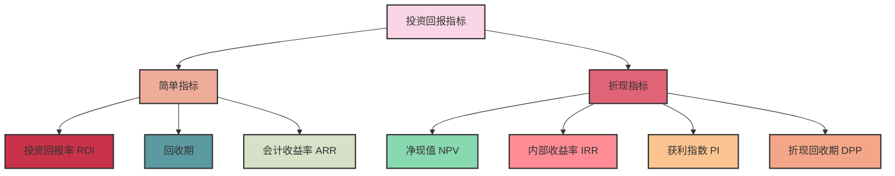
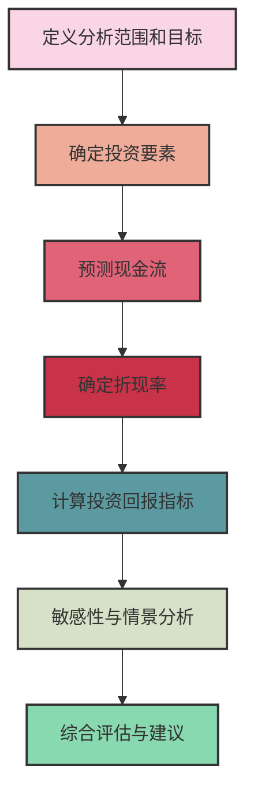

---
{"dg-publish":true,"tags":["商业分析","投资回报","ROI","财务分析","决策支持"],"创建日期":"2024-04-30","permalink":"/知识共享/002_商业分析/01_学习内容/07_决策支持系统/7.5 投资回报分析/","dgPassFrontmatter":true}
---

# 7.5 投资回报分析

> [!quote] 概述
> 本文深入探讨投资回报分析的方法、技巧和应用，作为商业决策支持的核心工具。投资回报分析帮助组织评估不同投资选择的价值创造能力，支持资源分配决策，确保组织资金投入能获得最佳回报，是连接财务管理与战略决策的关键桥梁。

## 投资回报分析的基础概念

### 定义与基本原理

投资回报分析是评估投资项目、业务活动或战略举措的经济价值的系统方法。它帮助决策者回答核心问题："这项投资是否值得？"，并对多个投资选项进行价值比较。

投资回报分析的基本原理包括：
- **价值创造**：投资应创造超过投入成本的价值
- **时间价值**：未来现金流的价值低于当前等额现金
- **风险补偿**：回报率应与投资风险相匹配
- **机会成本**：投资资源用于一个项目意味着放弃其他机会
- **资本约束**：组织资源有限，需优先分配给最有价值的项目

### 主要应用领域

投资回报分析广泛应用于多种商业决策情境：

1. **资本预算决策**：
   - 新产品开发与上市
   - 生产设施扩建或改造
   - 设备更新与技术升级

2. **战略投资评估**：
   - 市场扩张与进入新市场
   - 收购与兼并
   - 研发项目组合

3. **运营改进项目**：
   - 流程优化与自动化
   - 质量改进计划
   - 能源效率与可持续发展项目

4. **技术与系统投资**：
   - IT系统实施与升级
   - 数字化转型项目
   - 数据分析与AI解决方案

## 投资回报分析的主要指标

### 基础回报指标

#### 1. 投资回报率 (ROI)

最基本的投资回报指标，计算公式：

$$ROI = \frac{投资收益 - 投资成本}{投资成本} \times 100\%$$

**优点**：
- 简单直观，易于理解和计算
- 便于跨项目、跨部门比较

**局限性**：
- 忽略了货币时间价值
- 不考虑项目规模差异
- 对"投资收益"和"投资成本"的定义可能不一致

#### 2. 回收期

投资收回初始投资所需的时间：

$$回收期 = \frac{初始投资}{年均现金流入}$$

对于非均匀现金流，则需逐年累计直到收回初始投资。

**优点**：
- 简单易懂，特别关注回收速度
- 关注短期流动性风险

**局限性**：
- 忽略回收期之后的现金流
- 不考虑货币时间价值
- 偏向短期项目

#### 3. 会计收益率 (ARR)

基于会计利润的回报率：

$$ARR = \frac{平均年度净利润}{平均投资额} \times 100\%$$

**优点**：
- 使用常见的会计指标
- 与财务报表兼容

**局限性**：
- 基于会计利润而非现金流
- 忽略货币时间价值
- 可能受会计政策影响

### 折现现金流指标

#### 1. 净现值 (NPV)

将所有未来现金流折现到当前价值并减去初始投资：

$$NPV = -初始投资 + \sum_{t=1}^{n} \frac{CF_t}{(1+r)^t}$$

其中：
- $CF_t$ 是第t期的现金流
- $r$ 是折现率（通常是加权平均资本成本WACC）
- $n$ 是项目期限

**决策规则**：
- NPV > 0：接受项目
- NPV < 0：拒绝项目
- 在多个项目中：选择NPV最高的项目

**优点**：
- 考虑货币时间价值
- 直接衡量价值创造
- 理论上最准确的方法

**局限性**：
- 折现率的选择可能主观
- 结果受预测现金流准确性影响
- 难以直观理解和沟通

#### 2. 内部收益率 (IRR)

使项目净现值等于零的折现率：

$$0 = -初始投资 + \sum_{t=1}^{n} \frac{CF_t}{(1+IRR)^t}$$

**决策规则**：
- IRR > 要求收益率：接受项目
- IRR < 要求收益率：拒绝项目
- 在多个项目中：选择IRR最高的项目（但须谨慎）

**优点**：
- 考虑货币时间价值
- 表示为百分比，直观易懂
- 不需要预先确定折现率

**局限性**：
- 可能存在多个IRR值（现金流多次变号）
- 在互斥项目中可能导致错误决策
- 隐含假设中间现金流以IRR再投资

#### 3. 获利指数 (PI)

未来现金流现值与初始投资比率：

$$PI = \frac{\sum_{t=1}^{n} \frac{CF_t}{(1+r)^t}}{初始投资}$$

**决策规则**：
- PI > 1：接受项目
- PI < 1：拒绝项目
- 在多个项目中：选择PI最高的项目

**优点**：
- 考虑货币时间价值
- 测量每单位投资的相对回报
- 适合资本约束情况下的项目排序

**局限性**：
- 可能忽视项目规模差异
- 不直接测量绝对价值创造

#### 4. 折现回收期

考虑货币时间价值的回收期：

计算过程：累计折现现金流直到回收初始投资。

**优点**：
- 考虑货币时间价值
- 关注回收速度和流动性
- 简单易懂

**局限性**：
- 忽略回收期之后的现金流
- 偏向短期项目

### 指标选择与综合应用

不同指标适用于不同决策情境：

| 指标 | 最适用情境 | 主要关注点 |
|------|----------|----------|
| ROI  | 简单项目比较，短期运营决策 | 资源使用效率 |
| 回收期 | 关注流动性和风险，经济不稳定环境 | 投资收回速度 |
| NPV  | 长期战略投资，价值最大化 | 绝对价值创造 |
| IRR  | 投资者回报率比较，易于沟通的情境 | 投资效率 |
| PI   | 资本受限情况下的项目优先级 | 相对价值效率 |

**最佳实践**：使用多个互补指标，全面理解投资价值。

## 投资回报分析的系统方法

### 分析流程

### 详细步骤说明

1. **定义分析范围和目标**
   - 明确投资决策问题
   - 确定评估周期与边界
   - 设定决策标准和阈值

2. **确定投资要素**
   - 识别初始投资项目
   - 确定相关资产和资源
   - 考虑实施时间和分阶段投资

3. **预测现金流**
   - 识别各类收入与成本项目
   - 预测项目周期内的现金流入和流出
   - 考虑通货膨胀和税收影响
   - 分析运营资本需求变化
   - 评估项目结束时的残值

4. **确定折现率**
   - 计算加权平均资本成本(WACC)
   - 根据项目风险调整折现率
   - 考虑项目特定风险溢价

5. **计算投资回报指标**
   - 计算多种互补指标(NPV、IRR、ROI等)
   - 理解各指标之间的关系与差异

6. **敏感性与情景分析**
   - 识别关键假设与风险变量
   - 进行单因素和多因素敏感性分析
   - 构建不同情景并评估其影响
   - 进行风险模拟(如蒙特卡洛模拟)

7. **综合评估与建议**
   - 整合量化分析与定性因素
   - 提出明确的投资建议
   - 设计决策条件和后评估标准

## 投资回报分析的高级技巧

### 处理不确定性的方法

投资决策面临不确定性，可通过以下方法管理：

#### 1. 风险调整折现率

根据项目风险调整折现率：

$$风险调整折现率 = 无风险利率 + 风险溢价$$

优点是简单直观，缺点是可能过度惩罚长期项目。

#### 2. 情景分析

构建多种可能情景（如乐观、中性、悲观）并计算各情景下的投资回报。

步骤包括：
- 确定关键变量和假设
- 为每个情景设定条件
- 计算各情景下的投资回报指标
- 评估情景概率和加权结果

#### 3. 蒙特卡洛模拟

使用概率分布模拟关键变量的随机变化：

1. 为关键变量定义概率分布
2. 进行大量随机抽样模拟（通常数千次）
3. 分析结果分布，如NPV的概率分布
4. 计算关键统计量和风险指标

优点是全面考虑风险和变量相互作用，缺点是需要专业软件和技能。

#### 4. 实物期权分析

将金融期权理论应用于投资决策，捕捉灵活性价值：

主要实物期权类型：
- **延迟期权**：推迟投资决策
- **扩展期权**：未来扩大投资规模
- **缩减期权**：缩小或终止项目规模
- **转换期权**：改变项目操作方式
- **复合期权**：多个期权的组合

实物期权评估方法包括：
- 决策树分析
- Black-Scholes模型调整版
- 二项式模型

### 财务建模最佳实践

高质量的财务模型是可靠投资回报分析的基础：

1. **结构化设计**：
   - 清晰分离输入假设、计算和输出
   - 模块化设计，便于审查和理解
   - 一致的格式和标记系统

2. **健壮性**：
   - 避免硬编码数字，使用变量和引用
   - 进行合理性检查和平衡验证
   - 设计清晰的错误检测机制

3. **透明性**：
   - 记录关键假设及其来源
   - 提供公式解释和注释
   - 突出重要结论和关键数据

4. **灵活性**：
   - 设计便于敏感性分析的结构
   - 允许快速修改关键假设
   - 支持多种情景比较

## 行业案例分析

### 案例1：制造设备自动化升级投资

**背景**：一家制造企业考虑投资1000万元升级生产线自动化系统

**投资回报分析**：
- 初始投资：1000万元
- 预期使用寿命：8年
- 年度效益：
  - 人工成本节约：220万元
  - 材料损耗减少：80万元
  - 能源效率提升：50万元
  - 质量改进：90万元
- 年度增量成本：
  - 维护费用：60万元
  - 培训费用：20万元

**关键指标分析**：
- NPV（12%折现率）：846万元
- IRR：23.4%
- 折现回收期：4.2年
- ROI：46%

**敏感性分析**：人工成本和设备寿命是最敏感变量。

**决策建议**：批准投资，但需建立明确的实施计划和绩效监控系统。

### 案例2：SaaS产品开发投资

**背景**：科技公司评估开发新云服务产品的投资

**投资回报分析**：
- 初始开发投资：600万元
- 市场推广初期投入：300万元
- 年度收入预测（5年）：
  - 第1年：200万元
  - 第2年：450万元
  - 第3年：800万元
  - 第4年：950万元
  - 第5年：1100万元
- 运营成本率：收入的40%

**情景分析**：
- 乐观情景（30%概率）：NPV = 1200万元
- 基准情景（50%概率）：NPV = 650万元
- 悲观情景（20%概率）：NPV = -200万元
- 期望NPV = 650万元

**实物期权识别**：
- 分阶段投资选项（价值180万元）
- 扩展到新市场选项（价值250万元）

**决策建议**：采用分阶段实施策略，设置明确的市场验证里程碑。

### 案例3：零售网络扩张决策

**背景**：零售连锁评估三个城市的扩张选项

**投资回报比较**：

| 指标 | 城市A | 城市B | 城市C |
|------|------|------|------|
| 初始投资 | 2000万 | 1500万 | 1200万 |
| NPV | 950万 | 820万 | 680万 |
| IRR | 18% | 22% | 24% |
| 回收期 | 4.5年 | 3.8年 | 3.2年 |
| 风险评级 | 中等 | 高 | 低 |

**资源约束**：可用资金2500万元。

**战略考量**：
- 城市A：市场规模最大，竞争激烈
- 城市B：增长最快，但政策不确定性高
- 城市C：市场稳定，品牌渗透容易

**决策建议**：投资城市C和部分城市B（分阶段），保留未来进入城市A的选项。

## 投资回报分析的常见挑战与对策

### 主要挑战

1. **预测准确性**：
   - 挑战：未来现金流预测固有不确定性
   - 对策：使用情景分析和概率方法，持续更新预测

2. **非财务因素整合**：
   - 挑战：难以量化战略价值、品牌影响等
   - 对策：开发平衡计分卡和多标准评估框架

3. **折现率确定**：
   - 挑战：适当风险调整折现率的选择
   - 对策：使用资本资产定价模型(CAPM)和行业基准

4. **项目相互依赖**：
   - 挑战：投资项目间的协同效应或排他性
   - 对策：投资组合分析和系统观点

5. **范围界定**：
   - 挑战：确定相关成本和收益的边界
   - 对策：增量分析方法和明确记录假设

### 行业特定考量

不同行业的投资回报分析关注点不同：

| 行业 | 回报周期 | 关键风险因素 | 评估重点 |
|------|---------|------------|---------|
| 技术/软件 | 短至中期 | 技术变革、采用率 | 市场渗透、扩展性 |
| 制造业 | 中至长期 | 产能利用、投入成本 | 效率改进、质量影响 |
| 能源/基础设施 | 长期 | 监管变化、技术陈旧 | 生命周期成本、可靠性 |
| 零售 | 短至中期 | 消费者偏好、位置 | 销售密度、客户获取成本 |
| 医疗/制药 | 长期 | 监管审批、成功率 | 知识产权价值、市场规模 |

## 投资回报分析的数字化趋势

### 新兴工具与技术

1. **AI驱动的预测模型**：
   - 使用机器学习改进现金流预测
   - 基于历史数据识别模式和相关性
   - 自动更新预测和调整模型

2. **数字孪生与模拟**：
   - 创建业务运营的数字模型
   - 实时模拟投资影响
   - 支持动态决策调整

3. **大数据集成平台**：
   - 整合内外部数据源
   - 提供全面视角和深度分析
   - 自动更新投资表现指标

4. **智能决策仪表板**：
   - 实时投资绩效可视化
   - 整合多种投资指标
   - 提供情景建模和假设测试能力

### 敏捷投资管理方法

现代投资回报分析正向更敏捷的方法转变：

1. **持续评估模型**：
   - 从单点评估转向持续监控
   - 根据实际结果调整预测
   - 设立决策检查点

2. **价值增量法**：
   - 分阶段投资以验证假设
   - 建立明确的成功标准
   - 基于阶段结果调整策略

3. **数据驱动的投资组合管理**：
   - 动态资源重分配
   - 跨项目优化投资回报
   - 实时项目优先级调整

## 实践练习

### 练习1：基本投资回报计算

**情境**：一个IT系统升级项目

**基本数据**：
- 初始投资：500,000元
- 预期使用年限：5年
- 年度现金流入：150,000元
- 折现率：10%

**练习任务**：
1. 计算简单回收期
2. 计算NPV和IRR
3. 如果年度现金流量变为：120,000、140,000、160,000、180,000、200,000元，结果如何变化？

### 练习2：多项目投资决策

**情境**：公司评估三个可能的投资项目，但预算有限

**基本数据**：
- 可用预算：2,000,000元

| 项目 | 投资额(元) | NPV(元) | IRR | 折现回收期 |
|------|----------|--------|-----|----------|
| A | 900,000 | 400,000 | 18% | 3.2年 |
| B | 1,200,000 | 550,000 | 16% | 3.8年 |
| C | 1,500,000 | 700,000 | 15% | 4.0年 |

**练习任务**：
1. 计算每个项目的获利指数(PI)
2. 根据不同标准确定最佳投资组合
3. 如果项目之间有一定的协同效应，如何调整分析方法？

## 思考问题

1. 在什么情况下，NPV和IRR可能导致相互矛盾的投资决策？如何解决这一冲突？
2. 投资回报分析在评估无形资产投资(如品牌建设、员工培训)时面临哪些挑战？如何应对？
3. 数字化转型项目的投资回报往往难以准确评估，有哪些更有效的方法？
4. 在高度不确定的环境中，如何平衡分析的严谨性与决策的及时性？
5. 实物期权分析如何改变传统NPV分析可能拒绝的项目？请举例说明。
6. 可持续发展投资如何纳入投资回报分析框架？应考虑哪些额外因素？
7. 不同组织文化如何影响投资回报分析的应用和决策过程？
8. AI和自动化技术如何改变投资回报分析的未来实践？

## 延伸阅读

1. Brealey, R. A., Myers, S. C., & Allen, F. (2019). *Principles of Corporate Finance*. McGraw-Hill Education.
2. Damodaran, A. (2012). *Investment Valuation: Tools and Techniques for Determining the Value of Any Asset*. Wiley.
3. Mun, J. (2016). *Real Options Analysis: Tools and Techniques for Valuing Strategic Investments and Decisions*. Wiley.
4. Koller, T., Goedhart, M., & Wessels, D. (2020). *Valuation: Measuring and Managing the Value of Companies*. Wiley.
5. Peterson, P., & Fabozzi, F. J. (2002). *Capital Budgeting: Theory and Practice*. Wiley.

## 相关概念链接

- [[知识共享/002_商业分析/01_学习内容/07_决策支持系统/7.1 决策理论基础\|7.1 决策理论基础]] - 投资回报分析的理论基础
- [[知识共享/002_商业分析/01_学习内容/07_决策支持系统/7.4 敏感性分析\|7.4 敏感性分析]] - 投资回报分析中的敏感性分析应用
- [[知识共享/002_商业分析/01_学习内容/07_决策支持系统/7.6 风险分析与管理\|7.6 风险分析与管理]] - 投资回报评估中的风险考量
- [[知识共享/002_商业分析/01_学习内容/06_商业模式分析/6.4 成本结构分析\|6.4 成本结构分析]] - 投资回报分析中的成本因素
- [[知识共享/002_商业分析/01_学习内容/03_分析方法与工具/3.3 预测性分析方法\|3.3 预测性分析方法]] - 支持现金流预测的分析方法 