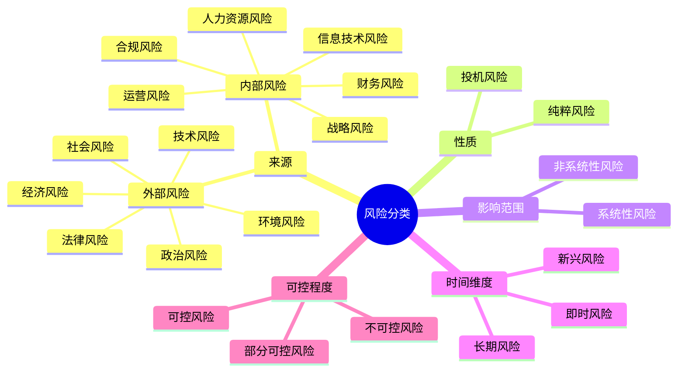
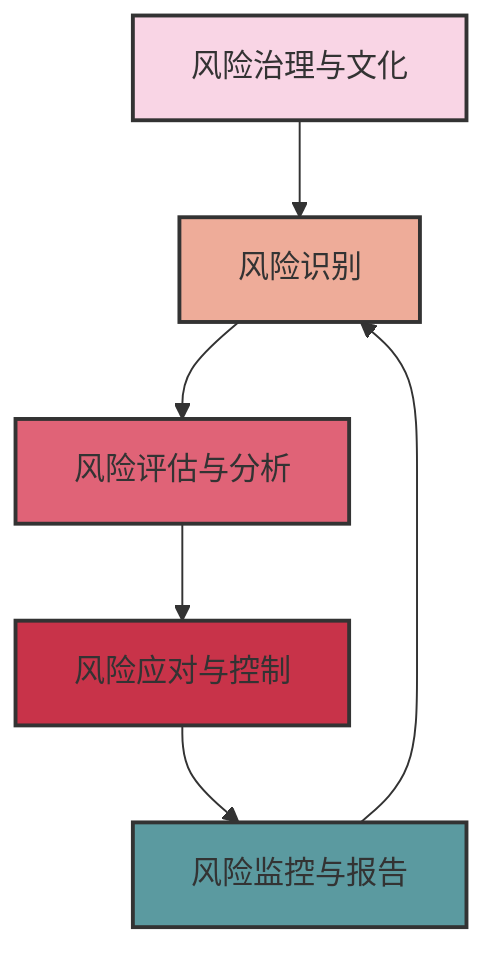

---
{"dg-publish":true,"tags":["商业分析","风险分析","风险管理","决策支持","不确定性"],"创建日期":"2024-04-30","permalink":"/知识共享/002_商业分析/01_学习内容/07_决策支持系统/7.6 风险分析与管理/","dgPassFrontmatter":true}
---


# 7.6 风险分析与管理

> [!quote] 概述
> 本文深入探讨风险分析与管理的系统方法、工具和最佳实践，作为商业决策支持的关键组成部分。在不确定性日益增加的商业环境中，高效的风险分析与管理能够帮助组织识别潜在威胁和机会，优化决策过程，提高组织韧性，并在竞争中获取优势。

## 风险分析与管理的基础概念

### 核心定义与原则

风险分析是系统地评估潜在事件发生的可能性和影响程度，而风险管理则是设计和实施应对策略来控制和优化风险敞口的过程。

基本原则包括：
- **风险与回报平衡**：更高回报通常伴随更高风险
- **风险多样性**：不同类型风险需要不同管理方法
- **全面性**：考虑所有相关风险维度
- **整合性**：风险管理应融入所有业务决策
- **持续性**：风险分析与管理是持续过程而非一次性活动

### 风险类型与分类

风险可以通过多种维度进行分类：



### 风险态度与偏好

风险态度是个人或组织对风险的心理倾向，包括：
- **风险规避型**：倾向于避免风险，即使可能牺牲部分回报
- **风险中性型**：基于预期价值做决策，不受风险本身影响
- **风险寻求型**：愿意承担更高风险以获取更高潜在回报

风险偏好是组织愿意承担的风险总量和类型，通常通过以下方式表达：
- 定性描述的风险偏好声明
- 定量风险限额和阈值
- 风险-回报曲线和效用函数

## 风险分析的系统方法

### 风险管理框架

全面的风险管理框架包括以下核心组件：



### 风险识别

风险识别是发现和记录可能影响组织目标实现的潜在事件：

1. **风险识别技术**：
   - 头脑风暴和专家访谈
   - 德尔菲法（结构化专家意见收集）
   - 核对表和问卷调查
   - 历史数据分析和案例研究
   - 过程分析和价值链评估
   - SWOT分析与情景规划

2. **风险分类框架**：
   - PESTEL分析（政治、经济、社会、技术、环境、法律）
   - Porter五力模型（供应商、买家、竞争对手、替代品、新进入者）
   - 价值链分析（主要活动和支持活动风险）
   - 业务流程映射（关键流程和依赖性）

3. **风险识别的关键问题**：
   - 什么可能出错？
   - 哪里可能出问题？
   - 为什么会出问题？
   - 什么时候可能出问题？
   - 谁会受到影响？
   - 可能的后果是什么？

### 风险评估与分析

风险评估是评价风险的影响程度和发生可能性：

#### 1. 定性风险评估

使用描述性尺度评估风险：

| 可能性 | 影响 | 风险评级 |
|--------|------|----------|
| 很高 | 严重 | 极高风险 |
| 高 | 重大 | 高风险 |
| 中等 | 中等 | 中等风险 |
| 低 | 轻微 | 低风险 |
| 很低 | 可忽略 | 可忽略风险 |

**风险热力图**示例：

```mermaid
quadrantChart
    title 风险热力图
    x-axis 影响程度 --> 高
    y-axis 低 <--> 可能性
    quadrant-1 "高风险区"
    quadrant-2 "极高风险区"
    quadrant-3 "低风险区"
    quadrant-4 "中等风险区"
```

#### 2. 定量风险评估

使用数字方法评估风险：

- **预期货币价值**(EMV)：风险影响 × 发生概率
- **风险价值**(VaR)：在给定置信水平下，特定时期内的最大潜在损失
- **条件风险价值**(CVaR)：超过VaR的预期损失
- **情景分析**：评估特定风险情景的后果
- **蒙特卡洛模拟**：利用概率分布和随机抽样模拟风险结果

#### 3. 半定量风险评估

结合定性与定量方法：
- 使用数值尺度（如1-5）评估可能性和影响
- 定义风险优先级计算公式（如风险评分 = 可能性 × 影响）
- 基于分数阈值确定风险应对优先级

### 风险应对与控制

根据评估结果开发风险应对策略：

#### 1. 主要风险应对策略

- **规避**：避免或退出产生风险的活动
- **转移**：将风险责任部分或全部转移给第三方（如保险、外包）
- **减轻**：降低风险发生概率或/和影响程度
- **接受**：接受并管理风险后果
- **利用**：将风险转化为机会

#### 2. 风险控制框架

- **预防控制**：降低风险发生可能性（如培训、政策）
- **检测控制**：及早发现风险事件（如监控、审计）
- **纠正控制**：减轻风险事件影响（如应急计划、备份系统）
- **引导控制**：影响行为以支持风险目标（如激励机制）

#### 3. 成本-效益分析

评估风险应对策略的有效性：
- 风险缓解成本（控制实施和维护成本）
- 风险缓解收益（潜在损失减少）
- 残余风险评估（应对措施后剩余风险）
- 投资回报计算（风险应对ROI）

## 风险管理高级技术

### 企业风险管理(ERM)

ERM是整合组织各层级风险管理的全面方法：

1. **ERM核心要素**：
   - 风险治理与组织结构
   - 风险战略与风险偏好
   - 风险文化与意识
   - 整合的风险评估与应对
   - 风险报告与沟通

2. **主要ERM框架**：
   - COSO ERM框架
   - ISO 31000风险管理标准
   - FERMA风险管理标准
   - RIMS风险成熟度模型

3. **ERM实施步骤**：
   - 获取高管支持与资源
   - 建立风险治理结构
   - 确定风险偏好与容忍度
   - 开发一致的风险评估方法
   - 整合现有风险管理活动
   - 创建风险报告机制
   - 持续改进与优化

### 韧性与业务连续性规划

韧性是组织应对和适应变化环境的能力：

1. **韧性的核心维度**：
   - 运营韧性
   - 财务韧性
   - 战略韧性
   - 技术韧性
   - 人员韧性

2. **业务连续性规划(BCP)要素**：
   - 业务影响分析
   - 恢复时间目标(RTO)与恢复点目标(RPO)
   - 关键功能识别
   - 应急响应程序
   - 恢复策略
   - 测试与演练
   - 计划维护与更新

3. **危机管理计划**：
   - 危机识别阈值
   - 危机响应团队与职责
   - 内外部沟通协议
   - 升级程序
   - 决策授权
   - 后危机恢复与教训总结

### 高级分析与风险建模

现代风险管理利用先进分析技术：

1. **预测分析**：
   - 时间序列分析预测风险趋势
   - 机器学习模型识别风险模式
   - 自然语言处理分析风险文本
   - 社交媒体监测提前预警

2. **相关性与因果分析**：
   - 风险因素相关性矩阵
   - 贝叶斯网络建模风险因果关系
   - 系统动力学模拟风险级联效应
   - 风险影响路径分析

3. **复杂系统分析**：
   - 压力测试与极端情景分析
   - 网络分析评估风险传导
   - 适应性系统模型
   - 黑天鹅事件评估

## 行业案例分析

### 案例1：金融服务风险管理转型

**背景**：大型银行实施全面风险管理项目以应对监管变化与市场动荡

**挑战**：
- 风险管理流程分散在不同部门
- 风险数据不一致且访问困难
- 风险报告滞后，难以支持实时决策
- 新兴风险（如网络和声誉风险）评估不足

**解决方案**：
1. 建立集中式风险管理框架与治理结构
2. 实施整合风险数据平台
3. 开发实时风险仪表板与早期预警系统
4. 引入新型风险建模技术和情景分析

**成果**：
- 风险检测提前12-24小时
- 风险管理成本降低18%
- 监管审查评级提高
- 抵御市场波动能力增强

### 案例2：供应链风险管理

**背景**：全球制造企业应对供应链中断与地缘政治风险

**挑战**：
- 复杂的全球供应网络
- 关键组件的单一供应来源
- 缺乏供应链透明度
- 区域性中断风险加剧

**解决方案**：
1. 全面供应链风险评估与映射
2. 开发数字供应链孪生模型进行情景测试
3. 实施多层级供应商监控系统
4. 建立战略库存与区域多元化策略

**成果**：
- 供应中断减少35%
- 关键风险识别提前时间增加60天
- 供应链韧性得分从63提高到87
- 完成战略供应商多元化，减少地区集中度

### 案例3：技术产品风险驱动开发

**背景**：软件公司将风险分析融入产品开发流程

**挑战**：
- 产品开发和上市时间压力
- 安全和隐私风险不断演变
- 用户体验与风险控制平衡
- 缺乏量化的风险评估标准

**解决方案**：
1. 整合DevSecOps方法论
2. 开发产品风险分类框架
3. 实施持续风险评估自动化工具
4. 建立风险接受标准与审批流程

**成果**：
- 安全漏洞减少58%
- 合规问题提前识别率提高75%
- 风险相关产品延迟减少29%
- 客户信任度测量提高17分

## 风险管理最佳实践与共同错误

### 最佳实践

1. **风险文化培养**：
   - 从高层建立风险意识
   - 将风险考量融入日常决策
   - 鼓励风险报告和透明沟通
   - 奖励积极风险管理行为

2. **风险整合**：
   - 将风险管理融入战略规划
   - 在项目管理中嵌入风险流程
   - 将风险考量纳入绩效管理
   - 在资源分配中考虑风险优先级

3. **技术启用**：
   - 利用自动化提高风险监控效率
   - 建立集成风险数据仓库
   - 开发风险可视化仪表板
   - 利用预测分析提供前瞻性洞见

4. **持续改进**：
   - 定期审查风险管理有效性
   - 实施风险管理成熟度评估
   - 学习接近错失和小规模失败
   - 确保风险流程适应环境变化

### 常见错误

1. **狭隘的风险聚焦**：
   - 仅关注财务或合规风险
   - 忽视战略和新兴风险
   - 过度关注风险避免而忽略机会

2. **孤立的风险管理**：
   - 风险管理作为独立职能
   - 缺乏跨部门风险协调
   - 风险管理与决策流程脱节

3. **静态风险评估**：
   - 风险评估作为年度形式
   - 忽视风险相互依赖性
   - 未进行持续风险监控

4. **过度依赖模型**：
   - 盲目信任复杂模型
   - 忽视模型假设限制
   - 疏忽定性风险因素

## 风险分析与管理的新兴趋势

### 数字化转型中的风险管理

1. **数字风险新领域**：
   - 网络安全与数据隐私
   - 算法偏见与决策风险
   - 系统复杂性与依赖风险
   - 数字化转型执行风险

2. **数字风险管理创新**：
   - 实时风险监控与分析
   - 自动化合规与风险控制
   - 分布式风险治理模型
   - 基于区块链的风险透明度

3. **数字韧性**：
   - 设计灵活架构
   - 实施安全与隐私设计
   - 建立数字应急响应能力
   - This is part of an enumerated list of factors related to digital resilience in risk management.
   - 发展数字供应链安全

### ESG与可持续风险管理

环境、社会和治理(ESG)风险日益重要：

1. **气候与环境风险**：
   - 物理风险（极端天气、资源稀缺）
   - 转型风险（政策变化、技术变革）
   - 生物多样性与生态系统风险
   - 循环经济与资源效率

2. **社会风险**：
   - 员工健康与安全
   - 人权与劳工实践
   - 社区关系与社会许可
   - 多样性与包容性

3. **治理风险**：
   - 商业道德与诚信
   - 董事会效能与多样性
   - 高管薪酬与激励
   - 利益相关者参与

### 协作风险管理

传统的组织边界风险管理正在向协作模式转变：

1. **生态系统风险管理**：
   - 价值链协作风险评估
   - 行业标准与最佳实践共享
   - 关键风险早期预警网络
   - 跨组织风险响应协调

2. **公私伙伴关系**：
   - 政府与企业风险合作
   - 关键基础设施风险共担
   - 系统性风险联合应对
   - 风险研究与创新协作

3. **集体智慧应用**：
   - 风险众包与预警系统
   - 风险知识共享平台
   - 开源风险模型与工具
   - 跨学科风险分析方法

## 实践练习

### 练习1：风险识别与评估

**情境**：一家电子商务公司计划扩展到新的国际市场

**练习步骤**：
1. 使用PESTEL框架识别至少12个潜在风险
2. 为每个风险评估可能性(1-5)和影响(1-5)
3. 创建风险热力图并确定优先处理的风险
4. 为前三个高优先级风险提出适当的风险应对策略

### 练习2：情景规划与风险应对

**情境**：零售企业面临供应链中断风险

**练习步骤**：
1. 确定三个可能的供应链中断情景
2. 评估每个情景对关键业务功能的影响
3. 开发针对每个情景的风险缓解策略
4. 设计预警指标系统跟踪风险发展
5. 评估风险应对措施的成本与收益

## 思考问题

1. 在高度不确定的环境中，传统风险管理方法的局限性是什么？如何改进？
2. 组织应如何平衡风险规避与创新之间的关系？
3. 技术如何改变风险识别、评估和应对的方式？
4. 如何将风险管理从合规工具转变为战略优势来源？
5. 全球风险形势变化（如气候变化、地缘政治不稳定）如何影响组织的风险管理实践？
6. 在风险管理中，定量与定性方法如何互补？什么情况下一种方法优于另一种？
7. 风险文化如何影响组织的风险管理有效性？如何培养积极的风险文化？
8. 如何衡量风险管理的成功？哪些指标最有意义？

## 延伸阅读

1. Hubbard, D. W. (2020). *How to Measure Anything in Cybersecurity Risk*. Wiley.
2. Hopkin, P. (2018). *Fundamentals of Risk Management: Understanding, Evaluating and Implementing Effective Risk Management*. Kogan Page.
3. COSO. (2017). *Enterprise Risk Management: Integrating with Strategy and Performance*.
4. Taleb, N. N. (2012). *Antifragile: Things That Gain from Disorder*. Random House.
5. Kaplan, R. S., & Mikes, A. (2012). "Managing Risks: A New Framework." *Harvard Business Review*, 90(6), 48-60.

## 相关概念链接

- [[知识共享/002_商业分析/01_学习内容/07_决策支持系统/7.1 决策理论基础\|7.1 决策理论基础]] - 风险分析的理论基础
- [[知识共享/002_商业分析/01_学习内容/07_决策支持系统/7.3 情景规划\|7.3 情景规划]] - 风险分析中情景规划的应用
- [[知识共享/002_商业分析/01_学习内容/07_决策支持系统/7.4 敏感性分析\|7.4 敏感性分析]] - 风险评估中的敏感性分析
- [[知识共享/002_商业分析/01_学习内容/07_决策支持系统/7.5 投资回报分析\|7.5 投资回报分析]] - 风险与投资回报的平衡
- [[知识共享/002_商业分析/01_学习内容/07_决策支持系统/7.7 实时决策支持\|7.7 实时决策支持]] - 风险监控与实时决策支持的关系
- [[知识共享/002_商业分析/01_学习内容/04_市场与竞争分析/4.4 宏观环境分析\|4.4 宏观环境分析]] - 外部风险识别的框架 