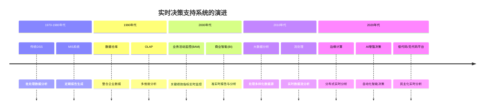
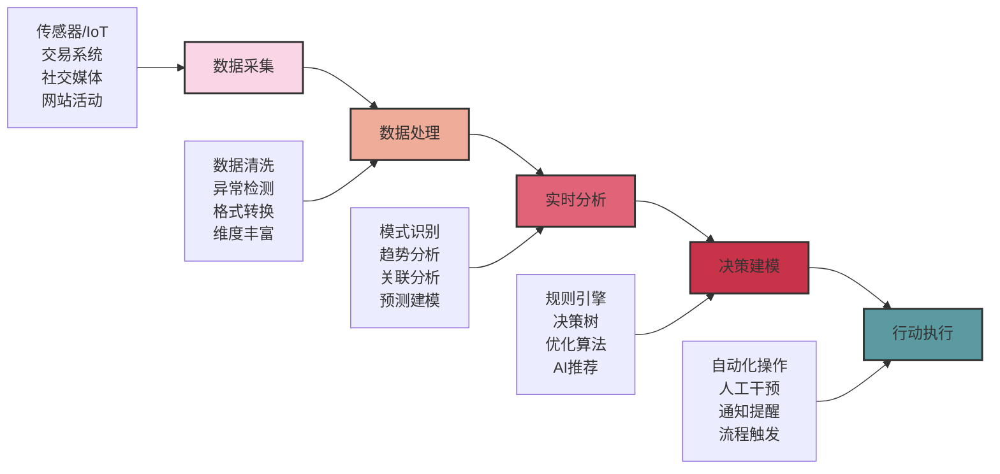
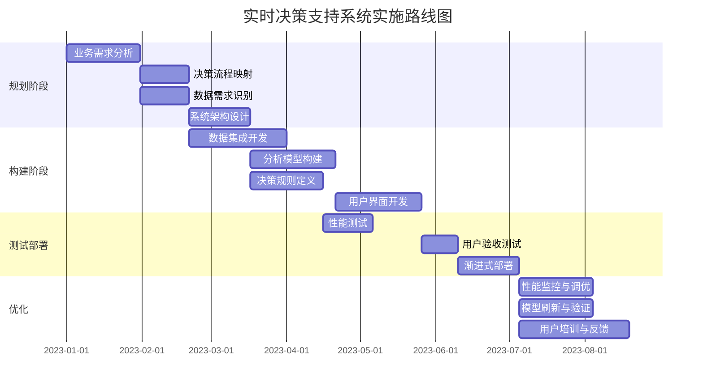
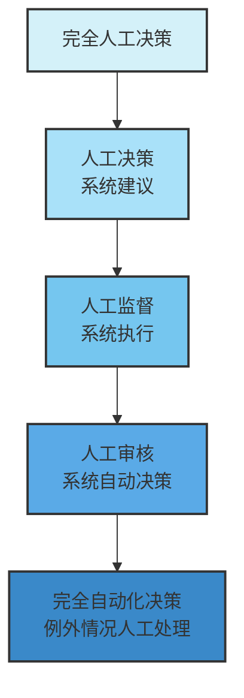

---
{"dg-publish":true,"tags":["商业分析","实时决策","决策支持系统","数据分析","业务智能"],"创建日期":"2024-04-30","permalink":"/知识共享/002_商业分析/01_学习内容/07_决策支持系统/7.7 实时决策支持/","dgPassFrontmatter":true}
---

> [!quote] 概述
> 实时决策支持系统代表了决策支持技术的最前沿发展，使组织能够基于即时数据做出快速反应和预测性决策。本文深入探讨实时决策支持的概念、技术基础、应用场景和实施策略，以及它如何帮助现代组织在瞬息万变的商业环境中保持竞争优势。

## 实时决策支持基础

### 实时决策支持的定义与演进

实时决策支持系统(RTDSS)是能够连续收集、处理和分析数据，并在需要时立即提供决策建议的系统。与传统决策支持系统相比，实时系统的主要区别在于:

1. **时间敏感性**：以秒或分钟为单位而非小时或天
2. **持续性**：连续处理流数据而非批量处理
3. **适应性**：根据最新情况自动调整决策参数
4. **前瞻性**：不仅分析当前状态，还预测短期趋势

实时决策支持的演进历程：

### 实时决策的技术基础

构建实时决策支持系统的核心技术组件包括：

1. **数据获取技术**
   - 传感器网络与物联网(IoT)设备
   - 应用程序接口(API)与网络钩子(webhooks)
   - 变更数据捕获(CDC)
   - 消息队列与事件总线
   - 日志文件流式传输

2. **数据处理架构**
   - 流处理引擎(如Apache Kafka, Apache Flink)
   - 内存数据库(如Redis, MemSQL)
   - 时间序列数据库(如InfluxDB, TimescaleDB)
   - 计算引擎(如Apache Spark Streaming)
   - 微服务与事件驱动架构

3. **分析与决策技术**
   - 复杂事件处理(CEP)
   - 规则引擎与决策表
   - 机器学习与预测分析
   - 自然语言处理(NLP)
   - 图分析算法

4. **可视化与交互层**
   - 实时仪表板
   - 指标预警与通知系统
   - 交互式分析工具
   - 增强现实(AR)界面
   - 移动决策应用

### 从数据到洞见：实时分析流程

实时决策支持系统将原始数据转化为可行洞见的过程：

## 实时决策支持的应用领域

### 运营与供应链决策

实时决策支持在企业运营中的应用：

1. **库存与供应链优化**
   - 动态库存调整与补货决策
   - 供应链风险实时监控与缓解
   - 物流路线即时优化
   - 预测性维护计划调整

2. **生产管理**
   - 生产线实时调度与平衡
   - 质量控制即时反馈
   - 能源消耗优化
   - 资源分配动态调整

3. **服务运营**
   - 人力资源即时调配
   - 服务质量监控与干预
   - 容量规划实时更新
   - 异常事件快速响应

### 客户与市场决策

以客户为中心的实时决策应用：

1. **个性化客户体验**
   - 实时推荐系统
   - 动态定价策略
   - 个性化内容提供
   - 交互式客户服务调整

2. **市场营销优化**
   - 广告活动实时绩效分析与调整
   - 社交媒体情绪分析与应对
   - 活动转化率即时监控
   - 竞争策略动态调整

3. **销售支持**
   - 交叉销售与追加销售机会识别
   - 销售漏斗实时优化
   - 客户流失风险预警
   - 销售代表实时指导

### 风险管理与合规

实时风险监控与管理：

1. **金融风险决策**
   - 欺诈检测与预防
   - 信用风险即时评估
   - 市场风险实时监控
   - 异常交易识别

2. **安全与合规**
   - 网络安全威胁检测与响应
   - 合规偏差即时警报
   - 隐私与数据保护监控
   - 员工行为异常识别

3. **运营风险管理**
   - 关键系统性能监控
   - 流程异常检测
   - 系统失效预测
   - 灾难恢复触发

## 实时决策支持系统的设计与实施

### 系统架构设计原则

构建高效实时决策支持系统的关键原则：

1. **可扩展性**：系统能够随数据量和用户数增长而扩展
2. **低延迟**：确保决策相关计算在要求时间窗口内完成
3. **高可用性**：关键决策功能的连续可用性
4. **数据一致性**：确保决策基于一致且可靠的数据
5. **适应性**：能够适应变化的业务需求和数据模式
6. **可解释性**：决策推荐的透明度和解释能力
7. **安全性**：数据和决策过程的完整性保护

### 实施方法论

成功实施实时决策支持的步骤框架：

实施过程中的关键考虑因素：

1. **业务需求优先级排序**
   - 识别最高价值决策点
   - 确定关键性能指标(KPIs)
   - 设定明确的成功标准

2. **数据战略**
   - 数据来源质量评估
   - 数据治理与合规保障
   - 数据延迟与刷新需求匹配

3. **技术选择**
   - 构建vs购买决策
   - 开源vs专有解决方案评估
   - 云vs本地部署考量

4. **变更管理**
   - 利益相关者参与计划
   - 用户培训与支持
   - 运营流程调整

### 常见挑战与解决策略

实施实时决策支持时的典型障碍与解决方法：

| 挑战 | 表现 | 解决策略 |
|------|------|----------|
| 数据质量问题 | 不完整、不准确或不一致的数据 | • 实施实时数据验证 • 建立数据质量SLA • 设计数据异常补偿机制 |
| 延迟管理 | 处理时间超过业务容忍度 | • 实施分层数据处理 • 优化分析算法 • 采用内存计算 |
| 过度复杂性 | 系统难以维护与理解 | • 模块化设计 • 文档标准化 • 渐进式功能发布 |
| 用户采纳率低 | 决策支持未集成入工作流程 | • 无缝工作流集成 • 个性化界面设计 • 明确展示决策价值 |
| 扩展性瓶颈 | 在高负载下性能下降 | • 水平扩展架构 • 负载平衡策略 • 资源弹性分配 |

## 实时决策支持的先进应用

### 人工智能增强决策

AI和机器学习如何提升实时决策支持：

1. **预测性分析**
   - 客户行为预测
   - 设备故障预测
   - 需求预测与资源规划
   - 风险事件预警

2. **认知洞察**
   - 非结构化数据分析（文本、图像、语音）
   - 语义理解与意图识别
   - 模式发现与异常检测
   - 情境感知决策建议

3. **自适应学习**
   - 持续模型优化
   - 强化学习应用
   - 自动特征工程
   - 实时模型验证与调整

### 自动化决策与智能流程

自动化决策实施的层级：

自动化决策应用场景：

1. **交易决策**
   - 贷款与信用审批
   - 动态定价与折扣
   - 库存补货触发
   - 保险承保

2. **运营自动化**
   - 预测性维护调度
   - 智能工单分配
   - 资源动态配置
   - 异常事件响应协议

3. **客户交互**
   - 智能聊天机器人决策
   - 个性化优惠触发
   - 服务升级与降级
   - 自动投诉解决

### 边缘计算与分布式决策

在数据源头处理数据的优势：

1. **边缘分析架构**
   - 设备/网关层分析
   - 雾计算中间层
   - 云端综合分析
   - 分层决策模型

2. **关键应用**
   - 自动驾驶车辆决策
   - 智能工厂设备控制
   - 零售店内实时分析
   - 分布式能源管理

3. **实施考量**
   - 边缘设备能力限制
   - 连接可靠性策略
   - 模型分发与更新
   - 安全与隐私保护

## 行业案例与最佳实践

### 案例1：零售业实时决策转型

**背景**：全球零售连锁企业实施全渠道实时决策平台

**挑战**：
- 线上线下客户数据孤岛
- 库存可见性延迟导致销售损失
- 竞争对手价格变动反应迟缓
- 个性化体验不一致

**解决方案**：
1. 构建统一客户数据平台，整合所有接触点
2. 实施RFID和IoT支持的实时库存追踪
3. 开发竞争对手价格监控与自动调价系统
4. 建立全渠道个性化推荐引擎

**成果**：
- 库存准确性提高到98.5%
- 减少40%的因缺货导致的销售损失
- 动态定价策略增加15%毛利
- 个性化推荐转化率提高23%

### 案例2：金融服务实时风险管理

**背景**：大型银行实施实时风险监控和决策系统

**挑战**：
- 传统批处理风险监控导致欺诈损失
- 跨渠道交易风险评估不一致
- 合规报告滞后导致监管问题
- 客户体验因风险控制措施受损

**解决方案**：
1. 构建实时交易监控平台，融合机器学习检测
2. 开发统一的跨渠道风险评分引擎
3. 实施实时合规监控与报告系统
4. 建立风险与客户体验平衡的决策框架

**成果**：
- 欺诈检测速度从小时级提升到秒级
- 欺诈损失减少65%
- 合规报告生成时间缩短90%
- 降低35%的误报率，改善客户体验

### 案例3：制造业智能生产决策

**背景**：汽车零部件制造商实施实时生产优化系统

**挑战**：
- 生产计划对市场变化反应迟缓
- 设备停机导致生产延误
- 质量问题发现滞后
- 能源与资源利用效率低

**解决方案**：
1. 构建需求感知的动态生产调度系统
2. 实施设备状态实时监控与预测性维护
3. 开发实时质量检测与根因分析
4. 建立能源与资源动态优化平台

**成果**：
- 生产计划调整时间从天级缩短到小时级
- 设备意外停机减少47%
- 质量问题检测提前率提高75%
- 能源消耗降低18%

## 实时决策支持的未来展望

### 新兴技术与趋势

塑造实时决策未来的关键技术：

1. **量子计算**
   - 复杂优化问题实时求解
   - 大规模模拟与预测能力
   - 新算法与决策模型

2. **可解释AI**
   - 透明决策过程
   - 实时决策合理性验证
   - 人机协作决策框架

3. **增强分析**
   - 自然语言决策界面
   - 增强/虚拟现实决策环境
   - 情境感知推荐

4. **自主决策系统**
   - 闭环优化与学习
   - 多目标自适应决策
   - 基于意图的决策框架

### 实时决策伦理与治理

实时自动化决策的伦理考量：

1. **伦理框架**
   - 决策公平性与偏见消除
   - 透明度与可解释性原则
   - 人类监督与干预机制
   - 隐私与数据使用边界

2. **治理结构**
   - 算法审计与问责
   - 决策系统风险评估
   - 自动化决策合规框架
   - 持续伦理监控

3. **社会影响考量**
   - 就业与工作转型
   - 技能发展与培训
   - 数字鸿沟与公平访问
   - 长期社会效益评估

## 构建实时决策能力

### 组织准备度评估

评估组织实时决策就绪性的关键维度：

| 维度 | 初级 | 中级 | 高级 |
|------|------|------|------|
| 数据基础设施 | 批处理导向， 有限的数据整合 | 部分实时数据流， 中等整合度 | 全面流处理架构， 高度整合数据平台 |
| 分析能力 | 描述性分析， 基本报告 | 诊断性与部分预测性分析， 交互式仪表板 | 高级预测与指导性分析， 自动化洞察生成 |
| 决策流程 | 高度依赖人工， 线性决策链 | 部分自动化建议， 半结构化决策 | 智能决策自动化， 动态决策网络 |
| 技术技能 | 有限的数据科学与工程能力 | 专职数据团队， 中等AI/ML能力 | 全面数据科学实践， 高级AI/ML专业知识 |
| 组织文化 | 依赖经验决策， 风险规避 | 数据辅助决策， 适度创新 | 数据驱动文化， 实验与学习导向 |

### 实时决策转型路线图

发展实时决策能力的分阶段方法：

1. **基础阶段**
   - 识别高价值实时决策用例
   - 建立数据流架构与集成
   - 开发关键实时指标与监控
   - 培养数据素养与分析技能

2. **成长阶段**
   - 扩展实时数据源与整合
   - 实施预测分析试点项目
   - 开发决策规则自动化
   - 整合实时洞察到工作流程

3. **成熟阶段**
   - 实现全面的决策自动化
   - 建立企业级实时分析平台
   - 实施高级AI决策支持
   - 培养实验与持续优化文化

4. **领先阶段**
   - 创新决策算法与方法
   - 建立生态系统协作决策
   - 实施自适应学习系统
   - A将实时决策能力作为核心竞争优势

### 技能与团队建设

支持实时决策的关键角色与能力：

1. **技术角色**
   - 数据工程师（数据流与处理）
   - 数据科学家（分析与模型）
   - 机器学习工程师（模型部署与优化）
   - 决策系统架构师（系统设计）

2. **业务角色**
   - 决策分析师（业务规则与逻辑）
   - 流程专家（工作流程集成）
   - 业务领域专家（上下文与验证）
   - 变革管理专家（采纳与使用）

3. **混合技能发展**
   - 实时分析技术与工具培训
   - 决策科学与框架教育
   - 数据解读与可视化能力
   - 算法思维与系统思考

## 实践练习

### 练习1：实时决策用例识别

**任务**：对于你所在的组织或感兴趣的行业，完成以下活动：

1. 识别至少5个可从实时决策中获益的业务场景
2. 对每个场景评估以下方面：
   - 决策时间敏感性（高/中/低）
   - 数据可用性与质量
   - 自动化潜力
   - 业务价值估计
3. 选择最高优先级场景，并详细描述：
   - 所需数据源
   - 决策规则框架
   - 关键绩效指标
   - 潜在实施挑战

### 练习2：实时分析仪表板设计

**任务**：为零售店经理设计实时决策支持仪表板：

1. 确定5-7个关键实时指标
2. 为每个指标设计适当的可视化方式
3. 创建仪表板布局草图，包括：
   - 主要KPI展示区
   - 趋势与模式分析区
   - 预警与建议区
   - 钻取与详细分析区
4. 描述仪表板与具体决策行动的连接方式

## 思考问题

1. 实时决策支持如何改变组织的决策文化？这种转变面临的最大障碍是什么？

2. 在实时决策中，如何平衡算法自动化与人类判断？哪些决策类型更适合完全自动化？

3. 大数据与IoT的普及如何改变实时决策的范围与可能性？这些技术带来哪些新的决策挑战？

4. 实时决策系统如何适应不断变化的业务环境？如何确保决策模型保持相关性？

5. 如何衡量实时决策支持系统的投资回报？除了财务指标外，还有哪些重要的价值衡量标准？

6. 在实时决策支持中，边缘计算与云计算各自的优势和适用场景是什么？

7. 如何在保持决策速度的同时确保决策质量？有哪些权衡需要考虑？

8. 实时决策系统中的人工智能应用带来哪些特殊的伦理与治理考量？如何有效应对这些挑战？

## 延伸阅读

1. Barton, D., & Court, D. (2012). "Making Advanced Analytics Work for You." *Harvard Business Review*, 90(10), 78-83.

2. Davenport, T. H. (2018). *The AI Advantage: How to Put the Artificial Intelligence Revolution to Work*. MIT Press.

3. Brynjolfsson, E., & McAfee, A. (2017). *Machine, Platform, Crowd: Harnessing Our Digital Future*. W.W. Norton & Company.

4. Provost, F., & Fawcett, T. (2013). *Data Science for Business*. O'Reilly Media.

5. Agrawal, A., Gans, J., & Goldfarb, A. (2018). *Prediction Machines: The Simple Economics of Artificial Intelligence*. Harvard Business Review Press.

## 相关概念链接

- [[知识共享/002_商业分析/01_学习内容/07_决策支持系统/7.1 决策理论基础\|7.1 决策理论基础]] - 实时决策的理论支持
- [[知识共享/002_商业分析/01_学习内容/07_决策支持系统/7.2 决策树分析\|7.2 决策树分析]] - 实时决策中的决策树应用
- [[知识共享/002_商业分析/01_学习内容/07_决策支持系统/7.5 投资回报分析\|7.5 投资回报分析]] - 实时决策系统的价值评估
- [[知识共享/002_商业分析/01_学习内容/07_决策支持系统/7.6 风险分析与管理\|7.6 风险分析与管理]] - 实时风险评估与应对
- [[9.3 数据驱动的业务智能\|9.3 数据驱动的业务智能]] - 实时商业智能与分析
- [[6.2 数据可视化\|6.2 数据可视化]] - 实时数据可视化技术 