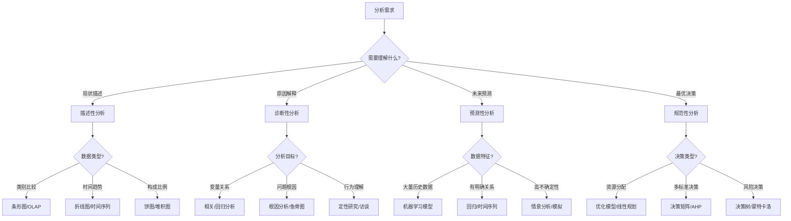

---
{"dg-publish":true,"tags":["商业分析","速查","方法论","分析技术"],"创建日期":"2024-04-30","permalink":"/知识共享/002_商业分析/02_笔记/01_概念速查/分析方法论速查/","dgPassFrontmatter":true}
---

# 分析方法论速查

> [!quote] 概述
> 本文档提供商业分析中常用方法论的快速参考指南。包含各类分析方法的定义、适用场景、核心步骤和注意事项，帮助分析师选择合适的方法并正确应用。

## 定性分析方法

### 1. 焦点小组法(Focus Group)

**定义**：组织6-10名参与者进行结构化讨论，由主持人引导，探索特定主题。

**适用场景**：
- 收集对新产品/服务概念的反馈
- 探索客户需求和偏好
- 测试营销信息和定位

**核心步骤**：
1. 确定研究目标和讨论议题
2. 选择合适的参与者（代表目标人群）
3. 设计讨论指南和问题
4. 组织并主持讨论，确保所有人参与
5. 记录和分析讨论内容
6. 提炼关键主题和洞察

**注意事项**：
- 避免一两个强势参与者主导讨论
- 注意区分参与者真实想法与从众意见
- 结果为探索性，不适合用于统计推断
- 需结合其他方法验证发现

### 2. 深度访谈法(In-depth Interview)

**定义**：与个别受访者进行一对一的详细对话，深入探讨特定主题。

**适用场景**：
- 理解复杂决策过程
- 探索敏感话题
- 收集专家意见
- 获取用户体验细节

**核心步骤**：
1. 确定研究目标和访谈范围
2. 制定访谈提纲（半结构化最常用）
3. 选择和招募受访者
4. 创建舒适的访谈环境
5. 运用有效提问和倾听技巧
6. 记录和分析访谈内容
7. 识别模式和主题

**注意事项**：
- 保持中立，避免引导性问题
- 留意非语言线索
- 设计适当的探究性问题(probing questions)
- 需要较强的访谈技巧和分析能力

### 3. 观察法(Observation)

**定义**：系统性地观察和记录人们在自然环境中的行为和互动。

**类型**：
- 参与式观察（观察者作为参与者）
- 非参与式观察（旁观者角色）
- 结构化观察（预定义观察项）
- 非结构化观察（开放性观察）

**适用场景**：
- 研究工作流程和操作环境
- 发现用户未明确表达的需求
- 识别系统或流程中的问题点
- 验证用户实际行为与自我报告的差异

**核心步骤**：
1. 确定观察目标和范围
2. 设计观察框架和记录方法
3. 获取必要许可和建立信任
4. 进行系统性观察和记录
5. 分析观察数据，识别模式
6. 形成结论和建议

**注意事项**：
- 最小化观察者对自然行为的影响
- 注意伦理问题和隐私保护
- 区分观察事实与主观解释
- 结合访谈等方法理解观察到的行为原因

## 定量分析方法

### 1. 调查问卷法(Survey)

**定义**：通过标准化问卷从大量受访者收集数据的方法。

**适用场景**：
- 测量客户满意度和忠诚度
- 评估市场需求和偏好
- 收集人口统计和行为数据
- 验证从定性研究中产生的假设

**核心步骤**：
1. 确定研究目的和目标人群
2. 设计问卷（问题类型、顺序、比例尺）
3. 测试问卷（确保有效性和可靠性）
4. 确定抽样方法和样本大小
5. 管理调查（线上/线下）
6. 数据清理和分析
7. 解释结果并形成结论

**常用问题类型**：
- 多选题
- 李克特量表(Likert Scale)
- 语义差异量表(Semantic Differential)
- 排序题
- 开放式问题

**注意事项**：
- 避免引导性、模糊或双重否定问题
- 确保代表性样本和足够样本量
- 警惕非响应偏差和社会期望偏差
- 针对目标群体调整语言和发放渠道

### 2. 相关分析(Correlation Analysis)

**定义**：测量两个或多个变量之间线性关系强度和方向的统计方法。

**适用场景**：
- 探索变量间的关系
- 识别影响业务指标的因素
- 发现潜在的因果关系线索
- 验证假设和预测模型的基础

**相关系数解读**：
- 相关系数(r)范围：-1到+1
- r = 0：无线性相关
- r > 0：正相关（一个变量增加，另一个也增加）
- r < 0：负相关（一个变量增加，另一个减少）
- |r| ≈ 0.1-0.3：弱相关
- |r| ≈ 0.3-0.5：中等相关
- |r| ≈ 0.5-1.0：强相关

**核心步骤**：
1. 确定要分析的变量
2. 检查数据分布和质量
3. 选择合适的相关系数类型
   - Pearson（连续型正态分布数据）
   - Spearman（顺序数据或非正态分布）
   - Kendall（顺序数据，样本小）
4. 计算相关系数和显著性
5. 解释相关结果
6. 考虑可能的干扰变量

**注意事项**：
- 相关不等于因果
- 警惕虚假相关（由共同第三因素造成）
- 异常值可能显著影响相关结果
- 需检验结果的统计显著性

### 3. 回归分析(Regression Analysis)

**定义**：分析一个或多个自变量如何影响因变量的统计方法，用于预测和解释关系。

**类型**：
- 简单线性回归：一个自变量，线性关系
- 多元线性回归：多个自变量，线性关系
- 逻辑回归：预测二分类结果
- 多项式回归：非线性关系
- 时间序列回归：处理时间序列数据

**适用场景**：
- 预测销售、需求或其他业务指标
- 识别关键驱动因素及其相对重要性
- 控制多个因素进行假设检验
- 建立预测模型支持决策

**核心步骤**：
1. 定义研究问题和变量选择
2. 数据收集和清理
3. 探索性数据分析（检查分布、关系）
4. 模型构建和变量选择
5. 模型拟合与参数估计
6. 模型诊断和验证
7. 解释结果和应用预测

**关键输出和解读**：
- 回归系数：变量影响方向和大小
- R²值：模型解释的方差比例
- p值：系数的统计显著性
- 残差分布：模型拟合质量指标

**注意事项**：
- 检查回归假设（线性、独立性、同方差性等）
- 注意多重共线性问题
- 避免过度拟合（特别是变量多样本少时）
- 区分统计显著性和实际重要性

## 商业分析专用方法

### 1. 流程分析(Process Analysis)

**定义**：系统研究业务流程的各个环节，识别效率、质量和价值创造机会。

**主要技术**：
- 流程映射(Process Mapping)
- 价值流图(Value Stream Mapping)
- 鱼骨图(Fishbone Diagram)
- SIPOC分析(Supplier-Input-Process-Output-Customer)

**适用场景**：
- 业务流程重组和优化
- 效率瓶颈识别
- 质量问题根因分析
- 新流程设计和改进

**核心步骤**：
1. 确定分析范围和目标
2. 收集流程信息（观察、访谈、文档）
3. 创建流程图或映射
4. 分析流程（时间、成本、价值、风险等）
5. 识别改进机会
6. 设计改进方案
7. 实施和监控改进

**关键测量指标**：
- 周期时间(Cycle Time)
- 处理时间(Processing Time)
- 等待时间(Wait Time)
- 缺陷率(Defect Rate)
- 价值比例(Value Ratio)

**注意事项**：
- 从客户价值角度评估每个环节
- 关注"实际流程"而非"官方流程"
- 保持合适的细节层级
- 结合定量指标和定性分析

### 2. 竞争分析(Competitive Analysis)

**定义**：系统评估竞争对手的优势、劣势、战略和市场表现。

**分析框架**：
- 波特五力模型(Porter's Five Forces)
- SWOT分析(针对竞争对手)
- 竞争矩阵(Competitive Matrix)
- 感知图(Perceptual Mapping)

**适用场景**：
- 市场进入决策
- 产品定位和差异化
- 战略调整和业务规划
- 市场营销策略制定

**核心步骤**：
1. 确定竞争范围和关键竞争对手
2. 设计竞争分析框架和关键指标
3. 收集竞争数据（公开资料、市场信息、客户反馈）
4. 分析竞争对手的业务模式、产品、战略
5. 比较相对优劣势
6. 预测竞争对手可能的行动
7. 制定战略应对策略

**数据来源**：
- 公开财务报告
- 产品文档和说明
- 客户评价和社交媒体
- 行业报告和分析师评论
- 经销商和供应商信息

**注意事项**：
- 保持客观和系统性
- 避免自我参照偏见
- 包括直接和间接竞争对手
- 定期更新竞争分析

### 3. 场景分析(Scenario Analysis)

**定义**：创建和分析多种可能的未来场景，评估不同情况下的风险、机会和战略选择。

**适用场景**：
- 长期战略规划
- 风险管理和应急计划
- 产品和投资组合决策
- 市场不确定性应对策略

**核心步骤**：
1. 确定关键问题和决策
2. 识别关键不确定因素和驱动力
3. 构建场景逻辑和框架
4. 开发详细场景描述（通常2-4个场景）
5. 评估每个场景的含义和影响
6. 制定应对策略（稳健性策略或场景特定策略）
7. 识别预警信号和监控指标

**场景类型**：
- 最可能场景(Most Likely)
- 最佳场景(Best Case)
- 最差场景(Worst Case)
- 替代场景(Alternative)

**注意事项**：
- 场景应该是合理的且内部一致的
- 避免简单的"好/中/差"线性思维
- 关注结构性变化而非渐进变化
- 将场景作为思考工具而非预测工具

## 数据可视化方法

### 1. 图表选择指南

根据数据类型和分析目的选择合适的可视化图表：

| 分析目的 | 数据类型 | 推荐图表 |
|---------|---------|---------|
| 比较类别 | 类别数据 | 条形图、雷达图 |
| 显示组成 | 部分与整体 | 饼图、堆积条形图、树状图 |
| 分布情况 | 数值分布 | 直方图、箱线图、小提琴图 |
| 关系分析 | 多变量关系 | 散点图、气泡图、热图 |
| 趋势分析 | 时间序列 | 折线图、面积图、烛台图 |
| 地理分布 | 空间数据 | 地图、热力地图 |
| 网络关系 | 连接数据 | 网络图、桑基图 |

### 2. 仪表板设计原则

**关键原则**：
- **层次清晰**：重要信息突出，细节逐层展开
- **简洁有效**：专注关键指标，避免过度装饰
- **信息密度**：恰当平衡密度与可读性
- **一致性**：保持视觉元素、术语和度量一致
- **可操作性**：提供明确的业务洞察和行动指导

**布局建议**：
- 最重要的信息放在左上角（F模式阅读）
- 相关信息进行视觉分组
- 使用网格系统创建有序布局
- 考虑信息查看和解读的自然流程
- 提供适当的筛选和钻取功能

**避免常见错误**：
- 过度使用色彩和视觉效果
- 图表选择不当（如用饼图比较数值）
- 缺少上下文和比较基准
- 数据密度过高导致信息过载
- 图表标题和标签不明确

## 方法选择决策树

使用以下决策树帮助选择适合的分析方法：

## 方法整合策略

在实际商业分析中，通常需要整合多种方法才能获得全面的洞察：

**三角验证法**：
- 使用多种方法收集和分析相同问题的数据
- 比较不同方法的结果，识别一致点和差异点
- 增强发现的可靠性和全面性

**互补整合模式**：
1. **探索-验证模式**：
   - 先用定性方法(如访谈)探索问题
   - 再用定量方法(如调查)验证发现

2. **广度-深度模式**：
   - 先用广泛数据分析识别关键问题(如数据挖掘)
   - 再针对关键问题深入研究(如案例分析)

3. **微观-宏观模式**：
   - 微观分析个体行为和需求(如用户研究)
   - 宏观分析市场趋势和模式(如市场分析)

## 相关概念链接

- [[知识共享/002_商业分析/01_学习内容/03_分析方法与工具/3.1 描述性分析方法\|3.1 描述性分析方法]] - 基本统计分析和数据可视化技术
- [[知识共享/002_商业分析/01_学习内容/03_分析方法与工具/3.2 诊断性分析方法\|3.2 诊断性分析方法]] - 因果分析和相关性分析方法
- [[知识共享/002_商业分析/01_学习内容/03_分析方法与工具/3.3 预测性分析方法\|3.3 预测性分析方法]] - 预测模型和趋势分析
- [[知识共享/002_商业分析/01_学习内容/03_分析方法与工具/3.4 规范性分析方法\|3.4 规范性分析方法]] - 优化模型和决策支持
- [[知识共享/002_商业分析/02_笔记/02_方法工具/SWOT分析操作指南\|02_方法工具/SWOT分析操作指南]] - SWOT分析实操指导 