---
{"dg-publish":true,"tags":["商业分析","方法论","速查","参考"],"created":"2024-04-30","permalink":"/知识共享/002_商业分析/02_笔记/01_概念速查/商业分析方法论速查/","dgPassFrontmatter":true}
---


# 商业分析方法论速查

## 战略分析方法

### SWOT分析
- **定义**：评估组织的优势(Strengths)、劣势(Weaknesses)、机会(Opportunities)和威胁(Threats)的策略规划工具
- **应用场景**：战略规划、竞争分析、业务评估
- **核心步骤**：
  1. 识别内部优势
  2. 分析内部劣势
  3. 发现外部机会
  4. 评估外部威胁
  5. 制定对应策略

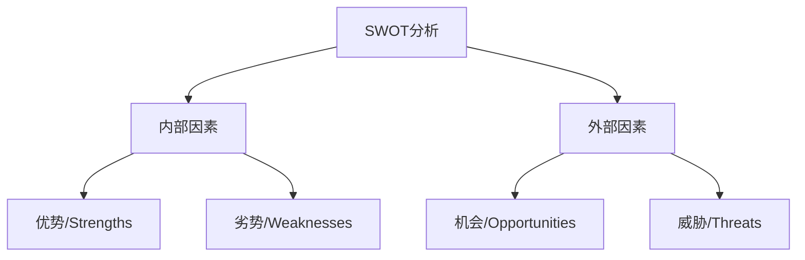

### PESTEL分析
- **定义**：分析影响组织的政治(Political)、经济(Economic)、社会(Social)、技术(Technological)、环境(Environmental)和法律(Legal)因素
- **应用场景**：宏观环境分析、市场进入评估、风险识别
- **关键点**：
  - 政治因素：政府稳定性、税收政策、贸易限制
  - 经济因素：经济增长、通货膨胀、汇率
  - 社会因素：人口统计、文化规范、健康意识
  - 技术因素：创新、自动化、研发活动
  - 环境因素：气候变化、环保法规、可持续发展
  - 法律因素：劳动法、反垄断法、消费者保护法

### 波特五力模型
- **定义**：分析行业竞争状况的框架，包括现有竞争者、潜在进入者、替代品、供应商议价能力和客户议价能力
- **应用场景**：行业结构分析、竞争战略制定、投资决策
- **分析维度**：
  1. 行业内现有竞争者的竞争程度
  2. 新进入者的威胁
  3. 替代品的威胁
  4. 供应商的议价能力
  5. 买方的议价能力

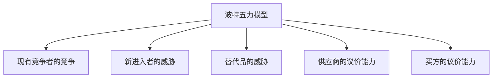

### 价值链分析
- **定义**：评估组织内创造价值的活动序列
- **应用场景**：流程优化、成本分析、差异化分析
- **主要活动**：
  - 主要活动：进料物流、运营、出料物流、市场营销、服务
  - 支持活动：基础设施、人力资源管理、技术开发、采购

## 市场分析方法

### 波士顿矩阵(BCG矩阵)
- **定义**：产品组合分析工具，基于市场增长率和相对市场份额
- **应用场景**：产品组合管理、资源分配、投资决策
- **四个象限**：
  1. 明星(Stars)：高增长、高市场份额
  2. 现金牛(Cash Cows)：低增长、高市场份额
  3. 问题儿童(Question Marks)：高增长、低市场份额
  4. 瘦狗(Dogs)：低增长、低市场份额

```mermaid
quadrantChart
    title BCG矩阵
    x-axis 相对市场份额 --> 高到低
    y-axis 市场增长率 --> 低到高
    quadrant-1 明星(Stars)
    quadrant-2 问题儿童(Question Marks)
    quadrant-3 瘦狗(Dogs)
    quadrant-4 现金牛(Cash Cows)
```

### 市场细分分析
- **定义**：将整体市场划分为具有类似特征的群体
- **应用场景**：定位策略、产品开发、营销计划
- **常见细分维度**：
  - 地理因素：区域、城市规模、气候
  - 人口因素：年龄、性别、收入、教育
  - 心理因素：生活方式、价值观、态度
  - 行为因素：使用频率、忠诚度、购买场合

### 客户旅程映射
- **定义**：可视化客户与产品或服务的互动过程
- **应用场景**：用户体验优化、服务设计、营销策略制定
- **主要阶段**：
  1. 意识：客户认识到需求
  2. 考虑：评估可能的解决方案
  3. 决策：选择产品或服务
  4. 使用：实际使用体验
  5. 忠诚：成为回头客或推荐者

## 财务分析方法

### 成本效益分析(CBA)
- **定义**：比较项目或决策的成本与预期效益
- **应用场景**：投资评估、项目选择、政策制定
- **关键指标**：
  - 净现值(NPV)
  - 内部收益率(IRR)
  - 回收期
  - 成本效益比(BCR)

### 损益平衡分析
- **定义**：确定收入等于成本的点，即不盈不亏的销售量或收入水平
- **应用场景**：定价决策、生产规划、风险评估
- **计算公式**：
  - 损益平衡点(单位) = 固定成本 ÷ (单位售价 - 单位变动成本)
  - 损益平衡点(收入) = 固定成本 ÷ (1 - 变动成本率)

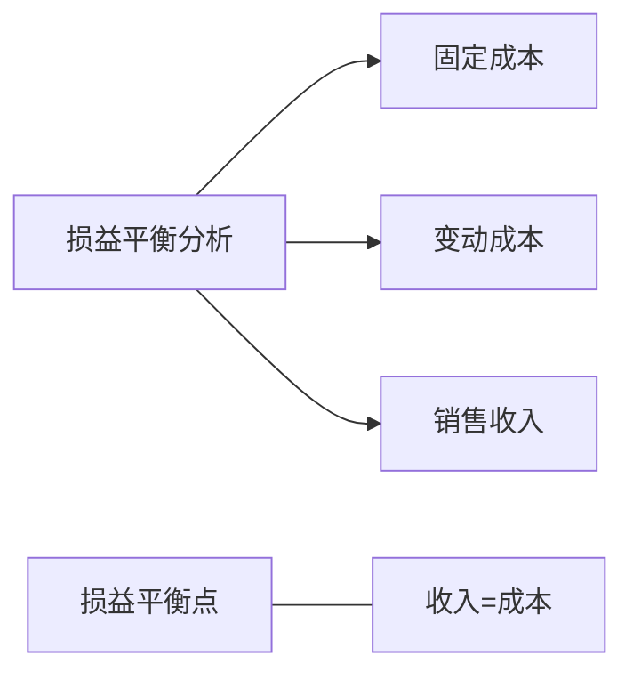

### 敏感性分析
- **定义**：评估关键变量变化对结果的影响
- **应用场景**：风险评估、投资决策、预算规划
- **步骤**：
  1. 确定关键变量
  2. 定义可能的变化范围
  3. 计算每种情况下的结果
  4. 分析变量对结果的影响程度

## 决策分析方法

### 决策树分析
- **定义**：图形化决策模型，展示决策方案、不确定事件及其后果
- **应用场景**：风险分析、投资决策、战略规划
- **关键要素**：
  - 决策节点：表示需要做出选择的点
  - 机会节点：表示不确定事件的点
  - 终端节点：表示最终结果
  - 概率：不确定事件发生的可能性
  - 结果值：每种结果的价值或成本

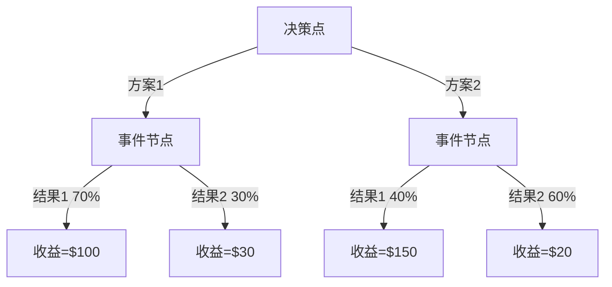

### 多标准决策分析(MCDA)
- **定义**：考虑多个标准的决策支持方法
- **应用场景**：供应商选择、产品评估、投资组合
- **步骤**：
  1. 确定决策标准
  2. 为每个标准分配权重
  3. 评估每个方案在各标准上的表现
  4. 计算加权得分
  5. 排序并选择最佳方案

### 情景规划
- **定义**：创建多个可能的未来情景并为每种情况制定策略
- **应用场景**：长期战略规划、风险管理、创新开发
- **方法步骤**：
  1. 确定关键不确定性
  2. 构建情景逻辑
  3. 详细描述各情景
  4. 分析情景对组织的影响
  5. 制定适应性战略

## 流程分析方法

### 价值流图(VSM)
- **定义**：可视化展示产品或服务从开始到交付的全部流程
- **应用场景**：流程改进、精益管理、浪费识别
- **关键元素**：
  - 流程步骤
  - 时间线(增值时间和非增值时间)
  - 信息流
  - 物料流
  - 改进机会

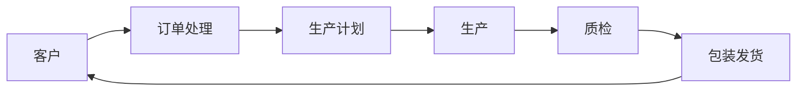

### 鱼骨图(因果图)
- **定义**：识别问题可能原因的图形化工具
- **应用场景**：问题分析、质量管理、根本原因分析
- **常见分类**：
  - 6M分析：人员(Man)、机器(Machine)、材料(Material)、方法(Method)、测量(Measurement)、环境(Mother Nature)
  - 4P分析：人员(People)、流程(Process)、政策(Policies)、设备(Plant/Technology)

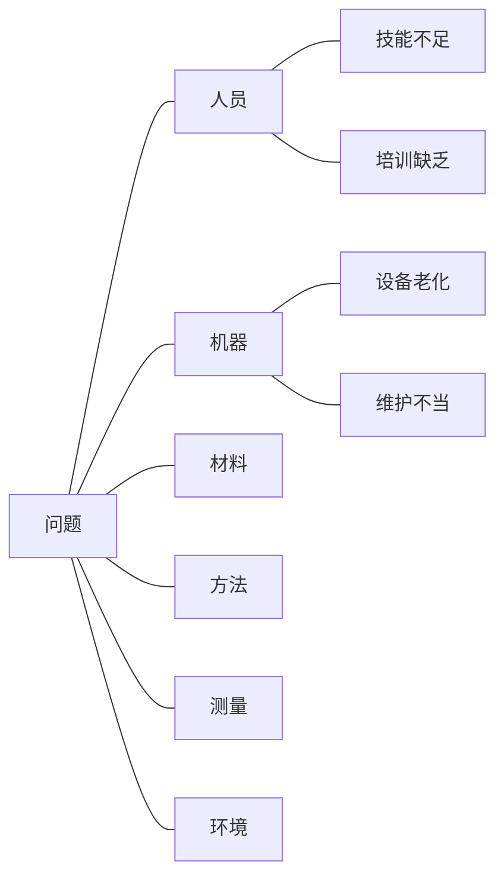

### SIPOC分析
- **定义**：识别流程的供应商(Suppliers)、输入(Inputs)、过程(Process)、输出(Outputs)和客户(Customers)
- **应用场景**：流程定义、范围界定、改进项目启动
- **使用步骤**：
  1. 确定要分析的流程
  2. 识别流程的输出和客户
  3. 确定流程的输入和供应商
  4. 概述主要流程步骤
  5. 创建SIPOC图表

## 创新方法

### 设计思维
- **定义**：以人为中心的创新方法，结合用户需求、技术可行性和商业可行性
- **应用场景**：产品开发、服务设计、商业模式创新
- **核心阶段**：
  1. 同理心：理解用户需求
  2. 定义：明确问题陈述
  3. 构思：产生创意
  4. 原型：实现初步方案
  5. 测试：验证并改进解决方案

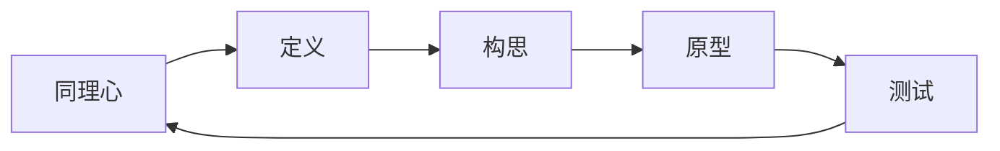

### 蓝海战略
- **定义**：创造无竞争的市场空间，而不是在现有市场中竞争
- **应用场景**：战略规划、产品创新、市场开发
- **四个行动框架**：
  1. 消除：行业长期竞争的因素
  2. 减少：将某些因素降至行业标准以下
  3. 提升：将某些因素提升至高于行业标准
  4. 创造：行业从未提供的因素

### 商业模式画布
- **定义**：描述组织如何创造、交付和获取价值的框架
- **应用场景**：商业模式设计、创业规划、战略转型
- **九大构建模块**：
  1. 客户细分
  2. 价值主张
  3. 渠道
  4. 客户关系
  5. 收入来源
  6. 核心资源
  7. 关键业务
  8. 重要合作
  9. 成本结构

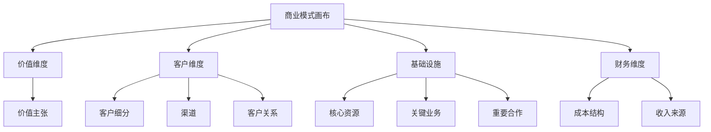

## 数据分析方法

### 描述性分析
- **定义**：描述和总结历史数据的特征
- **应用场景**：业绩报告、市场分析、行为趋势
- **常用技术**：
  - 集中趋势测量：均值、中位数、众数
  - 分布测量：范围、方差、标准差
  - 图表可视化：柱状图、饼图、折线图、直方图

### 诊断性分析
- **定义**：探究数据模式和关系，解释"为什么"
- **应用场景**：根本原因分析、关联研究、性能差距
- **分析技术**：
  - 钻取分析
  - 相关性分析
  - 回归分析
  - 因子分析

### 预测性分析
- **定义**：使用历史数据预测未来趋势和行为
- **应用场景**：需求预测、风险评估、趋势预测
- **常用方法**：
  - 时间序列分析
  - 回归模型
  - 机器学习算法
  - 模式识别

### 规范性分析
- **定义**：基于预测结果提供最佳行动方案
- **应用场景**：资源优化、决策支持、策略规划
- **技术方法**：
  - 优化算法
  - 模拟建模
  - 线性规划
  - 决策支持系统

## 项目管理方法

### 关键路径法(CPM)
- **定义**：确定项目中最长路径，代表项目的最短完成时间
- **应用场景**：项目规划、进度控制、资源分配
- **实施步骤**：
  1. 确定所有活动
  2. 建立依赖关系
  3. 绘制网络图
  4. 计算每个活动的最早和最晚开始/结束时间
  5. 确定关键路径和浮动时间

### 冲刺规划(Scrum)
- **定义**：敏捷项目管理框架，强调迭代开发
- **应用场景**：软件开发、产品创新、复杂项目
- **关键元素**：
  - 产品待办事项列表
  - 冲刺待办事项列表
  - 每日站会
  - 冲刺评审
  - 冲刺回顾
  - 冲刺计划会议

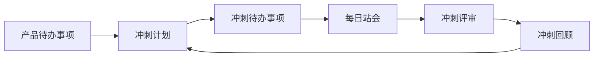

### 风险管理矩阵
- **定义**：评估风险的可能性和影响的工具
- **应用场景**：项目风险管理、战略规划、变更管理
- **矩阵结构**：
  - 横轴：风险发生的可能性(低、中、高)
  - 纵轴：风险发生的影响(低、中、高)
  - 单元格：风险等级(低、中、高)和建议对策

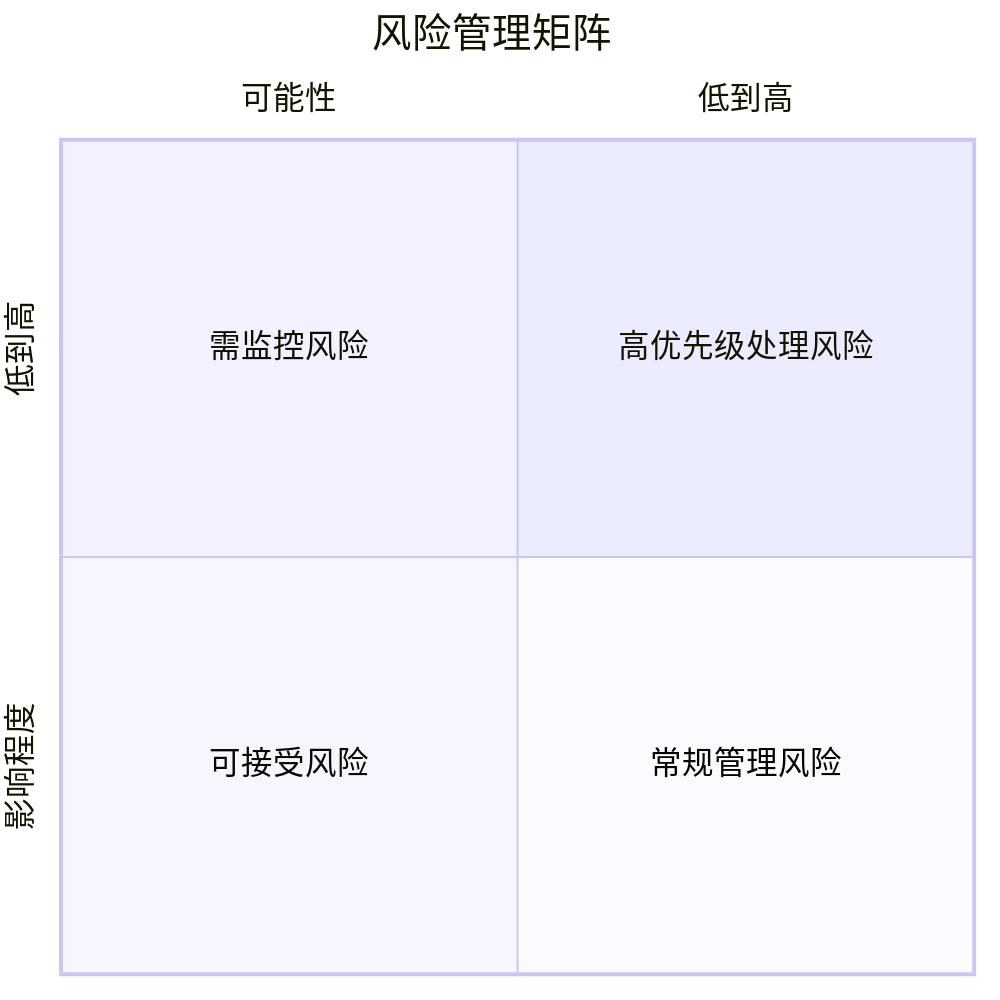

## 变革管理方法

### ADKAR模型
- **定义**：个人变革管理模型，关注个体如何适应变化
- **应用场景**：组织变革、流程改进、系统实施
- **五个阶段**：
  1. 认知(Awareness)：了解变革的需要
  2. 渴望(Desire)：支持并参与变革的意愿
  3. 知识(Knowledge)：如何变革的知识
  4. 能力(Ability)：实施变革所需的技能
  5. 强化(Reinforcement)：维持变革的措施

### 库特八步变革模型
- **定义**：组织变革管理的八步流程
- **应用场景**：大规模组织转型、企业文化变革、战略重组
- **八个步骤**：
  1. 建立紧迫感
  2. 组建变革联盟
  3. 创建变革愿景
  4. 传达变革愿景
  5. 赋能员工行动
  6. 创造短期成果
  7. 巩固成果并推动更多变革
  8. 将变革融入企业文化

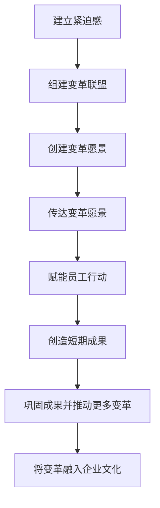

## 综合应用

### 方法选择决策树

根据业务问题的性质选择适当的分析方法：

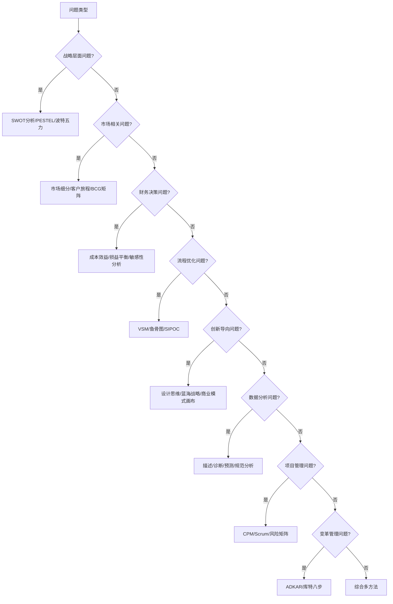

### 方法整合框架

在实际应用中，通常需要整合多种方法来解决复杂问题：

1. **问题定义阶段**：
   - 鱼骨图、5W2H
   - 利益相关者分析

2. **分析阶段**：
   - SWOT、PESTEL
   - 描述性和诊断性分析
   - 价值流图

3. **解决方案设计阶段**：
   - 设计思维
   - 决策树分析
   - 多标准决策分析

4. **实施阶段**：
   - 项目管理方法
   - 变革管理模型
   - 风险管理矩阵

5. **评估阶段**：
   - 成本效益分析
   - KPI和仪表盘
   - 规范性分析

## 最佳实践

1. **方法匹配**：根据问题性质选择合适的方法或方法组合
2. **数据驱动**：尽可能以数据和事实为基础进行分析
3. **利益相关者参与**：确保关键利益相关者参与分析过程
4. **情景思考**：考虑多种可能性和假设
5. **系统视角**：考虑更广泛的系统和环境影响
6. **持续改进**：分析后实施行动，并监控结果
7. **方法灵活性**：根据需要调整和组合不同方法
8. **交流清晰**：以清晰、简洁的方式传达分析结果和建议 