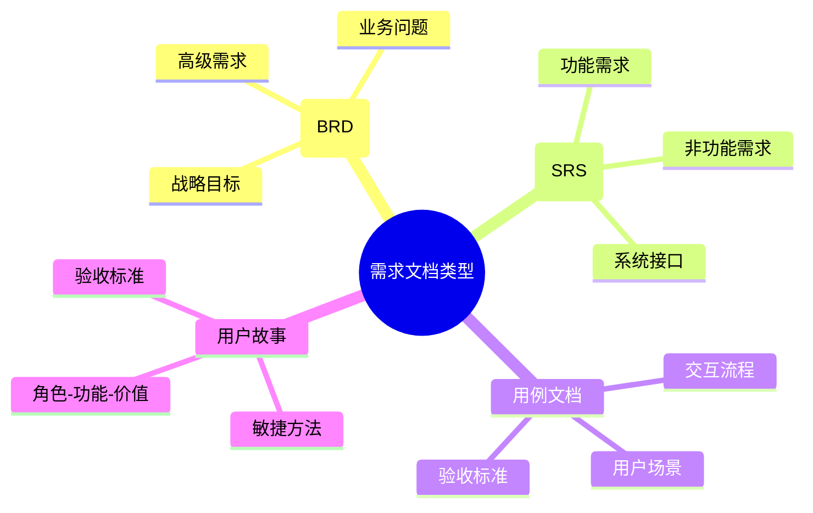
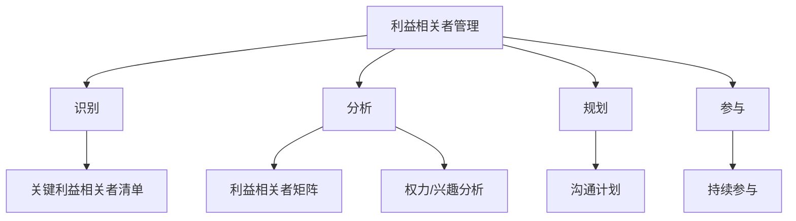

---
{"dg-publish":true,"tags":["商业分析","速查","基础","核心概念"],"创建日期":"2024-04-30","permalink":"/知识共享/002_商业分析/02_笔记/01_概念速查/商业分析核心概念速查/","dgPassFrontmatter":true}
---

> [!quote] 概述
> 本文档提供商业分析领域的核心概念、术语和框架的简明定义和解释，便于快速查阅和理解。按字母顺序和类别组织，方便检索和参考。

## A

### A/B测试 (A/B Testing)
对产品或服务的两个版本进行对比测试，以确定哪个版本表现更好。关键点：控制变量、随机分配、统计显著性。

### 敏捷商业分析 (Agile Business Analysis)
在敏捷开发环境中进行的商业分析活动，特点是迭代式工作、持续优化和跨功能协作。

## B

### 基准分析 (Benchmarking)
将组织的产品、服务或流程与行业最佳实践或竞争对手进行比较的过程。

### 商业分析计划 (Business Analysis Plan)
定义商业分析活动的范围、方法、资源和时间表的文档。

### 商业案例 (Business Case)
支持项目或计划投资决策的文档，通常包括成本、收益、风险和时间表。

### 商业目标 (Business Objectives)
组织希望实现的明确、可衡量的成果，通常与战略目标一致。

### 商业需求 (Business Requirements)
组织为实现特定目标或解决特定问题所需满足的高级需求。

### 商业规则 (Business Rules)
管理业务行为和决策的政策、准则和限制条件。

### 业务流程管理 (Business Process Management, BPM)
分析、设计、实施、监控和持续改进业务流程的系统方法。

## C

### 变更管理 (Change Management)
管理和指导组织变革过程的结构化方法，包括人员、流程和技术的转变。

### 竞争分析 (Competitive Analysis)
评估竞争对手的优势、劣势、战略和市场地位的系统性研究。

### 成本效益分析 (Cost-Benefit Analysis)
比较项目或解决方案的预期成本和收益，以确定其经济可行性。

### 关键成功因素 (Critical Success Factors, CSFs)
组织必须做好的关键领域，以实现其使命和战略目标。

## D

### 数据分析 (Data Analysis)
检查、清洗、转换和建模数据以发现有用信息和支持决策的过程。

### 数据可视化 (Data Visualization)
以图形或图表形式表示数据，以便更容易理解和分析信息。

### 决策矩阵 (Decision Matrix)
一种评估和优先排序方法，基于加权标准比较多个选项。

### 需求文档 (Deliverables)
商业分析过程中产生的正式输出物，如需求文档、流程图或业务规则目录。

## E

### 实体关系图 (Entity Relationship Diagram, ERD)
显示系统中实体类型及其关系的图表，通常用于数据建模。

### 企业架构 (Enterprise Architecture)
描述组织结构、业务流程和IT系统如何支持组织战略的框架。

## F

### 可行性研究 (Feasibility Study)
评估项目或解决方案的可行性，考虑技术、经济、法律、运营和时间因素。

### 功能需求 (Functional Requirements)
描述系统应该做什么的需求，定义系统提供的特定功能和行为。

## G

### 差距分析 (Gap Analysis)
比较当前状态和期望状态之间的差异，以识别改进机会。

## I

### 影响分析 (Impact Analysis)
评估变更对系统、用户和组织各方面可能产生的影响。

### 行业分析 (Industry Analysis)
研究特定行业的结构、趋势、竞争动态和影响因素。

## K

### 关键绩效指标 (Key Performance Indicators, KPIs)
衡量组织在实现关键业务目标方面表现的可量化指标。

### 知识管理 (Knowledge Management)
创建、分享、使用和管理组织知识和信息的过程。

## M

### 市场分析 (Market Analysis)
研究市场规模、增长率、趋势、客户需求和竞争格局。

### 需求建模 (Modeling)
使用图表、图形或其他表示方法来可视化复杂系统、流程或需求。

## N

### 非功能需求 (Non-functional Requirements)
与系统质量属性相关的需求，如性能、安全性、可用性和可靠性。

## O

### 组织结构分析 (Organizational Analysis)
研究组织的结构、文化、能力和限制因素，以支持变革计划。

## P

### 流程分析 (Process Analysis)
研究业务流程以了解其工作方式，并识别改进机会。

### 流程图 (Process Flowchart)
以图形方式表示流程中的步骤、决策点和活动流。

### 产品路线图 (Product Roadmap)
描述产品开发方向和时间表的高级视觉摘要。

### 项目范围 (Project Scope)
定义需要完成的工作以及项目边界的文档。

## R

### RACI矩阵 (RACI Matrix)
定义项目活动的角色和责任的矩阵：负责(Responsible)、批准(Accountable)、咨询(Consulted)和知情(Informed)。

### 需求管理 (Requirements Management)
管理需求的标识、捕获、记录、分析、跟踪和控制的过程。

### 需求可追溯性 (Requirements Traceability)
跟踪需求从来源到实施和验证的能力。

### 风险分析 (Risk Analysis)
识别、评估和优先处理潜在风险事件的过程。

### 风险管理 (Risk Management)
识别、评估和控制威胁组织资本和收益的风险的过程。

## S

### 利益相关者 (Stakeholder)
对项目或业务变更有影响或受其影响的个人、群体或组织。

### SWOT分析 (SWOT Analysis)
分析组织的优势(Strengths)、劣势(Weaknesses)、机会(Opportunities)和威胁(Threats)的战略规划工具。

## T

### 技术债务 (Technical Debt)
选择快速实施而非最优解决方案所累积的开发工作。

## U

### 用户接受测试 (User Acceptance Testing, UAT)
验证系统满足用户需求和业务要求的测试过程。

### 用例 (Use Case)
描述系统如何响应外部请求以给用户提供价值的行为模型。

### 用户故事 (User Story)
敏捷方法中描述功能从用户角度提供的价值的简短描述，通常格式为"作为[角色]，我想[功能]，以便[收益]"。

### 用户体验 (User Experience, UX)
用户与产品或服务交互的整体感受，包括可用性、可访问性和满意度。

## V

### 价值流映射 (Value Stream Mapping)
分析和改进为客户提供产品或服务所需的材料和信息流的精益方法。

### 验证与确认 (Verification and Validation)
验证(Verification)：确保产品正确构建；确认(Validation)：确保构建了正确的产品。

## 常用框架和模型速查

### 1. 波特五力模型
分析行业竞争强度和吸引力的框架，包括：
- 现有竞争者之间的竞争
- 买家议价能力
- 供应商议价能力
- 新进入者的威胁
- 替代品的威胁

### 2. PESTEL分析
分析宏观环境因素的框架：
- 政治(Political)
- 经济(Economic)
- 社会(Social)
- 技术(Technological)
- 环境(Environmental)
- 法律(Legal)

### 3. 商业模式画布
描述、分析和设计商业模式的工具，包含九个要素：
- 客户细分
- 价值主张
- 渠道
- 客户关系
- 收入来源
- 核心资源
- 关键活动
- 重要合作
- 成本结构

### 4. 平衡计分卡
将组织战略转化为可衡量目标的管理系统，从四个视角评估组织表现：
- 财务
- 客户
- 内部流程
- 学习与成长

### 5. VRIO框架
评估公司资源和能力竞争优势的分析工具：
- 价值(Value)
- 稀缺性(Rarity)
- 模仿难度(Imitability)
- 组织(Organization)

### 6. BCG矩阵
波士顿咨询集团开发的投资组合管理工具，将业务单位分为：
- 明星(Stars)：高增长，高市场份额
- 现金牛(Cash Cows)：低增长，高市场份额
- 问题(Question Marks)：高增长，低市场份额
- 瘦狗(Dogs)：低增长，低市场份额

### 7. 价值链分析
分析组织创造价值的活动序列：
- 主要活动：入库物流、运营、出库物流、营销销售、服务
- 支持活动：基础设施、人力资源管理、技术开发、采购

## 相关笔记链接

- [[分析方法论速查\|分析方法论速查]]
- [[知识共享/002_商业分析/02_笔记/01_概念速查/数据分析工具速查\|数据分析工具速查]]
- [[知识共享/002_商业分析/02_笔记/01_概念速查/商业模式类型速查\|商业模式类型速查]]
- [[知识共享/002_商业分析/01_学习内容/01_商业分析基础/1.1 商业分析概述\|01_商业分析基础/1.1 商业分析概述]]
- [[知识共享/002_商业分析/01_学习内容/03_分析方法与工具/3.1 描述性分析方法\|03_分析方法与工具/3.1 描述性分析方法]]

> [!tip] 使用提示
> 本速查表提供简明定义，如需详细解释，请点击相关链接查看完整笔记。定期回顾这些概念有助于巩固商业分析知识基础。 