---
{"dg-publish":true,"tags":["商业分析","框架","速查","参考"],"created":"2024-04-30","permalink":"/知识共享/002_商业分析/02_笔记/01_概念速查/商业分析框架速查/","dgPassFrontmatter":true}
---

## 战略分析框架

### 安索夫矩阵 (Ansoff Matrix)
- **定义**：评估市场增长战略的工具，基于产品和市场两个维度
- **应用场景**：业务扩张策略、产品开发决策、市场开发规划
- **四个战略选项**：
  1. 市场渗透(Market Penetration)：现有产品在现有市场增加份额
  2. 市场开发(Market Development)：将现有产品引入新市场
  3. 产品开发(Product Development)：在现有市场推出新产品
  4. 多元化(Diversification)：在新市场推出新产品

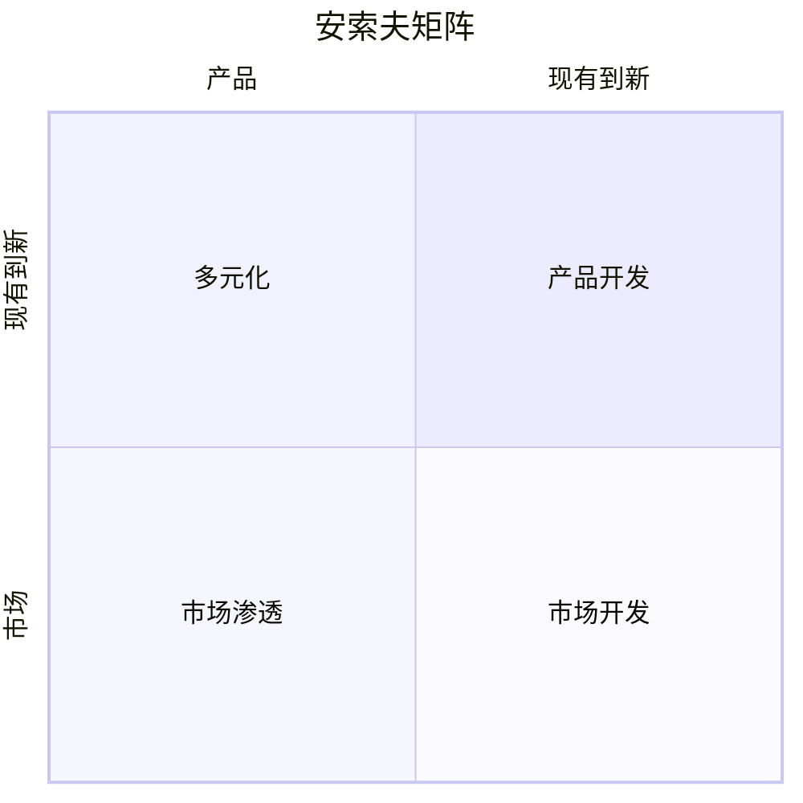

### 7S框架 (McKinsey 7S Framework)
- **定义**：评估组织内部因素如何协同工作以实现目标的工具
- **应用场景**：组织诊断、变革管理、并购整合
- **七个要素**：
  1. 战略(Strategy)：实现竞争优势的计划
  2. 结构(Structure)：组织架构和报告关系
  3. 系统(Systems)：日常业务流程和信息系统
  4. 共享价值观(Shared Values)：核心价值观和企业文化
  5. 风格(Style)：领导风格和组织行为方式
  6. 员工(Staff)：人员能力和组织人才库
  7. 技能(Skills)：组织的核心能力和竞争力

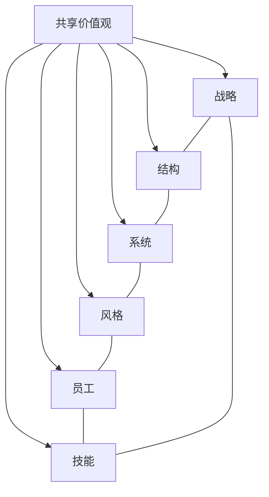

### 三层战略模型 (Three Levels of Strategy)
- **定义**：将组织战略分为三个层次的框架
- **应用场景**：大型复杂组织、战略规划、战略一致性评估
- **三个层次**：
  1. 公司层战略：整体组织的发展方向和资源分配
  2. 业务层战略：如何在特定市场获得竞争优势
  3. 功能层战略：各职能部门如何支持业务和公司战略

### 蓝海战略框架 (Blue Ocean Strategy Framework)
- **定义**：创造无竞争的市场空间而非在现有市场竞争的战略框架
- **应用场景**：创新战略、市场定位、差异化战略
- **核心工具**：
  1. 战略布局图：比较企业在行业关键竞争因素上的表现
  2. 四项行动框架(ERRC)：
     - 消除(Eliminate)：行业长期竞争的因素
     - 减少(Reduce)：将某些因素降至行业标准以下
     - 提升(Raise)：将某些因素提升至高于行业标准
     - 创造(Create)：行业从未提供的因素
  3. 六条路径框架：探索创造蓝海的六种方法

## 竞争分析框架

### 波特的价值链 (Porter's Value Chain)
- **定义**：分析组织内部活动以识别竞争优势来源的工具
- **应用场景**：流程优化、成本分析、价值创造评估
- **主要活动**：
  1. 主要活动：
     - 入库物流(Inbound Logistics)
     - 运营(Operations)
     - 出库物流(Outbound Logistics)
     - 市场营销与销售(Marketing & Sales)
     - 服务(Service)
  2. 支持活动：
     - 公司基础设施(Firm Infrastructure)
     - 人力资源管理(Human Resource Management)
     - 技术开发(Technology Development)
     - 采购(Procurement)

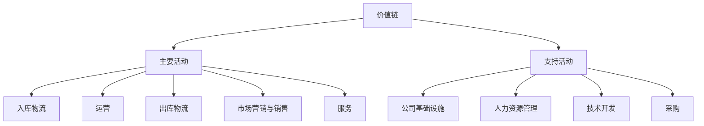

### 战略群组分析 (Strategic Group Analysis)
- **定义**：识别并分析行业内采用相似战略的企业集群
- **应用场景**：竞争格局分析、战略定位、竞争动态评估
- **实施步骤**：
  1. 识别行业内关键战略维度
  2. 绘制二维图表，每个轴代表一个战略维度
  3. 在图上标出公司位置，形成战略群组
  4. 分析群组内竞争和群组间壁垒
  5. 评估移动可能性和战略机会

### 竞争对手分析框架 (Competitor Analysis Framework)
- **定义**：系统评估竞争对手的目标、战略、假设和能力
- **应用场景**：竞争策略制定、市场进入决策、差异化战略
- **四个关键要素**：
  1. 竞争对手目标：短期和长期商业目标
  2. 竞争对手假设：对自身和行业的看法
  3. 竞争对手战略：如何争取优势的当前行动
  4. 竞争对手能力：优势和劣势评估

## 市场分析框架

### 市场细分框架 (Market Segmentation Framework)
- **定义**：将整体市场划分为具有类似特征的子群体
- **应用场景**：目标市场选择、产品定位、营销策略制定
- **常见细分维度**：
  1. 人口统计变量：年龄、性别、收入、教育程度等
  2. 地理变量：国家、地区、城市规模、气候等
  3. 心理变量：生活方式、价值观、个性特征等
  4. 行为变量：购买频率、品牌忠诚度、追求利益等

### STP模型 (Segmentation, Targeting, Positioning)
- **定义**：市场营销策略的三步流程
- **应用场景**：市场策略制定、品牌建设、营销计划
- **三个阶段**：
  1. 细分(Segmentation)：将市场划分为不同群体
  2. 目标市场选择(Targeting)：评估并选择服务的细分市场
  3. 定位(Positioning)：为目标市场创造区隔性价值主张

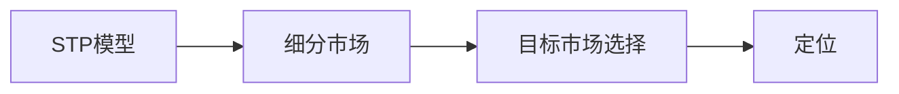

### 产品生命周期模型 (Product Life Cycle Model)
- **定义**：描述产品从引入到退出市场的各个阶段
- **应用场景**：产品策略、营销计划、资源分配
- **四个阶段**：
  1. 引入期(Introduction)：低销售，高成本，负/低利润
  2. 成长期(Growth)：快速增长，扩大市场，增加利润
  3. 成熟期(Maturity)：销售峰值，稳定利润，激烈竞争
  4. 衰退期(Decline)：销售下降，利润降低，寻求退出或更新

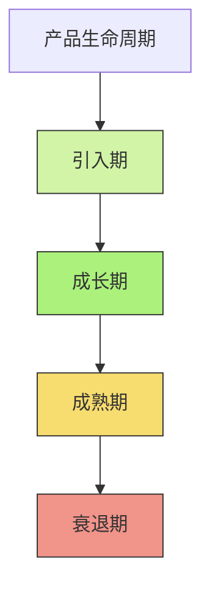

## 组织分析框架

### 利益相关者分析矩阵 (Stakeholder Analysis Matrix)
- **定义**：评估利益相关者的利益和影响力的工具
- **应用场景**：项目管理、变革管理、战略沟通
- **分析维度**：
  1. 权力(Power)：对项目/决策的影响能力
  2. 利益(Interest)：对项目/决策的关注程度
  3. 支持(Support)/抵制(Opposition)：态度倾向
  4. 影响(Influence)：对其他利益相关者的影响能力

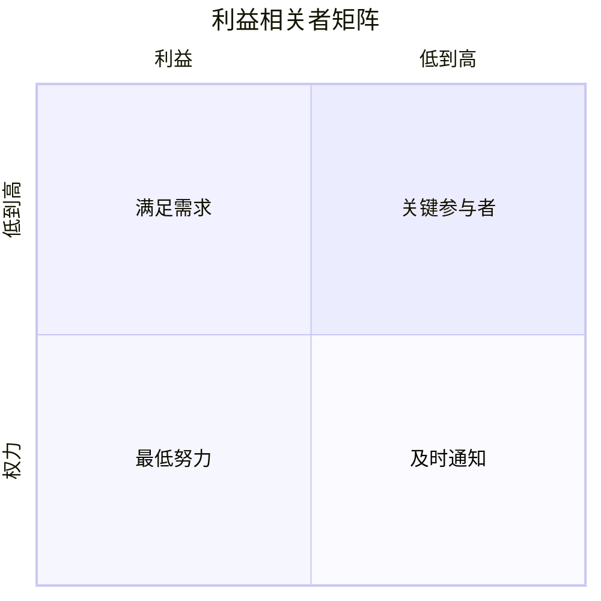

### RACI矩阵 (RACI Matrix)
- **定义**：明确项目或流程中各角色责任分配的工具
- **应用场景**：项目管理、流程设计、团队协作
- **四类角色**：
  1. 负责(Responsible, R)：执行任务的人
  2. 批准(Accountable, A)：对任务负最终责任的人(每项任务只有一人)
  3. 咨询(Consulted, C)：提供输入意见的人
  4. 知情(Informed, I)：需要了解决策或行动的人

### 组织变革模型 (Organizational Change Models)
- **定义**：描述和指导组织变革过程的框架
- **应用场景**：组织转型、流程重组、文化变革
- **常见模型**：
  1. 库特八步变革模型(Kotter's 8-Step Model)：
     - 建立紧迫感
     - 组建变革联盟
     - 创建变革愿景
     - 沟通变革愿景
     - 赋能员工行动
     - 创造短期成果
     - 巩固成果并推动更多变革
     - 将变革融入企业文化
  2. ADKAR模型：
     - 认知(Awareness)
     - 渴望(Desire)
     - 知识(Knowledge)
     - 能力(Ability)
     - 强化(Reinforcement)

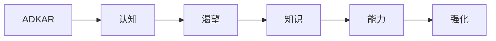

## 决策支持框架

### 决策矩阵 (Decision Matrix)
- **定义**：多标准决策分析工具，基于加权标准评估多个选项
- **应用场景**：供应商选择、项目优先级排序、投资决策
- **实施步骤**：
  1. 确定待评估的备选方案
  2. 确定评估标准
  3. 为各标准分配权重
  4. 对每个方案在各标准上评分
  5. 计算加权得分并排序
  6. 选择得分最高的方案

### 场景规划 (Scenario Planning)
- **定义**：创建多种可能未来情境并制定应对策略的方法
- **应用场景**：长期战略规划、风险管理、不确定性应对
- **构建步骤**：
  1. 确定关键问题或决策
  2. 识别关键影响因素
  3. 确定驱动变化的关键不确定性
  4. 开发情景逻辑和框架
  5. 详细描述每个情景
  6. 分析情景影响和战略含义
  7. 确定预警指标和监控策略

### 成本效益分析框架 (Cost-Benefit Analysis Framework)
- **定义**：通过比较项目或决策的成本和收益评估其经济性
- **应用场景**：项目评估、资源分配、政策制定
- **核心要素**：
  1. 确定所有相关成本(直接和间接)
  2. 量化所有收益(有形和无形)
  3. 调整时间价值(现值分析)
  4. 计算关键指标：
     - 净现值(NPV)
     - 收益成本比(BCR)
     - 内部收益率(IRR)
     - 回收期(Payback Period)
  5. 进行敏感性分析
  6. 做出决策建议

## 流程分析框架

### SIPOC分析 (Suppliers, Inputs, Process, Outputs, Customers)
- **定义**：流程改进工具，用于明确流程的关键要素
- **应用场景**：流程改进、质量管理、项目范围界定
- **五个组成部分**：
  1. 供应商(Suppliers)：提供流程输入的实体
  2. 输入(Inputs)：流程需要的资源和信息
  3. 过程(Process)：将输入转化为输出的活动
  4. 输出(Outputs)：流程的产品或服务
  5. 客户(Customers)：接收流程输出的实体

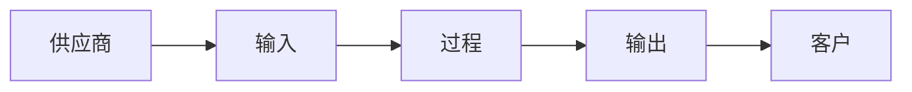

### DMAIC方法 (Define, Measure, Analyze, Improve, Control)
- **定义**：六西格玛的核心流程改进方法论
- **应用场景**：质量改进、流程优化、问题解决
- **五个阶段**：
  1. 定义(Define)：明确问题、目标和范围
  2. 测量(Measure)：收集当前流程数据
  3. 分析(Analyze)：识别问题根本原因
  4. 改进(Improve)：开发并实施解决方案
  5. 控制(Control)：确保改进的持续性

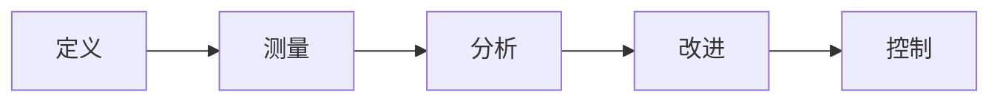

### 流程优化技术 (Process Optimization Techniques)
- **定义**：提高流程效率、质量和价值的系统化方法
- **应用场景**：业务流程再造、精益管理、持续改进
- **常见技术**：
  1. 价值流图(Value Stream Mapping)：可视化展示流程、识别浪费
  2. 根本原因分析(Root Cause Analysis)：识别问题根源
  3. 失效模式与影响分析(FMEA)：预测潜在失败点
  4. 约束理论(Theory of Constraints)：识别并消除系统瓶颈
  5. 精益六西格玛(Lean Six Sigma)：结合精益和六西格玛方法

## 行业分析框架

### 战略要素地图 (Strategic Factor Map)
- **定义**：识别和分析行业内关键成功因素的框架
- **应用场景**：行业分析、竞争战略、商业模式设计
- **主要步骤**：
  1. 识别行业内关键成功因素
  2. 评估公司在各因素上的表现
  3. 与竞争对手比较
  4. 确定竞争优势和劣势
  5. 制定改进策略

### 行业生命周期模型 (Industry Life Cycle Model)
- **定义**：描述行业发展阶段的模型
- **应用场景**：行业分析、战略规划、投资决策
- **四个阶段**：
  1. 导入期(Introduction)：新技术/概念出现，市场规模小
  2. 成长期(Growth)：快速增长，利润率高，新进入者增多
  3. 成熟期(Maturity)：增长放缓，竞争激烈，整合增加
  4. 衰退期(Decline)：需求下降，过剩产能，部分企业退出


### 关键成功因素分析 (Key Success Factors Analysis)
- **定义**：确定在特定行业取得成功所需的关键要素
- **应用场景**：战略规划、资源分配、能力建设
- **主要领域**：
  1. 技术相关因素：研发能力、创新速度、专利组合
  2. 制造相关因素：产品质量、成本效率、规模经济
  3. 分销相关因素：渠道覆盖、物流效率、库存管理
  4. 营销相关因素：品牌认知、客户关系、市场响应速度
  5. 技能相关因素：特定专业知识、人才培养、领导能力
  6. 组织能力：灵活性、组织学习、执行力

## 风险分析框架

### 风险评估矩阵 (Risk Assessment Matrix)
- **定义**：评估风险可能性和影响程度的工具
- **应用场景**：项目风险管理、战略规划、投资决策
- **矩阵组成**：
  1. 横轴：风险发生的可能性(低、中、高)
  2. 纵轴：风险发生的影响程度(低、中、高)
  3. 单元格：风险等级(低、中、高)和应对策略

```mermaid
quadrantChart
    title 风险评估矩阵
    x-axis 可能性 --> 低到高
    y-axis 影响程度 --> 低到高
    quadrant-1 高风险(必须缓解)
    quadrant-2 中高风险(应缓解)
    quadrant-3 低风险(接受或监控)
    quadrant-4 中低风险(监控)
```

### SWOT分析 (SWOT Analysis)
- **定义**：评估组织优势(Strengths)、劣势(Weaknesses)、机会(Opportunities)和威胁(Threats)的战略规划工具
- **应用场景**：战略规划、竞争分析、决策支持
- **四个象限**：
  1. 优势：内部积极因素，如核心竞争力、独特资源
  2. 劣势：内部消极因素，如资源短缺、弱点
  3. 机会：外部积极因素，如市场增长、技术变革
  4. 威胁：外部消极因素，如竞争加剧、监管变化

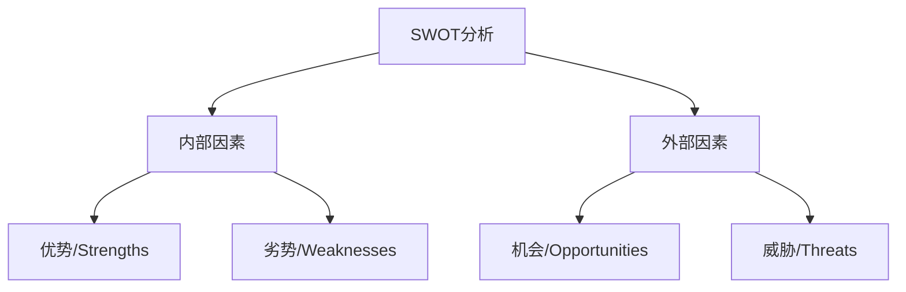

### 情景分析 (Scenario Analysis)
- **定义**：评估不同假设下潜在结果的风险管理技术
- **应用场景**：财务规划、投资决策、战略制定
- **常见类型**：
  1. 基本情景：最可能的结果
  2. 最佳情景：最乐观的结果
  3. 最差情景：最悲观的结果
  4. 压力测试：极端情况下的结果
- **实施步骤**：
  1. 确定关键变量
  2. 设定变量值范围
  3. 建立各情景模型
  4. 计算各情景结果
  5. 分析影响并制定应对策略

## 绩效评估框架

### 平衡计分卡 (Balanced Scorecard)
- **定义**：全面衡量组织绩效的战略规划和管理系统
- **应用场景**：战略执行、绩效管理、组织对齐
- **四个视角**：
  1. 财务视角：如何满足股东期望
  2. 客户视角：如何满足客户需求
  3. 内部流程视角：在哪些流程中必须出色
  4. 学习成长视角：如何持续改进和创造价值

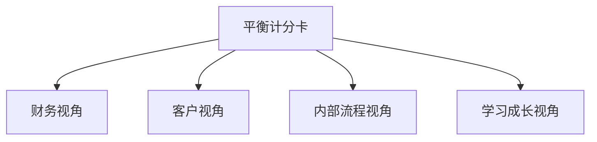

### KPI框架 (Key Performance Indicators Framework)
- **定义**：衡量组织目标实现程度的量化指标体系
- **应用场景**：绩效管理、目标跟踪、战略执行
- **SMART原则**：
  1. 具体(Specific)：明确定义
  2. 可衡量(Measurable)：可量化
  3. 可实现(Achievable)：现实可行
  4. 相关性(Relevant)：与目标相关
  5. 时效性(Time-bound)：有明确时间范围
- **常见类型**：
  1. 输入指标：资源利用情况
  2. 过程指标：活动效率和效果
  3. 输出指标：直接结果
  4. 结果指标：最终成果和影响

### OKR框架 (Objectives and Key Results)
- **定义**：目标与关键结果法，设定并跟踪组织和个人目标的框架
- **应用场景**：目标管理、团队协作、组织对齐
- **核心组成**：
  1. 目标(Objectives)：定性的、鼓舞人心的愿景陈述
  2. 关键结果(Key Results)：量化的、可衡量的目标实现指标
- **实施原则**：
  1. 目标应具有挑战性但可实现
  2. 设定季度OKR，定期回顾
  3. 目标透明公开
  4. 自下而上与自上而下相结合
  5. 分离评估与薪酬

## 综合框架选择指南

根据分析目的和情境选择适当的框架：

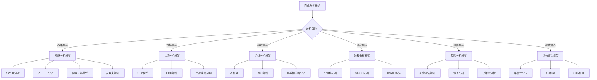

## 框架应用最佳实践

1. **目的驱动**：根据分析目的选择合适的框架，而非为使用框架而使用框架
2. **相互补充**：组合使用多个框架获得全面视角
3. **情境适应**：根据行业、公司规模调整框架
4. **数据支持**：尽可能用数据支持框架分析
5. **实用简化**：适当简化复杂框架，保持实用性
6. **利益相关者参与**：在框架应用过程中纳入关键利益相关者
7. **持续更新**：定期更新分析以反映最新情况
8. **行动导向**：确保分析结果能转化为实际行动
9. **学习循环**：从应用结果中学习并改进框架使用

## 相关笔记链接
- [[知识共享/002_商业分析/02_笔记/01_概念速查/商业分析方法论速查\|商业分析方法论速查]]
- [[知识共享/002_商业分析/02_笔记/01_概念速查/商业分析核心概念速查\|商业分析核心概念速查]]
- [[知识共享/002_商业分析/02_笔记/01_概念速查/数据分析工具速查\|数据分析工具速查]]
- [[知识共享/002_商业分析/02_笔记/01_概念速查/商业模式类型速查\|商业模式类型速查]] 