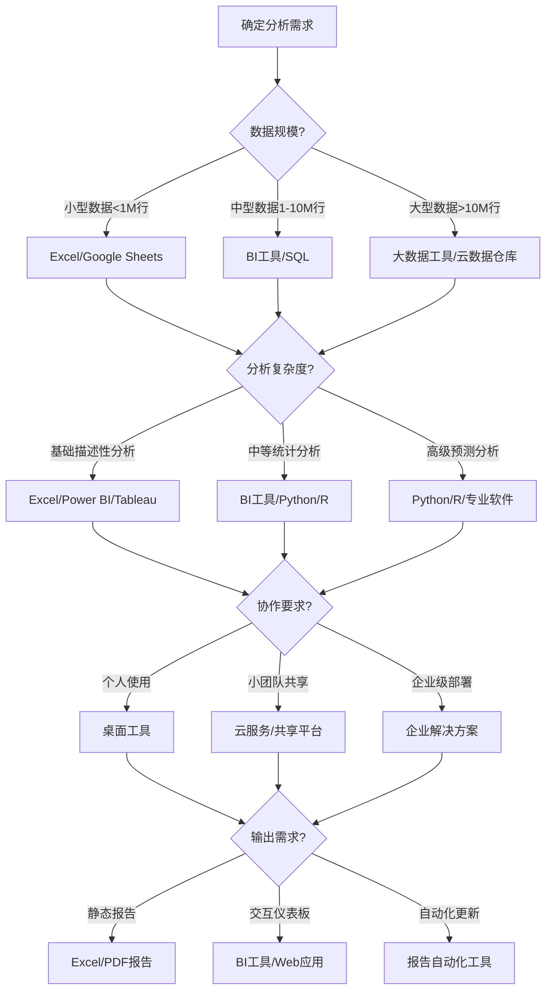

---
{"dg-publish":true,"tags":["商业分析","速查","数据分析","工具","软件"],"创建日期":"2024-04-30","permalink":"/知识共享/002_商业分析/02_笔记/01_概念速查/数据分析工具速查/","dgPassFrontmatter":true}
---


# 数据分析工具速查

> [!quote] 概述
> 本文档提供商业分析中常用数据分析工具的快速参考指南。包括不同类型工具的功能特点、适用场景和基本用法，帮助分析师根据需求选择合适的工具并高效使用。

## 电子表格工具

### Microsoft Excel

**核心功能**：
- 数据存储与基础处理
- 公式和函数计算
- 数据透视表分析
- 图表可视化
- 条件格式化
- 宏和VBA自动化

**适用场景**：
- 中小型数据集分析(百万行以内)
- 快速原型设计和分析
- 简单报表和仪表板创建
- 日常业务数据处理

**特色功能**：
- Power Query：数据导入和转换
- Power Pivot：数据建模和关系分析
- 数据分析工具库：统计分析和模拟
- Excel表格：结构化数据管理

**优势**：
- 普及率高，学习资源丰富
- 用户友好的界面
- 与Microsoft生态系统无缝集成
- 适合非技术人员使用

**局限性**：
- 大数据集性能受限
- 复杂分析和数据科学能力有限
- 版本控制和协作功能弱
- 可重复性和自动化有限

### Google Sheets

**核心功能**：
- 在线电子表格处理
- 实时多人协作
- 基本数据分析功能
- 集成Google表单和其他G Suite应用

**适用场景**：
- 团队协作分析项目
- 小到中型数据集处理
- 需要实时共享和更新的分析
- 基于Web的工作流程

**优势**：
- 免费且基于云端
- 卓越的协作功能
- 与Google生态系统集成
- 随时随地访问

**局限性**：
- 功能不如Excel强大
- 大数据集处理能力更受限
- 离线功能有限
- 部分高级分析功能缺失

### 常用Excel函数速查

| 函数类型 | 常用函数 | 用途 |
|----------|---------|------|
| 查找引用 | VLOOKUP, HLOOKUP, INDEX/MATCH, XLOOKUP | 在数据表中查找和匹配值 |
| 统计分析 | AVERAGE, MEDIAN, STDEV, PERCENTILE, CORREL | 描述性统计和基础分析 |
| 条件计算 | IF, SUMIF, COUNTIF, AVERAGEIF, IFS | 基于条件的计算 |
| 文本处理 | LEFT, RIGHT, MID, CONCAT, TEXTJOIN | 文本数据的操作和组合 |
| 日期时间 | DATE, DATEDIF, NETWORKDAYS, EOMONTH | 日期计算和处理 |
| 数据透视 | GETPIVOTDATA | 从数据透视表提取数据 |
| 财务分析 | NPV, IRR, PMT, FV | 财务计算和投资分析 |

## 商业智能(BI)工具

### Microsoft Power BI

**核心功能**：
- 数据连接和集成
- 数据建模和转换
- 交互式仪表板和报告
- 高级可视化
- 自然语言查询
- 数据洞察自动发现

**适用场景**：
- 企业级报告和仪表板
- 跨数据源分析
- 数据可视化和故事讲述
- 自助式商业分析

**优势**：
- 与Microsoft产品无缝集成
- 强大的DAX和M语言
- 活跃的社区和丰富的资源
- 适合从Excel用户过渡

**版本选择**：
- Power BI Desktop：免费，用于创建报告
- Power BI Pro：按用户订阅，用于共享和协作
- Power BI Premium：企业级部署和扩展性

### Tableau

**核心功能**：
- 强大的数据可视化
- 拖放式交互界面
- 数据连接和集成
- 地理空间分析
- 移动优化设计
- 数据故事讲述

**适用场景**：
- 高级数据可视化需求
- 探索性数据分析
- 数据洞察发现和共享
- 需要视觉冲击力的报告

**优势**：
- 业界领先的可视化效果
- 简单直观的用户界面
- 强大的数据处理能力
- 灵活的部署选项

**版本选择**：
- Tableau Public：免费，作品公开
- Tableau Desktop：专业版，完整功能
- Tableau Server/Online：企业共享和协作

### Qlik

**核心功能**：
- 联想分析引擎
- 内存处理技术
- 交互式可视化
- 数据集成和预处理
- 指导性分析

**适用场景**：
- 复杂数据关系探索
- 大规模企业部署
- 需要高性能分析的环境
- 自助式数据探索

**优势**：
- 独特的联想分析方法
- 强大的数据压缩和处理
- 灵活的数据模型
- 完整的企业分析解决方案

**主要产品**：
- QlikView：成熟的BI平台
- Qlik Sense：新一代自助分析平台

## 数据库和SQL工具

### SQL基础工具

**主要数据库系统**：
- MySQL：开源通用数据库，适合中小应用
- PostgreSQL：功能丰富的开源数据库，支持高级分析
- Microsoft SQL Server：企业级数据库系统
- Oracle：大型企业数据管理系统
- SQLite：轻量级嵌入式数据库

**SQL客户端工具**：
- MySQL Workbench：MySQL可视化管理工具
- pgAdmin：PostgreSQL管理工具
- DBeaver：通用数据库管理工具，支持多种数据库
- Azure Data Studio：现代数据库IDE，支持SQL Server等
- SQL Server Management Studio：SQL Server管理工具

**适用场景**：
- 结构化数据存储和查询
- 数据集成和转换
- 报表生成
- 数据完整性管理

**SQL分析核心操作**：
```sql
-- 基本数据检索
SELECT column1, column2
FROM table_name
WHERE condition;

-- 聚合分析
SELECT category, 
       COUNT(*) as count, 
       AVG(value) as average,
       SUM(amount) as total
FROM table_name
GROUP BY category
HAVING COUNT(*) > 10;

-- 多表联接
SELECT a.name, b.department, c.sales
FROM employees a
JOIN departments b ON a.dept_id = b.id
LEFT JOIN sales c ON a.id = c.employee_id;

-- 子查询
SELECT name, sales
FROM employees
WHERE sales > (SELECT AVG(sales) FROM employees);

-- 窗口函数
SELECT name, department, sales,
       RANK() OVER (PARTITION BY department ORDER BY sales DESC) as rank,
       AVG(sales) OVER (PARTITION BY department) as dept_avg
FROM employee_sales;
```

### 数据仓库和大数据工具

**云数据仓库**：
- Amazon Redshift：AWS的数据仓库服务
- Google BigQuery：Google的无服务器数据仓库
- Snowflake：云原生数据仓库平台
- Azure Synapse：Microsoft的数据仓库和分析服务

**大数据处理**：
- Apache Hadoop：分布式存储和处理框架
- Apache Spark：快速大规模数据处理引擎
- Apache Hive：基于Hadoop的数据仓库
- Databricks：基于Spark的统一分析平台

**适用场景**：
- 大规模数据存储和分析
- 高性能复杂查询
- 数据湖和数据仓库实施
- 企业级数据集成

**优势**：
- 处理TB和PB级数据
- 高扩展性和性能
- 支持结构化和非结构化数据
- 云服务降低基础设施成本

## 统计和数据分析编程工具

### Python 

**核心数据分析库**：
- Pandas：数据处理和分析
- NumPy：科学计算和多维数组
- Matplotlib/Seaborn：数据可视化
- Scikit-learn：机器学习
- Statsmodels：统计建模和检验

**开发环境**：
- Jupyter Notebook：交互式分析环境
- PyCharm：专业Python IDE
- Visual Studio Code + Python扩展
- Anaconda：数据科学平台和环境管理

**适用场景**：
- 自定义分析流程
- 高级统计分析和建模
- 数据清洗和预处理
- 机器学习和预测分析
- 自动化报告生成

**示例代码**：
```python
# 导入库
import pandas as pd
import matplotlib.pyplot as plt
import seaborn as sns

# 读取数据
df = pd.read_csv('sales_data.csv')

# 数据探索
df.describe()
df.info()

# 数据清洗
df = df.dropna()
df['date'] = pd.to_datetime(df['date'])

# 分析和聚合
monthly_sales = df.groupby(df['date'].dt.month)['amount'].sum()

# 可视化
plt.figure(figsize=(10, 6))
sns.barplot(x=monthly_sales.index, y=monthly_sales.values)
plt.title('Monthly Sales')
plt.xlabel('Month')
plt.ylabel('Total Sales')
plt.show()

# 统计分析
from scipy import stats
correlation = df['price'].corr(df['units_sold'])
t_stat, p_value = stats.ttest_ind(df['group_a'], df['group_b'])
```

### R

**核心数据分析包**：
- tidyverse：数据操作与可视化集合
- ggplot2：强大的可视化系统
- dplyr：数据操作
- caret：机器学习
- stats：统计分析

**开发环境**：
- RStudio：专业R开发环境
- R Commander：图形界面
- Jupyter+R内核：交互式环境

**适用场景**：
- 统计分析和假设检验
- 学术研究和生物统计
- 专业统计图表创建
- 广泛的统计模型应用

**示例代码**：
```r
# 加载库
library(tidyverse)
library(ggplot2)

# 读取数据
data <- read.csv("sales_data.csv")

# 数据探索
summary(data)
str(data)

# 数据处理
data <- data %>%
  filter(!is.na(amount)) %>%
  mutate(date = as.Date(date))

# 分析和聚合
monthly_sales <- data %>%
  group_by(month = lubridate::month(date)) %>%
  summarize(total_sales = sum(amount))

# 可视化
ggplot(monthly_sales, aes(x = month, y = total_sales)) +
  geom_bar(stat = "identity", fill = "steelblue") +
  labs(title = "Monthly Sales", x = "Month", y = "Total Sales") +
  theme_minimal()

# 统计分析
correlation <- cor(data$price, data$units_sold)
t_test <- t.test(data$group_a, data$group_b)
```

## 专业分析软件

### SPSS

**核心功能**：
- 统计分析和假设检验
- 数据管理和预处理
- 预测建模
- 图表和报告生成

**适用场景**：
- 社会科学研究
- 市场研究分析
- 学术研究
- 调查数据分析

**优势**：
- 用户友好的图形界面
- 无需编程的高级统计分析
- 全面的统计功能
- 专业报告输出

### SAS

**核心功能**：
- 企业级数据管理
- 高级分析和商业智能
- 预测分析和决策支持
- 行业特定解决方案

**适用场景**：
- 大型企业数据分析
- 金融和风险分析
- 临床研究和医疗分析
- 符合监管的分析环境

**优势**：
- 稳定性和可靠性
- 处理大型数据集能力
- 专业技术支持
- 广泛的行业认可

## 协作和项目管理工具

### Git与版本控制

**主要工具**：
- GitHub：代码托管和协作平台
- GitLab：自托管版本控制和CI/CD
- Bitbucket：Atlassian的Git解决方案

**分析应用**：
- 分析代码版本控制
- 团队协作开发
- 文档和代码审查
- 分析项目追踪

**基本工作流**：
```bash
# 创建新分支进行开发
git checkout -b new-analysis

# 添加和提交更改
git add analysis_script.py
git commit -m "Add sales trend analysis"

# 合并更改到主分支
git checkout main
git merge new-analysis

# 发布到远程仓库
git push origin main
```

### 项目和任务管理

**主要工具**：
- JIRA：问题跟踪和项目管理
- Trello：看板式任务管理
- Asana：项目和任务协作
- Microsoft Planner：Office 365集成的任务管理

**分析应用**：
- 分析项目规划和跟踪
- 分析需求管理
- 任务分配和进度监控
- 分析交付管理

## 可视化和报告工具

### 专业图表工具

**主要工具**：
- Flourish：交互式数据叙事
- Datawrapper：快速简易图表创建
- RAWGraphs：设计师友好的可视化工具
- Infogram：信息图表和交互式图表

**适用场景**：
- 报告和演示的高质量图表
- 交互式数据探索
- 在线发布数据故事
- 创建简报和信息图表

### 报告自动化

**主要工具**：
- R Markdown：从R生成报告
- Jupyter Notebooks：交互式分析文档
- Power BI Paginated Reports：格式化报告
- Google Data Studio：在线报告和仪表板

**优势**：
- 数据变化时自动更新报告
- 代码和输出的整合展示
- 支持多种输出格式(PDF, HTML, Word等)
- 促进分析可重复性

## 专业工具选择决策流程

根据分析需求选择合适工具的决策流程：



## 工具比较

### 电子表格工具比较

| 特性 | Excel | Google Sheets | 
|------|-------|---------------|
| 最大行数 | 1,048,576 | 约500万单元格 |
| 离线工作 | 支持 | 有限支持 |
| 协作能力 | 有限，通过OneDrive | 卓越，实时多人 |
| 高级分析 | 强，含Power工具 | 基础到中等 |
| 编程扩展 | VBA, Office脚本 | Apps Script |
| 成本 | Office订阅或单次购买 | 免费，G Workspace付费版 |

### BI工具比较

| 特性 | Power BI | Tableau | Qlik |
|------|----------|---------|------|
| 上手难度 | 中等 | 低到中等 | 中到高 |
| 可视化能力 | 良好 | 优秀 | 良好 |
| 数据处理 | 强大，含Power Query | 强大 | 强大，内存技术 |
| 定价模式 | 用户订阅制 | 用户许可+核心许可 | 用户许可+容量 |
| 与Office集成 | 无缝 | 有限 | 有限 |
| 大数据处理 | 良好 | 优秀 | 优秀 |
| 移动支持 | 良好 | 优秀 | 良好 |

### 编程工具比较 

| 特性 | Python | R | SAS |
|------|--------|---|-----|
| 学习曲线 | 平缓 | 中等 | 陡峭 |
| 通用编程 | 强大 | 有限 | 有限 |
| 统计功能 | 良好 | 优秀 | 优秀 |
| 数据处理 | 优秀(Pandas) | 良好(tidyverse) | 优秀 |
| 可视化 | 良好，多库 | 优秀(ggplot2) | 基本到良好 |
| 社区支持 | 极大 | 大 | 商业支持 |
| 企业应用 | 增长快 | 学术强 | 传统强势 |
| 成本 | 开源，免费 | 开源，免费 | 商业许可，高 |

## 相关概念链接

- [[知识共享/002_商业分析/01_学习内容/03_分析方法与工具/3.1 描述性分析方法\|3.1 描述性分析方法]] - 各类工具中的描述性分析技术
- [[3.6 BI工具应用\|3.6 BI工具应用]] - BI工具详细应用指南
- [[3.7 Python与R在商业分析中的应用\|3.7 Python与R在商业分析中的应用]] - 编程工具深入应用
- [[3.8 数据可视化最佳实践\|3.8 数据可视化最佳实践]] - 各工具中的可视化技巧
- [[商业分析工具软件资源\|商业分析工具软件资源]] - 获取工具和学习资源的指南 