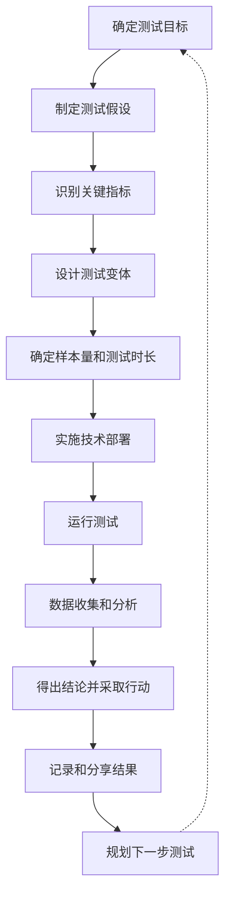
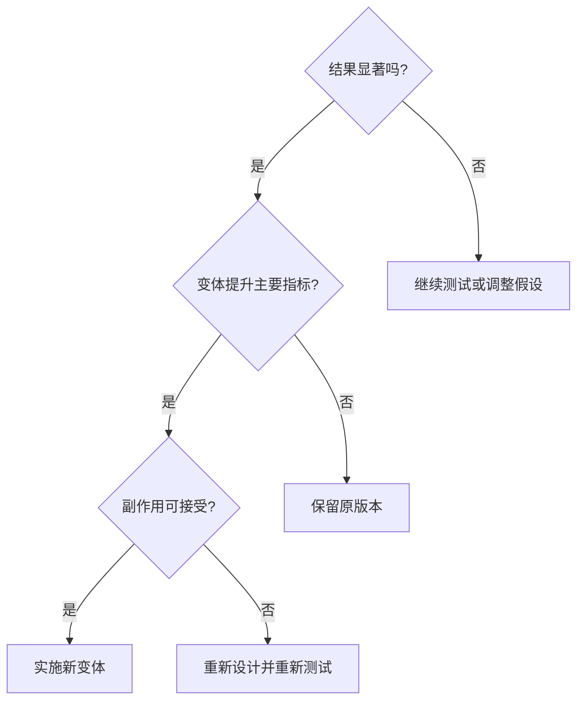

---
{"dg-publish":true,"tags":["商业分析","AB测试","方法","数据分析","用户体验"],"创建日期":"2024-04-28","更新日期":"2024-04-28","permalink":"/知识共享/002_商业分析/02_笔记/02_方法工具/A-B测试设计与执行/","dgPassFrontmatter":true}
---

# A/B测试设计与执行操作指南

> [!quote] 概述
> A/B测试是一种通过比较两个或多个版本的变量来确定哪个版本对特定目标效果更好的实验方法。本指南提供了A/B测试从策划到执行再到分析的完整流程，帮助您有效地设计实验、收集数据并做出数据驱动的决策。

## 一、A/B测试基础

### 1.1 什么是A/B测试？

A/B测试（也称为分组测试或对照实验）是一种比较两个版本的网页、应用、营销材料或其他用户交互元素，以确定哪个版本能够获得更好绩效的实验方法。测试过程中，用户会被随机分配到不同版本（通常称为"对照组"和"实验组"），然后收集和分析他们的行为数据，以确定哪个版本更有效。

### 1.2 A/B测试的核心价值

- **减少猜测决策**：基于数据而非直觉做决策
- **优化关键指标**：提高转化率、点击率等业务关键绩效指标
- **降低风险**：在全面推出前测试新功能/设计
- **了解用户行为**：获取对用户偏好的深入洞察
- **持续改进文化**：建立以数据驱动的优化文化

### 1.3 适用场景

A/B测试适用于多种场景，包括但不限于：

- 网站/应用界面设计优化
- 营销活动和邮件营销优化
- 产品功能测试
- 定价策略测试
- 内容策略优化
- 用户流程优化

## 二、A/B测试流程

## 三、详细操作步骤

### 3.1 确定测试目标

#### 操作指引：
1. 确定业务优先事项和挑战
2. 明确当前问题点或优化机会
3. 设定明确、可衡量的目标

#### 质量检查：
- 目标是否具体、可衡量？
- 目标与业务关键指标是否相关？
- 目标是否有时间限制？

#### 示例：
- ✅ 提高主页新用户的注册转化率
- ✅ 增加产品页面的平均停留时间
- ❌ 改善用户体验（太宽泛）

### 3.2 制定测试假设

#### 操作指引：
1. 基于用户研究、分析数据或业务洞察提出假设
2. 使用"如果...那么..."格式清晰表述
3. 确保假设是可验证的

#### 质量检查：
- 假设是否基于数据或明确的理由？
- 假设是否清晰描述了预期影响？
- 假设是否可通过实验验证或反驳？

#### 示例：
- ✅ 如果我们将注册按钮颜色改为对比色，那么按钮点击率将提高
- ✅ 如果我们减少结账流程步骤，那么购物车放弃率将下降
- ❌ 如果改变网站设计，那么结果会更好（太模糊）

### 3.3 识别关键指标

#### 操作指引：
1. 定义主要成功指标（必须与测试目标直接相关）
2. 确定次要指标（可能受测试影响的其他指标）
3. 设置监控指标（确保测试不会产生负面影响）

#### 质量检查：
- 主要指标是否直接衡量测试目标？
- 是否考虑了可能的副作用指标？
- 指标是否明确且易于测量？

#### 常用指标示例：

| 业务领域 | 主要指标示例 | 次要指标示例 |
|---------|------------|------------|
| 电子商务 | 转化率、平均订单价值 | 产品浏览数、加入购物车率 |
| 内容网站 | 页面停留时间、跳出率 | 页面浏览量、回访率 |
| SaaS产品 | 注册率、激活率 | 功能使用频率、客户支持请求 |
| 移动应用 | 安装后首日留存、关键行动完成率 | 会话时长、应用启动次数 |

### 3.4 设计测试变体

#### 操作指引：
1. 确保变体A（对照组）代表当前版本
2. 设计变体B（及其他变体）以测试假设
3. 限制每次测试的变量数量（理想情况下为1个）
4. 确保变化足够显著以产生可测量的影响

#### 质量检查：
- 是否仅测试一个变量？（多变量测试需要更大样本）
- 变体之间的差异是否足够显著？
- 所有变体是否都能正常工作？

#### 变体设计注意事项：
- **过度限制变化**：变化太小可能无法产生显著影响
- **过度扩大变化**：同时测试多个变量会难以确定哪个变量产生了影响
- **忽视用户体验**：确保测试变体不会破坏整体用户体验

### 3.5 确定样本量和测试时长

#### 操作指引：
1. 使用样本量计算器确定所需的参与者数量
2. 考虑统计显著性水平（通常为95%置信度）
3. 估计完成测试所需的时间（基于流量和转化率）
4. 考虑季节性和周期性因素

#### 质量检查：
- 样本量是否足以达到所需的置信水平？
- 测试时长是否考虑了业务周期？
- 是否有足够流量在合理时间内完成测试？

#### 样本量计算工具：
- [Optimizely Sample Size Calculator](https://www.optimizely.com/sample-size-calculator/)
- [VWO A/B Test Duration Calculator](https://vwo.com/tools/ab-test-duration-calculator/)
- [Evan Miller's Sample Size Calculator](https://www.evanmiller.org/ab-testing/sample-size.html)

### 3.6 实施技术部署

#### 操作指引：
1. 选择合适的A/B测试工具（见工具列表）
2. 设置流量分配（通常50/50，但根据风险可调整）
3. 配置分流和跟踪代码
4. 确保跨设备一致性体验
5. 进行QA测试确保正常工作

#### 常见问题和解决方案：
- **技术问题**：提前进行全面测试，准备回滚计划
- **样本污染**：使用持久化用户ID和cookies确保用户体验一致
- **设备兼容性**：在多种设备和浏览器上测试变体

#### 常用A/B测试工具：

| 工具名称 | 优势 | 适用场景 |
|---------|-----|----------|
| Google Optimize | 免费，与Google Analytics集成 | 初创公司，预算有限 |
| Optimizely | 强大的多变量测试，企业级功能 | 大型企业，高流量网站 |
| VWO | 用户友好，易于实施 | 中小型企业 |
| LaunchDarkly | 专注于功能标志和发布控制 | 软件开发团队 |
| AB Tasty | 强大的个性化和AI推荐 | 电子商务，内容网站 |

### 3.7 运行测试

#### 操作指引：
1. 运行预测试检查确保所有系统正常工作
2. 按计划启动测试
3. 定期监控测试进展但避免过早下结论
4. 记录测试期间的任何异常或外部因素

#### 质量检查：
- 测试是否按计划运行？
- 数据收集是否正常？
- 是否有意外的外部因素影响测试？

#### 测试运行注意事项：
- **避免偷看效应**：避免在测试完成前做出决策
- **避免过早终止**：即使看到明显结果也完成计划的测试期
- **记录外部事件**：营销活动、媒体报道等可能影响结果的事件

### 3.8 数据收集和分析

#### 操作指引：
1. 收集所有预定义指标的数据
2. 使用统计分析确定结果是否显著
3. 进行分段分析找出特定用户群体的差异
4. 考虑短期和长期影响

#### 分析方法：
- **统计显著性测试**：通常使用Z检验或T检验
- **置信区间计算**：理解结果的可靠范围
- **分段分析**：按用户类型、设备、地理位置等细分结果
- **趋势分析**：观察随时间变化的模式

#### 结果解读示例：

| 结果类型 | 解释 | 行动建议 |
|---------|-----|----------|
| 明显胜出 | 变体B的转化率提高15%，99%置信度 | 实施变体B |
| 轻微胜出 | 变体B的转化率提高5%，90%置信度 | 考虑实施或进一步测试 |
| 无显著差异 | 两个变体之间无统计差异 | 尝试不同假设或更大变化 |
| 负面影响 | 变体B降低了关键指标 | 保留原版本，分析原因 |

### 3.9 得出结论并采取行动

#### 操作指引：
1. 基于数据和业务目标做出决策
2. 考虑实施成本与预期收益
3. 制定明确的实施计划
4. 持续监控实施后的效果

#### 行动决策框架：

### 3.10 记录和分享结果

#### 操作指引：
1. 创建详细的测试文档
2. 包含初始假设、测试设计和结果
3. 提供学习要点和未来建议
4. 向利益相关者分享结果和洞察

#### 测试文档模板要素：
- 测试概述和目标
- 假设和原理
- 测试设计（变体、指标、时长）
- 结果数据和可视化
- 统计分析和显著性
- 关键发现和学习
- 建议和后续步骤

## 四、常见问题与解决方案

### 4.1 样本量不足

#### 问题：
- 没有足够的用户参与测试
- 无法达到统计显著性

#### 解决方案：
- 延长测试时间
- 增加流量到测试页面（如通过营销活动）
- 减少测试变量数量
- 测试转化漏斗更靠前的环节（通常有更多流量）
- 考虑降低统计置信度要求（风险权衡）

### 4.2 不确定性结果

#### 问题：
- 测试结果接近但未达到统计显著性
- 不同用户群体反应不一致

#### 解决方案：
- 分析用户细分数据，查找特定群体的明确模式
- 延长测试以获取更多数据点
- 进行跟进测试，专注于特定用户群体
- 检查测试设置是否有技术问题

### 4.3 技术实施挑战

#### 问题：
- 闪烁效应（用户看到内容切换）
- 跨设备跟踪问题
- 测试工具与网站冲突

#### 解决方案：
- 使用服务器端测试而非客户端测试
- 实施适当的缓存控制和异步加载策略
- 使用持久化标识符进行跨设备跟踪
- 与开发团队密切合作解决冲突

### 4.4 组织挑战

#### 问题：
- 过早终止测试的压力
- 对"输家"测试结果的抵抗
- 测试优先级确定困难

#### 解决方案：
- 提前设定明确的终止条件和时间表
- 培养"测试和学习"而非"成功和失败"的文化
- 建立基于业务影响的测试优先级框架
- 定期分享测试结果和学习

## 五、高级A/B测试策略

### 5.1 多变量测试(MVT)

同时测试多个元素的多个变体，帮助了解元素间的交互效应。

**使用时机**：当有足够大的流量，且需要测试多个变量的组合效果时。

**注意事项**：
- 需要显著更大的样本量
- 解释结果更为复杂
- 适合高流量页面

### 5.2 多臂老虎机测试

动态调整流量分配，将更多访问者引导至表现更好的变体。

**使用时机**：在优化期间，希望最小化机会成本时。

**优势**：
- 减少对表现不佳变体的曝光
- 加快测试速度
- 适合营销活动等短期测试

### 5.3 顺序测试

允许在测试过程中根据预定规则提前终止测试。

**使用时机**：对风险敏感或希望尽快获得结果时。

**实施方法**：
- 设定明确的中期评估点
- 建立严格的早期终止标准
- 使用支持顺序测试的专业工具

### 5.4 个性化测试

根据用户特征或行为为不同用户群体提供不同体验。

**使用时机**：有明确的用户细分，且不同群体可能有不同偏好时。

**策略**：
- 基于历史行为定向测试
- 基于人口统计信息定向测试
- 基于来源渠道定向测试

## 六、A/B测试实战案例

### 6.1 电子商务产品页面优化

**背景**：在线零售商希望提高产品页面的转化率。

**假设**：将"加入购物车"按钮改为更明显的颜色并增加紧迫感文案将提高转化率。

**测试设计**：
- 变体A：原始设计（蓝色按钮，文案"加入购物车"）
- 变体B：橙色按钮，文案"立即购买 - 限时优惠"

**关键指标**：
- 主要：加入购物车转化率
- 次要：实际购买转化率，平均订单价值

**结果**：
- 变体B的加入购物车转化率提高23%（统计显著性>99%）
- 变体B的实际购买转化率提高7%
- 平均订单价值无显著变化

**学习**：视觉突出度和紧迫感结合能有效提高用户行动意愿，而不影响最终购买决策质量。

### 6.2 SaaS产品注册流程优化

**背景**：B2B软件公司希望提高试用注册完成率。

**假设**：简化注册表单并推迟要求某些信息将提高注册完成率。

**测试设计**：
- 变体A：单页表单，10个必填字段
- 变体B：两步表单，第一步仅3个必填字段，其余在第二步（可选）

**关键指标**：
- 主要：注册完成率
- 次要：提供完整信息的比例，试用激活率

**结果**：
- 变体B的注册完成率提高54%（统计显著性>99%）
- 变体B中89%的用户最终完成了全部信息（尽管是可选的）
- 变体B的试用激活率提高17%

**学习**：降低初始摩擦大幅提高转化率，渐进式信息收集可以在不牺牲数据完整性的情况下提高用户体验。

## 七、A/B测试工具与资源

### 7.1 推荐工具

#### 全功能A/B测试平台
- **Google Optimize** - 免费入门级选项，与Google Analytics集成
- **Optimizely** - 企业级解决方案，功能强大
- **VWO (Visual Website Optimizer)** - 用户友好，功能全面
- **AB Tasty** - 强大的个性化功能和AI支持

#### 特定功能工具
- **LaunchDarkly** - 专注于功能标志和发布控制
- **Unbounce** - 专注于落地页测试
- **ClickFlow** - 专注于SEO内容测试
- **Apptimize** - 专注于移动应用测试

### 7.2 样本量计算器
- [Optimizely Sample Size Calculator](https://www.optimizely.com/sample-size-calculator/)
- [VWO A/B Test Duration Calculator](https://vwo.com/tools/ab-test-duration-calculator/)
- [Evan Miller's Sample Size Calculator](https://www.evanmiller.org/ab-testing/sample-size.html)

### 7.3 学习资源
- 《A/B测试：网站优化的艺术与科学》- 柯林·麦克法兰
- 《精益分析》- 阿利斯泰尔·克罗尔
- [ConversionXL博客](https://cxl.com/blog/)
- [Growth Hackers A/B测试案例研究](https://growthhackers.com/)

## 八、A/B测试检查清单

### 8.1 测试前检查清单

- [ ] 确定明确的测试目标和假设
- [ ] 选择合适的主要和次要指标
- [ ] 计算所需样本量和测试时长
- [ ] 设计有明显差异的测试变体
- [ ] 确保变体在所有设备上正常工作
- [ ] 设置正确的流量分配和用户分组
- [ ] 配置准确的跟踪和数据收集
- [ ] 进行QA测试确保功能正常

### 8.2 测试中检查清单

- [ ] 定期监控测试但避免过早下结论
- [ ] 检查数据收集是否正常
- [ ] 记录可能影响结果的外部事件
- [ ] 确保所有变体继续正常运行
- [ ] 监控异常模式并调查原因

### 8.3 测试后检查清单

- [ ] 确认测试达到统计显著性
- [ ] 进行细分分析了解不同用户群体反应
- [ ] 检查短期和长期指标
- [ ] 记录学习并更新测试知识库
- [ ] 制定明确的下一步行动计划
- [ ] 分享结果和学习给团队和利益相关者

## 九、A/B测试伦理考量

### 9.1 用户隐私与数据保护
- 确保遵守GDPR、CCPA等隐私法规
- 只收集必要的用户数据
- 在隐私政策中明确说明A/B测试活动

### 9.2 用户体验考量
- 避免可能造成负面用户体验的测试
- 确保所有测试变体都能提供可接受的用户体验
- 注意测试可能对不同人群产生的差异性影响

### 9.3 透明度
- 考虑提供测试参与说明
- 在适当情况下允许用户选择退出测试
- 不要测试可能引起道德争议的内容

## 十、高阶A/B测试思考

### 10.1 建立测试文化

要建立有效的测试文化，需要：
- 鼓励实验和学习心态
- 接受"失败"测试作为学习的一部分
- 让数据驱动决策成为组织习惯
- 庆祝学习而非仅庆祝成功

### 10.2 测试优先级框架

使用PIE框架评估潜在测试：
- **潜力(Potential)** - 改进空间有多大？
- **重要性(Importance)** - 页面或功能对业务有多重要？
- **易用性(Ease)** - 实施和分析测试有多容易？

### 10.3 持续优化策略

A/B测试最有效地作为持续优化计划的一部分：
- 将测试集成到产品开发流程
- 建立测试路线图与假设库
- 定期回顾测试结果并应用学习
- 结合定性和定量研究方法

## 结语

A/B测试是一种强大的数据驱动决策工具，能帮助组织在减少猜测的情况下做出更明智的决策。通过系统的方法论、严谨的实验设计和持续学习的心态，您可以逐步优化产品和服务，创造更好的用户体验并提升业务表现。

记住，A/B测试不仅仅是一种技术，更是一种思维方式——愿意质疑假设，通过实验验证想法，并基于数据不断改进。

> [!tip] 实践建议
> 从小规模、低风险的测试开始，逐步建立信心和经验。随着测试能力的成熟，可以逐渐扩展到更复杂和关键的业务领域。持续记录和分享学习，建立组织的测试知识库。 