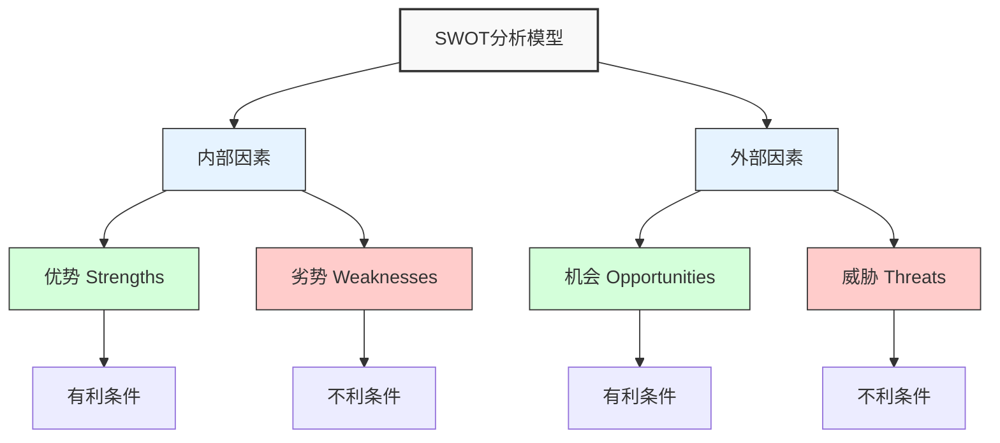
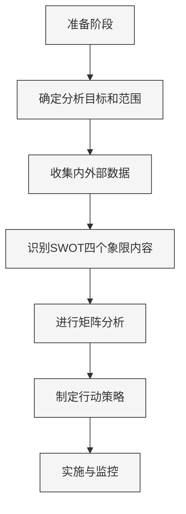

---
{"dg-publish":true,"tags":["商业分析","SWOT分析","战略工具","应用笔记"],"创建日期":"2024-04-26","更新日期":"2024-04-26","permalink":"/知识共享/002_商业分析/02_笔记/02_方法工具/SWOT分析操作指南/","dgPassFrontmatter":true}
---

# SWOT分析操作指南

> [!quote] 概述
> 本笔记提供SWOT分析的系统化操作指南，涵盖分析原理、详细步骤、应用方法和常见问题解决方案。旨在帮助分析人员有效运用这一经典战略工具，制定合理的业务决策和战略规划。

## 1. 分析基础

### 1.1 SWOT概念解析

SWOT分析是一种战略规划工具，用于评估组织、项目或业务决策的优势(Strengths)、劣势(Weaknesses)、机会(Opportunities)和威胁(Threats)。该工具由阿尔伯特·汉弗莱(Albert Humphrey)在1960年代引入，现已成为战略管理和商业分析的基础方法之一。

### 1.2 SWOT矩阵结构

SWOT分析的核心是一个2×2矩阵，将内部和外部因素与有利和不利条件进行交叉分析：

| | 有利条件 | 不利条件 |
|---------|---------|---------|
| **内部因素** | 优势(Strengths) | 劣势(Weaknesses) |
| **外部因素** | 机会(Opportunities) | 威胁(Threats) |

### 1.3 四个维度详解

1. **优势(Strengths)**
   - 定义：组织内部积极、有利的特性和资源
   - 思考方向：组织做得好的方面、独特资源、竞争优势
   - 关键问题：我们的核心能力是什么？我们比竞争对手做得好的方面有哪些？

2. **劣势(Weaknesses)**
   - 定义：组织内部消极、不利的特性和资源缺乏
   - 思考方向：需要改进的领域、资源缺口、能力不足
   - 关键问题：我们可以改进什么？应该避免什么？竞争对手做得比我们好的方面？

3. **机会(Opportunities)**
   - 定义：外部环境中可以利用的有利趋势和发展
   - 思考方向：市场趋势、技术变革、政策变化、竞争格局变化
   - 关键问题：有哪些好的机会？有哪些有趣的趋势？

4. **威胁(Threats)**
   - 定义：外部环境中可能对组织造成伤害的不利因素
   - 思考方向：障碍、竞争动向、关键技术变化、负面市场变化
   - 关键问题：我们面临什么障碍？竞争对手在做什么？技术变化是否威胁我们的地位？

### 1.4 适用范围

SWOT分析广泛适用于多种场景：

- 企业战略规划和制定
- 新产品或服务的市场进入决策
- 业务部门绩效评估
- 项目可行性研究
- 个人职业发展规划
- 竞争对手分析
- 风险评估

## 2. 应用步骤与方法

### 2.1 SWOT分析流程

### 2.2 详细应用步骤

#### 步骤一：准备与明确分析目标

**操作指引**：
1. 明确定义分析的具体对象(公司、部门、产品、项目等)
2. 确定分析目的(战略规划、问题解决、机会评估等)
3. 确定分析的时间范围(短期、中期、长期)
4. 组建分析团队，确保团队成员来自不同职能部门

**质量检查点**：
- 分析目标是否具体、清晰且可衡量？
- 是否确定了适当的分析范围？
- 是否明确了分析的时间框架？
- 团队是否多样化，能提供不同视角？

#### 步骤二：数据收集

**操作指引**：
1. 收集内部资源、能力和限制相关数据
   - 财务数据(收入、利润、资产负债等)
   - 人力资源数据(技能、专业知识、员工满意度)
   - 运营数据(效率、产能、质量指标)
   - 营销和销售数据(市场份额、客户反馈)
   - 技术和研发数据(专利、知识产权、创新能力)

2. 收集外部环境和市场情报
   - 市场趋势和增长预测
   - 竞争对手分析资料
   - 宏观环境数据(PEST分析结果)
   - 行业报告和研究
   - 客户需求变化和反馈
   - 技术发展趋势
   - 法规政策变化

**数据收集方法**：
- 内部数据库分析
- 员工访谈和调查
- 客户反馈和市场调查
- 竞争情报收集
- 行业报告研究
- 专家咨询

**质量检查点**：
- 数据是否全面覆盖了内部和外部因素？
- 数据来源是否可靠且最新？
- 是否平衡了定量和定性数据？
- 是否咨询了跨部门的观点？

#### 步骤三：识别SWOT因素

**优势识别技巧**：
- 审视组织的核心竞争力和独特卖点
- 评估资源优势(财务、人力、技术、品牌等)
- 分析相对于竞争对手的差异化能力
- 考虑客户认为的价值点

**劣势识别技巧**：
- 客观评估组织弱点和不足
- 检视资源和能力缺口
- 分析业绩不佳的领域
- 从客户投诉和负面反馈中提取信息
- 与竞争对手对比找出差距

**机会识别技巧**：
- 分析市场趋势和增长领域
- 识别未满足的客户需求
- 评估技术创新带来的可能性
- 考虑市场或监管变化创造的空间
- 寻找竞争对手弱点可利用的机会

**威胁识别技巧**：
- 分析竞争格局和新进入者
- 评估市场变化和需求转变
- 识别可能的替代产品或服务
- 考虑宏观环境变化带来的挑战
- 评估资源限制和内部约束

**SWOT因素筛选标准**：
- 相关性：与分析目标直接相关
- 重要性：对组织成功有显著影响
- 可行动性：可以被管理或利用
- 特异性：具体明确而非模糊概述
- 基于事实：有数据或证据支持

**质量检查点**：
- 是否区分了内部因素(SW)和外部因素(OT)？
- 每个因素是否有具体的证据支持？
- 是否避免了过于乐观或悲观的偏见？
- 是否优先考虑了最重要的因素？

#### 步骤四：构建SWOT矩阵并进行交叉分析

**操作指引**：
1. 将识别的因素列入2×2矩阵对应象限
2. 对每个象限内的因素按重要性排序
3. 进行TOWS交叉分析，探索四种战略组合：
   - SO战略：利用优势抓住机会
   - ST战略：利用优势应对威胁
   - WO战略：克服劣势以把握机会
   - WT战略：克服劣势并最小化威胁

**TOWS矩阵模板**：

| | **优势(S)** | **劣势(W)** |
|---------|---------|---------|
| **机会(O)** | **SO战略**(攻击型)： 如何利用优势把握机会？ | **WO战略**(调整型)： 如何克服劣势以把握机会？ |
| **威胁(T)** | **ST战略**(防御型)： 如何利用优势应对威胁？ | **WT战略**(生存型)： 如何克服劣势并最小化威胁？ |

**质量检查点**：
- SWOT因素是否恰当放置在正确象限？
- 是否充分考虑了因素间的相互作用？
- 四种战略组合是否平衡考虑？
- 是否避免了过度专注于单一象限？

#### 步骤五：制定战略行动计划

**操作指引**：
1. 基于TOWS分析结果，为每种战略组合制定具体行动计划
2. 确定行动的优先级(影响力vs.可行性矩阵)
3. 为每项行动设定明确的目标、指标和时间表
4. 分配资源和责任人
5. 建立监控和调整机制

**战略选择决策框架**：

| 战略类型 | 适用情境 | 重点行动方向 |
|---------|----------|------------|
| 扩张型(SO) | 强势地位+有利环境 | 市场扩张、产品开发、投资增长 |
| 防御型(ST) | 强势地位+不利环境 | 多元化、巩固核心、风险管理 |
| 调整型(WO) | 弱势地位+有利环境 | 能力建设、战略联盟、选择性投资 |
| 生存型(WT) | 弱势地位+不利环境 | 精简运营、战略收缩、退出计划 |

**质量检查点**：
- 战略行动是否直接关联SWOT分析结果？
- 行动计划是否具体、可衡量且有时限？
- 是否考虑了资源限制和实施难度？
- 是否建立了有效的监控和调整机制？

### 2.3 示例模板

**SWOT分析工作表**：

| SWOT分析对象： | 日期： | 参与人员： |
|-----------|------|----------|
| **分析目标**： |      |          |
| **分析范围**： |      |          |

**内部分析**：

| 优势(Strengths) | 证据/数据 | 重要性(1-5) |
|----------------|----------|------------|
| 1. |  |  |
| 2. |  |  |
| 3. |  |  |

| 劣势(Weaknesses) | 证据/数据 | 重要性(1-5) |
|-----------------|----------|------------|
| 1. |  |  |
| 2. |  |  |
| 3. |  |  |

**外部分析**：

| 机会(Opportunities) | 证据/数据 | 重要性(1-5) |
|---------------------|----------|------------|
| 1. |  |  |
| 2. |  |  |
| 3. |  |  |

| 威胁(Threats) | 证据/数据 | 重要性(1-5) |
|--------------|----------|------------|
| 1. |  |  |
| 2. |  |  |
| 3. |  |  |

**战略行动计划**：

| 战略类型 | 行动计划 | 责任人 | 时间表 | 资源需求 | 成功指标 |
|---------|----------|--------|--------|----------|----------|
| SO战略 |  |  |  |  |  |
| ST战略 |  |  |  |  |  |
| WO战略 |  |  |  |  |  |
| WT战略 |  |  |  |  |  |

## 3. 应用案例：小米科技SWOT分析

### 3.1 分析背景

小米科技成立于2010年，是一家以智能手机、智能硬件和IoT平台为核心的消费电子和智能制造企业。本案例展示了小米在全球扩张阶段的SWOT分析过程。

### 3.2 SWOT因素识别

**优势(Strengths)**：
- 高性价比产品战略，获得广泛用户基础
- 强大的线上销售渠道，降低分销成本
- "米粉"用户社区的高忠诚度和参与度
- 生态系统战略，覆盖多种智能设备和服务
- 精益运营模式，有效控制成本
- 扁平化组织结构，决策效率高

**劣势(Weaknesses)**：
- 专利储备相对不足，面临知识产权挑战
- 高端市场品牌认知度有限
- 对线上渠道的过度依赖
- 国际市场本地化能力需要提升
- 研发投入比例低于行业领先对手
- 供应链面临瓶颈和波动风险

**机会(Opportunities)**：
- 全球智能设备市场持续增长
- 物联网和AI技术创造新产品类别
- 新兴市场智能手机渗透率提升空间大
- 5G技术部署带来硬件更新周期
- 数字服务和内容生态增长潜力
- 零售渠道线上线下融合趋势

**威胁(Threats)**：
- 全球智能手机市场竞争激烈，利润率承压
- 贸易壁垒和地缘政治风险增加
- 核心零部件供应依赖外部厂商
- 本土竞争对手在各区域市场快速崛起
- 消费电子创新周期缩短，研发压力增大
- 隐私和数据安全监管要求提高

### 3.3 TOWS矩阵分析

| | **优势(S)** | **劣势(W)** |
|---------|---------|---------|
| **机会(O)** | **SO战略**： 1. 利用高性价比优势拓展新兴市场 2. 基于用户社区推动IoT产品创新和普及 3. 通过生态系统策略抢占5G与AI市场机遇 | **WO战略**： 1. 增加研发投入，提升技术创新能力 2. 发展线下渠道，构建全渠道销售网络 3. 加强本地化团队建设，适应不同市场 |
| **威胁(T)** | **ST战略**： 1. 通过生态系统差异化应对同质化竞争 2. 多元化供应链降低单一依赖风险 3. 利用粉丝经济提高品牌忠诚度和抗风险能力 | **WT战略**： 1. 增加专利申请和技术储备 2. 优化产品线，聚焦高毛利细分市场 3. 建立合规体系应对数据安全挑战 |

### 3.4 战略行动建议

基于SWOT分析，小米可采取以下关键战略行动：

1. **市场扩张策略**
   - 针对不同区域市场开发差异化产品组合
   - 建立本地化营销和服务团队
   - 发展战略合作伙伴加速市场渗透

2. **产品战略调整**
   - 增强高端产品线，提升品牌溢价能力
   - 扩展IoT产品矩阵，强化生态系统优势
   - 开发AI和5G创新应用场景

3. **供应链优化**
   - 关键零部件多元化采购策略
   - 增加核心技术自研比例
   - 建立供应链风险预警机制

4. **品牌提升计划**
   - 加强全球品牌建设和传播
   - 提升产品设计和用户体验
   - 扩大线下体验店规模和覆盖

5. **技术创新投入**
   - 增加研发投入占比
   - 扩充专利储备，尤其是基础技术专利
   - 设立前沿技术探索实验室

### 3.5 实施效果

通过实施基于SWOT分析的战略调整，小米在国际市场取得了显著进展：西欧市场份额提升、印度市场保持领先地位、东南亚市场快速增长。同时，IoT生态系统产品矩阵扩展，服务收入占比提高，品牌溢价能力逐步增强。

## 4. 常见分析误区与解决方法

### 4.1 过于主观的分析

**常见表现**：
- 分析过程受个人偏见影响
- 缺乏客观数据支持
- 过度强调优势，弱化劣势
- 忽视不想面对的威胁

**解决方法**：
- 建立多元化分析团队，确保不同视角
- 要求所有SWOT因素提供具体证据或数据支持
- 邀请外部专家参与或审核分析结果
- 使用匿名收集机制收集真实意见
- 与市场数据和行业报告对照验证

### 4.2 静态分析而非动态视角

**常见表现**：
- 仅关注当前状况，忽视趋势和变化
- 未考虑竞争对手的可能反应
- 未将SWOT与时间维度关联

**解决方法**：
- 添加时间维度，区分短期、中期和长期因素
- 考虑因素的变化趋势和演变可能
- 进行情景分析，探索不同环境变化的影响
- 定期更新SWOT分析，形成动态监控机制
- 结合竞争对手分析，预测可能的战略互动

### 4.3 缺乏优先级和重要性区分

**常见表现**：
- 所有因素被平等对待
- 因素过多，无法聚焦关键点
- 战略制定缺乏重点

**解决方法**：
- 对每个因素进行影响力评分(1-5分)
- 使用2×2矩阵按重要性和紧迫性排序
- 限制每个象限最多5-7个关键因素
- 对优先因素进行深入分析和验证
- 确保战略行动与高优先级因素对应

### 4.4 内外部因素混淆

**常见表现**：
- 将内部可控因素归类为外部因素
- 将外部环境趋势误认为组织优势
- SW与OT界限模糊不清

**解决方法**：
- 使用控制测试：问"我们能否直接控制或改变这个因素"
- 先分别进行内部分析和外部分析，再整合
- 采用结构化的问题列表引导分析
- 参考PEST分析结果辅助识别外部因素
- 通过定义清晰的分类标准避免混淆

### 4.5 分析与行动脱节

**常见表现**：
- 完成分析后没有制定具体行动计划
- 战略行动与SWOT分析结果关联不明确
- 缺乏实施和监控机制

**解决方法**：
- 使用TOWS矩阵强制建立分析结果与战略行动的联系
- 为每项战略制定具体、可衡量的行动计划
- 建立清晰的责任分配和时间表
- 设定关键绩效指标(KPIs)跟踪实施效果
- 定期回顾战略实施进展，根据新信息调整

## 5. 高级应用技巧

### 5.1 定量SWOT分析

将传统的定性SWOT分析结合定量评估方法：

1. **因素评分系统**：
   - 对每个因素进行重要性评分(1-5)
   - 评估组织相对于该因素的表现(1-5)
   - 计算加权分数(重要性×表现)

2. **竞争对标评分**：
   - 将组织在每个SWOT因素上的表现与主要竞争对手比较
   - 创建雷达图可视化竞争优劣

3. **概率-影响矩阵**：
   - 评估机会和威胁的发生概率
   - 评估其对组织的潜在影响
   - 建立2×2矩阵确定优先关注领域

### 5.2 多层次SWOT分析

针对复杂组织或问题的分层分析方法：

1. **组织层级分析**：
   - 公司层级SWOT
   - 业务单元层级SWOT
   - 产品/服务层级SWOT
   - 分析结果的上下整合

2. **功能领域分析**：
   - 市场营销SWOT
   - 财务SWOT
   - 运营SWOT
   - 人力资源SWOT
   - 技术研发SWOT
   - 跨职能整合分析

3. **地理区域分析**：
   - 不同区域市场的差异化SWOT
   - 全球与本地因素的平衡

### 5.3 与其他分析工具结合

SWOT分析与其他战略工具的结合应用：

1. **SWOT + PEST分析**：
   - 使用PEST分析提供外部环境的系统化输入
   - 确保OT象限全面覆盖政治、经济、社会和技术因素

2. **SWOT + 波特五力分析**：
   - 利用五力分析深入评估行业结构和竞争格局
   - 从五力分析结果提取OT因素

3. **SWOT + 价值链分析**：
   - 通过价值链分析识别内部优势和劣势
   - 精确定位组织的核心竞争力和改进领域

4. **SWOT + 情景规划**：
   - 在多种可能的未来情景下进行SWOT分析
   - 开发适应不同情景的弹性战略

### 5.4 时间序列SWOT分析

将时间维度整合到SWOT分析中：

1. **回顾性分析**：评估过去3-5年SWOT因素的变化
2. **当前分析**：评估现状
3. **预测性分析**：预测未来3-5年可能的SWOT变化
4. **趋势分析**：识别关键因素的演变趋势和转变点

## 6. 实践检查表

使用以下检查表评估SWOT分析的质量和有效性：

### 6.1 准备阶段检查

- [ ] 是否明确定义了分析目标和范围？
- [ ] 是否组建了多元化的分析团队？
- [ ] 是否收集了足够的内部和外部数据？
- [ ] 是否明确了分析的时间框架？

### 6.2 分析过程检查

- [ ] 是否正确区分了内部因素(SW)和外部因素(OT)？
- [ ] 是否为每个SWOT因素提供了具体证据或数据？
- [ ] 是否对因素进行了优先级排序？
- [ ] 是否考虑了时间维度和变化趋势？
- [ ] 是否避免了主观偏见？
- [ ] 是否进行了TOWS交叉分析？

### 6.3 结果应用检查

- [ ] 是否基于分析结果制定了具体的战略行动？
- [ ] 是否为每项战略设定了明确的目标和指标？
- [ ] 是否分配了资源和责任人？
- [ ] 是否建立了监控和调整机制？
- [ ] 是否考虑了实施的潜在障碍和解决方案？

## 7. 延伸资源

1. 书籍资源：
   - Humphrey, A. (2005). "SWOT Analysis for Management Consulting"
   - Weihrich, H. (1982). "The TOWS Matrix: A Tool for Situational Analysis"
   - Thompson, A. & Strickland, A. "Strategic Management: Concepts and Cases"

2. 实用工具：
   - SWOT分析模板：[[知识共享/002_商业分析/04_模板/01_分析框架/SWOT分析模板\|04_模板/01_分析框架/SWOT分析模板]]
   - 战略规划工具集：[[04_模板/04_决策支持/战略规划工作表模板\|04_模板/04_决策支持/战略规划工作表模板]]

3. 相关笔记：
   - [[知识共享/002_商业分析/02_笔记/02_方法工具/波特五力模型应用笔记\|02_笔记/02_方法工具/波特五力模型应用笔记]]
   - [[知识共享/002_商业分析/02_笔记/01_概念速查/分析方法论速查\|02_笔记/01_概念速查/分析方法论速查]]
   - [[知识共享/002_商业分析/01_学习内容/04_市场与竞争分析/4.1 市场分析框架\|04_市场与竞争分析/4.1 市场分析框架]]

---

> [!tip] 实践建议
> SWOT分析最大的价值不在于分析本身，而在于它如何指导实际行动。确保分析结果直接链接到具体、可执行的战略和行动计划。定期回顾和更新分析，使其成为动态战略管理的一部分，而非一次性练习。 