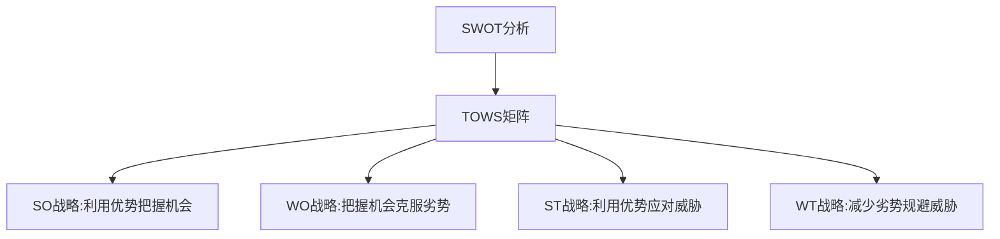
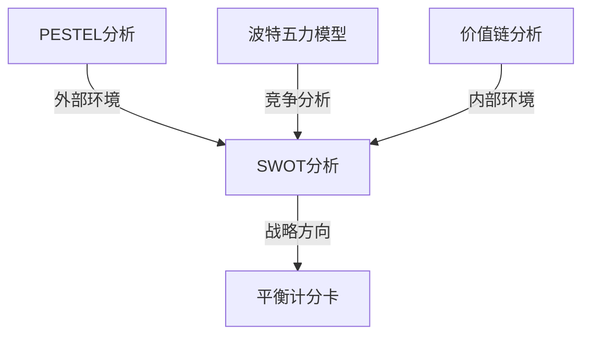

---
{"dg-publish":true,"tags":["商业分析","SWOT分析","方法","操作指南"],"created":"2024-04-30","permalink":"/知识共享/002_商业分析/02_笔记/02_方法工具/SWOT分析操作指南/","dgPassFrontmatter":true}
---


# SWOT分析操作指南

## 一、概述

SWOT分析是一种战略规划工具，用于评估组织、项目或业务活动的优势(Strengths)、劣势(Weaknesses)、机会(Opportunities)和威胁(Threats)。它可以帮助组织识别内部和外部因素，为战略决策提供结构化框架。

### 适用场景

- 战略规划和制定
- 业务发展评估
- 产品策略制定
- 市场进入决策
- 项目可行性分析
- 竞争分析

## 二、分析准备

### 1. 明确分析对象

确定SWOT分析的具体对象，可以是：
- 整个组织
- 特定业务部门
- 产品线
- 新市场进入策略
- 特定项目

### 2. 收集相关信息

在开始SWOT分析前，收集必要的数据和信息：
- 内部报告和业绩数据
- 市场研究和行业报告
- 客户反馈和调查结果
- 竞争对手信息
- 宏观环境数据(政治、经济、社会、技术因素)

### 3. 组织分析团队

- 确保团队成员多样化，来自不同部门和层级
- 包括了解内部情况的人员和了解外部环境的人员
- 指定一名协调员，负责引导讨论和收集意见

## 三、SWOT分析步骤

### 步骤一：识别优势(Strengths)

优势是组织内部的积极因素，为组织提供竞争优势。

**关键问题**：
- 我们擅长什么？
- 我们的竞争优势是什么？
- 我们有哪些独特资源、能力或专业知识？
- 客户/用户认为我们的优势是什么？
- 我们有哪些无形资产(品牌、声誉、专利等)？

**收集方法**：
- 头脑风暴会议
- 员工调查
- 业绩数据分析
- 客户满意度调查

**质量检查**：
- 优势必须是内部因素
- 应基于事实而非猜测
- 应与竞争对手相比较
- 应明确表述，避免模糊

### 步骤二：识别劣势(Weaknesses)

劣势是组织内部的消极因素，可能阻碍组织实现目标。

**关键问题**：
- 我们可以改进什么？
- 我们缺乏哪些资源或能力？
- 竞争对手比我们做得更好的是什么？
- 客户/用户投诉的是什么？
- 阻碍我们前进的内部障碍是什么？

**收集方法**：
- 内部审计
- 流程评估
- 顾客投诉分析
- 员工反馈
- 绩效差距分析

**质量检查**：
- 劣势必须是内部因素
- 应诚实面对，避免掩盖问题
- 应具体而非泛泛而谈
- 应优先关注可改进的领域

### 步骤三：识别机会(Opportunities)

机会是外部环境中可能有利于组织的积极因素。

**关键问题**：
- 市场上存在哪些新趋势？
- 有哪些技术变革可以利用？
- 政策或法规变化带来了哪些可能性？
- 竞争对手忽视了哪些市场需求？
- 哪些外部因素可以帮助我们扩大优势？

**收集方法**：
- 市场研究
- 行业趋势分析
- PESTEL分析
- 客户需求调查
- 竞争对手分析

**质量检查**：
- 机会必须是外部因素
- 应评估机会的时效性
- 应考虑机会的实际可行性
- 应关联到组织能力和资源

### 步骤四：识别威胁(Threats)

威胁是外部环境中可能阻碍组织发展的消极因素。

**关键问题**：
- 竞争格局有哪些变化？
- 有哪些不利的经济或政治变化？
- 技术变革会如何影响我们的优势？
- 客户需求或偏好正在如何变化？
- 有哪些外部障碍可能阻碍我们的发展？

**收集方法**：
- 风险评估
- 行业分析
- 竞争情报
- 宏观环境扫描
- 未来情景规划

**质量检查**：
- 威胁必须是外部因素
- 应评估威胁的紧迫性和严重性
- 应区分短期威胁和长期威胁
- 应评估威胁的影响范围

### 步骤五：汇总和分析

将收集的优势、劣势、机会和威胁汇总到SWOT矩阵中。

```mermaid
quadrantChart
    title SWOT分析矩阵
    x-axis 内部因素 --> 外部因素
    y-axis 消极因素 --> 积极因素
    quadrant-1 优势(S)
    quadrant-2 机会(O)
    quadrant-3 威胁(T)
    quadrant-4 劣势(W)
```

## 四、SWOT分析的战略开发

将SWOT分析结果转化为具体战略，通常使用TOWS矩阵：

### 1. SO战略(优势-机会战略)
利用内部优势把握外部机会
- 关键问题：如何利用我们的优势来把握机会？
- 例如：利用品牌优势(S)开拓新兴市场(O)

### 2. WO战略(劣势-机会战略)
通过把握外部机会克服内部劣势
- 关键问题：如何克服劣势以利用机会？
- 例如：通过与技术合作伙伴合作(O)弥补技术能力不足(W)

### 3. ST战略(优势-威胁战略)
利用内部优势应对外部威胁
- 关键问题：如何利用优势来减轻威胁？
- 例如：利用产品多样化优势(S)减轻对特定市场依赖，应对市场萎缩威胁(T)

### 4. WT战略(劣势-威胁战略)
减少内部劣势，避免外部威胁
- 关键问题：如何减少劣势并避免威胁？
- 例如：通过改善质量控制(W)避免因产品质量问题面临声誉危机(T)



## 五、SWOT分析注意事项

### 常见错误
1. **过度简化**：只列出表面因素而不深入分析
2. **缺乏客观性**：过于关注优势而忽视劣势
3. **缺乏具体性**：陈述过于笼统，不够具体
4. **内外部混淆**：将内部因素误认为外部因素，反之亦然
5. **忽视优先级**：未区分重要因素和次要因素
6. **静态思维**：未考虑环境变化和动态影响
7. **缺乏行动建议**：只进行分析而不提出战略建议

### 改进技巧
1. **使用数据支持**：尽可能用数据和事实支持SWOT要素
2. **进行优先级排序**：对各要素按重要性和影响力排序
3. **考虑时间维度**：区分短期和长期的优势、劣势、机会和威胁
4. **定期更新**：定期更新SWOT分析以反映环境变化
5. **利益相关者参与**：纳入不同利益相关者的观点
6. **与其他工具结合**：结合PESTEL分析、波特五力模型等工具
7. **设定明确行动计划**：将分析结果转化为具体行动计划

## 六、SWOT分析模板

### 基本模板

| 优势(Strengths) | 劣势(Weaknesses) |
|----------------|-----------------|
| 1. | 1. |
| 2. | 2. |
| 3. | 3. |

| 机会(Opportunities) | 威胁(Threats) |
|-------------------|-------------|
| 1. | 1. |
| 2. | 2. |
| 3. | 3. |

### 加权SWOT模板

为每个因素分配重要性权重(1-5)，帮助优先处理关键因素：

| 优势(Strengths) | 权重(1-5) | 劣势(Weaknesses) | 权重(1-5) |
|----------------|----------|-----------------|----------|
| 1. | | 1. | |
| 2. | | 2. | |
| 3. | | 3. | |

| 机会(Opportunities) | 权重(1-5) | 威胁(Threats) | 权重(1-5) |
|-------------------|----------|-------------|----------|
| 1. | | 1. | |
| 2. | | 2. | |
| 3. | | 3. | |

### TOWS战略规划模板

|  | 优势(S) | 劣势(W) |
|--|---------|---------|
| **机会(O)** | SO战略:<br>1.<br>2.<br>3. | WO战略:<br>1.<br>2.<br>3. |
| **威胁(T)** | ST战略:<br>1.<br>2.<br>3. | WT战略:<br>1.<br>2.<br>3. |

## 七、实例案例：咖啡连锁店SWOT分析

### 背景信息
某区域性咖啡连锁店希望评估其当前状况并制定扩张战略。

### SWOT分析

#### 优势(S)
1. 高质量咖啡豆直接从产地采购
2. 独特的店面设计和氛围
3. 经验丰富的咖啡师团队
4. 忠诚度高的核心客户群
5. 店铺位于高流量区域

#### 劣势(W)
1. 价格高于部分竞争对手
2. 有限的菜单选择
3. 分店数量少，品牌知名度有限
4. 缺乏强大的数字营销能力
5. 供应链管理不够高效

#### 机会(O)
1. 特色咖啡消费持续增长
2. 新兴住宅区发展提供扩展机会
3. 数字订购和外送服务市场扩大
4. 可持续和道德采购受消费者青睐
5. 与当地企业合作潜力

#### 威胁(T)
1. 国际连锁咖啡品牌的激烈竞争
2. 咖啡豆价格波动
3. 消费者对价格敏感度增加
4. 劳动力成本上升
5. 健康趋势可能影响咖啡消费

### 战略建议

#### SO战略
1. 扩大直接采购网络，强化高品质咖啡定位
2. 在新兴住宅区开设新店，复制成功的店面设计
3. 利用忠诚客户群创建品牌大使计划，提高口碑营销

#### WO战略
1. 开发限时特色菜单，增加选择多样性
2. 建立移动应用和线上订购系统
3. 开发针对企业的咖啡服务和合作项目

#### ST战略
1. 强调与国际连锁品牌的差异化，如本地化和个性化服务
2. 与生产商建立长期合约，减少价格波动影响
3. 开发低价入门产品和高价高端产品的双线策略

#### WT战略
1. 优化供应链管理减少成本
2. 增加健康咖啡选项和非咖啡饮品
3. 提高人员效率，平衡劳动力成本

## 八、SWOT分析工作坊指南

### 准备工作
1. **确定参与者**：5-10人的多样化团队
2. **准备材料**：白板、便利贴、马克笔、SWOT模板
3. **场地设置**：安静、宽敞、便于讨论
4. **时间安排**：约2-3小时

### 工作坊流程

#### 1. 介绍(10分钟)
- 解释SWOT分析的目的和流程
- 明确分析对象和预期输出
- 设定基本规则(如鼓励开放思考、暂时不评判)

#### 2. 信息共享(20分钟)
- 分享已收集的市场数据、业绩信息等
- 确保所有参与者有相似的基础信息

#### 3. 个人头脑风暴(15分钟)
- 每位参与者独立思考并记录SWOT要素
- 使用便利贴，每个想法一个便利贴

#### 4. 小组讨论(60分钟)
- 收集所有便利贴并按SWOT四象限分类
- 讨论每个要素，合并相似项
- 澄清模糊的描述，确保具体明确
- 对每个象限的要素进行优先级排序

#### 5. 战略讨论(40分钟)
- 使用TOWS矩阵制定战略选项
- 讨论如何利用优势、克服劣势
- 确定3-5个关键战略方向

#### 6. 总结和下一步(15分钟)
- 总结关键发现和战略方向
- 分配后续任务和责任人
- 设定实施时间表

## 九、与其他分析方法的结合

SWOT分析可以与其他分析工具结合使用，获得更全面的视角：

### 1. SWOT + PESTEL分析
先进行PESTEL分析识别宏观环境因素，再将这些因素纳入SWOT的机会和威胁部分。

### 2. SWOT + 波特五力模型
使用波特五力模型分析行业竞争格局，为SWOT的外部环境分析提供框架。

### 3. SWOT + 价值链分析
通过价值链分析识别内部优势和劣势，然后纳入SWOT矩阵。

### 4. SWOT + 平衡计分卡
使用SWOT分析结果指导平衡计分卡的战略目标设定。



## 十、练习与实践

### 练习1：简单SWOT分析
选择一个你熟悉的组织或产品，进行基本SWOT分析：
1. 列出至少3个优势
2. 列出至少3个劣势
3. 列出至少3个机会
4. 列出至少3个威胁
5. 提出2-3个战略建议

### 练习2：竞争对比SWOT
选择两个竞争对手，进行对比SWOT分析：
1. 分别为两个竞争对手制作SWOT矩阵
2. 比较两者的SWOT差异
3. 识别相对竞争优势和劣势
4. 提出差异化策略建议

### 练习3：动态SWOT分析
选择一个组织或产品，进行动态SWOT分析：
1. 制作当前SWOT矩阵
2. 预测2-3年后的SWOT变化
3. 分析变化动因
4. 提出应对变化的战略
5. 设计定期更新SWOT的机制

## 相关资源

- [[知识共享/002_商业分析/02_笔记/01_概念速查/商业分析框架速查\|商业分析框架速查]]
- [[04_模板/01_分析框架/SWOT分析模板\|04_模板/01_分析框架/SWOT分析模板]]
- [[03_案例/03_产品案例/共享单车商业模式评估\|03_案例/03_产品案例/共享单车商业模式评估]] 