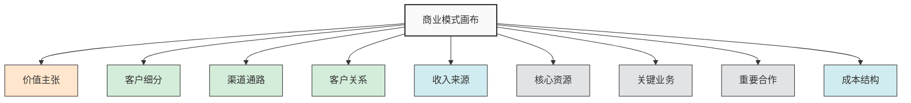
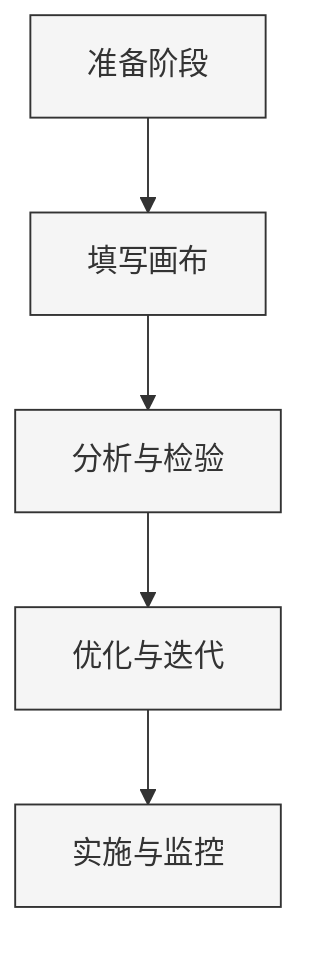
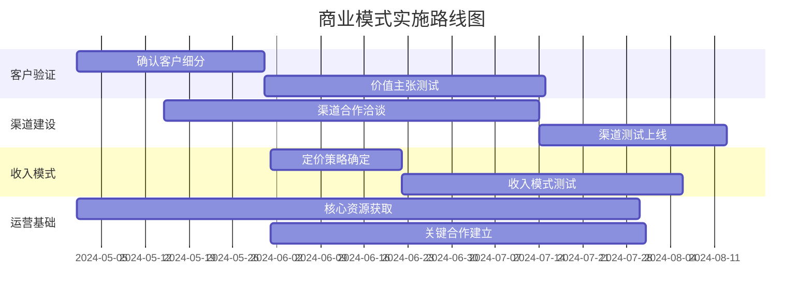
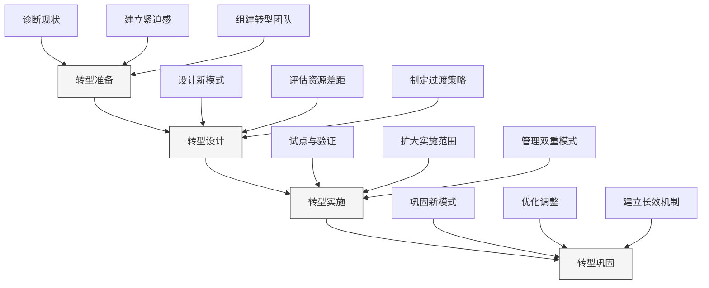

---
{"dg-publish":true,"tags":["商业分析","商业模式画布","战略工具","应用笔记"],"创建日期":"2024-04-26","更新日期":"2024-04-26","permalink":"/知识共享/002_商业分析/02_笔记/02_方法工具/商业模式画布实操笔记/","dgPassFrontmatter":true}
---

> [!quote] 概述
> 本笔记提供商业模式画布(Business Model Canvas)的系统化操作指南，包括理论基础、详细步骤、应用方法和案例分析。帮助分析人员有效运用这一工具进行商业模式设计、评估和创新，制定合理的业务策略。

## 1. 商业模式画布基础

### 1.1 商业模式画布概念

商业模式画布是由Alexander Osterwalder和Yves Pigneur在2010年提出的战略管理工具，用于直观描述、分析和设计商业模式。它将复杂的商业模式简化为九个关键构建块，帮助团队理解、讨论和优化企业如何创造、传递和获取价值。



### 1.2 九大构建块详解

商业模式画布的九个构建块分为四个主要区域：价值、客户、基础设施和财务。每个构建块都关注商业模式的特定方面：

| 构建块 | 区域 | 核心问题 | 关注点 |
|-------|-----|---------|-------|
| 价值主张 | 价值 | 我们提供什么？ | 解决的问题、满足的需求 |
| 客户细分 | 客户 | 服务谁？ | 目标客户群体 |
| 渠道通路 | 客户 | 如何触达客户？ | 沟通、分销和销售渠道 |
| 客户关系 | 客户 | 如何与客户互动？ | 客户互动方式和关系类型 |
| 收入来源 | 财务 | 如何赚钱？ | 收入模式和定价策略 |
| 核心资源 | 基础设施 | 需要什么资源？ | 关键有形和无形资产 |
| 关键业务 | 基础设施 | 需要做什么？ | 核心运营活动 |
| 重要合作 | 基础设施 | 需要谁的帮助？ | 合作伙伴和供应商 |
| 成本结构 | 财务 | 会产生什么成本？ | 主要成本和支出 |

## 2. 商业模式画布使用流程

### 2.1 使用流程概览

商业模式画布的应用通常遵循以下系统化流程：



### 2.2 详细操作步骤

#### 步骤一：准备阶段

**操作指引**：
1. 确定画布的目标(新业务设计、现有业务分析、竞争对手分析)
2. 组建跨职能团队(市场、产品、运营、财务等)
3. 收集必要的市场和竞争情报
4. 准备画布模板和工作材料
5. 设定工作坊时间和议程

**准备清单**：
- 大幅画布模板(纸质或数字版)
- 便利贴和彩色马克笔
- 相关市场研究和数据资料
- 竞争对手信息
- 客户洞察和反馈

**质量检查点**：
- 目标是否清晰明确？
- 是否有合适的人员参与？
- 是否准备了必要的背景信息？
- 是否安排了充足的时间？

#### 步骤二：填写画布

**操作指引**：
1. 从客户细分开始，明确目标受众
2. 定义与客户细分相匹配的价值主张
3. 确定客户关系和渠道通路
4. 分析收入来源模式
5. 识别关键资源、活动和合作
6. 梳理主要成本结构

**推荐填写顺序**：

```mermaid
flowchart LR
    A[客户细分] --> B[价值主张]
    B --> C[渠道通路和客户关系]
    C --> D[收入来源]
    D --> E[关键资源和活动]
    E --> F[重要合作]
    F --> G[成本结构]
    
    style A fill:#d4edda,stroke:#333,stroke-width:1px
    style B fill:#ffe6cc,stroke:#333,stroke-width:1px
    style C fill:#d4edda,stroke:#333,stroke-width:1px
    style D fill:#d1ecf1,stroke:#333,stroke-width:1px
    style E fill:#e2e3e5,stroke:#333,stroke-width:1px
    style F fill:#e2e3e5,stroke:#333,stroke-width:1px
    style G fill:#d1ecf1,stroke:#333,stroke-width:1px
```



**填写技巧**：
- 使用简洁明了的关键词和短句
- 每个构建块使用不同颜色的便利贴
- 鼓励头脑风暴，不预设限制
- 使用图标和简图增强可视性
- 记录讨论中的关键洞察和疑问

**质量检查点**：
- 各构建块之间是否逻辑一致？
- 是否基于事实和洞察而非假设？
- 是否考虑了多种可能性？
- 是否足够具体可行？

#### 步骤三：分析与检验

**操作指引**：
1. 评估各构建块的内部一致性和相互关系
2. 检查画布中的假设和风险点
3. 与业务目标和战略进行对比分析
4. 制定假设验证计划
5. 收集利益相关者反馈

**分析框架**：

| 分析维度 | 关键问题 | 评估方法 |
|---------|---------|---------|
| 内部一致性 | 九大构建块是否协调一致？ | 构建块间依赖关系矩阵 |
| 市场适应性 | 是否满足目标市场需求？ | 客户访谈、市场测试 |
| 竞争差异化 | 与竞争对手相比有何独特之处？ | 竞争模式对比分析 |
| 财务可行性 | 收入是否足以覆盖成本并产生利润？ | 财务模型和敏感性分析 |
| 可扩展性 | 模式是否可以随业务增长扩展？ | 资源弹性评估 |
| 风险抵御力 | 对外部变化的适应能力如何？ | 情景分析和压力测试 |

**质量检查点**：
- 是否识别了所有关键假设？
- 是否有清晰的验证计划？
- 画布是否基于充分的市场洞察？
- 是否考虑了潜在风险和应对措施？

#### 步骤四：优化与迭代

**操作指引**：
1. 基于验证结果修改画布
2. 探索替代方案和创新点
3. 使用不同场景进行测试
4. 优化价值主张和收入模式
5. 细化关键构建块的内容

**优化技巧**：
- 使用"如果...会怎样？"探索不同可能性
- 参考其他行业的创新商业模式
- 针对不同客户细分调整价值主张
- 实验多种收入组合和定价策略
- 简化运营模式提高效率

**常见优化方向**：
- 增加多元化收入来源
- 优化成本结构提高利润率
- 探索新渠道拓展客户触达
- 加强关键合作降低资源投入
- 细化客户细分提高针对性

**质量检查点**：
- 优化方案是否具有实际可行性？
- 是否保持了模式的内部一致性？
- 优化是否增强了竞争优势？
- 是否考虑了长期可持续性？

#### 步骤五：实施与监控

**操作指引**：
1. 制定画布实施路线图
2. 确定关键绩效指标(KPIs)
3. 分配资源和责任
4. 设置监控和评估机制
5. 建立定期回顾和调整流程

**实施路线图示例**：


**关键绩效指标(KPIs)示例**：

| 构建块 | 监控指标 | 目标值 |
|-------|---------|-------|
| 客户细分 | 目标客户覆盖率、客户获取成本 | >80%覆盖，CAC<LTV/3 |
| 价值主张 | 客户满意度、问题解决效率 | NPS>50，解决率>90% |
| 渠道通路 | 渠道转化率、客户触达成本 | >10%转化，成本控制在收入20%内 |
| 客户关系 | 留存率、客户生命周期价值 | >70%年留存，LTV持续增长 |
| 收入来源 | 收入增长率、平均订单价值 | >30%年增长，AOV稳步提升 |
| 核心资源 | 资源利用率、资源获取效率 | >85%利用率，按需获取 |
| 关键业务 | 运营效率、质量指标 | 效率提升10%，质量达标95% |
| 重要合作 | 合作绩效、协同效应 | 合作KPI达成90%，产生10%协同效应 |
| 成本结构 | 毛利率、运营成本比例 | >60%毛利，运营成本<30% |

**质量检查点**：
- 是否设定了具体可衡量的KPIs？
- 是否明确了各部门职责？
- 是否建立了清晰的回顾机制？
- 是否保持对市场变化的敏感性？

## 3. 应用案例与最佳实践

### 3.1 行业应用案例

#### 案例一：订阅制SaaS服务模式

**商业模式画布要点**：
- **客户细分**：中小型企业、特定行业专业人士
- **价值主张**：降低IT成本、提高工作效率、按需付费的灵活性
- **渠道通路**：官网直销、合作伙伴渠道、免费试用转化
- **客户关系**：自助服务+客户成功团队支持、社区建设
- **收入来源**：分级订阅模式、按用户定价、增值服务
- **核心资源**：软件平台、技术团队、数据中心
- **关键业务**：产品开发、平台维护、客户支持
- **重要合作**：云服务提供商、支付处理商、行业解决方案伙伴
- **成本结构**：研发成本、基础设施支出、销售和营销费用

**关键成功因素**：
- 产品-市场匹配度的持续优化
- 客户获取成本(CAC)与客户生命周期价值(LTV)的良好比例
- 高客户留存率和低流失率
- 持续的功能创新和产品迭代

#### 案例二：电子商务平台模式

**商业模式画布要点**：
- **客户细分**：两端用户-买家(细分消费群体)和卖家(商家)
- **价值主张**：对买家-便捷购物体验、丰富商品选择；对卖家-获客渠道、销售管理工具
- **渠道通路**：网站和移动应用、搜索引擎营销、社交媒体
- **客户关系**：自动化+人工客服、个性化推荐、评价系统
- **收入来源**：交易佣金、广告费、会员服务费、增值服务
- **核心资源**：平台技术、用户数据、支付系统、物流网络
- **关键业务**：平台维护、商家管理、用户体验优化、营销推广
- **重要合作**：支付服务商、物流公司、品牌商家、营销渠道
- **成本结构**：技术开发、市场营销、客户服务、运营管理

**关键成功因素**：
- 平台网络效应的构建
- 用户体验的持续优化
- 高效的供应链和物流管理
- 数据驱动的个性化服务

### 3.2 最佳实践与常见陷阱

#### 最佳实践

1. **以客户为中心**：
   - 从真实客户需求出发，避免产品导向思维
   - 使用客户洞察驱动价值主张设计
   - 定期收集客户反馈调整模式

2. **基于证据决策**：
   - 使用数据验证商业模式假设
   - 进行小规模测试验证关键假设
   - 不断迭代优化模式细节

3. **保持整体一致性**：
   - 确保九个构建块逻辑协调
   - 各业务单元战略与商业模式一致
   - 保持短期行动与长期愿景的连贯

4. **拥抱创新与弹性**：
   - 定期挑战现有商业模式假设
   - 探索替代收入来源的可能性
   - 构建应对市场变化的模式弹性

#### 常见陷阱与规避方法

| 常见陷阱 | 表现形式 | 规避方法 |
|---------|---------|---------|
| 过度复杂化 | 试图在一个模式中解决所有问题 | 聚焦核心价值流，分阶段实施 |
| 忽视财务可行性 | 关注创新但忽略盈利能力 | 建立财务模型验证可行性 |
| 假设过多 | 基于未经验证的假设构建模式 | 系统性识别和验证关键假设 |
| 静态思维 | 将商业模式视为一成不变 | 建立定期回顾和更新机制 |
| 忽视竞争因素 | 未考虑竞争对手的反应和行动 | 进行竞争模式分析和情景规划 |
| 资源错配 | 关键资源与业务需求不匹配 | 确保资源配置与战略优先级一致 |

## 4. 商业模式创新与转型

### 4.1 商业模式创新方法

商业模式创新是企业保持竞争力的关键。以下是几种常见的创新方法：

1. **价值主张创新**：
   - 解决尚未满足的客户需求
   - 改变产品/服务传递方式
   - 增强现有价值的某一维度

2. **收入模式创新**：
   - 从产品销售转向服务订阅
   - 采用按使用付费或成果付费模式
   - 设计多元化收入组合

3. **价值链重构**：
   - 整合或剥离价值链环节
   - 改变企业在价值链中的位置
   - 引入新技术优化价值链效率

4. **资源整合创新**：
   - 引入平台共享资源
   - 通过合作获取关键能力
   - 外包非核心业务活动

### 4.2 商业模式转型管理

在进行商业模式转型时，企业需要系统性管理转型过程：

**转型管理框架**：



**转型成功要素**：
- 高管层坚定支持与参与
- 清晰的转型愿景和路线图
- 有效的变革沟通和管理
- 关键人才的保留和发展
- 适当的资源分配和激励机制
- 敏捷的实施方法和调整机制

## 5. 工具与模板

### 5.1 商业模式画布模板

**标准模板**：

```
┌─────────────────┬────────────────┬─────────────────┬─────────────────┬─────────────────┐
│                 │                │                 │                 │                 │
│   重要合作      │   关键业务     │   价值主张      │   客户关系      │   客户细分      │
│   Key Partners  │   Key          │   Value         │   Customer      │   Customer      │
│                 │   Activities   │   Propositions  │   Relationships │   Segments      │
│                 │                │                 │                 │                 │
│                 │                │                 │                 │                 │
│                 ├────────────────┤                 ├─────────────────┤                 │
│                 │                │                 │                 │                 │
│                 │   核心资源     │                 │   渠道通路      │                 │
│                 │   Key          │                 │   Channels      │                 │
│                 │   Resources    │                 │                 │                 │
│                 │                │                 │                 │                 │
├─────────────────┴────────────────┼─────────────────┴─────────────────┴─────────────────┤
│                                  │                                                     │
│   成本结构                       │   收入来源                                          │
│   Cost Structure                 │   Revenue Streams                                   │
│                                  │                                                     │
│                                  │                                                     │
└──────────────────────────────────┴─────────────────────────────────────────────────────┘
```

### 5.2 填写指导问题清单

以下是填写商业模式画布时可参考的指导问题：

**客户细分**：
- 我们为谁创造价值？
- 谁是我们最重要的客户？
- 客户可以划分为哪些不同群体？
- 各群体有什么共同特征和不同需求？

**价值主张**：
- 我们为客户提供什么价值？
- 我们解决了客户什么问题？
- 我们满足了客户什么需求？
- 我们的产品/服务组合有何特点？

**渠道通路**：
- 通过什么渠道接触目标客户？
- 现有渠道如何整合？
- 哪些渠道最有效？
- 渠道与客户日常活动如何匹配？

**客户关系**：
- 目标客户期望什么样的关系？
- 已建立了哪些关系？
- 这些关系如何融入整体模式？
- 关系维护的成本如何？

**收入来源**：
- 客户愿为什么价值付费？
- 他们现在如何付费？
- 他们偏好如何付费？
- 各收入来源对总收入的贡献如何？

**核心资源**：
- 价值主张需要哪些关键资源？
- 渠道通路需要哪些资源？
- 客户关系需要哪些资源？
- 收入来源需要哪些资源？

**关键业务**：
- 价值主张需要哪些关键活动？
- 渠道通路需要哪些活动？
- 客户关系需要哪些活动？
- 收入来源需要哪些活动？

**重要合作**：
- 谁是我们的关键合作伙伴？
- 谁是我们的关键供应商？
- 我们从合作伙伴那里获得哪些资源？
- 合作伙伴执行哪些关键活动？

**成本结构**：
- 最重要的成本是什么？
- 最昂贵的核心资源是什么？
- 最昂贵的关键活动是什么？
- 我们的成本结构是固定成本主导还是变动成本主导？

## 6. 常见问题与解决方案

### 6.1 商业模式画布应用问题

| 问题 | 解决方案 |
|------|---------|
| 团队对商业模式概念理解不一致 | 在开始前进行概念培训，分享成功案例和应用示例 |
| 难以确定最适合的客户细分 | 进行客户访谈和市场调研，利用数据验证细分标准 |
| 价值主张过于笼统或不聚焦 | 使用价值主张画布深入分析客户需求和价值匹配 |
| 九大构建块之间缺乏一致性 | 使用连接矩阵检查各构建块之间的逻辑关系 |
| 画布停留在概念层面难以落地 | 制定详细的实施路线图，并设立清晰的阶段目标 |
| 业务环境变化导致画布过时 | 建立定期回顾机制，根据环境变化调整商业模式 |

### 6.2 行业特定应用建议

根据不同行业特点，商业模式画布的应用重点也会有所不同：

**科技创业企业**：
- 聚焦价值主张创新和差异化
- 强调成本效率和快速迭代能力
- 关注规模化路径和网络效应

**传统制造企业**：
- 关注价值链整合和效率提升
- 探索服务化转型机会
- 强化供应链合作关系

**服务业企业**：
- 突出客户体验和关系管理
- 关注人才资源和服务标准化
- 探索多元化收入模式

**平台型企业**：
- 重点分析双边/多边客户群体
- 关注网络效应和平台治理
- 优化价值匹配和交易效率

## 7. 进阶资源与工具

### 7.1 扩展工具

商业模式画布可以与以下工具结合使用，获得更全面的分析：

1. **价值主张画布**：深入分析客户需求与价值匹配
2. **精益画布**：聚焦于创业初期的假设验证
3. **环境图**：分析影响商业模式的外部因素
4. **战略画布**：分析竞争策略和价值曲线
5. **客户旅程图**：详细分析客户体验各环节

### 7.2 学习资源推荐

**书籍**：
- 《商业模式新生代》- Alexander Osterwalder
- 《价值主张设计》- Alexander Osterwalder
- 《商业模式创新》- 马克·约翰逊

**在线资源**：
- Strategyzer官网资源库
- Business Model Toolbox应用
- Business Models Inc知识库

**课程与工作坊**：
- 商业模式创新工作坊
- 精益创业与商业模式设计课程
- 商业模式画布认证培训

---

> [!tip] 实践建议
> 商业模式画布最有效的学习方式是通过实践。从分析熟悉的企业开始，然后尝试应用于自己的业务或项目。定期回顾和更新画布，将其作为战略讨论的基础工具。 