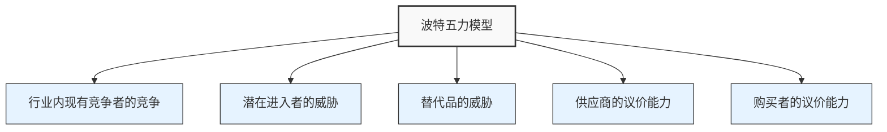
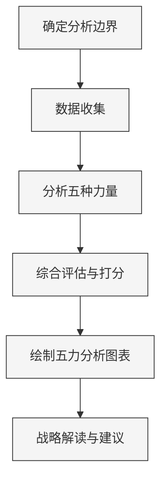
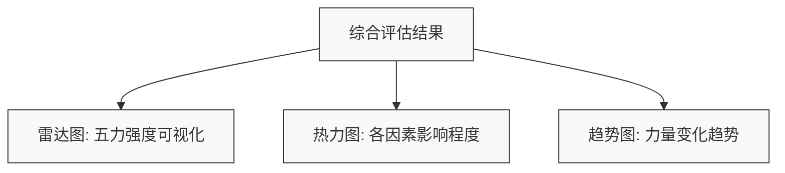

---
{"dg-publish":true,"tags":["商业分析","波特五力","竞争分析","战略工具","应用笔记"],"创建日期":"2024-04-26","更新日期":"2024-04-26","permalink":"/知识共享/002_商业分析/02_笔记/02_方法工具/波特五力模型应用笔记/","dgPassFrontmatter":true}
---

> [!quote] 概述
> 本笔记提供波特五力模型的系统应用指南，包括模型基础、应用步骤和方法、案例分析、常见误区及解决方案。旨在帮助商业分析师有效利用该模型分析行业竞争结构，制定战略决策。

## 1. 模型基础

### 1.1 模型概述

波特五力模型(Porter's Five Forces Model)由哈佛商学院教授迈克尔·波特(Michael Porter)于1979年提出，是分析行业竞争结构和盈利能力的经典工具。该模型认为行业内竞争状况由五种基本竞争力量决定：

### 1.2 五种力量详解

1. **行业内现有竞争者的竞争**
   - 反映了行业内企业之间竞争的激烈程度
   - 影响因素：竞争者数量、产业增长率、产品差异化程度、品牌忠诚度、转换成本、退出壁垒等

2. **潜在进入者的威胁**
   - 指新企业进入行业的可能性及其影响
   - 影响因素：进入壁垒、规模经济、品牌忠诚度、资金需求、政策法规、现有企业反击能力等

3. **替代品的威胁**
   - 指能够提供相似功能或服务的不同产品或服务
   - 影响因素：替代品性价比、转换成本、替代品创新程度、替代趋势等

4. **供应商的议价能力**
   - 反映供应商在价格、质量和条件方面的影响力
   - 影响因素：供应商集中度、替代供应商数量、转换成本、向前整合可能性、供应品重要性等

5. **购买者的议价能力**
   - 反映购买者在价格、质量和条件方面的影响力
   - 影响因素：购买者集中度、购买规模、产品差异化、产品对购买者的重要性、向后整合可能性等

### 1.3 五力之间的关系

这五种力量不是相互独立的，而是相互影响、相互作用的关系：

- 当某一力量变化时，可能会引起其他力量的连锁反应
- 力量之间可能存在互补或抵消效应
- 企业战略决策可能同时影响多种力量

## 2. 应用步骤与方法

### 2.1 应用流程

### 2.2 详细应用步骤

#### 步骤一：确定分析边界

**操作指引：**
1. 明确界定要分析的特定行业或细分市场
2. 确定地理范围（全球、区域或本地市场）
3. 确定产品或服务的类别和范围
4. 确定分析的时间框架（当前状况或未来趋势预测）

**质量检查点：**
- 分析边界是否清晰明确？
- 是否涵盖了所有相关市场参与者？
- 是否考虑了目标企业的战略关注点？

#### 步骤二：数据收集

**操作指引：**
1. 收集行业报告和市场研究数据
2. 分析竞争对手的财务报表和年报
3. 收集客户和供应商相关信息
4. 研究行业法规和政策
5. 进行专家访谈和调研

**所需数据类型：**
- 市场规模和增长率数据
- 主要竞争者市场份额
- 产品价格和成本结构
- 供应链信息
- 客户分布和购买行为
- 行业进入和退出历史

#### 步骤三：分析五种力量

对每种力量进行系统性分析，下面是每种力量的详细评估因素和评估问题：

**1. 行业内竞争**

| 评估因素 | 评估问题 |
|---------|---------|
| 竞争者数量 | 行业内主要竞争者有多少？市场集中度如何？ |
| 增长率 | 行业增长速度如何？是成熟市场还是快速增长市场？ |
| 产品差异化 | 各竞争者产品差异化程度如何？是同质化还是高度差异化？ |
| 固定成本 | 行业固定成本占比多大？是否导致价格战？ |
| 退出壁垒 | 企业退出行业难度如何？是否存在大量专用资产？ |
| 产能过剩 | 行业是否存在产能过剩？影响程度如何？ |

**2. 潜在进入者威胁**

| 评估因素 | 评估问题 |
|---------|---------|
| 规模经济 | 进入市场需要的最小规模是多少？现有企业的规模优势如何？ |
| 资本要求 | 进入行业需要的初始投资规模是多少？ |
| 品牌认知度 | 现有品牌忠诚度如何？新进入者建立品牌需要多少成本？ |
| 渠道准入 | 分销渠道的可获得性如何？现有企业是否控制关键渠道？ |
| 政府政策 | 是否存在监管限制或许可要求？ |
| 预期报复 | 现有企业可能采取何种报复措施？其资源实力如何？ |

**3. 替代品威胁**

| 评估因素 | 评估问题 |
|---------|---------|
| 替代品性价比 | 替代品的价格-性能比如何？是否优于现有产品？ |
| 转换成本 | 客户转向替代品的成本有多高？包括经济、时间和心理成本 |
| 替代倾向 | 买家对尝试替代品的意愿如何？ |
| 技术发展 | 替代技术的发展速度如何？是否具有创新优势？ |
| 替代品可得性 | 替代品的获取难度如何？是否普遍可得？ |

**4. 供应商议价能力**

| 评估因素 | 评估问题 |
|---------|---------|
| 供应商集中度 | 供应商数量如何？是否被少数几家控制？ |
| 替代供应商 | 可用的替代供应商有多少？切换难度如何？ |
| 供应品差异化 | 供应品是标准化还是高度定制化？ |
| 向前整合 | 供应商进入下游行业的可能性有多大？ |
| 行业重要性 | 该行业对供应商的总体销售的重要性如何？ |
| 转换成本 | 更换供应商的成本有多高？ |

**5. 购买者议价能力**

| 评估因素 | 评估问题 |
|---------|---------|
| 买家集中度 | 买家数量与规模如何？是否存在大客户？ |
| 购买规模 | 单个买家的采购量占供应商销售总额的比例多大？ |
| 产品重要性 | 产品对买家的业务或体验的重要性如何？ |
| 产品标准化程度 | 产品在不同供应商间的差异性多大？ |
| 向后整合能力 | 买家自己生产产品的可能性有多大？ |
| 信息优势 | 买家对产品、市场和成本的了解程度如何？ |

#### 步骤四：综合评估与可视化

**操作指引：**
1. 对每种力量进行1-5分的评分(1=非常弱，5=非常强)
2. 创建五力强度的雷达图或蜘蛛网图
3. 确定哪些力量对行业影响最大
4. 分析各力量的变化趋势

**评分表模板：**

| 竞争力量 | 评分(1-5) | 主要影响因素 | 变化趋势 |
|---------|----------|------------|----------|
| 行业内竞争 | | | |
| 潜在进入者威胁 | | | |
| 替代品威胁 | | | |
| 供应商议价能力 | | | |
| 购买者议价能力 | | | |

**可视化示例：**

#### 步骤五：战略解读与行动建议

**操作指引：**
1. 基于五力分析结果，确定行业吸引力和盈利潜力
2. 识别竞争优势和劣势
3. 确定关键成功因素
4. 提出战略选择和行动建议

**战略解读框架：**

| 五力强度 | 战略解读 | 可能的战略响应 |
|---------|---------|--------------|
| 行业内竞争强 | 可能降低盈利能力，需关注差异化和成本优势 | 产品差异化、提高切换成本、避免价格战 |
| 进入威胁高 | 需建立或加强进入壁垒 | 规模经济、品牌投资、专利保护、渠道控制 |
| 替代品威胁高 | 需提高价值主张和忠诚度 | 提高性价比、增加辅助服务、强化品牌 |
| 供应商议价能力强 | 需降低对特定供应商的依赖 | 多元化供应来源、向后整合、寻找替代原料 |
| 购买者议价能力强 | 需提高客户忠诚度和粘性 | 产品差异化、提高切换成本、客户细分 |

## 3. 应用案例：中国移动支付市场分析

### 3.1 分析背景

中国移动支付市场在过去十年经历了爆发式增长，由支付宝和微信支付主导，现已成为全球最大的移动支付市场。本案例使用波特五力模型分析该市场的竞争格局。

### 3.2 分析边界

- **行业定义**：中国境内的移动支付服务市场
- **地理范围**：中国大陆地区
- **时间框架**：当前状况(2024年)及未来3年趋势

### 3.3 五力分析

#### 1. 行业内竞争 (强度：5/5)

- **竞争者**：支付宝、微信支付占据超过90%市场份额，其他包括银联云闪付、京东支付等
- **增长率**：市场已趋于成熟，增长放缓，竞争更聚焦于服务质量和功能创新
- **差异化**：主要平台功能趋同，竞争焦点转向生态系统整合和用户体验
- **战略利害**：对主要参与者具有极高战略重要性，是数字生态核心入口

#### 2. 潜在进入者威胁 (强度：2/5)

- **规模壁垒**：需要庞大用户基础和商户网络，建立成本极高
- **资本需求**：需要大量资金支持营销、补贴和技术研发
- **监管要求**：支付牌照管控严格，政府对新进入者审查严格
- **现有竞争者优势**：成熟的生态系统、强大的网络效应和用户习惯

#### 3. 替代品威胁 (强度：3/5)

- **传统支付方式**：现金使用持续下降，银行卡支付整合到移动支付中
- **新兴技术**：区块链支付、中央银行数字货币(CBDC)、无感支付等新技术带来潜在替代可能
- **转换成本**：用户已深度习惯现有支付方式，但新技术若提供显著便利，转换成本不高

#### 4. 供应商议价能力 (强度：3/5)

- **主要供应商**：银行、银联、云服务提供商、硬件厂商
- **依赖程度**：支付平台需要银行和支付清算系统支持，存在一定依赖性
- **整合可能**：部分银行推出自有支付工具，形成竞争
- **转换成本**：更换基础设施供应商成本高，但多供应商策略降低了单一依赖

#### 5. 购买者议价能力 (强度：3/5)

- **用户端**：个人用户几乎无议价能力，但可自由选择支付平台
- **商户端**：大型商户对手续费有一定议价能力，小商户则几乎没有
- **多平台接入**：多数商户同时接入多个支付平台，降低对单一平台依赖
- **信息透明**：手续费和服务条款信息较为透明

### 3.4 综合评估与战略建议

**五力综合评分：**

| 竞争力量 | 评分(1-5) | 主要影响因素 | 变化趋势 |
|---------|----------|------------|----------|
| 行业内竞争 | 5 | 高市场集中度，巨头竞争激烈 | 持续高强度 |
| 潜在进入者威胁 | 2 | 高壁垒，严格监管 | 可能小幅上升 |
| 替代品威胁 | 3 | 数字货币等新技术出现 | 上升 |
| 供应商议价能力 | 3 | 依赖银行系统但有多个选择 | 稳定 |
| 购买者议价能力 | 3 | 大型商户有议价空间 | 稳定 |

**战略建议：**

1. **现有玩家策略**：
   - 加强生态系统建设，提高用户粘性
   - 开发创新支付场景，拓展应用边界
   - 布局新技术如CBDC集成，避免被替代
   - 差异化服务特定细分市场

2. **潜在进入者策略**：
   - 寻找未被充分服务的细分市场
   - 与现有金融机构合作降低进入壁垒
   - 创新技术路线，避开直接竞争
   - 考虑跨境支付等专业领域

3. **监管者考量**：
   - 平衡市场集中度与创新活力
   - 促进互操作性，减少垄断风险
   - 保护用户数据和交易安全

## 4. 常见分析误区与解决方法

### 4.1 静态分析问题

**误区**：将五力分析作为静态快照，忽略动态变化。

**解决方法**：
- 加入时间维度，分析各力量的变化趋势
- 识别潜在的颠覆性因素和早期信号
- 定期更新分析，监控关键指标变化

### 4.2 过于简化

**误区**：仅定性描述"高"或"低"，缺乏深度分析。

**解决方法**：
- 使用量化评估和评分系统
- 详细分析每种力量的多个构成因素
- 提供具体事实和数据支持评估结论

### 4.3 忽视行业内差异

**误区**：将整个行业视为同质体，忽略细分市场差异。

**解决方法**：
- 针对特定细分市场或战略群组进行单独分析
- 考虑不同区域市场的差异性
- 分析竞争格局在不同客户群中的变化

### 4.4 过度关注结构忽视能力

**误区**：只关注行业结构，忽略企业自身能力和资源。

**解决方法**：
- 将五力分析与内部能力评估相结合
- 考虑企业如何通过自身行动改变五力平衡
- 结合SWOT等内部分析工具使用

### 4.5 缺乏行动导向

**误区**：完成分析后未转化为具体战略行动。

**解决方法**：
- 为每种力量设计明确的战略响应
- 确定优先行动领域和关键成功因素
- 制定可衡量的战略目标和实施计划

## 5. 延伸应用

### 5.1 与PEST分析结合

将宏观环境分析与行业结构分析相结合：
- 政治因素如何影响行业监管和进入壁垒
- 经济因素如何影响购买力和行业增长
- 社会因素如何影响消费者行为和需求
- 技术因素如何影响替代品和产品创新

### 5.2 多时间框架分析

针对同一行业进行不同时间维度的分析：
- 短期(1-2年)：关注当前竞争态势和近期变化
- 中期(3-5年)：评估潜在进入者和替代品发展
- 长期(5年以上)：预测行业结构性变化和颠覆因素

### 5.3 战略情景规划

基于五力分析构建多种可能的未来情景：
- 识别影响五力平衡的关键不确定因素
- 构建多种可能的行业演变情景
- 为每种情景设计相应的战略应对方案

## 6. 自我评估清单

使用以下清单评估您的波特五力分析质量：

1. [ ] 是否明确定义了分析边界和范围？
2. [ ] 是否基于客观数据而非主观判断？
3. [ ] 是否全面分析了每种力量的所有主要因素？
4. [ ] 是否考虑了力量间的相互作用和关联？
5. [ ] 是否包含了时间维度和趋势分析？
6. [ ] 是否量化评估了各力量的强度？
7. [ ] 是否考虑了细分市场的差异？
8. [ ] 分析是否导向了明确的战略行动建议？
9. [ ] 是否包含了对关键假设的验证？
10. [ ] 是否计划了定期更新和调整？

## 7. 相关资源

1. 波特原著：《竞争战略》(Competitive Strategy)
2. 哈佛商业评论：[五力模型的更新与应用](https://hbr.org/2008/01/the-five-competitive-forces-that-shape-strategy)
3. 波特五力分析模板：[[知识共享/002_商业分析/04_模板/01_分析框架/波特五力分析模板\|04_模板/01_分析框架/波特五力分析模板]]
4. 行业分析框架：[[知识共享/002_商业分析/01_学习内容/04_市场与竞争分析/4.3 行业分析\|04_市场与竞争分析/4.3 行业分析]]
5. 竞争对手分析：[[知识共享/002_商业分析/01_学习内容/04_市场与竞争分析/4.2 竞争对手分析\|04_市场与竞争分析/4.2 竞争对手分析]]

---

> [!tip] 实践建议
> 波特五力分析不应是孤立的工具，而应成为更广泛战略分析的一部分。将其与SWOT分析、价值链分析等工具结合使用，能获得更全面的战略洞察。始终记住，分析的目的是为了支持决策，而非仅仅是信息收集。 