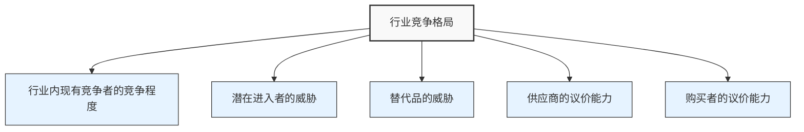
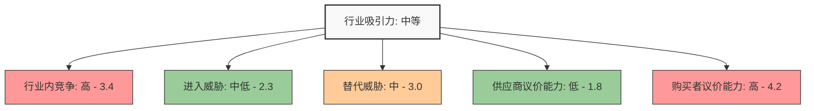
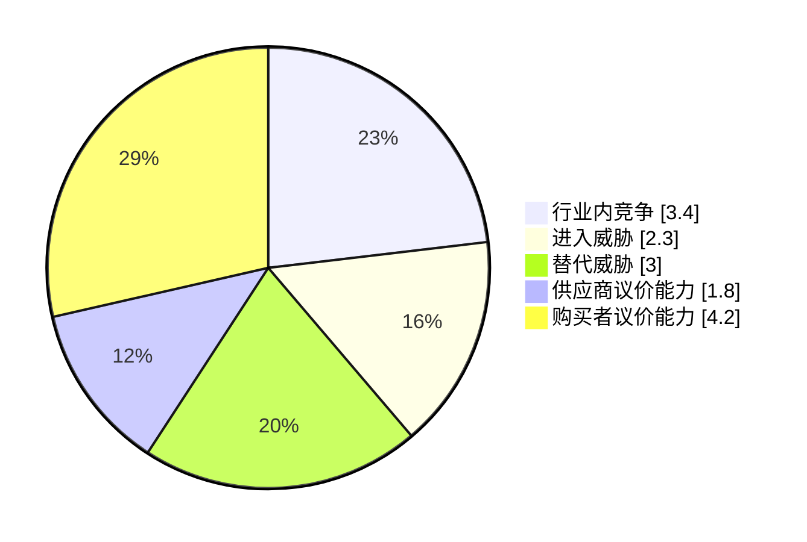
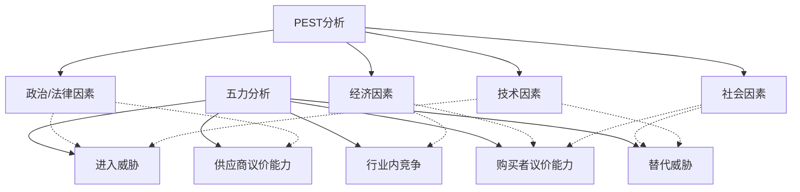

---
{"dg-publish":true,"tags":["商业分析","波特五力","竞争分析","方法工具"],"created":"2024-04-30","permalink":"/知识共享/002_商业分析/02_笔记/02_方法工具/波特五力模型应用笔记/","dgPassFrontmatter":true}
---

# 波特五力模型应用笔记

> [!quote] 概述
> 本笔记提供波特五力模型的实操应用指南，帮助分析师系统评估行业竞争格局和市场吸引力。包含详细的应用步骤、评估标准、分析框架和实际案例，使您能有效运用该模型进行战略决策。

## 一、模型基础

### 模型概述
波特五力模型(Porter's Five Forces)由迈克尔·波特(Michael Porter)于1979年提出，是分析行业竞争强度和市场吸引力的经典工具。该模型认为行业内的竞争受到五种力量的共同影响，这些力量决定了行业的总体盈利能力和竞争格局。

### 五种力量
1. **行业内现有竞争者的竞争程度**：评估同行业竞争对手之间的竞争强度
2. **潜在进入者的威胁**：评估新竞争者进入市场的难易程度
3. **替代品的威胁**：评估替代产品或服务对行业的影响
4. **供应商的议价能力**：评估供应商对行业的控制力
5. **购买者的议价能力**：评估客户对行业的影响力

### 适用场景
- 新市场进入决策分析
- 行业投资吸引力评估
- 公司战略定位与调整
- 竞争战略制定
- 业务多元化规划
- 市场风险评估

## 二、应用步骤

### 第一步：确定分析边界

**关键任务**：
- 明确定义待分析的行业或市场细分
- 确定产品/服务的范围
- 界定地理边界(全球、区域或本地)
- 确定分析的时间框架(当前状况或未来趋势)

**操作方法**：
1. 使用标准行业分类系统(如NAICS或SIC)帮助界定行业边界
2. 根据产品/服务的用途、特性和客户群确定市场细分
3. 与相关利益方确认分析边界的合理性
4. 记录边界假设和限制条件

**质量检查**：
- 分析边界是否足够具体而不过于宽泛？
- 是否符合公司的战略关注点？
- 是否能够获取此边界内的关键数据？

### 第二步：收集数据

**关键任务**：
- 收集每种力量相关的数据
- 识别主要参与者和影响因素
- 获取定量和定性数据

**数据来源**：

| 数据类型 | 来源 |
|---------|-----|
| 行业报告 | 咨询公司报告、行业协会、市场研究公司(如IBISWorld, Gartner) |
| 公司数据 | 年报、财务报表、投资者简报、公司网站 |
| 市场数据 | 市场份额、增长率、价格趋势、利润率 |
| 专家见解 | 行业专家访谈、分析师报告、学术研究 |
| 客户数据 | 客户调研、满意度调查、网络评论、社交媒体分析 |
| 监管信息 | 政府政策、法规变更、行业标准 |

**数据收集模板**：
为每种力量准备数据收集表格，明确关键指标和信息点

**质量检查**：
- 数据来源是否可靠？
- 数据是否足够全面和最新？
- 是否包含定量和定性两方面信息？
- 是否收集了不同角度的数据以避免确认偏见？

### 第三步：分析五种力量

#### 1. 行业内现有竞争者的竞争程度

**评估因素**：
- 竞争者数量和规模
- 行业增长率
- 产品差异化程度
- 品牌忠诚度
- 转换成本
- 退出壁垒
- 固定成本和存储成本
- 产能过剩情况
- 竞争策略多样性

**评估问题**：
- 市场中有多少主要竞争对手？它们的相对规模如何？
- 行业增长率是高还是低？是否存在市场份额争夺？
- 产品/服务差异化程度如何？
- 价格竞争的激烈程度如何？
- 竞争对手的战略定位有何不同？
- 退出行业的成本和障碍有多高？

**分析示例**：
高度竞争的标志包括：大量规模相似的竞争者、低增长率、低差异化、低转换成本、高固定成本、高退出壁垒。

#### 2. 潜在进入者的威胁

**评估因素**：
- 规模经济
- 品牌认知度和忠诚度
- 资本需求
- 转换成本
- 渠道准入
- 专利和技术壁垒
- 政府政策和法规
- 现有企业的预期反应
- 网络效应

**评估问题**：
- 新进入者需要多大规模才能达到具有竞争力的成本结构？
- 建立品牌需要多少时间和资源投入？
- 进入行业所需的初始资本投资有多大？
- 现有企业是否控制着关键分销渠道？
- 是否有重要的专利、许可或技术知识形成壁垒？
- 现有企业如何应对新进入者？

**分析示例**：
进入壁垒高的标志包括：显著的规模经济效应、强大的品牌忠诚度、高资本需求、复杂的监管许可要求。

#### 3. 替代品的威胁

**评估因素**：
- 替代品的性价比
- 替代品的可获得性
- 客户转向替代品的转换成本
- 客户使用替代品的倾向
- 替代品的创新和改进速度
- 替代品对行业的间接影响

**评估问题**：
- 有哪些产品/服务可以满足类似的需求？
- 替代品的价格-性能比如何？是否提供更好的价值？
- 客户尝试替代品的成本和难度有多大？
- 行业如何应对替代品的威胁？
- 替代品的技术进步和创新速度如何？

**分析示例**：
替代威胁高的标志包括：替代品价格低廉、性能相当或更佳、低转换成本、替代品行业快速创新。

#### 4. 供应商的议价能力

**评估因素**：
- 供应商集中度
- 供应商差异化程度
- 转换供应商的成本
- 供应商产品的重要性
- 供应商前向整合的可能性
- 行业在供应商总收入中的占比
- 替代投入品的可用性

**评估问题**：
- 行业的关键投入是由少数几家供应商还是众多供应商提供？
- 供应商提供的产品/服务有多独特？
- 更换供应商的难度和成本有多高？
- 供应商的产品对行业终端产品质量的影响有多大？
- 供应商向下游整合的威胁有多大？

**分析示例**：
供应商议价能力强的标志包括：高度集中的供应商、高度差异化的投入品、高转换成本、关键投入品、低替代可能性。

#### 5. 购买者的议价能力

**评估因素**：
- 购买者集中度
- 购买规模
- 产品差异化程度
- 转换成本
- 价格敏感性
- 购买者的利润率
- 向后整合的威胁
- 信息可获得性

**评估问题**：
- 客户群体的集中度如何？是否有少数几个大客户？
- 客户的采购量占总销售额的比例如何？
- 产品/服务在客户总成本中的占比有多大？
- 客户获取产品/服务信息的难易程度如何？
- 客户自行生产产品/服务的可能性有多大？

**分析示例**：
买方议价能力强的标志包括：高度集中的买方、大宗采购、标准化产品、低转换成本、高价格敏感度。

### 第四步：综合评估和绘制图表

**评分方法**：
为每种力量创建评分卡，使用1-5分制(1=非常弱，5=非常强)

**评分卡示例**(行业内竞争):

| 因素 | 权重 | 得分(1-5) | 加权得分 |
|-----|-----|-----------|---------|
| 竞争者数量和规模 | 25% | 4 | 1.0 |
| 行业增长率 | 20% | 2 | 0.4 |
| 产品差异化程度 | 20% | 3 | 0.6 |
| 转换成本 | 15% | 4 | 0.6 |
| 退出壁垒 | 10% | 5 | 0.5 |
| 固定成本/存储成本 | 10% | 3 | 0.3 |
| **总计** | **100%** | | **3.4** |

**五力综合评估**：
对五种力量进行加权平均，得出行业整体吸引力评分

**可视化表示**：

**使用雷达图表示**：

### 第五步：战略解读与行动建议

**解读焦点**：
- 识别最强和最弱的力量
- 确定影响力量强弱的关键因素
- 分析力量之间的相互作用
- 预测力量变化的趋势

**战略推导**：

| 力量状况 | 可能的战略方向 |
|---------|--------------|
| 高度竞争的行业 | 寻求差异化；关注特定细分市场；提高运营效率 |
| 低进入壁垒 | 构建规模经济；加强品牌建设；增加客户转换成本 |
| 高替代威胁 | 突出产品优势；创新；价格策略优化；增强客户体验 |
| 强供应商 | 多元化采购；向后整合；寻找替代品；建立战略合作 |
| 强买家 | 增加产品差异化；扩大客户群；提高转换成本；直接面向终端用户 |

**行动建议格式**：
1. 确定关键挑战和机会
2. 提出具体行动建议
3. 评估实施的资源需求和时间框架
4. 建议后续监控指标

## 三、应用案例：中国移动支付市场分析

### 行业定义
中国移动支付服务市场，包括通过智能手机和移动设备进行的支付交易服务。

### 五力分析

#### 1. 行业内现有竞争者的竞争程度：高(4.5)
- **主要竞争者**：支付宝(阿里巴巴)和微信支付(腾讯)占据超过90%市场份额
- **竞争强度**：双巨头激烈竞争，通过补贴、红包活动和新功能开发争夺市场
- **差异化**：服务同质化程度高，主要通过生态系统和用户体验差异化
- **增长速度**：市场仍在增长但增速放缓，加剧了市场份额争夺

#### 2. 潜在进入者的威胁：中低(2.5)
- **规模经济**：需要大量用户才能获取网络效应，新进入者难以快速建立
- **资本需求**：基础设施、技术开发和市场营销需要大量投资
- **监管壁垒**：支付牌照管控严格，新牌照发放受限
- **现有企业反应**：巨头拥有强大资源能够迅速应对新竞争者
- **品牌认知**：用户对现有平台高度信任，转换意愿低

#### 3. 替代品的威胁：中(3.0)
- **传统支付方式**：现金和银行卡使用仍存在，特别是在农村地区和老年群体
- **新型支付技术**：区块链支付、数字人民币等新兴技术可能形成替代
- **跨境支付解决方案**：国际支付提供商针对特定场景的解决方案

#### 4. 供应商的议价能力：中(3.0)
- **主要供应商**：银行、支付网络、技术提供商
- **银行议价能力**：银行提供基础结算服务，但支付平台掌握了客户接口
- **技术依赖**：云服务、安全解决方案供应商具有一定议价能力
- **供应商多样性**：多种技术供应选择降低了单一供应商的议价能力

#### 5. 购买者的议价能力：中低(2.5)
- **用户群体**：高度分散的个人用户，议价能力低
- **商户议价能力**：大型商户对手续费有一定议价能力，但依赖平台流量
- **转换成本**：用户转换平台成本中等(需重建支付习惯、关联账户等)
- **信息透明**：费率和服务条款相对透明，增加了一定议价能力

### 综合评估
移动支付市场整体竞争强度高，但具有较高的进入壁垒和中等的替代威胁。行业结构有利于现有大型参与者，新进入者面临显著挑战。

### 战略建议

**对现有参与者**：
1. 深化生态系统战略，通过拓展更多生活场景增加用户粘性
2. 加强技术创新，尤其在安全和用户体验方面
3. 关注细分市场(如农村、老年人、特定行业解决方案)
4. 积极探索与数字人民币的整合路径

**对潜在进入者**：
1. 聚焦特定细分市场或场景，避免与巨头正面竞争
2. 寻求差异化定位，如跨境支付、B2B场景等
3. 考虑与现有生态系统合作而非直接竞争
4. 投资创新技术，寻找市场空白点

## 四、常见分析误区与解决方法

### 误区1：静态分析而非动态分析
**问题**：仅关注当前行业状况，忽视力量变化的趋势和动态
**解决方法**：
- 分析每种力量的历史变化趋势
- 识别可能影响各种力量的外部因素
- 构建不同情景下的力量变化预测
- 定期更新分析以反映新发展

### 误区2：过于简化的定性分析
**问题**：简单地将力量归类为"高"或"低"，缺乏深度分析
**解决方法**：
- 使用量化评分系统(如1-5分制)
- 为每个力量开发多个评估维度
- 收集数据支持分析结论
- 使用权重反映各因素的相对重要性

### 误区3：忽视地理和细分市场差异
**问题**：将整个行业视为同质体，忽略细分市场的重要差异
**解决方法**：
- 明确定义分析的地理范围和细分市场
- 为不同细分市场单独进行分析
- 识别细分市场之间的相互作用
- 比较不同地理区域的竞争动态

### 误区4：没有与公司战略连接
**问题**：完成分析后未能转化为具体战略行动
**解决方法**：
- 明确分析目的(如市场进入决策、战略调整等)
- 将分析结果与公司能力和资源相结合
- 制定具体的战略选项和行动建议
- 建立监控机制评估战略执行效果

### 误区5：未考虑补充分析
**问题**：孤立使用五力模型，未结合其他分析工具
**解决方法**：
- 结合PEST分析评估宏观环境因素
- 使用价值链分析补充内部能力评估
- 结合SWOT分析提供全面战略视角
- 使用场景规划考虑未来行业演变

## 五、波特五力模型的延伸应用

### 与PEST分析结合

### 多时间框架分析
评估五力在不同时间点的状态：
- 过去3-5年的演变
- 当前状况
- 3-5年预测

### 竞争优势分析结合
将五力分析与核心竞争力和资源分析结合，评估公司相对于五力的定位优势。

## 六、自我评估清单

使用以下清单评估您的五力分析质量：

- [ ] 是否明确定义了行业/市场边界？
- [ ] 是否收集了充分的数据支持每种力量的分析？
- [ ] 是否使用了量化评分系统？
- [ ] 是否考虑了各力量的变化趋势？
- [ ] 是否分析了力量之间的相互作用？
- [ ] 是否将分析结果转化为具体的战略建议？
- [ ] 是否确定了需要进一步监控的关键指标？
- [ ] 是否考虑了不同市场细分的差异？
- [ ] 是否与其他分析工具结合使用？
- [ ] 是否计划定期更新分析？

## 相关资源
- [[知识共享/002_商业分析/02_笔记/01_概念速查/商业分析框架速查\|商业分析框架速查]]
- [[知识共享/002_商业分析/01_学习内容/04_市场与竞争分析/4.3 行业分析\|04_市场与竞争分析/4.3 行业分析]]
- [[04_模板/01_分析框架/波特五力分析模板\|04_模板/01_分析框架/波特五力分析模板]] 