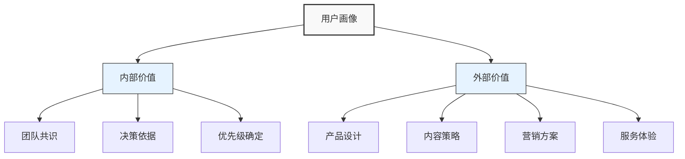
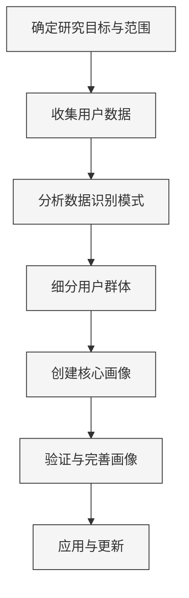

---
{"dg-publish":true,"tags":["商业分析","用户画像","用户研究","方法工具","应用笔记"],"创建日期":"2024-04-26","更新日期":"2024-04-26","permalink":"/知识共享/002_商业分析/02_笔记/02_方法工具/用户画像构建步骤/","dgPassFrontmatter":true}
---


# 用户画像构建步骤

> [!quote] 概述
> 本笔记提供用户画像(User Persona)的系统化构建方法，包括理论基础、详细操作步骤、数据收集与分析方法、应用场景和常见问题解决方案。旨在帮助产品、市场、研究人员创建有效的用户画像，指导产品设计和业务决策。

## 1. 用户画像基础

### 1.1 用户画像定义与价值

用户画像是对目标用户群体的典型代表的模拟化、具象化描述，是基于对真实用户研究创建的虚构人物形象。一个完整的用户画像通常包含人口统计特征、行为模式、动机、目标、痛点和偏好等多维度信息。

**核心价值**：
- 帮助团队建立对用户的共同理解和同理心
- 指导产品设计和功能优先级决策
- 提供评估产品决策的参考标准
- 优化营销和沟通策略
- 聚焦团队资源到关键用户需求上



### 1.2 用户画像类型

根据使用目的和详细程度，用户画像可分为多种类型：

1. **原型画像(Proto-Personas)**
   - 基于团队已有认知和假设创建
   - 创建速度快，成本低
   - 适用于项目初期或资源有限情况
   - 准确性相对较低，需后期验证

2. **调研画像(Research-Based Personas)**
   - 基于系统的用户研究数据构建
   - 包含详细的定性和定量信息
   - 准确性高，可靠性强
   - 需要投入较多时间和资源

3. **角色画像(Role-Based Personas)**
   - 基于用户在系统中扮演的角色创建
   - 适用于多角色产品或B2B场景
   - 强调工作职责、权限和工作流程

4. **目标导向画像(Goal-Directed Personas)**
   - 强调用户目标和动机
   - 关注用户行为背后的原因
   - 适用于产品策略和关键功能决策

### 1.3 用户画像构成要素

一个完整的用户画像通常包含以下核心要素：

| 要素类别 | 具体内容 | 作用 |
|---------|----------|------|
| 基本属性 | 姓名、年龄、职业、收入、教育程度、家庭状况等 | 建立具体人物形象，增强代入感 |
| 行为特征 | 使用习惯、购买行为、决策过程、技术熟悉度等 | 了解用户如何与产品/服务互动 |
| 心理特征 | 价值观、态度、动机、恐惧、期望等 | 理解行为背后的深层原因 |
| 目标与需求 | 短期目标、长期愿景、功能需求、情感需求等 | 确定产品应解决的核心问题 |
| 痛点与挑战 | 遇到的困难、障碍、担忧和烦恼 | 指导产品改进和创新方向 |
| 场景描述 | 典型使用场景、一天的生活、决策旅程等 | 提供情境化的用户理解 |
| 引述语录 | 代表性言论或表达 | 增加真实感和共情 |

## 2. 用户画像构建流程

### 2.1 构建流程概览

用户画像的构建是一个系统化的过程，从数据收集到最终应用，通常包含以下步骤：



### 2.2 详细构建步骤

#### 步骤一：确定研究目标与范围

**操作指引**：
1. 明确画像的用途和目标(产品设计、营销策略、内容创作等)
2. 确定需要覆盖的用户群体范围
3. 设定画像需要解答的关键问题
4. 评估可用资源和时间限制
5. 制定研究计划和时间表

**相关工具**：
- 研究计划模板
- 利益相关者访谈
- 项目范围文档

**质量检查点**：
- 目标是否具体、明确且可衡量？
- 范围是否合理且与资源匹配？
- 是否获得了相关利益方的认同？
- 是否明确了画像将如何应用？

#### 步骤二：收集用户数据

**操作指引**：
1. 选择适当的研究方法组合(定性+定量)
2. 设计研究工具(问卷、访谈提纲等)
3. 确定样本规模和招募标准
4. 执行数据收集活动
5. 整理和归档原始数据

**数据收集方法**：

| 方法类型 | 适用场景 | 优势 | 局限性 |
|---------|---------|------|--------|
| 用户访谈 | 深入了解用户动机、态度和行为 | 深度理解、灵活性强 | 耗时、样本量小 |
| 问卷调查 | 获取大量定量数据和基本属性 | 样本量大、成本低 | 洞察深度有限 |
| 用户观察 | 了解真实使用情境和行为 | 发现用户未意识到的问题 | 组织复杂、分析耗时 |
| 数据分析 | 行为模式识别和用户分群 | 客观、大规模 | 缺乏背景和动机理解 |
| 社交媒体分析 | 了解用户观点和讨论话题 | 真实自然、大量数据 | 代表性可能有偏差 |
| 竞争分析 | 了解竞品用户特征 | 节省成本、借鉴经验 | 可能与自身用户不同 |

**样本选择建议**：
- 定性研究：每个目标细分群体至少5-8名代表性用户
- 定量研究：根据总体规模确定，通常需要100-300+样本
- 确保样本覆盖核心用户群和边缘用户群
- 考虑多元化因素(地域、年龄、使用熟练度等)

**质量检查点**：
- 数据收集方法是否与研究目标匹配？
- 样本是否具有代表性？
- 数据是否涵盖了行为和动机双重维度？
- 是否有足够的数据支撑画像创建？

#### 步骤三：分析数据识别模式

**操作指引**：
1. 对定量数据进行统计分析，寻找趋势和相关性
2. 对定性数据进行编码和主题分析
3. 识别行为模式、共同特征和差异点
4. 提取关键洞察和发现
5. 整理分析结果，准备用于分群

**分析技术**：
- 相关性分析：识别变量间的关系
- 聚类分析：基于相似特征分组
- 因子分析：减少变量并识别关键因素
- 内容分析：系统性分析文本数据
- 旅程映射：分析用户行为序列和路径

**数据可视化**：
- 利用图表展示关键发现
- 创建亲和图整理主题和模式
- 使用标签云展示高频关键词
- 绘制行为流程图展示用户路径

**质量检查点**：
- 分析是否客观、系统，避免确认偏误？
- 是否区分了事实数据和解释推论？
- 是否找到了有意义的行为模式？
- 分析是否深入到动机和目标层面？

#### 步骤四：细分用户群体

**操作指引**：
1. 基于关键变量对用户进行分群
2. 确定最具影响力的分群维度
3. 评估各细分群体的规模和重要性
4. 筛选出需要创建画像的核心群体
5. 为每个群体定义初步特征

**分群维度**：
- 人口统计特征：年龄、性别、收入、教育等
- 行为特征：使用频率、功能偏好、购买习惯等
- 心理特征：动机、态度、价值观、生活方式等
- 需求特征：解决的问题、追求的收益等
- 环境特征：使用场景、外部影响因素等

**常用分群框架**：
- RFM模型(近度、频率、金额)
- 采用生命周期(新用户、成长用户、成熟用户等)
- VALS框架(价值观和生活方式)
- 工作待完成(Jobs To Be Done)
- 行为-态度矩阵

**质量检查点**：
- 分群是否基于有意义的差异？
- 每个群体是否内部同质、外部异质？
- 分群数量是否适当(通常3-7个)？
- 是否考虑了业务优先级和战略重要性？

#### 步骤五：创建核心画像

**操作指引**：
1. 为每个细分群体创建一个代表性画像
2. 为画像赋予真实感(姓名、照片、故事等)
3. 填充核心要素内容
4. 编写生动的背景故事和场景描述
5. 确保画像之间有明显区别

**画像要素填充指南**：

- **基本信息**：
  - 创建能代表群体的虚构人物
  - 选择真实但非特定的照片
  - 设计反映群体特征的人口统计信息

- **行为描述**：
  - 基于研究数据描述典型行为
  - 包含产品使用方式和偏好
  - 描述决策过程和影响因素

- **心理特征**：
  - 提炼核心动机和价值观
  - 描述态度和信念
  - 表达恐惧和希望

- **目标与痛点**：
  - 明确长期和短期目标
  - 详细描述遇到的挑战和困难
  - 列出阻碍目标实现的因素

- **场景与引述**：
  - 描述典型的一天或使用场景
  - 加入真实用户的代表性引述
  - 描述与产品的互动情境

**画像模板示例**：

```
# [画像名称]

## 基本信息
- 照片：[插入代表性照片]
- 年龄：XX岁
- 职业：XXXX
- 收入水平：XXXX
- 教育程度：XXXX
- 家庭状况：XXXX
- 居住地：XXXX

## 技术态度与能力
- 技术熟悉度：[1-5级]
- 常用设备：XXXX
- 应用偏好：XXXX
- 新技术接受度：XXXX

## 目标与动机
- 主要目标：XXXX
- 次要目标：XXXX
- 核心动机：XXXX
- 期望收益：XXXX

## 痛点与挑战
- 主要痛点：XXXX
- 担忧和顾虑：XXXX
- 遇到的障碍：XXXX
- 不满因素：XXXX

## 行为特征
- 使用习惯：XXXX
- 决策特点：XXXX
- 信息来源：XXXX
- 影响因素：XXXX

## 一天的生活
[描述典型一天的活动和经历]

## 代表性引述
"XXXX" [关于核心需求或态度的引述]
"XXXX" [关于产品使用的引述]

## 机会点
- [产品可以如何更好地满足该用户]
- [潜在的创新方向]
```

**质量检查点**：
- 画像是否基于实际数据而非假设？
- 是否包含了所有核心要素？
- 描述是否具体、生动且有代表性？
- 不同画像之间是否有清晰区别？
- 是否避免了刻板印象？

#### 步骤六：验证与完善画像

**操作指引**：
1. 与实际用户验证画像准确性
2. 与内部利益相关者审核画像
3. 根据反馈调整和完善
4. 测试画像在决策中的可用性
5. 最终定稿并正式发布

**验证方法**：
- 用户反馈会议：邀请目标用户审核画像
- 内部专家审核：邀请客服、销售等一线人员评估
- A/B测试：测试基于不同画像的设计方案
- 一致性检查：确保画像与原始数据吻合
- 应用测试：在实际决策中试用画像

**质量检查点**：
- 画像是否被目标用户认同？
- 内部利益相关者是否认可画像？
- 画像是否易于理解和使用？
- 画像是否避免了刻板印象和偏见？
- 是否达成了团队对用户的共识？

#### 步骤七：应用与更新

**操作指引**：
1. 确保画像在组织内广泛分享和使用
2. 将画像集成到设计和决策流程
3. 追踪画像的应用效果
4. 定期更新画像以反映用户变化
5. 建立画像管理和维护机制

**应用场景**：
- 产品设计与功能优先级排序
- 用户界面和体验设计
- 营销消息和内容创作
- 客户支持和服务设计
- 业务战略和发展方向决策

**更新维护**：
- 设定定期审核周期(通常6-12个月)
- 持续收集新的用户数据
- 监控关键假设的有效性
- 根据业务变化调整画像重点
- 记录画像演变历史

**质量检查点**：
- 画像是否被广泛采用？
- 是否有明确的画像应用指南？
- 是否建立了定期更新机制？
- 是否衡量画像的业务影响？

## 3. 用户画像应用案例：在线教育平台

### 3.1 项目背景

某在线教育平台提供各种职业技能课程，针对工作人士和学生。平台希望通过用户画像指导产品迭代和内容开发，更好地满足不同群体需求。

### 3.2 研究方法

该项目综合采用了多种研究方法：
- 分析平台800名用户的行为数据
- 进行在线问卷调查(N=350)
- 深度访谈24名不同类型用户
- 平台客服和讲师反馈分析
- 社交媒体评论内容分析

### 3.3 用户分群结果

通过数据分析，识别出四个主要用户群体：
- 职场进阶者(35%)：寻求晋升和技能提升
- 转行探索者(25%)：希望获得新领域技能
- 学生实习准备者(20%)：为就业做准备
- 知识爱好者(20%)：基于兴趣学习

### 3.4 核心画像示例：职场进阶者"李明"

```
# 李明 - 职场进阶者

## 基本信息
- 年龄：32岁
- 职业：互联网公司产品经理
- 工作经验：7年
- 收入：月收入25,000元
- 教育：本科
- 家庭：已婚，一个3岁的孩子
- 居住地：一线城市

## 技术态度与能力
- 技术熟悉度：4/5
- 常用设备：MacBook Pro，iPhone，iPad
- 应用偏好：效率类工具，专业软件
- 新技术接受度：较高，愿意尝试有明确价值的新工具

## 目标与动机
- 主要目标：晋升到高级产品经理职位
- 次要目标：拓展专业人脉网络
- 核心动机：职业成长和收入提升
- 期望收益：获得更高薪资和更大决策权

## 痛点与挑战
- 主要痛点：工作忙碌，难以挤出整块学习时间
- 担忧和顾虑：担心技能更新不够快，被更年轻的同事超越
- 遇到的障碍：理论知识与实际应用脱节
- 不满因素：一些课程内容过于基础，浪费时间

## 行为特征
- 学习习惯：偏好碎片化学习，晚上和周末学习
- 课程选择：注重案例和实战，看重讲师行业背景
- 信息来源：行业公众号，同事推荐，专业社区
- 价格敏感度：中等，愿意为高质量内容付费

## 一天的生活
早上7点起床，送孩子上幼儿园后赶往公司。工作日主要在产品会议和沟通协调中度过，晚上9点后才有时间看课程视频。通常选择30分钟以内的课程单元，会在通勤时间听音频内容。周末会抽出2-3小时集中学习和完成作业。经常在微信群和论坛中与同行交流学习心得。

## 代表性引述
"我需要在不耽误工作和家庭的情况下持续提升自己，否则很快就会被淘汰。"
"理论我都懂，我更需要的是行业大牛的实战经验和思考方法。"
"如果一个课程能让我下周工作就用上，那它就值这个价。"

## 机会点
- 提供更多高级实战案例和思维方法类内容
- 开发更灵活的学习路径和进度管理功能
- 增加行业专家互动和人脉拓展机会
- 提供学习证明和技能认证，助力职场晋升
```

### 3.5 画像应用成效

基于用户画像的应用，平台实施了一系列优化：

1. **产品调整**：
   - 推出"通勤模式"音频版内容
   - 开发"职业路径地图"功能
   - 增加案例库和实战项目库

2. **内容策略**：
   - 重新规划课程时长，增加15-30分钟模块
   - 增加行业专家经验分享内容
   - 针对不同画像开发差异化课程路径

3. **营销策略**：
   - 根据不同画像调整消息推送内容和时间
   - 开发针对性的获客渠道策略
   - 调整促销方案以匹配不同用户价值敏感点

**成效**：
- 课程完成率提升23%
- 用户满意度提高17%
- 用户活跃度增长31%
- 续费率提升19%

## 4. 常见问题与解决方法

### 4.1 数据不足或质量问题

**常见表现**：
- 样本量太小或不具代表性
- 数据过于散乱，难以识别模式
- 定量数据与定性洞察不匹配
- 过度依赖历史数据，缺乏前瞻性

**解决方法**：
- 采用混合研究方法，互相验证
- 利用原型画像作为起点，逐步完善
- 进行小规模、高质量的深度研究
- 结合行业数据和竞品分析补充信息
- 明确标注画像中的假设部分，后续验证

### 4.2 画像过于宽泛或刻板

**常见表现**：
- 画像描述过于一般化，缺乏特征
- 过度强调人口统计特征，忽视心理和行为特征
- 陷入刻板印象和偏见
- 画像之间区分不够明显

**解决方法**：
- 聚焦行为和动机而非纯粹人口统计
- 强调具体、可观察的特征和行为
- 多元化研究团队，避免单一视角
- 定期与真实用户对比验证
- 使用真实的用户引述增加真实感

### 4.3 画像数量过多或过少

**常见表现**：
- 创建太多画像，团队难以记忆和应用
- 画像过少，无法覆盖关键用户群体
- 重要的次要用户群体被忽略

**解决方法**：
- 控制主要画像在3-5个之间
- 使用主要/次要画像分层结构
- 根据业务优先级确定画像数量
- 采用"核心+卫星"模式，主画像加变体
- 定期评估画像覆盖率，调整构成

### 4.4 画像应用和维护不足

**常见表现**：
- 创建后存档，实际决策中未使用
- 画像过时但未更新
- 团队对画像认知不一致
- 难以量化画像应用价值

**解决方法**：
- 将画像整合到产品和设计流程
- 创建可视化的画像展示(海报、卡片等)
- 开发画像使用指南和检查清单
- 设立画像"拥有者"负责维护和推广
- 建立定期更新机制和评估标准
- 分享画像应用的成功案例

## 5. 高级应用技巧

### 5.1 动态用户画像

传统静态画像的进阶版本，根据用户生命周期和行为变化实时调整：

**实施方法**：
1. 建立基于用户旅程的多阶段画像
2. 识别触发用户状态变化的关键事件
3. 建立持续数据收集和分析机制
4. 开发画像状态转换模型
5. 定期验证和更新转换规则

**应用案例**：
- 电商平台根据购买频率动态调整用户画像
- 金融应用根据财务状况变化更新用户需求预测
- 内容平台根据兴趣变化调整推荐策略

### 5.2 数据驱动的量化画像

结合大数据分析和人工智能技术，创建更精准的用户画像：

**技术方法**：
1. 利用机器学习进行用户聚类
2. 建立预测模型识别行为模式
3. 使用自然语言处理分析用户反馈
4. 开发实时画像仪表板
5. 建立画像验证实验框架

**量化指标示例**：
- 使用频率得分
- 行为相似度指数
- 需求强度评分
- 价值观匹配度
- 细分群体归属概率

### 5.3 多维度画像矩阵

针对复杂产品和多样用户群体的画像组织方法：

**构建步骤**：
1. 识别2-3个关键变量作为矩阵维度
2. 为每个交叉点创建画像变体
3. 分析维度间的相互影响
4. 识别最关键的交叉点进行重点投入
5. 建立画像之间的关系图

**应用案例**：
- B2B产品按"公司规模×行业×角色"构建画像矩阵
- 全球产品按"地区×使用熟练度×用户年龄"分析
- 多渠道服务按"渠道偏好×技术接受度×需求复杂度"规划体验

### 5.4 极端用户画像

关注非典型用户以发现创新机会和边缘用例：

**关注对象**：
1. 高级用户/发烧友
2. 新手/初学者
3. 残障用户
4. 极端场景使用者
5. 拒绝用户/流失用户

**实施方法**：
- 针对性招募极端用户进行深度访谈
- 分析常见问题和客诉中的极端情况
- 研究产品"黑客"和创新使用方式
- 构建极端场景测试方案
- 开发包容性设计标准

## 6. 用户画像工具包

### 6.1 研究规划工具

**用户研究计划模板**：
- 项目目标与问题
- 研究方法选择
- 目标用户群体
- 样本规模和招募标准
- 时间表和资源分配
- 输出物和交付标准

**用户招募筛选问卷模板**：
- 基本人口统计信息
- 使用行为和经验
- 相关产品使用情况
- 技术态度和熟悉度
- 参与动机和可用性

### 6.2 数据收集工具

**半结构化访谈提纲**：
```
1. 破冰问题
   - 请简单介绍一下自己和日常工作/生活
   - 平时如何使用[相关产品]？

2. 使用行为探索
   - 描述最近一次使用[产品]的经历
   - 使用[产品]的典型场景是什么？
   - 使用频率和时间如何？

3. 动机和目标探索
   - 为什么选择使用[产品]？
   - 希望通过[产品]达成什么目标？
   - 使用过程中最看重什么因素？

4. 痛点和挑战探索
   - 使用[产品]时遇到的最大困难是什么？
   - 有哪些需求未被满足？
   - 使用过程中有哪些不满意的地方？

5. 决策过程探索
   - 如何了解并决定使用[产品]？
   - 考虑因素的优先级是什么？
   - 谁会影响你的决策？

6. 价值观和态度探索
   - 对[相关领域]的看法如何？
   - 在选择产品时最注重哪些价值？
   - 理想中的[产品]是什么样的？

7. 结束问题
   - 还有什么我们没有讨论到但你认为重要的内容？
   - 对[产品]有什么建议或期望？
```

**观察研究记录表**：
- 用户基本信息
- 使用环境描述
- 行为时序记录
- 情绪和表情记录
- 遇到的问题和解决方式
- 特殊行为和模式备注

### 6.3 分析与创建工具

**用户画像模板**：
[见3.4节示例]

**亲和图分析工具**：
- 用户引述和观察记录
- 初步分类和标签
- 模式识别和主题合并
- 洞察提炼和概念化

**画像评估清单**：
- 数据支持完整性检查
- 内在一致性评估
- 差异化程度评估
- 可操作性验证
- 团队共识检查

### 6.4 应用与维护工具

**画像应用指南**：
- 适用场景和限制
- 画像使用方法
- 决策映射建议
- 冲突解决策略
- 效果评估指标

**画像更新日志**：
- 版本和日期记录
- 主要变更内容
- 变更原因和依据
- 影响评估
- 验证计划

## 7. 延伸资源

### 7.1 推荐书籍和文章

1. Alan Cooper (2014). "About Face: The Essentials of Interaction Design"
2. Indi Young (2015). "Practical Empathy: For Collaboration and Creativity in Your Work"
3. Shlomo Goltz (2014). "A Closer Look At Personas" (Smashing Magazine)
4. Jeff Patton (2014). "User Story Mapping: Discover the Whole Story, Build the Right Product"
5. Steve Portigal (2013). "Interviewing Users: How to Uncover Compelling Insights"

### 7.2 在线工具和资源

1. 用户画像模板：[[04_模板/02_数据收集/用户画像模板\|04_模板/02_数据收集/用户画像模板]]
2. 用户研究指南：[[知识共享/002_商业分析/01_学习内容/05_用户与需求分析/5.1 用户研究方法\|05_用户与需求分析/5.1 用户研究方法]]
3. 行为分析框架：[[知识共享/002_商业分析/01_学习内容/05_用户与需求分析/5.5 用户行为分析\|05_用户与需求分析/5.5 用户行为分析]]
4. 用户访谈问卷模板：[[04_模板/02_数据收集/用户访谈问卷模板\|04_模板/02_数据收集/用户访谈问卷模板]]

---

> [!tip] 实践建议
> 用户画像不是创建后就放在一边的文档，而是应该成为团队日常决策的参考。将画像视觉化展示在工作区，在讨论功能和设计决策时经常提问"这对我们的XX用户有什么价值？"或"这个设计是否符合XX用户的需求？"，这样能确保用户画像真正融入产品开发过程，而不仅仅是文档架上的摆设。 