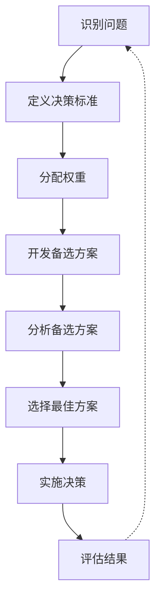
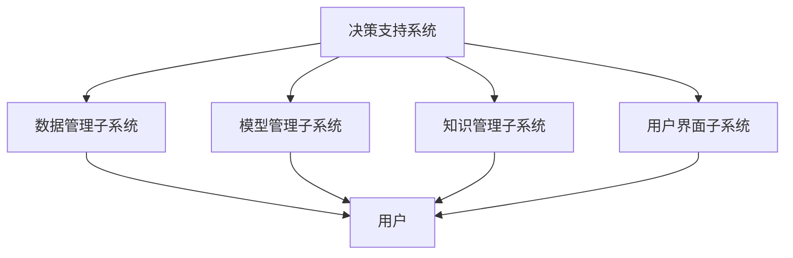
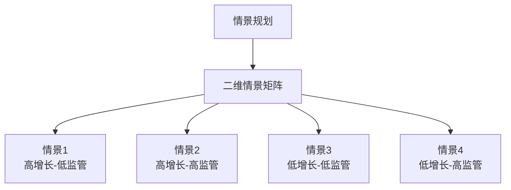
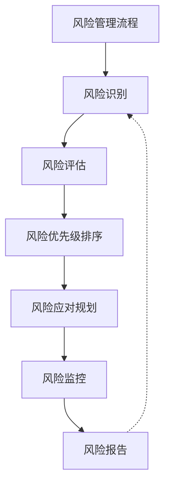
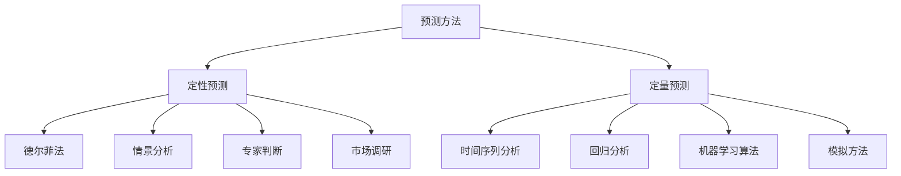
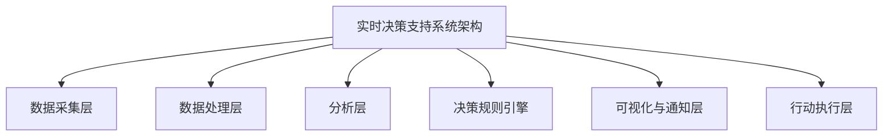

---
{"dg-publish":true,"tags":["商业分析","决策支持","复习"],"created":"2024-05-18","permalink":"/知识共享/002_商业分析/02_笔记/03_复习笔记/决策支持技术复习/","dgPassFrontmatter":true}
---


# 决策支持技术复习

> [!quote] 概述
> 本笔记整理了商业分析中常用的决策支持技术与方法，帮助系统回顾和复习决策支持的核心概念、框架和工具。适合快速检验学习成果和考前复习。

## 一、决策理论基础

### 决策的定义与类型
- **决策**：在多个可能的行动方案中进行选择的过程。
- **决策类型**：
  - **战略决策**：影响组织长期方向和目标的重大决策
  - **战术决策**：关于如何实现战略目标的中期决策
  - **运营决策**：日常业务运营中的短期决策
  - **程序化决策**：结构化、重复性强的决策
  - **非程序化决策**：非结构化、独特、复杂的决策

### 决策过程模型
- **理性决策模型**：
  1. 识别问题或机会
  2. 定义决策标准
  3. 分配权重给标准
  4. 开发备选方案
  5. 分析备选方案
  6. 选择最佳方案
  7. 实施决策
  8. 评估结果



- **有限理性模型**：承认决策者面临认知限制，追求"满意"而非"最优"解决方案
- **直觉决策模型**：基于经验和专业知识的快速决策过程

### 决策质量影响因素
- **信息质量**：决策所基于信息的准确性、完整性和相关性
- **时间压力**：可用于决策的时间
- **认知偏见**：影响判断的系统性心理倾向
- **风险偏好**：决策者对风险的态度和容忍度
- **组织因素**：组织文化、权力结构和政治因素
- **利益相关者影响**：不同利益相关者的需求和期望

## 二、决策支持系统

### 决策支持系统定义与特点
- **定义**：交互式计算机系统，帮助决策者利用数据和模型解决非结构化问题。
- **特点**：
  - 支持而非替代决策者
  - 适用于半结构化和非结构化问题
  - 结合数据访问、模型和用户界面
  - 交互式和灵活的使用方式
  - 支持不同层次的决策

### 决策支持系统组成
- **数据管理子系统**：存储和管理相关数据
- **模型管理子系统**：存储和管理分析模型
- **知识管理子系统**：提供专业知识支持
- **用户界面子系统**：实现系统与用户的交互
- **用户**：决策者和分析师



### 决策支持系统类型
- **数据驱动DSS**：强调数据访问和操作
- **模型驱动DSS**：强调量化模型的访问和操作
- **知识驱动DSS**：整合专业知识和规则
- **文档驱动DSS**：管理非结构化信息
- **通信驱动DSS**：支持团队协作决策
- **混合型DSS**：结合多种类型的特性

## 三、决策树分析

### 决策树基础概念
- **定义**：以树状图形表示的决策模型，显示决策过程中的选择、事件及其结果。
- **组成元素**：
  - **决策节点**：表示决策点，通常用方形表示
  - **概率节点**：表示不确定事件，通常用圆形表示
  - **结果**：表示各决策路径的最终结果，通常标注在树的末端
  - **分支**：连接各节点，表示可能的决策或事件

### 决策树构建步骤
1. **定义决策问题**：明确需要解决的问题
2. **识别备选方案**：确定所有可能的决策选项
3. **确定可能结果**：识别每个选择可能导致的结果
4. **估计概率**：为不确定事件分配概率
5. **计算结果值**：确定每个结果的价值或效用
6. **计算期望值**：计算每个决策分支的期望值
7. **敏感性分析**：测试关键假设的变化对决策的影响
8. **选择最优路径**：选择期望值最高的决策路径

### 决策树应用场景
- **产品开发决策**：评估不同产品开发路径
- **风险管理**：评估风险应对策略
- **投资决策**：评估不同投资选择
- **市场进入策略**：评估进入新市场的方式
- **资源分配**：优化有限资源的分配

### 决策树优缺点
- **优点**：
  - 直观可视化决策过程
  - 明确展示备选方案和潜在结果
  - 引入概率考虑不确定性
  - 便于敏感性分析
- **缺点**：
  - 复杂决策树可能难以管理
  - 依赖概率估计的准确性
  - 可能过于简化复杂决策
  - 难以捕捉所有相关因素

## 四、多标准决策分析

### 多标准决策分析基础
- **定义**：考虑多个、通常相互冲突的标准来评估决策选项的方法。
- **应用场景**：
  - 项目优先级排序
  - 供应商或合作伙伴选择
  - 产品或服务评估
  - 位置或场地选择
  - 技术或系统选择

### 多标准决策分析步骤
1. **确定目标**：明确决策的目标
2. **识别备选方案**：确定所有可行的选择
3. **确定评估标准**：确定用于评估的关键标准
4. **为标准分配权重**：根据重要性赋予每个标准权重
5. **评估备选方案**：针对每个标准评估各备选方案
6. **计算加权得分**：结合评分和权重计算总分
7. **敏感性分析**：测试不同权重对结果的影响
8. **做出决策**：根据分析结果选择最佳方案

### 常用多标准决策分析方法
- **简单加权法**：为每个标准分配权重，计算加权总分
- **层次分析法(AHP)**：通过成对比较建立标准和备选方案的层次结构
- **TOPSIS法**：基于与理想解的接近程度排序备选方案
- **ELECTRE法**：基于优势关系对备选方案进行排序
- **PROMETHEE法**：通过优先函数对备选方案进行排序

```mermaid
graph TD
    A[多标准决策分析] --> B[简单加权法]
    A --> C[层次分析法(AHP)]
    A --> D[TOPSIS法]
    A --> E[ELECTRE法]
    A --> F[PROMETHEE法]
```

## 五、情景规划

### 情景规划基础
- **定义**：系统地探索多种可能的未来情景，帮助组织为不同可能性做好准备的方法。
- **目的**：
  - 扩展思维，超越单一预测
  - 识别潜在风险和机会
  - 测试战略在不同条件下的稳健性
  - 创建适应性规划
  - 促进战略对话和学习

### 情景规划步骤
1. **确定焦点问题**：明确需要探索的核心问题或决策
2. **识别关键因素**：确定直接影响焦点问题的因素
3. **识别驱动力**：确定影响关键因素的宏观环境驱动力
4. **对驱动力排序**：根据影响程度和不确定性排序
5. **选择情景逻辑**：选择2-4个高影响、高不确定性驱动力作为情景构建轴
6. **发展情景**：构建不同情景的详细描述
7. **分析影响**：评估每个情景对组织的影响
8. **识别预警信号**：确定每个情景可能出现的早期信号
9. **制定适应性战略**：开发在多种情景下有效的战略

### 情景矩阵构建
- **二维情景矩阵**：基于两个关键不确定性构建四个情景
- **情景要素**：
  - 一致的内部逻辑
  - 基于当前趋势和驱动力
  - 具有差异性和挑战性
  - 与决策相关
  - 可信且有启发性



### 情景规划应用
- **战略规划**：测试和完善长期战略
- **风险管理**：识别和准备潜在风险
- **创新管理**：发现创新机会
- **产品开发**：探索未来市场需求
- **战略沟通**：促进组织内部战略对话

## 六、敏感性分析

### 敏感性分析基础
- **定义**：评估输入变量的变化如何影响模型输出的技术。
- **目的**：
  - 识别关键变量和参数
  - 量化不确定性的影响
  - 测试模型的稳健性
  - 指导数据收集优先级
  - 支持决策的风险评估

### 敏感性分析方法
- **单变量敏感性分析**：一次改变一个变量
- **多变量敏感性分析**：同时改变多个变量
- **情景敏感性分析**：测试特定情景组合
- **蒙特卡洛模拟**：使用随机抽样进行多次模拟
- **决策表**：显示不同变量组合的结果矩阵

### 敏感性分析应用步骤
1. **确定目标**：明确敏感性分析目标
2. **识别关键变量**：确定需要测试的变量
3. **定义变量范围**：确定每个变量的变化范围
4. **执行分析**：计算不同输入值下的输出结果
5. **分析结果**：识别对输出影响最大的变量
6. **可视化结果**：通过图表展示分析结果
7. **得出结论**：总结发现并提出建议

### 敏感性分析图表
- **龙卷风图**：展示不同变量影响大小的条形图
- **蜘蛛网图**：显示多个变量同时变化的影响
- **散点图**：显示输入与输出之间的关系
- **热图**：以颜色强度显示多变量交互影响

## 七、投资回报分析

### 投资回报率(ROI)分析
- **定义**：评估投资相对于投资成本的盈利能力的技术。
- **基本公式**：ROI = (净收益 / 投资成本) × 100%
- **用途**：
  - 评估投资项目的财务吸引力
  - 比较不同投资选择
  - 确定资源分配优先级
  - 衡量已完成投资的绩效

### 高级投资评估方法
- **净现值(NPV)**：未来现金流的折现价值减去初始投资
  - NPV > 0：投资可接受
  - NPV < 0：投资不可接受
- **内部收益率(IRR)**：使NPV等于零的折现率
  - IRR > 最低要求回报率：投资可接受
  - IRR < 最低要求回报率：投资不可接受
- **回收期**：收回初始投资所需的时间
- **投资回报指数(PI)**：未来现金流现值与初始投资比率

### 投资分析步骤
1. **确定初始投资**：计算所有前期成本
2. **预测现金流**：估计项目生命周期内的收入和支出
3. **确定折现率**：基于资本成本和风险水平
4. **计算投资指标**：计算NPV、IRR、回收期等
5. **执行敏感性分析**：测试关键假设变化的影响
6. **比较备选方案**：评估不同投资选择
7. **做出决策**：基于分析结果和战略考虑

### 非财务因素考量
- **战略一致性**：与组织战略目标的一致性
- **风险因素**：项目风险与组织风险承受能力
- **市场影响**：对市场地位和竞争力的影响
- **运营影响**：对运营效率和能力的影响
- **法规合规性**：满足法规要求的必要性
- **利益相关者影响**：对不同利益相关者的影响

## 八、风险分析与管理

### 风险分析基础
- **风险定义**：不确定事件或条件，若发生可能对目标产生积极或消极影响。
- **风险组成**：
  - 可能性：风险发生的概率
  - 影响：风险发生时的后果严重程度
  - 风险暴露 = 可能性 × 影响

### 风险管理流程
1. **风险识别**：确定可能影响目标的风险
2. **风险评估**：分析风险的可能性和影响
3. **风险优先级排序**：根据风险暴露确定优先处理顺序
4. **风险应对规划**：制定管理关键风险的策略
5. **风险监控**：持续监控和更新风险状态
6. **风险报告**：向利益相关者沟通风险状况



### 风险识别技术
- **头脑风暴**：团队集体识别潜在风险
- **德尔菲法**：专家意见收集和综合
- **检查表**：基于既往经验的风险清单
- **假设分析**：审查项目假设以识别风险
- **SWOT分析**：识别内部和外部风险
- **故障模式与影响分析(FMEA)**：识别可能的失败点

### 风险应对策略
- **规避**：改变计划以消除风险
- **减轻**：降低风险发生的概率或影响
- **转移**：将风险责任转移给第三方
- **接受**：承认风险存在并准备应对
- **利用**：利用积极风险创造价值
- **分享**：与他人分担积极风险以增加实现概率

### 风险分析工具
- **风险矩阵**：可视化风险可能性和影响
- **决策树**：分析不同风险情景的决策路径
- **蒙特卡洛模拟**：模拟多种风险变量的影响
- **期望货币价值分析**：量化风险的财务影响
- **风险雷达图**：跟踪多个风险类别的状态

## 九、预测分析

### 预测分析基础
- **定义**：使用历史数据、统计算法和机器学习技术来确定未来结果可能性的分析方法。
- **目的**：
  - 提前识别趋势和模式
  - 预测未来需求和行为
  - 识别风险和机会
  - 优化资源分配和计划
  - 支持前瞻性决策

### 预测方法类型
- **定性预测方法**：
  - 德尔菲法：系统化收集专家意见
  - 情景分析：构建可能的未来情景
  - 专家判断：依靠专业知识和直觉
  - 市场调研：收集客户和市场反馈
- **定量预测方法**：
  - 时间序列分析：基于历史数据模式预测
  - 回归分析：建立变量间关系模型
  - 机器学习算法：从数据中学习模式并预测
  - 模拟方法：在控制环境中模拟未来条件



### 时间序列预测技术
- **移动平均**：使用连续数据点的平均值平滑波动
- **指数平滑**：对近期数据赋予更大权重
- **ARIMA模型**：自回归综合移动平均模型
- **季节性调整**：处理周期性模式的方法
- **趋势分析**：识别长期增长或减少模式

### 预测准确性评估
- **平均绝对误差(MAE)**：预测值与实际值差异的平均绩对值
- **平均平方误差(MSE)**：预测误差平方的平均值
- **均方根误差(RMSE)**：MSE的平方根，与原数据单位一致
- **平均绝对百分比误差(MAPE)**：相对误差的平均值
- **追踪信号**：监控预测偏差方向的累积误差

## 十、群体决策支持

### 群体决策基础
- **定义**：多个决策者共同参与并达成共识的决策过程。
- **目的**：
  - 整合多元观点和专业知识
  - 增加决策接受度和支持度
  - 减少个人偏见影响
  - 提高决策质量和创造性
  - 分担决策责任

### 群体决策方法
- **德尔菲法**：多轮匿名专家调查与反馈
- **名义群体技术**：结构化的团队头脑风暴过程
- **多投票法**：通过投票确定优先级和选择
- **共识决策**：寻求所有成员接受的方案
- **电子会议系统**：利用技术支持同步或异步协作

### 群体决策支持系统(GDSS)
- **定义**：结合通信、计算和决策支持技术，支持群体协作决策的系统。
- **组成要素**：
  - 硬件：计算机、显示设备、通信设备
  - 软件：协作工具、决策支持工具
  - 人员：参与者、协调者
  - 程序：使用GDSS的协议和流程

### 群体决策挑战与对策
- **挑战**：
  - 群体思维：过度一致性压制不同意见
  - 地位影响：高地位成员意见主导
  - 信息共享不均：部分信息未被充分考虑
  - 社会惰化：责任分散导致努力减少
  - 会议效率低下：耗时且失去焦点
- **对策**：
  - 角色分配：明确不同决策角色和职责
  - 结构化程序：采用明确流程和规则
  - 匿名贡献：减少地位影响
  - 信息可视化：确保所有信息被考虑
  - 时间管理：设置明确时间框架

## 十一、实时决策支持

### 实时决策支持基础
- **定义**：提供实时数据和分析，支持及时决策的系统。
- **特点**：
  - 实时数据采集和处理
  - 低延迟响应
  - 自动化分析和决策规则
  - 随时可用的信息访问
  - 主动预警和通知

### 实时决策支持架构
- **数据采集层**：从多种来源实时收集数据
- **数据处理层**：数据清洗、集成和转换
- **分析层**：应用算法和模型进行实时分析
- **决策规则引擎**：基于预定义规则提供决策建议
- **可视化与通知层**：向用户展示结果并发送提醒
- **行动执行层**：支持决策执行和跟踪



### 实时决策应用场景
- **金融交易**：实时风险评估和交易决策
- **供应链管理**：实时库存管理和物流优化
- **客户体验**：实时个性化和服务调整
- **生产监控**：实时质量控制和工艺调整
- **安全监控**：实时威胁检测和响应
- **营销活动**：实时营销优化和调整

### 实时决策支持挑战
- **数据质量和完整性**：确保实时数据的准确性
- **延迟控制**：最小化数据处理和分析延迟
- **复杂性管理**：处理复杂决策规则和情况
- **系统可靠性**：确保系统持续可用
- **用户采纳**：确保决策者有效使用实时信息
- **过度自动化风险**：平衡自动化与人工判断

## 十二、思考问题与自我测试

1. 如何识别适合决策树分析的业务问题类型？
2. 在多标准决策分析中，如何确定合理的标准权重？
3. 情景规划如何帮助组织应对高度不确定的未来？
4. 敏感性分析在投资决策中有哪些具体应用？
5. 如何将定性和定量风险分析方法结合使用？
6. 在预测分析中，如何选择适合特定业务问题的预测方法？
7. 群体决策支持系统如何降低群体思维的风险？
8. 实时决策支持系统的关键性能指标有哪些？
9. 比较决策树和多标准决策分析在不同决策场景中的适用性。
10. 如何评估投资项目的非财务价值和战略价值？
11. 分析一个实际业务决策案例，应用适当的决策支持技术。
12. 如何在决策支持过程中有效管理数据质量问题？
13. 设计一个情景规划流程，用于某特定行业的战略规划。
14. 评估不同预测技术在销售预测中的优缺点。
15. 如何将人工智能和机器学习整合到决策支持系统中？

## 延伸学习资源

### 核心书籍
- Ralph L. Keeney & Howard Raiffa, 《决策与多目标决策》
- Paul J.H. Schoemaker, 《预测的艺术与科学》
- Sam L. Savage, 《不确定性决策：蒙特卡洛模拟与风险分析》
- Gary Klein, 《直觉决策》
- Thomas H. Davenport, 《数据分析竞争》

### 在线资源
- Decision Analysis Society (https://www.informs.org/Community/DAS)
- Society for Judgment and Decision Making (http://www.sjdm.org/)
- Forecasting Principles (https://forecasters.org/resources/forecasting-principles/)
- Risk Management Society (https://www.rims.org/)

### 工具
- TreePlan (决策树分析Excel插件)
- @RISK (风险分析和模拟软件)
- Expert Choice (AHP多标准决策分析)
- Crystal Ball (预测和风险分析)
- Tableau (数据可视化和分析)

## 相关概念

- [[知识共享/002_商业分析/01_学习内容/07_决策支持系统/7.1 决策理论基础\|07_决策支持系统/7.1 决策理论基础]] - 决策过程与偏见分析详解
- [[知识共享/002_商业分析/01_学习内容/07_决策支持系统/7.2 决策树分析\|07_决策支持系统/7.2 决策树分析]] - 构建与应用决策树完整指南
- [[知识共享/002_商业分析/01_学习内容/07_决策支持系统/7.3 情景规划\|07_决策支持系统/7.3 情景规划]] - 多情景分析与应对策略方法
- [[知识共享/002_商业分析/04_模板/04_决策支持/产品决策分析框架\|04_模板/04_决策支持/产品决策分析框架]] - 产品决策标准化分析框架
- [[04_模板/04_决策支持/风险评估矩阵模板\|04_模板/04_决策支持/风险评估矩阵模板]] - 风险评估实用矩阵模板 