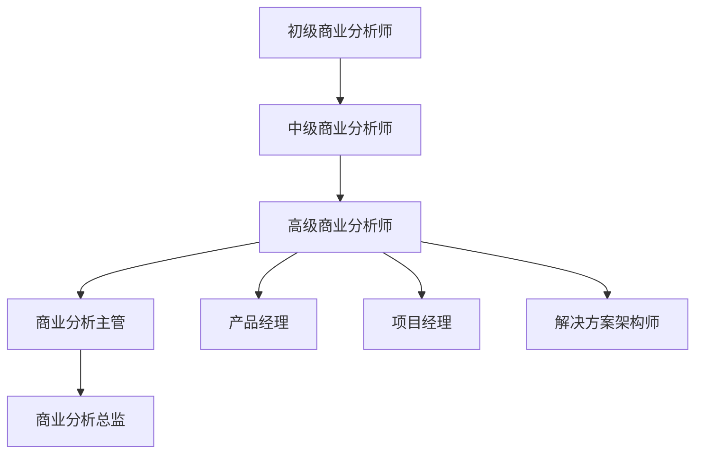
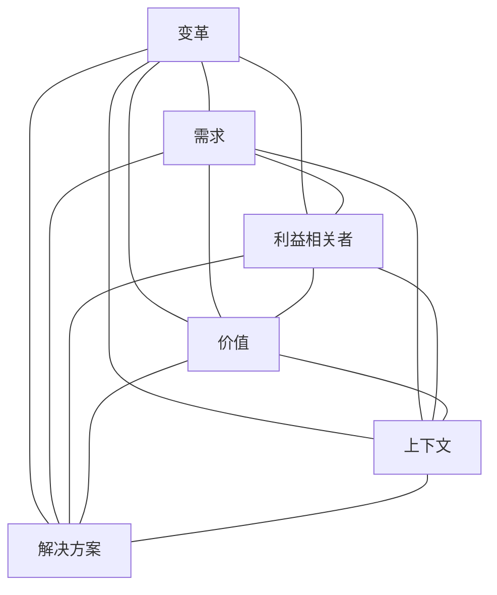
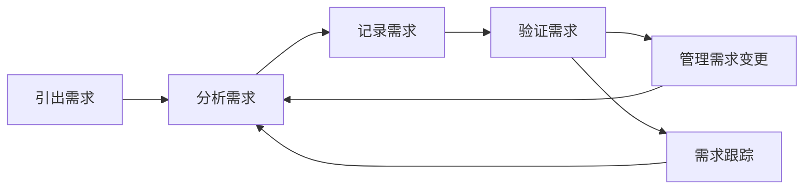

---
{"dg-publish":true,"tags":["商业分析","复习","基础"],"created":"2024-04-30","permalink":"/知识共享/002_商业分析/02_笔记/03_复习笔记/商业分析基础模块复习/","dgPassFrontmatter":true}
---

# 商业分析基础模块复习

> [!quote] 概述
> 本笔记整理了商业分析基础模块的核心概念、框架和方法，帮助系统回顾和复习商业分析的基础知识。适合快速检验学习成果和考前复习。

## 一、商业分析定义与范围

### 核心定义
- **商业分析**：识别业务需求并确定解决方案，使组织能够实现其目标的一系列任务和技术的集合。
- **商业分析师**：负责识别、分析和沟通各利益相关者的需求，并确保这些需求得到满足的专业人员。

### 商业分析的主要职能
1. **需求分析**：识别、澄清和记录业务需求
2. **业务流程分析**：分析和改进业务流程
3. **解决方案评估**：评估潜在解决方案并提出建议
4. **变革管理**：支持和促进组织变革
5. **战略分析**：分析业务环境和战略方向

### 商业分析的价值
- 降低项目失败风险
- 确保解决方案与业务需求一致
- 提高投资回报率
- 促进组织变革和创新
- 改善业务绩效

## 二、商业分析师的角色与职责

### 核心职责
- **需求引出与管理**：从利益相关者那里收集、分析和管理需求
- **业务问题分析**：识别和定义业务问题或机会
- **解决方案提出与评估**：提出解决方案并评估其有效性
- **沟通与协作**：在利益相关者之间进行有效沟通和协作
- **规划与监控**：规划和监控商业分析活动

### 关键能力
1. **分析思维**：逻辑思考和问题解析能力
2. **业务知识**：了解特定行业和业务领域
3. **沟通技巧**：有效沟通、谈判和引导
4. **技术理解**：理解技术解决方案的基本原理
5. **变革管理**：支持和引导组织变革
6. **决策能力**：在不完全信息条件下做出合理决策

### 商业分析师的发展路径

## 三、商业分析思维方式

### 系统思维
- 理解系统整体性和组成部分之间的相互关系
- 识别系统边界、输入、输出和反馈循环
- 考虑直接和间接影响
- 关注短期和长期效应

### 批判性思维
- 质疑假设和现有做法
- 从多个角度分析问题
- 评估信息可靠性和证据质量
- 避免常见认知偏见

### 创造性思维
- 跳出常规思维模式
- 结合不同领域的知识和经验
- 使用头脑风暴和发散思维技术
- 考虑多种可能性和替代方案

### 战略思维
- 聚焦长期目标和愿景
- 分析大环境趋势和影响
- 考虑机会成本和权衡取舍
- 将日常活动与长期目标联系起来

## 四、商业分析的核心框架

### BABOK指南(商业分析知识体系)框架
商业分析师国际协会(IIBA)的核心知识领域：
1. **业务分析规划与监控**
2. **需求引出与协作**
3. **需求生命周期管理**
4. **战略分析**
5. **需求分析与设计定义**
6. **解决方案评估**

### BACCM(商业分析核心概念模型)
六个核心概念，相互关联，构成商业分析的基础：
- **变革**：业务需求的目的是实现变革
- **需求**：设计和实施解决方案所需的信息
- **利益相关者**：与变革、需求或解决方案有关的群体
- **价值**：对利益相关者的重要性和相对价值
- **上下文**：环境因素影响变革范围
- **解决方案**：满足需求的特定方式

## 五、商业分析与相关学科的关系

### 商业分析与项目管理
- **相似点**：都关注价值交付和利益相关者管理
- **区别**：商业分析专注于确定"做什么"，项目管理专注于"如何做"
- **协作点**：需求范围管理、变更控制、风险管理

### 商业分析与产品管理
- **相似点**：都关注用户需求和价值创造
- **区别**：商业分析更关注问题分析和需求，产品管理更注重市场和产品生命周期
- **协作点**：需求优先级排序、用户研究、价值主张设计

### 商业分析与数据科学
- **相似点**：都使用数据进行分析和决策支持
- **区别**：商业分析关注更广泛的业务问题，数据科学专注于从数据提取洞察
- **协作点**：数据需求定义、分析结果解释、数据驱动决策

### 商业分析与变革管理
- **相似点**：都关注组织变革和改进
- **区别**：商业分析关注需求和解决方案，变革管理关注人员接受和过渡
- **协作点**：影响分析、利益相关者管理、组织准备度评估

## 六、商业分析的核心流程

### 需求生命周期
1. **引出需求**：从利益相关者收集需求信息
2. **分析需求**：详细研究和理解需求
3. **记录需求**：以适当的方式记录需求
4. **验证需求**：确保需求的准确性和完整性
5. **管理需求变更**：处理需求的变化和修改
6. **需求跟踪**：维护需求与其他项目元素之间的追溯性

### 解决方案评估流程
1. **识别评估标准**：确定评估解决方案的标准
2. **评估解决方案备选方案**：分析不同解决方案的优缺点
3. **选择推荐方案**：根据评估结果选择最佳方案
4. **监督解决方案实施**：监控解决方案的实施过程
5. **评估解决方案绩效**：衡量解决方案的有效性
6. **建议调整和改进**：提出改进建议

## 七、需求分析技术

### 需求分类
- **业务需求**：组织希望实现的高层次目标和成果
- **利益相关者需求**：特定利益相关者群体的需求和期望
- **解决方案需求**：描述解决方案特性的需求
  - **功能需求**：系统应该做什么
  - **非功能需求**：系统应该如何做(性能、可用性等)
- **过渡需求**：从当前状态转变为未来状态所需的临时能力

### 常用需求引出技术
1. **访谈**：与利益相关者一对一或小组交谈
2. **问卷调查**：通过结构化问题收集信息
3. **工作坊**：组织利益相关者参与的协作会议
4. **观察**：直接观察用户行为和工作流程
5. **文档分析**：审查现有文档和系统
6. **原型验证**：通过原型测试和验证需求

### 需求文档类型
- **业务需求文档(BRD)**：描述业务问题和目标
- **用户需求规格说明(URS)**：从用户角度描述需求
- **系统需求规格说明(SRS)**：详细描述系统功能和特性
- **用户故事**：从用户角度描述单一功能

## 八、业务流程分析

### 流程建模技术
- **流程图**：直观表示流程步骤和决策点
- **BPMN(业务流程建模符号)**：标准化的流程建模语言
- **价值流图**：识别价值创造和浪费环节
- **泳道图**：显示不同参与者的责任范围

### 流程分析步骤
1. **识别流程**：确定要分析的流程范围
2. **记录当前流程**：绘制当前流程的详细图表
3. **分析流程**：识别问题和改进机会
4. **设计未来流程**：设计改进后的流程
5. **实施变更**：推行流程改进方案
6. **监控成效**：评估流程改进结果

### 流程优化方法
- **精益方法**：消除浪费，提高价值交付
- **六西格玛**：减少变异，提高质量
- **业务流程再造**：从零开始重新设计流程
- **持续改进**：逐步优化现有流程

## 九、常用商业分析工具

### 需求管理工具
- Jira
- Trello
- Microsoft Azure DevOps
- Confluence

### 流程建模工具
- Microsoft Visio
- Lucidchart
- BPMN.io
- Draw.io

### 原型设计工具
- Figma
- Sketch
- Adobe XD
- Axure RP

### 数据分析工具
- Microsoft Excel
- Tableau
- Power BI
- Python/R

## 十、商业分析的发展趋势

### 数字化转型
- 数字技术改变业务模式和价值创造方式
- 商业分析师需了解数字技术和变革管理
- 敏捷和精益方法在数字转型中的应用

### 敏捷商业分析
- 商业分析与敏捷开发方法的融合
- 迭代和增量式需求开发
- 持续利益相关者参与
- 适应性规划和变更接受

### 数据驱动决策
- 基于数据的需求识别和验证
- 商业分析师数据素养要求提高
- 预测性分析在需求预测中的应用
- 大数据和AI对商业分析的影响

### 远程协作
- 虚拟团队和远程工作环境
- 协作工具和技术的演进
- 远程需求引出和验证的最佳实践

## 自我检测问题

1. 商业分析的核心价值是什么？
2. 商业分析师的五个关键职责是什么？
3. 系统思维和批判性思维在商业分析中的应用有何不同？
4. BABOK指南中的六个知识领域包括哪些？
5. BACCM模型的六个核心概念是什么？
6. 商业分析与项目管理的主要区别是什么？
7. 需求生命周期的主要阶段有哪些？
8. 功能需求和非功能需求的区别是什么？
9. 列举三种常用的需求引出技术及其优缺点。
10. 流程分析的主要步骤有哪些？
11. 精益方法和六西格玛在流程优化中的侧重点有何不同？
12. 数字化转型对商业分析师提出了哪些新要求？

## 相关学习资源

- [[知识共享/002_商业分析/01_学习内容/01_商业分析基础/1.1 商业分析概述\|01_商业分析基础/1.1 商业分析概述]]
- [[知识共享/002_商业分析/01_学习内容/01_商业分析基础/1.2 商业分析师的角色与职责\|01_商业分析基础/1.2 商业分析师的角色与职责]]
- [[知识共享/002_商业分析/01_学习内容/01_商业分析基础/1.3 商业分析的思维方式\|01_商业分析基础/1.3 商业分析的思维方式]]
- [[知识共享/002_商业分析/02_笔记/01_概念速查/商业分析核心概念速查\|02_笔记/01_概念速查/商业分析核心概念速查]]
- [[知识共享/002_商业分析/02_笔记/01_概念速查/商业分析框架速查\|02_笔记/01_概念速查/商业分析框架速查]] 