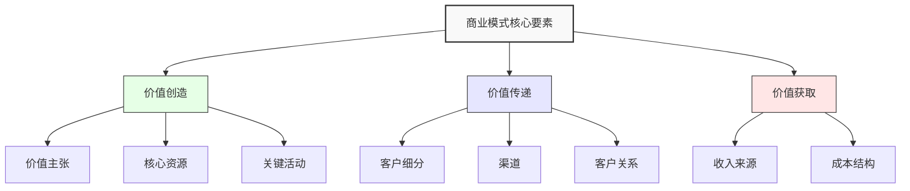
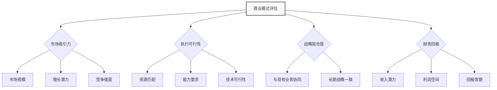

---
{"dg-publish":true,"tags":["商业分析","商业模式","复习","画布","价值主张"],"创建日期":"2024-05-18","permalink":"/知识共享/002_商业分析/02_笔记/03_复习笔记/商业模式分析复习/","dgPassFrontmatter":true}
---

## 核心概念提炼

### 商业模式基本概念
- **商业模式定义**：描述企业如何创造、传递和获取价值的逻辑框架
- **商业模式要素**：包括价值主张、客户细分、渠道、客户关系、收入来源、核心资源、关键活动、重要合作和成本结构
- **商业模式创新**：通过改变商业模式的一个或多个构成要素来创造新的价值

## 重点内容归纳

### 1. 商业模式画布
- **九大构建模块**：客户细分、价值主张、渠道、客户关系、收入来源、核心资源、关键活动、重要合作、成本结构
- **应用流程**：先确定客户细分和价值主张，再设计其他要素
- **常见误区**：过于关注收入模式而忽视价值创造和传递环节

### 2. 价值主张设计
- **价值主张画布**：分为客户侧（工作、痛点、收益）和产品侧（产品服务、痛点解决方案、收益创造）
- **价值类型**：功能价值、情感价值、社会价值、经济价值
- **差异化策略**：性能差异化、价格差异化、品牌差异化、便利性差异化

### 3. 收入模式分析
- **主要收入类型**：一次性销售、订阅模式、许可费、使用费、广告、佣金、增值服务
- **定价策略**：成本导向、竞争导向、价值导向、动态定价
- **收入多元化**：核心产品收入与周边产品收入的平衡

### 4. 成本结构分析
- **成本分类**：固定成本与可变成本、直接成本与间接成本
- **成本驱动**：规模效应、范围效应、经验曲线效应
- **成本优化**：精益思想、外包策略、自动化与数字化

### 5. 商业模式创新
- **创新维度**：价值创造创新、价值传递创新、价值获取创新
- **创新模式**：拆分型商业模式、长尾商业模式、多边平台、免费商业模式、开放商业模式
- **创新方法**：蓝海战略、颠覆性创新、用户主导创新

### 6. 平台商业模式
- **平台定义**：连接两个或多个相互依存的用户群体的业务模式
- **网络效应**：同侧网络效应与跨侧网络效应
- **平台启动策略**：补贴策略、先建立一侧用户群体

### 7. 商业模式可持续性评估
- **评估维度**：财务可持续性、市场可持续性、运营可持续性
- **防御机制**：转换成本、规模经济、品牌效应、网络效应、专利保护
- **适应性**：对市场变化的响应能力、迭代优化机制

## 方法论与工具总结

| 工具/方法 | 主要用途 | 关键步骤 | 优势 |
|---------|---------|---------|-----|
| 商业模式画布 | 设计和分析商业模式 | 填写九大构建模块，检查一致性 | 直观全面，易于沟通 |
| 价值主张画布 | 设计有竞争力的价值主张 | 分析客户需求与产品价值匹配度 | 聚焦用户需求与产品关系 |
| 精益画布 | 针对创业公司的轻量级商业模式 | 定义问题、解决方案、关键指标 | 更敏捷，适合初创企业 |
| 蓝海战略画布 | 创造无竞争的市场空间 | 分析行业因素，创建价值创新 | 寻找差异化竞争优势 |
| BMI模式库 | 借鉴成熟商业模式模式 | 识别模式，调整应用到自身业务 | 减少创新风险，提高成功率 |

## 案例精华

### 亚马逊商业模式
- **核心创新**：从单一在线书店到全品类电商、AWS云服务、Prime会员生态
- **关键决策**：以客户为中心、长期投资思维、持续技术创新
- **启示**：商业模式可以随着能力发展不断扩展，技术能力可成为新商业模式基础

### 小米商业模式
- **核心创新**："硬件+软件+服务"三层商业模式，硬件薄利多销，通过生态获利
- **关键决策**：互联网思维、粉丝经济、生态构建
- **启示**：商业模式可以打破传统行业利润分配方式，重构价值链

### Netflix转型
- **核心创新**：从DVD租赁到流媒体订阅，再到原创内容制作
- **关键决策**：押注流媒体技术，大数据驱动内容制作和推荐
- **启示**：商业模式要随技术发展和用户习惯变化而演进

### Airbnb商业模式
- **核心创新**：闲置资源共享，构建信任机制的双边平台
- **关键决策**：专注用户体验，构建评价体系和社区文化
- **启示**：平台型商业模式关键在于解决信任问题

## 实践应用速查

### 商业模式分析步骤
1. **描述现有商业模式**：使用商业模式画布完整描述
2. **诊断优劣势**：分析各模块内部一致性和外部竞争力
3. **探索改进机会**：识别痛点和增长点
4. **设计替代方案**：构思创新商业模式
5. **测试和实施**：小规模验证，迭代优化

### 商业模式创新检查清单
- [ ] 我们的价值主张是否足够独特且难以模仿？
- [ ] 收入模式是否可持续且具有增长潜力？
- [ ] 成本结构是否合理且具有规模效应？
- [ ] 是否建立了有效的进入壁垒？
- [ ] 商业模式各要素之间是否相互协调一致？
- [ ] 商业模式是否具备应对市场变化的适应性？

### 商业模式评估决策矩阵

## 个人理解与见解

### 商业模式思考框架
- 商业模式设计应从客户需求出发，而非产品技术
- 最好的商业模式能同时解决客户痛点和公司盈利问题
- 商业模式创新往往比技术创新带来更持久的竞争优势
- 数字化转型本质上是商业模式的重构，而非简单的技术应用
- 平台型商业模式成功的关键在于快速达到临界规模，触发网络效应

### 常见困惑与解答
- **问题**：商业模式与战略的区别？
  **解答**：商业模式描述如何创造和交付价值，战略则关注如何在竞争中取胜

- **问题**：如何平衡短期利润与长期发展？
  **解答**：成功的商业模式需要考虑可持续性，有时短期盈利牺牲是必要的投资

- **问题**：商业模式是否需要完全原创？
  **解答**：大多成功商业模式是对现有模式的创新组合，而非完全原创 